# AI Integration

<cite>
**Referenced Files in This Document**   
- [graphiti_core/llm_client/client.py](file://graphiti_core/llm_client/client.py)
- [graphiti_core/llm_client/config.py](file://graphiti_core/llm_client/config.py)
- [graphiti_core/llm_client/openai_client.py](file://graphiti_core/llm_client/openai_client.py)
- [graphiti_core/llm_client/anthropic_client.py](file://graphiti_core/llm_client/anthropic_client.py)
- [graphiti_core/llm_client/gemini_client.py](file://graphiti_core/llm_client/gemini_client.py)
- [graphiti_core/llm_client/groq_client.py](file://graphiti_core/llm_client/groq_client.py)
- [graphiti_core/llm_client/azure_openai_client.py](file://graphiti_core/llm_client/azure_openai_client.py)
- [graphiti_core/embedder/client.py](file://graphiti_core/embedder/client.py)
- [graphiti_core/embedder/openai.py](file://graphiti_core/embedder/openai.py)
- [graphiti_core/embedder/gemini.py](file://graphiti_core/embedder/gemini.py)
- [graphiti_core/embedder/voyage.py](file://graphiti_core/embedder/voyage.py)
- [graphiti_core/embedder/azure_openai.py](file://graphiti_core/embedder/azure_openai.py)
- [graphiti_core/cross_encoder/client.py](file://graphiti_core/cross_encoder/client.py)
- [graphiti_core/cross_encoder/bge_reranker_client.py](file://graphiti_core/cross_encoder/bge_reranker_client.py)
- [graphiti_core/cross_encoder/gemini_reranker_client.py](file://graphiti_core/cross_encoder/gemini_reranker_client.py)
- [graphiti_core/cross_encoder/openai_reranker_client.py](file://graphiti_core/cross_encoder/openai_reranker_client.py)
- [graphiti_core/search/search.py](file://graphiti_core/search/search.py)
- [graphiti_core/graphiti.py](file://graphiti_core/graphiti.py)
</cite>

## Table of Contents
1. [LLM Client Abstraction](#llm-client-abstraction)
2. [Provider-Specific LLM Implementations](#provider-specific-llm-implementations)
3. [Embedding Services](#embedding-services)
4. [Cross-Encoder Reranking](#cross-encoder-reranking)
5. [AI Service Orchestration](#ai-service-orchestration)
6. [Configuration and Customization](#configuration-and-customization)
7. [Error Handling and Resilience](#error-handling-and-resilience)

## LLM Client Abstraction

The LLM client abstraction in Graphiti provides a unified interface for interacting with various large language model providers through the `LLMClient` base class. This abstract base class defines the core contract for all LLM implementations, ensuring consistent behavior across different providers while allowing for provider-specific optimizations.

The `LLMClient` class implements several key features that are shared across all providers:
- **Caching**: Responses can be cached to disk using the `diskcache` library to avoid redundant API calls
- **Tracing**: Integration with the tracing system for observability and performance monitoring
- **Input sanitization**: Automatic cleaning of input text to remove invalid Unicode and control characters
- **Multilingual support**: Automatic addition of language extraction instructions to system messages
- **Retry logic**: Built-in retry mechanism for handling transient failures

The client uses a configuration-driven approach through the `LLMConfig` class, which encapsulates provider-specific settings such as API keys, model names, base URLs, temperature, and token limits. This design allows for easy configuration and swapping of LLM providers without changing application code.

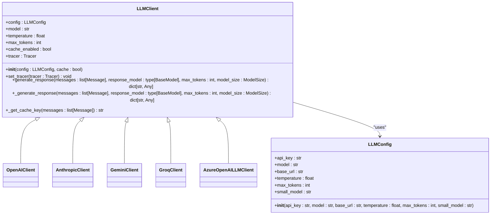

**Diagram sources**
- [graphiti_core/llm_client/client.py](file://graphiti_core/llm_client/client.py#L66-L243)
- [graphiti_core/llm_client/config.py](file://graphiti_core/llm_client/config.py#L28-L69)

**Section sources**
- [graphiti_core/llm_client/client.py](file://graphiti_core/llm_client/client.py#L1-L243)
- [graphiti_core/llm_client/config.py](file://graphiti_core/llm_client/config.py#L1-L69)

## Provider-Specific LLM Implementations

Graphiti supports multiple LLM providers through specialized implementations that inherit from the base `LLMClient` class. Each implementation handles provider-specific API requirements, authentication methods, and response formats while maintaining the same interface.

### OpenAI Implementation

The `OpenAIClient` provides integration with OpenAI's API, supporting both standard chat completions and structured output using OpenAI's beta parse API. It extends the `BaseOpenAIClient` which contains shared functionality for OpenAI-based providers.

Key features:
- Support for structured output via `response_format={'type': 'json_object'}`
- Integration with OpenAI's beta parse API for Pydantic model validation
- Configurable reasoning and verbosity parameters
- Automatic handling of API key and base URL configuration

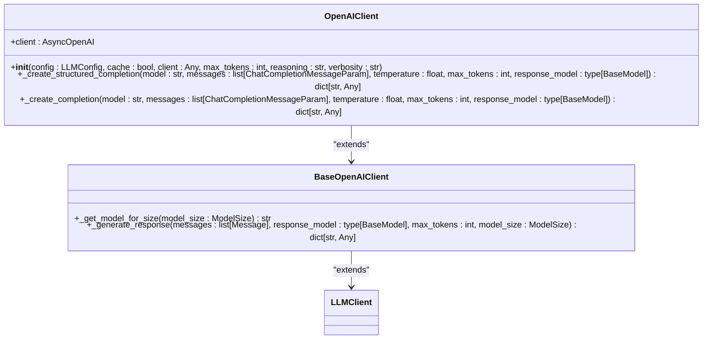

**Diagram sources**
- [graphiti_core/llm_client/openai_client.py](file://graphiti_core/llm_client/openai_client.py#L27-L106)
- [graphiti_core/llm_client/openai_base_client.py](file://graphiti_core/llm_client/openai_base_client.py)

**Section sources**
- [graphiti_core/llm_client/openai_client.py](file://graphiti_core/llm_client/openai_client.py#L1-L106)

### Anthropic Implementation

The `AnthropicClient` integrates with Anthropic's API using their tool-based approach for structured output. Instead of relying on JSON mode, it creates tool definitions based on Pydantic models and uses Anthropic's tool calling capability.

Key features:
- Tool-based structured output using Anthropic's tool system
- Fallback JSON extraction from text responses
- Support for all Anthropic models including Claude 3 series
- Automatic API key retrieval from environment variables
- Custom retry logic with error context injection

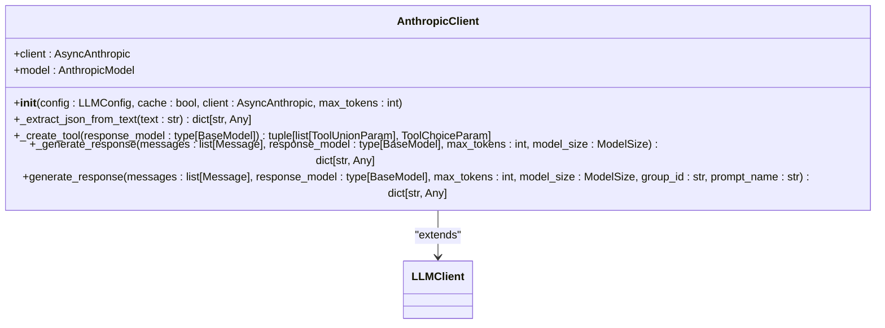

**Diagram sources**
- [graphiti_core/llm_client/anthropic_client.py](file://graphiti_core/llm_client/anthropic_client.py#L68-L359)

**Section sources**
- [graphiti_core/llm_client/anthropic_client.py](file://graphiti_core/llm_client/anthropic_client.py#L1-L359)

### Google Gemini Implementation

The `GeminiClient` provides integration with Google's Gemini API, supporting both standard and structured output modes. It handles Gemini-specific features like thinking configuration and safety filters.

Key features:
- Support for Gemini's structured output with schema validation
- Safety and prompt block detection with appropriate error handling
- Model-specific token limits based on model version
- JSON salvage functionality for truncated responses
- Thinking configuration for supported models

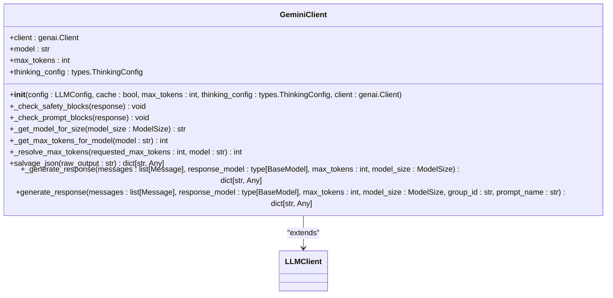

**Diagram sources**
- [graphiti_core/llm_client/gemini_client.py](file://graphiti_core/llm_client/gemini_client.py#L70-L448)

**Section sources**
- [graphiti_core/llm_client/gemini_client.py](file://graphiti_core/llm_client/gemini_client.py#L1-L448)

### Groq Implementation

The `GroqClient` provides integration with Groq's API, which offers high-performance inference for Llama models. It follows a straightforward implementation pattern similar to OpenAI.

Key features:
- Support for Groq's Llama models
- JSON mode output for structured responses
- Simple retry logic for rate limit handling
- Default configuration for optimal performance

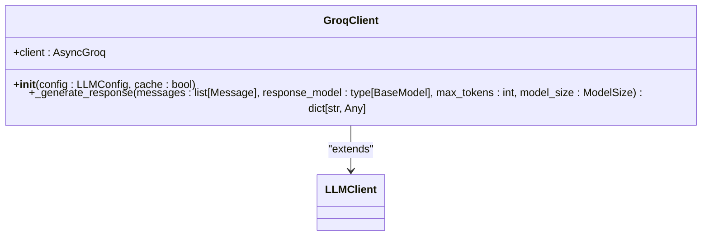

**Diagram sources**
- [graphiti_core/llm_client/groq_client.py](file://graphiti_core/llm_client/groq_client.py#L48-L86)

**Section sources**
- [graphiti_core/llm_client/groq_client.py](file://graphiti_core/llm_client/groq_client.py#L1-L86)

### Azure OpenAI Implementation

The `AzureOpenAILLMClient` provides integration with Azure OpenAI Service, supporting both standard and structured output modes. It's designed to work with Azure's specific API endpoints and authentication requirements.

Key features:
- Integration with Azure OpenAI's beta parse API
- Support for Azure-specific client configuration
- No caching by default (can be enabled through base class)
- Compatibility with Azure's API structure

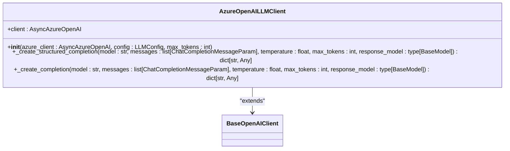

**Diagram sources**
- [graphiti_core/llm_client/azure_openai_client.py](file://graphiti_core/llm_client/azure_openai_client.py#L30-L78)

**Section sources**
- [graphiti_core/llm_client/azure_openai_client.py](file://graphiti_core/llm_client/azure_openai_client.py#L1-L78)

## Embedding Services

Graphiti provides a flexible embedding system through the `EmbedderClient` abstraction, supporting multiple embedding providers for vector representation of text. This system enables semantic search and similarity calculations across different models and providers.

### Embedder Architecture

The embedder system follows a similar pattern to the LLM client, with a base `EmbedderClient` abstract class and provider-specific implementations. The system supports both single and batch embedding operations, with configurable dimensionality.

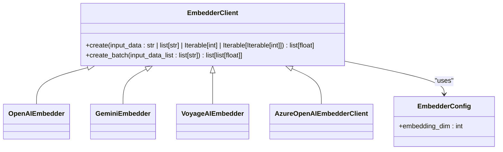

**Diagram sources**
- [graphiti_core/embedder/client.py](file://graphiti_core/embedder/client.py#L30-L39)
- [graphiti_core/embedder/openai.py](file://graphiti_core/embedder/openai.py)
- [graphiti_core/embedder/gemini.py](file://graphiti_core/embedder/gemini.py)
- [graphiti_core/embedder/voyage.py](file://graphiti_core/embedder/voyage.py)
- [graphiti_core/embedder/azure_openai.py](file://graphiti_core/embedder/azure_openai.py)

**Section sources**
- [graphiti_core/embedder/client.py](file://graphiti_core/embedder/client.py#L1-L39)

### OpenAI Embeddings

The `OpenAIEmbedder` provides integration with OpenAI's embedding models, supporting both standard OpenAI and Azure OpenAI clients. It allows for configuration of the embedding model and API endpoints.

Key features:
- Support for both `AsyncOpenAI` and `AsyncAzureOpenAI` clients
- Configurable embedding model (default: text-embedding-3-small)
- Dimensionality truncation to match configured embedding dimension
- Batch and single embedding operations

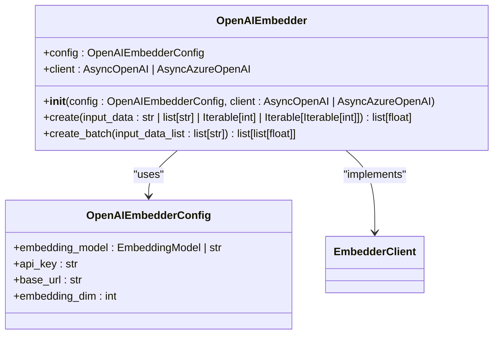

**Diagram sources**
- [graphiti_core/embedder/openai.py](file://graphiti_core/embedder/openai.py#L33-L67)

**Section sources**
- [graphiti_core/embedder/openai.py](file://graphiti_core/embedder/openai.py#L1-L67)

### Google Gemini Embeddings

The `GeminiEmbedder` provides integration with Google's Gemini embedding models, supporting both the legacy text-embedding models and the newer gemini-embedding models.

Key features:
- Support for different batch size requirements based on model
- Automatic batching with fallback to individual processing
- Configurable embedding model and dimensionality
- Error handling for empty or invalid embeddings

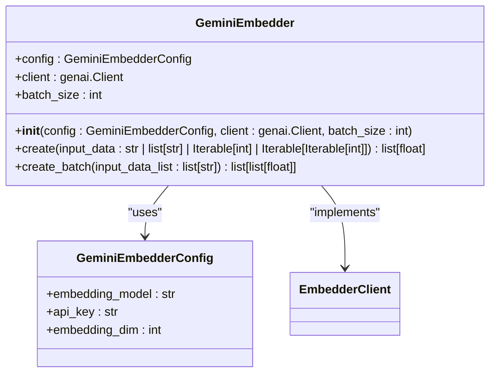

**Diagram sources**
- [graphiti_core/embedder/gemini.py](file://graphiti_core/embedder/gemini.py#L50-L184)

**Section sources**
- [graphiti_core/embedder/gemini.py](file://graphiti_core/embedder/gemini.py#L1-L184)

### Voyage AI Embeddings

The `VoyageAIEmbedder` provides integration with Voyage AI's embedding models, known for their performance in retrieval-augmented generation scenarios.

Key features:
- Support for Voyage AI's async client
- Input normalization and cleaning
- Configurable embedding model (default: voyage-3)
- Batch and single embedding operations with dimensionality truncation

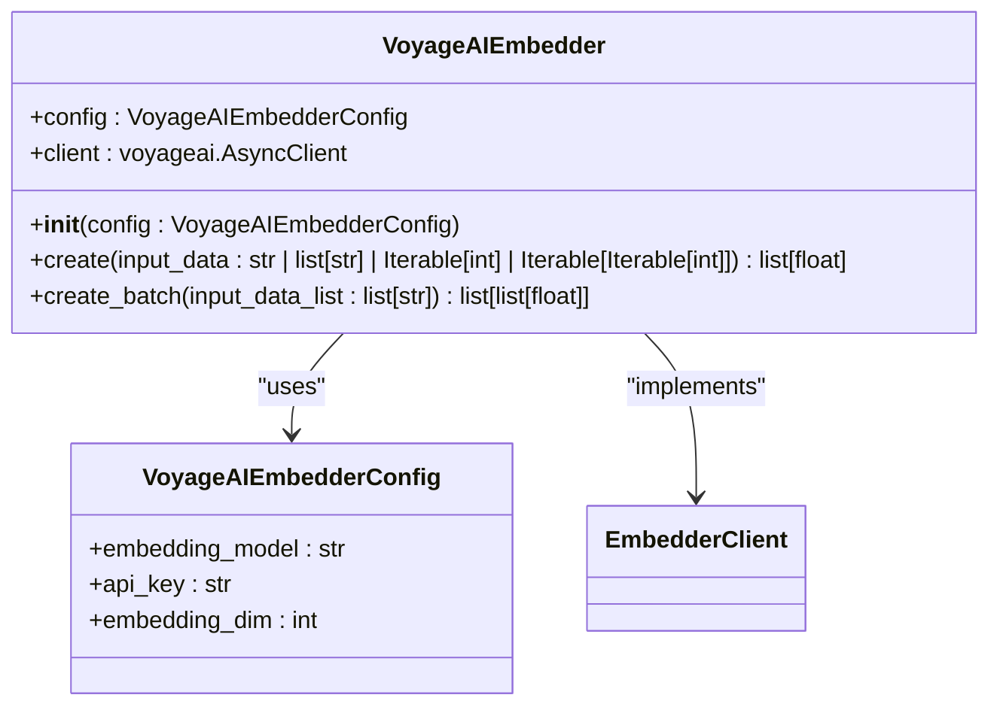

**Diagram sources**
- [graphiti_core/embedder/voyage.py](file://graphiti_core/embedder/voyage.py#L43-L77)

**Section sources**
- [graphiti_core/embedder/voyage.py](file://graphiti_core/embedder/voyage.py#L1-L77)

### Azure OpenAI Embeddings

The `AzureOpenAIEmbedderClient` provides a lightweight wrapper for Azure OpenAI's embedding client, implementing the `EmbedderClient` interface.

Key features:
- Direct integration with Azure OpenAI client
- Simple embedding creation with error handling
- Support for both single and batch operations
- Configurable model name

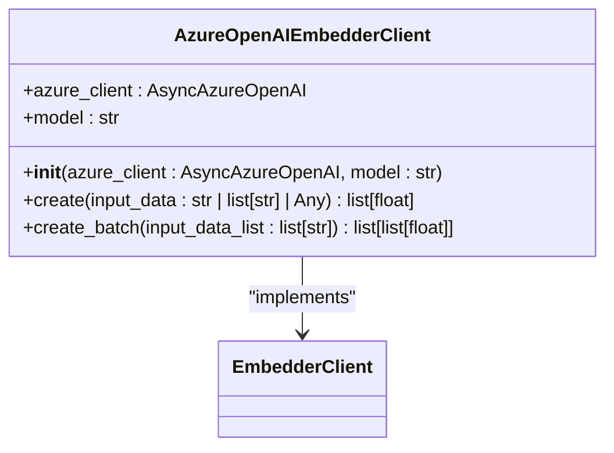

**Diagram sources**
- [graphiti_core/embedder/azure_openai.py](file://graphiti_core/embedder/azure_openai.py#L27-L65)

**Section sources**
- [graphiti_core/embedder/azure_openai.py](file://graphiti_core/embedder/azure_openai.py#L1-L65)

## Cross-Encoder Reranking

Graphiti implements cross-encoder reranking to improve search relevance by reordering results based on their semantic similarity to a query. This system uses the `CrossEncoderClient` abstraction with multiple implementations for different models.

### Cross-Encoder Architecture

The cross-encoder system provides a unified interface for reranking passages based on query relevance, with implementations for both local and API-based models.

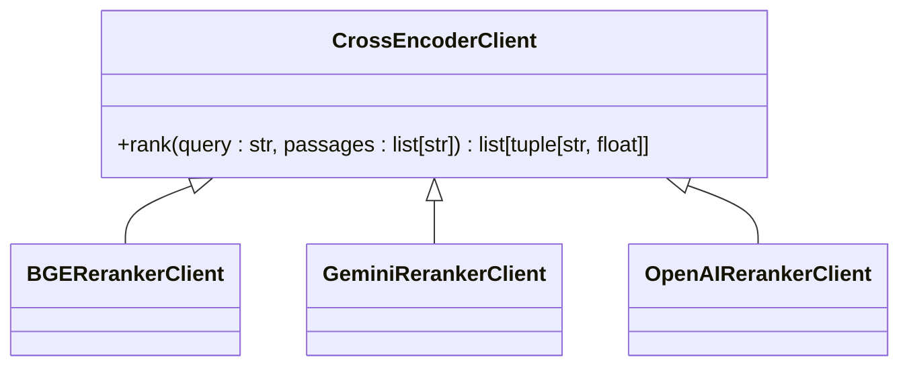

**Diagram sources**
- [graphiti_core/cross_encoder/client.py](file://graphiti_core/cross_encoder/client.py#L20-L41)

**Section sources**
- [graphiti_core/cross_encoder/client.py](file://graphiti_core/cross_encoder/client.py#L1-L41)

### BGE Reranker

The `BGERerankerClient` uses the BAAI/bge-reranker-v2-m3 model from the sentence-transformers library to provide local reranking capabilities.

Key features:
- Local execution using sentence-transformers
- No API calls or network dependencies
- High performance for reranking tasks
- Runs synchronous model in async executor

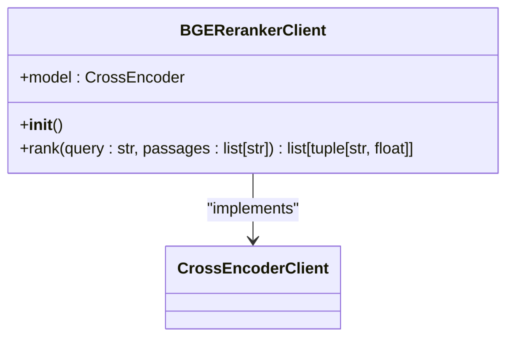

**Diagram sources**
- [graphiti_core/cross_encoder/bge_reranker_client.py](file://graphiti_core/cross_encoder/bge_reranker_client.py#L34-L55)

**Section sources**
- [graphiti_core/cross_encoder/bge_reranker_client.py](file://graphiti_core/cross_encoder/bge_reranker_client.py#L1-L55)

### Gemini Reranker

The `GeminiRerankerClient` uses Google's Gemini API to perform direct relevance scoring of passages on a 0-100 scale.

Key features:
- Direct scoring using Gemini API
- Concurrent execution of multiple scoring requests
- Score normalization to [0,1] range
- Rate limit handling and error recovery

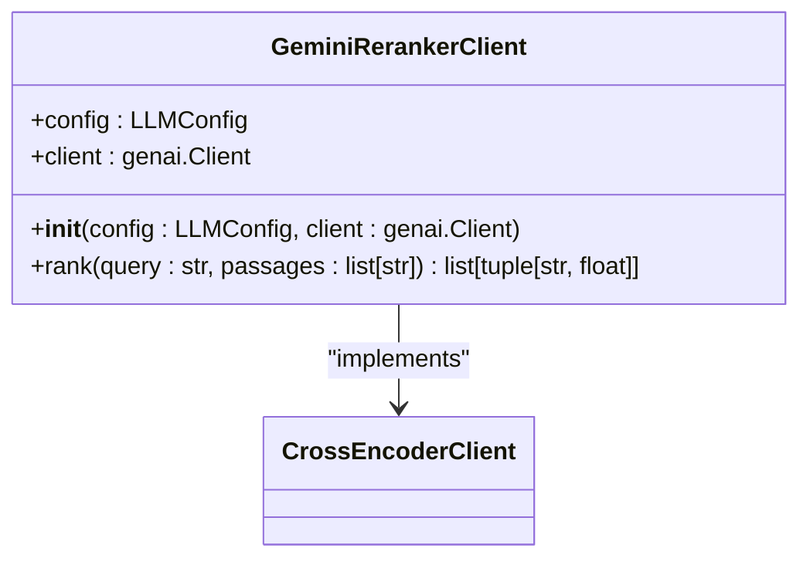

**Diagram sources**
- [graphiti_core/cross_encoder/gemini_reranker_client.py](file://graphiti_core/cross_encoder/gemini_reranker_client.py#L43-L162)

**Section sources**
- [graphiti_core/cross_encoder/gemini_reranker_client.py](file://graphiti_core/cross_encoder/gemini_reranker_client.py#L1-L162)

### OpenAI Reranker

The `OpenAIRerankerClient` uses OpenAI's API to run a boolean classifier prompt concurrently for each passage, using log-probabilities to rank passages.

Key features:
- Concurrent execution of multiple classification requests
- Log-probability based scoring for more nuanced relevance
- Use of logit bias to encourage boolean responses
- Top logprobs for confidence scoring

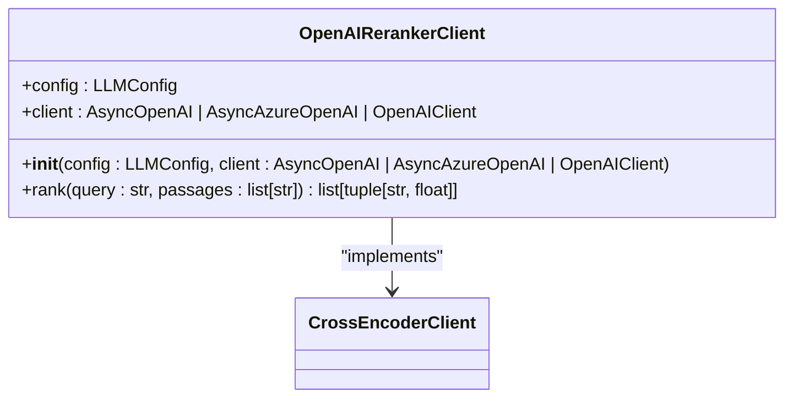

**Diagram sources**
- [graphiti_core/cross_encoder/openai_reranker_client.py](file://graphiti_core/cross_encoder/openai_reranker_client.py#L34-L124)

**Section sources**
- [graphiti_core/cross_encoder/openai_reranker_client.py](file://graphiti_core/cross_encoder/openai_reranker_client.py#L1-L124)

## AI Service Orchestration

Graphiti orchestrates AI services during ingestion and retrieval workflows to extract structured knowledge from unstructured text and improve search relevance.

### Ingestion Workflow

During ingestion, Graphiti uses LLMs to extract entities and relationships from text, creating a knowledge graph. The workflow involves:
1. Text segmentation and preprocessing
2. Entity and relationship extraction using configured LLM
3. Node and edge creation in the graph database
4. Embedding generation for nodes and edges
5. Indexing for search capabilities

### Retrieval Workflow

During retrieval, Graphiti combines multiple AI services to provide relevant results:
1. Query understanding and expansion
2. Vector search using embeddings
3. Cross-encoder reranking of results
4. Contextual response generation
5. Result formatting and delivery

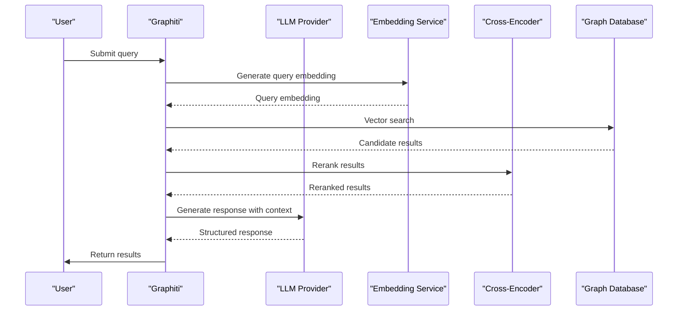

**Diagram sources**
- [graphiti_core/search/search.py](file://graphiti_core/search/search.py)
- [graphiti_core/graphiti.py](file://graphiti_core/graphiti.py)

**Section sources**
- [graphiti_core/search/search.py](file://graphiti_core/search/search.py#L1-L500)
- [graphiti_core/graphiti.py](file://graphiti_core/graphiti.py#L1-L1000)

## Configuration and Customization

Graphiti provides extensive configuration options for customizing AI service behavior. Configuration can be done through environment variables, configuration files, or direct code injection.

### LLM Configuration

The `LLMConfig` class allows for provider-agnostic configuration of LLM parameters:

```python
config = LLMConfig(
    api_key="your-api-key",
    model="gpt-4.1-mini",
    base_url="https://api.openai.com",
    temperature=0.7,
    max_tokens=8192,
    small_model="gpt-4.1-nano"
)
```

### Embedder Configuration

Each embedder has its own configuration class that extends `EmbedderConfig`:

```python
# OpenAI Embedder Configuration
openai_config = OpenAIEmbedderConfig(
    embedding_model="text-embedding-3-large",
    api_key="your-api-key",
    base_url="https://api.openai.com",
    embedding_dim=1536
)

# Gemini Embedder Configuration
gemini_config = GeminiEmbedderConfig(
    embedding_model="gemini-embedding-001",
    api_key="your-api-key",
    embedding_dim=768
)
```

### Service Injection

AI services can be injected directly into the Graphiti instance:

```python
from graphiti_core import Graphiti
from graphiti_core.llm_client import OpenAIClient
from graphiti_core.embedder import OpenAIEmbedder

# Create custom clients
llm_client = OpenAIClient(config=llm_config, cache=True)
embedder = OpenAIEmbedder(config=embedder_config)

# Inject into Graphiti
graphiti = Graphiti(
    llm_client=llm_client,
    embedder=embedder,
    driver=driver
)
```

**Section sources**
- [graphiti_core/llm_client/config.py](file://graphiti_core/llm_client/config.py#L28-L69)
- [graphiti_core/embedder/openai.py](file://graphiti_core/embedder/openai.py#L27-L32)
- [graphiti_core/embedder/gemini.py](file://graphiti_core/embedder/gemini.py#L45-L48)
- [graphiti_core/graphiti.py](file://graphiti_core/graphiti.py#L1-L100)

## Error Handling and Resilience

Graphiti implements comprehensive error handling and resilience strategies to ensure reliable operation of AI services.

### Rate Limiting

All AI clients implement rate limit detection and appropriate error raising:

```python
# Rate limit detection in Gemini client
if (
    'rate limit' in error_message
    or 'quota' in error_message
    or 'resource_exhausted' in error_message
    or '429' in str(e)
):
    raise RateLimitError from e
```

### Retry Logic

Different clients implement appropriate retry strategies:

- **OpenAI/Groq**: Uses tenacity retry with exponential backoff
- **Anthropic**: Custom retry with error context injection
- **Gemini**: Direct retry with safety block detection

### Fallback Mechanisms

The system includes several fallback mechanisms:
- JSON salvage for truncated responses
- Individual processing fallback for batch failures
- Empty result handling for edge cases
- Safety block detection and reporting

### Error Types

Graphiti defines specific error types for different failure modes:
- `RateLimitError`: API rate limit exceeded
- `RefusalError`: Content policy violation
- `ValidationError`: Response validation failure

**Section sources**
- [graphiti_core/llm_client/client.py](file://graphiti_core/llm_client/client.py#L31-L32)
- [graphiti_core/llm_client/anthropic_client.py](file://graphiti_core/llm_client/anthropic_client.py#L29-L30)
- [graphiti_core/llm_client/gemini_client.py](file://graphiti_core/llm_client/gemini_client.py#L28-L29)
- [graphiti_core/llm_client/groq_client.py](file://graphiti_core/llm_client/groq_client.py#L40-L41)