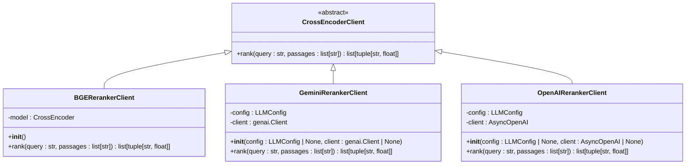
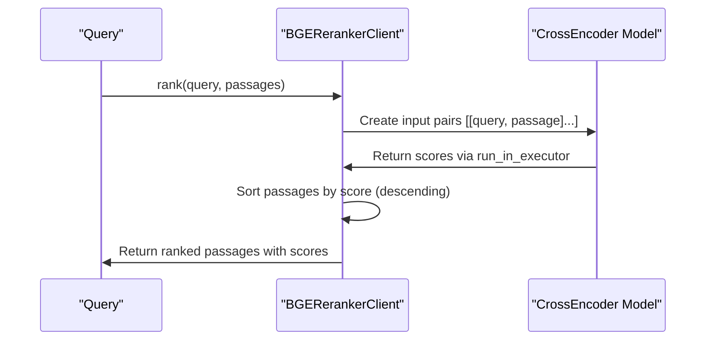
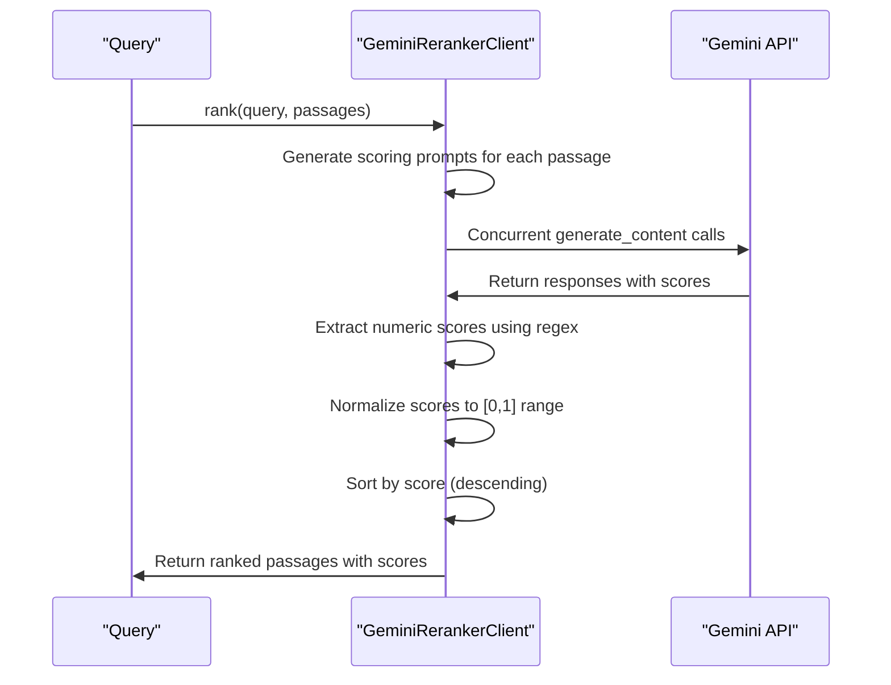
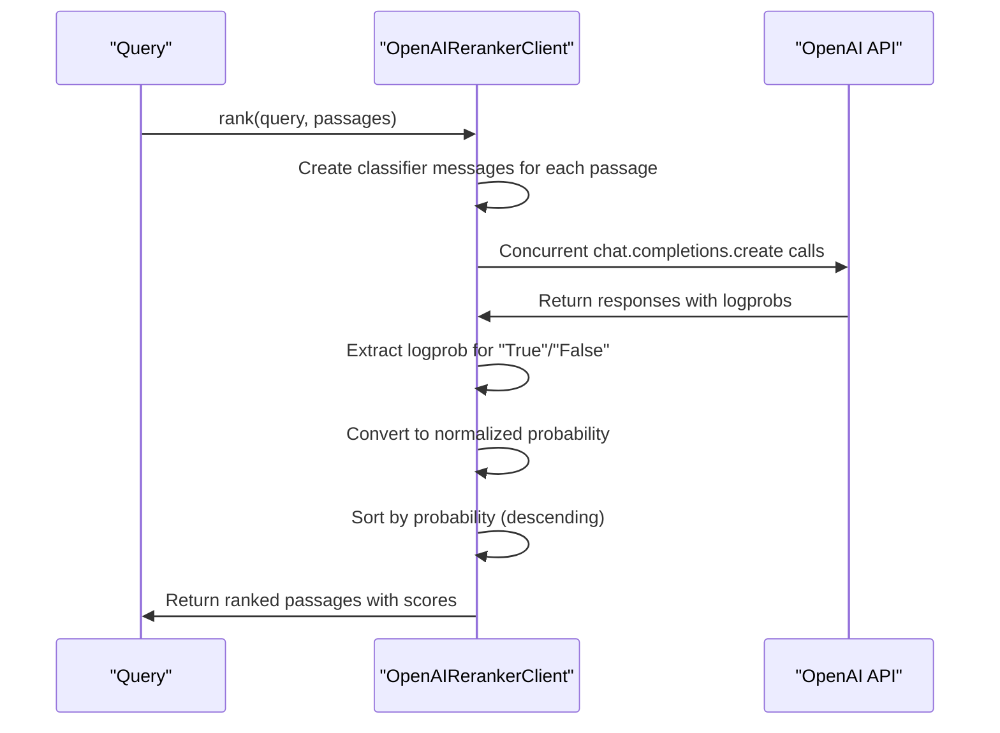
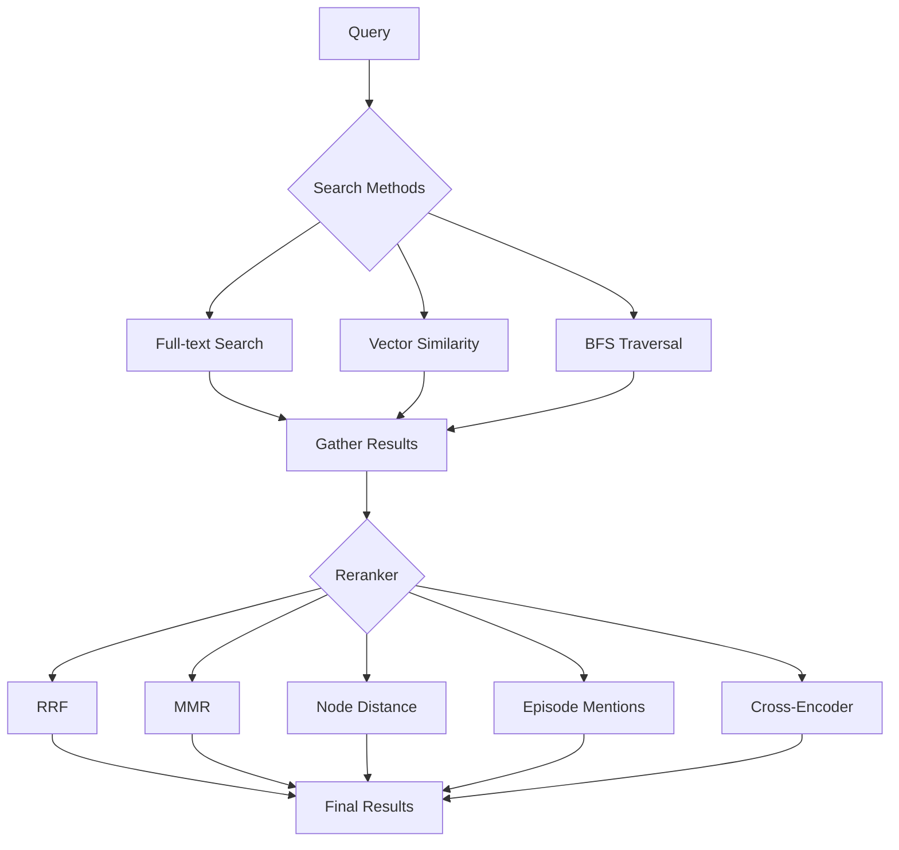
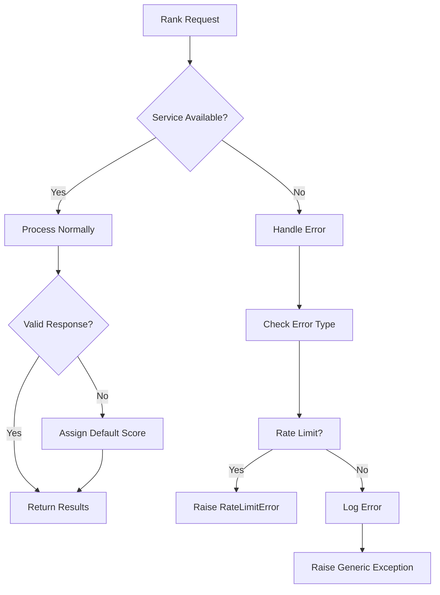

# Cross-Encoder Reranking

<cite>
**Referenced Files in This Document**   
- [client.py](file://graphiti_core/cross_encoder/client.py)
- [bge_reranker_client.py](file://graphiti_core/cross_encoder/bge_reranker_client.py)
- [gemini_reranker_client.py](file://graphiti_core/cross_encoder/gemini_reranker_client.py)
- [openai_reranker_client.py](file://graphiti_core/cross_encoder/openai_reranker_client.py)
- [search.py](file://graphiti_core/search/search.py)
- [search_config.py](file://graphiti_core/search/search_config.py)
- [search_config_recipes.py](file://graphiti_core/search/search_config_recipes.py)
- [graphiti.py](file://graphiti_core/graphiti.py)
- [graphiti_types.py](file://graphiti_core/graphiti_types.py)
</cite>

## Table of Contents
1. [Introduction](#introduction)
2. [Cross-Encoder Architecture](#cross-encoder-architecture)
3. [Reranking Implementation](#reranking-implementation)
4. [Configuration Parameters](#configuration-parameters)
5. [Integration with Hybrid Search](#integration-with-hybrid-search)
6. [Search Recipes](#search-recipes)
7. [Performance and Reliability](#performance-and-reliability)
8. [Usage Examples](#usage-examples)

## Introduction

Cross-encoder reranking in Graphiti enhances retrieval relevance by re-scoring candidate results using fine-tuned models such as BGE (BAAI/bge-reranker-v2-m3), Google Gemini, and OpenAI's reranking models. This functionality operates as a second-stage re-ranking process in the hybrid search pipeline, where initial candidates are retrieved through various search methods and then re-ranked based on their semantic relevance to the query.

The reranking process significantly improves the quality of search results by leveraging cross-encoder models that jointly encode query-passage pairs, capturing deeper semantic relationships than traditional embedding-based retrieval methods. Graphiti's implementation supports multiple reranker implementations through a common interface, allowing flexibility in choosing the most appropriate model for specific use cases.

**Section sources**
- [client.py](file://graphiti_core/cross_encoder/client.py#L1-L41)
- [search.py](file://graphiti_core/search/search.py#L1-L519)

## Cross-Encoder Architecture

The cross-encoder architecture in Graphiti is built around an abstract interface that enables interchangeable implementations of different reranking models. The core component is the `CrossEncoderClient` abstract base class, which defines the contract for all reranker implementations.



**Diagram sources**
- [client.py](file://graphiti_core/cross_encoder/client.py#L20-L40)
- [bge_reranker_client.py](file://graphiti_core/cross_encoder/bge_reranker_client.py#L34-L55)
- [gemini_reranker_client.py](file://graphiti_core/cross_encoder/gemini_reranker_client.py#L43-L162)
- [openai_reranker_client.py](file://graphiti_core/cross_encoder/openai_reranker_client.py#L34-L124)

### CrossEncoderClient Interface

The `CrossEncoderClient` abstract base class defines the interface for all cross-encoder implementations. It specifies a single method `rank()` that takes a query string and a list of passages, returning a list of tuples containing each passage and its relevance score, sorted in descending order of relevance.

The interface enables polymorphic behavior, allowing the search system to work with any implementation that adheres to this contract without needing to know the specific details of the underlying model.

**Section sources**
- [client.py](file://graphiti_core/cross_encoder/client.py#L20-L40)

## Reranking Implementation

Graphiti provides three concrete implementations of the `CrossEncoderClient` interface, each leveraging different underlying technologies and approaches to reranking.

### BGE Reranker Client

The `BGERerankerClient` implementation uses the BAAI/bge-reranker-v2-m3 model from the sentence-transformers library. This implementation loads the pre-trained model during initialization and uses it to score query-passage pairs.



**Diagram sources**
- [bge_reranker_client.py](file://graphiti_core/cross_encoder/bge_reranker_client.py#L34-L55)

The implementation handles empty input by returning an empty list and processes the scoring in an asynchronous executor to avoid blocking the event loop. The model is initialized with the BAAI/bge-reranker-v2-m3 checkpoint, which has been specifically trained for reranking tasks.

**Section sources**
- [bge_reranker_client.py](file://graphiti_core/cross_encoder/bge_reranker_client.py#L17-L55)

### Gemini Reranker Client

The `GeminiRerankerClient` leverages Google's Gemini API to perform direct relevance scoring of passages. Unlike traditional cross-encoders, this implementation uses the LLM to score each passage individually on a 0-100 scale, which is then normalized to the [0,1] range.



**Diagram sources**
- [gemini_reranker_client.py](file://graphiti_core/cross_encoder/gemini_reranker_client.py#L43-L162)

The client constructs a prompt for each passage asking the model to rate how well the passage answers or relates to the query on a scale from 0 to 100. These prompts are executed concurrently using `semaphore_gather` to improve efficiency. The implementation includes robust error handling for cases where the model returns non-numeric text or empty responses, defaulting to a score of 0.0 in such cases.

**Section sources**
- [gemini_reranker_client.py](file://graphiti_core/cross_encoder/gemini_reranker_client.py#L43-L162)

### OpenAI Reranker Client

The `OpenAIRerankerClient` uses OpenAI's API to run a boolean classifier prompt concurrently for each passage. It leverages log-probabilities from the model's output to rank passages, providing a probabilistic measure of relevance.



**Diagram sources**
- [openai_reranker_client.py](file://graphiti_core/cross_encoder/openai_reranker_client.py#L34-L124)

This implementation uses a system message to instruct the model to determine whether a passage is relevant to the query, with responses constrained to "True" or "False" using logit bias. The log-probabilities are extracted and converted to normalized probabilities, with "True" responses contributing positively to the score and "False" responses contributing 1 minus the probability.

**Section sources**
- [openai_reranker_client.py](file://graphiti_core/cross_encoder/openai_reranker_client.py#L34-L124)

## Configuration Parameters

The cross-encoder reranking functionality is configured through several parameters that control model behavior, performance, and integration with the search pipeline.

### Cross-Encoder Configuration

Each reranker implementation accepts configuration through the `LLMConfig` object, which includes parameters such as:

- **Model name**: Specifies the specific model variant to use
- **API key**: Authentication credential for external services
- **Base URL**: Endpoint for the LLM service
- **Temperature**: Controls randomness in model outputs (set to 0.0 for deterministic scoring)
- **Max tokens**: Limits the response length (set to 3 for Gemini scoring)

For the Gemini and OpenAI implementations, these configurations are passed during client initialization, allowing for customization of the underlying LLM service.

**Section sources**
- [gemini_reranker_client.py](file://graphiti_core/cross_encoder/gemini_reranker_client.py#L48-L72)
- [openai_reranker_client.py](file://graphiti_core/cross_encoder/openai_reranker_client.py#L35-L60)

### Reranking Thresholds

The search system includes a `reranker_min_score` parameter that filters out results below a specified relevance threshold. This parameter is applied during the reranking process in all search functions, ensuring that only passages meeting the minimum relevance criteria are included in the final results.

The threshold is configurable at the search configuration level, allowing different use cases to set appropriate relevance cutoffs based on their requirements.

**Section sources**
- [search.py](file://graphiti_core/search/search.py#L129-L130)
- [search.py](file://graphiti_core/search/search.py#L196-L197)

## Integration with Hybrid Search

Cross-encoder reranking is integrated into Graphiti's hybrid search pipeline as a final re-ranking stage, applied after initial candidate retrieval through various search methods.

### Search Pipeline Architecture



**Diagram sources**
- [search.py](file://graphiti_core/search/search.py#L68-L519)

The hybrid search pipeline first executes multiple search methods in parallel (full-text, vector similarity, and BFS traversal), then applies a reranking strategy to combine and order the results. When cross-encoder reranking is selected, it operates on the candidate results from the initial search phase.

**Section sources**
- [search.py](file://graphiti_core/search/search.py#L68-L519)

### Center-Node Search Integration

Cross-encoder reranking is particularly effective in center-node search scenarios, where results are re-ranked based on their relevance to both the query and a specified center node. The search functions accept a `center_node_uuid` parameter that can be used in conjunction with cross-encoder reranking to prioritize results that are both relevant to the query and closely related to the center node in the knowledge graph.

When both cross-encoder reranking and node distance reranking are configured, the system can combine semantic relevance with graph proximity to deliver highly contextually relevant results.

**Section sources**
- [search.py](file://graphiti_core/search/search.py#L74-L75)
- [search.py](file://graphiti_core/search/search.py#L276-L277)

## Search Recipes

Graphiti provides predefined search configurations called "recipes" that encapsulate common search patterns, including those that leverage cross-encoder reranking.

### Predefined Search Recipes

The `search_config_recipes.py` module defines several search configurations that use cross-encoder reranking:

- **COMBINED_HYBRID_SEARCH_CROSS_ENCODER**: Applies cross-encoder reranking across edges, nodes, and communities
- **EDGE_HYBRID_SEARCH_CROSS_ENCODER**: Focuses on edge retrieval with cross-encoder reranking
- **NODE_HYBRID_SEARCH_CROSS_ENCODER**: Focuses on node retrieval with cross-encoder reranking
- **COMMUNITY_HYBRID_SEARCH_CROSS_ENCODER**: Focuses on community retrieval with cross-encoder reranking

These recipes configure the search to use multiple retrieval methods (BM25, cosine similarity, and BFS) followed by cross-encoder reranking to produce high-quality results.

```python
# Example recipe configuration
COMBINED_HYBRID_SEARCH_CROSS_ENCODER = SearchConfig(
    edge_config=EdgeSearchConfig(
        search_methods=[
            EdgeSearchMethod.bm25,
            EdgeSearchMethod.cosine_similarity,
            EdgeSearchMethod.bfs,
        ],
        reranker=EdgeReranker.cross_encoder,
    ),
    node_config=NodeSearchConfig(
        search_methods=[
            NodeSearchMethod.bm25,
            NodeSearchMethod.cosine_similarity,
            NodeSearchMethod.bfs,
        ],
        reranker=NodeReranker.cross_encoder,
    ),
    episode_config=EpisodeSearchConfig(
        search_methods=[EpisodeSearchMethod.bm25],
        reranker=EpisodeReranker.cross_encoder,
    ),
    community_config=CommunitySearchConfig(
        search_methods=[CommunitySearchMethod.bm25, CommunitySearchMethod.cosine_similarity],
        reranker=CommunityReranker.cross_encoder,
    ),
)
```

**Section sources**
- [search_config_recipes.py](file://graphiti_core/search/search_config_recipes.py#L80-L108)

## Performance and Reliability

The cross-encoder reranking implementation includes several features to ensure performance and reliability in production environments.

### Latency Implications

Cross-encoder reranking introduces additional latency compared to simpler reranking methods like RRF (Reciprocal Rank Fusion) or MMR (Maximal Marginal Relevance). The latency depends on the specific implementation:

- **BGE Reranker**: Lower latency as it runs locally using a pre-loaded model
- **Gemini Reranker**: Higher latency due to network calls to the Gemini API
- **OpenAI Reranker**: Moderate latency depending on OpenAI API response times

The system mitigates latency through concurrent processing, where multiple passages are scored in parallel using `semaphore_gather` to limit the number of concurrent operations.

**Section sources**
- [bge_reranker_client.py](file://graphiti_core/cross_encoder/bge_reranker_client.py#L44-L46)
- [gemini_reranker_client.py](file://graphiti_core/cross_encoder/gemini_reranker_client.py#L104-L117)
- [openai_reranker_client.py](file://graphiti_core/cross_encoder/openai_reranker_client.py#L84-L97)

### Caching Strategies

While the current implementation does not include explicit caching, the architecture allows for caching to be implemented at higher levels. The deterministic nature of the reranking process (especially with temperature set to 0.0) makes results highly cacheable based on query-passage pairs.

Potential caching strategies include:
- Query-level caching of entire search results
- Passage-level caching of individual reranking scores
- Hybrid caching that combines cached and fresh results

**Section sources**
- [gemini_reranker_client.py](file://graphiti_core/cross_encoder/gemini_reranker_client.py#L109-L112)
- [openai_reranker_client.py](file://graphiti_core/cross_encoder/openai_reranker_client.py#L89-L90)

### Fallback Behaviors

The system includes robust error handling for cases where reranking services are unavailable:

- **Rate Limit Handling**: The Gemini and OpenAI implementations detect rate limit errors and raise a `RateLimitError` that can be caught by higher-level code
- **Service Unavailability**: Network errors or service outages result in appropriate exceptions that can trigger fallback to alternative reranking methods
- **Invalid Responses**: When the LLM returns non-numeric or invalid responses, the system defaults to a score of 0.0 to maintain pipeline integrity



**Diagram sources**
- [gemini_reranker_client.py](file://graphiti_core/cross_encoder/gemini_reranker_client.py#L149-L161)
- [openai_reranker_client.py](file://graphiti_core/cross_encoder/openai_reranker_client.py#L119-L123)

**Section sources**
- [gemini_reranker_client.py](file://graphiti_core/cross_encoder/gemini_reranker_client.py#L149-L161)
- [openai_reranker_client.py](file://graphiti_core/cross_encoder/openai_reranker_client.py#L119-L123)

## Usage Examples

The cross-encoder reranking functionality can be enabled and tuned for different use cases through configuration.

### Enabling Cross-Encoder Reranking

To enable cross-encoder reranking, configure the search with the appropriate reranker enum value:

```python
from graphiti_core.search.search_config import NodeSearchConfig, NodeSearchMethod, NodeReranker
from graphiti_core.search.search import search

config = NodeSearchConfig(
    search_methods=[NodeSearchMethod.bm25, NodeSearchMethod.cosine_similarity],
    reranker=NodeReranker.cross_encoder
)
```

Alternatively, use predefined recipes:

```python
from graphiti_core.search.search_config_recipes import NODE_HYBRID_SEARCH_CROSS_ENCODER

results = await search(
    clients=graphiti.clients,
    query="your query",
    group_ids=None,
    config=NODE_HYBRID_SEARCH_CROSS_ENCODER
)
```

**Section sources**
- [search_config.py](file://graphiti_core/search/search_config.py#L61-L67)
- [search_config_recipes.py](file://graphiti_core/search/search_config_recipes.py#L188-L198)

### Tuning for Different Use Cases

Different use cases may require tuning of the reranking parameters:

- **High Precision Requirements**: Use a higher `reranker_min_score` threshold to filter out marginally relevant results
- **Comprehensive Retrieval**: Use a lower threshold or disable filtering to retrieve a broader set of potentially relevant results
- **Latency-Sensitive Applications**: Consider using the BGE reranker for lower latency compared to API-based solutions
- **Domain-Specific Content**: Fine-tune the prompt templates in the Gemini or OpenAI implementations to better handle domain-specific language

The system's modular design allows for easy experimentation with different reranking strategies and configurations to find the optimal balance of relevance, precision, and performance for specific applications.

**Section sources**
- [search.py](file://graphiti_core/search/search.py#L129-L130)
- [search_config.py](file://graphiti_core/search/search_config.py#L118-L119)
- [gemini_reranker_client.py](file://graphiti_core/cross_encoder/gemini_reranker_client.py#L85-L91)
- [openai_reranker_client.py](file://graphiti_core/cross_encoder/openai_reranker_client.py#L69-L78)