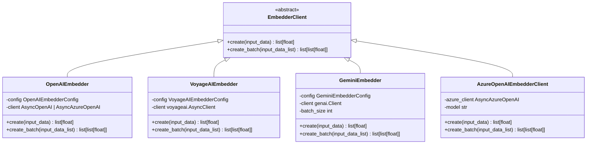

# Embedding Generation

<cite>
**Referenced Files in This Document**   
- [client.py](file://graphiti_core/embedder/client.py)
- [openai.py](file://graphiti_core/embedder/openai.py)
- [voyage.py](file://graphiti_core/embedder/voyage.py)
- [gemini.py](file://graphiti_core/embedder/gemini.py)
- [azure_openai.py](file://graphiti_core/embedder/azure_openai.py)
- [graphiti.py](file://graphiti_core/graphiti.py)
- [search.py](file://graphiti_core/search/search.py)
- [search_utils.py](file://graphiti_core/search/search_utils.py)
- [llm_client/utils.py](file://graphiti_core/llm_client/utils.py)
- [nodes.py](file://graphiti_core/nodes.py)
- [edges.py](file://graphiti_core/edges.py)
</cite>

## Table of Contents
1. [Introduction](#introduction)
2. [Embedder Architecture](#embedder-architecture)
3. [EmbedderClient Interface](#embedderclient-interface)
4. [Implementation Details](#implementation-details)
   - [OpenAI Embedder](#openai-embedder)
   - [VoyageAI Embedder](#voyageai-embedder)
   - [Google Gemini Embedder](#google-gemini-embedder)
   - [Azure OpenAI Embedder](#azure-openai-embedder)
5. [Configuration Options](#configuration-options)
6. [Usage in Ingestion Workflows](#usage-in-ingestion-workflows)
7. [Semantic Search Integration](#semantic-search-integration)
8. [Performance Considerations](#performance-considerations)
9. [Extending the Embedder System](#extending-the-embedder-system)
10. [Conclusion](#conclusion)

## Introduction

The embedder module in Graphiti plays a critical role in transforming textual information into numerical representations that enable semantic understanding within the knowledge graph. Text embeddings serve as the foundation for representing both nodes and edges, allowing the system to capture semantic relationships and enable advanced search capabilities. This documentation provides a comprehensive overview of the embedder system, detailing its architecture, implementation, configuration, and usage patterns.

**Section sources**
- [client.py](file://graphiti_core/embedder/client.py#L1-L39)

## Embedder Architecture

The embedder module follows a modular architecture designed to support multiple embedding providers while maintaining a consistent interface. At its core, the system is built around the `EmbedderClient` abstract base class, which defines the contract for all embedding implementations. This design enables seamless integration of different embedding models and providers while ensuring consistent behavior across the system.

The architecture supports both individual and batch embedding operations, with each implementation handling the specific requirements of its underlying provider. The system is designed to be extensible, allowing for the addition of new embedding providers through the implementation of the `EmbedderClient` interface.



**Diagram sources**
- [client.py](file://graphiti_core/embedder/client.py#L30-L39)
- [openai.py](file://graphiti_core/embedder/openai.py#L33-L67)
- [voyage.py](file://graphiti_core/embedder/voyage.py#L43-L77)
- [gemini.py](file://graphiti_core/embedder/gemini.py#L50-L184)
- [azure_openai.py](file://graphiti_core/embedder/azure_openai.py#L27-L65)

**Section sources**
- [client.py](file://graphiti_core/embedder/client.py#L1-L39)
- [openai.py](file://graphiti_core/embedder/openai.py#L1-L67)
- [voyage.py](file://graphiti_core/embedder/voyage.py#L1-L77)
- [gemini.py](file://graphiti_core/embedder/gemini.py#L1-L184)
- [azure_openai.py](file://graphiti_core/embedder/azure_openai.py#L1-L65)

## EmbedderClient Interface

The `EmbedderClient` interface serves as the foundation for all embedding implementations in Graphiti. It defines a standardized contract that ensures consistency across different embedding providers. The interface is implemented as an abstract base class with two primary methods: `create` for generating embeddings from individual inputs and `create_batch` for processing multiple inputs efficiently.

The interface is designed to handle various input types, including strings, lists of strings, and iterables of integers or nested iterables. This flexibility allows the embedder to process different kinds of textual data that may be encountered during knowledge graph construction and querying.

```python
class EmbedderClient(ABC):
    @abstractmethod
    async def create(
        self, input_data: str | list[str] | Iterable[int] | Iterable[Iterable[int]]
    ) -> list[float]:
        pass

    async def create_batch(self, input_data_list: list[str]) -> list[list[float]]:
        raise NotImplementedError()
```

The interface also includes a configuration system based on Pydantic models, allowing for structured configuration of embedding parameters such as model selection, dimensionality, and API credentials. This configuration system ensures that each embedder implementation can be properly configured while maintaining type safety and validation.

**Section sources**
- [client.py](file://graphiti_core/embedder/client.py#L30-L39)

## Implementation Details

### OpenAI Embedder

The OpenAI embedder implementation provides integration with OpenAI's embedding models, supporting both the standard OpenAI API and Azure OpenAI services. The implementation is built around the `OpenAIEmbedder` class, which accepts an `OpenAIEmbedderConfig` object for configuration.

Key features of the OpenAI embedder include:
- Support for multiple OpenAI embedding models, with `text-embedding-3-small` as the default
- Flexible configuration of API key and base URL
- Integration with both `AsyncOpenAI` and `AsyncAzureOpenAI` clients
- Automatic truncation of embeddings to the configured dimensionality

The implementation handles both individual and batch embedding requests, forwarding them to the appropriate OpenAI API endpoints. It processes the response to extract the embedding vectors and applies dimensionality truncation based on the configuration.

**Section sources**
- [openai.py](file://graphiti_core/embedder/openai.py#L33-L67)

### VoyageAI Embedder

The VoyageAI embedder implementation provides integration with Voyage AI's embedding services. The `VoyageAIEmbedder` class implements the `EmbedderClient` interface and is configured through the `VoyageAIEmbedderConfig` class.

Key features of the VoyageAI embedder include:
- Support for Voyage AI's embedding models, with `voyage-3` as the default
- Automatic handling of API key configuration
- Input preprocessing to ensure compatibility with the Voyage AI API
- Error handling for cases where the voyageai package is not installed

The implementation includes input validation and preprocessing to handle different input types, converting them to the appropriate format for the Voyage AI API. It also handles empty input lists gracefully, returning an empty result when appropriate.

**Section sources**
- [voyage.py](file://graphiti_core/embedder/voyage.py#L43-L77)

### Google Gemini Embedder

The Google Gemini embedder implementation provides integration with Google's Gemini embedding models. The `GeminiEmbedder` class is configured through the `GeminiEmbedderConfig` class and offers several advanced features for handling the specific requirements of the Gemini API.

Key features of the Gemini embedder include:
- Support for multiple Gemini embedding models, including `text-embedding-001` and `gemini-embedding-001`
- Automatic batch size management based on the selected model
- Fallback strategy for handling batch processing failures
- Configurable batch size with a default of 100

The implementation includes sophisticated error handling and fallback mechanisms. When batch processing fails, it automatically falls back to individual processing to ensure that embeddings are generated even if the batch request encounters issues. This resilience is particularly important when working with large datasets or when rate limits are encountered.

**Section sources**
- [gemini.py](file://graphiti_core/embedder/gemini.py#L50-L184)

### Azure OpenAI Embedder

The Azure OpenAI embedder implementation provides a wrapper for the `AsyncAzureOpenAI` client that implements the `EmbedderClient` interface. Unlike the other implementations, this class is designed to work with an existing Azure OpenAI client instance rather than creating its own.

Key features of the Azure OpenAI embedder include:
- Direct integration with the Azure OpenAI service
- Support for custom model names
- Error logging and exception handling
- Simple configuration through constructor parameters

The implementation is designed to be lightweight and focused on providing a bridge between the Azure OpenAI client and the Graphiti embedder interface. It handles input type conversion to ensure compatibility with the Azure OpenAI API and includes comprehensive error handling with logging.

**Section sources**
- [azure_openai.py](file://graphiti_core/embedder/azure_openai.py#L27-L65)

## Configuration Options

The embedder system in Graphiti offers several configuration options to customize its behavior. These options are primarily managed through Pydantic configuration classes that provide type safety and validation.

### Model Selection

Each embedder implementation supports model selection through its configuration class:
- OpenAI: `embedding_model` parameter with default `text-embedding-3-small`
- VoyageAI: `embedding_model` parameter with default `voyage-3`
- Gemini: `embedding_model` parameter with default `text-embedding-001`

### Dimensionality

The embedding dimensionality is controlled through the `embedding_dim` parameter, which defaults to 1024 and can be overridden via the `EMBEDDING_DIM` environment variable. Each implementation truncates the returned embeddings to this dimensionality to ensure consistency across the system.

### Batch Size

The batch size configuration varies by implementation:
- OpenAI and VoyageAI: Handle batching at the API level
- Gemini: Configurable batch size with automatic adjustment based on the model (1 for `gemini-embedding-001`, 100 default for others)

### API Key Management

API key management is handled through configuration parameters:
- OpenAI: `api_key` parameter with environment variable fallback
- VoyageAI: `api_key` parameter
- Gemini: `api_key` parameter

The system is designed to support secure API key management, with keys typically provided through environment variables or secure configuration files rather than being hardcoded.

**Section sources**
- [client.py](file://graphiti_core/embedder/client.py#L26-L28)
- [openai.py](file://graphiti_core/embedder/openai.py#L27-L31)
- [voyage.py](file://graphiti_core/embedder/voyage.py#L38-L41)
- [gemini.py](file://graphiti_core/embedder/gemini.py#L45-L48)

## Usage in Ingestion Workflows

The embedder system is integrated into Graphiti's ingestion workflows to generate embeddings for both nodes and edges as they are created or updated. During the ingestion process, text content from nodes and edges is passed through the configured embedder to create vector representations that capture their semantic meaning.

When a new node is created, its name and other relevant text fields are used to generate an embedding that is stored with the node in the knowledge graph. Similarly, when an edge is created, the fact or relationship description is embedded and stored with the edge. This enables semantic search and similarity-based queries across the graph.

The ingestion process leverages the batch embedding capabilities of the embedder implementations to improve performance when processing multiple nodes or edges. This is particularly important when ingesting large datasets, as it reduces the number of API calls and improves overall throughput.


**Diagram sources**
- [graphiti.py](file://graphiti_core/graphiti.py#L128-L200)
- [nodes.py](file://graphiti_core/nodes.py)
- [edges.py](file://graphiti_core/edges.py)

**Section sources**
- [graphiti.py](file://graphiti_core/graphiti.py#L128-L200)
- [nodes.py](file://graphiti_core/nodes.py)
- [edges.py](file://graphiti_core/edges.py)

## Semantic Search Integration

The embedder system is tightly integrated with Graphiti's semantic search capabilities. When a search query is performed, the query text is first converted to an embedding using the configured embedder. This query embedding is then used to find similar nodes, edges, or communities in the knowledge graph based on vector similarity.

The search process combines multiple search methods, including full-text search and vector similarity search. The vector similarity search uses cosine similarity to measure the distance between the query embedding and the embeddings of nodes and edges in the graph. This enables semantic search that can find relevant results even when the exact query terms don't match.

The system supports hybrid search approaches that combine the results from different search methods using techniques like Reciprocal Rank Fusion (RRF) or cross-encoder reranking. This allows for more accurate and relevant search results by leveraging the strengths of both keyword-based and semantic search methods.


**Diagram sources**
- [search.py](file://graphiti_core/search/search.py#L83-L120)
- [search_utils.py](file://graphiti_core/search/search_utils.py#L1178-L1196)

**Section sources**
- [search.py](file://graphiti_core/search/search.py#L83-L120)
- [search_utils.py](file://graphiti_core/search/search_utils.py#L1178-L1196)

## Performance Considerations

The embedder system includes several performance optimizations to ensure efficient operation, particularly when dealing with large datasets or high-throughput scenarios.

### Caching

While the current implementation does not include built-in caching, the architecture supports the addition of caching layers. Implementing a caching mechanism for frequently accessed embeddings could significantly reduce API calls and improve response times for repeated queries.

### Batching

The system leverages batching to improve performance when processing multiple inputs. The `create_batch` method allows for the efficient processing of multiple text inputs in a single API call, reducing network overhead and improving throughput. The Gemini embedder implementation includes additional batching logic with automatic fallback to individual processing when batch requests fail.

### Fallback Strategies

The Gemini embedder implementation includes a sophisticated fallback strategy that automatically switches from batch processing to individual processing when batch requests fail. This ensures that embeddings are generated even in the face of transient API issues or rate limiting.

### Concurrency

The embedder system is designed to work within Graphiti's concurrency model, which is controlled by the `SEMAPHORE_LIMIT` environment variable. By default, this limit is set to 10 concurrent operations to prevent rate limiting from LLM providers, but it can be adjusted based on the provider's capabilities and the application's requirements.

**Section sources**
- [gemini.py](file://graphiti_core/embedder/gemini.py#L126-L182)
- [README.md](file://README.md#L214-L219)

## Extending the Embedder System

The embedder system is designed to be extensible, allowing for the addition of new embedding models or local providers. To create a new embedder implementation, developers need to:

1. Create a new class that inherits from `EmbedderClient`
2. Implement the `create` and `create_batch` methods
3. Define a configuration class that inherits from `EmbedderConfig`
4. Register the new implementation in the module's `__init__.py` file

For local providers, the system can be extended to support offline embedding models by implementing the `EmbedderClient` interface with a local inference engine. This would allow for embedding generation without relying on external APIs, which could be beneficial for privacy-sensitive applications or environments with limited connectivity.

The modular design of the embedder system makes it straightforward to add support for additional providers by following the pattern established by the existing implementations. Each new provider would need to handle its specific API requirements, authentication methods, and error conditions while maintaining compatibility with the `EmbedderClient` interface.

**Section sources**
- [client.py](file://graphiti_core/embedder/client.py#L30-L39)
- [__init__.py](file://graphiti_core/embedder/__init__.py)

## Conclusion

The embedder module in Graphiti provides a flexible and extensible system for generating text embeddings that power the semantic capabilities of the knowledge graph. By supporting multiple embedding providers through a consistent interface, the system enables organizations to choose the best embedding solution for their needs while maintaining a unified architecture.

The integration of embeddings into both node and edge representations allows for rich semantic search and analysis capabilities, enabling users to discover relationships and insights that would be difficult to find with traditional keyword-based approaches. The system's design prioritizes performance, reliability, and extensibility, making it well-suited for a wide range of knowledge graph applications.

As the field of natural language processing continues to evolve, the embedder system's modular architecture will allow Graphiti to easily incorporate new embedding models and techniques, ensuring that the platform remains at the forefront of semantic technology.