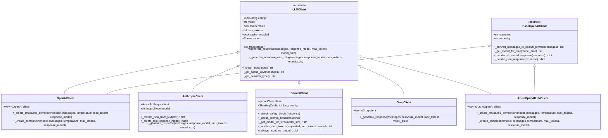
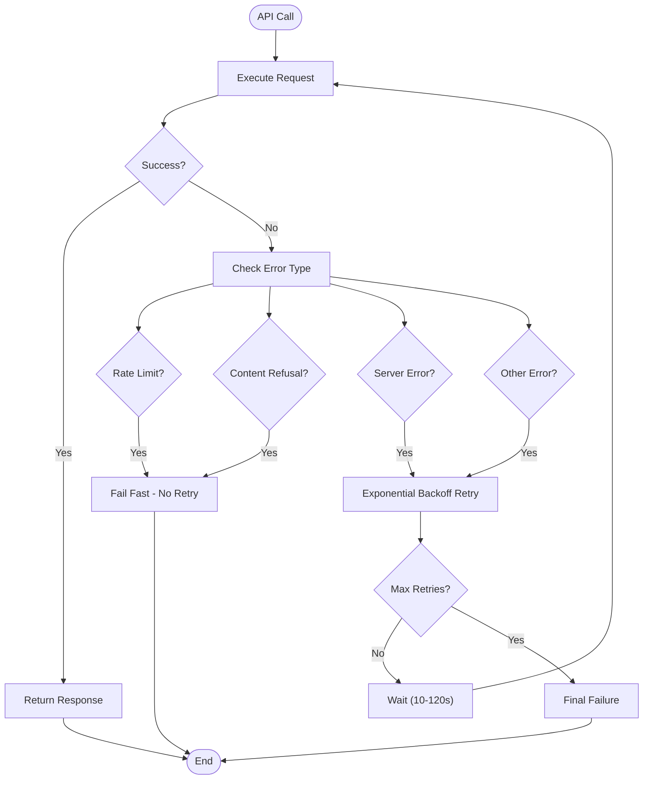

# LLM Clients

<cite>
**Referenced Files in This Document**
- [graphiti_core/llm_client/__init__.py](file://graphiti_core/llm_client/__init__.py)
- [graphiti_core/llm_client/client.py](file://graphiti_core/llm_client/client.py)
- [graphiti_core/llm_client/config.py](file://graphiti_core/llm_client/config.py)
- [graphiti_core/llm_client/errors.py](file://graphiti_core/llm_client/errors.py)
- [graphiti_core/llm_client/openai_client.py](file://graphiti_core/llm_client/openai_client.py)
- [graphiti_core/llm_client/anthropic_client.py](file://graphiti_core/llm_client/anthropic_client.py)
- [graphiti_core/llm_client/gemini_client.py](file://graphiti_core/llm_client/gemini_client.py)
- [graphiti_core/llm_client/groq_client.py](file://graphiti_core/llm_client/groq_client.py)
- [graphiti_core/llm_client/azure_openai_client.py](file://graphiti_core/llm_client/azure_openai_client.py)
- [graphiti_core/llm_client/openai_base_client.py](file://graphiti_core/llm_client/openai_base_client.py)
- [graphiti_core/llm_client/openai_generic_client.py](file://graphiti_core/llm_client/openai_generic_client.py)
- [graphiti_core/llm_client/utils.py](file://graphiti_core/llm_client/utils.py)
- [tests/llm_client/test_client.py](file://tests/llm_client/test_client.py)
- [graphiti_core/graphiti.py](file://graphiti_core/graphiti.py)
</cite>

## Table of Contents
1. [Introduction](#introduction)
2. [Architecture Overview](#architecture-overview)
3. [Base LLMClient Class](#base-llmclient-class)
4. [Configuration Management](#configuration-management)
5. [Provider-Specific Implementations](#provider-specific-implementations)
6. [Error Handling and Retry Logic](#error-handling-and-retry-logic)
7. [Telemetry and Instrumentation](#telemetry-and-instrumentation)
8. [Extending the System](#extending-the-system)
9. [Usage Examples](#usage-examples)
10. [Best Practices](#best-practices)

## Introduction

Graphiti's LLM client abstraction layer provides a unified interface for integrating multiple Large Language Model providers into the knowledge graph construction pipeline. This modular architecture enables seamless switching between different LLM providers while maintaining consistent behavior and robust error handling.

The system supports five major LLM providers: OpenAI, Anthropic, Google Gemini, Groq, and Azure OpenAI. Each provider implementation handles authentication, API endpoints, model selection, and provider-specific features while adhering to the common LLMClient interface.

## Architecture Overview

The LLM client system follows a hierarchical design pattern with a base abstract class and specialized implementations for each provider:



**Diagram sources**
- [graphiti_core/llm_client/client.py](file://graphiti_core/llm_client/client.py#L66-L243)
- [graphiti_core/llm_client/openai_client.py](file://graphiti_core/llm_client/openai_client.py#L27-L106)
- [graphiti_core/llm_client/anthropic_client.py](file://graphiti_core/llm_client/anthropic_client.py#L68-L359)
- [graphiti_core/llm_client/gemini_client.py](file://graphiti_core/llm_client/gemini_client.py#L70-L448)
- [graphiti_core/llm_client/groq_client.py](file://graphiti_core/llm_client/groq_client.py#L48-L86)
- [graphiti_core/llm_client/azure_openai_client.py](file://graphiti_core/llm_client/azure_openai_client.py#L30-L78)
- [graphiti_core/llm_client/openai_base_client.py](file://graphiti_core/llm_client/openai_base_client.py#L40-L250)

## Base LLMClient Class

The `LLMClient` abstract base class defines the core interface and common functionality shared across all LLM providers. It provides a standardized way to interact with different LLM services while handling common concerns like caching, input cleaning, and error management.

### Core Features

The base LLMClient implements several key capabilities:

**Input Sanitization**: Automatically cleans input text to remove invalid Unicode characters, control characters, and zero-width spaces that could interfere with LLM processing.

**Caching System**: Provides optional response caching using diskcache for improved performance and reduced API costs. The cache uses MD5 hashing of messages and model combinations to ensure cache coherence.

**Retry Logic**: Implements exponential backoff retry with intelligent error detection for handling transient failures, rate limits, and server errors.

**Telemetry Integration**: Supports distributed tracing through the Tracer interface for observability and debugging.

**Structured Output Support**: Handles Pydantic model validation for structured JSON responses across all providers.

### Key Methods

The base class defines two primary methods:

- `_generate_response_with_retry()`: Implements the complete retry logic with exponential backoff
- `_generate_response()`: Abstract method that each provider must implement

**Section sources**
- [graphiti_core/llm_client/client.py](file://graphiti_core/llm_client/client.py#L66-L243)

## Configuration Management

The LLM configuration system uses Pydantic for type validation and provides flexible configuration options for different providers.

### LLMConfig Class

The `LLMConfig` class encapsulates all necessary parameters for LLM API interactions:

| Parameter | Type | Default | Description |
|-----------|------|---------|-------------|
| `api_key` | `str \| None` | `None` | Authentication key for the LLM service |
| `model` | `str \| None` | `None` | Primary model to use for generation |
| `base_url` | `str \| None` | `None` | Base URL of the LLM API service |
| `temperature` | `float` | `1.0` | Sampling temperature for response generation |
| `max_tokens` | `int` | `8192` | Maximum tokens to generate in responses |
| `small_model` | `str \| None` | `None` | Alternative model for simpler tasks |

### Provider-Specific Configuration

Each provider may require additional configuration parameters:

**OpenAI/Azure OpenAI**: Standard OpenAI configuration with optional reasoning and verbosity controls
**Anthropic**: API key from ANTHROPIC_API_KEY environment variable
**Google Gemini**: API key from GOOGLE_API_KEY environment variable
**Groq**: Minimal configuration with default model selection
**Azure OpenAI**: Requires pre-configured AsyncAzureOpenAI client instance

**Section sources**
- [graphiti_core/llm_client/config.py](file://graphiti_core/llm_client/config.py#L28-L69)

## Provider-Specific Implementations

### OpenAI Client

The OpenAI client supports both standard OpenAI API and Azure OpenAI through the BaseOpenAIClient inheritance. It provides structured output capabilities using OpenAI's beta parse API when available.

**Key Features**:
- Support for OpenAI's structured output beta API
- Automatic fallback to JSON mode for older models
- Configurable reasoning and verbosity parameters
- Comprehensive error handling for OpenAI-specific errors

**Configuration**:
```python
config = LLMConfig(
    api_key="your-openai-api-key",
    model="gpt-4-turbo",
    base_url="https://api.openai.com/v1"
)
client = OpenAIClient(config=config)
```

**Section sources**
- [graphiti_core/llm_client/openai_client.py](file://graphiti_core/llm_client/openai_client.py#L27-L106)
- [graphiti_core/llm_client/openai_base_client.py](file://graphiti_core/llm_client/openai_base_client.py#L40-L250)

### Anthropic Client

The Anthropic client implements a sophisticated tool-based approach for structured output, automatically creating tools based on Pydantic response models.

**Key Features**:
- Tool-based structured output using Anthropic's function calling
- Automatic JSON extraction from text responses
- Built-in retry logic with validation
- Safety filtering and content policy enforcement
- Support for multiple Claude model variants

**Model Support**:
- Claude 3.7 Sonnet (latest)
- Claude 3.5 Haiku, Sonnet variants
- Claude 3 Opus, Sonnet, Haiku
- Claude 2.1, 2.0

**Configuration**:
```python
import anthropic
from graphiti_core.llm_client import AnthropicClient, LLMConfig

config = LLMConfig(
    api_key="your-anthropic-api-key",
    model="claude-3-7-sonnet-latest"
)
client = AnthropicClient(config=config)
```

**Section sources**
- [graphiti_core/llm_client/anthropic_client.py](file://graphiti_core/llm_client/anthropic_client.py#L68-L359)

### Google Gemini Client

The Gemini client provides comprehensive support for Google's Gemini models with advanced safety filtering and truncation recovery.

**Key Features**:
- Multi-model support with automatic token limit detection
- Advanced safety filtering with detailed violation reporting
- JSON truncation recovery for malformed responses
- Thinking configuration support for advanced models
- Comprehensive error handling and retry logic

**Model Support**:
- Gemini 2.5 Pro, Flash, Flash Lite
- Gemini 2.0 Flash, Flash Lite
- Gemini 1.5 Pro, Flash, Flash 8B

**Configuration**:
```python
from google import genai
from graphiti_core.llm_client import GeminiClient, LLMConfig

config = LLMConfig(
    api_key="your-gemini-api-key",
    model="gemini-2.5-flash"
)
client = GeminiClient(config=config)
```

**Section sources**
- [graphiti_core/llm_client/gemini_client.py](file://graphiti_core/llm_client/gemini_client.py#L70-L448)

### Groq Client

The Groq client provides high-speed inference with minimal configuration requirements.

**Key Features**:
- Fast inference through Groq's cloud infrastructure
- Optimized for speed over cost
- Minimal configuration with sensible defaults
- Built-in rate limit error handling

**Default Configuration**:
- Model: `llama-3.1-70b-versatile`
- Max Tokens: `2048`

**Configuration**:
```python
from graphiti_core.llm_client import GroqClient, LLMConfig

config = LLMConfig(
    api_key="your-groq-api-key"
)
client = GroqClient(config=config)
```

**Section sources**
- [graphiti_core/llm_client/groq_client.py](file://graphiti_core/llm_client/groq_client.py#L48-L86)

### Azure OpenAI Client

The Azure OpenAI client wraps the AsyncAzureOpenAI client and provides the LLMClient interface for Azure-hosted OpenAI models.

**Key Features**:
- Integration with Azure OpenAI service
- Support for Azure's custom deployments
- Inherits all OpenAI client capabilities
- No built-in caching support

**Configuration**:
```python
from openai import AsyncAzureOpenAI
from graphiti_core.llm_client import AzureOpenAILLMClient, LLMConfig

azure_client = AsyncAzureOpenAI(
    api_key="your-azure-api-key",
    api_version="2024-02-15-preview",
    azure_endpoint="https://your-resource.openai.azure.com/"
)

config = LLMConfig(
    model="gpt-4-turbo"
)
client = AzureOpenAILLMClient(azure_client=azure_client, config=config)
```

**Section sources**
- [graphiti_core/llm_client/azure_openai_client.py](file://graphiti_core/llm_client/azure_openai_client.py#L30-L78)

## Error Handling and Retry Logic

The LLM client system implements comprehensive error handling and retry mechanisms to ensure robust operation in production environments.

### Error Types

The system defines three primary error types:

**RateLimitError**: Raised when API rate limits are exceeded. These errors typically indicate temporary conditions that should not trigger retries.

**RefusalError**: Raised when LLM content policies are violated. These represent permanent failures that should not be retried.

**EmptyResponseError**: Raised when LLM returns an empty or malformed response.

### Retry Strategy

The retry system implements exponential backoff with intelligent error detection:



**Diagram sources**
- [graphiti_core/llm_client/client.py](file://graphiti_core/llm_client/client.py#L110-L140)

### Provider-Specific Error Handling

Each provider implements custom error handling logic:

**OpenAI/Azure OpenAI**: Leverages OpenAI's built-in retry mechanisms for connection errors and timeouts
**Anthropic**: Special handling for content policy violations that should not be retried
**Gemini**: Comprehensive safety filtering with detailed violation reporting
**Groq**: Basic rate limit error handling with minimal retry logic

**Section sources**
- [graphiti_core/llm_client/errors.py](file://graphiti_core/llm_client/errors.py#L18-L40)

## Telemetry and Instrumentation

The LLM client system integrates with Graphiti's telemetry infrastructure for observability and debugging.

### Tracing Integration

All LLM operations are wrapped in distributed tracing spans with comprehensive attribute collection:

**Common Attributes**:
- `llm.provider`: Provider type (openai, anthropic, gemini, groq)
- `model.size`: Model size (small, medium)
- `max_tokens`: Maximum tokens configured
- `cache.enabled`: Whether caching is enabled
- `prompt.name`: Optional prompt identifier

**Error Tracking**: Failed operations are properly recorded with exception details and stack traces.

### Performance Monitoring

The system tracks various performance metrics:
- Request duration and success rates
- Cache hit/miss ratios
- Token usage statistics
- Provider-specific metrics

**Section sources**
- [graphiti_core/llm_client/client.py](file://graphiti_core/llm_client/client.py#L175-L214)

## Extending the System

Adding support for new LLM providers requires implementing the LLMClient abstract base class and following the established patterns.

### Implementation Steps

1. **Create Provider-Specific Client Class**: Inherit from LLMClient and implement `_generate_response()`
2. **Add Configuration Validation**: Extend LLMConfig if needed for provider-specific parameters
3. **Implement Error Handling**: Define provider-specific error types and handling logic
4. **Add Testing**: Create comprehensive tests following the existing patterns
5. **Update Documentation**: Document the new provider's capabilities and requirements

### Example Extension Pattern

```python
from graphiti_core.llm_client.client import LLMClient
from graphiti_core.llm_client.config import LLMConfig

class CustomLLMClient(LLMClient):
    def __init__(self, config: LLMConfig | None = None, cache: bool = False):
        super().__init__(config, cache)
        # Initialize provider-specific client
        
    async def _generate_response(self, messages, response_model=None, max_tokens=None, model_size=None):
        # Implement provider-specific logic
        pass
```

### Integration with Graphiti

New providers integrate seamlessly with the Graphiti framework through the standard client interface, enabling easy switching between providers in production environments.

## Usage Examples

### Basic Initialization

```python
from graphiti_core.llm_client import OpenAIClient, LLMConfig

# Initialize with OpenAI
config = LLMConfig(
    api_key="your-api-key",
    model="gpt-4-turbo",
    temperature=0.7
)
client = OpenAIClient(config=config)
```

### Custom LLM Client Injection

```python
from graphiti_core.graphiti import Graphiti
from graphiti_core.llm_client import AnthropicClient, LLMConfig

# Create custom client
config = LLMConfig(
    api_key="your-anthropic-key",
    model="claude-3-7-sonnet-latest"
)
custom_client = AnthropicClient(config=config)

# Inject into Graphiti
graphiti = Graphiti(llm_client=custom_client)
```

### Using Different Providers

```python
# OpenAI
openai_client = OpenAIClient(config=LLMConfig(api_key="key"))

# Anthropic  
anthropic_client = AnthropicClient(config=LLMConfig(api_key="key"))

# Google Gemini
gemini_client = GeminiClient(config=LLMConfig(api_key="key"))

# Groq
groq_client = GroqClient(config=LLMConfig(api_key="key"))
```

### Error Handling Example

```python
from graphiti_core.llm_client.errors import RateLimitError, RefusalError

try:
    response = await client.generate_response(messages, response_model=MyModel)
except RateLimitError:
    print("Rate limit exceeded, please try again later")
except RefusalError:
    print("Content refused by LLM, check content policy")
except Exception as e:
    print(f"Unexpected error: {e}")
```

**Section sources**
- [tests/llm_client/test_client.py](file://tests/llm_client/test_client.py#L21-L58)
- [graphiti_core/graphiti.py](file://graphiti_core/graphiti.py#L223-L225)

## Best Practices

### Provider Selection Guidelines

**OpenAI**: Best for general-purpose tasks, structured output, and when cost is not a primary concern. Excellent for development and prototyping.

**Anthropic**: Optimal for complex reasoning tasks and when content safety is paramount. Good balance of capability and safety.

**Google Gemini**: Excellent for multimodal tasks and when integration with Google Cloud services is required. Strong performance on creative tasks.

**Groq**: Ideal for high-throughput applications where speed is critical. Cost-effective for batch processing.

**Azure OpenAI**: Choose when enterprise security requirements mandate Azure's compliance certifications.

### Configuration Recommendations

**Temperature Settings**:
- `0.0-0.3`: Factual, deterministic responses
- `0.4-0.7`: Balanced creativity and accuracy
- `0.8-1.0`: Creative, exploratory responses

**Token Limits**: Configure based on your use case:
- Knowledge graph extraction: 2048-4096 tokens
- Summarization: 4096-8192 tokens
- Complex reasoning: 8192+ tokens

### Production Considerations

**Caching Strategy**: Enable caching for repetitive queries to reduce costs and improve response times. Monitor cache hit rates for optimization.

**Monitoring**: Implement comprehensive logging and monitoring for error rates, response times, and token usage.

**Fallback Mechanisms**: Design systems to gracefully handle provider outages by implementing circuit breaker patterns.

**Cost Optimization**: Use smaller models for simple tasks and reserve larger models for complex operations.

### Security Best Practices

**API Key Management**: Store API keys securely using environment variables or secret management systems.

**Input Sanitization**: The LLM client automatically sanitizes input, but additional validation may be required for sensitive applications.

**Content Filtering**: Implement additional content filtering layers for production deployments.