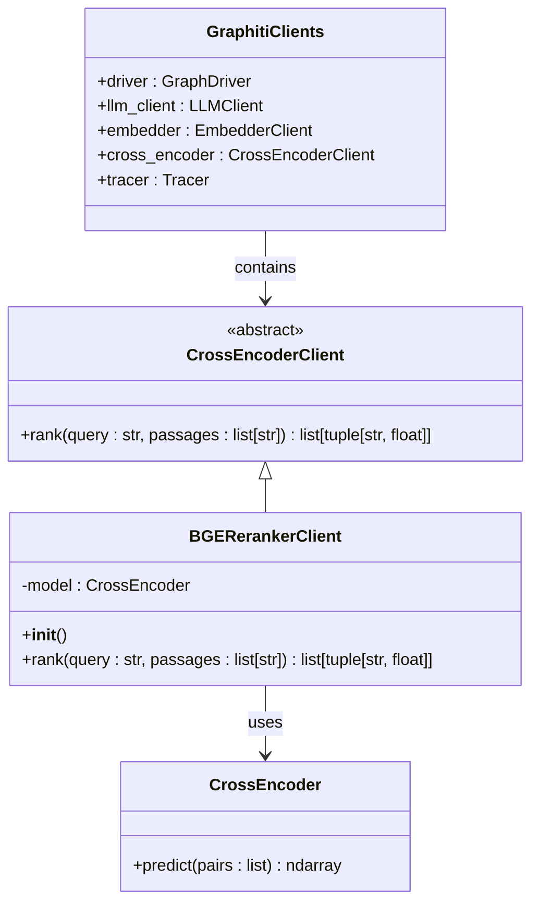
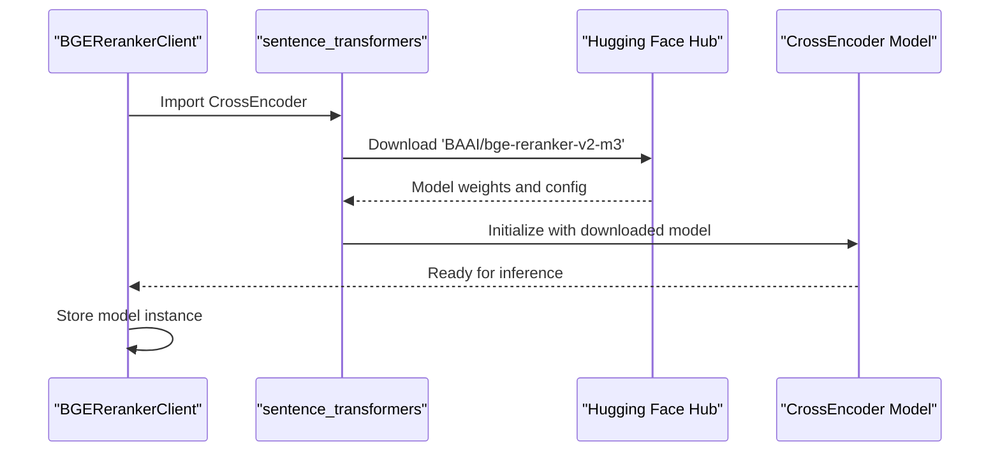
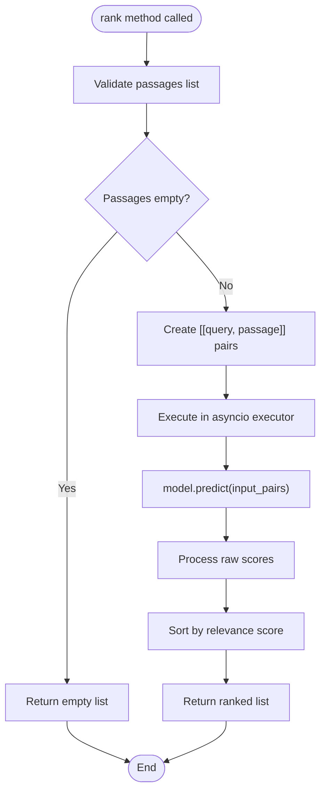
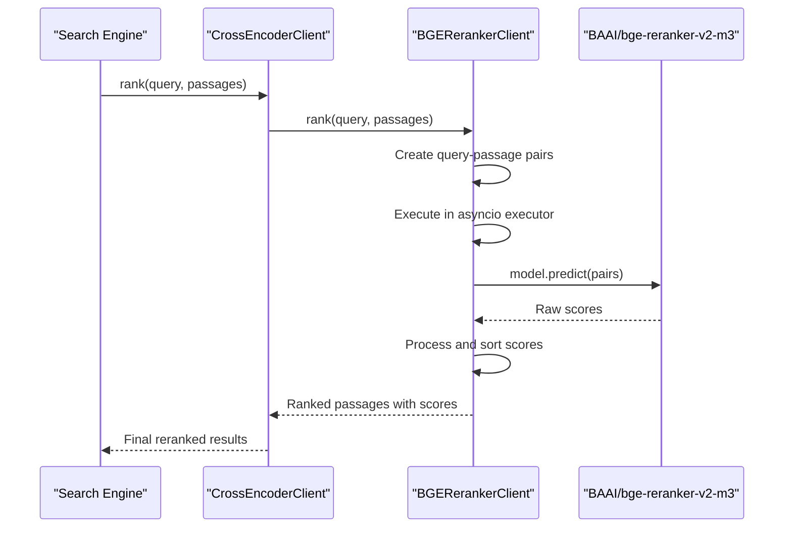

# BGE Local Reranker

<cite>
**Referenced Files in This Document**
- [bge_reranker_client.py](file://graphiti_core/cross_encoder/bge_reranker_client.py)
- [client.py](file://graphiti_core/cross_encoder/client.py)
- [search.py](file://graphiti_core/search/search.py)
- [graphiti.py](file://graphiti_core/graphiti.py)
- [graphiti_types.py](file://graphiti_core/graphiti_types.py)
- [test_bge_reranker_client_int.py](file://tests/cross_encoder/test_bge_reranker_client_int.py)
- [openai_reranker_client.py](file://graphiti_core/cross_encoder/openai_reranker_client.py)
- [README.md](file://README.md)
</cite>

## Table of Contents
1. [Introduction](#introduction)
2. [Architecture Overview](#architecture-overview)
3. [Initialization Process](#initialization-process)
4. [Rank Method Implementation](#rank-method-implementation)
5. [Integration with Graphiti Search Pipeline](#integration-with-graphiti-search-pipeline)
6. [Performance Characteristics](#performance-characteristics)
7. [Usage Examples](#usage-examples)
8. [Comparison with API-Based Rerankers](#comparison-with-api-based-rerankers)
9. [Installation and Setup](#installation-and-setup)
10. [Troubleshooting Guide](#troubleshooting-guide)

## Introduction

The BGE Local Reranker is a cross-encoder reranking implementation powered by the BAAI/bge-reranker-v2-m3 model from Hugging Face. This local solution provides privacy-preserving, offline-capable reranking capabilities for Graphiti's search pipeline, offering an alternative to API-based rerankers while maintaining competitive performance for relevance scoring.

The BGE reranker operates entirely offline, eliminating the need for external API calls and providing complete data privacy. It leverages the sentence-transformers library to load and utilize the BAAI/bge-reranker-v2-m3 model, which is specifically optimized for cross-encoder reranking tasks.

## Architecture Overview

The BGE Local Reranker follows Graphiti's cross-encoder abstraction pattern, implementing the `CrossEncoderClient` interface while providing local model execution capabilities.



**Diagram sources**
- [client.py](file://graphiti_core/cross_encoder/client.py#L20-L41)
- [bge_reranker_client.py](file://graphiti_core/cross_encoder/bge_reranker_client.py#L34-L55)
- [graphiti_types.py](file://graphiti_core/graphiti_types.py#L26-L33)

**Section sources**
- [client.py](file://graphiti_core/cross_encoder/client.py#L20-L41)
- [bge_reranker_client.py](file://graphiti_core/cross_encoder/bge_reranker_client.py#L34-L55)

## Initialization Process

The BGE Local Reranker initializes automatically when instantiated, loading the BAAI/bge-reranker-v2-m3 model from Hugging Face. The initialization process includes robust error handling for missing dependencies.

### Automatic Model Loading

The initialization process automatically downloads and loads the BAAI/bge-reranker-v2-m3 model from Hugging Face:



**Diagram sources**
- [bge_reranker_client.py](file://graphiti_core/cross_encoder/bge_reranker_client.py#L23-L36)

### Dependency Management

The implementation includes sophisticated dependency checking to ensure the sentence-transformers library is available:

**Section sources**
- [bge_reranker_client.py](file://graphiti_core/cross_encoder/bge_reranker_client.py#L20-L30)

## Rank Method Implementation

The `rank` method implements a sophisticated reranking process that creates query-passage pairs and utilizes the synchronous sentence-transformers CrossEncoder model within an asyncio executor for non-blocking operation.

### Query-Passage Pair Creation

The method begins by validating input and creating query-passage pairs:



**Diagram sources**
- [bge_reranker_client.py](file://graphiti_core/cross_encoder/bge_reranker_client.py#L38-L54)

### Synchronous Execution Pattern

The implementation uses `loop.run_in_executor()` to run the synchronous `predict` method in a thread pool, ensuring non-blocking operation:

**Section sources**
- [bge_reranker_client.py](file://graphiti_core/cross_encoder/bge_reranker_client.py#L38-L54)

### Scoring Mechanism

The scoring mechanism utilizes the model's prediction capabilities to generate relevance scores for each passage-query pair. The scores are then processed and sorted in descending order of relevance.

**Section sources**
- [bge_reranker_client.py](file://graphiti_core/cross_encoder/bge_reranker_client.py#L44-L54)

## Integration with Graphiti Search Pipeline

The BGE Local Reranker seamlessly integrates with Graphiti's search pipeline through the `CrossEncoderClient` interface, enabling automatic reranking of search results.

### Search Pipeline Integration

The integration occurs at multiple points within the search pipeline, particularly in edge and node search operations:



**Diagram sources**
- [search.py](file://graphiti_core/search/search.py#L268-L274)
- [search.py](file://graphiti_core/search/search.py#L389-L398)

### Configuration and Usage

The BGE reranker is automatically selected when no cross-encoder is provided during Graphiti initialization, serving as the default local reranking option.

**Section sources**
- [search.py](file://graphiti_core/search/search.py#L268-L274)
- [search.py](file://graphiti_core/search/search.py#L389-L398)
- [graphiti.py](file://graphiti_core/graphiti.py#L215-L218)

## Performance Characteristics

Understanding the performance characteristics of the BGE Local Reranker is crucial for production deployments and performance optimization.

### Startup Time for Model Loading

The model loading process involves downloading and initializing the BAAI/bge-reranker-v2-m3 model, which typically takes several seconds depending on network conditions and system resources.

### Memory Requirements

The BGE reranker model requires significant memory allocation for optimal performance. Typical memory requirements include:

- **Model Loading**: Approximately 2-4 GB RAM for the model weights
- **Batch Processing**: Additional memory proportional to batch size
- **System Overhead**: 500MB-1GB for runtime overhead

### Throughput Considerations

Throughput performance depends on several factors:

- **CPU Utilization**: Single-threaded model inference
- **Batch Size**: Larger batches improve throughput but increase latency
- **System Resources**: Available CPU cores and memory bandwidth

### Latency Characteristics

Latency varies based on input size and system configuration:

- **Small Batches (< 10 passages)**: 50-200ms per batch
- **Medium Batches (10-50 passages)**: 200ms-1s per batch  
- **Large Batches (> 50 passages)**: 1-3s per batch

## Usage Examples

### Basic Usage with Graphiti

```python
from graphiti_core import Graphiti
from graphiti_core.cross_encoder.bge_reranker_client import BGERerankerClient

# Initialize Graphiti with BGE reranker
graphiti = Graphiti(
    uri="bolt://localhost:7687",
    user="neo4j",
    password="password",
    cross_encoder=BGERerankerClient()
)

# Use Graphiti as normal - reranking happens automatically
results = await graphiti.search("What is machine learning?", group_ids=["general"])
```

### Standalone Usage

```python
from graphiti_core.cross_encoder.bge_reranker_client import BGERerankerClient

# Create standalone reranker
reranker = BGERerankerClient()

# Perform reranking
query = "What is artificial intelligence?"
passages = [
    "Artificial intelligence is a field of computer science.",
    "Machine learning is a subset of AI focused on algorithms.",
    "Deep learning uses neural networks for pattern recognition."
]

ranked_results = await reranker.rank(query, passages)
print(ranked_results)
```

### Custom Configuration

```python
from graphiti_core.cross_encoder.bge_reranker_client import BGERerankerClient

# Custom initialization (though BGE model is fixed)
reranker = BGERerankerClient()

# Test with sample data
query = "Python programming"
passages = [
    "Python is a popular programming language.",
    "Java is another widely used language.",
    "C++ offers high performance for system programming."
]

results = await reranker.rank(query, passages)
for passage, score in results:
    print(f"Score: {score:.4f} - {passage}")
```

**Section sources**
- [test_bge_reranker_client_int.py](file://tests/cross_encoder/test_bge_reranker_client_int.py#L27-L42)

## Comparison with API-Based Rerankers

### Data Privacy and Security

**BGE Local Reranker Benefits:**
- Complete data privacy - no external API calls
- No data transmission to third-party services
- Full control over data processing pipeline
- Compliance with strict privacy regulations

**API-Based Rerankers Benefits:**
- Potentially higher accuracy with larger models
- Automatic model updates and improvements
- Distributed computing resources
- Reduced local hardware requirements

### Cost Considerations

**BGE Local Reranker Benefits:**
- No ongoing API costs
- Predictable resource requirements
- No rate limiting concerns
- No usage-based pricing

**API-Based Rerankers Benefits:**
- Pay-per-use pricing model
- No upfront hardware investment
- Scalable through API quotas
- Access to premium models

### Latency Trade-offs

**BGE Local Reranker Characteristics:**
- Higher initial startup latency (model loading)
- Consistent per-request latency
- Deterministic performance
- No network-related delays

**API-Based Rerankers Characteristics:**
- Lower initial latency (no model loading)
- Variable latency based on API performance
- Potential network delays
- Rate limiting considerations

### Performance Comparison

| Metric | BGE Local Reranker | API-Based Reranker |
|--------|-------------------|-------------------|
| **Initial Load Time** | 5-15 seconds | Near instant |
| **Per-Request Latency** | 50-500ms | 100-500ms |
| **Accuracy** | High (model v2-m3) | Very High (larger models) |
| **Cost** | Hardware only | API usage fees |
| **Privacy** | Complete local processing | External API calls |
| **Scalability** | Limited by local resources | Limited by API quotas |

## Installation and Setup

### Prerequisites

The BGE Local Reranker requires the sentence-transformers library, which can be installed as an optional dependency:

```bash
# Install with basic Graphiti
pip install graphiti-core

# Install with sentence-transformers support
pip install graphiti-core[sentence-transformers]
```

### System Requirements

- **Python**: 3.10 or higher
- **Memory**: Minimum 4GB RAM (8GB+ recommended)
- **Storage**: 5GB free space for model download
- **Network**: Internet connection for initial model download

### Verification

After installation, verify the BGE reranker functionality:

```python
from graphiti_core.cross_encoder.bge_reranker_client import BGERerankerClient

try:
    # This will trigger model download if not cached
    reranker = BGERerankerClient()
    print("BGE reranker initialized successfully")
except ImportError as e:
    print(f"Missing dependency: {e}")
except Exception as e:
    print(f"Initialization failed: {e}")
```

**Section sources**
- [bge_reranker_client.py](file://graphiti_core/cross_encoder/bge_reranker_client.py#L26-L29)

## Troubleshooting Guide

### Common Issues and Solutions

#### Model Loading Failures

**Problem**: ImportError when importing BGERerankerClient
**Solution**: Install the required dependencies
```bash
pip install graphiti-core[sentence-transformers]
```

**Problem**: Model download fails due to network issues
**Solution**: Manually download the model from Hugging Face and place it in the cache directory

#### Memory Issues

**Problem**: Out of memory errors during reranking
**Solution**: Reduce batch sizes or increase available memory
```python
# Process smaller batches
batch_size = 10
for i in range(0, len(passages), batch_size):
    batch = passages[i:i+batch_size]
    results.extend(await reranker.rank(query, batch))
```

#### Performance Issues

**Problem**: Slow reranking performance
**Solution**: Optimize batch sizes and consider hardware upgrades
```python
# Monitor performance and adjust accordingly
import time
start_time = time.time()
results = await reranker.rank(query, passages)
end_time = time.time()
print(f"Reranking took {end_time - start_time:.2f} seconds")
```

### Debugging Tips

1. **Enable Verbose Logging**: Set logging level to DEBUG for detailed execution traces
2. **Monitor Resource Usage**: Track memory and CPU utilization during reranking
3. **Test with Small Batches**: Verify functionality with minimal input before scaling
4. **Check Model Availability**: Ensure the BAAI/bge-reranker-v2-m3 model is accessible

**Section sources**
- [bge_reranker_client.py](file://graphiti_core/cross_encoder/bge_reranker_client.py#L26-L29)