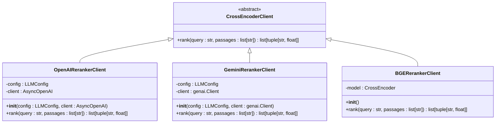
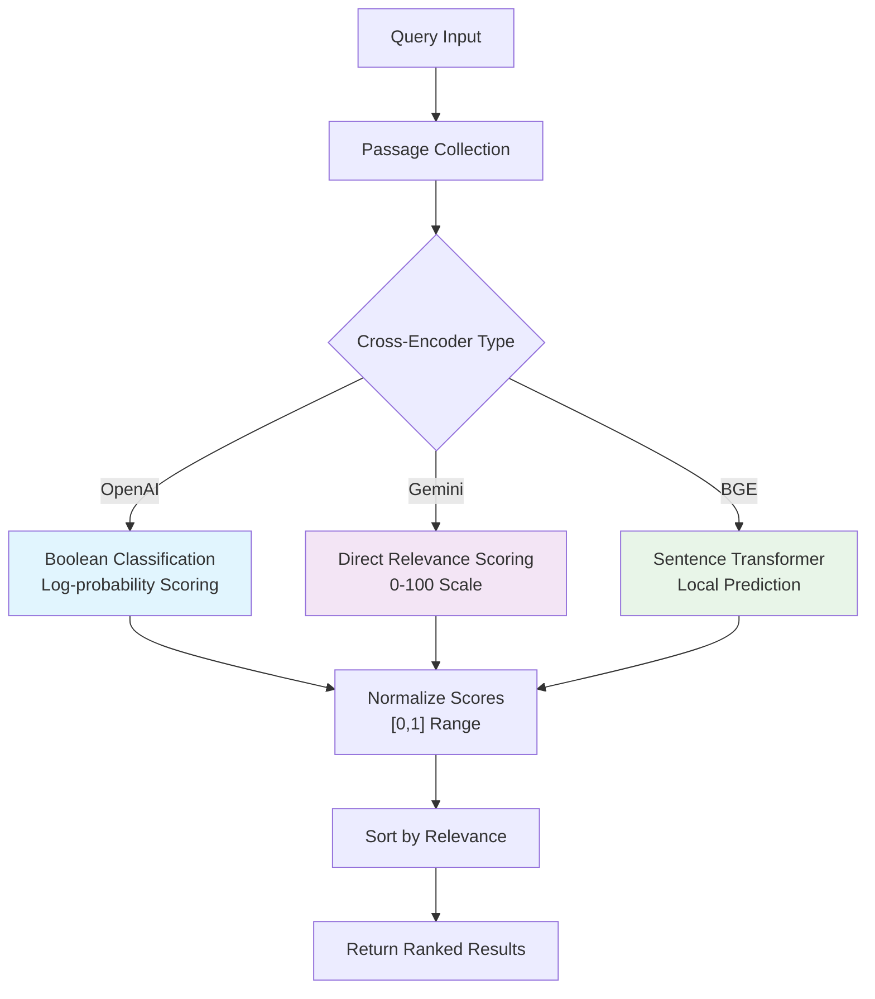
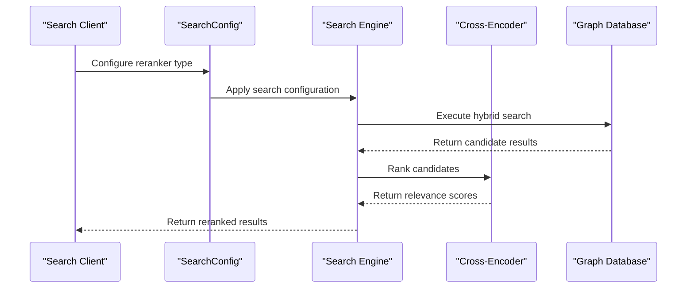

# Cross-Encoder Reranker API Documentation

<cite>
**Referenced Files in This Document**
- [client.py](file://graphiti_core/cross_encoder/client.py)
- [openai_reranker_client.py](file://graphiti_core/cross_encoder/openai_reranker_client.py)
- [gemini_reranker_client.py](file://graphiti_core/cross_encoder/gemini_reranker_client.py)
- [bge_reranker_client.py](file://graphiti_core/cross_encoder/bge_reranker_client.py)
- [search.py](file://graphiti_core/search/search.py)
- [graphiti.py](file://graphiti_core/graphiti.py)
- [search_config.py](file://graphiti_core/search/search_config.py)
- [search_config_recipes.py](file://graphiti_core/search/search_config_recipes.py)
- [test_bge_reranker_client_int.py](file://tests/cross_encoder/test_bge_reranker_client_int.py)
- [test_gemini_reranker_client.py](file://tests/cross_encoder/test_gemini_reranker_client.py)
</cite>

## Table of Contents
1. [Introduction](#introduction)
2. [CrossEncoderClient Abstract Base Class](#crossencoderclient-abstract-base-class)
3. [Implementation Overview](#implementation-overview)
4. [OpenAI Reranker Client](#openai-reranker-client)
5. [Gemini Reranker Client](#gemini-reranker-client)
6. [BGE Reranker Client](#bge-reranker-client)
7. [Integration with Hybrid Search System](#integration-with-hybrid-search-system)
8. [Configuration and Usage Examples](#configuration-and-usage-examples)
9. [Performance Characteristics](#performance-characteristics)
10. [Best Practices and Recommendations](#best-practices-and-recommendations)

## Introduction

The Cross-Encoder reranking system in Graphiti provides advanced relevance scoring capabilities for search results in knowledge graphs. Cross-encoders are specialized models that evaluate the relevance of individual passages to a given query by considering the interaction between the query and each passage simultaneously, resulting in superior relevance ranking compared to traditional retrieval methods.

Cross-encoders play a crucial role in enhancing search result quality by providing fine-grained relevance scores that help filter and rank search results based on contextual understanding rather than just surface-level similarity metrics.

## CrossEncoderClient Abstract Base Class

The `CrossEncoderClient` serves as the foundation for all cross-encoder implementations in Graphiti, defining a standardized interface for relevance scoring.



**Diagram sources**
- [client.py](file://graphiti_core/cross_encoder/client.py#L20-L41)
- [openai_reranker_client.py](file://graphiti_core/cross_encoder/openai_reranker_client.py#L34-L124)
- [gemini_reranker_client.py](file://graphiti_core/cross_encoder/gemini_reranker_client.py#L43-L162)
- [bge_reranker_client.py](file://graphiti_core/cross_encoder/bge_reranker_client.py#L34-L55)

### Core Interface Methods

The `rank` method is the primary interface for all cross-encoder implementations:

| Parameter | Type | Description |
|-----------|------|-------------|
| `query` | `str` | The search query string to evaluate relevance against |
| `passages` | `list[str]` | A list of text passages to rank by relevance to the query |

| Return Value | Type | Description |
|--------------|------|-------------|
| `results` | `list[tuple[str, float]]` | A list of (passage, score) tuples sorted in descending order of relevance |

**Section sources**
- [client.py](file://graphiti_core/cross_encoder/client.py#L27-L40)

## Implementation Overview

Graphiti supports three distinct cross-encoder implementations, each optimized for different use cases and deployment scenarios:

### Provider Comparison Matrix

| Feature | OpenAI Reranker | Gemini Reranker | BGE Reranker |
|---------|----------------|-----------------|--------------|
| **Model Type** | GPT-based classifier | Gemini direct scoring | Sentence transformer |
| **Deployment** | Cloud API | Cloud API | Local model |
| **Latency** | Higher (API calls) | Higher (API calls) | Lower (local) |
| **Cost** | Per-token pricing | Per-token pricing | Free (local) |
| **Customization** | Limited | Limited | Limited |
| **Offline Capability** | No | No | Yes |
| **Batch Processing** | Concurrent API calls | Concurrent API calls | Synchronous processing |

### Reranking Process Flow



## OpenAI Reranker Client

The OpenAI reranker implements a sophisticated boolean classification approach using GPT models to determine passage relevance.

### Architecture and Design

The OpenAI reranker uses a dual-prompt strategy with log-probability analysis:

1. **System Prompt**: Establishes the expert role for relevance assessment
2. **User Prompt**: Presents the passage-query pair for evaluation
3. **Log-probability Analysis**: Extracts confidence scores from model responses
4. **Normalization**: Converts binary classification to continuous relevance scores

### Configuration Options

| Parameter | Type | Default | Description |
|-----------|------|---------|-------------|
| `model` | `str` | `'gpt-4.1-nano'` | OpenAI model for reranking |
| `temperature` | `float` | `0.0` | Deterministic responses |
| `max_tokens` | `int` | `1` | Minimal token usage |
| `logit_bias` | `dict` | `{'6432': 1, '7983': 1}` | Bias towards 'True'/'False' tokens |

### Implementation Details

The OpenAI reranker employs concurrent processing for optimal performance:

- **Concurrent Execution**: Uses `semaphore_gather` for parallel API calls
- **Log-probability Extraction**: Analyzes top log probabilities for confidence scoring
- **Response Validation**: Handles edge cases and malformed responses gracefully

### Usage Example

```python
from graphiti_core.cross_encoder.openai_reranker_client import OpenAIRerankerClient
from graphiti_core.llm_client import LLMConfig

# Initialize with custom configuration
config = LLMConfig(
    api_key="your-api-key",
    model="gpt-4-turbo",
    temperature=0.0
)

reranker = OpenAIRerankerClient(config=config)

# Perform reranking
query = "What is machine learning?"
passages = [
    "Machine learning is a subset of artificial intelligence.",
    "A computer is a device that processes information.",
    "Machine learning algorithms improve automatically."
]

results = await reranker.rank(query, passages)
```

**Section sources**
- [openai_reranker_client.py](file://graphiti_core/cross_encoder/openai_reranker_client.py#L34-L124)

## Gemini Reranker Client

The Gemini reranker provides direct relevance scoring through Google's generative AI models, offering a streamlined approach to cross-encoding.

### Architecture and Design

Unlike OpenAI's classification approach, Gemini reranker uses direct numerical scoring:

1. **Scoring Prompt**: Generates relevance scores on a 0-100 scale
2. **Concurrent Processing**: Executes multiple scoring requests in parallel
3. **Regex Extraction**: Robust parsing of numerical responses
4. **Error Handling**: Graceful fallback for invalid responses

### Configuration Options

| Parameter | Type | Default | Description |
|-----------|------|---------|-------------|
| `model` | `str` | `'gemini-2.5-flash-lite-preview-06-17'` | Gemini model for scoring |
| `temperature` | `float` | `0.0` | Deterministic scoring |
| `max_output_tokens` | `int` | `3` | Numeric response constraint |

### Advanced Features

- **Regex Pattern Matching**: Extracts numbers from various response formats
- **Score Clamping**: Ensures scores remain within valid [0, 1] range
- **Rate Limit Detection**: Identifies and handles API quotas and limits
- **Multi-format Support**: Handles various response patterns and edge cases

### Usage Example

```python
from graphiti_core.cross_encoder.gemini_reranker_client import GeminiRerankerClient
from graphiti_core.llm_client import LLMConfig

# Initialize with Gemini configuration
config = LLMConfig(
    api_key="your-gemini-api-key",
    model="gemini-2.5-pro"
)

reranker = GeminiRerankerClient(config=config)

# Perform reranking
query = "Artificial intelligence applications"
passages = [
    "AI is transforming industries worldwide.",
    "Computer science focuses on algorithms.",
    "Machine learning is a key AI technology."
]

results = await reranker.rank(query, passages)
```

**Section sources**
- [gemini_reranker_client.py](file://graphiti_core/cross_encoder/gemini_reranker_client.py#L43-L162)

## BGE Reranker Client

The BGE reranker utilizes local sentence transformer models for offline, high-performance relevance scoring.

### Architecture and Design

The BGE implementation leverages the BAAI/bge-reranker-v2-m3 model:

1. **Local Model Loading**: Instantiates the cross-encoder model
2. **Synchronous Processing**: Uses thread pool executor for CPU-intensive tasks
3. **Batch Prediction**: Processes multiple query-passage pairs efficiently
4. **Score Normalization**: Returns raw model predictions as relevance scores

### Configuration and Dependencies

- **Model**: BAAI/bge-reranker-v2-m3 (automatically downloaded)
- **Dependencies**: `sentence-transformers` library
- **Installation**: `pip install graphiti-core[sentence-transformers]`

### Performance Characteristics

- **Latency**: Sub-millisecond per passage for small batches
- **Throughput**: High throughput for batch processing
- **Resource Usage**: CPU-intensive, scales with batch size
- **Memory**: Moderate memory footprint for the model

### Usage Example

```python
from graphiti_core.cross_encoder.bge_reranker_client import BGERerankerClient

# Initialize BGE reranker (automatic model download)
reranker = BGERerankerClient()

# Perform reranking
query = "Deep learning architectures"
passages = [
    "Convolutional neural networks excel in image recognition.",
    "Recurrent neural networks handle sequential data.",
    "Transformers revolutionized natural language processing."
]

results = await reranker.rank(query, passages)
```

**Section sources**
- [bge_reranker_client.py](file://graphiti_core/cross_encoder/bge_reranker_client.py#L34-L55)

## Integration with Hybrid Search System

Cross-encoders integrate seamlessly with Graphiti's hybrid search system, enhancing retrieval quality through relevance-based filtering and ranking.

### Search Configuration Integration



**Diagram sources**
- [search.py](file://graphiti_core/search/search.py#L68-L183)
- [search_config.py](file://graphiti_core/search/search_config.py#L112-L130)

### Supported Search Types

Cross-encoders can be applied across all Graphiti search domains:

| Search Domain | Reranker Application | Benefits |
|---------------|---------------------|----------|
| **Edge Search** | Facts and relationships | Filter semantically irrelevant edges |
| **Node Search** | Entity names and descriptions | Improve entity identification accuracy |
| **Episode Search** | Content and context | Enhance temporal relevance |
| **Community Search** | Community summaries | Refine community-level retrieval |

### Configuration Recipes

Graphiti provides pre-configured search recipes that incorporate cross-encoder reranking:

```python
from graphiti_core.search.search_config_recipes import COMBINED_HYBRID_SEARCH_CROSS_ENCODER

# Full hybrid search with cross-encoder reranking
search_config = COMBINED_HYBRID_SEARCH_CROSS_ENCODER

# Apply to Graphiti instance
results = await graphiti.search("query", config=search_config)
```

**Section sources**
- [search.py](file://graphiti_core/search/search.py#L68-L183)
- [search_config_recipes.py](file://graphiti_core/search/search_config_recipes.py#L80-L108)

## Configuration and Usage Examples

### Basic Integration with Graphiti

```python
from graphiti_core import Graphiti
from graphiti_core.cross_encoder.openai_reranker_client import OpenAIRerankerClient
from graphiti_core.llm_client import LLMConfig

# Initialize Graphiti with custom reranker
config = LLMConfig(api_key="your-api-key")
reranker = OpenAIRerankerClient(config=config)

graphiti = Graphiti(
    uri="neo4j://localhost:7687",
    user="neo4j",
    password="password",
    cross_encoder=reranker
)

# Perform search with reranking
results = await graphiti.search(
    query="machine learning applications",
    config=COMBINED_HYBRID_SEARCH_CROSS_ENCODER
)
```

### Custom Reranker Configuration

```python
from graphiti_core.cross_encoder.gemini_reranker_client import GeminiRerankerClient
from graphiti_core.search.search_config import (
    SearchConfig, EdgeSearchConfig, EdgeReranker, EdgeSearchMethod
)

# Custom edge search with Gemini reranker
custom_config = SearchConfig(
    edge_config=EdgeSearchConfig(
        search_methods=[
            EdgeSearchMethod.bm25,
            EdgeSearchMethod.cosine_similarity,
            EdgeSearchMethod.bfs
        ],
        reranker=EdgeReranker.cross_encoder
    )
)

# Initialize with Gemini reranker
gemini_reranker = GeminiRerankerClient(
    config=LLMConfig(api_key="gemini-key", model="gemini-pro")
)

# Use in search
results = await graphiti.search(
    query="artificial intelligence",
    config=custom_config
)
```

### Performance Monitoring

```python
import time
from graphiti_core import Graphiti

# Measure reranking performance
start_time = time.time()

results = await graphiti.search(
    query="complex query with multiple passages",
    config=COMBINED_HYBRID_SEARCH_CROSS_ENCODER
)

end_time = time.time()
processing_time = end_time - start_time

print(f"Search completed in {processing_time:.2f} seconds")
print(f"Returned {len(results.edges)} edges with reranking scores")
```

## Performance Characteristics

### Latency Analysis

| Reranker Type | Typical Latency | Factors Affecting Performance |
|---------------|----------------|------------------------------|
| **OpenAI** | 200-800ms per batch | API round-trip, concurrent calls |
| **Gemini** | 150-600ms per batch | API latency, response parsing |
| **BGE** | 10-50ms per batch | Model inference, batch size |

### Throughput Considerations

- **OpenAI/Gemini**: Limited by API rate limits and concurrent request caps
- **BGE**: Limited by CPU cores and model memory requirements
- **Batch Processing**: Significant improvements when processing multiple passages

### Cost Analysis

| Provider | Cost Model | Typical Costs | Optimization Strategies |
|----------|------------|---------------|------------------------|
| **OpenAI** | Per-token pricing | $0.01-0.03 per 1K tokens | Reduce passage length, optimize prompts |
| **Gemini** | Per-token pricing | $0.005-0.015 per 1K tokens | Similar optimizations as OpenAI |
| **BGE** | Free | Zero cost | Best for high-volume, cost-sensitive applications |

## Best Practices and Recommendations

### When to Use Each Implementation

#### Choose OpenAI Reranker When:
- Need high-quality, nuanced relevance assessment
- Working with complex, multi-faceted queries
- Budget allows for API costs
- Require advanced prompt engineering capabilities

#### Choose Gemini Reranker When:
- Prefer Google's generative AI ecosystem
- Need consistent performance across languages
- Working with mixed-language content
- Require moderate API reliability

#### Choose BGE Reranker When:
- Operating in offline environments
- Processing high-volume reranking requests
- Need minimal latency for small batches
- Working with sensitive data requiring local processing

### Optimization Strategies

#### Query Optimization
- **Preprocessing**: Clean and normalize query text
- **Length Management**: Keep queries concise while maintaining context
- **Domain Adaptation**: Tailor prompts for specific domains

#### Passage Optimization
- **Content Filtering**: Remove irrelevant or redundant passages
- **Length Standardization**: Balance detail with processing efficiency
- **Format Consistency**: Maintain uniform passage structure

#### Performance Tuning
- **Batch Size**: Optimize for provider rate limits and model capacity
- **Caching**: Implement result caching for repeated queries
- **Parallel Processing**: Leverage concurrent execution for multiple passages

### Error Handling and Resilience

```python
from graphiti_core.cross_encoder.client import CrossEncoderClient
from graphiti_core.llm_client import RateLimitError

async def robust_reranking(
    reranker: CrossEncoderClient,
    query: str,
    passages: list[str],
    max_retries: int = 3
):
    """Robust reranking with error handling."""
    for attempt in range(max_retries):
        try:
            return await reranker.rank(query, passages)
        except RateLimitError:
            if attempt == max_retries - 1:
                raise
            await asyncio.sleep(2 ** attempt)  # Exponential backoff
        except Exception as e:
            logger.warning(f"Reranking failed: {e}")
            if attempt == max_retries - 1:
                # Return unranked results as fallback
                return [(p, 0.5) for p in passages]
```

### Monitoring and Metrics

Track these key metrics for optimal performance:

- **Response Time**: Average and percentile latencies
- **Success Rate**: Percentage of successful reranking attempts
- **Score Distribution**: Variance and distribution of relevance scores
- **Error Rates**: Frequency and types of failures
- **Cost Efficiency**: Tokens consumed vs. quality improvement

### Testing and Validation

Implement comprehensive testing for production deployments:

```python
import pytest
from graphiti_core.cross_encoder.client import CrossEncoderClient

@pytest.mark.asyncio
async def test_reranker_quality():
    """Test reranker performance with known relevance patterns."""
    reranker: CrossEncoderClient = get_production_reranker()
    
    test_cases = [
        {
            "query": "machine learning",
            "passages": [
                "Deep learning algorithms learn from data.",
                "Computer hardware components.",
                "Machine learning frameworks like TensorFlow."
            ],
            "expected_order": [2, 0, 1]  # Expected relevance order
        }
    ]
    
    for case in test_cases:
        results = await reranker.rank(case["query"], case["passages"])
        result_indices = [i for i, _ in results]
        
        assert result_indices == case["expected_order"], \
            f"Expected {case['expected_order']}, got {result_indices}"
```

**Section sources**
- [test_bge_reranker_client_int.py](file://tests/cross_encoder/test_bge_reranker_client_int.py#L27-L79)
- [test_gemini_reranker_client.py](file://tests/cross_encoder/test_gemini_reranker_client.py#L84-L354)