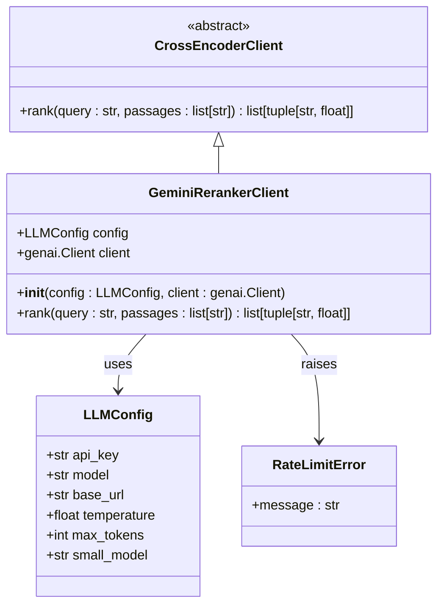
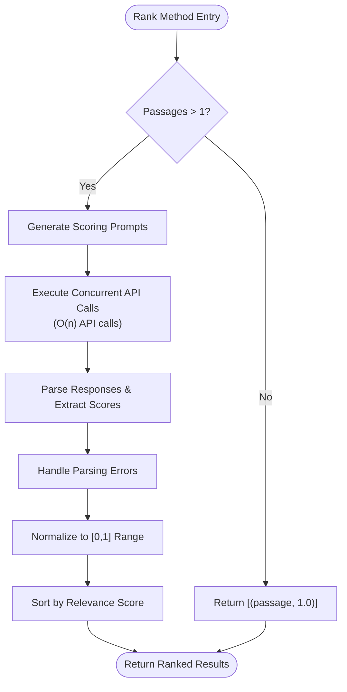
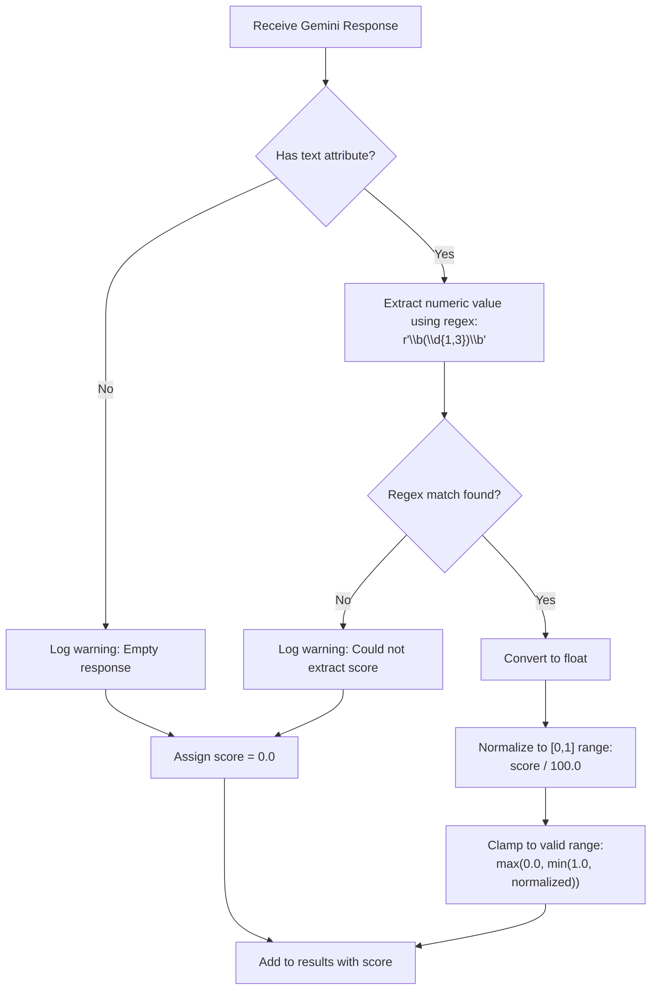
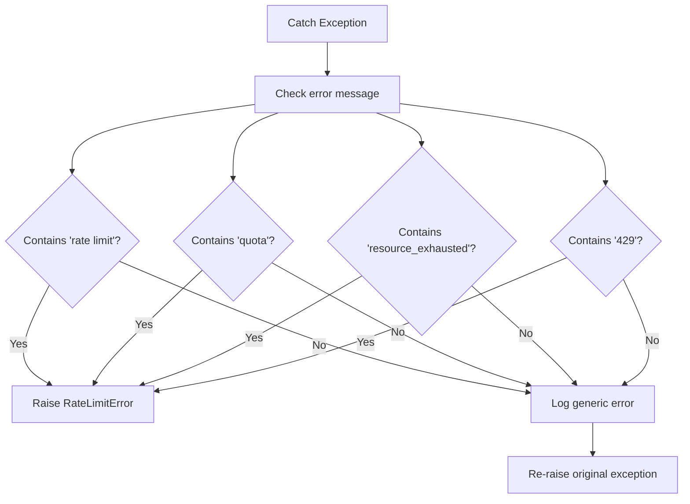

# Google Gemini Reranker API Documentation

<cite>
**Referenced Files in This Document**
- [gemini_reranker_client.py](file://graphiti_core/cross_encoder/gemini_reranker_client.py)
- [test_gemini_reranker_client.py](file://tests/cross_encoder/test_gemini_reranker_client.py)
- [config.py](file://graphiti_core/llm_client/config.py)
- [client.py](file://graphiti_core/cross_encoder/client.py)
- [helpers.py](file://graphiti_core/helpers.py)
- [README.md](file://README.md)
</cite>

## Table of Contents
1. [Introduction](#introduction)
2. [Architecture Overview](#architecture-overview)
3. [Initialization and Configuration](#initialization-and-configuration)
4. [Core Implementation Details](#core-implementation-details)
5. [Scoring Prompt Design](#scoring-prompt-design)
6. [Response Parsing and Normalization](#response-parsing-and-normalization)
7. [Error Handling](#error-handling)
8. [Performance Considerations](#performance-considerations)
9. [Integration Examples](#integration-examples)
10. [Best Practices and Use Cases](#best-practices-and-use-cases)
11. [Troubleshooting Guide](#troubleshooting-guide)

## Introduction

The GeminiRerankerClient is a specialized cross-encoder implementation that leverages Google's Gemini API to perform direct relevance scoring of passages. Unlike traditional rerankers that rely on logprobs for probabilistic scoring, this implementation uses the Gemini API's text generation capabilities to directly rate passage relevance on a 0-100 scale, then normalizes these scores to the [0,1] range for compatibility with the Graphiti framework.

This approach is particularly valuable when working with the Gemini Developer API, which currently lacks native logprobs support. The client implements sophisticated prompt engineering and response parsing to deliver reliable relevance scoring for knowledge graph applications.

## Architecture Overview

The GeminiRerankerClient follows a hierarchical architecture pattern within the Graphiti framework:



**Diagram sources**
- [client.py](file://graphiti_core/cross_encoder/client.py#L20-L41)
- [gemini_reranker_client.py](file://graphiti_core/cross_encoder/gemini_reranker_client.py#L43-L72)
- [config.py](file://graphiti_core/llm_client/config.py#L28-L69)

**Section sources**
- [client.py](file://graphiti_core/cross_encoder/client.py#L20-L41)
- [gemini_reranker_client.py](file://graphiti_core/cross_encoder/gemini_reranker_client.py#L43-L72)

## Initialization and Configuration

### Constructor Parameters

The GeminiRerankerClient accepts two primary configuration parameters:

| Parameter | Type | Required | Description |
|-----------|------|----------|-------------|
| `config` | `LLMConfig \| None` | No | Configuration object containing API key, model, base URL, temperature, and max tokens. Defaults to `LLMConfig()` if not provided. |
| `client` | `genai.Client \| None` | No | Optional async client instance. If not provided, a new `genai.Client` is created using the config's API key. |

### LLMConfig Options

The underlying LLMConfig provides comprehensive configuration options:

| Parameter | Type | Default | Description |
|-----------|------|---------|-------------|
| `api_key` | `str \| None` | `None` | Google API authentication key |
| `model` | `str \| None` | `None` | Specific Gemini model to use (defaults to `gemini-2.5-flash-lite-preview-06-17`) |
| `base_url` | `str \| None` | `None` | Base URL for API requests (typically not needed for Gemini) |
| `temperature` | `float` | `1.0` | Controls randomness in generation (set to 0.0 for deterministic scoring) |
| `max_tokens` | `int` | `8192` | Maximum tokens in response |
| `small_model` | `str \| None` | `None` | Alternative model for simpler prompts |

### Default Model Configuration

The client uses `gemini-2.5-flash-lite-preview-06-17` as the default model, optimized for cost-effective and low-latency classification tasks. This model is specifically chosen for its balance between performance and cost when performing relevance scoring.

**Section sources**
- [gemini_reranker_client.py](file://graphiti_core/cross_encoder/gemini_reranker_client.py#L48-L72)
- [config.py](file://graphiti_core/llm_client/config.py#L37-L69)

## Core Implementation Details

### Rank Method Implementation

The `rank` method implements a sophisticated scoring pipeline that handles multiple passages concurrently:



**Diagram sources**
- [gemini_reranker_client.py](file://graphiti_core/cross_encoder/gemini_reranker_client.py#L73-L162)

### Concurrent API Processing

The implementation uses the `semaphore_gather` function from the helpers module to execute API calls concurrently while respecting system-wide concurrency limits:

- **Concurrency Control**: Uses `SEMAPHORE_LIMIT` (default: 20) to prevent overwhelming the API
- **Individual Processing**: Each passage receives a dedicated API call for accurate scoring
- **Batch Optimization**: Handles single passage scenarios efficiently without unnecessary API calls

**Section sources**
- [gemini_reranker_client.py](file://graphiti_core/cross_encoder/gemini_reranker_client.py#L73-L162)
- [helpers.py](file://graphiti_core/helpers.py#L105-L117)

## Scoring Prompt Design

### Prompt Structure

The scoring prompt is carefully engineered to elicit precise numerical ratings:

```
Rate how well this passage answers or relates to the query. Use a scale from 0 to 100.

Query: {query}

Passage: {passage}

Provide only a number between 0 and 100 (no explanation, just the number):
```

### Prompt Engineering Features

1. **Clear Instructions**: Explicitly instructs the model to provide only a number
2. **Contextual Framing**: Provides both query and passage context for accurate assessment
3. **Scale Specification**: Uses a 0-100 scale for fine-grained scoring
4. **Output Constraint**: Prevents verbose responses through explicit instruction

### System Instruction

The system instruction ensures consistent behavior:
- "You are an expert at rating passage relevance"
- "Respond with only a number from 0-100"

**Section sources**
- [gemini_reranker_client.py](file://graphiti_core/cross_encoder/gemini_reranker_client.py#L83-L95)

## Response Parsing and Normalization

### Numeric Extraction Strategy

The response parsing employs robust regex-based extraction:



**Diagram sources**
- [gemini_reranker_client.py](file://graphiti_core/cross_encoder/gemini_reranker_client.py#L120-L144)

### Error Handling Strategies

The implementation includes multiple layers of error handling:

1. **Response Validation**: Checks for presence of text attribute
2. **Regex Matching**: Validates numeric extraction using `\b(\d{1,3})\b` pattern
3. **Type Safety**: Handles conversion errors gracefully
4. **Fallback Values**: Assigns 0.0 for invalid or missing scores

### Score Normalization

Scores undergo a two-step normalization process:
1. **Raw Conversion**: Divide by 100.0 to convert from 0-100 scale to 0-1 range
2. **Range Clamping**: Ensure values stay within [0.0, 1.0] bounds

**Section sources**
- [gemini_reranker_client.py](file://graphiti_core/cross_encoder/gemini_reranker_client.py#L120-L144)

## Error Handling

### Rate Limit Detection

The client implements comprehensive rate limit error detection:



**Diagram sources**
- [gemini_reranker_client.py](file://graphiti_core/cross_encoder/gemini_reranker_client.py#L149-L161)

### Supported Error Patterns

The error detection mechanism recognizes multiple rate limiting indicators:

| Pattern | Description |
|---------|-------------|
| `'rate limit'` | Standard rate limit messages |
| `'quota'` | Quota exhaustion notifications |
| `'resource_exhausted'` | Resource limit exceeded |
| `'429'` | HTTP 429 Too Many Requests status |

### Graceful Degradation

For non-rate-limit errors, the system implements graceful degradation:
- Logs detailed error information
- Continues processing remaining passages
- Returns partial results when possible

**Section sources**
- [gemini_reranker_client.py](file://graphiti_core/cross_encoder/gemini_reranker_client.py#L149-L161)

## Performance Considerations

### Complexity Analysis

| Operation | Time Complexity | Space Complexity | Notes |
|-----------|----------------|------------------|-------|
| Single Passage | O(1) | O(1) | Returns immediately with full score |
| Multiple Passages | O(n) | O(n) | N API calls, N results stored |
| Response Parsing | O(m) | O(1) | M = average response length |
| Sorting | O(n log n) | O(n) | Results sorted by relevance |

### API Call Optimization

- **Concurrent Processing**: Uses semaphore-based concurrency control
- **Individual Calls**: Each passage gets dedicated API call for accuracy
- **Batch Efficiency**: Single passage optimization avoids unnecessary calls

### Memory Management

- **Streaming Results**: Processes passages individually to minimize memory footprint
- **Result Collection**: Stores only final ranked results
- **Error Isolation**: Individual passage failures don't affect others

### Performance Tuning Recommendations

1. **Semaphore Limits**: Adjust `SEMAPHORE_LIMIT` based on API quotas
2. **Model Selection**: Use lighter models for high-volume scenarios
3. **Caching**: Implement application-level caching for repeated queries
4. **Batch Size**: Consider batching multiple reranking requests

**Section sources**
- [helpers.py](file://graphiti_core/helpers.py#L105-L117)
- [gemini_reranker_client.py](file://graphiti_core/cross_encoder/gemini_reranker_client.py#L102-L117)

## Integration Examples

### Basic Usage Example

```python
from graphiti_core.cross_encoder.gemini_reranker_client import GeminiRerankerClient
from graphiti_core.llm_client import LLMConfig

# Initialize with API key
config = LLMConfig(
    api_key="your-google-api-key",
    model="gemini-2.5-flash-lite-preview-06-17"
)

reranker = GeminiRerankerClient(config=config)

# Use with passages
query = "What is machine learning?"
passages = [
    "Machine learning is a subset of artificial intelligence.",
    "Neural networks are used in computer vision applications.",
    "Artificial intelligence encompasses machine learning and deep learning."
]

results = await reranker.rank(query, passages)
# Returns: [(relevant_passage, 0.95), (related_passage, 0.75), ...]
```

### Graphiti Framework Integration

```python
from graphiti_core import Graphiti
from graphiti_core.cross_encoder.gemini_reranker_client import GeminiRerankerClient
from graphiti_core.llm_client import LLMConfig

# Configure Graphiti with Gemini reranker
graphiti = Graphiti(
    uri="bolt://localhost:7687",
    username="neo4j",
    password="password",
    cross_encoder=GeminiRerankerClient(
        config=LLMConfig(
            api_key="<your-google-api-key>",
            model="gemini-2.5-flash-lite-preview-06-17"
        )
    )
)

# Now Graphiti uses Gemini for reranking
results = await graphiti.search("machine learning concepts")
```

### Advanced Configuration Example

```python
from graphiti_core.cross_encoder.gemini_reranker_client import GeminiRerankerClient
from graphiti_core.llm_client import LLMConfig
from google import genai

# Custom client configuration
custom_client = genai.Client(api_key="your-api-key")

# Advanced reranker configuration
reranker = GeminiRerankerClient(
    config=LLMConfig(
        api_key="your-api-key",
        model="gemini-2.5-flash-lite-preview-06-17",
        temperature=0.0,  # Deterministic scoring
        max_tokens=1000  # Sufficient for scoring prompts
    ),
    client=custom_client
)
```

**Section sources**
- [README.md](file://README.md#L432-L487)
- [test_gemini_reranker_client.py](file://tests/cross_encoder/test_gemini_reranker_client.py#L39-L46)

## Best Practices and Use Cases

### When to Choose Gemini Reranker

#### Advantages of Gemini Reranker

1. **Cost-Effective**: Lower API costs compared to logprob-based approaches
2. **High Accuracy**: Leverages latest Gemini model capabilities
3. **Deterministic Output**: Consistent scoring with temperature=0.0
4. **No Logprobs Required**: Works with current Gemini API limitations

#### Optimal Use Cases

| Scenario | Recommendation |
|----------|----------------|
| Cost-sensitive applications | Gemini reranker (lower API costs) |
| High-volume reranking | Gemini with careful rate limiting |
| Academic research | Gemini for reproducible results |
| Production systems | Gemini with monitoring and fallbacks |

### Configuration Best Practices

1. **API Key Security**: Store keys securely using environment variables
2. **Model Selection**: Use `gemini-2.5-flash-lite-preview-06-17` for cost optimization
3. **Temperature Setting**: Keep at 0.0 for deterministic scoring
4. **Rate Limiting**: Monitor API usage and implement appropriate delays

### Performance Optimization

1. **Concurrent Processing**: Leverage built-in semaphore control
2. **Caching Strategy**: Cache frequent query results
3. **Batch Processing**: Group related reranking requests
4. **Monitoring**: Track API costs and response times

## Troubleshooting Guide

### Common Issues and Solutions

#### API Authentication Errors

**Problem**: `ImportError` for missing `google-genai` package
**Solution**: Install with Google GenAI support:
```bash
pip install graphiti-core[google-genai]
# or
uv add graphiti-core[google-genai]
```

**Problem**: Invalid API key or authentication failure
**Solution**: Verify API key validity and Google Cloud project setup

#### Rate Limiting Issues

**Problem**: `RateLimitError` exceptions
**Solution**: 
1. Reduce `SEMAPHORE_LIMIT` environment variable
2. Implement exponential backoff retry logic
3. Monitor API usage quotas

#### Malformed Response Handling

**Problem**: Unexpected response formats causing parsing errors
**Solution**: The implementation includes robust error handling:
- Falls back to 0.0 for invalid scores
- Logs warnings for debugging
- Continues processing remaining passages

#### Performance Issues

**Problem**: Slow reranking performance
**Solution**:
1. Increase `SEMAPHORE_LIMIT` cautiously
2. Use lighter models for high-volume scenarios
3. Implement application-level caching
4. Consider batch processing for multiple queries

### Debugging Techniques

1. **Enable Logging**: Set logging level to DEBUG for detailed API interactions
2. **Monitor Costs**: Track API usage to optimize model selection
3. **Test Coverage**: Use provided test suite to validate custom configurations
4. **Response Analysis**: Log raw responses for prompt refinement

**Section sources**
- [gemini_reranker_client.py](file://graphiti_core/cross_encoder/gemini_reranker_client.py#L25-L36)
- [test_gemini_reranker_client.py](file://tests/cross_encoder/test_gemini_reranker_client.py#L221-L270)