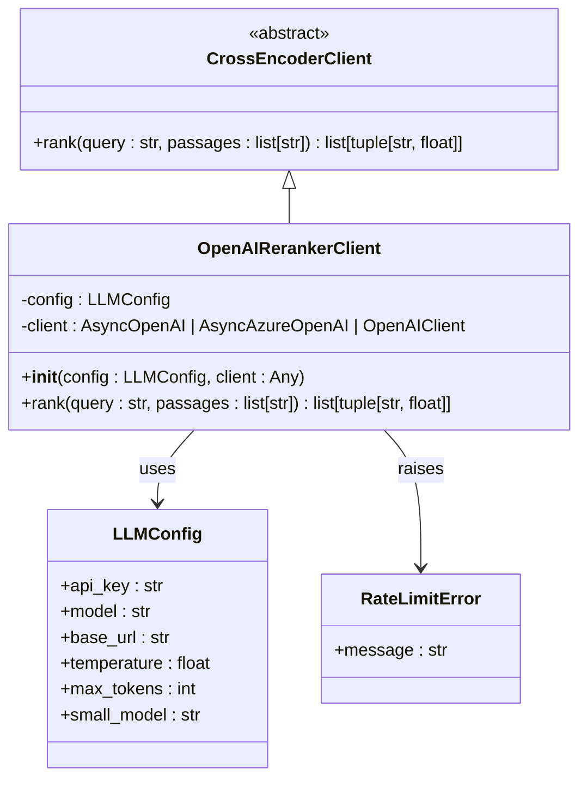
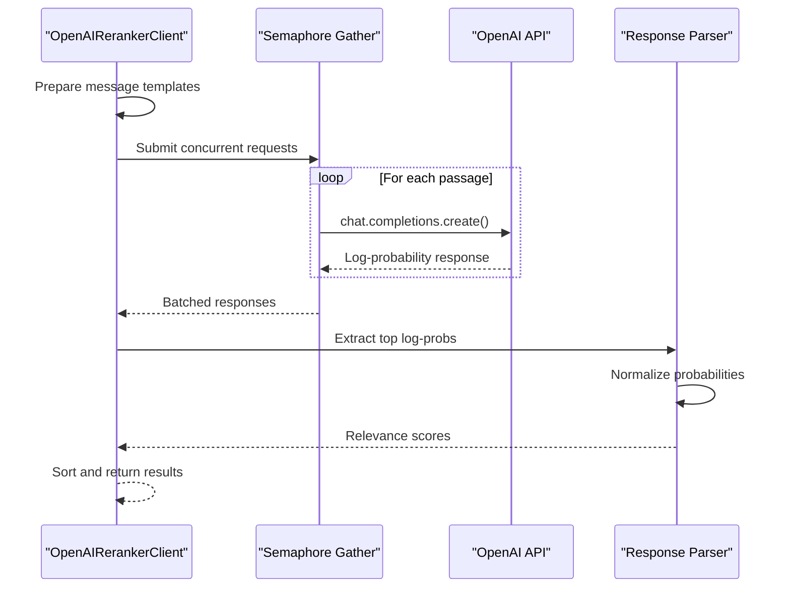

# OpenAI Reranker API Documentation

<cite>
**Referenced Files in This Document**
- [openai_reranker_client.py](file://graphiti_core/cross_encoder/openai_reranker_client.py)
- [client.py](file://graphiti_core/cross_encoder/client.py)
- [config.py](file://graphiti_core/llm_client/config.py)
- [errors.py](file://graphiti_core/llm_client/errors.py)
- [helpers.py](file://graphiti_core/helpers.py)
- [graphiti.py](file://graphiti_core/graphiti.py)
- [search.py](file://graphiti_core/search/search.py)
</cite>

## Table of Contents
1. [Introduction](#introduction)
2. [Architecture Overview](#architecture-overview)
3. [Initialization Parameters](#initialization-parameters)
4. [Core Implementation](#core-implementation)
5. [System Prompt Design](#system-prompt-design)
6. [Logit Bias Configuration](#logit-bias-configuration)
7. [Probability Normalization](#probability-normalization)
8. [Integration with Graphiti](#integration-with-graphiti)
9. [Rate Limiting and Error Handling](#rate-limiting-and-error-handling)
10. [Performance Considerations](#performance-considerations)
11. [Model Selection and Cost Optimization](#model-selection-and-cost-optimization)
12. [Usage Examples](#usage-examples)
13. [Best Practices](#best-practices)

## Introduction

The OpenAI Reranker is a sophisticated cross-encoder implementation that leverages OpenAI's language models to rank passage relevance through a boolean classification approach using log-probabilities. This implementation serves as a core component in the Graphiti search system, providing intelligent passage ranking capabilities for knowledge graph applications.

The reranker operates by treating relevance assessment as a binary classification problem ("relevant" vs "not relevant"), utilizing OpenAI's API to generate log-probabilities for each passage-query pair. These probabilities are then normalized and used to rank passages in order of relevance to the query.

## Architecture Overview

The OpenAI Reranker follows a modular architecture built on top of the CrossEncoderClient abstraction, enabling seamless integration with the broader Graphiti ecosystem.



**Diagram sources**
- [openai_reranker_client.py](file://graphiti_core/cross_encoder/openai_reranker_client.py#L33-L124)
- [client.py](file://graphiti_core/cross_encoder/client.py#L20-L41)
- [config.py](file://graphiti_core/llm_client/config.py#L28-L69)

**Section sources**
- [openai_reranker_client.py](file://graphiti_core/cross_encoder/openai_reranker_client.py#L33-L60)
- [client.py](file://graphiti_core/cross_encoder/client.py#L20-L41)

## Initialization Parameters

The OpenAI Reranker supports flexible initialization through two primary parameters that accommodate various deployment scenarios and configuration preferences.

### Configuration Parameter (config: LLMConfig | None)

The `config` parameter accepts an `LLMConfig` object containing essential API configuration details:

| Parameter | Type | Description | Default |
|-----------|------|-------------|---------|
| `api_key` | str | OpenAI API authentication key | None |
| `model` | str | Primary model for general operations | "gpt-4.1-mini" |
| `base_url` | str | OpenAI API endpoint URL | "https://api.openai.com" |
| `temperature` | float | Sampling temperature for completions | 1.0 |
| `max_tokens` | int | Maximum tokens per completion | 8192 |
| `small_model` | str | Model for lightweight operations | "gpt-4.1-nano" |

### Client Parameter (client: AsyncOpenAI | AsyncAzureOpenAI | OpenAIClient | None)

The `client` parameter provides flexibility for custom client instances:

- **AsyncOpenAI**: Standard OpenAI asynchronous client
- **AsyncAzureOpenAI**: Azure OpenAI service client  
- **OpenAIClient**: Graphiti's unified OpenAI client wrapper
- **None**: Creates a new AsyncOpenAI client using config parameters

**Section sources**
- [openai_reranker_client.py](file://graphiti_core/cross_encoder/openai_reranker_client.py#L35-L60)
- [config.py](file://graphiti_core/llm_client/config.py#L37-L69)

## Core Implementation

The `rank` method implements a sophisticated boolean classification approach that processes each passage independently while maintaining optimal performance through concurrent API calls.



**Diagram sources**
- [openai_reranker_client.py](file://graphiti_core/cross_encoder/openai_reranker_client.py#L61-L124)
- [helpers.py](file://graphiti_core/helpers.py#L105-L117)

The implementation utilizes several key techniques:

### Concurrent Processing
The system employs `semaphore_gather` for concurrent API calls, bounded by the `SEMAPHORE_LIMIT` environment variable (default: 20). This approach maximizes throughput while respecting rate limits.

### Boolean Classification Approach
Each passage is evaluated through a binary classification prompt that determines relevance as either "True" or "False". This simplifies the scoring mechanism while maintaining effectiveness.

### Log-Probability Utilization
Instead of relying on textual responses, the system extracts log-probabilities directly from the API response, enabling precise mathematical scoring.

**Section sources**
- [openai_reranker_client.py](file://graphiti_core/cross_encoder/openai_reranker_client.py#L61-L124)
- [helpers.py](file://graphiti_core/helpers.py#L105-L117)

## System Prompt Design

The system prompt is carefully crafted to establish the appropriate context and expectations for the language model's response.

### Prompt Structure

The system prompt establishes the model's role as an "expert tasked with determining whether the passage is relevant to the query". This framing ensures consistent evaluation criteria across all passage assessments.

### User Prompt Template

The user prompt template follows a structured format:

```
Respond with "True" if PASSAGE is relevant to QUERY and "False" otherwise.
<PASSAGE>
{passage}
</PASSAGE>
<QUERY>
{query}
</QUERY>
```

This template provides clear instructions while maintaining simplicity, allowing the model to focus on the binary classification task without unnecessary complexity.

**Section sources**
- [openai_reranker_client.py](file://graphiti_core/cross_encoder/openai_reranker_client.py#L64-L79)

## Logit Bias Configuration

The logit bias configuration is a critical component that ensures reliable binary classification by restricting the model's response to the predefined options.

### Token Configuration

The implementation uses specific token IDs for "True" and "False" responses:
- **Token ID 6432**: Corresponds to "True" token
- **Token ID 7983**: Corresponds to "False" token

### Bias Application

The logit bias is applied with a value of 1, which:
- Increases the likelihood of selecting the specified tokens
- Prevents the model from generating alternative responses
- Ensures consistent binary classification output

### Technical Implementation

```python
logit_bias={'6432': 1, '7983': 1},
logprobs=True,
top_logprobs=2,
```

This configuration guarantees that the API returns log-probabilities for both "True" and "False" tokens, enabling accurate probability extraction.

**Section sources**
- [openai_reranker_client.py](file://graphiti_core/cross_encoder/openai_reranker_client.py#L91-L94)

## Probability Normalization

The probability normalization process transforms raw log-probabilities into interpretable relevance scores through a mathematical transformation.

### Mathematical Foundation

The normalization process applies the exponential function to convert log-probabilities to probability values:

```python
norm_logprobs = np.exp(top_logprobs[0].logprob)
```

### Scoring Logic

The scoring mechanism implements a symmetric approach:

- **True Response**: Uses the normalized probability directly
- **False Response**: Calculates `1 - norm_logprobs` to maintain symmetry

### Score Range

The resulting scores fall within the [0, 1] range, where:
- **1.0**: Highest relevance (most likely "True")
- **0.0**: Lowest relevance (most likely "False")

### Sorting and Ranking

Results are sorted in descending order by relevance score, ensuring that the most relevant passages appear first in the ranked list.

**Section sources**
- [openai_reranker_client.py](file://graphiti_core/cross_encoder/openai_reranker_client.py#L106-L118)

## Integration with Graphiti

The OpenAI Reranker integrates seamlessly with the Graphiti search system, serving as the default cross-encoder component for passage ranking.

### Default Integration

When no custom cross-encoder is provided, Graphiti automatically initializes the OpenAI Reranker:

```python
self.cross_encoder = OpenAIRerankerClient()
```

### Search Pipeline Integration

The reranker participates in the search pipeline through the `search.py` module, where it processes passage relevance alongside other ranking mechanisms.

### Configuration Options

The integration supports various configuration scenarios:
- **Environment-based**: Uses default OpenAI configuration
- **Custom Config**: Allows specification of API keys, models, and endpoints
- **Custom Client**: Supports specialized OpenAI client implementations

**Section sources**
- [graphiti.py](file://graphiti_core/graphiti.py#L216-L218)
- [search.py](file://graphiti_core/search/search.py#L270-L275)

## Rate Limiting and Error Handling

The implementation includes comprehensive error handling designed to manage OpenAI's rate limiting and other potential failures gracefully.

### Rate Limit Error Handling

The system specifically handles `RateLimitError` exceptions raised by the OpenAI API:

```python
except openai.RateLimitError as e:
    raise RateLimitError from e
```

### Error Categories

The implementation manages several error categories:

| Error Type | Handling Strategy | Impact |
|------------|------------------|---------|
| RateLimitError | Propagated as RateLimitError | Requires retry logic |
| General Exceptions | Logged and re-raised | Indicates system issues |
| Empty Responses | Graceful degradation | Returns zero scores |

### Concurrent Error Management

When processing multiple passages concurrently, the system ensures that individual failures don't compromise the entire operation. Failed requests receive default zero scores, maintaining result consistency.

### Environment-Based Rate Limiting

The system respects the `SEMAPHORE_LIMIT` environment variable, which defaults to 20 concurrent operations to prevent rate limit violations.

**Section sources**
- [openai_reranker_client.py](file://graphiti_core/cross_encoder/openai_reranker_client.py#L119-L123)
- [errors.py](file://graphiti_core/llm_client/errors.py#L18-L23)
- [helpers.py](file://graphiti_core/helpers.py#L35-L36)

## Performance Considerations

The OpenAI Reranker is designed with performance optimization as a primary consideration, balancing accuracy with computational efficiency.

### Concurrent Processing Benefits

- **Throughput**: Up to 20 concurrent API calls (configurable via `SEMAPHORE_LIMIT`)
- **Latency**: Parallel processing reduces total request time
- **Resource Utilization**: Efficient CPU and network resource usage

### Memory Management

The implementation minimizes memory overhead through:
- **Streaming Processing**: Results processed as they arrive
- **Batch Operations**: Efficient batch handling of multiple passages
- **Garbage Collection**: Proper cleanup of temporary objects

### Network Optimization

Network performance is optimized through:
- **Connection Pooling**: Reuses HTTP connections
- **Request Batching**: Groups related operations
- **Timeout Management**: Prevents hanging requests

### Scalability Factors

Performance scales with:
- **Concurrent Limit**: Higher limits improve throughput
- **Passage Count**: Linear scaling with number of passages
- **API Latency**: Directly impacts total processing time

**Section sources**
- [helpers.py](file://graphiti_core/helpers.py#L105-L117)
- [mcp_server\README.md](file://mcp_server\README.md#L132-L136)

## Model Selection and Cost Optimization

Effective model selection and cost optimization are crucial for production deployments of the OpenAI Reranker.

### Model Recommendations

#### Primary Model Selection
- **GPT-4.1-mini**: Recommended for general-purpose reranking
- **GPT-4.1-nano**: Optimized for lightweight operations (default small_model)
- **Custom Models**: Can be specified via LLMConfig

#### Cost Optimization Strategies

| Strategy | Implementation | Cost Impact |
|----------|---------------|-------------|
| Small Model Usage | Automatic fallback for simple prompts | 50-75% reduction |
| Batch Processing | Process multiple passages efficiently | Linear cost scaling |
| Rate Limit Management | Optimal semaphore limits | Reduced API costs |
| Caching | Store frequently accessed results | Variable savings |

### Performance vs Cost Trade-offs

Different model configurations offer varying trade-offs:

- **High Accuracy**: Larger models with higher costs
- **Balanced Performance**: GPT-4.1-mini for optimal balance
- **Cost Optimization**: GPT-4.1-nano for budget-conscious deployments

### Monitoring and Optimization

Key metrics for optimization:
- **API Cost Per Request**: Monitor per-passage costs
- **Response Time**: Track latency improvements
- **Accuracy Metrics**: Measure relevance scoring quality
- **Rate Limit Frequency**: Monitor rate limit occurrences

**Section sources**
- [config.py](file://graphiti_core/llm_client/config.py#L53-L62)
- [openai_reranker_client.py](file://graphiti_core/cross_encoder/openai_reranker_client.py#L31)

## Usage Examples

### Basic Instantiation

```python
from graphiti_core.cross_encoder import OpenAIRerankerClient
from graphiti_core.llm_client import LLMConfig

# Basic usage with default configuration
reranker = OpenAIRerankerClient()

# Custom configuration
config = LLMConfig(
    api_key="your-api-key",
    model="gpt-4.1-mini",
    small_model="gpt-4.1-nano"
)
reranker = OpenAIRerankerClient(config=config)
```

### Integration with Graphiti

```python
from graphiti_core import Graphiti
from graphiti_core.cross_encoder import OpenAIRerankerClient

# Initialize Graphiti with custom reranker
graphiti = Graphiti(
    uri="neo4j://localhost:7687",
    user="neo4j",
    password="password",
    cross_encoder=OpenAIRerankerClient()
)

# Use in search operations
results = await graphiti.search("machine learning algorithms", limit=10)
```

### Custom Client Usage

```python
from openai import AsyncOpenAI
from graphiti_core.cross_encoder import OpenAIRerankerClient

# Custom OpenAI client
custom_client = AsyncOpenAI(
    api_key="your-api-key",
    base_url="https://custom-endpoint.com/v1"
)

reranker = OpenAIRerankerClient(client=custom_client)
```

### Advanced Configuration

```python
from graphiti_core.llm_client import LLMConfig
from graphiti_core.cross_encoder import OpenAIRerankerClient

# Comprehensive configuration
config = LLMConfig(
    api_key="your-api-key",
    model="gpt-4.1-mini",
    base_url="https://api.openai.com/v1",
    temperature=0.0,  # Deterministic responses
    max_tokens=100,
    small_model="gpt-4.1-nano"
)

reranker = OpenAIRerankerClient(config=config)
```

**Section sources**
- [graphiti.py](file://graphiti_core/graphiti.py#L216-L218)
- [openai_reranker_client.py](file://graphiti_core/cross_encoder/openai_reranker_client.py#L35-L60)

## Best Practices

### Configuration Management

1. **Environment Variables**: Store API keys securely using environment variables
2. **Default Models**: Use sensible defaults for development and testing
3. **Custom Models**: Specify appropriate models for production workloads

### Performance Optimization

1. **Concurrent Limits**: Adjust `SEMAPHORE_LIMIT` based on rate limits and throughput requirements
2. **Batch Processing**: Process multiple passages in single requests when possible
3. **Caching**: Implement caching for frequently accessed passage-query combinations

### Error Handling

1. **Rate Limiting**: Implement exponential backoff for rate limit errors
2. **Graceful Degradation**: Handle API failures gracefully with fallback mechanisms
3. **Monitoring**: Monitor error rates and performance metrics

### Cost Management

1. **Model Selection**: Choose appropriate models based on accuracy requirements
2. **Usage Tracking**: Monitor API usage and costs
3. **Optimization**: Regular review of cost-effective configurations

### Security Considerations

1. **API Key Protection**: Never expose API keys in logs or error messages
2. **Network Security**: Use HTTPS endpoints for all API communications
3. **Access Control**: Implement proper access controls for reranker operations

### Testing and Validation

1. **Unit Tests**: Test reranker functionality with various passage types
2. **Integration Tests**: Validate end-to-end search pipeline functionality
3. **Performance Tests**: Monitor performance under various load conditions