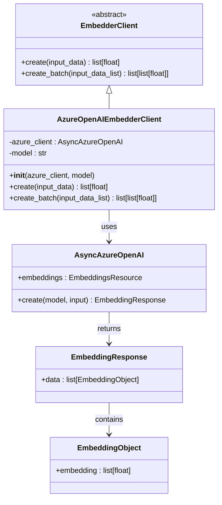
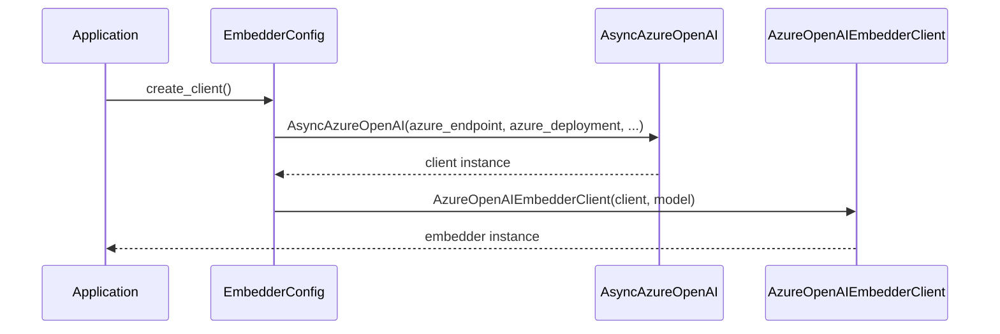
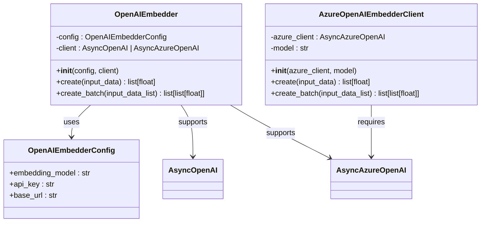

# Azure OpenAI Embedder

<cite>
**Referenced Files in This Document**
- [azure_openai.py](file://graphiti_core/embedder/azure_openai.py)
- [client.py](file://graphiti_core/embedder/client.py)
- [openai.py](file://graphiti_core/embedder/openai.py)
- [graphiti_mcp_server.py](file://mcp_server/graphiti_mcp_server.py)
- [test_openai.py](file://tests/embedder/test_openai.py)
</cite>

## Table of Contents
1. [Introduction](#introduction)
2. [Architecture Overview](#architecture-overview)
3. [Core Implementation](#core-implementation)
4. [Constructor and Initialization](#constructor-and-initialization)
5. [Input Normalization Logic](#input-normalization-logic)
6. [Error Handling and Logging](#error-handling-and-logging)
7. [Comparison with Generic OpenAI Embedder](#comparison-with-generic-openai-embedder)
8. [Configuration and Authentication](#configuration-and-authentication)
9. [Usage Examples](#usage-examples)
10. [Best Practices](#best-practices)
11. [Troubleshooting Guide](#troubleshooting-guide)

## Introduction

The Azure OpenAI Embedder is a specialized wrapper implementation that provides seamless integration with Azure OpenAI's embedding services. Built as part of the Graphiti framework, it implements the `EmbedderClient` interface while leveraging the `AsyncAzureOpenAI` client for asynchronous operations. This embedder is specifically designed to handle Azure OpenAI's unique authentication mechanisms, deployment configurations, and endpoint requirements.

The implementation follows a wrapper design pattern that encapsulates the complexity of Azure OpenAI client initialization while maintaining a clean, consistent interface with other embedder implementations in the system.

## Architecture Overview

The Azure OpenAI Embedder fits into the broader Graphiti embedder ecosystem as a specialized client implementation. It demonstrates the framework's extensible architecture that supports multiple embedding providers through a unified interface.



**Diagram sources**
- [azure_openai.py](file://graphiti_core/embedder/azure_openai.py#L26-L65)
- [client.py](file://graphiti_core/embedder/client.py#L29-L39)

**Section sources**
- [azure_openai.py](file://graphiti_core/embedder/azure_openai.py#L26-L65)
- [client.py](file://graphiti_core/embedder/client.py#L29-L39)

## Core Implementation

The `AzureOpenAIEmbedderClient` class serves as a bridge between the Graphiti embedder interface and Azure OpenAI's embedding API. It implements two primary methods for creating embeddings: `create()` for single inputs and `create_batch()` for multiple inputs.

### Key Design Principles

1. **Wrapper Pattern**: Encapsulates the `AsyncAzureOpenAI` client while exposing a simplified interface
2. **Type Safety**: Uses Python type hints to ensure proper input validation
3. **Error Resilience**: Implements comprehensive error handling with detailed logging
4. **Asynchronous Operations**: Leverages async/await patterns for non-blocking operations

### Method Signatures

The embedder implements the standard `EmbedderClient` interface with the following method signatures:

- `create(input_data: str | list[str] | Any) -> list[float]`: Creates embeddings for a single input or normalized input
- `create_batch(input_data_list: list[str]) -> list[list[float]]`: Creates embeddings for multiple inputs in a single batch operation

**Section sources**
- [azure_openai.py](file://graphiti_core/embedder/azure_openai.py#L33-L63)

## Constructor and Initialization

The constructor requires an existing `AsyncAzureOpenAI` client instance and accepts an optional model parameter with a default value of `'text-embedding-3-small'`.

### Constructor Parameters

| Parameter | Type | Description | Default |
|-----------|------|-------------|---------|
| `azure_client` | `AsyncAzureOpenAI` | Pre-configured Azure OpenAI client instance | Required |
| `model` | `str` | Embedding model identifier | `'text-embedding-3-small'` |

### Client Instantiation Pattern

Unlike the generic OpenAI embedder, the Azure OpenAI embedder requires explicit client construction. This design ensures that Azure-specific configurations (endpoints, deployments, authentication) are properly established before creating the embedder.



**Diagram sources**
- [graphiti_mcp_server.py](file://mcp_server/graphiti_mcp_server.py#L418-L438)

**Section sources**
- [azure_openai.py](file://graphiti_core/embedder/azure_openai.py#L30-L31)
- [graphiti_mcp_server.py](file://mcp_server/graphiti_mcp_server.py#L418-L438)

## Input Normalization Logic

The `create()` method implements sophisticated input normalization to handle various data types commonly encountered in embedding applications.

### Input Type Handling

The method processes three distinct input scenarios:

1. **String Inputs**: Single strings are automatically wrapped in a list for consistent processing
2. **String Lists**: Direct string lists are passed through unchanged
3. **Other Types**: Non-string inputs are converted to strings using Python's `str()` function

### Normalization Flow

```mermaid
flowchart TD
Start([Input Data]) --> CheckType{Input Type?}
CheckType --> |str| WrapList["Wrap in List<br/>text_input = [input_data]"]
CheckType --> |list[str]| DirectPass["Direct Pass-through<br/>text_input = input_data"]
CheckType --> |other| ConvertStr["Convert to String<br/>text_input = [str(input_data)]"]
WrapList --> CallAPI["Call Azure API"]
DirectPass --> CallAPI
ConvertStr --> CallAPI
CallAPI --> ExtractEmbedding["Extract First Embedding<br/>response.data[0].embedding"]
ExtractEmbedding --> Return([Return List[float]])
```

**Diagram sources**
- [azure_openai.py](file://graphiti_core/embedder/azure_openai.py#L36-L48)

### Batch Processing

The `create_batch()` method handles multiple inputs efficiently by passing the entire list to the Azure API in a single request, optimizing network usage and reducing latency compared to individual requests.

**Section sources**
- [azure_openai.py](file://graphiti_core/embedder/azure_openai.py#L36-L63)

## Error Handling and Logging

The implementation includes comprehensive error handling with detailed logging specific to Azure OpenAI service calls.

### Error Handling Strategy

1. **Exception Catching**: Catches all exceptions during API calls
2. **Logging**: Records detailed error information with context
3. **Exception Re-raising**: Preserves original exception for upstream handling

### Logging Implementation

The embedder uses Python's standard logging module with the logger name `__name__` for consistent log message formatting:

- **Error Level**: Logs errors at the ERROR level with detailed context
- **Message Format**: Includes the specific error encountered during the operation
- **Context Preservation**: Maintains stack trace information for debugging

### Error Scenarios

Common error scenarios include:
- Network connectivity issues with Azure endpoints
- Authentication failures (invalid API keys, expired tokens)
- Model unavailability or incorrect deployment names
- Rate limiting or quota exceeded conditions

**Section sources**
- [azure_openai.py](file://graphiti_core/embedder/azure_openai.py#L50-L64)

## Comparison with Generic OpenAI Embedder

The Azure OpenAI embedder differs significantly from the generic OpenAI embedder in several key areas:

### Client Instantiation Patterns

| Aspect | Azure OpenAI Embedder | Generic OpenAI Embedder |
|--------|----------------------|------------------------|
| **Client Creation** | Requires pre-instantiated `AsyncAzureOpenAI` client | Supports both configuration-driven and client-driven instantiation |
| **Configuration** | Embedded in client construction | Separate configuration object |
| **Flexibility** | Azure-specific only | Supports both OpenAI and Azure OpenAI |
| **Authentication** | Azure AD token provider or API key | Standard API key only |

### Implementation Differences



**Diagram sources**
- [openai.py](file://graphiti_core/embedder/openai.py#L33-L66)
- [azure_openai.py](file://graphiti_core/embedder/azure_openai.py#L26-L65)

### Key Architectural Differences

1. **Dependency Injection**: Azure embedder requires client injection, while OpenAI embedder supports configuration-driven creation
2. **Model Flexibility**: OpenAI embedder can work with multiple model types, while Azure embedder focuses on Azure-specific deployments
3. **Authentication Complexity**: Azure embedder supports managed identity authentication, while OpenAI embedder uses simpler API key authentication

**Section sources**
- [openai.py](file://graphiti_core/embedder/openai.py#L33-L66)
- [azure_openai.py](file://graphiti_core/embedder/azure_openai.py#L26-L65)

## Configuration and Authentication

Azure OpenAI embedder configuration involves multiple components that must be properly set up for successful operation.

### Environment Variables

The MCP server implementation demonstrates comprehensive environment variable configuration:

| Variable | Purpose | Example Value |
|----------|---------|---------------|
| `AZURE_OPENAI_EMBEDDING_ENDPOINT` | Azure OpenAI service endpoint | `https://your-resource.openai.azure.com/` |
| `AZURE_OPENAI_EMBEDDING_DEPLOYMENT_NAME` | Model deployment name | `text-embedding-3-small` |
| `AZURE_OPENAI_EMBEDDING_API_VERSION` | API version | `2024-02-15-preview` |
| `AZURE_OPENAI_EMBEDDING_API_KEY` | API key for authentication | `your-api-key-here` |
| `AZURE_OPENAI_USE_MANAGED_IDENTITY` | Enable managed identity auth | `true` |

### Authentication Methods

1. **API Key Authentication**: Traditional API key-based authentication
2. **Managed Identity**: Azure Active Directory integration for secure credentialless authentication

### Client Construction Examples

#### API Key Authentication
```python
from openai import AsyncAzureOpenAI
from graphiti_core.embedder.azure_openai import AzureOpenAIEmbedderClient

# Construct Azure client with API key
azure_client = AsyncAzureOpenAI(
    azure_endpoint="https://your-resource.openai.azure.com/",
    azure_deployment="text-embedding-3-small",
    api_version="2024-02-15-preview",
    api_key="your-api-key-here"
)

# Create embedder
embedder = AzureOpenAIEmbedderClient(azure_client, model="text-embedding-3-small")
```

#### Managed Identity Authentication
```python
from azure.identity import DefaultAzureCredential
from openai import AsyncAzureOpenAI
from graphiti_core.embedder.azure_openai import AzureOpenAIEmbedderClient

# Get managed identity token provider
credential = DefaultAzureCredential()
token_provider = lambda: credential.get_token("https://cognitiveservices.azure.com/.default").token

# Construct Azure client with managed identity
azure_client = AsyncAzureOpenAI(
    azure_endpoint="https://your-resource.openai.azure.com/",
    azure_deployment="text-embedding-3-small",
    api_version="2024-02-15-preview",
    azure_ad_token_provider=token_provider
)

# Create embedder
embedder = AzureOpenAIEmbedderClient(azure_client, model="text-embedding-3-small")
```

**Section sources**
- [graphiti_mcp_server.py](file://mcp_server/graphiti_mcp_server.py#L373-L438)

## Usage Examples

### Basic Text Embedding

```python
import asyncio
from openai import AsyncAzureOpenAI
from graphiti_core.embedder.azure_openai import AzureOpenAIEmbedderClient

async def basic_embedding_example():
    # Initialize Azure client
    azure_client = AsyncAzureOpenAI(
        azure_endpoint="https://your-resource.openai.azure.com/",
        azure_deployment="text-embedding-3-small",
        api_version="2024-02-15-preview",
        api_key="your-api-key-here"
    )
    
    # Create embedder
    embedder = AzureOpenAIEmbedderClient(azure_client, model="text-embedding-3-small")
    
    # Generate embedding for a single text
    text = "Hello, world!"
    embedding = await embedder.create(text)
    print(f"Embedding dimension: {len(embedding)}")
```

### Batch Processing

```python
async def batch_embedding_example():
    # Initialize Azure client
    azure_client = AsyncAzureOpenAI(
        azure_endpoint="https://your-resource.openai.azure.com/",
        azure_deployment="text-embedding-3-small",
        api_version="2024-02-15-preview",
        api_key="your-api-key-here"
    )
    
    # Create embedder
    embedder = AzureOpenAIEmbedderClient(azure_client, model="text-embedding-3-small")
    
    # Generate embeddings for multiple texts
    texts = [
        "First text to embed",
        "Second text to embed", 
        "Third text to embed"
    ]
    
    embeddings = await embedder.create_batch(texts)
    print(f"Generated {len(embeddings)} embeddings")
```

### Error Handling Example

```python
async def error_handling_example():
    try:
        azure_client = AsyncAzureOpenAI(...)
        embedder = AzureOpenAIEmbedderClient(azure_client, model="text-embedding-3-small")
        
        # This will trigger error handling if something goes wrong
        result = await embedder.create("Test input")
        
    except Exception as e:
        print(f"Embedding failed: {e}")
        # Log the error or handle it appropriately
```

**Section sources**
- [azure_openai.py](file://graphiti_core/embedder/azure_openai.py#L33-L63)

## Best Practices

### Client Management

1. **Singleton Pattern**: Consider using a singleton pattern for the Azure client to avoid repeated expensive initialization
2. **Connection Pooling**: Leverage the underlying HTTP client's connection pooling capabilities
3. **Resource Cleanup**: Properly dispose of client resources when appropriate

### Performance Optimization

1. **Batch Operations**: Use `create_batch()` for multiple embeddings to reduce API calls
2. **Caching**: Implement caching for frequently requested embeddings
3. **Async Patterns**: Utilize async/await patterns for non-blocking operations

### Security Considerations

1. **Environment Variables**: Store sensitive credentials in environment variables
2. **Managed Identity**: Prefer managed identity over API keys when possible
3. **Token Refresh**: Ensure proper token refresh mechanisms for long-running applications

### Monitoring and Observability

1. **Logging**: Implement structured logging for production deployments
2. **Metrics**: Track embedding generation metrics (latency, success rate)
3. **Error Tracking**: Monitor and alert on embedding service errors

## Troubleshooting Guide

### Common Issues and Solutions

#### Authentication Failures
**Symptoms**: 401 Unauthorized errors
**Causes**: Invalid API key, expired tokens, incorrect endpoint
**Solutions**: 
- Verify API key validity
- Check endpoint URL format
- Ensure proper authentication method (API key vs. managed identity)

#### Deployment Not Found
**Symptoms**: 404 Not Found errors
**Causes**: Incorrect deployment name
**Solutions**:
- Verify deployment name matches Azure portal
- Check model availability in region
- Confirm API version compatibility

#### Rate Limiting
**Symptoms**: 429 Too Many Requests errors
**Solutions**:
- Implement exponential backoff
- Reduce request frequency
- Consider upgrading subscription tier

#### Network Connectivity
**Symptoms**: Connection timeouts, SSL errors
**Solutions**:
- Verify network connectivity to Azure endpoints
- Check firewall rules
- Ensure proper DNS resolution

### Debugging Techniques

1. **Enable Debug Logging**: Set logging level to DEBUG for detailed API call information
2. **Network Monitoring**: Use network monitoring tools to inspect API traffic
3. **Error Analysis**: Carefully examine error messages and stack traces
4. **Environment Validation**: Verify all environment variables are properly set

**Section sources**
- [azure_openai.py](file://graphiti_core/embedder/azure_openai.py#L50-L64)