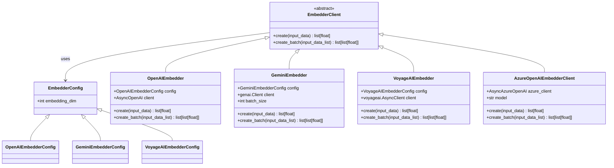
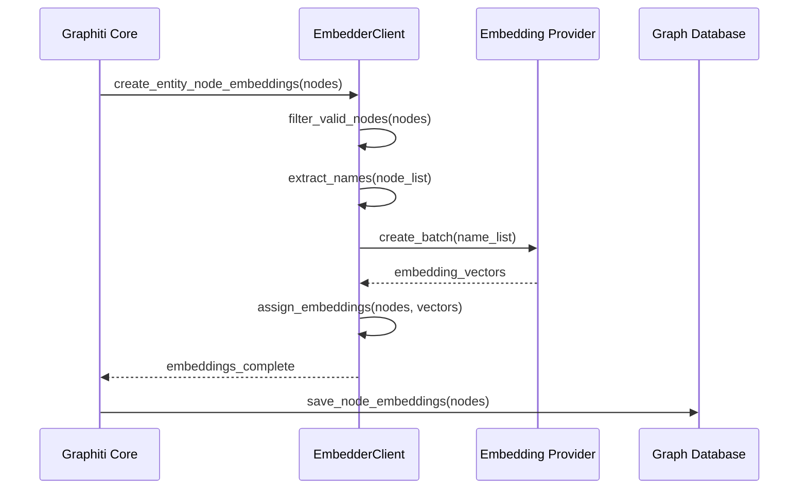
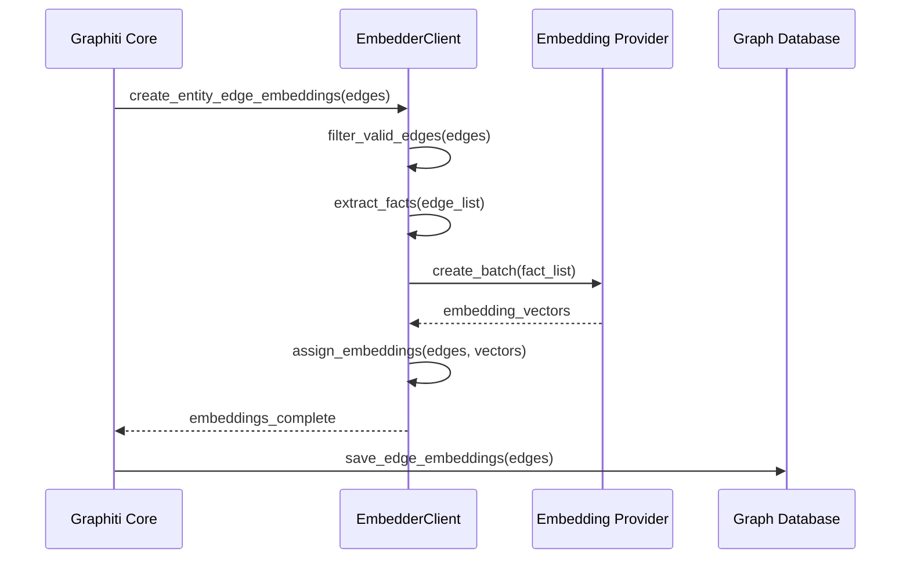

# Embedder Client Base Class

<cite>
**Referenced Files in This Document**
- [client.py](file://graphiti_core/embedder/client.py)
- [openai.py](file://graphiti_core/embedder/openai.py)
- [gemini.py](file://graphiti_core/embedder/gemini.py)
- [voyage.py](file://graphiti_core/embedder/voyage.py)
- [azure_openai.py](file://graphiti_core/embedder/azure_openai.py)
- [__init__.py](file://graphiti_core/embedder/__init__.py)
- [test_openai.py](file://tests/embedder/test_openai.py)
- [embedder_fixtures.py](file://tests/embedder/embedder_fixtures.py)
- [nodes.py](file://graphiti_core/nodes.py)
- [edges.py](file://graphiti_core/edges.py)
- [graphiti.py](file://graphiti_core/graphiti.py)
- [bulk_utils.py](file://graphiti_core/utils/bulk_utils.py)
</cite>

## Table of Contents
1. [Introduction](#introduction)
2. [Architecture Overview](#architecture-overview)
3. [EmbedderClient Abstract Base Class](#embedderclient-abstract-base-class)
4. [EmbedderConfig Class](#embedderconfig-class)
5. [Implementation Examples](#implementation-examples)
6. [Integration with Graph Ingestion Pipeline](#integration-with-graph-ingestion-pipeline)
7. [Error Handling and Performance Considerations](#error-handling-and-performance-considerations)
8. [Best Practices](#best-practices)
9. [Testing and Validation](#testing-and-validation)

## Introduction

The EmbedderClient abstract base class serves as the foundational interface for all embedding providers in the Graphiti framework. It provides a standardized contract for generating vector embeddings from text data, enabling seamless integration with various AI/ML embedding services while maintaining consistency across different providers.

Embeddings are numerical representations of text data in high-dimensional vector spaces, capturing semantic relationships between words and phrases. In the context of Graphiti, embeddings power graph construction, similarity search, and intelligent recommendation systems by converting textual information into mathematical representations that can be efficiently processed and compared.

## Architecture Overview

The Graphiti embedding system follows a modular architecture where the EmbedderClient abstract base class defines the interface, and concrete implementations provide specific provider integrations.



**Diagram sources**
- [client.py](file://graphiti_core/embedder/client.py#L30-L38)
- [openai.py](file://graphiti_core/embedder/openai.py#L33-L67)
- [gemini.py](file://graphiti_core/embedder/gemini.py#L50-L184)
- [voyage.py](file://graphiti_core/embedder/voyage.py#L43-L77)
- [azure_openai.py](file://graphiti_core/embedder/azure_openai.py#L27-L65)

## EmbedderClient Abstract Base Class

The EmbedderClient class defines the core interface that all embedding providers must implement. It establishes a standardized contract for text-to-vector conversion operations.

### Core Methods

#### create() Method

The primary method for generating embeddings for individual text inputs.

```python
async def create(
    self, input_data: str | list[str] | Iterable[int] | Iterable[Iterable[int]]
) -> list[float]
```

**Parameters:**
- `input_data`: Supports multiple input types:
  - **Single string**: Direct text input for embedding
  - **List of strings**: Multiple text inputs to process
  - **Iterable of integers**: Numerical data sequences
  - **Iterable of iterables of integers**: Nested numerical data structures

**Return Type:** `list[float]` - A flat list of floating-point numbers representing the embedding vector

**Expected Behavior:**
- Processes the input data and returns a fixed-length embedding vector
- Handles various input formats transparently
- Respects the configured embedding dimensionality
- Raises appropriate exceptions for invalid inputs or service errors

#### create_batch() Method

The batch processing method for efficient bulk embedding generation.

```python
async def create_batch(self, input_data_list: list[str]) -> list[list[float]]
```

**Parameters:**
- `input_data_list`: List of text strings to embed in bulk

**Return Type:** `list[list[float]]` - List of embedding vectors, one for each input string

**Expected Behavior:**
- Processes multiple inputs efficiently in a single API call when supported
- Falls back to individual processing if batch operations are not supported
- Maintains order of input-output mapping
- Implements error handling for partial failures

**Section sources**
- [client.py](file://graphiti_core/embedder/client.py#L32-L38)

## EmbedderConfig Class

The EmbedderConfig class provides configuration management for embedding providers, establishing common parameters and default values.

### Configuration Fields

#### embedding_dim Field

Controls the dimensionality of generated embeddings, determining the length of the output vector.

```python
embedding_dim: int = Field(default=EMBEDDING_DIM, frozen=True)
```

**Properties:**
- **Default Value**: Retrieved from `EMBEDDING_DIM` environment variable or defaults to 1024
- **Frozen**: Once set, cannot be modified to maintain consistency
- **Purpose**: Ensures uniform embedding dimensions across all providers
- **Impact**: Affects memory usage, computational requirements, and similarity calculations

**Environment Variable Support:**
- Set `EMBEDDING_DIM` in your environment to customize the default dimension
- Example: `export EMBEDDING_DIM=768` for smaller, more efficient embeddings
- Example: `export EMBEDDING_DIM=1536` for higher-dimensional embeddings

**Section sources**
- [client.py](file://graphiti_core/embedder/client.py#L26-L27)

## Implementation Examples

### Creating a Custom Embedder

Here's how to implement a custom embedder by extending the EmbedderClient base class:

```python
from graphiti_core.embedder.client import EmbedderClient, EmbedderConfig
from pydantic import Field
from typing import Any, Union

class CustomEmbedderConfig(EmbedderConfig):
    """Custom configuration for specialized embedding provider."""
    api_endpoint: str = Field(default="https://api.custom-embedder.com/v1")
    model_name: str = Field(default="custom-model-v1")

class CustomEmbedder(EmbedderClient):
    """Example implementation of a custom embedding provider."""
    
    def __init__(self, config: CustomEmbedderConfig | None = None):
        if config is None:
            config = CustomEmbedderConfig()
        self.config = config
        self.client = self._create_client()
    
    async def create(self, input_data: str | list[str] | Any) -> list[float]:
        """Generate embedding for single input."""
        # Implementation details...
        pass
    
    async def create_batch(self, input_data_list: list[str]) -> list[list[float]]:
        """Generate embeddings for multiple inputs."""
        # Implementation details...
        pass
    
    def _create_client(self) -> Any:
        """Initialize the external API client."""
        # Implementation details...
        pass
```

### Provider-Specific Implementations

Each concrete implementation demonstrates different approaches to handling provider-specific requirements:

#### OpenAI Embedder
- Supports both standard OpenAI and Azure OpenAI clients
- Configurable embedding models (default: `text-embedding-3-small`)
- Automatic dimension truncation to match configured embedding_dim

#### Gemini Embedder  
- Handles API limitations with intelligent batching
- Supports different batch sizes for different models
- Comprehensive error handling and fallback mechanisms

#### VoyageAI Embedder
- Optimized for VoyageAI-specific API requirements
- Handles empty input scenarios gracefully
- Provides consistent output formatting

**Section sources**
- [openai.py](file://graphiti_core/embedder/openai.py#L27-L67)
- [gemini.py](file://graphiti_core/embedder/gemini.py#L45-L184)
- [voyage.py](file://graphiti_core/embedder/voyage.py#L38-L77)

## Integration with Graph Ingestion Pipeline

The EmbedderClient integrates seamlessly with Graphiti's graph construction and maintenance operations, providing embeddings for both nodes and edges.

### Node Embedding Generation



**Diagram sources**
- [nodes.py](file://graphiti_core/nodes.py#L796-L805)
- [bulk_utils.py](file://graphiti_core/utils/bulk_utils.py#L31-L32)

### Edge Embedding Generation



**Diagram sources**
- [edges.py](file://graphiti_core/edges.py#L622-L630)

### Embedding Usage Patterns

The framework provides several ways to utilize embeddings:

#### Individual Embedding Generation
Used for single node or edge processing:
- Called during node creation: [`generate_name_embedding()`](file://graphiti_core/nodes.py#L796-L805)
- Called during edge creation: [`generate_embedding()`](file://graphiti_core/edges.py#L242-L251)

#### Bulk Embedding Generation
Optimized for processing multiple entities simultaneously:
- Batch node embedding: [`create_entity_node_embeddings()`](file://graphiti_core/nodes.py#L796-L805)
- Batch edge embedding: [`create_entity_edge_embeddings()`](file://graphiti_core/edges.py#L622-L630)

**Section sources**
- [nodes.py](file://graphiti_core/nodes.py#L796-L805)
- [edges.py](file://graphiti_core/edges.py#L242-L251)
- [edges.py](file://graphiti_core/edges.py#L622-L630)

## Error Handling and Performance Considerations

### Error Handling Strategies

Different embedder implementations employ various error handling approaches:

#### Graceful Degradation
- Empty input handling: Returns empty lists for null or empty inputs
- Partial failure recovery: Continues processing remaining items when individual requests fail
- Fallback mechanisms: Alternative processing paths when primary methods fail

#### Exception Management
- Input validation: Validates input formats before API calls
- API error handling: Catches and processes provider-specific errors
- Logging and monitoring: Comprehensive logging for debugging and performance tracking

### Performance Optimization

#### Batch Processing Benefits
- Reduced API overhead: Fewer network round-trips for multiple inputs
- Provider efficiency: Leverages provider-optimized batch operations
- Memory management: Efficient handling of large datasets

#### Implementation-Specific Optimizations

**Gemini Embedder:**
- Intelligent batching with configurable batch sizes
- Automatic fallback to individual processing for failed batches
- Model-specific optimizations (different limits for different models)

**OpenAI Embedder:**
- Automatic dimension truncation to match configured embedding_dim
- Efficient handling of single vs. batch operations
- Built-in retry mechanisms for transient failures

**Section sources**
- [gemini.py](file://graphiti_core/embedder/gemini.py#L130-L183)
- [openai.py](file://graphiti_core/embedder/openai.py#L54-L66)

## Best Practices

### Configuration Management

1. **Environment-Based Dimension Control**
   ```python
   # Set consistent embedding dimensions across your application
   export EMBEDDING_DIM=1024  # Standard OpenAI dimensions
   ```

2. **Provider Selection Guidelines**
   - Use OpenAI for general-purpose embeddings
   - Use Gemini for Google ecosystem integration
   - Use VoyageAI for specialized use cases requiring high-quality embeddings
   - Use Azure OpenAI for enterprise deployments with specific compliance requirements

### Implementation Guidelines

1. **Input Validation**
   - Always validate input data before passing to embedding APIs
   - Handle edge cases (empty strings, null values, special characters)
   - Implement proper encoding for international text

2. **Error Recovery**
   - Implement exponential backoff for rate-limited APIs
   - Provide meaningful error messages for debugging
   - Design graceful degradation strategies

3. **Performance Optimization**
   - Use batch operations when possible
   - Implement caching for frequently accessed embeddings
   - Monitor API usage and costs

### Testing Strategies

1. **Unit Testing**
   - Mock external API calls for isolated testing
   - Test input validation and error handling
   - Verify output format consistency

2. **Integration Testing**
   - Test end-to-end embedding workflows
   - Validate database storage and retrieval
   - Test error scenarios and recovery

**Section sources**
- [test_openai.py](file://tests/embedder/test_openai.py#L77-L126)
- [embedder_fixtures.py](file://tests/embedder/embedder_fixtures.py#L18-L21)

## Testing and Validation

The Graphiti framework includes comprehensive testing infrastructure for embedder implementations:

### Test Infrastructure

#### Fixture-Based Testing
- [`create_embedding_values()`](file://tests/embedder/embedder_fixtures.py#L18-L21): Generates consistent test embedding data
- Mock API responses for reliable testing without external dependencies
- Parameterized test cases covering various input scenarios

#### Integration Tests
- [`test_create_calls_api_correctly()`](file://tests/embedder/test_openai.py#L77-L96): Validates API call parameters and response processing
- [`test_create_batch_processes_multiple_inputs()`](file://tests/embedder/test_openai.py#L98-L122): Tests batch processing capabilities
- Provider-specific tests for error handling and edge cases

### Validation Patterns

1. **Input/Output Consistency**
   - Verify input data preservation through the embedding pipeline
   - Confirm output format matches expected specifications
   - Test dimensionality consistency across different input types

2. **Error Scenario Testing**
   - Null and empty input handling
   - API failure simulation and recovery
   - Network timeout and connectivity issues

3. **Performance Benchmarking**
   - Embedding generation speed measurements
   - Memory usage profiling for large datasets
   - Concurrent operation testing

**Section sources**
- [test_openai.py](file://tests/embedder/test_openai.py#L31-L126)
- [embedder_fixtures.py](file://tests/embedder/embedder_fixtures.py#L18-L21)