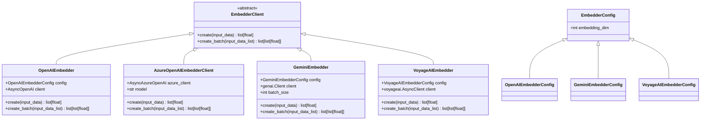
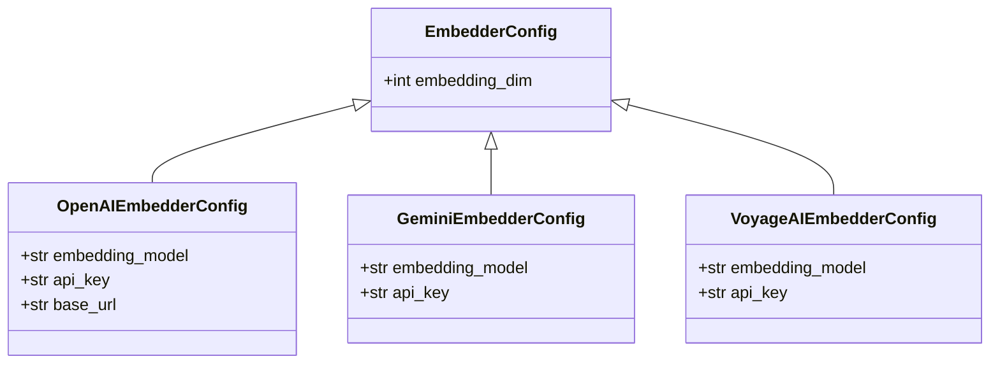
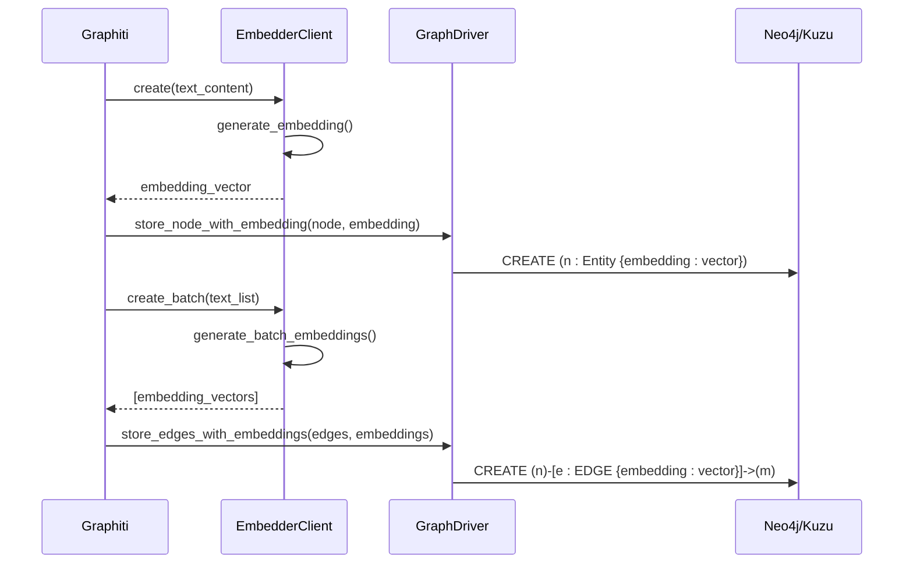
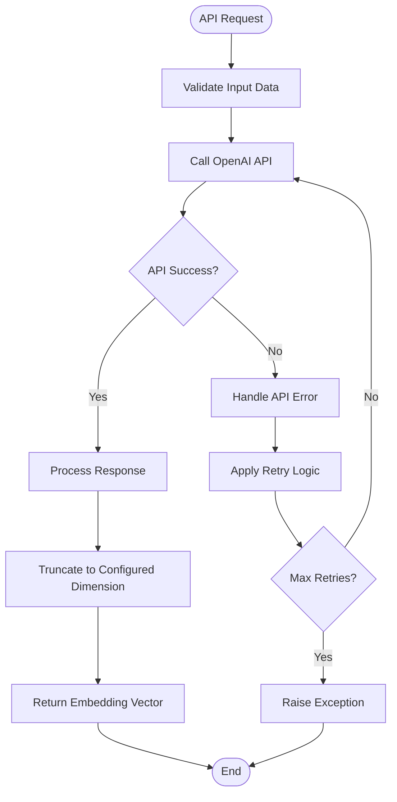
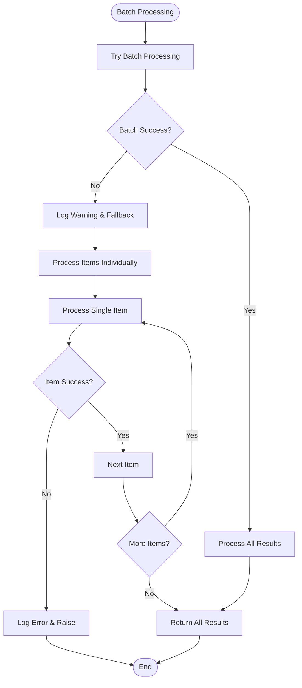

# Embedder Client API Documentation

<cite>
**Referenced Files in This Document**
- [graphiti_core/embedder/client.py](file://graphiti_core/embedder/client.py)
- [graphiti_core/embedder/openai.py](file://graphiti_core/embedder/openai.py)
- [graphiti_core/embedder/azure_openai.py](file://graphiti_core/embedder/azure_openai.py)
- [graphiti_core/embedder/gemini.py](file://graphiti_core/embedder/gemini.py)
- [graphiti_core/embedder/voyage.py](file://graphiti_core/embedder/voyage.py)
- [graphiti_core/graphiti.py](file://graphiti_core/graphiti.py)
- [mcp_server/graphiti_mcp_server.py](file://mcp_server/graphiti_mcp_server.py)
- [tests/embedder/test_openai.py](file://tests/embedder/test_openai.py)
- [tests/embedder/test_gemini.py](file://tests/embedder/test_gemini.py)
- [tests/embedder/test_voyage.py](file://tests/embedder/test_voyage.py)
</cite>

## Table of Contents
1. [Introduction](#introduction)
2. [EmbedderClient Abstract Base Class](#embedderclient-abstract-base-class)
3. [Embedder Configuration System](#embedder-configuration-system)
4. [Concrete Embedder Implementations](#concrete-embedder-implementations)
5. [Integration with Graphiti](#integration-with-graphiti)
6. [Rate Limiting and Error Handling](#rate-limiting-and-error-handling)
7. [Node and Edge Similarity Searches](#node-and-edge-similarity-searches)
8. [Usage Examples](#usage-examples)
9. [Best Practices](#best-practices)

## Introduction

The Graphiti embedder system provides a unified interface for generating text embeddings using various AI providers. Embeddings are numerical vector representations of text that capture semantic meaning, enabling similarity searches and machine learning operations on textual data. The system supports multiple embedding providers including OpenAI, Azure OpenAI, Google Gemini, and Voyage AI.

Embeddings play a crucial role in Graphiti's knowledge graph construction and retrieval capabilities. They enable semantic similarity searches, clustering of similar entities, and intelligent recommendation systems by converting textual content into mathematical representations that can be efficiently compared and processed.

## EmbedderClient Abstract Base Class

The `EmbedderClient` abstract base class defines the core interface for all embedding providers in the Graphiti system.



**Diagram sources**
- [graphiti_core/embedder/client.py](file://graphiti_core/embedder/client.py#L30-L39)
- [graphiti_core/embedder/openai.py](file://graphiti_core/embedder/openai.py#L33-L67)
- [graphiti_core/embedder/azure_openai.py](file://graphiti_core/embedder/azure_openai.py#L27-L65)
- [graphiti_core/embedder/gemini.py](file://graphiti_core/embedder/gemini.py#L50-L184)
- [graphiti_core/embedder/voyage.py](file://graphiti_core/embedder/voyage.py#L43-L77)

### Core Methods

#### generate_embeddings Method Signature

The primary method for generating embeddings is the `create()` method, which accepts various input types and returns a single embedding vector:

```python
async def create(
    self, input_data: str | list[str] | Iterable[int] | Iterable[Iterable[int]]
) -> list[float]
```

**Parameters:**
- `input_data`: Text input that can be a string, list of strings, or iterable of integers/iterables
- Returns: List of floating-point numbers representing the embedding vector

#### create_batch Method

The `create_batch()` method generates embeddings for multiple inputs in a single operation:

```python
async def create_batch(self, input_data_list: list[str]) -> list[list[float]]
```

**Parameters:**
- `input_data_list`: List of strings to generate embeddings for
- Returns: List of embedding vectors, one for each input string

**Section sources**
- [graphiti_core/embedder/client.py](file://graphiti_core/embedder/client.py#L31-L39)

## Embedder Configuration System

The embedder configuration system provides a standardized way to configure different embedding providers with their specific parameters.

### EmbedderConfig Base Class



**Diagram sources**
- [graphiti_core/embedder/client.py](file://graphiti_core/embedder/client.py#L26-L28)
- [graphiti_core/embedder/openai.py](file://graphiti_core/embedder/openai.py#L27-L31)
- [graphiti_core/embedder/gemini.py](file://graphiti_core/embedder/gemini.py#L45-L49)
- [graphiti_core/embedder/voyage.py](file://graphiti_core/embedder/voyage.py#L38-L41)

### Configuration Parameters

| Provider | Parameter | Type | Description | Default |
|----------|-----------|------|-------------|---------|
| OpenAI | `embedding_model` | str | Model identifier | `'text-embedding-3-small'` |
| OpenAI | `api_key` | str | OpenAI API key | None |
| OpenAI | `base_url` | str | Custom API endpoint | None |
| Gemini | `embedding_model` | str | Model identifier | `'text-embedding-001'` |
| Gemini | `api_key` | str | Google API key | None |
| Voyage | `embedding_model` | str | Model identifier | `'voyage-3'` |
| Voyage | `api_key` | str | Voyage API key | None |

**Section sources**
- [graphiti_core/embedder/openai.py](file://graphiti_core/embedder/openai.py#L27-L31)
- [graphiti_core/embedder/gemini.py](file://graphiti_core/embedder/gemini.py#L45-L49)
- [graphiti_core/embedder/voyage.py](file://graphiti_core/embedder/voyage.py#L38-L41)

## Concrete Embedder Implementations

### OpenAI Embedder

The OpenAI embedder supports both standard OpenAI API and Azure OpenAI deployments.

#### Features
- Supports multiple OpenAI embedding models
- Configurable API endpoint and authentication
- Automatic dimension truncation based on configuration
- Batch processing for improved efficiency

#### Configuration Options

```python
class OpenAIEmbedderConfig(EmbedderConfig):
    embedding_model: EmbeddingModel | str = DEFAULT_EMBEDDING_MODEL
    api_key: str | None = None
    base_url: str | None = None
```

#### Authentication Methods
- Standard API key authentication
- Custom base URL for enterprise deployments
- Support for both AsyncOpenAI and AsyncAzureOpenAI clients

**Section sources**
- [graphiti_core/embedder/openai.py](file://graphiti_core/embedder/openai.py#L27-L67)

### Azure OpenAI Embedder

The Azure OpenAI embedder provides specialized support for Microsoft's cloud-based embedding services.

#### Features
- Native Azure OpenAI client integration
- Managed identity authentication support
- Automatic input type conversion
- Comprehensive error handling with logging

#### Configuration Options

```python
class AzureOpenAIEmbedderClient(EmbedderClient):
    def __init__(self, azure_client: AsyncAzureOpenAI, model: str = 'text-embedding-3-small'):
        self.azure_client = azure_client
        self.model = model
```

#### Authentication Methods
- API key authentication
- Managed identity authentication
- Deployment-specific model selection

**Section sources**
- [graphiti_core/embedder/azure_openai.py](file://graphiti_core/embedder/azure_openai.py#L27-L65)

### Gemini Embedder

The Gemini embedder integrates with Google's generative AI platform, providing access to Google's embedding models.

#### Features
- Support for multiple Gemini embedding models
- Intelligent batch processing with fallback mechanisms
- Configurable batch sizes based on API limitations
- Robust error handling and logging

#### Configuration Options

```python
class GeminiEmbedderConfig(EmbedderConfig):
    embedding_model: str = Field(default=DEFAULT_EMBEDDING_MODEL)
    api_key: str | None = None
```

#### Advanced Features
- Automatic batch size adjustment for `gemini-embedding-001` (limited to 1 instance per request)
- Fallback to individual processing when batch processing fails
- Configurable output dimensionality

**Section sources**
- [graphiti_core/embedder/gemini.py](file://graphiti_core/embedder/gemini.py#L45-L184)

### Voyage Embedder

The Voyage embedder provides access to Voyage AI's specialized embedding models optimized for retrieval tasks.

#### Features
- Optimized for retrieval and similarity search
- Automatic input preprocessing and validation
- Support for multiple Voyage embedding models
- Efficient batch processing

#### Configuration Options

```python
class VoyageAIEmbedderConfig(EmbedderConfig):
    embedding_model: str = Field(default=DEFAULT_EMBEDDING_MODEL)
    api_key: str | None = None
```

#### Input Processing
- Automatic conversion of various input types to strings
- Empty value filtering and validation
- Dimensional truncation support

**Section sources**
- [graphiti_core/embedder/voyage.py](file://graphiti_core/embedder/voyage.py#L38-L77)

## Integration with Graphiti

The embedder system integrates seamlessly with the Graphiti knowledge graph framework, providing embedding generation for nodes and edges during the ingestion pipeline.



**Diagram sources**
- [graphiti_core/graphiti.py](file://graphiti_core/graphiti.py#L129-L232)
- [mcp_server/graphiti_mcp_server.py](file://mcp_server/graphiti_mcp_server.py#L349-L449)

### Graphiti Initialization

When initializing a Graphiti instance, you can provide a custom embedder or use the default OpenAI embedder:

```python
# Using default OpenAI embedder
graphiti = Graphiti(
    uri="bolt://localhost:7687",
    user="neo4j",
    password="password",
    embedder=None  # Uses default OpenAIEmbedder
)

# Using custom embedder
custom_embedder = OpenAIEmbedder(config=OpenAIEmbedderConfig(
    api_key="your-api-key",
    embedding_model="text-embedding-3-large"
))
graphiti = Graphiti(
    uri="bolt://localhost:7687",
    user="neo4j",
    password="password",
    embedder=custom_embedder
)
```

### Embedding Generation Process

The embedding generation process follows these steps:

1. **Text Extraction**: Extract text content from nodes and edges
2. **Preprocessing**: Clean and normalize text content
3. **Embedding Generation**: Generate embeddings using the configured embedder
4. **Storage**: Store embeddings in the graph database
5. **Indexing**: Create appropriate indexes for similarity searches

**Section sources**
- [graphiti_core/graphiti.py](file://graphiti_core/graphiti.py#L129-L232)
- [mcp_server/graphiti_mcp_server.py](file://mcp_server/graphiti_mcp_server.py#L349-L449)

## Rate Limiting and Error Handling

Each embedder implementation includes robust error handling and rate limiting considerations.

### OpenAI Embedder Error Handling



**Diagram sources**
- [tests/embedder/test_openai.py](file://tests/embedder/test_openai.py#L77-L126)

### Gemini Embedder Advanced Error Handling

The Gemini embedder implements sophisticated error handling with fallback mechanisms:



**Diagram sources**
- [tests/embedder/test_gemini.py](file://tests/embedder/test_gemini.py#L242-L393)

### Error Handling Patterns

| Provider | Error Type | Handling Strategy |
|----------|------------|-------------------|
| OpenAI | API Rate Limits | Built-in retry with exponential backoff |
| OpenAI | Authentication | Immediate failure with clear error message |
| Azure OpenAI | Network Issues | Comprehensive logging and graceful degradation |
| Gemini | Batch Limit Exceeded | Automatic fallback to individual processing |
| Voyage | Empty Inputs | Input validation and empty result handling |

**Section sources**
- [tests/embedder/test_openai.py](file://tests/embedder/test_openai.py#L77-L126)
- [tests/embedder/test_gemini.py](file://tests/embedder/test_gemini.py#L242-L393)
- [tests/embedder/test_voyage.py](file://tests/embedder/test_voyage.py#L70-L142)

## Node and Edge Similarity Searches

Embeddings enable sophisticated similarity searches within the knowledge graph, allowing for intelligent entity matching, recommendation systems, and content discovery.

### Similarity Search Architecture

```mermaid
graph TB
subgraph "Query Processing"
Q[Text Query] --> E[Generate Embedding]
E --> S[Similarity Search]
end
subgraph "Graph Storage"
N1[Node 1<br/>Embedding: [0.1, 0.2, ...]]
N2[Node 2<br/>Embedding: [0.3, 0.1, ...]]
N3[Node 3<br/>Embedding: [0.2, 0.3, ...]]
E1[Edge 1<br/>Embedding: [0.4, 0.5, ...]]
E2[Edge 2<br/>Embedding: [0.5, 0.4, ...]]
end
subgraph "Search Results"
R1[Top Matches]
R2[Relevance Scores]
end
S --> N1
S --> N2
S --> N3
S --> E1
S --> E2
S --> R1
S --> R2
```

**Diagram sources**
- [graphiti_core/search/search_utils.py](file://graphiti_core/search/search_utils.py#L673-L1899)

### Similarity Search Implementation

The system supports multiple similarity search types:

#### Node Similarity Search
- Semantic similarity between entity names
- Community-level similarity searches
- Group-based filtering and scoring

#### Edge Similarity Search
- Fact-based similarity comparisons
- Relationship pattern matching
- Temporal similarity considerations

#### Hybrid Search Strategies
- Combination of semantic and keyword searches
- Relevance ranking with multiple scoring factors
- Multi-modal search combining text and metadata

**Section sources**
- [graphiti_core/search/search_utils.py](file://graphiti_core/search/search_utils.py#L673-L1899)

## Usage Examples

### Basic OpenAI Embedder Usage

```python
from graphiti_core.embedder import OpenAIEmbedder, OpenAIEmbedderConfig

# Initialize with default configuration
embedder = OpenAIEmbedder()

# Or with custom configuration
config = OpenAIEmbedderConfig(
    api_key="your-openai-api-key",
    embedding_model="text-embedding-3-large",
    embedding_dim=1536
)
embedder = OpenAIEmbedder(config=config)

# Generate single embedding
text = "Hello world"
embedding = await embedder.create(text)
print(f"Generated embedding: {len(embedding)} dimensions")

# Generate batch embeddings
texts = ["First text", "Second text", "Third text"]
embeddings = await embedder.create_batch(texts)
print(f"Generated {len(embeddings)} embeddings")
```

### Azure OpenAI Embedder Usage

```python
from graphiti_core.embedder import AzureOpenAIEmbedderClient
from openai import AsyncAzureOpenAI

# Initialize Azure client
azure_client = AsyncAzureOpenAI(
    azure_endpoint="https://your-resource.openai.azure.com/",
    api_key="your-azure-api-key",
    api_version="2024-02-15-preview"
)

# Create embedder
embedder = AzureOpenAIEmbedderClient(
    azure_client=azure_client,
    model="your-deployment-name"
)

# Generate embeddings
text = "Azure OpenAI integration"
embedding = await embedder.create(text)
```

### Gemini Embedder Usage

```python
from graphiti_core.embedder import GeminiEmbedder, GeminiEmbedderConfig

# Initialize with configuration
config = GeminiEmbedderConfig(
    api_key="your-google-api-key",
    embedding_model="text-embedding-001",
    embedding_dim=768
)
embedder = GeminiEmbedder(config=config)

# Generate embeddings with automatic batch processing
texts = ["Multiple", "text", "inputs", "for", "batch", "processing"]
embeddings = await embedder.create_batch(texts)
```

### Voyage Embedder Usage

```python
from graphiti_core.embedder import VoyageAIEmbedder, VoyageAIEmbedderConfig

# Initialize embedder
config = VoyageAIEmbedderConfig(
    api_key="your-voyage-api-key",
    embedding_model="voyage-3-lite"
)
embedder = VoyageAIEmbedder(config=config)

# Generate embeddings with input preprocessing
data = ["Mixed", "input", "types", [1, 2, 3], {"key": "value"}]
embedding = await embedder.create(data)
```

### Graphiti Integration Example

```python
from graphiti_core import Graphiti
from graphiti_core.embedder import OpenAIEmbedder, OpenAIEmbedderConfig

# Configure embedder
embedder_config = OpenAIEmbedderConfig(
    api_key="your-api-key",
    embedding_model="text-embedding-3-small"
)
embedder = OpenAIEmbedder(config=embedder_config)

# Initialize Graphiti with custom embedder
graphiti = Graphiti(
    uri="bolt://localhost:7687",
    user="neo4j",
    password="password",
    embedder=embedder
)

# Add content with automatic embedding generation
episode_content = "User interaction with product purchase"
result = await graphiti.add_episode(episode_content)

# Perform similarity search
search_text = "product recommendation"
embedding = await embedder.create(search_text)
similar_nodes = await graphiti.search_node_similarity(embedding, limit=5)
```

### MCP Server Configuration

```python
from mcp_server.graphiti_mcp_server import GraphitiEmbedderConfig

# Environment-based configuration
config = GraphitiEmbedderConfig.from_env()

# Programmatic configuration
config = GraphitiEmbedderConfig(
    model="text-embedding-3-large",
    api_key="your-api-key"
)

# Create embedder client
embedder = config.create_client()
```

## Best Practices

### Embedding Dimension Management

- Configure embedding dimensions based on your use case requirements
- Consider storage and performance implications of larger dimensions
- Use the `embedding_dim` parameter to truncate embeddings when needed

### Provider Selection Guidelines

| Use Case | Recommended Provider | Reasoning |
|----------|---------------------|-----------|
| General Purpose | OpenAI | Balanced performance and cost |
| Enterprise Azure | Azure OpenAI | Compliance and integration |
| Google Ecosystem | Gemini | Seamless Google Cloud integration |
| Retrieval Optimization | Voyage | Specialized for similarity search |

### Performance Optimization

- Use batch processing for multiple embeddings
- Implement appropriate caching strategies
- Monitor API rate limits and implement backoff logic
- Consider embedding model trade-offs between quality and speed

### Error Handling Best Practices

- Implement comprehensive logging for embedding failures
- Use fallback mechanisms for critical operations
- Validate input data before embedding generation
- Monitor embedding generation latency and throughput

### Security Considerations

- Store API keys securely using environment variables
- Implement proper authentication for production deployments
- Consider embedding data privacy implications
- Use appropriate access controls for embedding generation

### Monitoring and Observability

- Track embedding generation metrics
- Monitor API usage and costs
- Implement alerting for embedding failures
- Log embedding dimensions and quality metrics