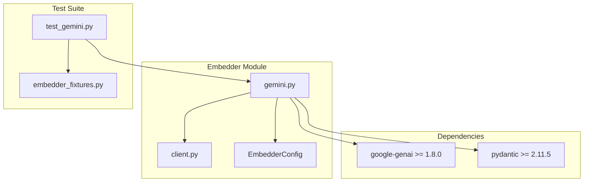
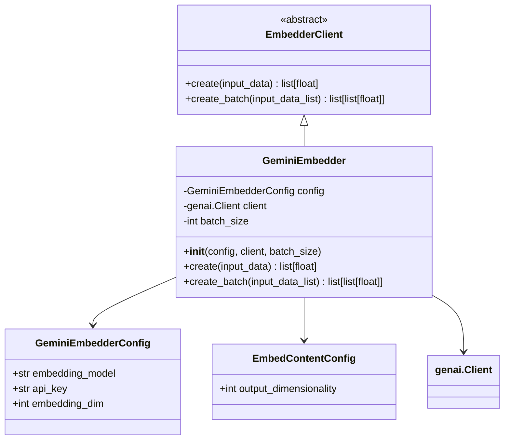
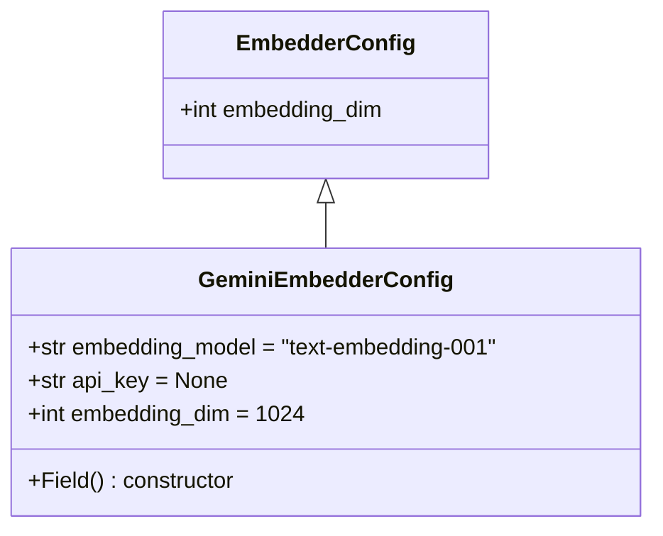
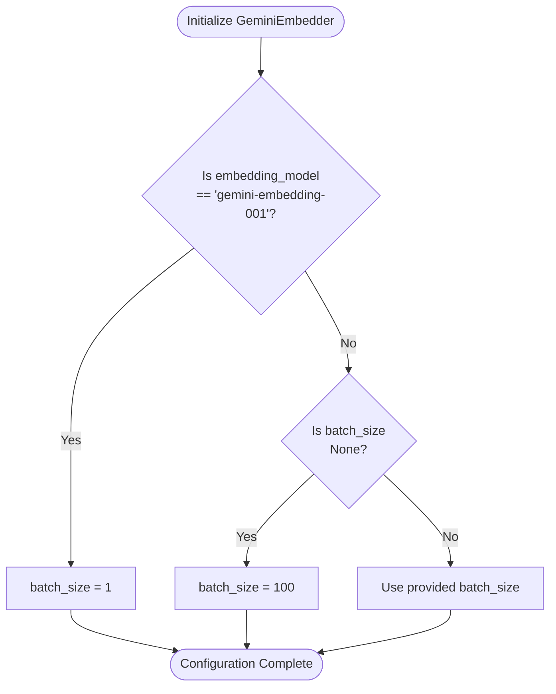
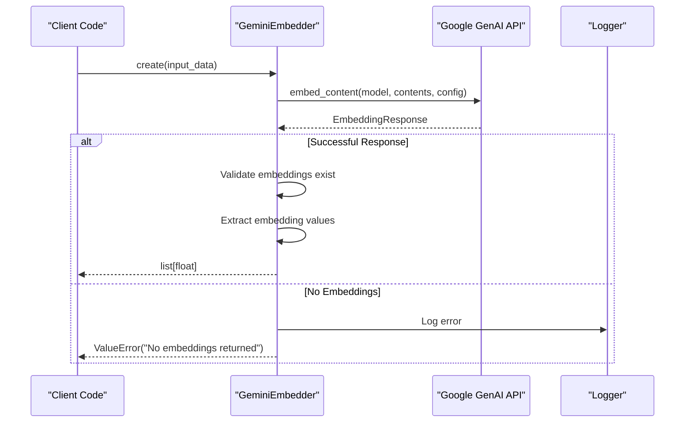
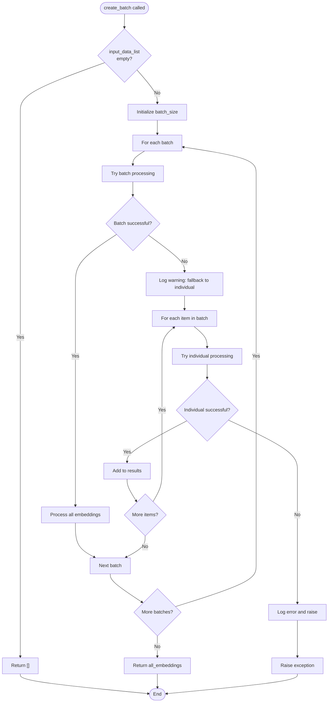
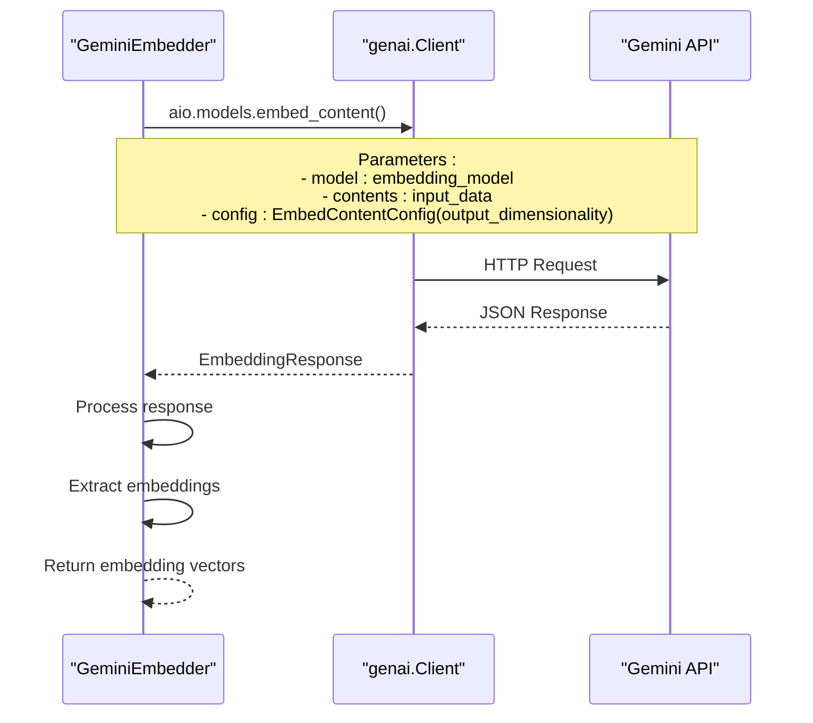
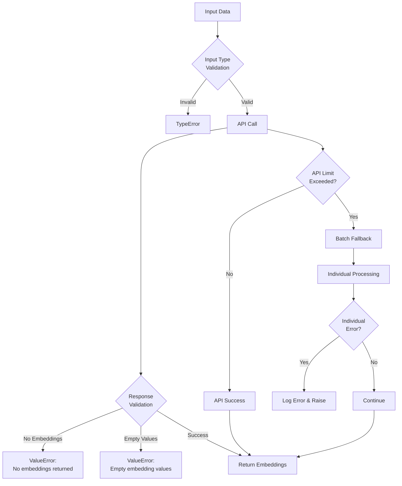
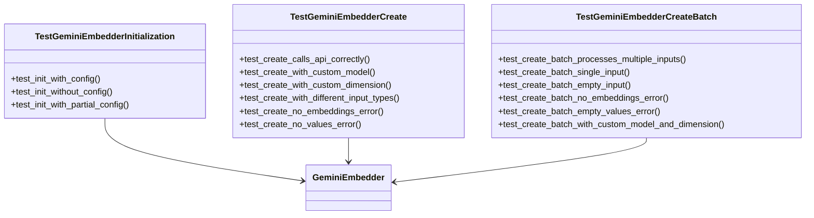

# Google Gemini Embedder

<cite>
**Referenced Files in This Document**
- [graphiti_core/embedder/gemini.py](file://graphiti_core/embedder/gemini.py)
- [tests/embedder/test_gemini.py](file://tests/embedder/test_gemini.py)
- [graphiti_core/embedder/client.py](file://graphiti_core/embedder/client.py)
- [pyproject.toml](file://pyproject.toml)
- [README.md](file://README.md)
</cite>

## Table of Contents
1. [Introduction](#introduction)
2. [Project Structure](#project-structure)
3. [Core Components](#core-components)
4. [Architecture Overview](#architecture-overview)
5. [Detailed Component Analysis](#detailed-component-analysis)
6. [Configuration Management](#configuration-management)
7. [API Implementation](#api-implementation)
8. [Error Handling and Logging](#error-handling-and-logging)
9. [Installation and Dependencies](#installation-and-dependencies)
10. [Usage Examples](#usage-examples)
11. [Testing Framework](#testing-framework)
12. [Troubleshooting Guide](#troubleshooting-guide)
13. [Conclusion](#conclusion)

## Introduction

The Google Gemini Embedder is a specialized component within the Graphiti framework that provides seamless integration with Google's Gemini embedding models. This implementation serves as a robust client for generating high-quality text embeddings using Google's advanced AI capabilities, specifically designed to handle both individual and batch embedding requests with intelligent fallback mechanisms.

The Gemini Embedder is built on top of the `google-genai` library and follows Graphiti's standardized embedder interface, ensuring consistent behavior across different embedding providers while leveraging Google's cutting-edge text embedding technology.

## Project Structure

The Gemini Embedder is organized within the Graphiti ecosystem as part of the embedder module, following a modular architecture that promotes reusability and maintainability.



**Diagram sources**
- [graphiti_core/embedder/gemini.py](file://graphiti_core/embedder/gemini.py#L1-L184)
- [graphiti_core/embedder/client.py](file://graphiti_core/embedder/client.py#L1-L38)

**Section sources**
- [graphiti_core/embedder/gemini.py](file://graphiti_core/embedder/gemini.py#L1-L184)
- [graphiti_core/embedder/client.py](file://graphiti_core/embedder/client.py#L1-L38)

## Core Components

The Gemini Embedder consists of several key components that work together to provide comprehensive embedding functionality:

### GeminiEmbedderConfig
The configuration class that defines the embedding model parameters and API credentials. It inherits from the base `EmbedderConfig` class and adds Google-specific configuration options.

### GeminiEmbedder
The main client implementation that handles communication with Google's Gemini API, providing both individual and batch embedding capabilities with intelligent fallback mechanisms.

### EmbedderClient Base Class
The abstract base class that defines the standard interface for all embedder implementations within Graphiti.

**Section sources**
- [graphiti_core/embedder/gemini.py](file://graphiti_core/embedder/gemini.py#L45-L48)
- [graphiti_core/embedder/gemini.py](file://graphiti_core/embedder/gemini.py#L50-L184)
- [graphiti_core/embedder/client.py](file://graphiti_core/embedder/client.py#L30-L38)

## Architecture Overview

The Gemini Embedder follows a layered architecture that separates concerns and provides flexibility for different usage patterns.



**Diagram sources**
- [graphiti_core/embedder/gemini.py](file://graphiti_core/embedder/gemini.py#L45-L184)
- [graphiti_core/embedder/client.py](file://graphiti_core/embedder/client.py#L30-L38)

The architecture emphasizes:
- **Separation of Concerns**: Clear distinction between configuration, client logic, and API interaction
- **Extensibility**: Base class pattern allows for easy addition of new embedder types
- **Robustness**: Built-in error handling and fallback mechanisms
- **Flexibility**: Support for custom models, dimensions, and batch sizes

## Detailed Component Analysis

### GeminiEmbedderConfig Implementation

The `GeminiEmbedderConfig` class provides comprehensive configuration options for the Gemini Embedder:



**Diagram sources**
- [graphiti_core/embedder/gemini.py](file://graphiti_core/embedder/gemini.py#L45-L48)
- [graphiti_core/embedder/client.py](file://graphiti_core/embedder/client.py#L26-L28)

Key configuration parameters:
- **embedding_model**: Specifies the Gemini model to use (default: "text-embedding-001")
- **api_key**: Google API authentication key (optional for local testing)
- **embedding_dim**: Dimensionality of the output embeddings (inherited from base config)

**Section sources**
- [graphiti_core/embedder/gemini.py](file://graphiti_core/embedder/gemini.py#L45-L48)

### Batch Size Configuration and Automatic Adjustment

The Gemini Embedder implements intelligent batch size management based on the selected model:



**Diagram sources**
- [graphiti_core/embedder/gemini.py](file://graphiti_core/embedder/gemini.py#L79-L86)

The batch size logic ensures optimal performance:
- **gemini-embedding-001**: Limited to 1 item per request due to API restrictions
- **Other models**: Default to 100 items per batch for maximum throughput
- **Custom batch_size**: Allows manual override when needed

**Section sources**
- [graphiti_core/embedder/gemini.py](file://graphiti_core/embedder/gemini.py#L79-L86)

### create() Method Implementation

The `create()` method provides individual embedding generation with comprehensive error handling:



**Diagram sources**
- [graphiti_core/embedder/gemini.py](file://graphiti_core/embedder/gemini.py#L88-L111)

Key features of the create method:
- **Flexible Input Types**: Supports strings, lists of strings, and iterables
- **Automatic Model Selection**: Uses configured model or defaults to "text-embedding-001"
- **Dimensionality Control**: Configurable output dimensions via EmbedContentConfig
- **Comprehensive Validation**: Validates response structure and embedding values

**Section sources**
- [graphiti_core/embedder/gemini.py](file://graphiti_core/embedder/gemini.py#L88-L111)

### create_batch() Method Implementation

The `create_batch()` method implements sophisticated batch processing with automatic fallback:



**Diagram sources**
- [graphiti_core/embedder/gemini.py](file://graphiti_core/embedder/gemini.py#L113-L183)

The create_batch method provides:
- **Intelligent Batching**: Processes inputs in configurable batch sizes
- **Graceful Fallback**: Automatically falls back to individual processing when batch fails
- **Comprehensive Error Handling**: Logs warnings and errors appropriately
- **Consistent Results**: Returns embeddings in the same order as input data

**Section sources**
- [graphiti_core/embedder/gemini.py](file://graphiti_core/embedder/gemini.py#L113-L183)

## Configuration Management

### Default Values and Constants

The Gemini Embedder establishes sensible defaults for optimal performance:

| Parameter | Default Value | Purpose |
|-----------|---------------|---------|
| embedding_model | "text-embedding-001" | Primary Gemini embedding model |
| batch_size | 1 (gemini-embedding-001), 100 (other) | Maximum items per API request |
| embedding_dim | 1024 | Standard embedding dimension |

### Environment Configuration

The embedder inherits dimension configuration from the base `EmbedderConfig` class, which can be controlled via environment variables:

```python
EMBEDDING_DIM = int(os.getenv('EMBEDDING_DIM', 1024))
```

This allows for runtime customization of embedding dimensions across all embedder implementations.

**Section sources**
- [graphiti_core/embedder/gemini.py](file://graphiti_core/embedder/gemini.py#L40-L42)
- [graphiti_core/embedder/client.py](file://graphiti_core/embedder/client.py#L23)

## API Implementation

### genai.Client Integration

The Gemini Embedder leverages the `google-genai` library's asynchronous client for optimal performance:



**Diagram sources**
- [graphiti_core/embedder/gemini.py](file://graphiti_core/embedder/gemini.py#L102-L106)
- [graphiti_core/embedder/gemini.py](file://graphiti_core/embedder/gemini.py#L138-L144)

### EmbedContentConfig Usage

The implementation uses `types.EmbedContentConfig` to configure output dimensions:

```python
config=types.EmbedContentConfig(output_dimensionality=self.config.embedding_dim)
```

This enables fine-grained control over embedding quality and storage requirements.

**Section sources**
- [graphiti_core/embedder/gemini.py](file://graphiti_core/embedder/gemini.py#L102-L106)
- [graphiti_core/embedder/gemini.py](file://graphiti_core/embedder/gemini.py#L138-L144)

## Error Handling and Logging

### Comprehensive Error Management

The Gemini Embedder implements multi-layered error handling:



**Diagram sources**
- [graphiti_core/embedder/gemini.py](file://graphiti_core/embedder/gemini.py#L108-L111)
- [graphiti_core/embedder/gemini.py](file://graphiti_core/embedder/gemini.py#L146-L153)
- [graphiti_core/embedder/gemini.py](file://graphiti_core/embedder/gemini.py#L172-L175)

### Logging Behavior

The implementation provides appropriate logging for different scenarios:

- **Warnings**: Logged when batch processing fails and falls back to individual processing
- **Errors**: Logged when individual embedding attempts fail
- **Debug Information**: Available through the standard Python logging infrastructure

**Section sources**
- [graphiti_core/embedder/gemini.py](file://graphiti_core/embedder/gemini.py#L108-L111)
- [graphiti_core/embedder/gemini.py](file://graphiti_core/embedder/gemini.py#L146-L153)
- [graphiti_core/embedder/gemini.py](file://graphiti_core/embedder/gemini.py#L172-L175)

## Installation and Dependencies

### Required Dependencies

The Gemini Embedder requires the following dependencies:

| Package | Version | Purpose |
|---------|---------|---------|
| google-genai | >= 1.8.0 | Core Gemini API client |
| pydantic | >= 2.11.5 | Configuration validation |
| graphiti-core | - | Parent framework |

### Installation Methods

#### Standard Installation
```bash
pip install graphiti-core[google-genai]
```

#### Using uv package manager
```bash
uv add graphiti-core[google-genai]
```

#### Development Installation
```bash
pip install -e ".[dev]"
```

### API Key Configuration

The Gemini Embedder requires a Google API key for authentication:

```python
from graphiti_core.embedder.gemini import GeminiEmbedder, GeminiEmbedderConfig

config = GeminiEmbedderConfig(
    api_key="your-google-api-key",
    embedding_model="text-embedding-001"
)

embedder = GeminiEmbedder(config=config)
```

**Section sources**
- [pyproject.toml](file://pyproject.toml#L31)
- [graphiti_core/embedder/gemini.py](file://graphiti_core/embedder/gemini.py#L25-L32)
- [README.md](file://README.md#L196-L200)

## Usage Examples

### Basic Usage

```python
import asyncio
from graphiti_core.embedder.gemini import GeminiEmbedder, GeminiEmbedderConfig

async def basic_usage():
    config = GeminiEmbedderConfig(
        api_key="your-api-key",
        embedding_model="text-embedding-001"
    )
    
    embedder = GeminiEmbedder(config=config)
    
    # Single embedding
    embedding = await embedder.create("Hello world")
    print(f"Single embedding shape: {len(embedding)}")
    
    # Batch embeddings
    texts = ["Text 1", "Text 2", "Text 3"]
    embeddings = await embedder.create_batch(texts)
    print(f"Batch embeddings shape: {len(embeddings)} x {len(embeddings[0])}")
```

### Advanced Configuration

```python
async def advanced_configuration():
    # Custom model and dimensions
    config = GeminiEmbedderConfig(
        api_key="your-api-key",
        embedding_model="custom-embedding-model",
        embedding_dim=768
    )
    
    # Custom batch size
    embedder = GeminiEmbedder(
        config=config,
        batch_size=50  # Override default batch size
    )
    
    # Different input types
    await embedder.create("String input")
    await embedder.create(["List", "of", "strings"])
    await embedder.create([1, 2, 3, 4, 5])  # Integer iterables
```

### Error Handling Example

```python
async def error_handling():
    embedder = GeminiEmbedder()
    
    try:
        # This will fail without API key
        await embedder.create("Test text")
    except ImportError as e:
        print(f"Missing dependency: {e}")
    except Exception as e:
        print(f"API error: {e}")
```

## Testing Framework

The Gemini Embedder includes comprehensive test coverage through pytest:

### Test Structure



**Diagram sources**
- [tests/embedder/test_gemini.py](file://tests/embedder/test_gemini.py#L80-L396)

### Test Coverage Areas

The test suite covers:
- **Initialization**: Various configuration scenarios
- **Individual Embeddings**: Different input types and edge cases
- **Batch Processing**: Multiple inputs, error conditions, and fallback mechanisms
- **Error Handling**: API failures, missing data, and validation errors
- **Configuration**: Custom models, dimensions, and batch sizes

**Section sources**
- [tests/embedder/test_gemini.py](file://tests/embedder/test_gemini.py#L1-L396)

## Troubleshooting Guide

### Common Issues and Solutions

#### 1. Missing google-genai Dependency
**Problem**: ImportError when importing GeminiEmbedder
**Solution**: Install the required dependency
```bash
pip install graphiti-core[google-genai]
```

#### 2. API Authentication Failures
**Problem**: 401 Unauthorized errors
**Solution**: Verify API key is correctly configured
```python
config = GeminiEmbedderConfig(api_key="correct-api-key")
```

#### 3. Batch Processing Failures
**Problem**: Batch requests failing with rate limits
**Solution**: The embedder automatically falls back to individual processing, but you can adjust batch size:
```python
embedder = GeminiEmbedder(config=config, batch_size=10)
```

#### 4. Empty Embedding Values
**Problem**: ValueError about empty embedding values
**Solution**: Check input data and API response structure
```python
# Verify input data is not empty
if not input_data.strip():
    raise ValueError("Input text cannot be empty")
```

#### 5. Model Not Found Errors
**Problem**: 404 errors for specified embedding model
**Solution**: Use a valid model name from Google's supported models
```python
config = GeminiEmbedderConfig(embedding_model="text-embedding-001")  # Valid model
```

### Debugging Tips

1. **Enable Logging**: Set log level to DEBUG to see detailed API interactions
2. **Check API Limits**: Monitor rate limits and quota usage
3. **Validate Inputs**: Ensure input data meets API requirements
4. **Test Individual Calls**: Use the create() method to isolate batch processing issues

**Section sources**
- [graphiti_core/embedder/gemini.py](file://graphiti_core/embedder/gemini.py#L25-L32)
- [graphiti_core/embedder/gemini.py](file://graphiti_core/embedder/gemini.py#L155-L160)

## Conclusion

The Google Gemini Embedder provides a robust, production-ready solution for integrating Google's advanced embedding capabilities into the Graphiti framework. Its key strengths include:

- **Intelligent Design**: Automatic batch size adjustment based on model type
- **Robust Error Handling**: Comprehensive fallback mechanisms and logging
- **Flexible Configuration**: Support for custom models, dimensions, and batch sizes
- **Production Ready**: Thorough testing and comprehensive error management
- **Standards Compliant**: Follows Graphiti's embedder interface standards

The implementation demonstrates best practices for API client design, including proper error handling, configuration management, and graceful degradation. Whether processing individual embeddings or large batches, the Gemini Embedder provides reliable, high-performance text embedding capabilities essential for modern AI applications.

For developers working with Graphiti, the Gemini Embedder offers a seamless way to leverage Google's state-of-the-art embedding technology while maintaining the framework's standards for reliability, performance, and ease of use.