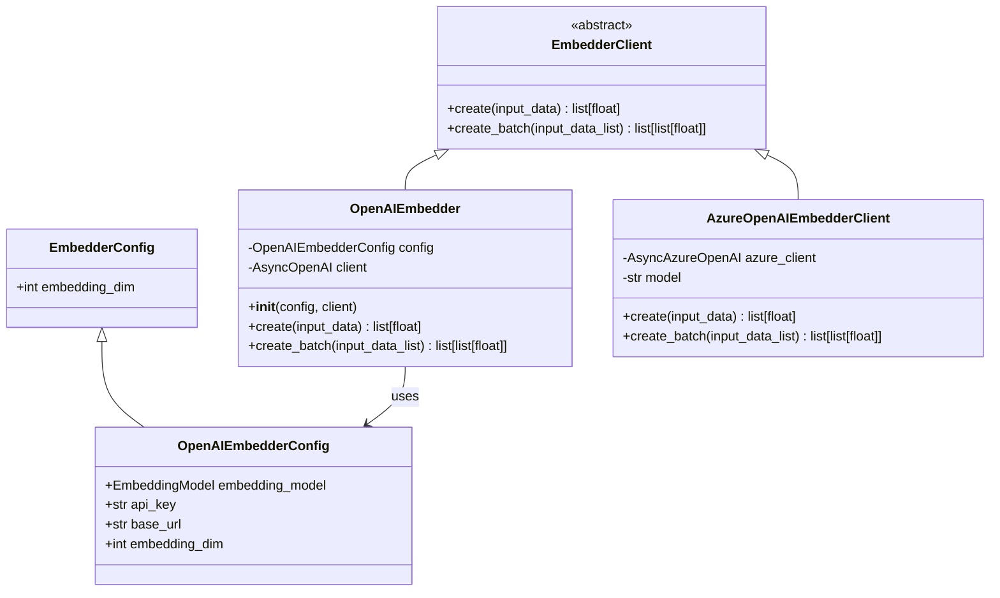
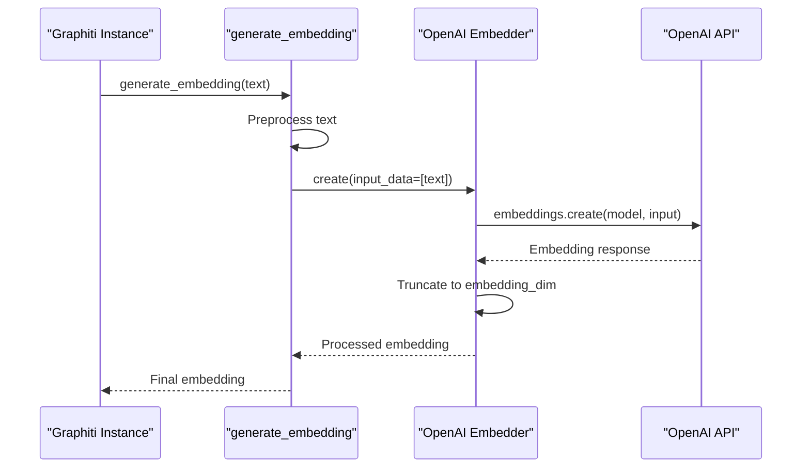
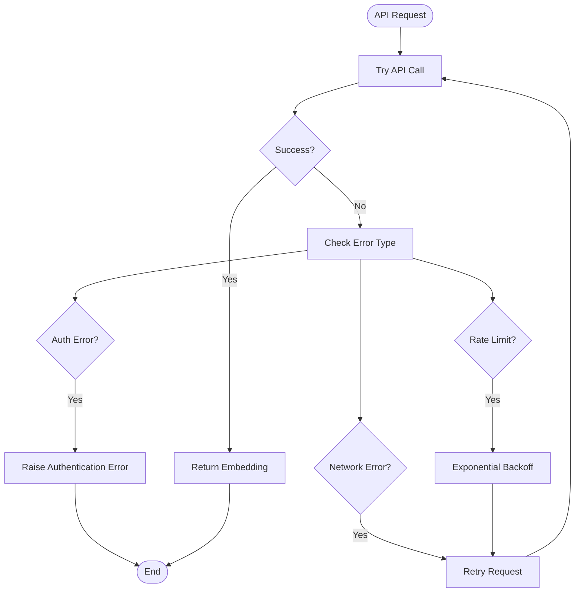

# OpenAI Embedder

<cite>
**Referenced Files in This Document**
- [graphiti_core/embedder/openai.py](file://graphiti_core/embedder/openai.py)
- [graphiti_core/embedder/azure_openai.py](file://graphiti_core/embedder/azure_openai.py)
- [graphiti_core/embedder/client.py](file://graphiti_core/embedder/client.py)
- [graphiti_core/embedder/__init__.py](file://graphiti_core/embedder/__init__.py)
- [tests/embedder/test_openai.py](file://tests/embedder/test_openai.py)
- [examples/quickstart/quickstart_neo4j.py](file://examples/quickstart/quickstart_neo4j.py)
- [graphiti_core/graphiti.py](file://graphiti_core/graphiti.py)
- [graphiti_core/llm_client/utils.py](file://graphiti_core/llm_client/utils.py)
</cite>

## Table of Contents
1. [Introduction](#introduction)
2. [Architecture Overview](#architecture-overview)
3. [OpenAIEmbedderConfig](#openaiembedderconfig)
4. [OpenAIEmbedder Implementation](#openaiembedder-implementation)
5. [Azure OpenAI Support](#azure-openai-support)
6. [Core Methods](#core-methods)
7. [Integration with Graphiti](#integration-with-graphiti)
8. [Configuration Examples](#configuration-examples)
9. [Authentication and Rate Limiting](#authentication-and-rate-limiting)
10. [Error Handling](#error-handling)
11. [Performance Considerations](#performance-considerations)
12. [Best Practices](#best-practices)

## Introduction

The OpenAI Embedder is a core component of the Graphiti framework that provides semantic embedding capabilities using OpenAI's embedding models. It supports both standard OpenAI API endpoints and Azure OpenAI services, offering flexible configuration options for different deployment scenarios. The embedder integrates seamlessly with Graphiti's ingestion and retrieval workflows, enabling efficient semantic search and knowledge graph construction.

The OpenAI Embedder serves as an implementation of the `EmbedderClient` abstract base class, providing asynchronous methods for generating embeddings from text inputs. It handles dimension truncation to match the configured embedding dimension, supports both single and batch processing modes, and includes comprehensive error handling for production deployments.

## Architecture Overview

The OpenAI Embedder follows a modular architecture that separates concerns between configuration, client management, and embedding generation:



**Diagram sources**
- [graphiti_core/embedder/client.py](file://graphiti_core/embedder/client.py#L26-L39)
- [graphiti_core/embedder/openai.py](file://graphiti_core/embedder/openai.py#L27-L31)
- [graphiti_core/embedder/openai.py](file://graphiti_core/embedder/openai.py#L33-L67)
- [graphiti_core/embedder/azure_openai.py](file://graphiti_core/embedder/azure_openai.py#L27-L65)

**Section sources**
- [graphiti_core/embedder/client.py](file://graphiti_core/embedder/client.py#L1-L39)
- [graphiti_core/embedder/openai.py](file://graphiti_core/embedder/openai.py#L1-L67)

## OpenAIEmbedderConfig

The `OpenAIEmbedderConfig` class defines the configuration parameters for the OpenAI Embedder. It inherits from `EmbedderConfig` and adds OpenAI-specific configuration options:

### Configuration Parameters

| Parameter | Type | Default Value | Description |
|-----------|------|---------------|-------------|
| `embedding_model` | `EmbeddingModel \| str` | `'text-embedding-3-small'` | The OpenAI embedding model to use |
| `api_key` | `str \| None` | `None` | OpenAI API key for authentication |
| `base_url` | `str \| None` | `None` | Custom base URL for OpenAI API endpoint |

### Key Features

- **Default Model**: Uses `text-embedding-3-small` as the default embedding model
- **Flexible Authentication**: Supports both API key and custom base URL configurations
- **Dimension Compatibility**: Automatically handles embedding dimension truncation
- **Environment Integration**: Works seamlessly with Graphiti's environment variable system

**Section sources**
- [graphiti_core/embedder/openai.py](file://graphiti_core/embedder/openai.py#L27-L31)

## OpenAIEmbedder Implementation

The `OpenAIEmbedder` class provides the primary implementation for OpenAI embedding generation. It supports both standard OpenAI and Azure OpenAI through the AsyncOpenAI/AsyncAzureOpenAI clients.

### Constructor and Initialization

The constructor accepts optional configuration and client parameters:

```python
def __init__(
    self,
    config: OpenAIEmbedderConfig | None = None,
    client: AsyncOpenAI | AsyncAzureOpenAI | None = None,
):
```

### Key Design Principles

- **Client Flexibility**: Accepts either a pre-configured client or creates one using configuration
- **Default Fallback**: Creates an AsyncOpenAI client with provided API key and base URL
- **Type Safety**: Uses proper type hints for input parameters and return values
- **Async Operations**: Implements fully asynchronous methods for non-blocking operations

**Section sources**
- [graphiti_core/embedder/openai.py](file://graphiti_core/embedder/openai.py#L33-L52)

## Azure OpenAI Support

The framework provides dedicated support for Azure OpenAI through the `AzureOpenAIEmbedderClient` class, which wraps the AsyncAzureOpenAI client:

### Azure OpenAI Features

- **Managed Identity Support**: Configurable authentication using Azure managed identities
- **Deployment Management**: Supports specific deployment names for Azure OpenAI
- **API Versioning**: Compatible with different Azure OpenAI API versions
- **Flexible Input Handling**: Processes various input types including strings and lists

### Authentication Options

The Azure OpenAI embedder supports two authentication methods:

1. **API Key Authentication**: Traditional API key-based authentication
2. **Managed Identity**: Azure managed identity for secure, credential-free authentication

**Section sources**
- [graphiti_core/embedder/azure_openai.py](file://graphiti_core/embedder/azure_openai.py#L27-L65)

## Core Methods

The OpenAI Embedder provides two primary methods for embedding generation:

### create() Method

Generates embeddings for a single input or batch of inputs:

```python
async def create(
    self, input_data: str | list[str] | Iterable[int] | Iterable[Iterable[int]]
) -> list[float]:
```

#### Input Handling Capabilities

- **Single String**: Direct text input for individual embeddings
- **String List**: Batch processing for multiple texts
- **Integer Iterables**: Numeric data conversion to embeddings
- **Nested Iterables**: Complex data structures support

#### Dimension Truncation

The method automatically truncates embeddings to match the configured `embedding_dim`:

```python
return result.data[0].embedding[: self.config.embedding_dim]
```

### create_batch() Method

Processes multiple inputs efficiently in a single API call:

```python
async def create_batch(self, input_data_list: list[str]) -> list[list[float]]:
```

#### Batch Processing Benefits

- **Reduced API Calls**: Single request for multiple embeddings
- **Improved Performance**: Lower latency compared to individual requests
- **Cost Efficiency**: Reduced API costs for bulk operations
- **Consistent Dimensions**: All embeddings guaranteed to have same dimension

**Section sources**
- [graphiti_core/embedder/openai.py](file://graphiti_core/embedder/openai.py#L54-L66)

## Integration with Graphiti

The OpenAI Embedder integrates seamlessly with Graphiti's core functionality, serving as the default embedder when no custom embedder is provided.

### Graphiti Constructor Integration

Graphiti automatically initializes the OpenAI Embedder when no embedder is specified:

```python
if embedder:
    self.embedder = embedder
else:
    self.embedder = OpenAIEmbedder()
```

### Embedding Generation Workflow

The embedder participates in Graphiti's ingestion pipeline through the `generate_embedding` utility function:



**Diagram sources**
- [graphiti_core/llm_client/utils.py](file://graphiti_core/llm_client/utils.py#L25-L34)
- [graphiti_core/embedder/openai.py](file://graphiti_core/embedder/openai.py#L54-L66)

### Node and Edge Embedding

The embedder is used extensively during the node and edge extraction process:

- **Entity Nodes**: Embeddings generated for extracted entities
- **Relationship Edges**: Semantic embeddings for entity relationships
- **Episode Content**: Text embeddings for episode processing

**Section sources**
- [graphiti_core/graphiti.py](file://graphiti_core/graphiti.py#L211-L214)
- [graphiti_core/llm_client/utils.py](file://graphiti_core/llm_client/utils.py#L1-L34)

## Configuration Examples

### Standard OpenAI Configuration

```python
from graphiti_core.embedder import OpenAIEmbedder, OpenAIEmbedderConfig

# Basic configuration
config = OpenAIEmbedderConfig(
    api_key="your-openai-api-key",
    embedding_model="text-embedding-3-small"
)

# Initialize embedder
embedder = OpenAIEmbedder(config=config)
```

### Azure OpenAI Configuration

```python
from graphiti_core.embedder import AzureOpenAIEmbedderClient
from openai import AsyncAzureOpenAI

# Azure OpenAI configuration
azure_client = AsyncAzureOpenAI(
    azure_endpoint="https://your-resource.openai.azure.com/",
    api_key="your-azure-api-key",
    api_version="2024-02-15-preview"
)

# Initialize Azure embedder
embedder = AzureOpenAIEmbedderClient(
    azure_client=azure_client,
    model="text-embedding-3-small"
)
```

### Environment-Based Configuration

```python
import os
from graphiti_core.embedder import OpenAIEmbedderConfig

# Environment variables
os.environ['OPENAI_API_KEY'] = 'your-api-key'
os.environ['EMBEDDING_DIM'] = '1024'

# Configuration from environment
config = OpenAIEmbedderConfig()
embedder = OpenAIEmbedder(config=config)
```

### Graphiti Integration Example

```python
from graphiti_core import Graphiti
from graphiti_core.embedder import OpenAIEmbedder, OpenAIEmbedderConfig

# Initialize Graphiti with OpenAI embedder
graphiti = Graphiti(
    uri="bolt://localhost:7687",
    user="neo4j",
    password="password",
    embedder=OpenAIEmbedder(
        config=OpenAIEmbedderConfig(
            api_key="your-api-key",
            embedding_model="text-embedding-3-large"
        )
    )
)
```

## Authentication and Rate Limiting

### OpenAI API Authentication

The OpenAI Embedder supports multiple authentication mechanisms:

- **API Key**: Standard OpenAI API key authentication
- **Custom Base URL**: Support for proxy or custom endpoints
- **Environment Variables**: Automatic detection of `OPENAI_API_KEY`

### Azure OpenAI Authentication

Azure OpenAI supports additional authentication methods:

- **API Key**: Traditional API key authentication
- **Managed Identity**: Azure managed identity for secure deployments
- **AAD Token**: Azure Active Directory token authentication

### Rate Limiting Considerations

The framework implements several strategies to handle rate limits:

1. **Concurrent Operation Limits**: Configurable semaphore limits via `SEMAPHORE_LIMIT` environment variable
2. **Batch Processing**: Reduces API calls through efficient batching
3. **Error Retry Logic**: Built-in retry mechanisms for transient failures
4. **Graceful Degradation**: Fallback strategies for service unavailability

### Best Practices for Rate Limiting

- Set appropriate `SEMAPHORE_LIMIT` based on your API tier
- Implement exponential backoff for failed requests
- Monitor API usage and adjust concurrency accordingly
- Use batch processing to minimize API calls

## Error Handling

The OpenAI Embedder implements comprehensive error handling strategies:

### Exception Types

- **API Errors**: Network connectivity and API-specific errors
- **Authentication Errors**: Invalid API keys and permission issues
- **Rate Limit Errors**: 429 HTTP status codes and quota exceeded
- **Validation Errors**: Input format and parameter validation

### Error Recovery Strategies



### Logging and Monitoring

The embedder includes comprehensive logging for debugging and monitoring:

- **Request Logging**: API call details and timing
- **Error Logging**: Detailed error information with context
- **Performance Metrics**: Embedding generation timing
- **Usage Statistics**: API call counts and success rates

**Section sources**
- [tests/embedder/test_openai.py](file://tests/embedder/test_openai.py#L1-L127)

## Performance Considerations

### Embedding Dimension Management

The embedder automatically handles dimension compatibility:

- **Automatic Truncation**: Embeddings are truncated to match `embedding_dim`
- **Configuration Flexibility**: Supports various embedding dimensions
- **Backward Compatibility**: Works with different model output sizes

### Batch Processing Optimization

- **Efficient Batching**: Groups multiple requests into single API calls
- **Memory Management**: Handles large batches efficiently
- **Parallel Processing**: Leverages async/await for concurrent operations

### Caching Strategies

While not built into the embedder itself, consider implementing caching:

- **Response Caching**: Store embeddings for repeated queries
- **Model Caching**: Cache model loading and initialization
- **Connection Pooling**: Reuse HTTP connections for multiple requests

### Performance Tuning Guidelines

1. **Batch Size Optimization**: Balance between memory usage and API efficiency
2. **Concurrency Control**: Adjust based on API limits and system resources
3. **Model Selection**: Choose appropriate embedding models for your use case
4. **Network Optimization**: Use local networks or CDNs for reduced latency

## Best Practices

### Configuration Management

- **Environment Separation**: Use different API keys for development/staging/production
- **Secret Management**: Store API keys securely using environment variables or secret managers
- **Model Versioning**: Pin specific model versions for reproducible results
- **Fallback Strategies**: Implement backup embedding providers

### Production Deployment

- **Monitoring**: Implement comprehensive logging and metrics collection
- **Health Checks**: Regular API availability and performance monitoring
- **Resource Limits**: Set appropriate memory and CPU limits
- **Security**: Implement proper network security and access controls

### Development Workflow

- **Testing**: Use mock embedders for unit testing
- **Validation**: Implement input validation and error checking
- **Documentation**: Maintain clear documentation for embedding workflows
- **Version Control**: Track embedding model changes and their impacts

### Cost Optimization

- **Model Selection**: Choose cost-effective models for your use case
- **Batch Processing**: Maximize batch sizes to reduce API calls
- **Usage Monitoring**: Track and optimize embedding usage patterns
- **Rate Limit Management**: Implement intelligent retry and backoff strategies

The OpenAI Embedder provides a robust, scalable solution for semantic embedding needs within the Graphiti framework. Its flexible architecture supports both standard OpenAI and Azure OpenAI deployments while maintaining high performance and reliability standards for production applications.