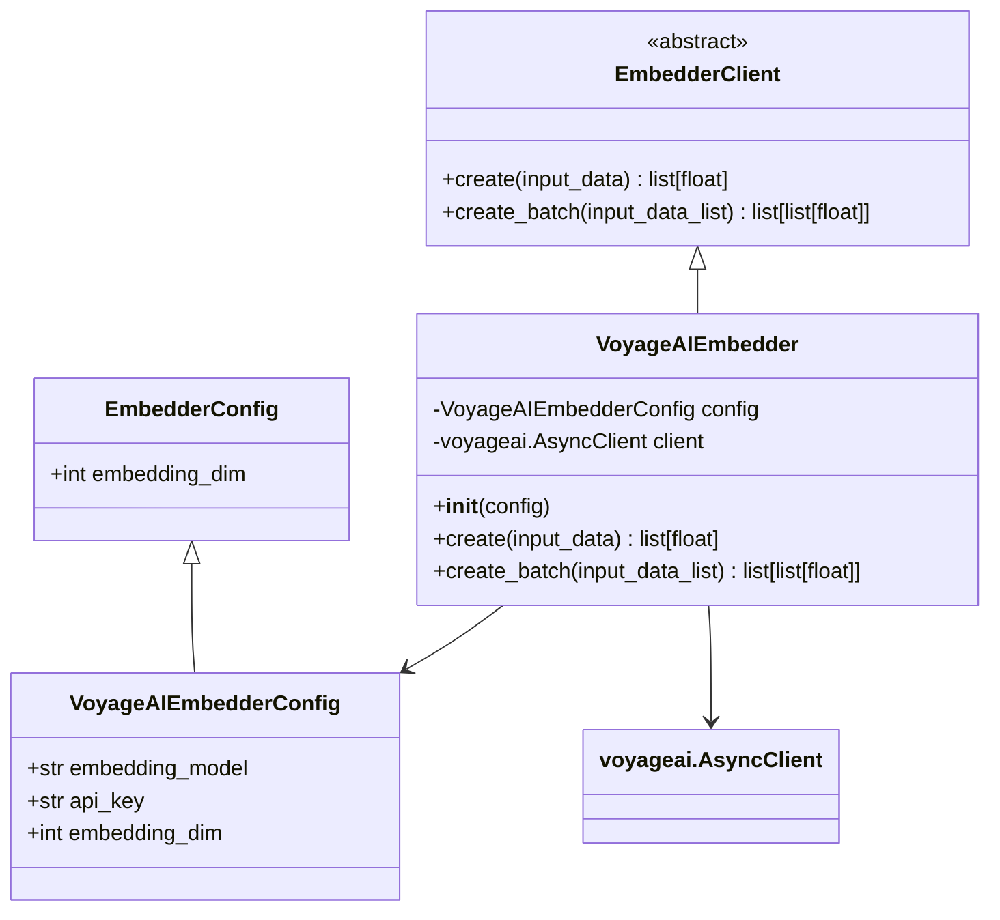
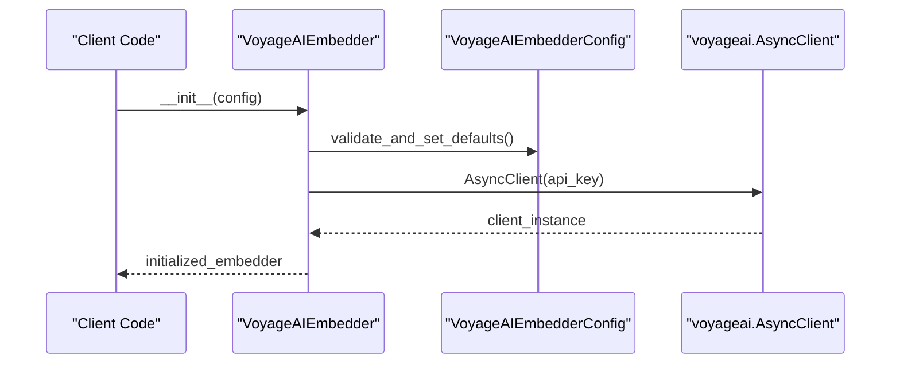
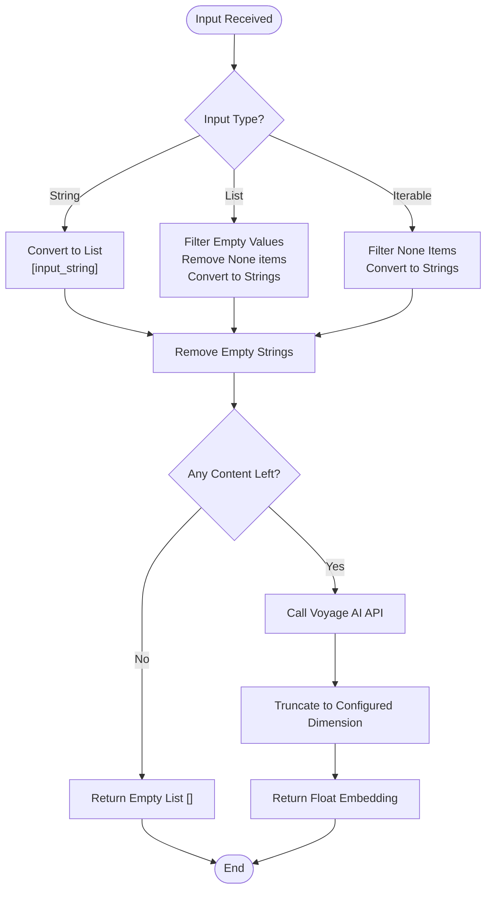
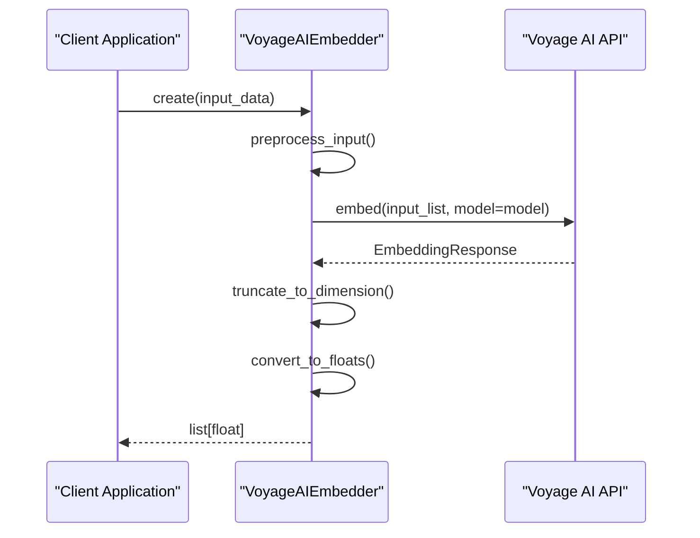
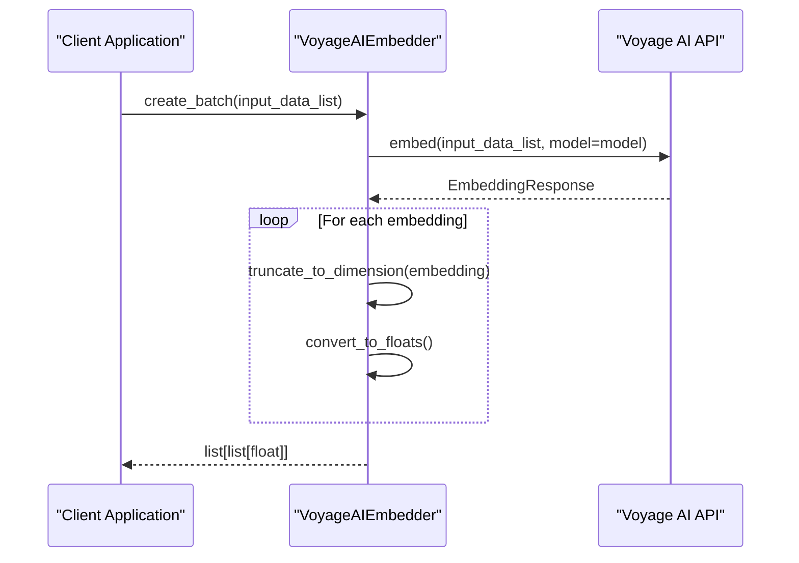
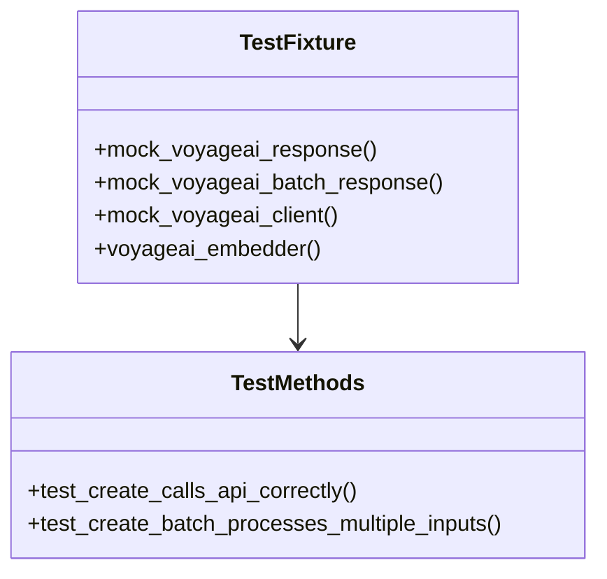

# Voyage AI Embedder

<cite>
**Referenced Files in This Document**
- [voyage.py](file://graphiti_core/embedder/voyage.py)
- [client.py](file://graphiti_core/embedder/client.py)
- [test_voyage.py](file://tests/embedder/test_voyage.py)
- [embedder_fixtures.py](file://tests/embedder/embedder_fixtures.py)
- [pyproject.toml](file://pyproject.toml)
- [README.md](file://README.md)
</cite>

## Table of Contents
1. [Introduction](#introduction)
2. [Installation and Dependencies](#installation-and-dependencies)
3. [Architecture Overview](#architecture-overview)
4. [Configuration](#configuration)
5. [Core Implementation](#core-implementation)
6. [Input Processing Logic](#input-processing-logic)
7. [API Integration](#api-integration)
8. [Error Handling](#error-handling)
9. [Testing and Validation](#testing-and-validation)
10. [Usage Examples](#usage-examples)
11. [Best Practices](#best-practices)

## Introduction

The Voyage AI Embedder is a specialized embedding client implementation within the Graphiti framework that provides vector embeddings using Voyage AI's advanced embedding models. This embedder serves as a bridge between the Graphiti knowledge graph system and Voyage AI's powerful embedding capabilities, enabling semantic search and similarity-based operations within temporal knowledge graphs.

The embedder supports multiple input formats, automatic dimension truncation, and seamless integration with the Graphiti ecosystem through a standardized embedder interface. It leverages Voyage AI's asynchronous client architecture to provide efficient batch processing capabilities while maintaining compatibility with various graph database backends.

## Installation and Dependencies

### Required Dependencies

The Voyage AI Embedder requires the `voyageai` package, which is available as an optional dependency in the Graphiti framework. The embedder automatically handles dependency resolution and provides clear installation instructions.

```bash
# Install with Voyage AI support
pip install graphiti-core[voyageai]

# Or with uv package manager
uv add graphiti-core[voyageai]
```

### Package Dependencies

The embedder depends on several core packages within the Graphiti framework:

- **voyageai**: Core Voyage AI SDK for asynchronous embedding operations
- **pydantic**: Type validation and configuration management
- **graphiti-core**: Base embedder infrastructure and configuration classes

**Section sources**
- [pyproject.toml](file://pyproject.toml#L34)
- [voyage.py](file://graphiti_core/embedder/voyage.py#L23-L29)

## Architecture Overview

The Voyage AI Embedder follows a layered architecture that integrates seamlessly with the Graphiti embedder ecosystem:



**Diagram sources**
- [client.py](file://graphiti_core/embedder/client.py#L30-L39)
- [voyage.py](file://graphiti_core/embedder/voyage.py#L38-L41)
- [voyage.py](file://graphiti_core/embedder/voyage.py#L43-L77)

The architecture consists of three main layers:

1. **Interface Layer**: Extends the abstract `EmbedderClient` base class
2. **Configuration Layer**: Manages embedder-specific settings and defaults
3. **Implementation Layer**: Handles API communication and data processing

**Section sources**
- [client.py](file://graphiti_core/embedder/client.py#L30-L39)
- [voyage.py](file://graphiti_core/embedder/voyage.py#L43-L77)

## Configuration

### VoyageAIEmbedderConfig

The configuration class defines the parameters for the Voyage AI Embedder:

| Parameter | Type | Default | Description |
|-----------|------|---------|-------------|
| `embedding_model` | `str` | `'voyage-3'` | The Voyage AI embedding model to use |
| `api_key` | `str \| None` | `None` | Voyage AI API authentication key |

### Default Settings

- **Default Model**: `voyage-3` - The latest stable embedding model
- **Default Dimension**: Inherits from parent `EmbedderConfig` (typically 1024)
- **API Authentication**: Supports both explicit API key specification and environment variable configuration

### Configuration Example

```python
from graphiti_core.embedder.voyage import VoyageAIEmbedderConfig

# Basic configuration
config = VoyageAIEmbedderConfig(
    embedding_model="voyage-large-2",
    api_key="your-api-key-here"
)

# Using default model
default_config = VoyageAIEmbedderConfig(api_key="your-api-key")
```

**Section sources**
- [voyage.py](file://graphiti_core/embedder/voyage.py#L38-L41)

## Core Implementation

### Initialization

The `VoyageAIEmbedder` constructor initializes the embedder with configuration and establishes the Voyage AI client connection:



**Diagram sources**
- [voyage.py](file://graphiti_core/embedder/voyage.py#L48-L52)

### Key Implementation Details

1. **Lazy Import Handling**: The embedder uses conditional imports to provide clear error messages when the `voyageai` dependency is missing
2. **Client Instantiation**: Creates an asynchronous client with the provided API key
3. **Configuration Validation**: Ensures proper initialization with fallback defaults

**Section sources**
- [voyage.py](file://graphiti_core/embedder/voyage.py#L48-L52)

## Input Processing Logic

### create() Method Input Preprocessing

The `create()` method implements sophisticated input preprocessing to handle various data formats while filtering invalid entries:



**Diagram sources**
- [voyage.py](file://graphiti_core/embedder/voyage.py#L54-L69)

### Input Type Handling

The method supports three primary input formats:

1. **Single String**: Automatically wrapped in a list for API compatibility
2. **List of Strings/Objects**: Filters out empty values and converts all items to strings
3. **Generic Iterable**: Processes any iterable, filtering None values and converting to strings

### Value Filtering Logic

- **Empty Strings**: Removed during preprocessing
- **None Values**: Filtered out regardless of input type
- **Type Conversion**: All values converted to strings for consistent API handling

**Section sources**
- [voyage.py](file://graphiti_core/embedder/voyage.py#L54-L69)

## API Integration

### create() Method Implementation

The `create()` method provides single-input embedding generation with automatic dimension truncation:



**Diagram sources**
- [voyage.py](file://graphiti_core/embedder/voyage.py#L54-L69)

### create_batch() Method Implementation

The `create_batch()` method enables efficient batch processing for multiple inputs:



**Diagram sources**
- [voyage.py](file://graphiti_core/embedder/voyage.py#L71-L76)

### Automatic Dimension Truncation

Both methods automatically truncate embeddings to match the configured `embedding_dim` parameter, ensuring compatibility with downstream systems and optimizing storage requirements.

**Section sources**
- [voyage.py](file://graphiti_core/embedder/voyage.py#L54-L76)

## Error Handling

### Empty Input Scenarios

The embedder gracefully handles empty input situations:

- **Empty Lists**: Returns empty list `[]` when no valid content remains after filtering
- **Missing API Key**: Raises `ImportError` with clear installation instructions when `voyageai` is unavailable
- **API Communication Errors**: Inherits standard exception handling from the Voyage AI client

### Error Conditions

1. **Missing Dependencies**: Clear ImportError with installation instructions
2. **Invalid API Key**: Handled by Voyage AI client with appropriate error messages
3. **Network Issues**: Propagated from the underlying async client
4. **Empty Input**: Graceful handling with empty result return

**Section sources**
- [voyage.py](file://graphiti_core/embedder/voyage.py#L23-L29)
- [voyage.py](file://graphiti_core/embedder/voyage.py#L65-L66)

## Testing and Validation

### Test Infrastructure

The embedder includes comprehensive testing with mock implementations:



**Diagram sources**
- [test_voyage.py](file://tests/embedder/test_voyage.py#L31-L66)

### Test Coverage

The test suite validates:

1. **API Call Verification**: Correct parameter passing to the Voyage AI client
2. **Response Processing**: Proper embedding extraction and dimension handling
3. **Batch Processing**: Multiple input handling and result formatting
4. **Error Scenarios**: Empty input and edge case handling

**Section sources**
- [test_voyage.py](file://tests/embedder/test_voyage.py#L69-L142)
- [embedder_fixtures.py](file://tests/embedder/embedder_fixtures.py#L18-L21)

## Usage Examples

### Basic Usage

```python
from graphiti_core.embedder.voyage import VoyageAIEmbedder, VoyageAIEmbedderConfig

# Initialize with API key
config = VoyageAIEmbedderConfig(
    api_key="your-voyage-api-key",
    embedding_model="voyage-large-2"
)

embedder = VoyageAIEmbedder(config=config)

# Single embedding
embedding = await embedder.create("Hello World")

# Batch embeddings
batch_embeddings = await embedder.create_batch([
    "First text",
    "Second text",
    "Third text"
])
```

### Configuration Management

```python
import os
from graphiti_core.embedder.voyage import VoyageAIEmbedderConfig

# Environment-based configuration
config = VoyageAIEmbedderConfig(
    api_key=os.environ.get("VOYAGE_API_KEY"),
    embedding_model="voyage-large-2"
)
```

### Error Handling Example

```python
try:
    embedder = VoyageAIEmbedder()
    result = await embedder.create("")
    print(f"Embedding length: {len(result)}")
except ImportError as e:
    print(f"Missing dependency: {e}")
except Exception as e:
    print(f"Embedding error: {e}")
```

## Best Practices

### API Key Management

1. **Environment Variables**: Store API keys in environment variables for security
2. **Configuration Objects**: Use dedicated configuration classes for centralized management
3. **Error Handling**: Implement robust error handling for authentication failures

### Performance Optimization

1. **Batch Processing**: Use `create_batch()` for multiple embeddings to reduce API calls
2. **Dimension Control**: Configure appropriate embedding dimensions to balance quality and storage
3. **Async Operations**: Leverage async/await patterns for concurrent processing

### Input Validation

1. **Content Filtering**: The embedder automatically filters empty content
2. **Type Safety**: Use type hints and validation for input data
3. **Error Recovery**: Implement graceful degradation for invalid inputs

### Integration Patterns

1. **Dependency Injection**: Pass embedder instances through dependency injection
2. **Configuration Separation**: Separate configuration from implementation logic
3. **Testing Mocks**: Use mock implementations for unit testing and development

**Section sources**
- [voyage.py](file://graphiti_core/embedder/voyage.py#L48-L52)
- [test_voyage.py](file://tests/embedder/test_voyage.py#L61-L66)