# Abstract Graph Driver Interface

<cite>
**Referenced Files in This Document**
- [graphiti_core/driver/driver.py](file://graphiti_core/driver/driver.py)
- [graphiti_core/driver/search_interface/search_interface.py](file://graphiti_core/driver/search_interface/search_interface.py)
- [graphiti_core/driver/graph_operations/graph_operations.py](file://graphiti_core/driver/graph_operations/graph_operations.py)
- [graphiti_core/driver/falkordb_driver.py](file://graphiti_core/driver/falkordb_driver.py)
- [graphiti_core/driver/neo4j_driver.py](file://graphiti_core/driver/neo4j_driver.py)
- [graphiti_core/driver/neptune_driver.py](file://graphiti_core/driver/neptune_driver.py)
- [graphiti_core/driver/kuzu_driver.py](file://graphiti_core/driver/kuzu_driver.py)
- [tests/driver/test_falkordb_driver.py](file://tests/driver/test_falkordb_driver.py)
- [tests/helpers_test.py](file://tests/helpers_test.py)
</cite>

## Table of Contents
1. [Introduction](#introduction)
2. [GraphProvider Enum](#graphprovider-enum)
3. [Core Abstract Classes](#core-abstract-classes)
4. [Method Specifications](#method-specifications)
5. [Composition Pattern](#composition-pattern)
6. [Concrete Driver Implementations](#concrete-driver-implementations)
7. [Database Interchangeability](#database-interchangeability)
8. [Error Handling and Concurrency](#error-handling-and-concurrency)
9. [Implementation Guidelines](#implementation-guidelines)
10. [Best Practices](#best-practices)

## Introduction

The Graphiti framework employs a sophisticated abstraction layer for graph database integrations through the GraphDriver and GraphDriverSession abstract classes. This interface design enables seamless database interchangeability while maintaining consistent functionality across different graph database backends including Neo4j, FalkorDB, Amazon Neptune, and Kuzu.

The driver abstraction serves as a unified contract that defines how Graphiti interacts with various graph databases, providing asynchronous query execution, session management, resource cleanup, and specialized operations like fulltext search and index management. This design pattern ensures that the core Graphiti functionality remains database-agnostic while allowing each backend to optimize its specific capabilities.

## GraphProvider Enum

The GraphProvider enum serves as the foundation for database type identification and provider-specific behavior customization within the GraphDriver interface.


**Diagram sources**
- [graphiti_core/driver/driver.py](file://graphiti_core/driver/driver.py#L42-L46)

### Provider Types

| Provider | Description | Key Characteristics |
|----------|-------------|-------------------|
| NEO4J | Neo4j graph database | Native Cypher support, ACID transactions, mature ecosystem |
| FALKORDB | FalkorDB multi-tenant graph database | Redis-based, high-performance, multi-tenant architecture |
| KUZU | Kuzu embedded graph database | In-memory/embedded, schema-first approach, lightweight |
| NEPTUNE | Amazon Neptune graph database | Managed cloud service, hybrid search capabilities |

**Section sources**
- [graphiti_core/driver/driver.py](file://graphiti_core/driver/driver.py#L42-L46)

## Core Abstract Classes

The GraphDriver and GraphDriverSession classes form the backbone of the database abstraction layer, defining the essential interface contracts for graph database operations.

### GraphDriverSession Abstract Class

The GraphDriverSession represents a database session with asynchronous context management capabilities.


**Diagram sources**
- [graphiti_core/driver/driver.py](file://graphiti_core/driver/driver.py#L49-L71)
- [graphiti_core/driver/falkordb_driver.py](file://graphiti_core/driver/falkordb_driver.py#L77-L110)
- [graphiti_core/driver/neo4j_driver.py](file://graphiti_core/driver/neo4j_driver.py#L29-L75)

### GraphDriver Abstract Class

The GraphDriver serves as the primary interface for database operations and maintains the composition pattern with specialized interfaces.


**Diagram sources**
- [graphiti_core/driver/driver.py](file://graphiti_core/driver/driver.py#L73-L116)
- [graphiti_core/driver/search_interface/search_interface.py](file://graphiti_core/driver/search_interface/search_interface.py#L22-L90)
- [graphiti_core/driver/graph_operations/graph_operations.py](file://graphiti_core/driver/graph_operations/graph_operations.py#L22-L196)

**Section sources**
- [graphiti_core/driver/driver.py](file://graphiti_core/driver/driver.py#L49-L116)
- [graphiti_core/driver/search_interface/search_interface.py](file://graphiti_core/driver/search_interface/search_interface.py#L22-L90)
- [graphiti_core/driver/graph_operations/graph_operations.py](file://graphiti_core/driver/graph_operations/graph_operations.py#L22-L196)

## Method Specifications

Each abstract method in the GraphDriver interface serves a specific purpose in the database interaction lifecycle.

### execute_query Method

The execute_query method provides asynchronous Cypher query execution with parameter support and result formatting.


**Diagram sources**
- [graphiti_core/driver/driver.py](file://graphiti_core/driver/driver.py#L82-L84)
- [graphiti_core/driver/falkordb_driver.py](file://graphiti_core/driver/falkordb_driver.py#L149-L180)

**Method Signature:**
```python
@abstractmethod
def execute_query(self, cypher_query_: str, **kwargs: Any) -> Coroutine:
    """
    Execute a Cypher query asynchronously.
    
    Args:
        cypher_query_: The Cypher query string to execute
        **kwargs: Query parameters and configuration options
        
    Returns:
        Coroutine yielding the query result as (records, header, summary)
        
    Raises:
        Database-specific exceptions for query failures
    """
```

### session Method

The session method creates database sessions with optional database switching capabilities.

**Method Signature:**
```python
@abstractmethod
def session(self, database: str | None = None) -> GraphDriverSession:
    """
    Create a new database session.
    
    Args:
        database: Optional database name for multi-database scenarios
        
    Returns:
        GraphDriverSession instance for database operations
        
    Raises:
        Database-specific exceptions for connection failures
    """
```

### close Method

The close method handles resource cleanup and connection termination across different database backends.

**Method Signature:**
```python
@abstractmethod
def close(self):
    """
    Close the database connection and clean up resources.
    
    This method should handle any necessary cleanup operations
    including connection pools, temporary files, and network connections.
    """
```

### delete_all_indexes Method

The delete_all_indexes method removes all database indexes for clean slate operations.

**Method Signature:**
```python
@abstractmethod
def delete_all_indexes(self) -> Coroutine:
    """
    Delete all indexes in the database.
    
    Returns:
        Coroutine that resolves when all indexes are deleted
        
    Raises:
        Database-specific exceptions for index deletion failures
    """
```

### with_database Method

The with_database method enables dynamic database switching while maintaining connection reuse.

**Method Signature:**
```python
def with_database(self, database: str) -> 'GraphDriver':
    """
    Returns a shallow copy of this driver with a different default database.
    Reuses the same connection (e.g., FalkorDB, Neo4j).
    
    Args:
        database: New database name for subsequent operations
        
    Returns:
        Copy of self with updated database setting
    """
```

### build_fulltext_query Method

The build_fulltext_query method constructs provider-specific fulltext search queries.

**Method Signature:**
```python
def build_fulltext_query(
    self, query: str, group_ids: list[str] | None = None, max_query_length: int = 128
) -> str:
    """
    Build a fulltext query string for database providers.
    
    Only implemented by providers that need custom fulltext query building.
    
    Args:
        query: Base search query text
        group_ids: Optional list of group identifiers for filtering
        max_query_length: Maximum allowed query length
        
    Returns:
        Formatted fulltext query string
        
    Raises:
        NotImplementedError for unsupported providers
    """
```

**Section sources**
- [graphiti_core/driver/driver.py](file://graphiti_core/driver/driver.py#L82-L116)

## Composition Pattern

The GraphDriver interface employs a composition pattern through specialized interfaces for search operations and graph mutations.

### Search Interface Composition

The SearchInterface encapsulates all search-related functionality including fulltext and similarity searches.


**Diagram sources**
- [graphiti_core/driver/search_interface/search_interface.py](file://graphiti_core/driver/search_interface/search_interface.py#L27-L87)

### Graph Operations Interface Composition

The GraphOperationsInterface handles all graph mutation operations including node and edge management.


**Diagram sources**
- [graphiti_core/driver/graph_operations/graph_operations.py](file://graphiti_core/driver/graph_operations/graph_operations.py#L31-L196)

**Section sources**
- [graphiti_core/driver/search_interface/search_interface.py](file://graphiti_core/driver/search_interface/search_interface.py#L22-L90)
- [graphiti_core/driver/graph_operations/graph_operations.py](file://graphiti_core/driver/graph_operations/graph_operations.py#L22-L196)

## Concrete Driver Implementations

Each concrete driver implementation demonstrates how the abstract interface adapts to specific database characteristics and capabilities.

### FalkorDB Driver Implementation

FalkorDB provides a multi-tenant graph database with Redis-based architecture and specialized fulltext search capabilities.

```mermaid
classDiagram
class FalkorDriver {
+provider : GraphProvider.FALKORDB
+fulltext_syntax : "@"
+client : FalkorDB
+_database : str
+execute_query(cypher_query_, **kwargs) Coroutine
+session(database : str | None) FalkorDriverSession
+close() void
+delete_all_indexes() Coroutine
+sanitize(query : str) str
+build_fulltext_query(query, group_ids, max_query_length) str
}
class FalkorDriverSession {
+provider : GraphProvider.FALKORDB
+graph : FalkorGraph
+run(query : str | list, **kwargs) Any
+execute_write(func, *args, **kwargs) Any
+close() void
}
FalkorDriver --> FalkorDriverSession : creates
```



**Diagram sources**
- [graphiti_core/driver/falkordb_driver.py](file://graphiti_core/driver/falkordb_driver.py#L112-L309)

### Neo4j Driver Implementation

Neo4j provides native Cypher support with ACID transactions and mature ecosystem integration.


**Diagram sources**
- [graphiti_core/driver/neo4j_driver.py](file://graphiti_core/driver/neo4j_driver.py#L29-L75)

### Amazon Neptune Driver Implementation

Amazon Neptune combines graph database capabilities with OpenSearch for hybrid search functionality.


**Diagram sources**
- [graphiti_core/driver/neptune_driver.py](file://graphiti_core/driver/neptune_driver.py#L109-L300)

### Kuzu Driver Implementation

Kuzu provides an embedded graph database with schema-first approach and in-memory capabilities.


**Diagram sources**
- [graphiti_core/driver/kuzu_driver.py](file://graphiti_core/driver/kuzu_driver.py#L93-L177)

**Section sources**
- [graphiti_core/driver/falkordb_driver.py](file://graphiti_core/driver/falkordb_driver.py#L112-L309)
- [graphiti_core/driver/neo4j_driver.py](file://graphiti_core/driver/neo4j_driver.py#L29-L75)
- [graphiti_core/driver/neptune_driver.py](file://graphiti_core/driver/neptune_driver.py#L109-L300)
- [graphiti_core/driver/kuzu_driver.py](file://graphiti_core/driver/kuzu_driver.py#L93-L177)

## Database Interchangeability

The GraphDriver abstraction enables seamless database switching within the Graphiti framework through consistent interface implementation.

### Configuration Examples

The framework supports dynamic database selection through environment variables and programmatic configuration:

```python
# Neo4j with custom database
neo4j_driver = Neo4jDriver(
    uri="bolt://localhost:7687",
    user="neo4j",
    password="password",
    database="custom_database"
)

# FalkorDB with custom graph
falkordb_driver = FalkorDriver(
    host="localhost",
    port=6379,
    database="custom_graph"
)

# Amazon Neptune
neptune_driver = NeptuneDriver(
    host="<neptune-endpoint>",
    aoss_host="<opensearch-host>"
)

# Kuzu embedded
kuzu_driver = KuzuDriver(db="/tmp/graphiti.kuzu")
```

### Provider Selection Logic

The framework uses the GraphProvider enum to determine appropriate driver instantiation and configuration:


**Section sources**
- [tests/helpers_test.py](file://tests/helpers_test.py#L87-L114)

## Error Handling and Concurrency

The GraphDriver interface design incorporates robust error handling and concurrency considerations for production deployments.

### Error Handling Patterns

Each driver implementation follows consistent error handling patterns:


### Concurrency Considerations

The interface supports concurrent operations through several mechanisms:

1. **Async/Await Pattern**: All database operations use asynchronous execution
2. **Connection Pooling**: Drivers manage connection pools for concurrent access
3. **Session Isolation**: Each session provides isolated transaction contexts
4. **Resource Cleanup**: Proper cleanup ensures resource exhaustion prevention

### Exception Handling Guidelines

| Exception Type | Handling Strategy | Implementation Notes |
|---------------|------------------|---------------------|
| Connection Errors | Retry with exponential backoff | Implement in driver constructor |
| Query Timeout | Log and propagate | Configure timeout in driver |
| Authentication | Secure credential management | Use environment variables |
| Index Conflicts | Graceful degradation | Handle in execute_query method |

**Section sources**
- [graphiti_core/driver/falkordb_driver.py](file://graphiti_core/driver/falkordb_driver.py#L155-L163)
- [tests/driver/test_falkordb_driver.py](file://tests/driver/test_falkordb_driver.py#L117-L142)

## Implementation Guidelines

When implementing a new GraphDriver, follow these guidelines to ensure compatibility and optimal performance.

### Required Implementation Steps

1. **Extend Abstract Classes**: Inherit from GraphDriver and GraphDriverSession
2. **Define Provider**: Set the provider attribute using GraphProvider enum
3. **Implement Core Methods**: Provide concrete implementations for all abstract methods
4. **Handle Parameters**: Process and sanitize query parameters appropriately
5. **Error Management**: Implement consistent error handling and logging
6. **Resource Cleanup**: Ensure proper connection and session cleanup

### Parameter Processing

Different databases require different parameter processing approaches:

```python
# DateTime handling (FalkorDB example)
def _process_parameters(self, query, params):
    for k, v in params.items():
        if isinstance(v, datetime.datetime):
            params[k] = v.isoformat()
        elif isinstance(v, list):
            # Handle lists containing datetime objects
            for i, item in enumerate(v):
                if isinstance(item, datetime.datetime):
                    v[i] = item.isoformat()
```

### Result Formatting

Consistent result formatting ensures compatibility across the Graphiti framework:

```python
# Standard result format
return records, header, summary
```

Where:
- `records`: List of dictionaries representing query results
- `header`: List of column names
- `summary`: Optional summary information (may be None)

## Best Practices

### Performance Optimization

1. **Batch Operations**: Use bulk operations for multiple inserts/deletes
2. **Connection Reuse**: Implement connection pooling and reuse
3. **Index Management**: Create appropriate indexes for query patterns
4. **Query Optimization**: Leverage database-specific query hints

### Security Considerations

1. **Parameter Sanitization**: Always sanitize user inputs
2. **Credential Management**: Use environment variables for sensitive data
3. **Access Control**: Implement proper authentication and authorization
4. **Audit Logging**: Log all database operations for security monitoring

### Testing Strategies

1. **Unit Tests**: Test individual method implementations
2. **Integration Tests**: Verify end-to-end functionality
3. **Performance Tests**: Measure query execution times
4. **Concurrent Tests**: Validate thread safety and concurrency

### Monitoring and Observability

1. **Metrics Collection**: Track query performance and error rates
2. **Health Checks**: Implement database connectivity monitoring
3. **Resource Usage**: Monitor memory and connection pool usage
4. **Debug Logging**: Provide detailed logging for troubleshooting

The GraphDriver interface design exemplifies how abstract interfaces can provide both flexibility and consistency in complex systems, enabling the Graphiti framework to support diverse graph database backends while maintaining a unified programming model.