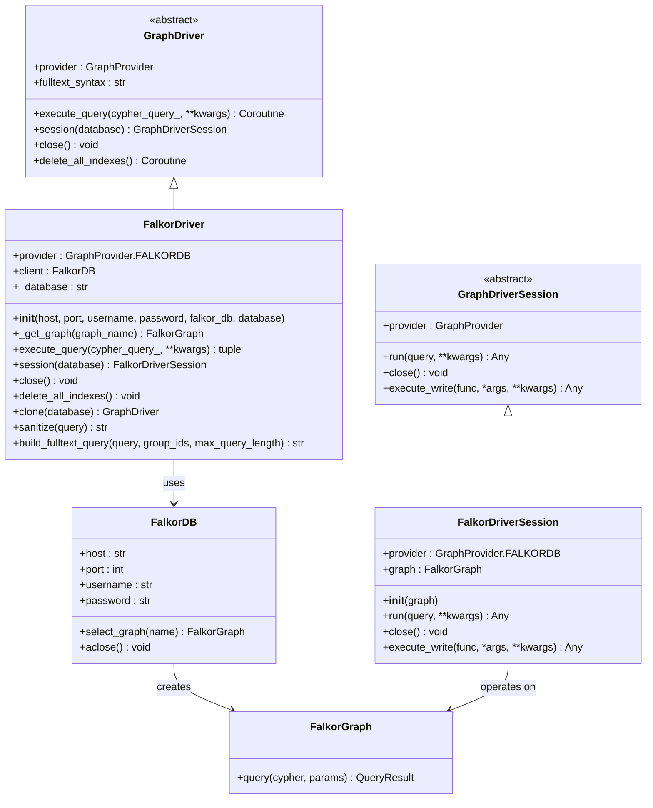
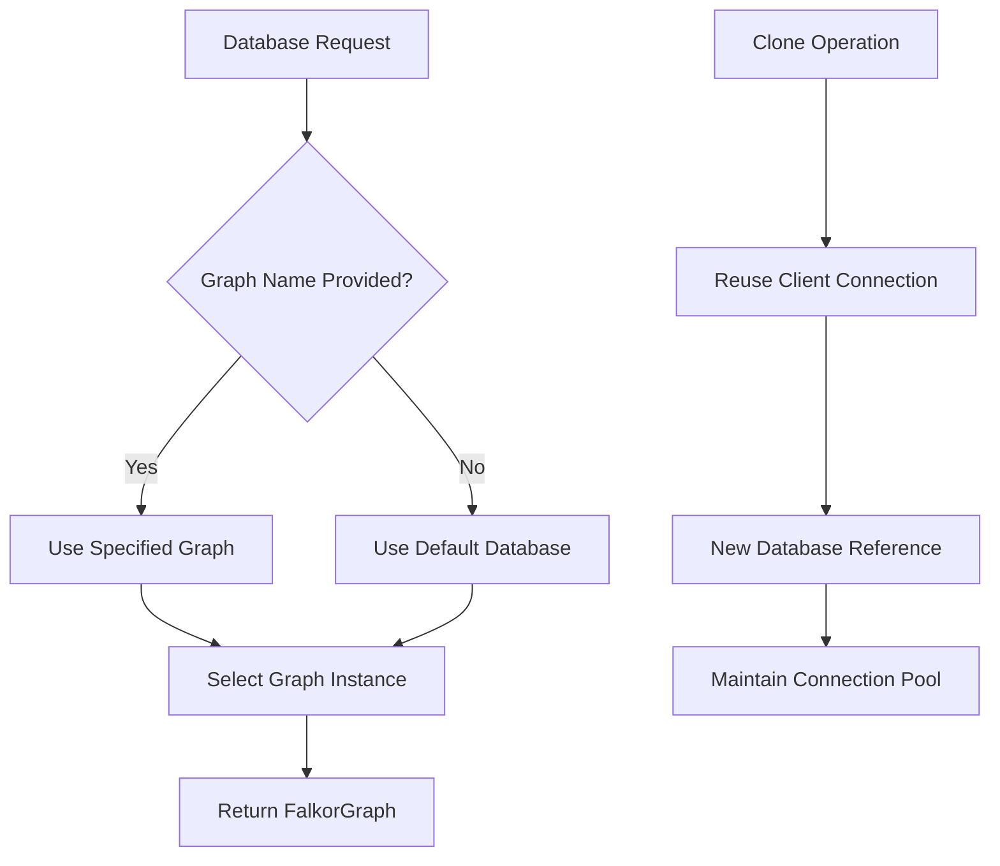
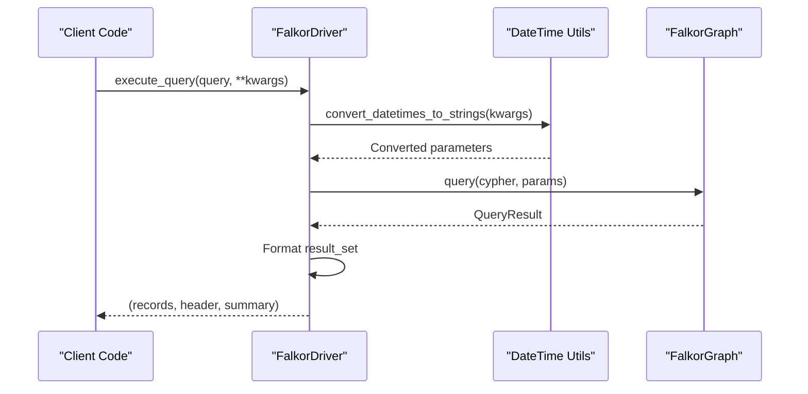
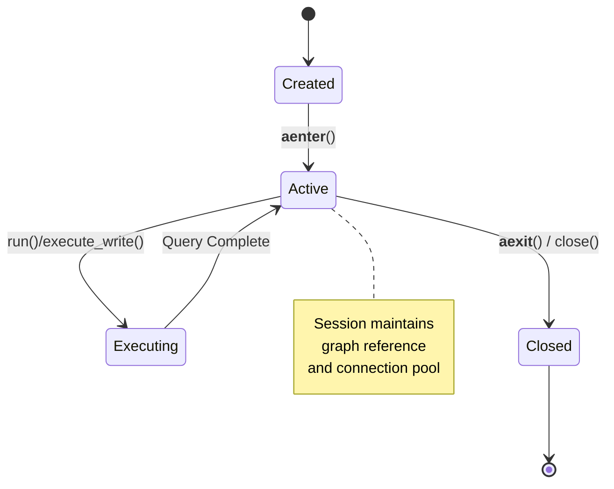
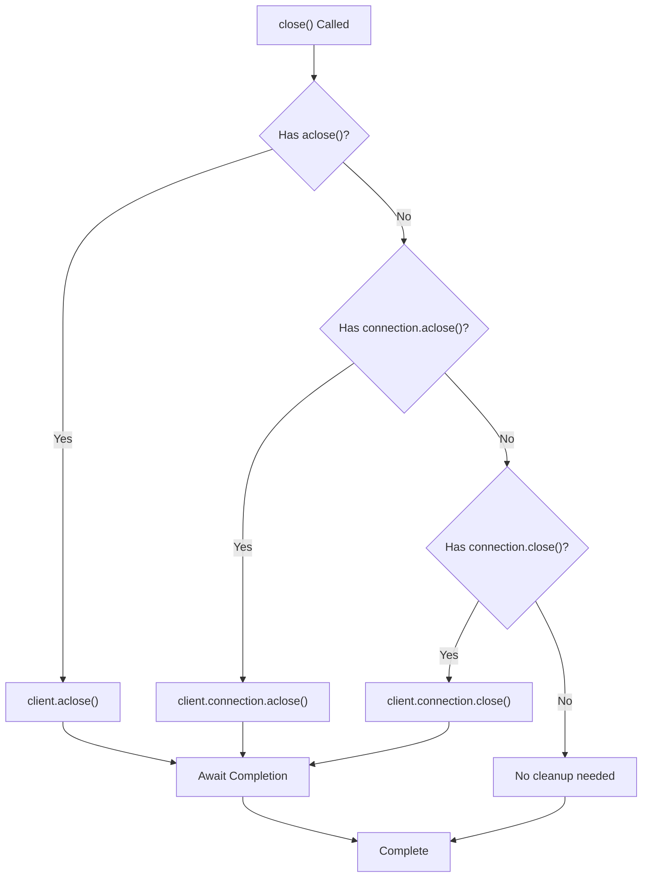
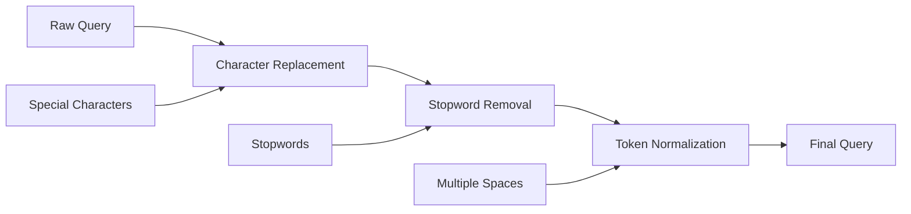
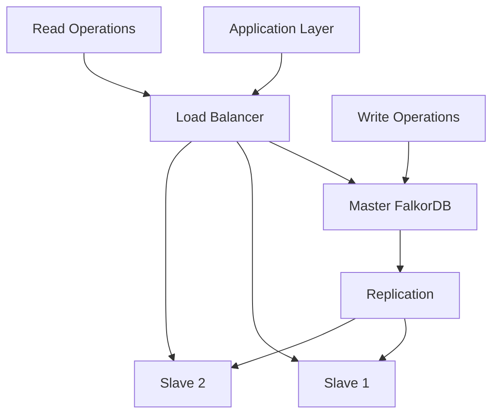
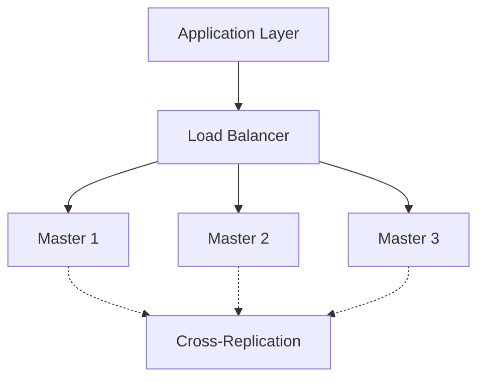

# FalkorDB Driver Documentation

<cite>
**Referenced Files in This Document**
- [falkordb_driver.py](file://graphiti_core/driver/falkordb_driver.py)
- [driver.py](file://graphiti_core/driver/driver.py)
- [datetime_utils.py](file://graphiti_core/utils/datetime_utils.py)
- [quickstart_falkordb.py](file://examples/quickstart/quickstart_falkordb.py)
- [test_falkordb_driver.py](file://tests/driver/test_falkordb_driver.py)
- [__init__.py](file://graphiti_core/driver/__init__.py)
</cite>

## Table of Contents
1. [Introduction](#introduction)
2. [Architecture Overview](#architecture-overview)
3. [Initialization and Connection Configuration](#initialization-and-connection-configuration)
4. [Core Components](#core-components)
5. [Cypher Query Execution](#cypher-query-execution)
6. [Session Management](#session-management)
7. [Resource Management](#resource-management)
8. [FalkorDB-Specific Features](#falkordb-specific-features)
9. [Performance Optimizations](#performance-optimizations)
10. [Configuration Examples](#configuration-examples)
11. [High-Availability Deployment](#high-availability-deployment)
12. [Monitoring and Health Checks](#monitoring-and-health-checks)
13. [Troubleshooting](#troubleshooting)

## Introduction

The FalkorDB Driver is a specialized implementation of the GraphDriver interface that enables seamless integration with FalkorDB, a multi-tenant graph database built on Redis. This driver serves as a bridge between the Graphiti framework and FalkorDB instances, providing robust connectivity, query execution capabilities, and session management.

FalkorDB is designed for high-performance graph operations with Redis's speed and scalability. The driver leverages the redis-py library for communication and implements comprehensive error handling, parameter binding, and result formatting specific to FalkorDB's Cypher query language and data model.

## Architecture Overview

The FalkorDB Driver follows a layered architecture that separates concerns between connection management, query execution, and result processing:



**Diagram sources**
- [falkordb_driver.py](file://graphiti_core/driver/falkordb_driver.py#L77-L110)
- [driver.py](file://graphiti_core/driver/driver.py#L49-L116)

**Section sources**
- [falkordb_driver.py](file://graphiti_core/driver/falkordb_driver.py#L112-L184)
- [driver.py](file://graphiti_core/driver/driver.py#L73-L116)

## Initialization and Connection Configuration

The FalkorDB Driver supports flexible initialization options to accommodate various deployment scenarios, from local development to production environments.

### Constructor Parameters

The driver accepts several configuration parameters during initialization:

| Parameter | Type | Default | Description |
|-----------|------|---------|-------------|
| `host` | str | `'localhost'` | FalkorDB server hostname or IP address |
| `port` | int | `6379` | Redis-compatible port for FalkorDB |
| `username` | str \| None | `None` | Authentication username (optional) |
| `password` | str \| None | `None` | Authentication password (optional) |
| `falkor_db` | FalkorDB \| None | `None` | Existing FalkorDB instance (alternative to individual parameters) |
| `database` | str | `'default_db'` | Default database name for multi-tenancy |

### Connection Options

The driver provides two primary ways to establish connections:

#### Option 1: Standard Connection Parameters
```python
# Local development connection
driver = FalkorDriver(
    host='localhost',
    port=6379,
    username=None,
    password=None,
    database='my_graph'
)
```

#### Option 2: Pre-configured FalkorDB Instance
```python
# Using existing FalkorDB instance
from falkordb.asyncio import FalkorDB
client = FalkorDB(host='remote-host', port=6379, username='user', password='pass')
driver = FalkorDriver(falkor_db=client, database='production_db')
```

### Environment Variable Configuration

The driver supports environment variable configuration for production deployments:

```python
import os
from graphiti_core.driver.falkordb_driver import FalkorDriver

# Environment-based configuration
falkor_host = os.environ.get('FALKORDB_HOST', 'localhost')
falkor_port = int(os.environ.get('FALKORDB_PORT', '6379'))
falkor_username = os.environ.get('FALKORDB_USERNAME', None)
falkor_password = os.environ.get('FALKORDB_PASSWORD', None)

driver = FalkorDriver(
    host=falkor_host,
    port=falkor_port,
    username=falkor_username,
    password=falkor_password,
    database='default_db'
)
```

**Section sources**
- [falkordb_driver.py](file://graphiti_core/driver/falkordb_driver.py#L116-L140)
- [quickstart_falkordb.py](file://examples/quickstart/quickstart_falkordb.py#L58-L62)

## Core Components

### FalkorDriver Class

The main driver class encapsulates connection management and query execution logic. It inherits from the abstract GraphDriver class and implements all required methods for the Graphiti framework.

Key responsibilities include:
- Connection lifecycle management
- Query parameter preprocessing and validation
- Result formatting and normalization
- Error handling and logging
- Multi-database support through cloning

### FalkorDriverSession Class

The session class provides transactional capabilities and maintains state during query execution. It implements the GraphDriverSession interface with FalkorDB-specific optimizations.

Features:
- Asynchronous context manager support
- Automatic parameter conversion for datetime objects
- Batch query execution for multiple Cypher statements
- Session-scoped graph operations

### Graph Selection and Multi-Tenancy

FalkorDB's multi-tenant architecture is supported through the `_get_graph` method, which allows switching between different graph databases within the same FalkorDB instance.



**Diagram sources**
- [falkordb_driver.py](file://graphiti_core/driver/falkordb_driver.py#L143-L147)

**Section sources**
- [falkordb_driver.py](file://graphiti_core/driver/falkordb_driver.py#L77-L110)
- [falkordb_driver.py](file://graphiti_core/driver/falkordb_driver.py#L112-L184)

## Cypher Query Execution

The driver handles Cypher query execution with comprehensive parameter binding, result processing, and error management.

### Parameter Binding and Validation

The driver automatically converts datetime objects to ISO string format, ensuring compatibility with FalkorDB's data type requirements:



**Diagram sources**
- [falkordb_driver.py](file://graphiti_core/driver/falkordb_driver.py#L149-L180)
- [datetime_utils.py](file://graphiti_core/utils/datetime_utils.py#L45-L55)

### Query Execution Patterns

The driver supports multiple query execution patterns:

#### Single Query Execution
```python
# Simple Cypher query with parameters
result = await driver.execute_query(
    'MATCH (n:Person {name: $name}) RETURN n.age',
    name='Alice'
)
```

#### Batch Query Execution
```python
# Multiple queries executed sequentially
queries = [
    ('CREATE (n:Person {name: $name})', {'name': 'Bob'}),
    ('CREATE (n:Person {name: $name})', {'name': 'Charlie'})
]
await session.run(queries)
```

### Result Processing and Formatting

The driver transforms FalkorDB's native result format into the standardized format expected by Graphiti:

| Native Format | Graphiti Format |
|---------------|-----------------|
| `result.header` | List of column names |
| `result.result_set` | List of value arrays |
| Transformed | List of dictionaries |

### Error Handling

The driver implements robust error handling with specific treatment for common FalkorDB scenarios:

- **Index Already Exists**: Logged as informational, returns None
- **Query Syntax Errors**: Propagated with detailed context
- **Connection Issues**: Handled by underlying redis-py library
- **Parameter Validation**: Automatic conversion of unsupported types

**Section sources**
- [falkordb_driver.py](file://graphiti_core/driver/falkordb_driver.py#L149-L180)
- [test_falkordb_driver.py](file://tests/driver/test_falkordb_driver.py#L95-L162)

## Session Management

The driver implements sophisticated session management to optimize connection reuse and provide transactional capabilities.

### Session Lifecycle



**Diagram sources**
- [falkordb_driver.py](file://graphiti_core/driver/falkordb_driver.py#L77-L110)

### Connection Reuse Patterns

The driver supports multiple connection reuse patterns:

#### Pattern 1: Single Session Per Query
```python
async with driver.session() as session:
    result = await session.run('MATCH (n) RETURN n')
```

#### Pattern 2: Long-lived Sessions
```python
session = driver.session()
try:
    await session.run('CREATE (n:Person {name: $name})', name='Alice')
    await session.run('CREATE (n:Person {name: $name})', name='Bob')
finally:
    await session.close()
```

#### Pattern 3: Session Cloning
```python
# Clone session for different database
prod_session = driver.session('production_db')
dev_session = driver.session('development_db')
```

### Transaction Support

The driver provides transactional capabilities through the `execute_write` method, which wraps write operations in a transaction context:

```python
async def update_person(session, person_id, new_age):
    await session.run(
        'MATCH (p:Person {id: $id}) SET p.age = $age',
        id=person_id, age=new_age
    )

# Execute within transaction context
await session.execute_write(update_person, person_id, new_age)
```

**Section sources**
- [falkordb_driver.py](file://graphiti_core/driver/falkordb_driver.py#L77-L110)
- [test_falkordb_driver.py](file://tests/driver/test_falkordb_driver.py#L243-L285)

## Resource Management

The driver implements comprehensive resource management to ensure proper cleanup and prevent resource leaks.

### Connection Cleanup

The `close` method handles graceful shutdown of all resources:



**Diagram sources**
- [falkordb_driver.py](file://graphiti_core/driver/falkordb_driver.py#L185-L193)

### Index Management

The driver provides automated index management through the `delete_all_indexes` method:

#### Index Deletion Process
1. **Query Current Indexes**: Execute `CALL db.indexes()`
2. **Parse Results**: Extract label, field, and index type information
3. **Generate Drop Commands**: Create appropriate DROP statements
4. **Execute Concurrently**: Use asyncio.gather for parallel execution

#### Supported Index Types
- **Range Indexes**: `DROP INDEX ON :Label(field)`
- **Fulltext Indexes**: 
  - Nodes: `DROP FULLTEXT INDEX FOR (n:Label) ON (n.field)`
  - Relationships: `DROP FULLTEXT INDEX FOR ()-[r:Label]-() ON (r.field)`

### Resource Monitoring

The driver exposes connection state through various methods:
- Connection status via underlying redis-py library
- Query execution metrics through logging
- Session lifecycle tracking

**Section sources**
- [falkordb_driver.py](file://graphiti_core/driver/falkordb_driver.py#L185-L225)

## FalkorDB-Specific Features

### Fulltext Query Building

The driver implements specialized fulltext query construction for FalkorDB's RedisSearch syntax:

#### Query Syntax Rules
- **Field Queries**: Use `@` prefix: `@field:value`
- **Multiple Values**: Use OR syntax: `(@field:value1|value2)`
- **Text Search**: No prefix needed for content fields
- **Group Filtering**: Combine with space: `(@group_id:value) (text)`
- **Stopword Removal**: Automatic filtering of common words

#### Sanitization Process
The driver sanitizes queries by replacing special characters with spaces and removing stopwords:



**Diagram sources**
- [falkordb_driver.py](file://graphiti_core/driver/falkordb_driver.py#L235-L309)

### Tokenization Rules

FalkorDB uses specific tokenization rules that the driver handles automatically:

| Character Category | Replacement |
|-------------------|-------------|
| Punctuation | Space (`' '`) |
| Brackets | Space (`' '`) |
| Quotes | Space (`' '`) |
| Symbols | Space (`' '`) |
| Operators | Space (`' '`) |

### Special Considerations

#### DateTime Handling
FalkorDB doesn't support datetime objects directly, requiring conversion to ISO strings for all parameterized queries.

#### Label Set Limitations
Unlike Neo4j, FalkorDB doesn't support parameterized label sets, requiring query string construction for dynamic labels.

#### Error Messages
The driver recognizes and handles FalkorDB-specific error messages, particularly for index management operations.

**Section sources**
- [falkordb_driver.py](file://graphiti_core/driver/falkordb_driver.py#L235-L309)
- [falkordb_driver.py](file://graphiti_core/driver/falkordb_driver.py#L155-L163)

## Performance Optimizations

### Connection Pooling

The driver leverages redis-py's built-in connection pooling for optimal performance:

- **Automatic Pool Management**: Connection pools are managed by the underlying redis-py library
- **Thread Safety**: Thread-safe operations through async/await patterns
- **Resource Efficiency**: Reuse connections across multiple queries

### Query Optimization

#### Parameter Preprocessing
- **Lazy Conversion**: Datetime conversion occurs only when needed
- **Immutable Operations**: Parameter dictionaries are processed without modification
- **Batch Processing**: Multiple queries are handled efficiently in sequence

#### Result Processing
- **Streaming Results**: Large result sets are processed incrementally
- **Memory Efficiency**: Minimal intermediate data structures
- **Type Preservation**: Original data types are maintained where possible

### Concurrency Support

The driver is designed for high-concurrency environments:
- **Async/Await**: Non-blocking operations throughout the stack
- **Parallel Execution**: Support for concurrent query execution
- **Connection Reuse**: Efficient sharing of database connections

### Performance Monitoring

Key performance indicators tracked by the driver:
- **Query Execution Time**: Through logging and timing mechanisms
- **Connection Pool Utilization**: Via redis-py metrics
- **Error Rates**: Comprehensive error logging and categorization

**Section sources**
- [falkordb_driver.py](file://graphiti_core/driver/falkordb_driver.py#L149-L180)

## Configuration Examples

### Local Development Setup

```python
# Basic local connection
from graphiti_core.driver.falkordb_driver import FalkorDriver

# Using default localhost:6379
driver = FalkorDriver()

# With custom database
driver = FalkorDriver(database='development')
```

### Remote Production Connection

```python
# Production environment configuration
import os
from graphiti_core.driver.falkordb_driver import FalkorDriver

# Environment variables
FALKORDB_HOST = os.environ.get('FALKORDB_HOST', 'localhost')
FALKORDB_PORT = int(os.environ.get('FALKORDB_PORT', '6379'))
FALKORDB_USERNAME = os.environ.get('FALKORDB_USERNAME', None)
FALKORDB_PASSWORD = os.environ.get('FALKORDB_PASSWORD', None)

# Secure production connection
driver = FalkorDriver(
    host=FALKORDB_HOST,
    port=FALKORDB_PORT,
    username=FALKORDB_USERNAME,
    password=FALKORDB_PASSWORD,
    database='production'
)
```

### Docker Container Connection

```python
# Connecting to FalkorDB Docker container
driver = FalkorDriver(
    host='localhost',
    port=6379,
    database='graphiti_container'
)

# Verify connection
import asyncio
async def test_connection():
    try:
        result = await driver.execute_query('RETURN 1 as test')
        print("Connection successful:", result)
    except Exception as e:
        print("Connection failed:", e)

asyncio.run(test_connection())
```

### High-Availability Configuration

```python
# HA setup with fallback servers
import random
from graphiti_core.driver.falkordb_driver import FalkorDriver

class HA_FalkorDriver:
    def __init__(self, servers):
        self.servers = servers
        self.current_index = 0
        
    async def execute_query(self, query, **kwargs):
        for _ in range(len(self.servers)):
            server = self.servers[self.current_index]
            try:
                driver = FalkorDriver(**server)
                result = await driver.execute_query(query, **kwargs)
                await driver.close()
                return result
            except Exception as e:
                print(f"Server {server['host']} failed: {e}")
                self.current_index = (self.current_index + 1) % len(self.servers)
        
        raise ConnectionError("All servers unavailable")

# Usage
ha_driver = HA_FalkorDriver([
    {'host': 'primary-db.example.com', 'port': 6379},
    {'host': 'secondary-db1.example.com', 'port': 6379},
    {'host': 'secondary-db2.example.com', 'port': 6379}
])
```

**Section sources**
- [quickstart_falkordb.py](file://examples/quickstart/quickstart_falkordb.py#L58-L78)
- [test_falkordb_driver.py](file://tests/driver/test_falkordb_driver.py#L369-L392)

## High-Availability Deployment

### Deployment Architectures

#### Master-Slave Replication


#### Multi-Master Setup


### Configuration Requirements

#### Environment Variables
```bash
# Primary FalkorDB instance
export FALKORDB_HOST="primary-db.internal"
export FALKORDB_PORT="6379"
export FALKORDB_DATABASE="production"

# Backup instances
export FALKORDB_BACKUP_HOST="backup-db.internal"
export FALKORDB_BACKUP_PORT="6379"

# Authentication
export FALKORDB_USERNAME="graphiti_user"
export FALKORDB_PASSWORD="secure_password"
```

#### Connection Pool Configuration
```python
# Advanced connection configuration
from falkordb.asyncio import FalkorDB

# Custom connection pool settings
client = FalkorDB(
    host='primary-db.internal',
    port=6379,
    username='graphiti_user',
    password='secure_password',
    max_connections=20,
    timeout=30
)

driver = FalkorDriver(falkor_db=client, database='production')
```

### Failover Mechanisms

#### Automatic Failover Implementation
```python
class FailoverFalkorDriver:
    def __init__(self, primary_config, backup_configs):
        self.primary_config = primary_config
        self.backup_configs = backup_configs
        self.current_config = primary_config
        self.failover_count = 0
        
    async def execute_query(self, query, **kwargs):
        try:
            # Try primary first
            driver = FalkorDriver(**self.current_config)
            result = await driver.execute_query(query, **kwargs)
            await driver.close()
            return result
            
        except Exception as e:
            # Attempt failover
            if self.failover_count < len(self.backup_configs):
                self.current_config = self.backup_configs[self.failover_count]
                self.failover_count += 1
                
                # Retry with backup
                driver = FalkorDriver(**self.current_config)
                result = await driver.execute_query(query, **kwargs)
                await driver.close()
                return result
                
            raise ConnectionError("All failover attempts failed") from e
```

### Monitoring and Health Checks

#### Health Check Implementation
```python
async def health_check(driver):
    """Perform comprehensive health check"""
    try:
        # Test basic connectivity
        result = await driver.execute_query('RETURN 1 AS health')
        
        # Check database availability
        await driver.execute_query('CALL db.indexes()', timeout=5)
        
        return True, "Healthy"
        
    except Exception as e:
        return False, f"Health check failed: {str(e)}"
```

**Section sources**
- [falkordb_driver.py](file://graphiti_core/driver/falkordb_driver.py#L116-L140)

## Monitoring and Health Checks

### Connection Metrics

The driver provides several mechanisms for monitoring connection health and performance:

#### Built-in Logging
```python
import logging
from graphiti_core.driver.falkordb_driver import FalkorDriver

# Enable debug logging
logging.basicConfig(level=logging.DEBUG)
logger = logging.getLogger('graphiti_core.driver.falkordb_driver')

driver = FalkorDriver(host='localhost', port=6379)
```

#### Custom Metrics Collection
```python
import time
from functools import wraps

def monitor_query_execution(func):
    @wraps(func)
    async def wrapper(self, query, **kwargs):
        start_time = time.time()
        try:
            result = await func(self, query, **kwargs)
            duration = time.time() - start_time
            logger.info(f"Query executed in {duration:.2f}s: {query[:50]}...")
            return result
        except Exception as e:
            duration = time.time() - start_time
            logger.error(f"Query failed after {duration:.2f}s: {e}")
            raise
    return wrapper

# Apply monitoring
FalkorDriver.execute_query = monitor_query_execution(FalkorDriver.execute_query)
```

### Performance Monitoring

#### Query Performance Tracking
```python
class PerformanceMonitor:
    def __init__(self):
        self.query_times = []
        self.error_count = 0
        
    def track_query(self, query, duration, success):
        self.query_times.append((time.time(), duration, success))
        
        if not success:
            self.error_count += 1
            
    def get_metrics(self):
        avg_time = sum(t for _, t, _ in self.query_times[-100:]) / min(100, len(self.query_times))
        error_rate = self.error_count / len(self.query_times) if self.query_times else 0
        
        return {
            'avg_query_time': avg_time,
            'error_rate': error_rate,
            'total_queries': len(self.query_times)
        }
```

### Health Check Endpoints

#### Application-Level Health Checks
```python
async def application_health_check(driver):
    """Comprehensive health check for application monitoring"""
    checks = {}
    
    # Connection health
    try:
        await driver.execute_query('RETURN 1')
        checks['connection'] = 'healthy'
    except Exception as e:
        checks['connection'] = f'unhealthy: {str(e)}'
    
    # Database health
    try:
        result = await driver.execute_query('CALL db.indexes()')
        checks['indexes'] = f'found {len(result[0])} indexes'
    except Exception as e:
        checks['indexes'] = f'unhealthy: {str(e)}'
    
    return checks
```

### Alerting Configuration

#### Threshold-Based Alerts
```python
class AlertManager:
    def __init__(self):
        self.alert_thresholds = {
            'query_time': 5.0,  # seconds
            'error_rate': 0.1,  # 10%
            'connection_failures': 5
        }
        self.failure_count = 0
        
    def check_alerts(self, metrics):
        alerts = []
        
        if metrics['avg_query_time'] > self.alert_thresholds['query_time']:
            alerts.append(f"Slow queries detected: {metrics['avg_query_time']:.2f}s")
            
        if metrics['error_rate'] > self.alert_thresholds['error_rate']:
            alerts.append(f"High error rate: {metrics['error_rate']:.2%}")
            
        self.failure_count += 1 if metrics['error_rate'] > 0 else 0
        
        if self.failure_count > self.alert_thresholds['connection_failures']:
            alerts.append(f"Too many connection failures: {self.failure_count}")
            
        return alerts
```

**Section sources**
- [falkordb_driver.py](file://graphiti_core/driver/falkordb_driver.py#L185-L193)

## Troubleshooting

### Common Issues and Solutions

#### Connection Problems

**Issue**: Connection refused or timeout
```python
# Diagnostic steps
import asyncio
from graphiti_core.driver.falkordb_driver import FalkorDriver

async def diagnose_connection():
    try:
        driver = FalkorDriver(host='localhost', port=6379)
        result = await driver.execute_query('RETURN 1')
        print("Connection successful")
        await driver.close()
    except Exception as e:
        print(f"Connection failed: {e}")
        # Check FalkorDB service status
        # Verify firewall rules
        # Confirm port accessibility

asyncio.run(diagnose_connection())
```

**Issue**: Authentication failures
```python
# Verify credentials
driver = FalkorDriver(
    host='localhost',
    port=6379,
    username='your_username',
    password='your_password'
)

# Test with minimal query
result = await driver.execute_query('RETURN 1')
```

#### Query Execution Issues

**Issue**: Index already exists errors
```python
# These are informational and handled automatically
# Look for logs with "Index already exists" message
# No action required unless excessive warnings appear
```

**Issue**: Parameter type mismatches
```python
# Ensure datetime objects are properly converted
from datetime import datetime, timezone

# Correct: datetime objects are automatically converted
await driver.execute_query(
    'CREATE (n:Person {born: $born})',
    born=datetime.now(timezone.utc)
)

# Incorrect: raw datetime objects
await driver.execute_query(
    'CREATE (n:Person {born: $born})',
    born=datetime.now()  # May cause issues
)
```

#### Performance Issues

**Issue**: Slow query execution
```python
# Enable query profiling
import time

async def profile_query(driver, query, **params):
    start = time.time()
    try:
        result = await driver.execute_query(query, **params)
        duration = time.time() - start
        print(f"Query completed in {duration:.2f} seconds")
        return result
    except Exception as e:
        duration = time.time() - start
        print(f"Query failed after {duration:.2f} seconds: {e}")
        raise
```

### Debugging Tools

#### Query Tracing
```python
class QueryTracer:
    def __init__(self):
        self.query_log = []
        
    def log_query(self, query, params):
        self.query_log.append({
            'timestamp': time.time(),
            'query': query,
            'params': params
        })
        
    def get_recent_queries(self, count=10):
        return self.query_log[-count:]
```

#### Connection State Inspection
```python
async def inspect_connection_state(driver):
    """Inspect internal connection state"""
    print(f"Provider: {driver.provider}")
    print(f"Database: {driver._database}")
    print(f"Client type: {type(driver.client)}")
    
    # Check if client has connection attributes
    if hasattr(driver.client, 'connection'):
        conn = driver.client.connection
        print(f"Connection type: {type(conn)}")
        print(f"Has aclose: {hasattr(conn, 'aclose')}")
        print(f"Has close: {hasattr(conn, 'close')}")
```

### Error Recovery Strategies

#### Graceful Degradation
```python
class RobustFalkorDriver:
    def __init__(self, primary_config, fallback_config):
        self.primary = FalkorDriver(**primary_config)
        self.fallback = FalkorDriver(**fallback_config)
        self.use_primary = True
        
    async def execute_query(self, query, **kwargs):
        try:
            if self.use_primary:
                result = await self.primary.execute_query(query, **kwargs)
                return result
        except Exception as e:
            logger.warning(f"Primary connection failed: {e}")
            self.use_primary = False
            
        # Fall back to secondary
        try:
            result = await self.fallback.execute_query(query, **kwargs)
            logger.info("Query executed using fallback connection")
            return result
        except Exception as e:
            logger.error(f"Fallback connection failed: {e}")
            raise
```

### Best Practices

#### Connection Management
1. **Always close connections** when finished
2. **Use context managers** for automatic cleanup
3. **Implement retry logic** for transient failures
4. **Monitor connection pool usage** in production

#### Query Optimization
1. **Use parameterized queries** for better performance
2. **Avoid dynamic labels** when possible
3. **Implement proper indexing** for frequently queried fields
4. **Batch related operations** when feasible

#### Security Considerations
1. **Use environment variables** for sensitive credentials
2. **Implement connection timeouts** to prevent hanging
3. **Validate input parameters** before query execution
4. **Monitor for SQL injection attempts** (though Cypher is safer)

**Section sources**
- [falkordb_driver.py](file://graphiti_core/driver/falkordb_driver.py#L155-L163)
- [test_falkordb_driver.py](file://tests/driver/test_falkordb_driver.py#L117-L141)