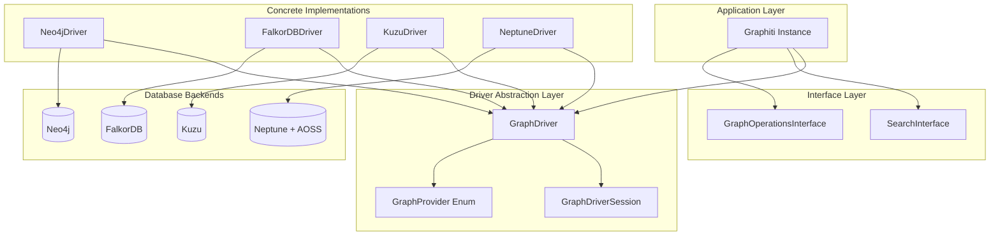
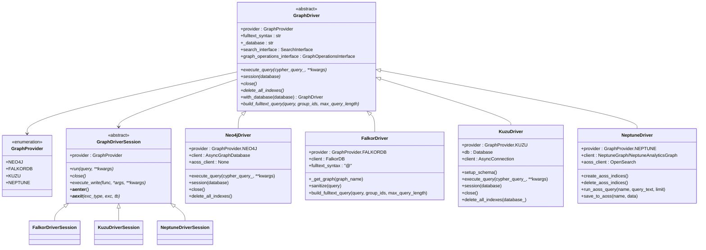
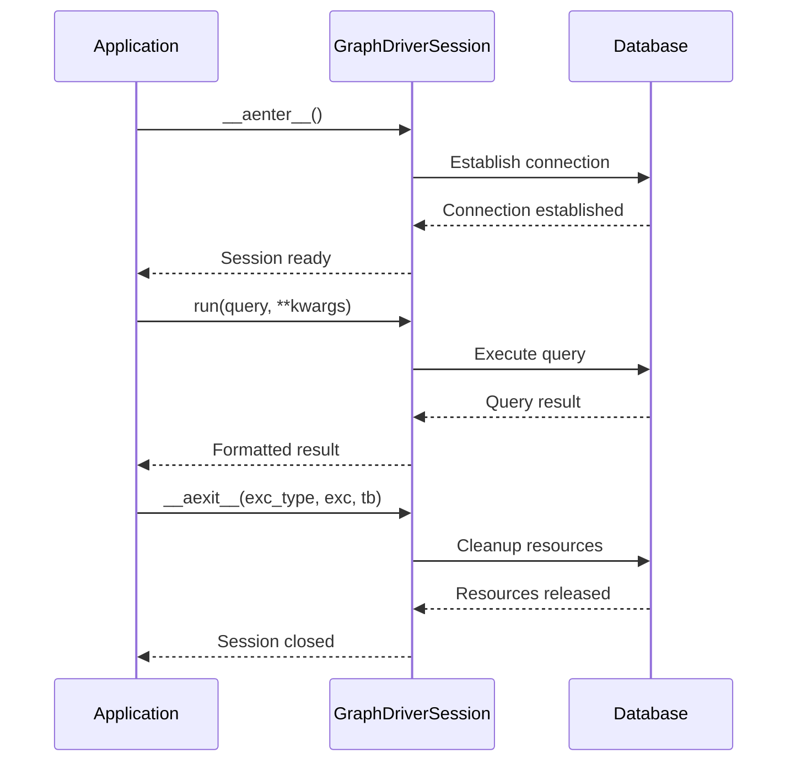
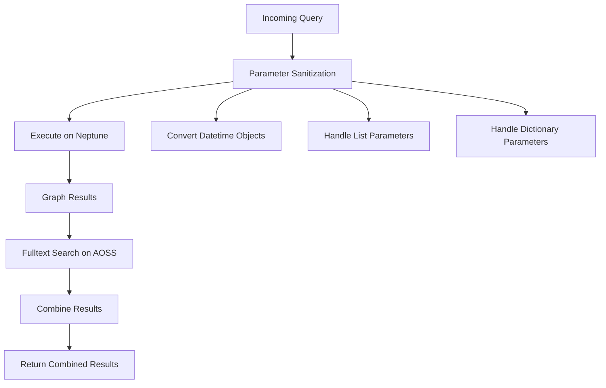

# Graph Driver Interface

<cite>
**Referenced Files in This Document**
- [graphiti_core/driver/driver.py](file://graphiti_core/driver/driver.py)
- [graphiti_core/driver/search_interface/search_interface.py](file://graphiti_core/driver/search_interface/search_interface.py)
- [graphiti_core/driver/graph_operations/graph_operations.py](file://graphiti_core/driver/graph_operations/graph_operations.py)
- [graphiti_core/driver/neo4j_driver.py](file://graphiti_core/driver/neo4j_driver.py)
- [graphiti_core/driver/falkordb_driver.py](file://graphiti_core/driver/falkordb_driver.py)
- [graphiti_core/driver/kuzu_driver.py](file://graphiti_core/driver/kuzu_driver.py)
- [graphiti_core/driver/neptune_driver.py](file://graphiti_core/driver/neptune_driver.py)
- [graphiti_core/graphiti.py](file://graphiti_core/graphiti.py)
- [examples/quickstart/quickstart_neo4j.py](file://examples/quickstart/quickstart_neo4j.py)
- [examples/quickstart/quickstart_falkordb.py](file://examples/quickstart/quickstart_falkordb.py)
- [examples/quickstart/quickstart_neptune.py](file://examples/quickstart/quickstart_neptune.py)
</cite>

## Table of Contents
1. [Introduction](#introduction)
2. [Architecture Overview](#architecture-overview)
3. [Core Components](#core-components)
4. [GraphProvider Enum](#graphprovider-enum)
5. [Abstract Base Classes](#abstract-base-classes)
6. [Concrete Driver Implementations](#concrete-driver-implementations)
7. [Search Interface](#search-interface)
8. [Graph Operations Interface](#graph-operations-interface)
9. [Environment Variables](#environment-variables)
10. [Usage Examples](#usage-examples)
11. [Best Practices](#best-practices)

## Introduction

The Graph Driver Interface is a comprehensive abstraction layer that enables Graphiti to work with multiple graph database backends through a unified API. This system provides a consistent interface for database operations while accommodating the unique characteristics and capabilities of each supported database technology.

The driver architecture consists of abstract base classes that define the contract for all database implementations, concrete driver classes that handle specific database technologies, and specialized interfaces for search and graph operations. This design allows Graphiti to seamlessly switch between different graph databases without requiring changes to the application logic.

## Architecture Overview

The Graph Driver system follows a layered architecture with clear separation of concerns:



**Diagram sources**
- [graphiti_core/driver/driver.py](file://graphiti_core/driver/driver.py#L42-L116)
- [graphiti_core/driver/neo4j_driver.py](file://graphiti_core/driver/neo4j_driver.py#L29-L75)
- [graphiti_core/driver/falkordb_driver.py](file://graphiti_core/driver/falkordb_driver.py#L77-L309)
- [graphiti_core/driver/kuzu_driver.py](file://graphiti_core/driver/kuzu_driver.py#L93-L177)
- [graphiti_core/driver/neptune_driver.py](file://graphiti_core/driver/neptune_driver.py#L109-L300)

## Core Components

The Graph Driver system consists of several key components that work together to provide database abstraction:

### Component Relationships



**Diagram sources**
- [graphiti_core/driver/driver.py](file://graphiti_core/driver/driver.py#L42-L116)
- [graphiti_core/driver/neo4j_driver.py](file://graphiti_core/driver/neo4j_driver.py#L29-L75)
- [graphiti_core/driver/falkordb_driver.py](file://graphiti_core/driver/falkordb_driver.py#L77-L309)
- [graphiti_core/driver/kuzu_driver.py](file://graphiti_core/driver/kuzu_driver.py#L93-L177)
- [graphiti_core/driver/neptune_driver.py](file://graphiti_core/driver/neptune_driver.py#L109-L300)

**Section sources**
- [graphiti_core/driver/driver.py](file://graphiti_core/driver/driver.py#L1-L116)
- [graphiti_core/driver/neo4j_driver.py](file://graphiti_core/driver/neo4j_driver.py#L1-L75)
- [graphiti_core/driver/falkordb_driver.py](file://graphiti_core/driver/falkordb_driver.py#L1-L309)
- [graphiti_core/driver/kuzu_driver.py](file://graphiti_core/driver/kuzu_driver.py#L1-L177)
- [graphiti_core/driver/neptune_driver.py](file://graphiti_core/driver/neptune_driver.py#L1-L300)

## GraphProvider Enum

The `GraphProvider` enum serves as a database identifier and type discriminator for the driver system. It defines the supported graph database backends and ensures type safety across the system.

### Available Providers

| Provider | Description | Use Case |
|----------|-------------|----------|
| `NEO4J` | Neo4j graph database | Production enterprise deployments, complex graph analytics |
| `FALKORDB` | FalkorDB multi-tenant graph database | High-performance in-memory graph processing, cloud-native deployments |
| `KUZU` | Kuzu embedded graph database | Lightweight applications, development/testing, offline processing |
| `NEPTUNE` | Amazon Neptune with OpenSearch | AWS cloud deployments, managed graph services |

**Section sources**
- [graphiti_core/driver/driver.py](file://graphiti_core/driver/driver.py#L42-L47)

## Abstract Base Classes

### GraphDriver

The `GraphDriver` abstract base class defines the core interface that all database implementations must provide. It establishes the fundamental contract for database operations and session management.

#### Key Methods

| Method | Purpose | Parameters | Return Type |
|--------|---------|------------|-------------|
| `execute_query()` | Execute Cypher queries against the database | `cypher_query_: str, **kwargs: Any` | `Coroutine` |
| `session()` | Create a new database session | `database: str \| None = None` | `GraphDriverSession` |
| `close()` | Close the database connection | None | `None` |
| `delete_all_indexes()` | Remove all database indexes | None | `Coroutine` |
| `with_database()` | Clone driver with different database | `database: str` | `GraphDriver` |
| `build_fulltext_query()` | Build database-specific fulltext queries | `query: str, group_ids: list[str] \| None, max_query_length: int = 128` | `str` |

#### Properties

| Property | Type | Description |
|----------|------|-------------|
| `provider` | `GraphProvider` | Database type identifier |
| `fulltext_syntax` | `str` | Database-specific fulltext query prefix |
| `_database` | `str` | Default database name |
| `search_interface` | `SearchInterface \| None` | Search functionality implementation |
| `graph_operations_interface` | `GraphOperationsInterface \| None` | Graph mutation operations |

**Section sources**
- [graphiti_core/driver/driver.py](file://graphiti_core/driver/driver.py#L73-L116)

### GraphDriverSession

The `GraphDriverSession` abstract base class manages database sessions and provides asynchronous operations for query execution and transaction handling.

#### Key Methods

| Method | Purpose | Parameters | Return Type |
|--------|---------|------------|-------------|
| `run()` | Execute a query within the session | `query: str, **kwargs: Any` | `Any` |
| `close()` | Close the session | None | `None` |
| `execute_write()` | Execute write operations | `func, *args, **kwargs` | `Any` |

#### Lifecycle Management



**Diagram sources**
- [graphiti_core/driver/driver.py](file://graphiti_core/driver/driver.py#L49-L71)

**Section sources**
- [graphiti_core/driver/driver.py](file://graphiti_core/driver/driver.py#L49-L71)

## Concrete Driver Implementations

Each concrete driver implementation handles the specific requirements and capabilities of its respective database technology.

### Neo4jDriver

The Neo4jDriver provides connectivity to Neo4j graph databases with support for both standalone and cluster deployments.

#### Connection Parameters

| Parameter | Type | Required | Description |
|-----------|------|----------|-------------|
| `uri` | `str` | Yes | Neo4j connection URI (e.g., `bolt://localhost:7687`) |
| `user` | `str \| None` | No | Authentication username |
| `password` | `str \| None` | No | Authentication password |
| `database` | `str` | No | Default database name (defaults to `'neo4j'`) |

#### Features and Behaviors

- **Fulltext Syntax**: Uses Neo4j's native fulltext query syntax (no prefix required)
- **Session Management**: Supports database switching through the `with_database()` method
- **Error Handling**: Comprehensive logging and error reporting for query failures
- **Async Operations**: Built on Neo4j's async Python driver

#### Implementation Details

The Neo4jDriver integrates with Neo4j's native async driver and provides automatic parameter handling for database selection. It supports both local and remote Neo4j deployments, including Neo4j Aura and Neo4j AuraDS.

**Section sources**
- [graphiti_core/driver/neo4j_driver.py](file://graphiti_core/driver/neo4j_driver.py#L29-L75)

### FalkorDBDriver

The FalkorDBDriver enables integration with FalkorDB, a high-performance multi-tenant graph database built on Redis.

#### Connection Parameters

| Parameter | Type | Required | Description |
|-----------|------|----------|-------------|
| `host` | `str` | No | FalkorDB server hostname (defaults to `'localhost'`) |
| `port` | `int` | No | FalkorDB server port (defaults to `6379`) |
| `username` | `str \| None` | No | Authentication username |
| `password` | `str \| None` | No | Authentication password |
| `falkor_db` | `FalkorDB \| None` | No | Existing FalkorDB instance |
| `database` | `str` | No | Default graph name (defaults to `'default_db'`) |

#### Unique Features

- **Fulltext Syntax**: Uses RedisSearch-style syntax with `@` prefix (`@field:value`)
- **Text Sanitization**: Automatic removal of special characters and stopwords
- **Multi-tenancy**: Supports multiple graphs within a single FalkorDB instance
- **Performance**: Optimized for high-throughput graph operations

#### Fulltext Query Building

The FalkorDBDriver implements sophisticated fulltext query building with:

- **Stopword Removal**: Filters common English stopwords from queries
- **Character Sanitization**: Converts special characters to whitespace
- **Query Length Limits**: Prevents overly long queries that could impact performance
- **Group Filtering**: Supports filtering by group IDs for multi-tenant scenarios

**Section sources**
- [graphiti_core/driver/falkordb_driver.py](file://graphiti_core/driver/falkordb_driver.py#L112-L309)

### KuzuDriver

The KuzuDriver provides integration with Kuzu, an embedded graph database that requires explicit schema definition.

#### Connection Parameters

| Parameter | Type | Required | Description |
|-----------|------|----------|-------------|
| `db` | `str` | No | Database file path (defaults to `':memory:'`) |
| `max_concurrent_queries` | `int` | No | Maximum concurrent query limit (defaults to `1`) |

#### Schema Requirements

Kuzu requires explicit schema definition through the `SCHEMA_QUERIES` constant:

- **Entity Nodes**: Store named entities with embeddings and attributes
- **Episodic Nodes**: Store temporal episode information
- **Community Nodes**: Store community detection results
- **Relationship Tables**: Define edge types and their properties

#### Special Considerations

- **Schema Management**: Automatically creates and manages database schema
- **Memory vs. Disk**: Can operate in-memory or persist to disk
- **Concurrent Queries**: Configurable concurrency limits for performance tuning
- **No Index Deletion**: Does not support dynamic index deletion (no-op implementation)

**Section sources**
- [graphiti_core/driver/kuzu_driver.py](file://graphiti_core/driver/kuzu_driver.py#L93-L177)

### NeptuneDriver

The NeptuneDriver enables integration with Amazon Neptune graph database along with OpenSearch for fulltext search capabilities.

#### Connection Parameters

| Parameter | Type | Required | Description |
|-----------|------|----------|-------------|
| `host` | `str` | Yes | Neptune endpoint (supports `neptune-db://` or `neptune-graph://`) |
| `aoss_host` | `str` | Yes | OpenSearch Serverless endpoint |
| `port` | `int` | No | Neptune port (defaults to `8182`) |
| `aoss_port` | `int` | No | OpenSearch port (defaults to `443`) |

#### Architecture Components

The NeptuneDriver combines two AWS services:

- **Amazon Neptune**: Managed graph database for storing graph data
- **OpenSearch Serverless**: Managed search service for fulltext queries

#### Advanced Features

- **Automatic Index Management**: Creates and manages OpenSearch indices
- **Parameter Sanitization**: Handles datetime objects and complex data types
- **Bulk Operations**: Supports efficient bulk indexing and querying
- **Cloud Native**: Designed for AWS cloud deployments

#### Query Execution Pipeline



**Diagram sources**
- [graphiti_core/driver/neptune_driver.py](file://graphiti_core/driver/neptune_driver.py#L154-L212)

**Section sources**
- [graphiti_core/driver/neptune_driver.py](file://graphiti_core/driver/neptune_driver.py#L109-L300)

## Search Interface

The SearchInterface provides a standardized way to implement custom search logic across different database backends.

### Interface Methods

| Method | Purpose | Parameters | Return Type |
|--------|---------|------------|-------------|
| `edge_fulltext_search()` | Search edges using fulltext queries | `driver, query, search_filter, group_ids, limit` | `list[Any]` |
| `edge_similarity_search()` | Search edges using vector similarity | `driver, search_vector, source_node_uuid, target_node_uuid, search_filter, group_ids, limit, min_score` | `list[Any]` |
| `node_fulltext_search()` | Search nodes using fulltext queries | `driver, query, search_filter, group_ids, limit` | `list[Any]` |
| `node_similarity_search()` | Search nodes using vector similarity | `driver, search_vector, search_filter, group_ids, limit, min_score` | `list[Any]` |
| `episode_fulltext_search()` | Search episodes using fulltext queries | `driver, query, search_filter, group_ids, limit` | `list[Any]` |
| `build_node_search_filters()` | Build node-specific search filters | `search_filters` | `Any` |
| `build_edge_search_filters()` | Build edge-specific search filters | `search_filters` | `Any` |

### Search Capabilities

The search interface supports multiple search modalities:

- **Fulltext Search**: Text-based similarity using BM25 or equivalent
- **Vector Similarity**: Semantic similarity using embedding vectors
- **Hybrid Search**: Combination of fulltext and vector search
- **Filtering**: Advanced filtering capabilities based on node/edge properties

**Section sources**
- [graphiti_core/driver/search_interface/search_interface.py](file://graphiti_core/driver/search_interface/search_interface.py#L22-L90)

## Graph Operations Interface

The GraphOperationsInterface defines the contract for graph mutation operations, enabling consistent node and edge management across different database backends.

### Node Operations

| Method | Purpose | Parameters | Batch Support |
|--------|---------|------------|---------------|
| `node_save()` | Persist/update single node | `node, driver` | No |
| `node_delete()` | Delete single node | `node, driver` | No |
| `node_save_bulk()` | Bulk node persistence | `driver, transaction, nodes, batch_size` | Yes |
| `node_delete_by_group_id()` | Delete nodes by group | `driver, group_id, batch_size` | Yes |
| `node_delete_by_uuids()` | Delete nodes by UUIDs | `driver, uuids, group_id, batch_size` | Yes |
| `node_load_embeddings()` | Load node embeddings | `node, driver` | No |
| `node_load_embeddings_bulk()` | Bulk embedding loading | `driver, transaction, nodes, batch_size` | Yes |

### Edge Operations

| Method | Purpose | Parameters | Batch Support |
|--------|---------|------------|---------------|
| `edge_save()` | Persist/update single edge | `edge, driver` | No |
| `edge_delete()` | Delete single edge | `edge, driver` | No |
| `edge_save_bulk()` | Bulk edge persistence | `driver, transaction, edges, batch_size` | Yes |
| `edge_delete_by_uuids()` | Delete edges by UUIDs | `driver, uuids, group_id` | Yes |
| `edge_load_embeddings()` | Load edge embeddings | `edge, driver` | No |
| `edge_load_embeddings_bulk()` | Bulk embedding loading | `driver, transaction, edges, batch_size` | Yes |

### Episodic Operations

Specialized operations for temporal episode data:

| Method | Purpose | Parameters | Batch Support |
|--------|---------|------------|---------------|
| `episodic_node_save()` | Persist episodic nodes | `node, driver` | No |
| `episodic_node_delete()` | Delete episodic nodes | `node, driver` | No |
| `episodic_node_save_bulk()` | Bulk episodic persistence | `driver, transaction, nodes, batch_size` | Yes |
| `episodic_edge_save_bulk()` | Bulk episodic edge persistence | `driver, transaction, episodic_edges, batch_size` | Yes |
| `episodic_node_delete_by_group_id()` | Delete episodic nodes by group | `driver, group_id, batch_size` | Yes |
| `episodic_node_delete_by_uuids()` | Delete episodic nodes by UUIDs | `driver, uuids, group_id, batch_size` | Yes |

**Section sources**
- [graphiti_core/driver/graph_operations/graph_operations.py](file://graphiti_core/driver/graph_operations/graph_operations.py#L22-L196)

## Environment Variables

Several environment variables influence driver behavior and configuration:

### Database-Specific Variables

| Variable | Purpose | Default | Supported Drivers |
|----------|---------|---------|-------------------|
| `NEO4J_URI` | Neo4j connection URI | `bolt://localhost:7687` | Neo4j |
| `NEO4J_USER` | Neo4j username | `neo4j` | Neo4j |
| `NEO4J_PASSWORD` | Neo4j password | `password` | Neo4j |
| `FALKORDB_HOST` | FalkorDB hostname | `localhost` | FalkorDB |
| `FALKORDB_PORT` | FalkorDB port | `6379` | FalkorDB |
| `FALKORDB_USERNAME` | FalkorDB username | `None` | FalkorDB |
| `FALKORDB_PASSWORD` | FalkorDB password | `None` | FalkorDB |
| `NEPTUNE_HOST` | Neptune endpoint | `None` | Neptune |
| `NEPTUNE_PORT` | Neptune port | `8182` | Neptune |
| `AOSS_HOST` | OpenSearch host | `None` | Neptune |

### Graphiti Configuration Variables

| Variable | Purpose | Default | Scope |
|----------|---------|---------|-------|
| `ENTITY_INDEX_NAME` | Entity index name | `entities` | Global |
| `EPISODE_INDEX_NAME` | Episode index name | `episodes` | Global |
| `COMMUNITY_INDEX_NAME` | Community index name | `communities` | Global |
| `ENTITY_EDGE_INDEX_NAME` | Entity edge index name | `entity_edges` | Global |

### Performance Variables

| Variable | Purpose | Default | Impact |
|----------|---------|---------|--------|
| `SEMAPHORE_LIMIT` | Max concurrent operations | `10` | LLM rate limiting |
| `DISABLE_FALKORDB` | Disable FalkorDB testing | `None` | Testing only |
| `DISABLE_KUZU` | Disable Kuzu testing | `None` | Testing only |
| `DISABLE_NEPTUNE` | Disable Neptune testing | `True` | Testing only |

**Section sources**
- [graphiti_core/driver/driver.py](file://graphiti_core/driver/driver.py#L36-L40)
- [tests/helpers_test.py](file://tests/helpers_test.py#L42-L83)

## Usage Examples

### Basic Neo4j Setup

```python
from graphiti_core import Graphiti
from graphiti_core.driver.neo4j_driver import Neo4jDriver

# Create Neo4j driver with custom database
driver = Neo4jDriver(
    uri="bolt://localhost:7687",
    user="neo4j",
    password="password",
    database="my_custom_database"
)

# Initialize Graphiti with driver
graphiti = Graphiti(graph_driver=driver)
```

### FalkorDB with Custom Graph

```python
from graphiti_core import Graphiti
from graphiti_core.driver.falkordb_driver import FalkorDriver

# Create FalkorDB driver with custom graph
driver = FalkorDriver(
    host="localhost",
    port=6379,
    username="falkor_user",
    password="falkor_password",
    database="my_custom_graph"
)

# Initialize Graphiti with driver
graphiti = Graphiti(graph_driver=driver)
```

### Kuzu Embedded Database

```python
from graphiti_core import Graphiti
from graphiti_core.driver.kuzu_driver import KuzuDriver

# Create Kuzu driver with persistent storage
driver = KuzuDriver(db="/tmp/graphiti.kuzu")

# Initialize Graphiti with driver
graphiti = Graphiti(graph_driver=driver)
```

### Neptune with OpenSearch

```python
from graphiti_core import Graphiti
from graphiti_core.driver.neptune_driver import NeptuneDriver

# Create Neptune driver with OpenSearch
driver = NeptuneDriver(
    host="neptune-db://my-neptune-cluster.cluster-xyz.us-west-2.neptune.amazonaws.com",
    aoss_host="my-aoss-domain.aoss.us-west-2.amazonaws.com",
    port=8182
)

# Initialize Graphiti with driver
graphiti = Graphiti(graph_driver=driver)
```

### Database Switching

```python
# Create driver with default database
driver = Neo4jDriver(uri, user, password, database="default_db")

# Switch to another database
switched_driver = driver.with_database("analytics_db")

# Use different databases for different operations
async with switched_driver.session() as session:
    # Query analytics database
    result = await session.run("MATCH (n) RETURN count(n)")
```

**Section sources**
- [examples/quickstart/quickstart_neo4j.py](file://examples/quickstart/quickstart_neo4j.py#L66-L68)
- [examples/quickstart/quickstart_falkordb.py](file://examples/quickstart/quickstart_falkordb.py#L75-L78)
- [examples/quickstart/quickstart_neptune.py](file://examples/quickstart/quickstart_neptune.py#L71-L72)

## Best Practices

### Driver Selection Guidelines

Choose the appropriate driver based on your requirements:

- **Neo4jDriver**: Enterprise-grade features, ACID compliance, mature ecosystem
- **FalkorDBDriver**: High performance, multi-tenancy, cloud-native architecture
- **KuzuDriver**: Lightweight, embedded solution, minimal setup overhead
- **NeptuneDriver**: Managed AWS service, automatic scaling, integrated search

### Connection Management

- **Session Lifecycle**: Always use context managers for proper resource cleanup
- **Connection Pooling**: Leverage driver-specific connection pooling mechanisms
- **Error Handling**: Implement robust error handling for network and authentication failures
- **Resource Cleanup**: Ensure proper connection closure in production applications

### Performance Optimization

- **Batch Operations**: Use bulk operations for large-scale data ingestion
- **Index Management**: Create appropriate indexes for frequently queried properties
- **Query Optimization**: Leverage database-specific query hints and optimization techniques
- **Concurrent Access**: Configure appropriate concurrency limits for your workload

### Security Considerations

- **Credential Management**: Use environment variables or secure credential stores
- **Network Security**: Enable TLS encryption for remote database connections
- **Access Control**: Implement proper RBAC and database-level security controls
- **Audit Logging**: Enable comprehensive audit logging for security monitoring

### Monitoring and Maintenance

- **Health Checks**: Implement regular health checks for database connectivity
- **Performance Metrics**: Monitor query performance and resource utilization
- **Backup Strategies**: Implement appropriate backup and disaster recovery procedures
- **Capacity Planning**: Monitor growth patterns and plan for scaling requirements