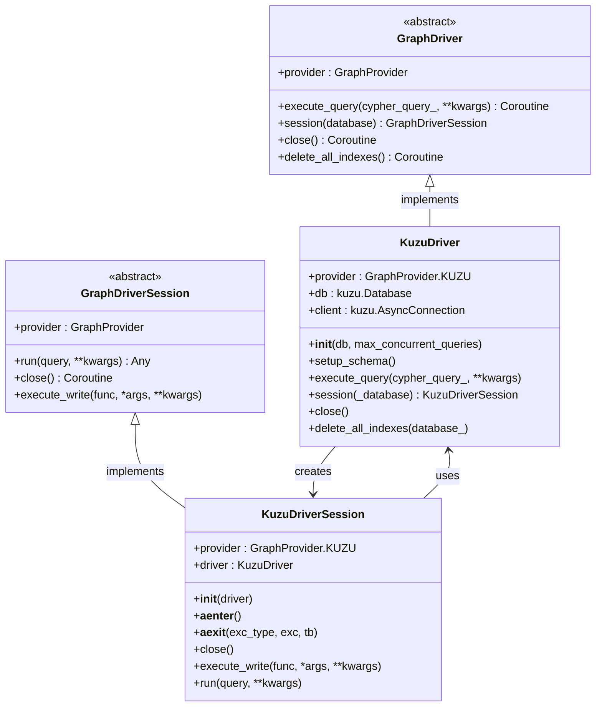
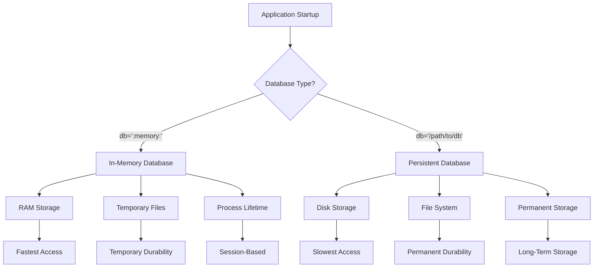
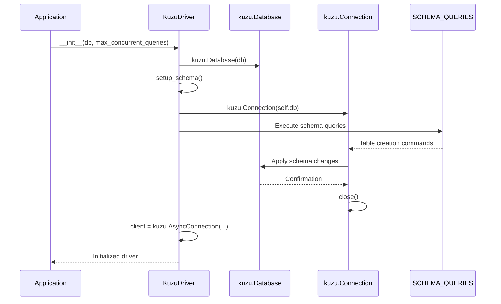
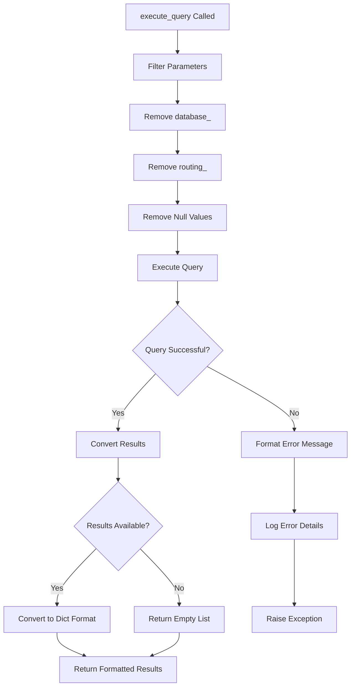
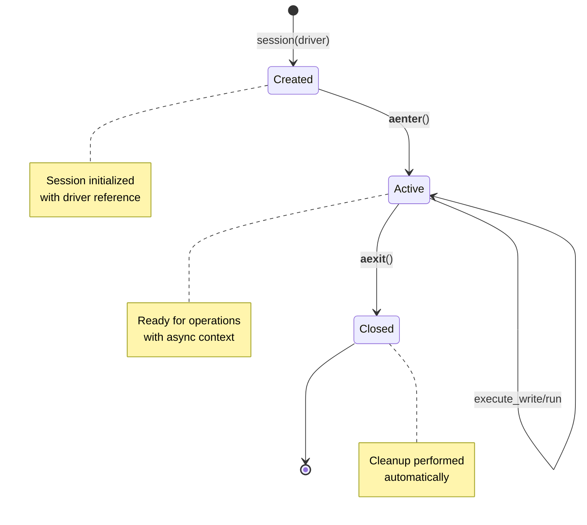
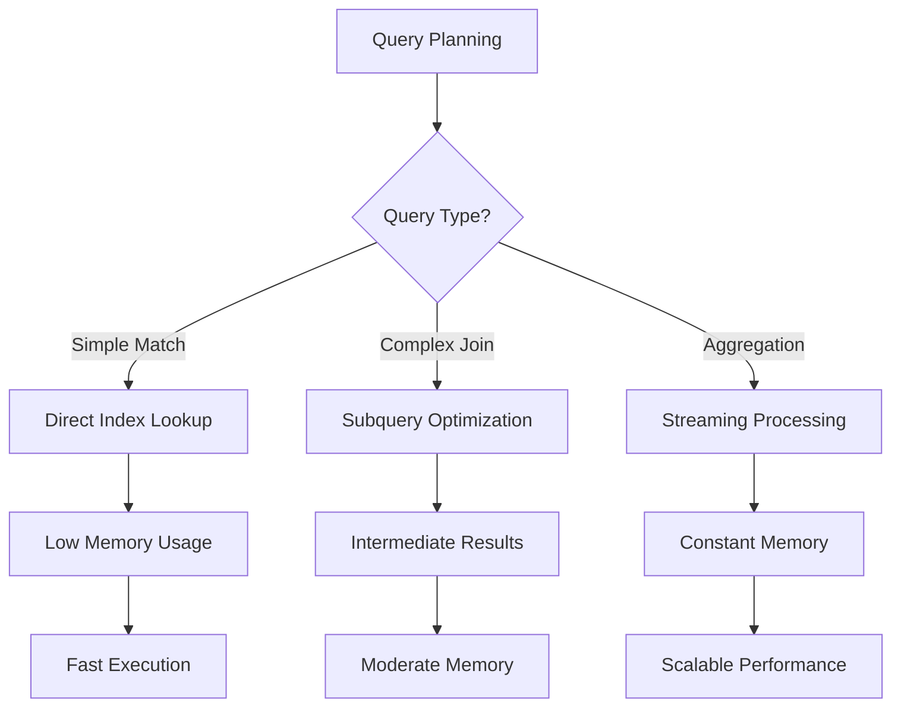

# Kuzu Driver

<cite>
**Referenced Files in This Document**
- [kuzu_driver.py](file://graphiti_core/driver/kuzu_driver.py)
- [driver.py](file://graphiti_core/driver/driver.py)
- [helpers_test.py](file://tests/helpers_test.py)
- [README.md](file://README.md)
</cite>

## Table of Contents
1. [Introduction](#introduction)
2. [Architecture Overview](#architecture-overview)
3. [Initialization Parameters](#initialization-parameters)
4. [Embedded Database Nature](#embedded-database-nature)
5. [Schema Setup](#schema-setup)
6. [Query Execution](#query-execution)
7. [Session Management](#session-management)
8. [No-Op Methods](#no-op-methods)
9. [Configuration Examples](#configuration-examples)
10. [Performance Considerations](#performance-considerations)
11. [Database Management](#database-management)
12. [Troubleshooting Guide](#troubleshooting-guide)
13. [Conclusion](#conclusion)

## Introduction

The KuzuDriver is a GraphDriver implementation that provides seamless integration with the Kuzu graph database, an embedded, high-performance graph database written in C++. This driver enables Graphiti to leverage Kuzu's capabilities while maintaining compatibility with the standardized GraphDriver interface used across different database backends.

Kuzu is designed as an embedded database, meaning it runs within the same process as the application, eliminating network overhead and simplifying deployment. The KuzuDriver implementation handles the complexities of interfacing with Kuzu's Python bindings while providing a clean abstraction layer for Graphiti's graph operations.

## Architecture Overview

The KuzuDriver follows the GraphDriver interface pattern, implementing all required abstract methods while adding Kuzu-specific functionality. The architecture consists of two main components: the driver itself and its associated session manager.



**Diagram sources**
- [kuzu_driver.py](file://graphiti_core/driver/kuzu_driver.py#L93-L177)
- [driver.py](file://graphiti_core/driver/driver.py#L73-L116)

**Section sources**
- [kuzu_driver.py](file://graphiti_core/driver/kuzu_driver.py#L93-L177)
- [driver.py](file://graphiti_core/driver/driver.py#L73-L116)

## Initialization Parameters

The KuzuDriver accepts two primary initialization parameters that control database behavior and performance characteristics:

### Database Path Parameter (`db`)

The `db` parameter specifies the database storage location and supports two modes:

- **In-Memory Mode**: `db=":memory:"` (default) - Creates a temporary, volatile database stored entirely in RAM. This mode offers maximum performance but loses all data when the application terminates.
- **Persistent Mode**: `db="/path/to/database"` - Creates a persistent database stored on disk. This mode ensures data durability across application restarts.

### Concurrent Query Control (`max_concurrent_queries`)

The `max_concurrent_queries` parameter controls the maximum number of simultaneous asynchronous queries that can be executed concurrently. This parameter directly impacts:

- **Performance**: Higher values enable better parallelism but consume more system resources
- **Resource Usage**: Limits memory and CPU consumption during heavy query loads
- **Throughput**: Balances query processing capacity with system stability

**Section sources**
- [kuzu_driver.py](file://graphiti_core/driver/kuzu_driver.py#L97-L107)

## Embedded Database Nature

Kuzu operates as an embedded database, which provides several advantages and design considerations:

### Embedded Architecture Benefits

- **Zero Network Overhead**: Queries execute directly within the application process
- **Simplified Deployment**: No separate database server installation required
- **Automatic Backup**: Database files can be easily copied and archived
- **Process Isolation**: Database operations are contained within the application process

### Memory Management Implications

The embedded nature means that Kuzu shares memory space with the parent application. This affects:

- **Memory Usage Patterns**: Database memory consumption grows with data size
- **Garbage Collection**: Memory cleanup occurs when the database connection closes
- **Resource Limits**: Database size is constrained by available system memory

### Data Persistence Options



**Section sources**
- [kuzu_driver.py](file://graphiti_core/driver/kuzu_driver.py#L97-L107)

## Schema Setup

The KuzuDriver automatically initializes the database schema upon instantiation through the `setup_schema` method. This method executes predefined Cypher queries to create the necessary table structures.

### Schema Design Philosophy

Kuzu requires explicit schema definition, unlike some other graph databases that support dynamic schema creation. The schema design addresses specific limitations and requirements:

- **Explicit Table Definitions**: All node and relationship tables must be declared upfront
- **Array Data Types**: String arrays are used for storing multiple values efficiently
- **Timestamp Fields**: Standardized time tracking for temporal operations
- **UUID Primary Keys**: Unique identification for all graph entities

### Schema Tables Structure

The schema defines five primary table types:

| Table Name | Purpose | Key Features |
|------------|---------|--------------|
| `Episodic` | Temporary event storage | UUID primary key, content arrays |
| `Entity` | Core entity storage | Name embeddings, label arrays |
| `Community` | Community clustering | Name embeddings, hierarchical relationships |
| `RelatesToNode_` | Edge representation workaround | Fact embeddings, temporal validity |
| Relationship Tables | Graph connectivity | Foreign key constraints |

### Schema Creation Process



**Diagram sources**
- [kuzu_driver.py](file://graphiti_core/driver/kuzu_driver.py#L143-L146)

**Section sources**
- [kuzu_driver.py](file://graphiti_core/driver/kuzu_driver.py#L26-L90)
- [kuzu_driver.py](file://graphiti_core/driver/kuzu_driver.py#L143-L146)

## Query Execution

The `execute_query` method handles Cypher query execution with parameter processing and error handling. This method demonstrates Kuzu's specific requirements and limitations compared to other graph databases.

### Parameter Processing

The method implements sophisticated parameter filtering to handle unsupported parameters gracefully:

- **Parameter Filtering**: Removes unsupported parameters like `database_` and `routing_`
- **Null Value Handling**: Filters out null values before query execution
- **Type Preservation**: Maintains parameter types for proper query binding

### Query Execution Flow



**Diagram sources**
- [kuzu_driver.py](file://graphiti_core/driver/kuzu_driver.py#L109-L131)

### Error Handling Strategy

The implementation includes robust error handling with detailed logging:

- **Exception Wrapping**: Original exceptions are preserved while adding context
- **Parameter Sanitization**: Sensitive parameters are truncated in error messages
- **Logging Integration**: Comprehensive error logging for debugging

### Result Formatting

The method converts raw query results into a standardized dictionary format:

- **Single Query Results**: Converted to list of dictionaries
- **Multiple Query Results**: Preserved as list of result sets
- **Empty Results**: Returned as empty lists with appropriate metadata

**Section sources**
- [kuzu_driver.py](file://graphiti_core/driver/kuzu_driver.py#L109-L131)

## Session Management

The KuzuDriverSession provides transactional operations and maintains the relationship between sessions and the underlying driver. This implementation emphasizes simplicity while maintaining the required interface contract.

### Session Lifecycle



**Diagram sources**
- [kuzu_driver.py](file://graphiti_core/driver/kuzu_driver.py#L149-L177)

### Transaction Pattern

The session implements a simplified transaction pattern suitable for Kuzu's embedded nature:

- **Write Operations**: Direct function execution with session context
- **Query Execution**: Delegated to the driver's query mechanism
- **Context Management**: Automatic resource cleanup through async context managers

### Session Implementation Details

The KuzuDriverSession maintains minimal state while providing essential functionality:

- **Driver Reference**: Stores the parent driver for query delegation
- **Async Context**: Implements proper async context manager protocol
- **Method Delegation**: Routes most operations to the driver

**Section sources**
- [kuzu_driver.py](file://graphiti_core/driver/kuzu_driver.py#L149-L177)

## No-Op Methods

The KuzuDriver implements two methods as no-operations (no-ops) due to Kuzu's embedded nature and design philosophy:

### Close Method

The `close` method is implemented as a no-op because:

- **Automatic Cleanup**: Kuzu manages its own resources through garbage collection
- **Process Termination**: Database connections are cleaned up when the process exits
- **Resource Efficiency**: Explicit closing would add unnecessary overhead

### Delete All Indexes Method

The `delete_all_indexes` method is implemented as a no-op because:

- **Index Management**: Kuzu does not support dynamic index creation/deletion
- **Schema Rigidity**: The schema is fixed at initialization time
- **Performance Focus**: Pre-computed indexes optimize query performance

### Rationale for No-Op Implementation

These no-ops reflect Kuzu's design priorities:

- **Performance Optimization**: Eliminates unnecessary operations
- **Simplified Interface**: Reduces complexity for users
- **Resource Efficiency**: Leverages automatic resource management

**Section sources**
- [kuzu_driver.py](file://graphiti_core/driver/kuzu_driver.py#L136-L141)

## Configuration Examples

This section provides practical examples for configuring the KuzuDriver in various scenarios, from development to production deployments.

### Basic In-Memory Configuration

```python
from graphiti_core import Graphiti
from graphiti_core.driver.kuzu_driver import KuzuDriver

# Basic in-memory configuration for development
driver = KuzuDriver(
    db=":memory:",           # In-memory database
    max_concurrent_queries=1  # Single-threaded for simplicity
)

graphiti = Graphiti(graph_driver=driver)
```

### Persistent Database Configuration

```python
from graphiti_core import Graphiti
from graphiti_core.driver.kuzu_driver import KuzuDriver

# Persistent database configuration for production
driver = KuzuDriver(
    db="/var/lib/graphiti/graph.db",  # Persistent file location
    max_concurrent_queries=10          # Higher concurrency for production
)

graphiti = Graphiti(graph_driver=driver)
```

### Environment-Based Configuration

```python
import os
from graphiti_core import Graphiti
from graphiti_core.driver.kuzu_driver import KuzuDriver

# Environment-based configuration
database_path = os.getenv('GRAPHITI_KUZU_DB', ':memory:')
concurrency_limit = int(os.getenv('GRAPHITI_MAX_QUERIES', '1'))

driver = KuzuDriver(
    db=database_path,
    max_concurrent_queries=concurrency_limit
)

graphiti = Graphiti(graph_driver=driver)
```

### Testing Configuration

```python
from graphiti_core import Graphiti
from graphiti_core.driver.kuzu_driver import KuzuDriver

# Testing configuration with isolated database
driver = KuzuDriver(
    db=f"/tmp/test_graph_{os.getpid()}.db",  # Unique per-process
    max_concurrent_queries=1                 # Deterministic behavior
)

graphiti = Graphiti(graph_driver=driver)
```

### Advanced Production Configuration

```python
import os
from graphiti_core import Graphiti
from graphiti_core.driver.kuzu_driver import KuzuDriver

# Production-ready configuration with monitoring
class ProductionKuzuDriver(KuzuDriver):
    def __init__(self):
        super().__init__(
            db=os.getenv('KUZU_DATABASE_PATH', '/data/graph.db'),
            max_concurrent_queries=int(os.getenv('KUZU_MAX_QUERIES', '20'))
        )
        
        # Additional production configurations
        self.setup_monitoring()
    
    def setup_monitoring(self):
        # Implement monitoring hooks here
        pass

driver = ProductionKuzuDriver()
graphiti = Graphiti(graph_driver=driver)
```

**Section sources**
- [helpers_test.py](file://tests/helpers_test.py#L81-L82)
- [README.md](file://README.md#L320-L330)

## Performance Considerations

Understanding Kuzu's performance characteristics is crucial for optimizing Graphiti deployments. The driver's performance depends on several factors that interact with the underlying database engine.

### Concurrent Query Performance

The `max_concurrent_queries` parameter directly impacts performance:

- **Single Query Limit**: Default value of 1 provides thread safety but limits throughput
- **Higher Concurrency**: Values up to 10-20 can improve throughput for read-heavy workloads
- **Resource Constraints**: Higher values consume more memory and CPU resources
- **I/O Bound Operations**: Network or disk-bound queries benefit less from increased concurrency

### Memory Usage Patterns

Kuzu's memory usage follows predictable patterns:

- **Data Loading**: Memory usage increases proportionally with graph size
- **Query Processing**: Temporary memory spikes during complex queries
- **Connection Pooling**: Each connection maintains its own memory footprint
- **Garbage Collection**: Automatic cleanup occurs during idle periods

### Query Optimization Strategies



### Performance Tuning Guidelines

| Scenario | Recommended Settings | Rationale |
|----------|---------------------|-----------|
| Development | `max_concurrent_queries=1` | Simplicity, debugging ease |
| Testing | `max_concurrent_queries=5` | Balanced performance |
| Production Read | `max_concurrent_queries=10-20` | Throughput optimization |
| Production Write | `max_concurrent_queries=5-10` | Resource conservation |
| High Load | Monitor memory usage, adjust incrementally | Prevent resource exhaustion |

### Monitoring and Metrics

Key performance metrics to monitor:

- **Query Latency**: Average execution time per query type
- **Memory Usage**: Peak and average memory consumption
- **Concurrent Queries**: Utilization of the concurrency pool
- **Error Rates**: Frequency of query failures and timeouts

**Section sources**
- [kuzu_driver.py](file://graphiti_core/driver/kuzu_driver.py#L99-L100)

## Database Management

Proper database management ensures data integrity, performance, and longevity. This section covers file management, backup strategies, and maintenance procedures for Kuzu deployments.

### File Management Best Practices

#### Database File Locations

- **In-Memory Mode**: No physical files, temporary storage only
- **Persistent Mode**: Single database file containing all data
- **Backup Files**: Separate files for disaster recovery
- **Log Files**: Operational logs for debugging and monitoring

#### File Permissions and Security

```python
import os
import stat

# Secure database file creation
def create_secure_database(path):
    # Create directory with restricted permissions
    os.makedirs(os.path.dirname(path), mode=0o700, exist_ok=True)
    
    # Create database file with secure permissions
    with open(path, 'w') as f:
        pass
    
    # Set restrictive permissions
    os.chmod(path, stat.S_IRUSR | stat.S_IWUSR)
    
    return path
```

### Backup Strategies

#### Automated Backup Procedures

```python
import shutil
import time
from pathlib import Path

def create_backup(database_path: str, backup_dir: str = "/backups") -> str:
    """Create a database backup with timestamp."""
    db_path = Path(database_path)
    timestamp = time.strftime("%Y%m%d-%H%M%S")
    backup_path = Path(backup_dir) / f"{db_path.stem}-{timestamp}{db_path.suffix}"
    
    # Copy database file safely
    shutil.copy2(db_path, backup_path)
    
    return str(backup_path)
```

#### Incremental Backup Approach

For large databases, consider incremental backups:

- **Full Backups**: Daily complete copies
- **Differential Backups**: Since last full backup
- **Transaction Logs**: Real-time change tracking

### Maintenance Operations

#### Database Compaction

Kuzu benefits from periodic compaction to optimize storage:

```python
async def compact_database(driver: KuzuDriver):
    """Perform database maintenance operations."""
    # Execute maintenance queries
    await driver.execute_query("PRAGMA VACUUM;")
    await driver.execute_query("PRAGMA REINDEX;")
```

#### Health Monitoring

```python
async def check_database_health(driver: KuzuDriver) -> dict:
    """Monitor database health and performance."""
    try:
        # Basic connectivity test
        result, _, _ = await driver.execute_query("RETURN 1 AS health;")
        
        # Size estimation
        size_query = """
        SELECT SUM(pg_size_pretty(pg_total_relation_size(table_name))) as total_size
        FROM information_schema.tables 
        WHERE table_schema='public';
        """
        
        size_result, _, _ = await driver.execute_query(size_query)
        
        return {
            "healthy": True,
            "size": size_result[0]["total_size"] if size_result else "unknown",
            "timestamp": time.time()
        }
    except Exception as e:
        return {
            "healthy": False,
            "error": str(e),
            "timestamp": time.time()
        }
```

### Deployment Considerations

#### Containerized Environments

For containerized deployments:

- **Volume Mounts**: Persistent volumes for database files
- **Health Checks**: Regular database connectivity verification
- **Resource Limits**: Memory and CPU constraints for stability

#### Cloud Deployments

Cloud-specific considerations:

- **Storage Classes**: Choose appropriate storage types
- **Network Connectivity**: Minimize network overhead
- **Auto-scaling**: Adjust concurrency based on load

**Section sources**
- [kuzu_driver.py](file://graphiti_core/driver/kuzu_driver.py#L136-L141)

## Troubleshooting Guide

This section addresses common issues encountered when using the KuzuDriver and provides systematic approaches to diagnosis and resolution.

### Common Issues and Solutions

#### Database Connection Problems

**Symptom**: "Unable to connect to database" errors

**Diagnosis Steps**:
1. Verify database file permissions
2. Check available disk space
3. Confirm database path accessibility
4. Review concurrent connection limits

**Solutions**:
```python
# Check file permissions
import os
db_path = "/path/to/database"
print(f"Exists: {os.path.exists(db_path)}")
print(f"Readable: {os.access(db_path, os.R_OK)}")
print(f"Writable: {os.access(db_path, os.W_OK)}")

# Alternative approach with error handling
try:
    driver = KuzuDriver(db=db_path)
except PermissionError:
    print("Permission denied - check file permissions")
except FileNotFoundError:
    print("Database file not found - check path")
except Exception as e:
    print(f"Unexpected error: {e}")
```

#### Memory-Related Issues

**Symptom**: Out-of-memory errors or excessive memory usage

**Diagnosis**:
- Monitor system memory usage during operation
- Check `max_concurrent_queries` setting
- Analyze query complexity and result sizes

**Solutions**:
```python
# Reduce concurrency for memory-constrained environments
driver = KuzuDriver(
    db=db_path,
    max_concurrent_queries=1  # Conservative setting
)

# Implement query result limiting
async def safe_execute(driver, query, **params):
    result, _, _ = await driver.execute_query(query, **params)
    # Limit result size for large datasets
    return result[:1000]  # Return only first 1000 results
```

#### Performance Degradation

**Symptom**: Slow query execution or timeouts

**Diagnosis**:
- Profile query execution times
- Monitor concurrent query utilization
- Check for long-running transactions

**Solutions**:
```python
# Optimize concurrent query settings
import os

# Increase concurrency for better throughput
concurrency = min(10, os.cpu_count() or 1)

driver = KuzuDriver(
    db=db_path,
    max_concurrent_queries=concurrency
)

# Implement query timeout handling
import asyncio

async def timed_query(driver, query, timeout=30):
    try:
        return await asyncio.wait_for(
            driver.execute_query(query),
            timeout=timeout
        )
    except asyncio.TimeoutError:
        print(f"Query timeout after {timeout} seconds")
        raise
```

### Debugging Techniques

#### Query Logging

Enable detailed query logging for troubleshooting:

```python
import logging

# Configure debug logging
logging.basicConfig(level=logging.DEBUG)
logger = logging.getLogger('graphiti_core.driver.kuzu_driver')

# Custom query wrapper for debugging
async def debug_query(driver, query, **params):
    logger.debug(f"Executing query: {query}")
    logger.debug(f"With parameters: {params}")
    
    try:
        result = await driver.execute_query(query, **params)
        logger.debug(f"Query successful, returned {len(result[0])} rows")
        return result
    except Exception as e:
        logger.error(f"Query failed: {e}")
        raise
```

#### Database State Inspection

```python
async def inspect_database_state(driver: KuzuDriver):
    """Inspect database structure and statistics."""
    queries = [
        ("List tables", "SHOW TABLES"),
        ("Table schema", "DESCRIBE table_name"),
        ("Row counts", "SELECT COUNT(*) FROM table_name"),
        ("Index information", "SHOW INDEXES")
    ]
    
    results = {}
    for name, query in queries:
        try:
            result, _, _ = await driver.execute_query(query)
            results[name] = result
        except Exception as e:
            results[name] = f"Error: {e}"
    
    return results
```

### Error Recovery Strategies

#### Graceful Degradation

Implement fallback mechanisms for database failures:

```python
class RobustKuzuDriver:
    def __init__(self, db_path, max_retries=3):
        self.db_path = db_path
        self.max_retries = max_retries
        self.current_driver = None
        
    async def execute_query(self, query, **params):
        for attempt in range(self.max_retries):
            try:
                if not self.current_driver:
                    self.current_driver = KuzuDriver(self.db_path)
                
                return await self.current_driver.execute_query(query, **params)
                
            except Exception as e:
                print(f"Attempt {attempt + 1} failed: {e}")
                await self._reinitialize_driver()
                
        raise RuntimeError(f"Failed after {self.max_retries} attempts")
    
    async def _reinitialize_driver(self):
        if self.current_driver:
            await self.current_driver.close()
        self.current_driver = KuzuDriver(self.db_path)
```

**Section sources**
- [kuzu_driver.py](file://graphiti_core/driver/kuzu_driver.py#L117-L122)

## Conclusion

The KuzuDriver provides a robust and efficient interface between Graphiti and the Kuzu embedded graph database. Its design emphasizes simplicity, performance, and reliability while maintaining compatibility with the broader GraphDriver ecosystem.

### Key Strengths

- **Embedded Architecture**: Zero-network overhead and simplified deployment
- **High Performance**: Optimized for read-heavy workloads with configurable concurrency
- **Minimal Configuration**: Easy setup with sensible defaults
- **Robust Error Handling**: Comprehensive error reporting and recovery mechanisms

### Best Practices Summary

1. **Choose Appropriate Database Mode**: Use in-memory for development, persistent for production
2. **Tune Concurrency Settings**: Balance performance with resource constraints
3. **Implement Proper Monitoring**: Track performance metrics and health indicators
4. **Plan Backup Strategies**: Regular backups for persistent deployments
5. **Handle Errors Gracefully**: Implement retry logic and fallback mechanisms

### Future Considerations

As Graphiti evolves, the KuzuDriver may benefit from:

- **Dynamic Index Management**: Enhanced indexing capabilities for improved performance
- **Advanced Query Optimization**: Built-in query planner improvements
- **Enhanced Monitoring**: Native performance metrics and profiling tools
- **Cloud Integration**: Better support for cloud-native deployments

The KuzuDriver represents a solid foundation for graph-based applications requiring high performance and simplicity, making it an excellent choice for both development and production environments.