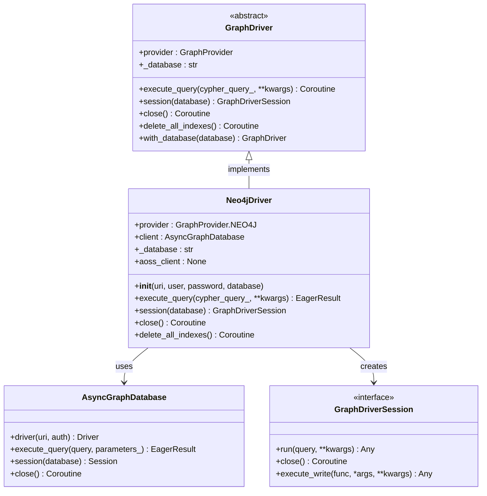
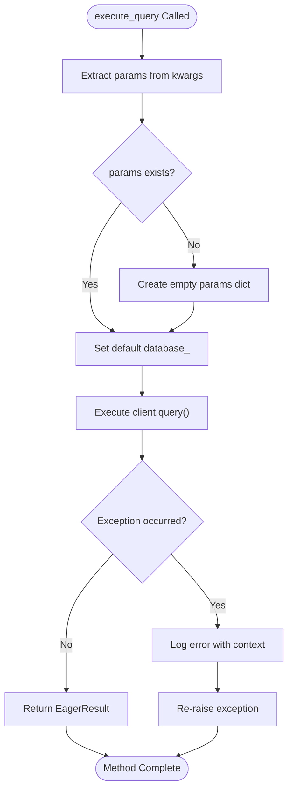
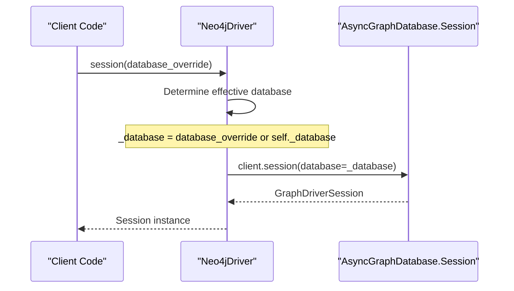
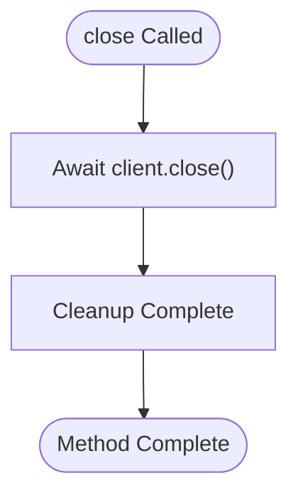
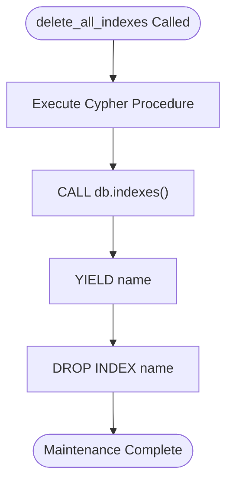

# Neo4j Driver

<cite>
**Referenced Files in This Document**
- [neo4j_driver.py](file://graphiti_core/driver/neo4j_driver.py)
- [driver.py](file://graphiti_core/driver/driver.py)
- [graphiti.py](file://graphiti_core/graphiti.py)
- [quickstart_neo4j.py](file://examples/quickstart/quickstart_neo4j.py)
- [helpers_test.py](file://tests/helpers_test.py)
- [README.md](file://README.md)
</cite>

## Table of Contents
1. [Introduction](#introduction)
2. [Architecture Overview](#architecture-overview)
3. [Initialization Parameters](#initialization-parameters)
4. [AsyncGraphDatabase Integration](#asyncgraphdatabase-integration)
5. [Core Methods Implementation](#core-methods-implementation)
6. [Configuration Examples](#configuration-examples)
7. [Performance Considerations](#performance-considerations)
8. [Troubleshooting Guide](#troubleshooting-guide)
9. [Security Implications](#security-implications)
10. [Best Practices](#best-practices)

## Introduction

The Neo4jDriver is a specialized implementation of the GraphDriver interface that provides asynchronous connectivity to Neo4j graph databases. Built on top of the official Neo4j Python driver library, it offers robust connection management, query execution capabilities, and seamless integration with the Graphiti framework for knowledge graph operations.

This driver serves as the primary interface for Graphiti's Neo4j backend, enabling real-time knowledge graph construction, semantic search, and temporal data management. It implements the complete GraphDriver contract while leveraging Neo4j's native asynchronous capabilities for optimal performance.

## Architecture Overview

The Neo4jDriver follows a layered architecture that separates concerns between database connectivity, query execution, and framework integration.



**Diagram sources**
- [neo4j_driver.py](file://graphiti_core/driver/neo4j_driver.py#L29-L74)
- [driver.py](file://graphiti_core/driver/driver.py#L73-L115)

**Section sources**
- [neo4j_driver.py](file://graphiti_core/driver/neo4j_driver.py#L29-L74)
- [driver.py](file://graphiti_core/driver/driver.py#L73-L115)

## Initialization Parameters

The Neo4jDriver accepts four primary initialization parameters, each serving a specific purpose in establishing and configuring the database connection.

### Parameter Details

| Parameter | Type | Required | Default | Description |
|-----------|------|----------|---------|-------------|
| `uri` | `str` | Yes | - | Neo4j database connection URI (e.g., `bolt://localhost:7687`) |
| `user` | `str \| None` | No | `None` | Database username for authentication |
| `password` | `str \| None` | No | `None` | Database password for authentication |
| `database` | `str` | No | `'neo4j'` | Target database name within the Neo4j instance |

### Default Values and Behavior

The driver implements intelligent default handling for authentication parameters:

- **URI Requirement**: Must be provided explicitly; no default value exists
- **User Authentication**: Uses empty string fallback (`''`) when `None` is passed
- **Password Authentication**: Uses empty string fallback (`''`) when `None` is passed  
- **Database Name**: Defaults to `'neo4j'` for backward compatibility

### Security Considerations

The authentication mechanism employs a secure pattern where missing credentials are replaced with empty strings rather than `None`. This approach prevents authentication failures while maintaining security posture by avoiding hardcoded credentials in the codebase.

**Section sources**
- [neo4j_driver.py](file://graphiti_core/driver/neo4j_driver.py#L32-L47)
- [graphiti.py](file://graphiti_core/graphiti.py#L198-L203)

## AsyncGraphDatabase Integration

The Neo4jDriver leverages the official Neo4j Python driver's AsyncGraphDatabase for asynchronous database operations. This integration provides several key benefits:

### Connection Establishment

The driver creates an asynchronous database connection using the standard Neo4j driver initialization pattern:

```python
self.client = AsyncGraphDatabase.driver(
    uri=uri,
    auth=(user or '', password or ''),
)
```

### Connection Pooling Behavior

The underlying AsyncGraphDatabase implements sophisticated connection pooling:

- **Automatic Pool Management**: Handles connection lifecycle transparently
- **Thread Safety**: Designed for concurrent access patterns
- **Resource Optimization**: Maintains optimal connection count based on workload
- **Failover Support**: Provides automatic retry mechanisms for transient failures

### Asynchronous Operations

All database operations are executed asynchronously, enabling non-blocking I/O and improved throughput for applications with multiple concurrent requests.

**Section sources**
- [neo4j_driver.py](file://graphiti_core/driver/neo4j_driver.py#L40-L43)

## Core Methods Implementation

### execute_query Method

The execute_query method serves as the primary interface for Cypher query execution, implementing sophisticated parameter handling and error management.



**Diagram sources**
- [neo4j_driver.py](file://graphiti_core/driver/neo4j_driver.py#L48-L62)

#### Parameter Injection Mechanism

The method implements a sophisticated parameter injection system:

1. **Backward Compatibility**: Automatically injects the default database name when not provided
2. **Parameter Extraction**: Safely extracts parameters from kwargs with fallback handling
3. **Default Value Setting**: Uses `setdefault()` to maintain explicit parameter precedence

#### Error Logging and Handling

The implementation includes comprehensive error logging:

- **Context Preservation**: Logs query text, parameters, and error details
- **Debugging Support**: Provides full context for troubleshooting
- **Exception Propagation**: Maintains original exception chain for proper error handling

### session Method

The session method provides database session management with flexible database override capabilities:



**Diagram sources**
- [neo4j_driver.py](file://graphiti_core/driver/neo4j_driver.py#L64-L66)

#### Database Override Capability

The session method supports runtime database switching:

- **Override Priority**: Explicit database parameter takes precedence
- **Fallback Behavior**: Falls back to driver's default database when not specified
- **Session Isolation**: Each session operates independently with its database context

### close Method

The close method implements asynchronous resource cleanup:



**Diagram sources**
- [neo4j_driver.py](file://graphiti_core/driver/neo4j_driver.py#L68-L70)

#### Asynchronous Cleanup

The method ensures proper resource deallocation:

- **Non-blocking Operation**: Uses `await` for asynchronous cleanup
- **Connection Termination**: Properly closes all database connections
- **Resource Release**: Frees associated system resources

### delete_all_indexes Implementation

The delete_all_indexes method provides database maintenance capabilities:



**Diagram sources**
- [neo4j_driver.py](file://graphiti_core/driver/neo4j_driver.py#L71-L74)

#### Cypher Maintenance Query

The implementation uses Neo4j's built-in database maintenance procedures:

- **System Procedure**: Leverages `db.indexes()` for index enumeration
- **Bulk Operation**: Efficiently removes all indexes in a single operation
- **Safety Considerations**: Requires manual invocation for destructive operations

**Section sources**
- [neo4j_driver.py](file://graphiti_core/driver/neo4j_driver.py#L48-L74)

## Configuration Examples

### Local Development Setup

For local development with Neo4j Desktop:

```python
from graphiti_core import Graphiti

# Basic local connection
graphiti = Graphiti(
    uri="bolt://localhost:7687",
    user="neo4j",
    password="your_password_here"
)

# Custom database name
from graphiti_core.driver.neo4j_driver import Neo4jDriver

driver = Neo4jDriver(
    uri="bolt://localhost:7687",
    user="neo4j", 
    password="password",
    database="my_custom_database"
)
graphiti = Graphiti(graph_driver=driver)
```

### Cloud Deployment Configuration

For production cloud deployments:

```python
import os
from graphiti_core import Graphiti

# Environment-based configuration
neo4j_uri = os.environ.get('NEO4J_URI', 'bolt://localhost:7687')
neo4j_user = os.environ.get('NEO4J_USER', 'neo4j')
neo4j_password = os.environ.get('NEO4J_PASSWORD', 'password')

# Production-ready setup
graphiti = Graphiti(
    uri=neo4j_uri,
    user=neo4j_user,
    password=neo4j_password
)
```

### Advanced Configuration with Custom Settings

```python
from graphiti_core.driver.neo4j_driver import Neo4jDriver
from neo4j import AsyncGraphDatabase

# Custom driver with specific configurations
driver = Neo4jDriver(
    uri="neo4j+s://your-cluster-uri",
    user="graphiti_user",
    password="secure_password",
    database="production_graph"
)

# Enhanced setup with custom session management
class EnhancedNeo4jDriver(Neo4jDriver):
    async def execute_query_with_timeout(self, query, timeout=30, **kwargs):
        return await self.client.execute_query(query, timeout=timeout, **kwargs)
```

**Section sources**
- [quickstart_neo4j.py](file://examples/quickstart/quickstart_neo4j.py#L47-L54)
- [README.md](file://README.md#L275-L298)

## Performance Considerations

### Large Result Sets Handling

The Neo4jDriver implements several strategies for managing large result sets efficiently:

#### EagerResult Processing

The driver uses `EagerResult` for query execution, which loads all results into memory:

- **Memory Efficiency**: Suitable for moderate-sized result sets
- **Batch Processing**: Consider pagination for very large datasets
- **Streaming Alternatives**: Use streaming queries for extremely large result sets

#### Connection Timeout Settings

While the driver doesn't expose explicit timeout parameters, the underlying AsyncGraphDatabase supports various timeout configurations:

- **Connection Timeout**: Managed by the Neo4j driver's internal connection pool
- **Query Timeout**: Can be specified per query using Cypher query hints
- **Session Timeout**: Controlled through session-level configuration

### Connection Pool Optimization

The AsyncGraphDatabase implements intelligent connection pooling:

- **Pool Sizing**: Automatically adjusts based on workload characteristics
- **Connection Reuse**: Maximizes connection utilization
- **Idle Management**: Implements connection cleanup for idle resources

### Query Performance Best Practices

#### Parameter Optimization

- **Named Parameters**: Use parameterized queries for security and performance
- **Batch Operations**: Group related operations for reduced overhead
- **Index Utilization**: Ensure appropriate indexes for query patterns

#### Resource Management

- **Session Lifecycle**: Maintain sessions for related operations
- **Connection Cleanup**: Always close connections when finished
- **Memory Monitoring**: Monitor memory usage with large result sets

**Section sources**
- [neo4j_driver.py](file://graphiti_core/driver/neo4j_driver.py#L48-L62)

## Troubleshooting Guide

### Common Connection Issues

#### Authentication Failures

**Symptoms**: Connection refused, authentication errors, permission denied

**Diagnosis Steps**:
1. Verify URI format and accessibility
2. Check username/password credentials
3. Confirm database existence and permissions
4. Review Neo4j server logs

**Resolution Strategies**:
```python
# Debug connection parameters
print(f"Connecting to: {uri}")
print(f"Using user: {bool(user)}")
print(f"Using password: {bool(password)}")

# Test connection with explicit error handling
try:
    driver = Neo4jDriver(uri, user, password, database)
    # Attempt basic query
    result = await driver.execute_query("RETURN 1 AS test")
except Exception as e:
    print(f"Connection failed: {e}")
    # Check specific error types
    if "authentication" in str(e).lower():
        print("Authentication issue detected")
```

#### Network Connectivity Problems

**Symptoms**: Connection timeouts, unreachable hosts, network errors

**Diagnostic Approach**:
1. Test network connectivity to Neo4j endpoint
2. Verify firewall rules and port accessibility
3. Check DNS resolution for hostname-based URIs
4. Validate SSL/TLS certificates for encrypted connections

#### Database Availability Issues

**Symptoms**: Database not found, service unavailable, cluster partition

**Resolution Process**:
1. Confirm database name matches exactly
2. Check database status and availability
3. Verify cluster health for distributed deployments
4. Review database logs for specific error messages

### Query Execution Problems

#### Parameter Handling Issues

**Common Scenarios**:
- Missing required parameters
- Parameter type mismatches
- Database name conflicts

**Debugging Strategy**:
```python
# Enable detailed logging
import logging
logging.getLogger('neo4j').setLevel(logging.DEBUG)

# Inspect query parameters
params = kwargs.get('params', {})
print(f"Query parameters: {params}")
print(f"Database parameter: {params.get('database_', 'not_set')}")
```

#### Performance Degradation

**Identification Techniques**:
1. Monitor query execution times
2. Analyze query plans using EXPLAIN
3. Check database resource utilization
4. Review index effectiveness

**Optimization Approaches**:
- Add appropriate indexes for query patterns
- Optimize Cypher queries for Neo4j execution engine
- Consider query batching for large operations
- Implement result pagination for large datasets

### Environment-Specific Issues

#### Docker Container Connectivity

**Configuration Requirements**:
- Proper network bridging between containers
- Correct port exposure and binding
- Volume mounting for persistent data

#### Kubernetes Deployment Challenges

**Deployment Considerations**:
- Service discovery and DNS resolution
- Persistent volume configuration
- Resource limits and requests
- Health check implementation

**Section sources**
- [neo4j_driver.py](file://graphiti_core/driver/neo4j_driver.py#L58-L61)

## Security Implications

### Authentication Security

The Neo4jDriver implements secure authentication practices:

#### Credential Management

- **Environment Variables**: Recommended for production deployments
- **Credential Validation**: Empty string fallback prevents null pointer exceptions
- **Connection Encryption**: Supports TLS/SSL for encrypted connections
- **Access Control**: Integrates with Neo4j's role-based access control

#### Secure Connection Patterns

```python
# Recommended secure configuration
import os
from graphiti_core.driver.neo4j_driver import Neo4jDriver

# Use environment variables for sensitive data
neo4j_uri = os.environ.get('NEO4J_URI', 'neo4j+s://cluster-url')
neo4j_user = os.environ.get('NEO4J_USER', 'graphiti_user')
neo4j_password = os.environ.get('NEO4J_PASSWORD', 'secure_random_password')

# Create secure driver instance
driver = Neo4jDriver(
    uri=neo4j_uri,
    user=neo4j_user,
    password=neo4j_password,
    database=os.environ.get('NEO4J_DATABASE', 'production')
)
```

### Data Protection Considerations

#### Query Security

- **Parameterized Queries**: Prevents SQL injection attacks
- **Input Validation**: Validates query parameters before execution
- **Access Restrictions**: Implements database-level access controls

#### Network Security

- **TLS Encryption**: Encrypts data in transit
- **Certificate Validation**: Verifies server certificates
- **Network Isolation**: Supports private network deployments

### Compliance and Governance

#### Audit Logging

The driver supports comprehensive audit logging:

- **Query Tracking**: Logs all executed queries with parameters
- **Error Monitoring**: Captures and reports execution errors
- **Performance Metrics**: Tracks query execution times

#### Data Retention Policies

- **Log Rotation**: Implements log rotation for long-running deployments
- **Sensitive Data Filtering**: Excludes sensitive parameters from logs
- **Retention Management**: Configurable log retention periods

**Section sources**
- [neo4j_driver.py](file://graphiti_core/driver/neo4j_driver.py#L40-L43)
- [neo4j_driver.py](file://graphiti_core/driver/neo4j_driver.py#L58-L61)

## Best Practices

### Connection Management

#### Resource Lifecycle

```python
# Proper connection lifecycle management
async def managed_connection():
    driver = None
    try:
        driver = Neo4jDriver(uri, user, password)
        # Use driver for operations
        result = await driver.execute_query("MATCH (n) RETURN count(n)")
        return result
    finally:
        if driver:
            await driver.close()
```

#### Session Management

- **Session Reuse**: Maintain sessions for related operations
- **Proper Closure**: Always close sessions when finished
- **Timeout Configuration**: Set appropriate timeout values

### Query Optimization

#### Parameter Handling

```python
# Efficient parameter usage
params = {
    "entity_name": "John Doe",
    "timestamp": datetime.utcnow(),
    "confidence": 0.95
}

# Use named parameters for clarity and security
query = """
MATCH (n:Person {name: $entity_name})
WHERE n.timestamp >= $timestamp
RETURN n, score($confidence) as confidence
"""

result = await driver.execute_query(query, params=params)
```

#### Error Handling Patterns

```python
# Comprehensive error handling
async def safe_query_execution(query, params=None):
    try:
        return await driver.execute_query(query, params=params)
    except neo4j.exceptions.AuthenticationError:
        logger.error("Authentication failed")
        raise
    except neo4j.exceptions.ServiceUnavailable:
        logger.error("Database service unavailable")
        raise
    except Exception as e:
        logger.error(f"Unexpected error: {e}")
        raise
```

### Monitoring and Observability

#### Performance Monitoring

- **Query Timing**: Track query execution times
- **Connection Pool Status**: Monitor connection utilization
- **Error Rates**: Track and alert on error patterns

#### Operational Monitoring

- **Health Checks**: Implement database connectivity checks
- **Resource Usage**: Monitor memory and CPU utilization
- **Capacity Planning**: Track growth patterns and scaling needs

### Testing Strategies

#### Unit Testing

```python
# Test connection establishment
def test_driver_initialization():
    driver = Neo4jDriver(test_uri, test_user, test_password)
    assert driver.provider == GraphProvider.NEO4J
    await driver.close()

# Test query execution
async def test_query_execution():
    driver = Neo4jDriver(test_uri, test_user, test_password)
    result = await driver.execute_query("RETURN 1 AS test")
    assert result.records[0]['test'] == 1
    await driver.close()
```

#### Integration Testing

- **End-to-end Testing**: Test complete workflow scenarios
- **Performance Testing**: Validate performance under load
- **Failure Mode Testing**: Test error handling and recovery

**Section sources**
- [neo4j_driver.py](file://graphiti_core/driver/neo4j_driver.py#L68-L70)
- [helpers_test.py](file://tests/helpers_test.py#L88-L93)