# AOSS Integration

<cite>
**Referenced Files in This Document**
- [neptune_driver.py](file://graphiti_core/driver/neptune_driver.py)
- [search_config_recipes.py](file://graphiti_core/search/search_config_recipes.py)
- [search_config.py](file://graphiti_core/search/search_config.py)
- [quickstart_neptune.py](file://examples/quickstart/quickstart_neptune.py)
- [podcast_runner.py](file://examples/podcast/podcast_runner.py)
- [runner.py](file://examples/wizard_of_oz/runner.py)
- [search_utils_test.py](file://tests/utils/search/search_utils_test.py)
</cite>

## Table of Contents
1. [Introduction](#introduction)
2. [Purpose and Architecture](#purpose-and-architecture)
3. [Predefined Indices](#predefined-indices)
4. [Client Initialization](#client-initialization)
5. [Index Management Operations](#index-management-operations)
6. [Query Execution](#query-execution)
7. [Data Ingestion](#data-ingestion)
8. [Hybrid Search Patterns](#hybrid-search-patterns)
9. [Error Handling and Performance](#error-handling-and-performance)
10. [Code Examples](#code-examples)
11. [Best Practices](#best-practices)

## Introduction

The Amazon OpenSearch Service (AOSS) integration within the NeptuneDriver enables hybrid search capabilities by combining full-text search with graph queries. This integration allows Graphiti to leverage OpenSearch's powerful text search capabilities while maintaining the rich graph relationships managed by Neptune.

AOSS serves as a complementary search engine that enhances the knowledge graph's search capabilities by providing fast, scalable full-text search over structured and unstructured data. The integration creates specialized indices for different entity types and enables sophisticated hybrid search patterns that combine text-based and graph-based retrieval.

## Purpose and Architecture

### Hybrid Search Capabilities

The primary purpose of AOSS integration is to enable hybrid search scenarios where users can combine:

- **Full-text search** for semantic understanding and keyword matching
- **Graph traversal** for relationship-based discovery
- **Vector similarity search** for semantic similarity matching

### System Architecture

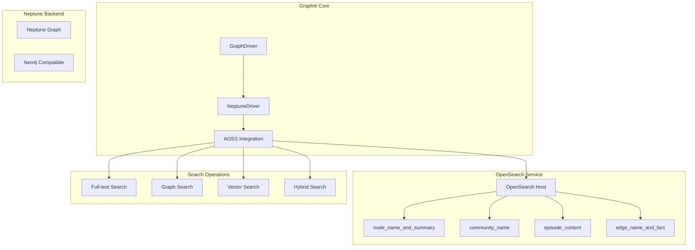

**Diagram sources**
- [neptune_driver.py](file://graphiti_core/driver/neptune_driver.py#L109-L300)

## Predefined Indices

The AOSS integration creates four specialized indices, each optimized for different entity types and search scenarios:

### Index Schema Overview

| Index Name | Purpose | Key Fields | Search Focus |
|------------|---------|------------|--------------|
| `node_name_and_summary` | Entity search | `uuid`, `name`, `summary`, `group_id` | Text matching on entity names and summaries |
| `community_name` | Community search | `uuid`, `name`, `group_id` | Community identification and clustering |
| `episode_content` | Content search | `uuid`, `content`, `source`, `source_description`, `group_id` | Full-text search over episode content |
| `edge_name_and_fact` | Relationship search | `uuid`, `name`, `fact`, `group_id` | Fact extraction and relationship discovery |

### Detailed Index Specifications

#### node_name_and_summary Index

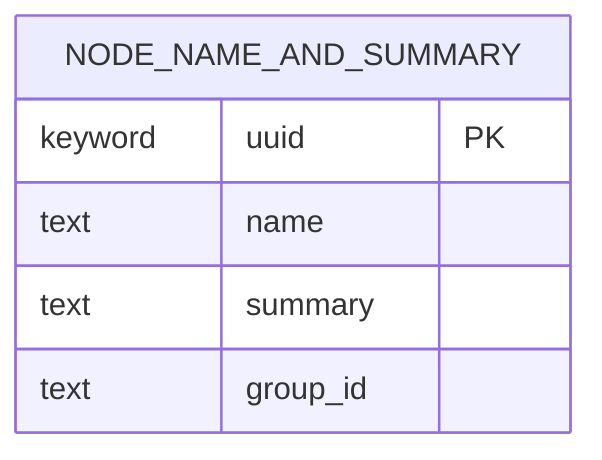

**Schema Details:**
- **uuid**: Unique identifier for entity nodes
- **name**: Primary entity name for text matching
- **summary**: Descriptive text for semantic search
- **group_id**: Partitioning field for multi-tenant scenarios

#### community_name Index

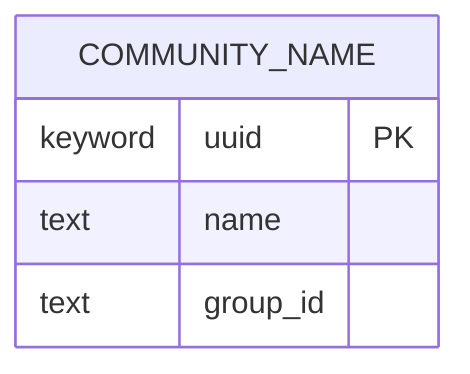

**Schema Details:**
- **uuid**: Unique identifier for community nodes
- **name**: Community name for identification
- **group_id**: Tenant partitioning

#### episode_content Index

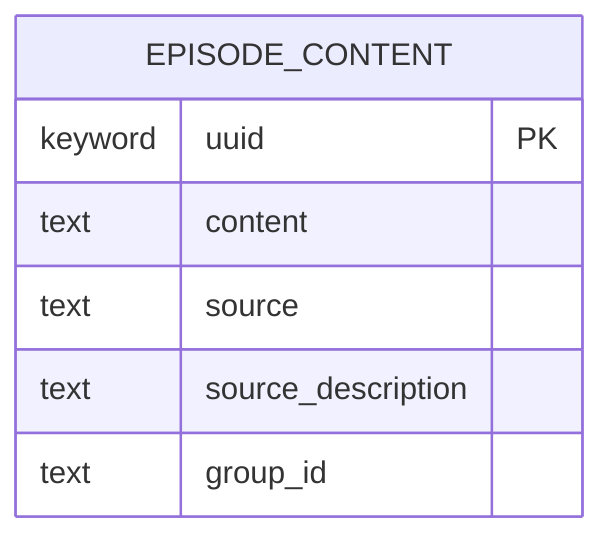

**Schema Details:**
- **uuid**: Episode identifier
- **content**: Full-text content for search
- **source**: Source metadata
- **source_description**: Description of content origin
- **group_id**: Content partitioning

#### edge_name_and_fact Index

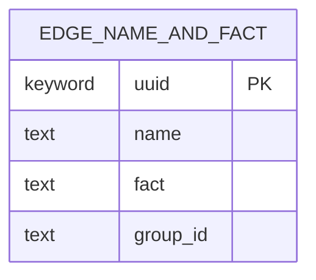

**Schema Details:**
- **uuid**: Edge identifier
- **name**: Edge name for relationship identification
- **fact**: Fact statement for semantic search
- **group_id**: Relationship partitioning

**Section sources**
- [neptune_driver.py](file://graphiti_core/driver/neptune_driver.py#L32-L106)

## Client Initialization

### AWS V4 Signing Authentication

The OpenSearch client initialization uses AWS V4 signing via boto3 session for IAM authentication:

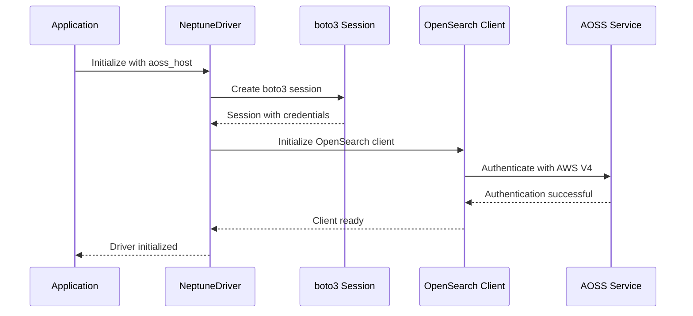

**Diagram sources**
- [neptune_driver.py](file://graphiti_core/driver/neptune_driver.py#L142-L152)

### Connection Configuration

The client is configured with several key parameters:

- **SSL/TLS Encryption**: Enabled with `use_ssl=True` and `verify_certs=True`
- **Connection Pooling**: Configured with `pool_maxsize=20` for concurrent requests
- **HTTP Connection Class**: Uses `Urllib3HttpConnection` for efficient connections
- **IAM Authentication**: Automatic credential resolution via boto3 session

**Section sources**
- [neptune_driver.py](file://graphiti_core/driver/neptune_driver.py#L112-L152)

## Index Management Operations

### create_aoss_indices Method

The index creation process follows a systematic approach:

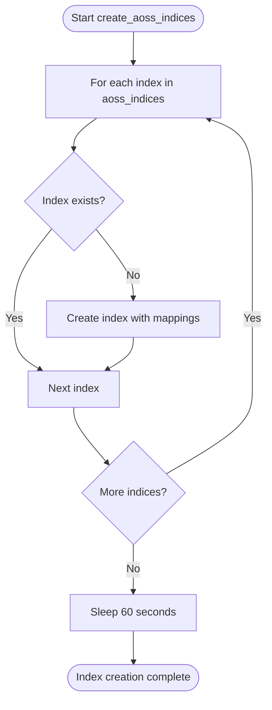

**Diagram sources**
- [neptune_driver.py](file://graphiti_core/driver/neptune_driver.py#L230-L238)

Key characteristics:
- **Conditional Creation**: Only creates indices that don't already exist
- **60-second Sleep**: Ensures index stability after creation
- **Bulk Operation**: Processes all indices in sequence
- **Error Resilience**: Continues operation even if individual indices fail

### delete_aoss_indices Method

The cleanup process removes all predefined indices:

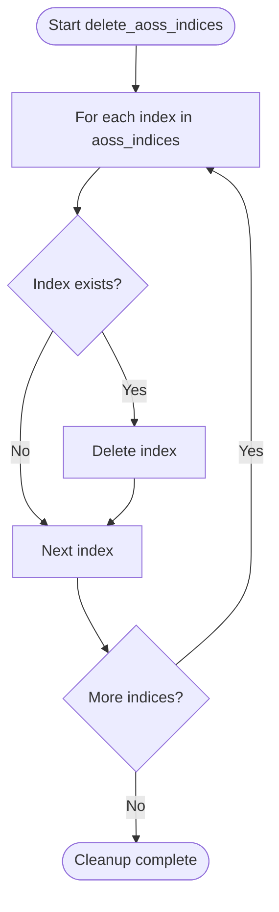

**Diagram sources**
- [neptune_driver.py](file://graphiti_core/driver/neptune_driver.py#L239-L245)

**Section sources**
- [neptune_driver.py](file://graphiti_core/driver/neptune_driver.py#L230-L245)

## Query Execution

### run_aoss_query Implementation

The query execution method supports dynamic parameter injection and result formatting:

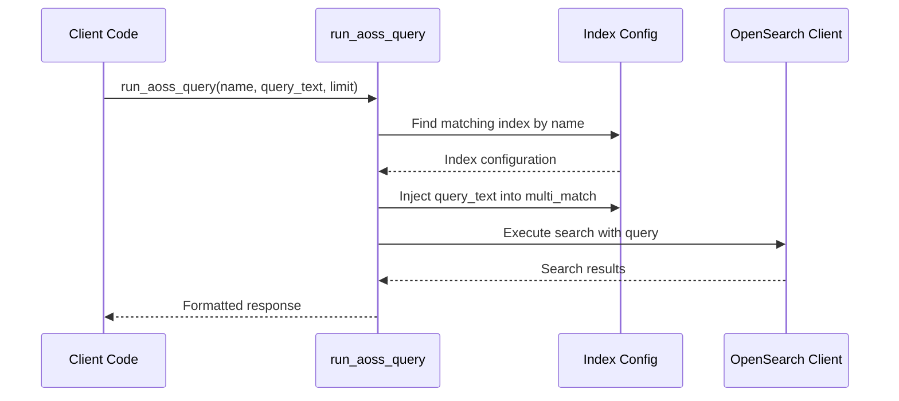

**Diagram sources**
- [neptune_driver.py](file://graphiti_core/driver/neptune_driver.py#L246-L253)

### Dynamic Parameter Injection

The query system supports:
- **Text Query Injection**: Dynamic replacement of search terms
- **Limit Control**: Configurable result limits per index
- **Field Mapping**: Automatic field selection based on index schema
- **Response Formatting**: Structured JSON responses

**Section sources**
- [neptune_driver.py](file://graphiti_core/driver/neptune_driver.py#L246-L253)

## Data Ingestion

### save_to_aoss Method

The bulk indexing process handles data ingestion with field filtering:

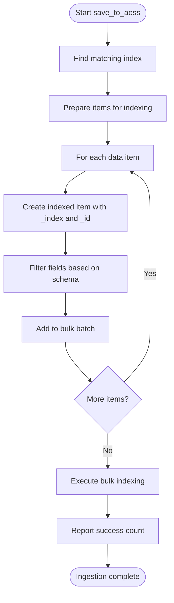

**Diagram sources**
- [neptune_driver.py](file://graphiti_core/driver/neptune_driver.py#L255-L268)

### Field Filtering Logic

The ingestion process automatically filters fields based on the target index schema:
- **Schema Validation**: Only includes fields present in the index mapping
- **UUID Assignment**: Automatically sets `_id` field to the data's UUID
- **Index Specification**: Sets `_index` field to the target index name
- **Bulk Optimization**: Uses OpenSearch helpers for efficient bulk operations

**Section sources**
- [neptune_driver.py](file://graphiti_core/driver/neptune_driver.py#L255-L268)

## Hybrid Search Patterns

### Search Configuration Recipes

The system provides predefined search configurations for different scenarios:

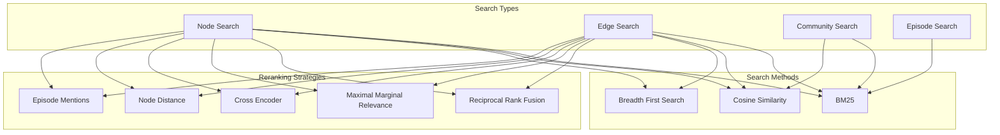

**Diagram sources**
- [search_config_recipes.py](file://graphiti_core/search/search_config_recipes.py#L33-L223)
- [search_config.py](file://graphiti_core/search/search_config.py#L32-L129)

### Hybrid Search Execution Patterns

The hybrid search system supports multiple execution patterns:

1. **Combined Hybrid Search**: RRF reranking across all entity types
2. **Single Entity Type Search**: Focused search on specific entity categories
3. **Cross-Encoder Reranking**: Advanced semantic reranking
4. **MMR Optimization**: Diverse result selection

**Section sources**
- [search_config_recipes.py](file://graphiti_core/search/search_config_recipes.py#L33-L223)
- [search_config.py](file://graphiti_core/search/search_config.py#L32-L129)

## Error Handling and Performance

### Connection Pooling Configuration

The OpenSearch client is configured with `pool_maxsize=20` for optimal performance:
- **Concurrent Requests**: Supports up to 20 simultaneous connections
- **Resource Management**: Prevents connection exhaustion
- **Automatic Pooling**: Efficient connection reuse
- **Thread Safety**: Safe for concurrent access

### Error Handling Practices

The system implements comprehensive error handling:
- **Query Sanitization**: Automatic parameter sanitization for datetime objects
- **Exception Propagation**: Proper error bubbling for debugging
- **Logging Integration**: Comprehensive logging for troubleshooting
- **Graceful Degradation**: Continues operation despite individual failures

### Performance Considerations

Key performance optimizations:
- **Index Stability Sleep**: 60-second delay after index creation
- **Bulk Operations**: Efficient bulk indexing for large datasets
- **Connection Pooling**: Optimized connection management
- **Field Filtering**: Minimal data transfer through selective field inclusion

**Section sources**
- [neptune_driver.py](file://graphiti_core/driver/neptune_driver.py#L151-L170)
- [neptune_driver.py](file://graphiti_core/driver/neptune_driver.py#L237-L238)

## Code Examples

### Basic Initialization and Setup

```python
# Initialize NeptuneDriver with AOSS integration
driver = NeptuneDriver(
    host="neptune-db://your-neptune-endpoint",
    aoss_host="your-aoss-endpoint.amazonaws.com",
    port=8182,
    aoss_port=443
)

# Initialize Graphiti with the driver
graphiti = Graphiti(graph_driver=driver)

# Create AOSS indices (only needs to be done once)
await driver.create_aoss_indices()

# Build graph indices and constraints
await graphiti.build_indices_and_constraints()
```

### Data Ingestion Examples

```python
# Save entity data to AOSS
entities = [
    {
        "uuid": "entity-1",
        "name": "John Doe",
        "summary": "Software engineer specializing in AI",
        "group_id": "team-alpha"
    },
    {
        "uuid": "entity-2", 
        "name": "Jane Smith",
        "summary": "Data scientist with machine learning expertise",
        "group_id": "team-beta"
    }
]

success_count = await driver.save_to_aoss("node_name_and_summary", entities)
print(f"Successfully indexed {success_count} entities")
```

### Full-text Search Queries

```python
# Execute full-text search across all indices
results = await driver.run_aoss_query(
    name="node_name_and_summary",
    query_text="software engineer",
    limit=10
)

# Process search results
for hit in results['hits']['hits']:
    source = hit['_source']
    print(f"Entity: {source['name']}")
    print(f"Summary: {source['summary']}")
    print(f"Score: {hit['_score']}")
```

### Hybrid Search Execution

```python
# Configure hybrid search with RRF reranking
from graphiti_core.search.search_config_recipes import NODE_HYBRID_SEARCH_RRF

# Modify search configuration
search_config = NODE_HYBRID_SEARCH_RRF.model_copy(deep=True)
search_config.limit = 5

# Execute hybrid search
search_results = await graphiti._search(
    query="machine learning algorithms",
    config=search_config
)

# Process hybrid search results
for node in search_results.nodes:
    print(f"Node: {node.name}")
    print(f"Summary: {node.summary}")
    print(f"Relevance Score: {node.relevance_score}")
```

### Cleanup Operations

```python
# Clean up all AOSS indices
await driver.delete_aoss_indices()

# Clear all graph data
await driver._delete_all_data()
```

**Section sources**
- [quickstart_neptune.py](file://examples/quickstart/quickstart_neptune.py#L69-L81)
- [neptune_driver.py](file://graphiti_core/driver/neptune_driver.py#L255-L268)

## Best Practices

### Index Management

1. **One-time Setup**: Create indices only once during initial deployment
2. **Cleanup Strategy**: Use `delete_aoss_indices()` for development and testing
3. **Stability Wait**: Allow 60 seconds after index creation for stability
4. **Schema Consistency**: Maintain consistent field mappings across environments

### Data Ingestion

1. **Bulk Operations**: Use `save_to_aoss()` for efficient bulk indexing
2. **Field Selection**: Only include necessary fields to minimize data transfer
3. **UUID Management**: Ensure unique UUIDs for each entity
4. **Group ID Usage**: Leverage group_id for multi-tenant scenarios

### Search Optimization

1. **Index Selection**: Choose appropriate indices based on search scope
2. **Limit Tuning**: Adjust result limits based on use case requirements
3. **Query Refinement**: Use specific search terms for better precision
4. **Hybrid Patterns**: Combine multiple search methods for comprehensive results

### Performance Guidelines

1. **Connection Pooling**: Monitor connection usage with pool_maxsize=20
2. **Batch Processing**: Process data in batches for large datasets
3. **Error Monitoring**: Implement proper error handling and logging
4. **Resource Management**: Close connections properly in production applications

### Security Considerations

1. **IAM Authentication**: Use AWS IAM roles for secure access
2. **SSL/TLS**: Always enable SSL encryption for production deployments
3. **Credential Rotation**: Regularly rotate AWS credentials
4. **Network Security**: Restrict network access to trusted IP ranges