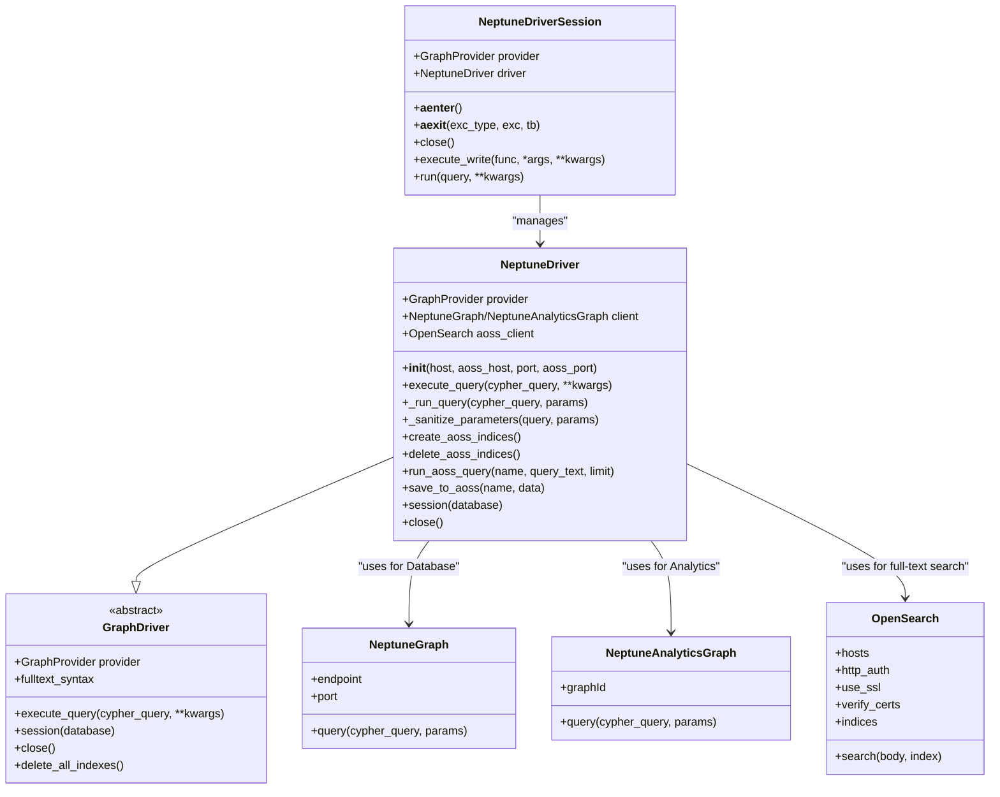
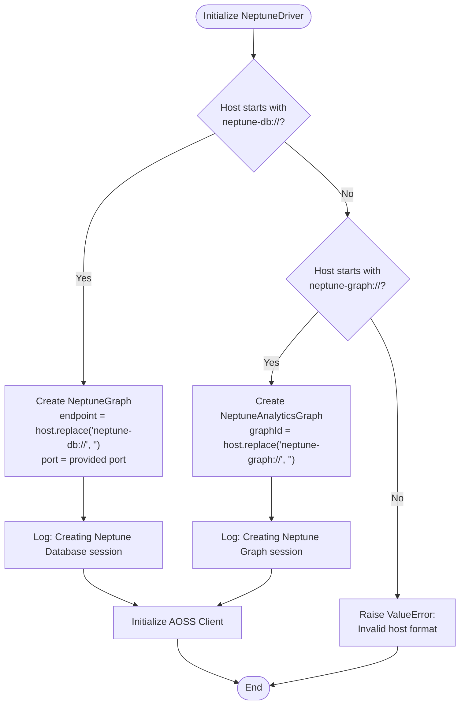
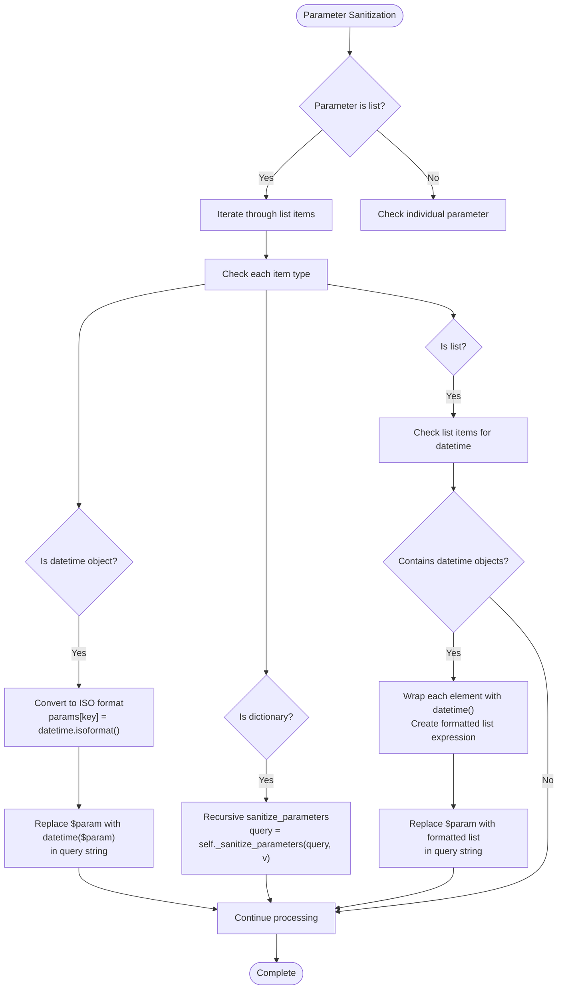
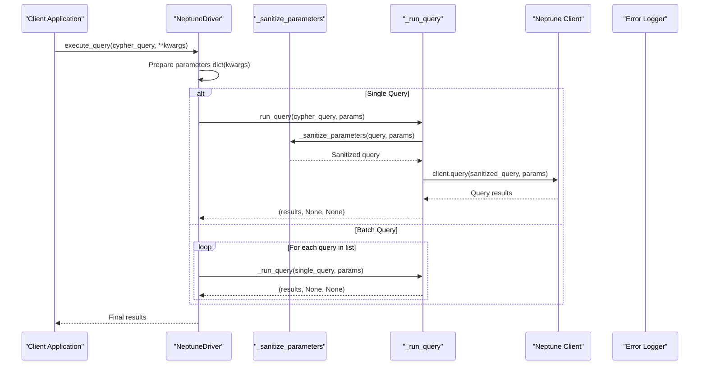
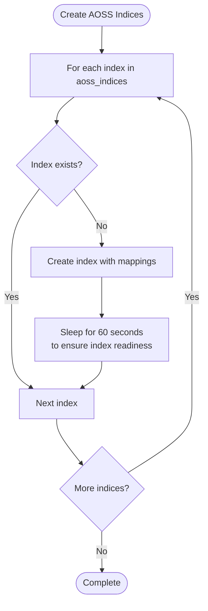
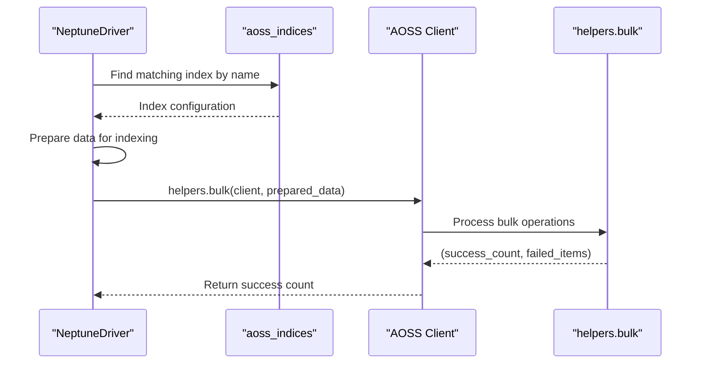
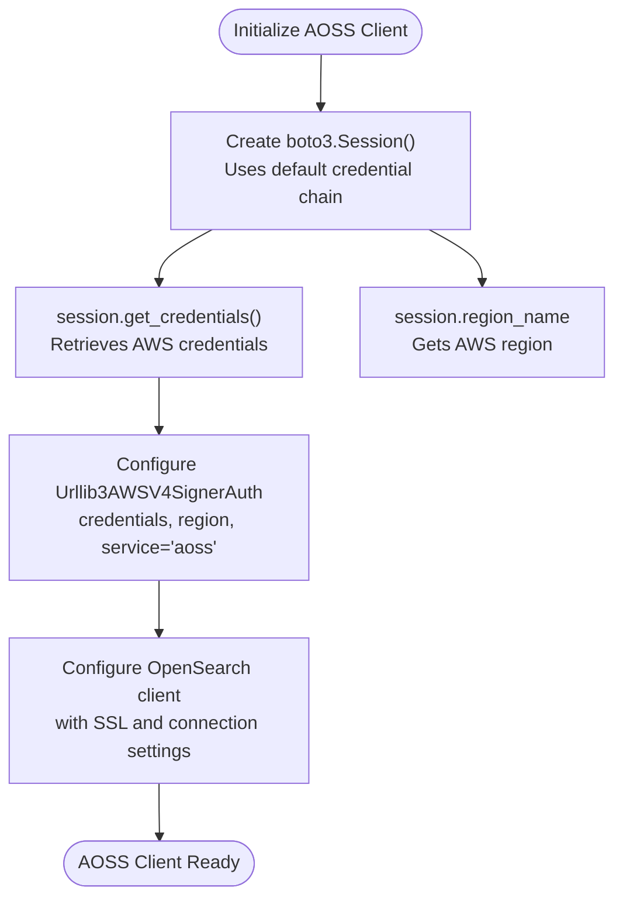
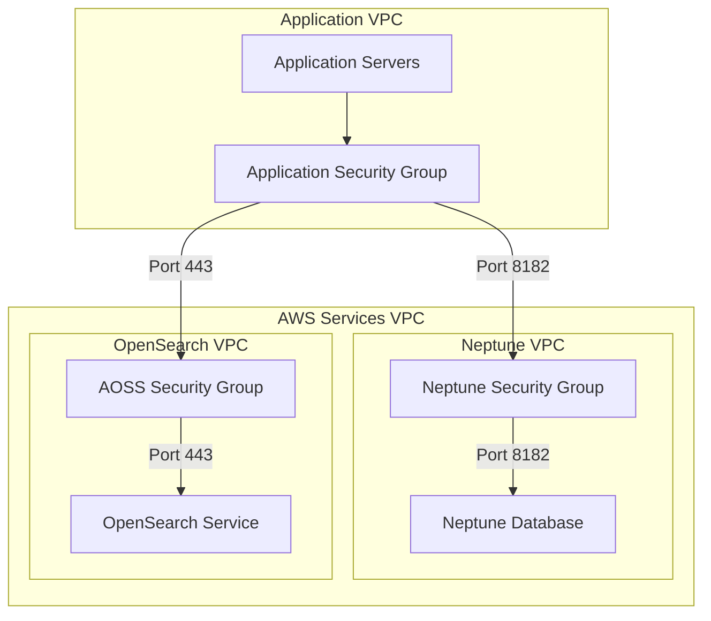
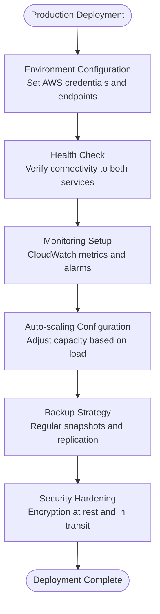
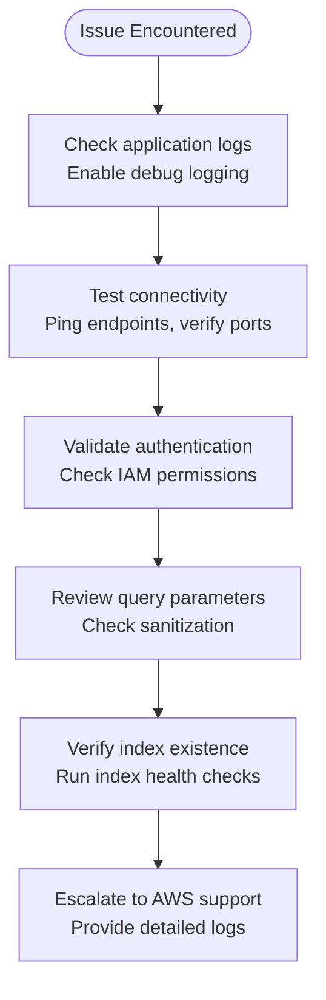

# Neptune Driver Implementation Documentation

<cite>
**Referenced Files in This Document**
- [neptune_driver.py](file://graphiti_core/driver/neptune_driver.py)
- [quickstart_neptune.py](file://examples/quickstart/quickstart_neptune.py)
- [driver.py](file://graphiti_core/driver/driver.py)
- [search_interface.py](file://graphiti_core/driver/search_interface/search_interface.py)
- [search_config.py](file://graphiti_core/search/search_config.py)
- [search_config_recipes.py](file://graphiti_core/search/search_config_recipes.py)
</cite>

## Table of Contents
1. [Introduction](#introduction)
2. [Architecture Overview](#architecture-overview)
3. [Initialization Parameters](#initialization-parameters)
4. [Dual-Client Architecture](#dual-client-architecture)
5. [Parameter Sanitization](#parameter-sanitization)
6. [Query Execution](#query-execution)
7. [AOSS Integration](#aoss-integration)
8. [IAM Authentication](#iam-authentication)
9. [Network Configuration](#network-configuration)
10. [Usage Examples](#usage-examples)
11. [Production Deployment](#production-deployment)
12. [Troubleshooting](#troubleshooting)

## Introduction

The NeptuneDriver is a comprehensive graph database driver implementation that supports both Amazon Neptune Database and Neptune Analytics platforms. It provides seamless integration with Amazon OpenSearch Service (AOSS) for hybrid search capabilities, combining graph traversal with full-text search functionality. The driver implements a sophisticated dual-client architecture that handles both Cypher queries for graph operations and OpenSearch queries for text-based retrieval.

This implementation serves as a bridge between Graphiti's unified graph interface and the specialized requirements of AWS Neptune services, offering automatic parameter sanitization, robust error handling, and production-ready networking configurations.

## Architecture Overview

The NeptuneDriver follows a modular architecture that separates concerns between graph operations and full-text search capabilities:



**Diagram sources**
- [neptune_driver.py](file://graphiti_core/driver/neptune_driver.py#L109-L300)
- [driver.py](file://graphiti_core/driver/driver.py#L73-L116)

**Section sources**
- [neptune_driver.py](file://graphiti_core/driver/neptune_driver.py#L109-L152)
- [driver.py](file://graphiti_core/driver/driver.py#L73-L116)

## Initialization Parameters

The NeptuneDriver constructor accepts four key parameters that define the connection configuration:

### Host Parameter Configuration

The `host` parameter supports two distinct formats for different Neptune deployment types:

| Parameter | Type | Description | Example |
|-----------|------|-------------|---------|
| `host` | str | Neptune endpoint with protocol prefix | `neptune-db://my-neptune-cluster.cluster-xyz.us-west-2.neptune.amazonaws.com` |
| `host` | str | Neptune Analytics Graph ID with protocol prefix | `neptune-graph://my-graph-id` |

**Protocol Specifications:**
- **`neptune-db://`**: Connects to a Neptune Database cluster for traditional graph operations
- **`neptune-graph://`**: Connects to a Neptune Analytics graph for analytical workloads

### AOSS Host Configuration

The `aoss_host` parameter specifies the OpenSearch Service endpoint for full-text search capabilities:

| Parameter | Type | Description | Default Behavior |
|-----------|------|-------------|------------------|
| `aoss_host` | str | OpenSearch Service endpoint | Required, no default |
| Validation | str | Must be provided | Raises ValueError if empty |

### Port Configuration

Both Neptune and OpenSearch connections support configurable ports:

| Parameter | Type | Default Value | Description |
|-----------|------|---------------|-------------|
| `port` | int | 8182 | Neptune Database port (ignored for Analytics) |
| `aoss_port` | int | 443 | OpenSearch Service port |

**Section sources**
- [neptune_driver.py](file://graphiti_core/driver/neptune_driver.py#L112-L152)

## Dual-Client Architecture

The NeptuneDriver implements a sophisticated dual-client architecture that seamlessly integrates two distinct AWS services:

### Neptune Graph Client Selection

The driver automatically selects the appropriate Neptune client based on the host parameter format:



**Diagram sources**
- [neptune_driver.py](file://graphiti_core/driver/neptune_driver.py#L124-L136)

### OpenSearch Client Configuration

The AOSS client is configured with production-ready defaults:

| Configuration | Value | Purpose |
|---------------|-------|---------|
| `use_ssl` | True | Ensures encrypted communication |
| `verify_certs` | True | Validates SSL certificates |
| `pool_maxsize` | 20 | Connection pool size for concurrent requests |
| `connection_class` | Urllib3HttpConnection | Efficient HTTP connection handling |

**Section sources**
- [neptune_driver.py](file://graphiti_core/driver/neptune_driver.py#L124-L152)

## Parameter Sanitization

The `_sanitize_parameters` method implements comprehensive parameter validation and conversion to ensure compatibility with Neptune's query execution engine:

### DateTime Handling

The sanitization process automatically converts Python `datetime` objects to ISO format strings:



**Diagram sources**
- [neptune_driver.py](file://graphiti_core/driver/neptune_driver.py#L154-L189)

### List Parameter Conversion

The driver handles complex list parameters containing mixed data types:

| Scenario | Action | Output Format |
|----------|--------|---------------|
| List with datetime objects | Wrap each with `datetime()` | `[datetime("2024-01-01T00:00:00"), datetime("2024-01-02T00:00:00")]` |
| Mixed data types | Preserve original types | `[value1, datetime("2024-01-01T00:00:00"), value3]` |
| Nested dictionaries | Recursive sanitization | Processed recursively |

**Section sources**
- [neptune_driver.py](file://graphiti_core/driver/neptune_driver.py#L154-L189)

## Query Execution

The query execution system provides a robust framework for handling both single and batch operations:

### Execute Query Method

The `execute_query` method serves as the primary entry point for query operations:



**Diagram sources**
- [neptune_driver.py](file://graphiti_core/driver/neptune_driver.py#L191-L200)

### Run Query Implementation

The `_run_query` method implements comprehensive error handling and logging:

| Feature | Implementation | Purpose |
|---------|----------------|---------|
| Parameter Sanitization | Automatic conversion of datetime objects | Ensures query compatibility |
| Error Logging | Structured logging of query, parameters, and error | Facilitates debugging |
| Exception Propagation | Rethrows exceptions after logging | Maintains error visibility |

**Section sources**
- [neptune_driver.py](file://graphiti_core/driver/neptune_driver.py#L191-L212)

## AOSS Integration

The Amazon OpenSearch Service (AOSS) integration provides powerful hybrid search capabilities that combine graph traversal with full-text search:

### Index Management

The driver manages four specialized indices for different data types:

| Index Name | Purpose | Fields |
|------------|---------|--------|
| `node_name_and_summary` | Entity search | `uuid`, `name`, `summary`, `group_id` |
| `community_name` | Community search | `uuid`, `name`, `group_id` |
| `episode_content` | Episode search | `uuid`, `content`, `source`, `source_description`, `group_id` |
| `edge_name_and_fact` | Relationship search | `uuid`, `name`, `fact`, `group_id` |

### Index Creation Process



**Diagram sources**
- [neptune_driver.py](file://graphiti_core/driver/neptune_driver.py#L230-L237)

### Bulk Data Loading

The `save_to_aoss` method implements efficient bulk indexing:



**Diagram sources**
- [neptune_driver.py](file://graphiti_core/driver/neptune_driver.py#L255-L267)

### Hybrid Search Capabilities

The `run_aoss_query` method enables sophisticated full-text search:

| Feature | Implementation | Benefits |
|---------|----------------|----------|
| Multi-match queries | `multi_match` with field targeting | Searches across multiple fields |
| Dynamic query text | Runtime query text replacement | Flexible search criteria |
| Configurable limits | Adjustable result counts | Control over result sets |

**Section sources**
- [neptune_driver.py](file://graphiti_core/driver/neptune_driver.py#L230-L267)

## IAM Authentication

The driver implements AWS IAM authentication using boto3 sessions for secure access to both Neptune and OpenSearch services:

### Boto3 Session Configuration



**Diagram sources**
- [neptune_driver.py](file://graphiti_core/driver/neptune_driver.py#L142-L152)

### Credential Chain Support

The driver supports multiple AWS credential sources:

| Source | Priority | Configuration |
|--------|----------|---------------|
| IAM Role | Highest | EC2/ECS instance roles |
| AWS Profile | Medium | `~/.aws/credentials` |
| Environment Variables | Low | `AWS_ACCESS_KEY_ID`, `AWS_SECRET_ACCESS_KEY` |
| SSO Credentials | Variable | AWS Single Sign-On |

**Section sources**
- [neptune_driver.py](file://graphiti_core/driver/neptune_driver.py#L142-L152)

## Network Configuration

Proper network configuration is crucial for production deployments of the NeptuneDriver:

### VPC Requirements

For production deployments, the driver must operate within a VPC with appropriate networking:

| Component | VPC Requirement | Security Group Rules |
|-----------|-----------------|---------------------|
| Neptune Database | Private subnet | Inbound: 8182 from application VPC |
| Neptune Analytics | Private subnet | Inbound: 8182 from application VPC |
| OpenSearch Service | Private subnet | Inbound: 443 from application VPC |

### Connectivity Patterns



### Network Security Best Practices

| Practice | Implementation | Benefit |
|----------|----------------|---------|
| VPC Peering | Establish peering between application and service VPCs | Secure inter-VPC communication |
| NACL Rules | Restrict traffic at subnet level | Additional security layer |
| Endpoint Policies | Configure fine-grained access controls | Principle of least privilege |
| Monitoring | Enable CloudWatch logs for network traffic | Security visibility |

## Usage Examples

### Basic Database Deployment

```python
# Initialize for Neptune Database
driver = NeptuneDriver(
    host="neptune-db://my-neptune-cluster.cluster-xyz.us-west-2.neptune.amazonaws.com",
    aoss_host="my-aoss-domain.aoss.us-west-2.on.aws",
    port=8182,
    aoss_port=443
)

# Initialize Graphiti with driver
graphiti = Graphiti(graph_driver=driver)
```

### Analytics Deployment

```python
# Initialize for Neptune Analytics
driver = NeptuneDriver(
    host="neptune-graph://my-analytics-graph",
    aoss_host="my-aoss-domain.aoss.us-west-2.on.aws"
)

# Initialize Graphiti with driver
graphiti = Graphiti(graph_driver=driver)
```

### Full Setup Example

The complete setup process includes index creation and data initialization:

```python
# Complete initialization workflow
await driver.delete_aoss_indices()
await driver._delete_all_data()
await graphiti.build_indices_and_constraints()

# Add episodes and build communities
await graphiti.add_episode(...)
await graphiti.build_communities()

# Perform hybrid search
results = await graphiti.search("Your search query")
```

**Section sources**
- [quickstart_neptune.py](file://examples/quickstart/quickstart_neptune.py#L61-L80)

## Production Deployment

### Environment Configuration

Production deployments require careful environment variable management:

| Variable | Purpose | Example |
|----------|---------|---------|
| `NEPTUNE_HOST` | Neptune endpoint | `neptune-db://cluster-xyz.us-west-2.neptune.amazonaws.com` |
| `NEPTUNE_PORT` | Neptune port (optional) | `8182` |
| `AOSS_HOST` | OpenSearch endpoint | `domain.aoss.us-west-2.on.aws` |

### Resource Management



### Performance Optimization

| Optimization | Implementation | Impact |
|--------------|----------------|--------|
| Connection Pooling | Configure pool_maxsize=20 | Improved concurrency |
| Index Optimization | Proper field mapping and analyzers | Faster search performance |
| Query Optimization | Parameterized queries with sanitization | Reduced parsing overhead |
| Caching Strategy | Implement result caching | Reduced database load |

## Troubleshooting

### Common Issues and Solutions

| Issue | Symptoms | Solution |
|-------|----------|----------|
| Authentication Failure | `AccessDeniedException` | Verify IAM permissions and credentials |
| Network Connectivity | Connection timeouts | Check VPC peering and security groups |
| Parameter Sanitization | Query syntax errors | Review datetime parameter handling |
| Index Creation | Index not found errors | Wait for 60-second delay after creation |

### Debugging Strategies



### Error Recovery

The driver implements robust error recovery mechanisms:

| Error Type | Recovery Strategy | Implementation |
|------------|------------------|----------------|
| Network Timeout | Automatic retry with exponential backoff | Built-in client retry logic |
| Authentication Expired | Refresh credentials | boto3 automatic credential refresh |
| Query Syntax Error | Parameter sanitization | Comprehensive parameter validation |
| Index Not Found | Automatic index recreation | Index health monitoring |

**Section sources**
- [neptune_driver.py](file://graphiti_core/driver/neptune_driver.py#L204-L210)