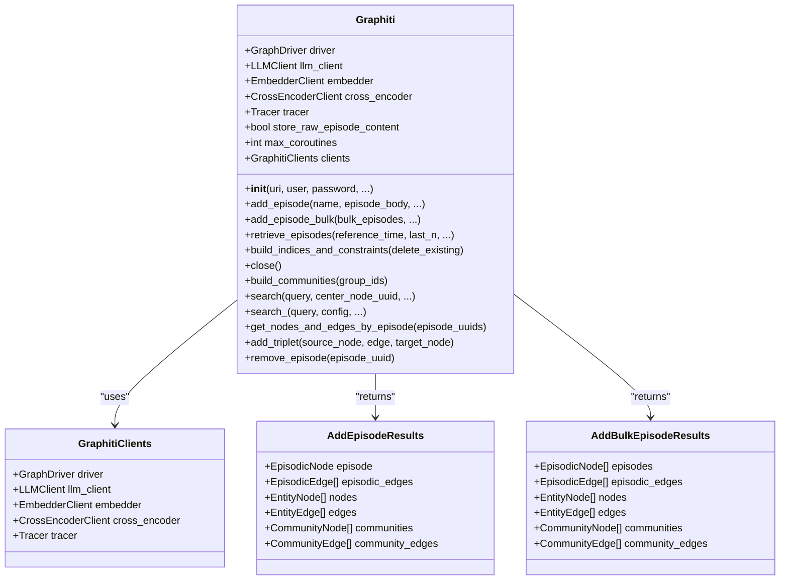
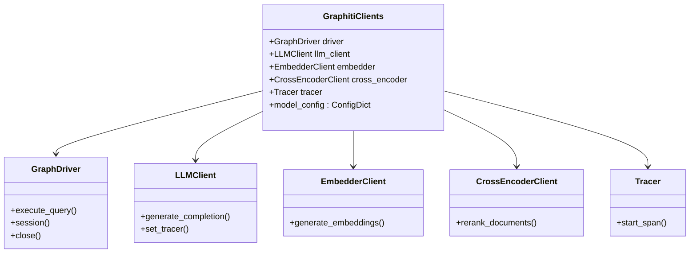

# Graphiti Class API Documentation

<cite>
**Referenced Files in This Document**
- [graphiti.py](file://graphiti_core/graphiti.py)
- [graphiti_types.py](file://graphiti_core/graphiti_types.py)
- [bulk_utils.py](file://graphiti_core/utils/bulk_utils.py)
- [tracer.py](file://graphiti_core/tracer.py)
- [quickstart_neo4j.py](file://examples/quickstart/quickstart_neo4j.py)
- [podcast_runner.py](file://examples/podcast/podcast_runner.py)
</cite>

## Table of Contents
1. [Introduction](#introduction)
2. [Class Overview](#class-overview)
3. [Initialization Parameters](#initialization-parameters)
4. [Public Methods](#public-methods)
5. [Return Types and Data Structures](#return-types-and-data-structures)
6. [GraphitiClients Container](#graphiticlients-container)
7. [Practical Examples](#practical-examples)
8. [Error Handling](#error-handling)
9. [Performance Considerations](#performance-considerations)
10. [Best Practices](#best-practices)

## Introduction

The Graphiti class serves as the main entry point for the Graphiti framework, providing a comprehensive interface for building and querying knowledge graphs from textual and structured data. It orchestrates interactions between various components including LLM clients, embedders, cross-encoders, graph drivers, and tracing systems to create, maintain, and query sophisticated knowledge graphs.

Graphiti specializes in extracting entities, relationships, and temporal information from unstructured text to build a connected knowledge graph that enables powerful semantic search and retrieval capabilities.

## Class Overview

The Graphiti class is designed as a comprehensive knowledge graph builder and searcher that processes episodes (textual or structured data) to extract entities and relationships, maintaining a persistent graph database representation.



**Diagram sources**
- [graphiti.py](file://graphiti_core/graphiti.py#L128-L234)
- [graphiti_types.py](file://graphiti_core/graphiti_types.py#L25-L32)

**Section sources**
- [graphiti.py](file://graphiti_core/graphiti.py#L128-L234)
- [graphiti_types.py](file://graphiti_core/graphiti_types.py#L25-L32)

## Initialization Parameters

The Graphiti constructor accepts numerous parameters that configure the framework's behavior and connect to various external services.

### Core Database Connection Parameters

| Parameter | Type | Default | Description |
|-----------|------|---------|-------------|
| `uri` | `str \| None` | `None` | The URI of the graph database (Neo4j by default). Required when `graph_driver` is not provided. |
| `user` | `str \| None` | `None` | Username for database authentication. |
| `password` | `str \| None` | `None` | Password for database authentication. |
| `graph_driver` | `GraphDriver \| None` | `None` | Custom graph driver instance. If not provided, defaults to Neo4jDriver. |

### AI/ML Service Parameters

| Parameter | Type | Default | Description |
|-----------|------|---------|-------------|
| `llm_client` | `LLMClient \| None` | `None` | Language model client for natural language processing. Defaults to OpenAIClient. |
| `embedder` | `EmbedderClient \| None` | `None` | Embedding service client for vector representations. Defaults to OpenAIEmbedder. |
| `cross_encoder` | `CrossEncoderClient \| None` | `None` | Reranking service client for result ranking. Defaults to OpenAIRerankerClient. |

### Operational Parameters

| Parameter | Type | Default | Description |
|-----------|------|---------|-------------|
| `store_raw_episode_content` | `bool` | `True` | Whether to store original episode content in the database. |
| `max_coroutines` | `int \| None` | `None` | Maximum concurrent operations. Overrides SEMAPHORE_LIMIT environment variable. |
| `tracer` | `Tracer \| None` | `None` | OpenTelemetry tracer for distributed tracing. Disabled when None. |
| `trace_span_prefix` | `str` | `'graphiti'` | Prefix for all trace span names. |

### Parameter Details and Default Behaviors

**Database Connection (`uri`, `user`, `password`, `graph_driver`)**:
- When `graph_driver` is provided, it takes precedence over individual connection parameters
- When `graph_driver` is None, defaults to Neo4jDriver with provided URI, user, and password
- Raises `ValueError` if neither `graph_driver` nor `uri` is provided

**AI Services (`llm_client`, `embedder`, `cross_encoder`)**:
- Each service has a default implementation if not explicitly provided
- OpenAI services are configured via environment variables (OPENAI_API_KEY)
- Services are automatically integrated with the tracer system

**Operational Settings (`store_raw_episode_content`, `max_coroutines`, `tracer`)**:
- `store_raw_episode_content`: Controls storage efficiency vs. content accessibility trade-off
- `max_coroutines`: Limits concurrent operations to prevent resource exhaustion
- `tracer`: Enables distributed tracing with OpenTelemetry integration

**Section sources**
- [graphiti.py](file://graphiti_core/graphiti.py#L128-L234)

## Public Methods

### add_episode Method

Processes a single episode and updates the knowledge graph with extracted entities and relationships.

```python
async def add_episode(
    self,
    name: str,
    episode_body: str,
    source_description: str,
    reference_time: datetime,
    source: EpisodeType = EpisodeType.message,
    group_id: str | None = None,
    uuid: str | None = None,
    update_communities: bool = False,
    entity_types: dict[str, type[BaseModel]] | None = None,
    excluded_entity_types: list[str] | None = None,
    previous_episode_uuids: list[str] | None = None,
    edge_types: dict[str, type[BaseModel]] | None = None,
    edge_type_map: dict[tuple[str, str], list[str]] | None = None,
) -> AddEpisodeResults
```

**Parameters**:
- `name`: Human-readable identifier for the episode
- `episode_body`: Content to be processed (text or JSON)
- `source_description`: Metadata about the episode's origin
- `reference_time`: Timestamp for temporal context
- `source`: Type of episode (text, JSON, message, etc.)
- `group_id`: Optional partition identifier for graph segmentation
- `uuid`: Optional explicit UUID for the episode
- `update_communities`: Whether to update community structures
- `entity_types`: Pydantic models for entity classification
- `excluded_entity_types`: Entity types to exclude from processing
- `previous_episode_uuids`: Explicit previous episode references
- `edge_types`: Pydantic models for relationship classification
- `edge_type_map`: Mapping of entity-to-entity relationship types

**Processing Steps**:
1. Validates entity and group configurations
2. Retrieves previous episode context
3. Creates or retrieves episode node
4. Extracts and resolves entities
5. Extracts and resolves relationships
6. Generates embeddings and saves to database
7. Updates communities if requested

**Returns**: [`AddEpisodeResults`](file://graphiti_core/graphiti.py#L105-L111) containing all processed graph elements

### add_episode_bulk Method

Processes multiple episodes in a single batch operation for improved efficiency.

```python
async def add_episode_bulk(
    self,
    bulk_episodes: list[RawEpisode],
    group_id: str | None = None,
    entity_types: dict[str, type[BaseModel]] | None = None,
    excluded_entity_types: list[str] | None = None,
    edge_types: dict[str, type[BaseModel]] | None = None,
    edge_type_map: dict[tuple[str, str], list[str]] | None = None,
) -> AddBulkEpisodeResults
```

**Parameters**:
- `bulk_episodes`: List of RawEpisode objects to process
- `group_id`: Optional group identifier
- `entity_types`: Entity type definitions
- `excluded_entity_types`: Entity types to exclude
- `edge_types`: Relationship type definitions
- `edge_type_map`: Relationship type mappings

**Key Differences from add_episode**:
- Processes multiple episodes atomically
- Performs deduplication across all episodes
- Optimized for throughput rather than individual episode quality
- Does not perform edge invalidation or date extraction

**Returns**: [`AddBulkEpisodeResults`](file://graphiti_core/graphiti.py#L114-L120) with consolidated results

### retrieve_episodes Method

Retrieves recent episodes from the knowledge graph based on temporal criteria.

```python
async def retrieve_episodes(
    self,
    reference_time: datetime,
    last_n: int = EPISODE_WINDOW_LEN,
    group_ids: list[str] | None = None,
    source: EpisodeType | None = None,
) -> list[EpisodicNode]
```

**Parameters**:
- `reference_time`: Reference timestamp for temporal filtering
- `last_n`: Number of recent episodes to retrieve
- `group_ids`: Optional group identifiers to filter by
- `source`: Optional episode type filter

**Returns**: List of [`EpisodicNode`](file://graphiti_core/nodes.py) objects ordered by recency

### build_indices_and_constraints Method

Sets up database schema optimizations for optimal query performance.

```python
async def build_indices_and_constraints(self, delete_existing: bool = False)
```

**Parameters**:
- `delete_existing`: Whether to clear existing indices before creation

**Purpose**: Creates database indices and constraints that optimize query performance for knowledge graph operations.

### close Method

Closes the database connection and releases resources.

```python
async def close(self)
```

**Purpose**: Safely terminates database connections and cleans up resources.

**Section sources**
- [graphiti.py](file://graphiti_core/graphiti.py#L611-L808)
- [graphiti.py](file://graphiti_core/graphiti.py#L814-L993)
- [graphiti.py](file://graphiti_core/graphiti.py#L577-L609)
- [graphiti.py](file://graphiti_core/graphiti.py#L289-L318)

## Return Types and Data Structures

### AddEpisodeResults

Contains all graph elements generated from processing a single episode.

```python
class AddEpisodeResults(BaseModel):
    episode: EpisodicNode          # The processed episode node
    episodic_edges: list[EpisodicEdge]  # Edges connecting to other episodes
    nodes: list[EntityNode]        # Extracted entities
    edges: list[EntityEdge]        # Extracted relationships
    communities: list[CommunityNode]    # Updated community nodes
    community_edges: list[CommunityEdge]  # Community relationships
```

**Components**:
- **episode**: Root node representing the processed episode
- **episodic_edges**: Temporal connections to related episodes
- **nodes**: Extracted entities with embeddings and attributes
- **edges**: Relationships between entities with fact embeddings
- **communities**: Clustered entity groups for higher-level understanding
- **community_edges**: Relationships between community clusters

### AddBulkEpisodeResults

Similar structure to AddEpisodeResults but for batch processing.

```python
class AddBulkEpisodeResults(BaseModel):
    episodes: list[EpisodicNode]
    episodic_edges: list[EpisodicEdge]
    nodes: list[EntityNode]
    edges: list[EntityEdge]
    communities: list[CommunityNode]
    community_edges: list[CommunityEdge]
```

### RawEpisode

Structure for bulk episode processing.

```python
class RawEpisode(BaseModel):
    name: str
    uuid: str | None = Field(default=None)
    content: str
    source_description: str
    source: EpisodeType
    reference_time: datetime
```

**Section sources**
- [graphiti.py](file://graphiti_core/graphiti.py#L105-L120)
- [bulk_utils.py](file://graphiti_core/utils/bulk_utils.py#L100-L106)

## GraphitiClients Container

The GraphitiClients class serves as a centralized container that coordinates interactions between all framework components.



**Diagram sources**
- [graphiti_types.py](file://graphiti_core/graphiti_types.py#L25-L32)

### Component Responsibilities

**GraphDriver**: Handles all database operations including queries, sessions, and connection management.

**LLMClient**: Provides natural language processing capabilities for entity and relationship extraction.

**EmbedderClient**: Generates vector embeddings for semantic similarity operations.

**CrossEncoderClient**: Reranks search results for improved relevance.

**Tracer**: Coordinates distributed tracing across all operations.

### Integration Pattern

The GraphitiClients container follows the Facade pattern, providing a unified interface to all framework components while maintaining loose coupling between them. This design enables:

- **Consistent Configuration**: All components share the same tracer instance
- **Resource Management**: Centralized lifecycle management
- **Error Propagation**: Consistent error handling across components
- **Performance Monitoring**: Unified tracing and telemetry collection

**Section sources**
- [graphiti_types.py](file://graphiti_core/graphiti_types.py#L25-L32)

## Practical Examples

### Basic Initialization and Usage

```python
import asyncio
from datetime import datetime
from graphiti_core import Graphiti
from graphiti_core.nodes import EpisodeType

async def basic_usage():
    # Initialize Graphiti with Neo4j connection
    graphiti = Graphiti(
        uri="bolt://localhost:7687",
        user="neo4j",
        password="password"
    )
    
    try:
        # Set up database indices
        await graphiti.build_indices_and_constraints()
        
        # Add a simple text episode
        result = await graphiti.add_episode(
            name="Example Episode",
            episode_body="John Doe works at Acme Corp as a software engineer.",
            source_description="Sample text",
            reference_time=datetime.now(),
            source=EpisodeType.text
        )
        
        # Access processed results
        print(f"Processed {len(result.nodes)} entities")
        print(f"Found {len(result.edges)} relationships")
        
    finally:
        await graphiti.close()
```

### Custom Driver and Clients Configuration

```python
from graphiti_core import Graphiti
from graphiti_core.driver.neo4j_driver import Neo4jDriver
from graphiti_core.llm_client.openai_client import OpenAIClient
from graphiti_core.embedder.openai import OpenAIEmbedder
from graphiti_core.cross_encoder.openai_reranker_client import OpenAIRerankerClient

async def custom_configuration():
    # Create custom clients
    custom_llm = OpenAIClient(api_key="custom-key")
    custom_embedder = OpenAIEmbedder(model="text-embedding-3-large")
    custom_cross_encoder = OpenAIRerankerClient(model="rerank-3")
    
    # Initialize with custom components
    graphiti = Graphiti(
        uri="bolt://localhost:7687",
        user="neo4j",
        password="password",
        llm_client=custom_llm,
        embedder=custom_embedder,
        cross_encoder=custom_cross_encoder,
        store_raw_episode_content=False,  # Save space
        max_coroutines=10  # Limit concurrency
    )
    
    # Use graphiti...
    await graphiti.close()
```

### Bulk Processing Example

```python
from graphiti_core.utils.bulk_utils import RawEpisode
from graphiti_core.nodes import EpisodeType

async def bulk_processing():
    graphiti = Graphiti("bolt://localhost:7687", "neo4j", "password")
    
    # Prepare bulk episodes
    episodes = [
        RawEpisode(
            name=f"Message {i}",
            content=f"Episode content {i}",
            reference_time=datetime.now(),
            source=EpisodeType.message,
            source_description="Bulk processing test"
        )
        for i in range(100)
    ]
    
    try:
        # Process all episodes in bulk
        results = await graphiti.add_episode_bulk(
            bulk_episodes=episodes,
            group_id="test-group",
            entity_types={
                "Person": PersonEntityType,
                "Organization": OrganizationEntityType
            },
            edge_types={
                "WORKS_FOR": WorksForRelationship,
                "KNOWS": KnowsRelationship
            }
        )
        
        print(f"Bulk processed {len(results.episodes)} episodes")
        print(f"Generated {len(results.nodes)} entities")
        print(f"Created {len(results.edges)} relationships")
        
    finally:
        await graphiti.close()
```

### Advanced Search with Filtering

```python
from graphiti_core.search.search_config_recipes import NODE_HYBRID_SEARCH_RRF

async def advanced_search():
    graphiti = Graphiti("bolt://localhost:7687", "neo4j", "password")
    
    try:
        # Configure search with custom limits
        search_config = NODE_HYBRID_SEARCH_RRF.model_copy(deep=True)
        search_config.limit = 10
        
        # Execute advanced search
        results = await graphiti.search_(
            query="California Governor",
            config=search_config,
            group_ids=["main-group"],
            search_filter=SearchFilters(
                node_labels=["Person"],
                edge_types=["IS_GOVERNOR_OF"]
            )
        )
        
        # Process results
        for node in results.nodes:
            print(f"Found: {node.name} - {node.summary}")
            
        for edge in results.edges:
            print(f"Relationship: {edge.fact}")
            
    finally:
        await graphiti.close()
```

**Section sources**
- [quickstart_neo4j.py](file://examples/quickstart/quickstart_neo4j.py#L57-L238)
- [podcast_runner.py](file://examples/podcast/podcast_runner.py#L78-L129)

## Error Handling

### Common Exceptions and Scenarios

**Database Connection Errors**:
- `ValueError`: Raised when required parameters are missing
- Connection failures: Handled by driver implementations
- Authentication errors: Propagated from database layer

**Processing Errors**:
- `ValidationError`: Invalid input data formats
- `TimeoutError`: Long-running operations exceed limits
- `MemoryError`: Insufficient system resources

**Method-Specific Errors**:

**add_episode**:
- Entity extraction failures
- Embedding generation timeouts
- Database constraint violations
- Concurrent operation conflicts

**add_episode_bulk**:
- Batch processing failures
- Memory exhaustion during bulk operations
- Partial failure recovery

**retrieve_episodes**:
- Query execution timeouts
- Permission denied errors
- Schema migration issues

### Error Recovery Strategies

```python
import asyncio
from graphiti_core.errors import GraphitiError

async def robust_processing():
    graphiti = Graphiti("bolt://localhost:7687", "neo4j", "password")
    
    try:
        # Attempt operation with retry logic
        for attempt in range(3):
            try:
                result = await graphiti.add_episode(...)
                break
            except GraphitiError as e:
                if attempt == 2:
                    raise
                await asyncio.sleep(2 ** attempt)  # Exponential backoff
        
        # Process results
        if result.nodes:
            # Continue with successful processing
            pass
            
    except Exception as e:
        # Log and handle unexpected errors
        logger.error(f"Processing failed: {e}")
        # Implement fallback strategies
    finally:
        await graphiti.close()
```

### Tracing and Debugging

The Graphiti class integrates with OpenTelemetry for comprehensive error tracking and debugging:

```python
from opentelemetry import trace

# Enable tracing
tracer = trace.get_tracer(__name__)

graphiti = Graphiti(
    uri="bolt://localhost:7687",
    user="neo4j",
    password="password",
    tracer=tracer,
    trace_span_prefix="myapp.graphiti"
)

# All operations will be traced with automatic error reporting
```

**Section sources**
- [graphiti.py](file://graphiti_core/graphiti.py#L809-L814)
- [graphiti.py](file://graphiti_core/graphiti.py#L991-L994)

## Performance Considerations

### Concurrency Management

The `max_coroutines` parameter controls concurrent operation limits to prevent resource exhaustion:

- **Default Behavior**: Uses environment variable SEMAPHORE_LIMIT or framework defaults
- **Recommended Values**: 5-20 for production environments
- **High Load**: Consider reducing for memory-constrained systems

### Memory Optimization

**Storage Efficiency**:
- Disable `store_raw_episode_content` for space-constrained deployments
- Use appropriate embedding models for accuracy vs. speed trade-offs

**Batch Processing**:
- Use `add_episode_bulk` for processing multiple episodes
- Consider chunking large datasets for memory management

### Database Performance

**Index Management**:
- Run `build_indices_and_constraints` once during setup
- Monitor index maintenance overhead during heavy write loads

**Query Optimization**:
- Use appropriate group IDs for data partitioning
- Implement search result caching for frequently accessed queries

### Resource Monitoring

```python
import psutil
import asyncio

async def monitor_resources():
    # Monitor system resources during processing
    cpu_percent = psutil.cpu_percent()
    memory_gb = psutil.virtual_memory().used / (1024 ** 3)
    
    if cpu_percent > 80 or memory_gb > 16:
        # Reduce concurrency or pause processing
        logger.warning(f"High resource usage: CPU {cpu_percent}%, Memory {memory_gb:.1f}GB")
```

## Best Practices

### Initialization Best Practices

1. **Environment Configuration**: Always use environment variables for sensitive credentials
2. **Resource Limits**: Set appropriate `max_coroutines` based on system capacity
3. **Tracing Setup**: Enable tracing for production monitoring
4. **Graceful Shutdown**: Always call `close()` to release resources

### Data Processing Guidelines

1. **Sequential Processing**: Process episodes sequentially to maintain temporal consistency
2. **Error Handling**: Implement robust error handling for production deployments
3. **Validation**: Validate input data before processing
4. **Monitoring**: Track processing metrics and error rates

### Search and Retrieval

1. **Appropriate Search**: Choose between `search()` and `search_()` based on requirements
2. **Filtering**: Use search filters to reduce result sets
3. **Pagination**: Implement pagination for large result sets
4. **Caching**: Cache frequently accessed search results

### Production Deployment

1. **Connection Pooling**: Use connection pooling for high-throughput applications
2. **Load Balancing**: Distribute processing across multiple Graphiti instances
3. **Backup Strategy**: Implement regular database backups
4. **Monitoring**: Set up comprehensive monitoring and alerting

**Section sources**
- [graphiti.py](file://graphiti_core/graphiti.py#L196-L234)
- [tracer.py](file://graphiti_core/tracer.py#L159-L194)