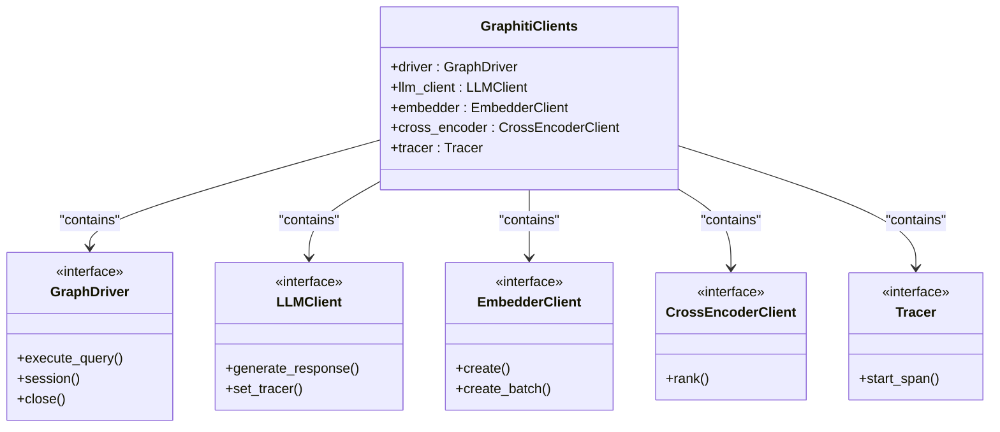
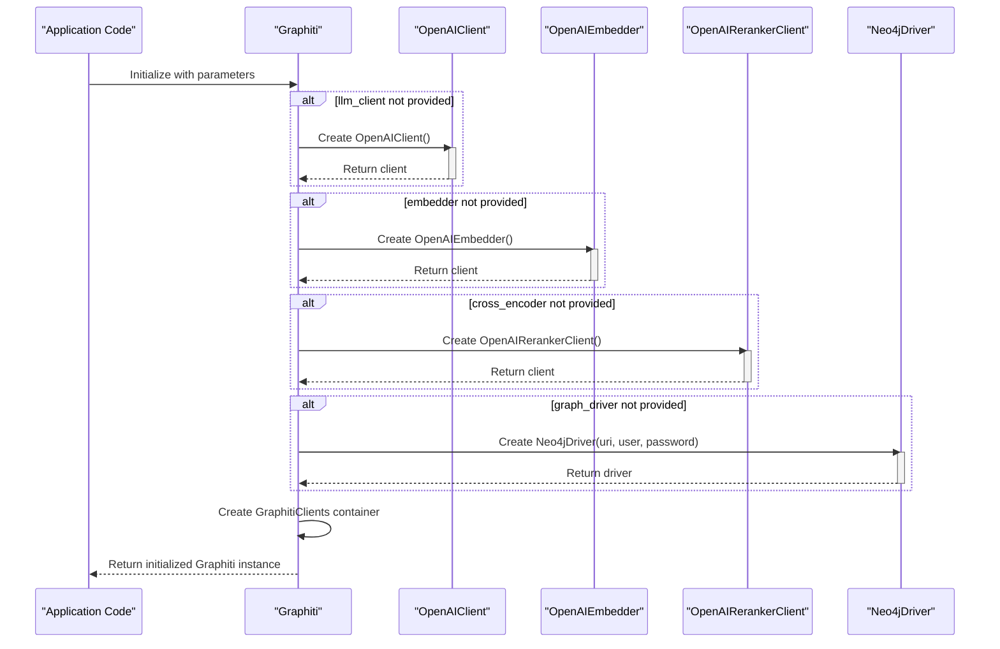
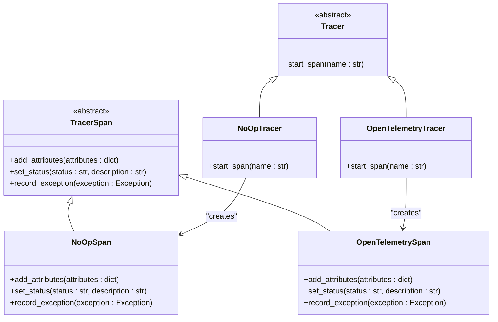

# Initialization

<cite>
**Referenced Files in This Document**   
- [graphiti.py](file://graphiti_core/graphiti.py)
- [graphiti_types.py](file://graphiti_core/graphiti_types.py)
- [tracer.py](file://graphiti_core/tracer.py)
- [neo4j_driver.py](file://graphiti_core/driver/neo4j_driver.py)
- [openai_client.py](file://graphiti_core/llm_client/openai_client.py)
- [openai.py](file://graphiti_core/embedder/openai.py)
- [openai_reranker_client.py](file://graphiti_core/cross_encoder/openai_reranker_client.py)
- [README.md](file://README.md)
- [OTEL_TRACING.md](file://OTEL_TRACING.md)
- [quickstart/README.md](file://examples/quickstart/README.md)
</cite>

## Table of Contents
1. [Introduction](#introduction)
2. [Parameter Details](#parameter-details)
3. [GraphitiClients Container](#graphiticlients-container)
4. [Default Client Instantiation](#default-client-instantiation)
5. [Initialization Examples](#initialization-examples)
6. [Error Conditions](#error-conditions)
7. [Tracing and Telemetry](#tracing-and-telemetry)

## Introduction
The `Graphiti` class initialization method (`__init__`) provides a comprehensive interface for configuring a knowledge graph system with various components for LLM processing, embedding, reranking, graph storage, and distributed tracing. This documentation details each parameter, their default behaviors, and how the system constructs its component container when clients are not explicitly provided. The initialization supports flexible configuration for different deployment scenarios, from simple local development to production environments with custom drivers and tracing.

**Section sources**
- [graphiti.py](file://graphiti_core/graphiti.py#L128-L235)

## Parameter Details
The `Graphiti` class initialization accepts several parameters that control its behavior and component configuration:

- **uri**: The URI of the graph database. Required when `graph_driver` is not provided. Used to establish connection to Neo4j or other supported databases.
- **user**: The username for authenticating with the graph database. Optional, as some databases may not require authentication.
- **password**: The password for authenticating with the graph database. Optional, as some databases may not require authentication.
- **llm_client**: An instance of `LLMClient` for natural language processing tasks. If not provided, a default `OpenAIClient` is initialized.
- **embedder**: An instance of `EmbedderClient` for embedding tasks. If not provided, a default `OpenAIEmbedder` is initialized.
- **cross_encoder**: An instance of `CrossEncoderClient` for reranking tasks. If not provided, a default `OpenAIRerankerClient` is initialized.
- **store_raw_episode_content**: A boolean flag indicating whether to store the raw content of episodes. Defaults to `True`.
- **graph_driver**: An instance of `GraphDriver` for database operations. If not provided, a default `Neo4jDriver` is initialized using the `uri`, `user`, and `password` parameters.
- **max_coroutines**: The maximum number of concurrent operations allowed. Overrides the `SEMAPHORE_LIMIT` set in the environment. If not set, the Graphiti default is used.
- **tracer**: An OpenTelemetry tracer instance for distributed tracing. If not provided, tracing is disabled (no-op).
- **trace_span_prefix**: A string prefix to prepend to all span names. Defaults to 'graphiti'.

These parameters allow for flexible configuration of the Graphiti instance, enabling integration with different LLM providers, embedding services, and graph databases.

**Section sources**
- [graphiti.py](file://graphiti_core/graphiti.py#L131-L141)

## GraphitiClients Container
The `GraphitiClients` container is a Pydantic model that holds references to all the core components used by the Graphiti system. It is constructed during initialization and provides a unified interface for accessing the various clients and drivers. The container includes:

- **driver**: Reference to the `GraphDriver` instance for database operations
- **llm_client**: Reference to the `LLMClient` instance for language model interactions
- **embedder**: Reference to the `EmbedderClient` instance for embedding generation
- **cross_encoder**: Reference to the `CrossEncoderClient` instance for reranking operations
- **tracer**: Reference to the `Tracer` instance for distributed tracing

The container is created with `arbitrary_types_allowed=True` in its configuration, allowing it to hold instances of classes that are not Pydantic models. This container serves as a dependency injection mechanism, making the components easily accessible throughout the system while maintaining type safety.



**Diagram sources **
- [graphiti_types.py](file://graphiti_core/graphiti_types.py#L26-L34)
- [graphiti.py](file://graphiti_core/graphiti.py#L226-L232)

**Section sources**
- [graphiti_types.py](file://graphiti_core/graphiti_types.py#L26-L34)

## Default Client Instantiation
When specific clients are not provided during initialization, Graphiti automatically instantiates default implementations:

- **LLM Client**: If no `llm_client` is provided, a default `OpenAIClient` is created. This client requires the `OPENAI_API_KEY` environment variable to be set. The `OpenAIClient` uses OpenAI's API for language model interactions, with configurable model, temperature, and other parameters.

- **Embedder**: If no `embedder` is provided, a default `OpenAIEmbedder` is instantiated. This uses OpenAI's embedding API with the default model `text-embedding-3-small`. The embedder generates vector representations of text for semantic search and similarity calculations.

- **Cross Encoder**: If no `cross_encoder` is provided, a default `OpenAIRerankerClient` is created. This client uses OpenAI's API to perform reranking of search results by evaluating the relevance of passages to a query using log-probabilities from a language model.

- **Graph Driver**: If no `graph_driver` is provided, a default `Neo4jDriver` is initialized using the provided `uri`, `user`, and `password`. The driver establishes a connection to a Neo4j database and handles all database operations.

These default clients are designed to work out of the box with minimal configuration, while still allowing for customization through environment variables or explicit parameter configuration.



**Diagram sources **
- [graphiti.py](file://graphiti_core/graphiti.py#L207-L218)
- [openai_client.py](file://graphiti_core/llm_client/openai_client.py#L38-L64)
- [openai.py](file://graphiti_core/embedder/openai.py#L40-L52)
- [openai_reranker_client.py](file://graphiti_core/cross_encoder/openai_reranker_client.py#L35-L59)
- [neo4j_driver.py](file://graphiti_core/driver/neo4j_driver.py#L32-L46)

**Section sources**
- [graphiti.py](file://graphiti_core/graphiti.py#L207-L218)

## Initialization Examples
Here are examples demonstrating different initialization patterns for the Graphiti class:

### Basic Initialization with Environment Variables
```python
from graphiti_core import Graphiti

# Requires OPENAI_API_KEY environment variable
graphiti = Graphiti(
    uri="bolt://localhost:7687",
    user="neo4j",
    password="password"
)
```

### Custom Driver Initialization
```python
from graphiti_core import Graphiti
from graphiti_core.driver.neo4j_driver import Neo4jDriver

# Custom driver with specific database
custom_driver = Neo4jDriver(
    uri="bolt://localhost:7687",
    user="neo4j",
    password="password",
    database="my_custom_db"
)

graphiti = Graphiti(graph_driver=custom_driver)
```

### Custom Clients Initialization
```python
from graphiti_core import Graphiti
from graphiti_core.llm_client.openai_client import OpenAIClient
from graphiti_core.embedder.openai import OpenAIEmbedder
from graphiti_core.cross_encoder.openai_reranker_client import OpenAIRerankerClient

# Custom clients with specific configurations
llm_client = OpenAIClient(config=LLMConfig(model="gpt-4"))
embedder = OpenAIEmbedder(config=OpenAIEmbedderConfig(embedding_model="text-embedding-ada-002"))
reranker = OpenAIRerankerClient(config=LLMConfig(model="gpt-3.5-turbo"))

graphiti = Graphiti(
    uri="bolt://localhost:7687",
    user="neo4j",
    password="password",
    llm_client=llm_client,
    embedder=embedder,
    cross_encoder=reranker
)
```

### Initialization with Tracing
```python
from opentelemetry import trace
from opentelemetry.sdk.trace import TracerProvider
from opentelemetry.sdk.trace.export import ConsoleSpanExporter, SimpleSpanProcessor
from graphiti_core import Graphiti

# Set up OpenTelemetry
provider = TracerProvider()
provider.add_span_processor(SimpleSpanProcessor(ConsoleSpanExporter()))
trace.set_tracer_provider(provider)

tracer = trace.get_tracer(__name__)
graphiti = Graphiti(
    uri="bolt://localhost:7687",
    user="neo4j",
    password="password",
    tracer=tracer,
    trace_span_prefix="myapp.graphiti"
)
```

**Section sources**
- [README.md](file://README.md#L116-L200)
- [quickstart/README.md](file://examples/quickstart/README.md#L27-L70)
- [OTEL_TRACING.md](file://OTEL_TRACING.md#L13-L32)

## Error Conditions
The Graphiti initialization has specific error conditions that must be handled:

- **Missing URI with No Graph Driver**: When `graph_driver` is `None`, the `uri` parameter must be provided. If `uri` is `None` in this case, a `ValueError` is raised with the message "uri must be provided when graph_driver is None". This ensures that there is always a valid way to connect to the graph database.

- **Missing OpenAI API Key**: When using the default `OpenAIClient`, `OpenAIEmbedder`, or `OpenAIRerankerClient`, the `OPENAI_API_KEY` environment variable must be set. If this key is missing, the initialization will fail when attempting to make API calls, though the initialization itself may succeed.

- **Invalid Database Credentials**: If the provided `uri`, `user`, and `password` are incorrect or the database is unreachable, the `Neo4jDriver` initialization will fail, typically raising a connection error from the Neo4j driver.

- **Missing Required Dependencies**: For certain features like tracing or specific database drivers, required packages must be installed. For example, OpenTelemetry tracing requires the `opentelemetry-api` package, and using FalkorDB requires the `falkordb` package.

These error conditions ensure that the Graphiti instance is properly configured before use, preventing runtime errors due to missing components or invalid configurations.

**Section sources**
- [graphiti.py](file://graphiti_core/graphiti.py#L201-L203)

## Tracing and Telemetry
The tracer parameter plays a crucial role in distributed telemetry for monitoring and debugging Graphiti operations:

- **Tracer Initialization**: The `tracer` parameter accepts an OpenTelemetry tracer instance. If not provided, a no-op tracer is used, effectively disabling tracing with zero overhead.

- **Span Prefix**: The `trace_span_prefix` parameter allows customization of span names, with a default value of 'graphiti'. This prefix is prepended to all span names, making it easier to identify Graphiti-related operations in tracing systems.

- **Propagation to Components**: The tracer is propagated to all components through the `GraphitiClients` container. The LLM client, in particular, has its tracer set explicitly during initialization, ensuring that LLM operations are properly traced.

- **Telemetry Events**: The initialization process captures a telemetry event named 'graphiti_initialized' with properties including the provider types for LLM, embedder, reranker, and database components. This provides visibility into the configuration of the Graphiti instance.

- **Error Handling**: The tracing system is designed to be resilient, with try-except blocks that silently handle telemetry errors, ensuring that tracing issues do not affect the core functionality of the system.

The tracing implementation uses an abstract base class pattern with `Tracer` and `TracerSpan` interfaces, allowing for different tracing backends while maintaining a consistent API. The OpenTelemetry wrapper handles the integration with the OpenTelemetry SDK, including proper span naming and attribute setting.



**Diagram sources **
- [tracer.py](file://graphiti_core/tracer.py#L52-L82)
- [tracer.py](file://graphiti_core/tracer.py#L126-L157)
- [tracer.py](file://graphiti_core/tracer.py#L33-L50)

**Section sources**
- [tracer.py](file://graphiti_core/tracer.py#L159-L193)
- [graphiti.py](file://graphiti_core/graphiti.py#L221-L225)