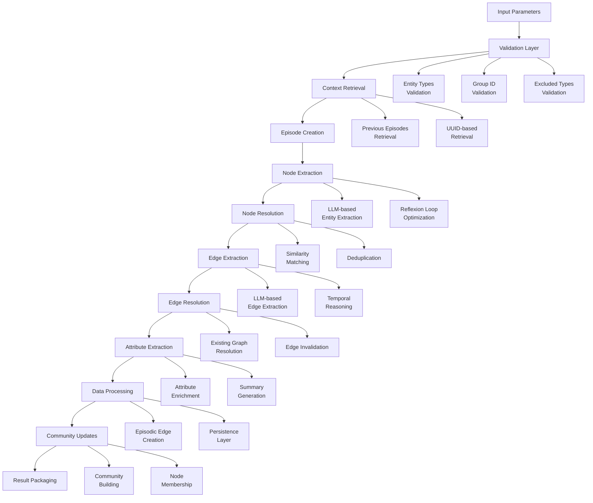
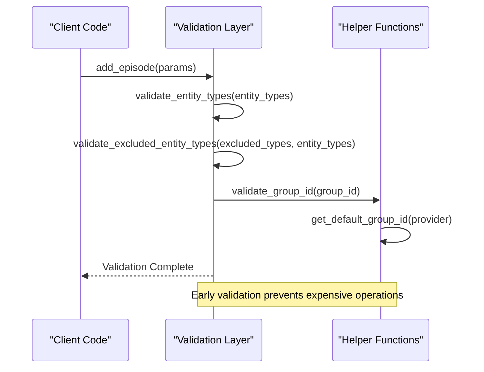
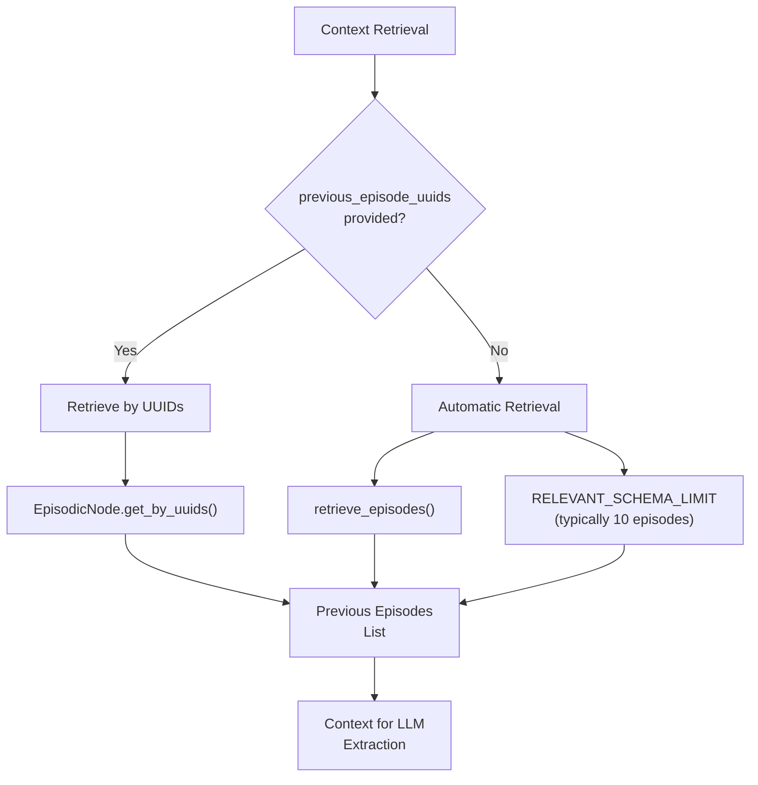
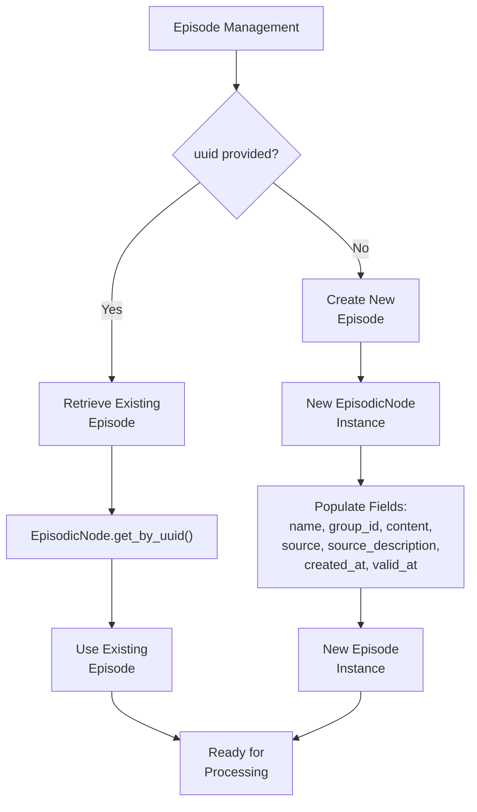
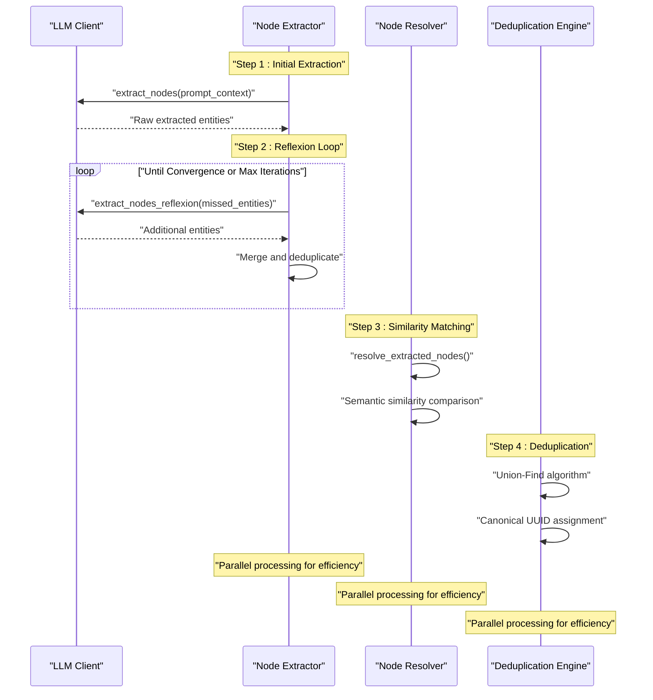
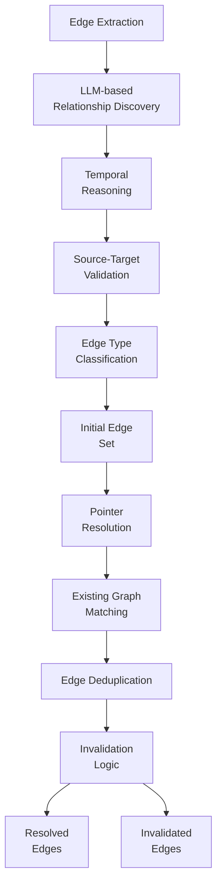
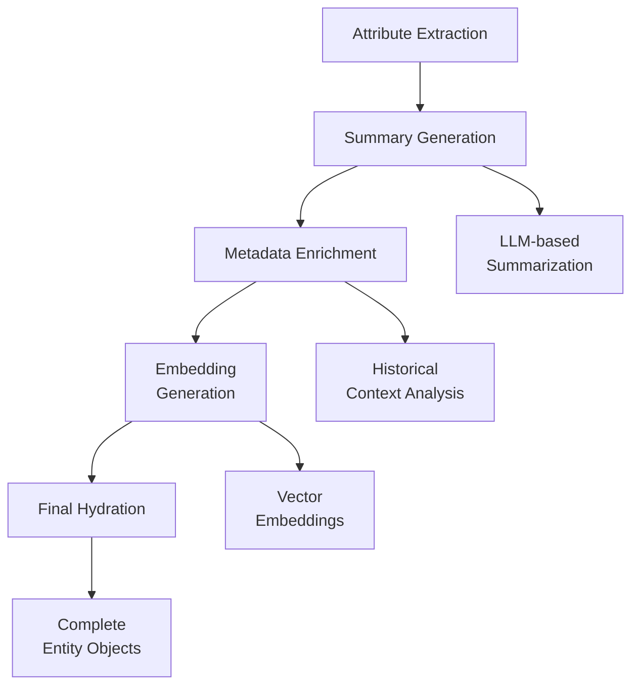
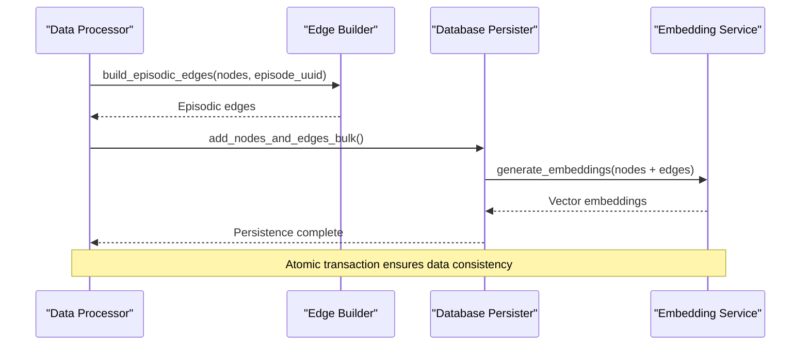
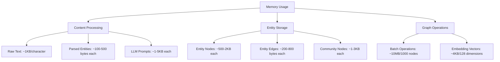
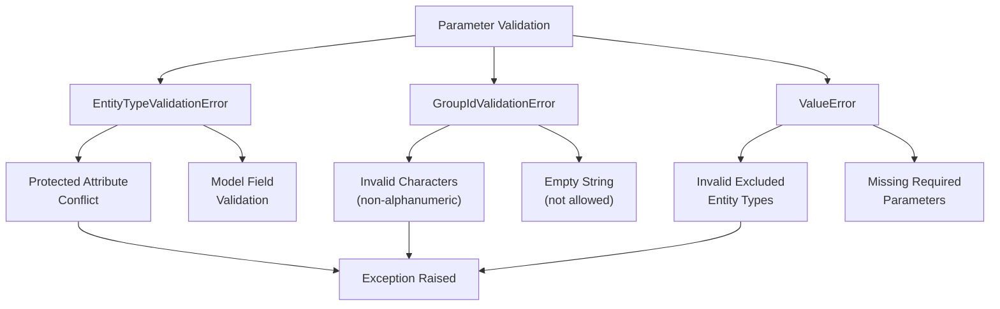

# add_episode Method API Documentation

<cite>
**Referenced Files in This Document**
- [graphiti.py](file://graphiti_core/graphiti.py)
- [node_operations.py](file://graphiti_core/utils/maintenance/node_operations.py)
- [edge_operations.py](file://graphiti_core/utils/maintenance/edge_operations.py)
- [nodes.py](file://graphiti_core/nodes.py)
- [edges.py](file://graphiti_core/edges.py)
- [helpers.py](file://graphiti_core/helpers.py)
- [entity_types_utils.py](file://graphiti_core/utils/ontology_utils/entity_types_utils.py)
- [errors.py](file://graphiti_core/errors.py)
- [ingest.py](file://server/graph_service/dto/ingest.py)
- [ingest.py](file://server/graph_service/routers/ingest.py)
- [podcast_runner.py](file://examples/podcast/podcast_runner.py)
- [runner.py](file://examples/wizard_of_oz/runner.py)
</cite>

## Table of Contents
1. [Introduction](#introduction)
2. [Method Signature and Parameters](#method-signature-and-parameters)
3. [Workflow Architecture](#workflow-architecture)
4. [Detailed Parameter Documentation](#detailed-parameter-documentation)
5. [Processing Workflow](#processing-workflow)
6. [Return Value: AddEpisodeResults](#return-value-addepisoderesults)
7. [Practical Examples](#practical-examples)
8. [Performance Considerations](#performance-considerations)
9. [Integration with Background Systems](#integration-with-background-systems)
10. [Error Handling and Validation](#error-handling-and-validation)
11. [Best Practices](#best-practices)

## Introduction

The `add_episode` method is the primary data ingestion function in Graphiti, responsible for processing textual content and extracting meaningful entities, relationships, and temporal information to populate a knowledge graph. This method serves as the core interface for ingesting new information into the system, transforming unstructured text into structured graph data through sophisticated natural language processing and machine learning techniques.

The method orchestrates a complex workflow involving entity extraction, relationship discovery, temporal reasoning, embedding generation, and database persistence, all while maintaining data integrity and optimizing for performance in production environments.

## Method Signature and Parameters

```python
async def add_episode(
    self,
    name: str,
    episode_body: str,
    source_description: str,
    reference_time: datetime,
    source: EpisodeType = EpisodeType.message,
    group_id: str | None = None,
    uuid: str | None = None,
    update_communities: bool = False,
    entity_types: dict[str, type[BaseModel]] | None = None,
    excluded_entity_types: list[str] | None = None,
    previous_episode_uuids: list[str] | None = None,
    edge_types: dict[str, type[BaseModel]] | None = None,
    edge_type_map: dict[tuple[str, str], list[str]] | None = None,
) -> AddEpisodeResults
```

**Section sources**
- [graphiti.py](file://graphiti_core/graphiti.py#L610-L626)

## Workflow Architecture

The `add_episode` method follows a sophisticated multi-stage processing pipeline that ensures high-quality knowledge graph construction:



**Diagram sources**
- [graphiti.py](file://graphiti_core/graphiti.py#L692-L812)

## Detailed Parameter Documentation

### Core Content Parameters

#### `name: str`
- **Purpose**: Human-readable identifier for the episode
- **Constraints**: Must be non-empty string
- **Usage**: Used for display purposes and episode identification
- **Example**: `"Customer Support Chat 123"`

#### `episode_body: str`
- **Purpose**: The actual content to be processed
- **Constraints**: Must be non-empty string
- **Content Types**: Supports plain text, JSON, and structured messages
- **Length**: No explicit limit, but performance degrades with extremely large content (>1MB)
- **Example**: `"User: Hi, I need help with my order. Agent: Sure, can you provide your order number?"`

#### `source_description: str`
- **Purpose**: Description of where the content originated
- **Usage**: Helps with filtering and metadata organization
- **Example**: `"Customer Support Chat Transcript"`

#### `reference_time: datetime`
- **Purpose**: Temporal anchor for the episode
- **Constraints**: Must be valid datetime object
- **Timezone**: UTC recommended for consistency
- **Importance**: Determines episode ordering and temporal relationships
- **Example**: `datetime.now(timezone.utc)`

### Source Type Configuration

#### `source: EpisodeType = EpisodeType.message`
- **Options**: `EpisodeType.message`, `EpisodeType.text`, `EpisodeType.json`
- **Behavior**: Determines parsing strategy and prompt templates
- **Default**: `EpisodeType.message` for chat-like content
- **Impact**: Affects how entities and relationships are extracted

### Partitioning and Identification

#### `group_id: str | None = None`
- **Purpose**: Logical partitioning of the knowledge graph
- **Validation**: Must contain only alphanumeric characters, dashes, or underscores
- **Default**: Uses provider-specific default (empty string for most providers)
- **Use Cases**: Multi-tenant scenarios, topic separation, environment isolation
- **Example**: `"customer_support"`, `"product_database"`

#### `uuid: str | None = None`
- **Purpose**: Unique identifier for the episode
- **Behavior**: If provided, retrieves existing episode; otherwise creates new
- **Use Cases**: Idempotent operations, episode updates, deduplication
- **Format**: UUID string format
- **Example**: `"550e8400-e29b-41d4-a716-446655440000"`

### Advanced Configuration

#### `update_communities: bool = False`
- **Purpose**: Enable community detection and clustering
- **Performance Impact**: Significantly increases processing time
- **Use Cases**: Social network analysis, topic discovery, relationship grouping
- **Cost**: Additional LLM calls and computational overhead
- **Default**: `False` for optimal performance

#### `entity_types: dict[str, type[BaseModel]] | None = None`
- **Purpose**: Custom entity type definitions
- **Structure**: Maps entity type names to Pydantic model classes
- **Validation**: Prevents conflicts with protected attributes
- **Example**: `{'Person': PersonModel, 'Organization': OrganizationModel}`
- **Benefits**: Enables domain-specific entity recognition

#### `excluded_entity_types: list[str] | None = None`
- **Purpose**: Exclude specific entity types from processing
- **Validation**: Must be subset of available entity types
- **Special Case**: `'Entity'` excludes default entity type
- **Example**: `['Location', 'Date']`
- **Use Cases**: Performance optimization, noise reduction

#### `previous_episode_uuids: list[str] | None = None`
- **Purpose**: Specify previous episodes for context
- **Alternative**: If `None`, automatically retrieves recent episodes
- **Use Cases**: Batch processing, historical context preservation
- **Performance**: Reduces LLM context length when specified

#### `edge_types: dict[str, type[BaseModel]] | None = None`
- **Purpose**: Custom edge type definitions
- **Structure**: Maps edge type names to Pydantic models
- **Relationship**: Works with `edge_type_map` for fine-grained control
- **Example**: `{'WORKS_FOR': EmploymentModel}`

#### `edge_type_map: dict[tuple[str, str], list[str]] | None = None`
- **Purpose**: Control edge extraction granularity
- **Structure**: Maps (source_type, target_type) tuples to edge type lists
- **Default**: `{('Entity', 'Entity'): list(edge_types.keys())}`
- **Example**: `{('Person', 'Entity'): ['KNOWS', 'WORKS_WITH']}`
- **Granularity**: Enables fine-tuned relationship extraction

**Section sources**
- [graphiti.py](file://graphiti_core/graphiti.py#L610-L626)
- [helpers.py](file://graphiti_core/helpers.py#L119-L142)
- [entity_types_utils.py](file://graphiti_core/utils/ontology_utils/entity_types_utils.py#L23-L37)

## Processing Workflow

### Stage 1: Validation and Setup

The method begins with comprehensive parameter validation:



**Diagram sources**
- [graphiti.py](file://graphiti_core/graphiti.py#L685-L690)
- [helpers.py](file://graphiti_core/helpers.py#L119-L142)

### Stage 2: Context Retrieval

The system retrieves relevant historical context for improved extraction accuracy:



**Diagram sources**
- [graphiti.py](file://graphiti_core/graphiti.py#L694-L704)

### Stage 3: Episode Management

The method handles both new episode creation and existing episode updates:



**Diagram sources**
- [graphiti.py](file://graphiti_core/graphiti.py#L706-L720)

### Stage 4: Node Extraction and Resolution

The core NLP processing occurs here, involving multiple sophisticated steps:



**Diagram sources**
- [node_operations.py](file://graphiti_core/utils/maintenance/node_operations.py#L88-L200)

### Stage 5: Edge Extraction and Resolution

Relationship extraction follows a similar pattern with temporal reasoning:



**Diagram sources**
- [edge_operations.py](file://graphiti_core/utils/maintenance/edge_operations.py#L89-L200)

### Stage 6: Attribute Enrichment

The system enhances extracted entities with additional information:



**Diagram sources**
- [node_operations.py](file://graphiti_core/utils/maintenance/node_operations.py#L200-L300)

### Stage 7: Database Persistence

The final stage saves all processed data to the graph database:



**Diagram sources**
- [graphiti.py](file://graphiti_core/graphiti.py#L759-L764)

**Section sources**
- [graphiti.py](file://graphiti_core/graphiti.py#L692-L812)
- [node_operations.py](file://graphiti_core/utils/maintenance/node_operations.py#L88-L200)
- [edge_operations.py](file://graphiti_core/utils/maintenance/edge_operations.py#L89-L200)

## Return Value: AddEpisodeResults

The `add_episode` method returns an `AddEpisodeResults` object containing all processed data:

```python
class AddEpisodeResults(BaseModel):
    episode: EpisodicNode          # The processed episode
    episodic_edges: list[EpisodicEdge]  # Episode-entity relationships
    nodes: list[EntityNode]        # Extracted entities
    edges: list[EntityEdge]        # Extracted relationships
    communities: list[CommunityNode] # Generated communities (if enabled)
    community_edges: list[CommunityEdge] # Community membership edges
```

### Component Details

#### `episode: EpisodicNode`
- **Purpose**: The processed episode with enriched metadata
- **Properties**: Contains original content, timestamps, and processing metadata
- **Usage**: Query episode-specific information and relationships

#### `episodic_edges: list[EpisodicEdge]`
- **Purpose**: Links the episode to all extracted entities
- **Structure**: One edge per entity connected to the episode
- **Use Cases**: Episode-entity browsing, content analysis

#### `nodes: list[EntityNode]`
- **Purpose**: All extracted entities with their attributes
- **Properties**: Name, labels, summary, embeddings, and metadata
- **Quality**: Enriched with summaries and validated against existing data

#### `edges: list[EntityEdge]`
- **Purpose**: All discovered relationships between entities
- **Properties**: Source/target nodes, relationship type, temporal validity
- **Temporal**: Includes `valid_at` and `invalid_at` timestamps

#### `communities: list[CommunityNode]` (Optional)
- **Condition**: Only present when `update_communities=True`
- **Purpose**: Discovered clusters of related entities
- **Content**: Community summaries and representative members

#### `community_edges: list[CommunityEdge]` (Optional)
- **Condition**: Only present when `update_communities=True`
- **Purpose**: Links entities to their community memberships
- **Structure**: One edge per entity-community pair

**Section sources**
- [graphiti.py](file://graphiti_core/graphiti.py#L105-L112)

## Practical Examples

### Basic Usage Example

```python
from graphiti_core import Graphiti
from datetime import datetime, timezone

# Initialize Graphiti client
client = Graphiti(
    uri="bolt://localhost:7687",
    user="neo4j",
    password="password"
)

# Basic episode ingestion
result = await client.add_episode(
    name="Customer Support Chat",
    episode_body="Customer: Hi, I need help with my order.\nAgent: Sure, can you provide your order number?",
    source_description="Customer Support Chat Transcript",
    reference_time=datetime.now(timezone.utc),
    source=EpisodeType.message
)

# Access processed results
print(f"Processed {len(result.nodes)} entities")
print(f"Discovered {len(result.edges)} relationships")
```

### Custom Entity Type Extraction

```python
from pydantic import BaseModel, Field
from typing import Optional

# Define custom entity types
class Person(BaseModel):
    """A human person, fictional or nonfictional."""
    first_name: Optional[str] = Field(None, description="First name")
    last_name: Optional[str] = Field(None, description="Last name")
    occupation: Optional[str] = Field(None, description="Work occupation")

class Organization(BaseModel):
    """A company or institutional entity."""
    name: str = Field(..., description="Organization name")
    industry: Optional[str] = Field(None, description="Industry sector")

class Product(BaseModel):
    """A product or service offering."""
    name: str = Field(..., description="Product name")
    category: Optional[str] = Field(None, description="Product category")

# Ingest with custom entity types
result = await client.add_episode(
    name="E-commerce Conversation",
    episode_body="Customer: Looking for a new laptop.\nAgent: We have several options...",
    source_description="E-commerce Chat",
    reference_time=datetime.now(timezone.utc),
    entity_types={
        'Person': Person,
        'Organization': Organization,
        'Product': Product
    },
    excluded_entity_types=['Location'],  # Exclude geographical mentions
    group_id="ecommerce_conversations"
)
```

### Community Updates Example

```python
# Enable community detection for topic discovery
result = await client.add_episode(
    name="Technical Discussion",
    episode_body="Developer: The API is slow today.\nArchitect: Yes, we're investigating...",
    source_description="Technical Team Chat",
    reference_time=datetime.now(timezone.utc),
    update_communities=True,  # Enable community detection
    entity_types={
        'Person': Person,
        'Technology': TechnologyModel
    }
)

# Access generated communities
if result.communities:
    print(f"Generated {len(result.communities)} communities:")
    for community in result.communities:
        print(f"- {community.name}: {len(result.community_edges)} members")
```

### Edge Type Customization Example

```python
# Define custom edge types
class WORKS_FOR(BaseModel):
    """Employment relationship."""
    start_date: Optional[str] = Field(None, description="Employment start date")
    position: Optional[str] = Field(None, description="Job position")

class KNOWS(BaseModel):
    """Social relationship."""
    relationship_type: Optional[str] = Field(None, description="Nature of relationship")

# Configure edge extraction granularity
result = await client.add_episode(
    name="Social Media Post",
    episode_body="@alice mentioned @bob in her tweet about the conference.",
    source_description="Twitter Feed",
    reference_time=datetime.now(timezone.utc),
    entity_types={'Person': Person},
    edge_types={'WORKS_FOR': WORKS_FOR, 'KNOWS': KNOWS},
    edge_type_map={
        ('Person', 'Person'): ['KNOWS'],  # Only social relationships
        ('Person', 'Organization'): ['WORKS_FOR']  # Only employment
    }
)
```

### Batch Processing with Previous Context

```python
# Process episodes with historical context
previous_episodes = await client.retrieve_episodes(
    reference_time=datetime.now(timezone.utc),
    last_n=5,
    group_ids=["customer_support"]
)

episode_uuids = [episode.uuid for episode in previous_episodes]
result = await client.add_episode(
    name="Follow-up Support",
    episode_body="Customer: Still having issues with the refund.",
    source_description="Support Follow-up",
    reference_time=datetime.now(timezone.utc),
    previous_episode_uuids=episode_uuids,
    group_id="customer_support"
)
```

**Section sources**
- [podcast_runner.py](file://examples/podcast/podcast_runner.py#L110-L126)
- [runner.py](file://examples/wizard_of_oz/runner.py#L85-L91)

## Performance Considerations

### Processing Time Factors

The `add_episode` method's performance depends on several factors:

| Factor | Impact | Optimization Strategy |
|--------|--------|----------------------|
| **Content Length** | Linear scaling | Chunk large texts, use summarization |
| **Entity Complexity** | Exponential with custom types | Limit entity types, use exclusion filters |
| **Edge Extraction** | Significant overhead | Fine-tune edge type maps |
| **Community Detection** | High cost multiplier | Enable only when needed |
| **LLM Calls** | Variable based on content | Use reflexion loops efficiently |

### Memory Usage Patterns



### Optimization Strategies

#### 1. Content Optimization
- **Chunk Large Texts**: Split >10KB content into smaller segments
- **Pre-filtering**: Remove irrelevant content before processing
- **Sampling**: Process representative samples for testing

#### 2. Entity Type Management
```python
# Efficient entity type configuration
entity_types = {
    'Person': PersonModel,      # Essential for most conversations
    'Organization': OrgModel,   # Important for business contexts
    # Exclude rarely used types
}

# Use exclusions for performance
excluded_entity_types = [
    'Location',                 # Reduce geographical noise
    'Date',                     # Skip temporal mentions
    'Quantity',                 # Numeric values often redundant
]
```

#### 3. Community Detection Control
```python
# Enable only for specific use cases
if domain_requires_topic_discovery:
    update_communities = True
else:
    update_communities = False  # ~5-10x faster processing
```

#### 4. Batch Processing Considerations
- **Sequential Processing**: Each episode must be processed individually
- **Rate Limiting**: Implement backpressure for high-volume ingestion
- **Resource Monitoring**: Track memory and CPU usage during processing

**Section sources**
- [graphiti.py](file://graphiti_core/graphiti.py#L670-L675)

## Integration with Background Systems

### FastAPI Background Tasks

The `add_episode` method is designed for asynchronous processing and integrates seamlessly with FastAPI's background task system:

```python
from fastapi import BackgroundTasks, FastAPI
from pydantic import BaseModel

app = FastAPI()

class EpisodeData(BaseModel):
    name: str
    content: str
    source_description: str
    reference_time: datetime

@app.post("/add_episode")
async def add_episode_endpoint(
    episode_data: EpisodeData,
    background_tasks: BackgroundTasks,
    graphiti: Graphiti
):
    # Immediate response to client
    background_tasks.add_task(
        graphiti.add_episode,
        **episode_data.dict(),
        group_id="web_requests"
    )
    return {"message": "Episode processing started", "status": "accepted"}
```

### Celery Task Queue Integration

For distributed processing, integrate with Celery:

```python
from celery import Celery
from graphiti_core import Graphiti

celery_app = Celery('graph_processing', broker='redis://localhost')

@celery_app.task
def process_episode_task(episode_data: dict):
    """Celery task for episode processing"""
    graphiti = Graphiti.from_config()  # Load from environment/config
    
    try:
        result = await graphiti.add_episode(**episode_data)
        return {
            "success": True,
            "node_count": len(result.nodes),
            "edge_count": len(result.edges)
        }
    except Exception as e:
        return {"success": False, "error": str(e)}
    finally:
        await graphiti.close()

# Usage
process_episode_task.delay({
    "name": "Batch Episode",
    "episode_body": "Large content...",
    "source_description": "Batch Processing",
    "reference_time": datetime.now(timezone.utc),
    "group_id": "batch_jobs"
})
```

### Async Worker Implementation

For high-throughput scenarios, implement dedicated workers:

```python
import asyncio
from functools import partial

class AsyncWorker:
    def __init__(self):
        self.queue = asyncio.Queue()
        self.task = None
    
    async def worker(self):
        while True:
            try:
                job = await self.queue.get()
                await job()
            except asyncio.CancelledError:
                break
    
    async def start(self):
        self.task = asyncio.create_task(self.worker())
    
    async def stop(self):
        if self.task:
            self.task.cancel()
            await self.task
        while not self.queue.empty():
            self.queue.get_nowait()

# Usage in FastAPI
async_worker = AsyncWorker()

@app.on_event("startup")
async def startup_event():
    await async_worker.start()

@app.on_event("shutdown")
async def shutdown_event():
    await async_worker.stop()

@app.post("/add_episode_batch")
async def add_episode_batch(requests: list[EpisodeData]):
    for episode_data in requests:
        await async_worker.queue.put(
            partial(graphiti.add_episode, **episode_data.dict())
        )
    
    return {"message": "Batch processing queued", "count": len(requests)}
```

### Production Deployment Considerations

#### Resource Allocation
- **CPU**: 2-4 cores recommended for LLM processing
- **Memory**: 4-8GB for moderate throughput
- **Storage**: SSD recommended for database performance
- **Network**: Stable internet connection for LLM services

#### Monitoring and Alerting
```python
# Health check endpoint
@app.get("/health")
async def health_check(graphiti: Graphiti):
    try:
        # Test database connectivity
        await graphiti.driver.execute_query("RETURN 1")
        
        # Test LLM connectivity
        await graphiti.llm_client.generate_response(
            "Say hello", 
            response_model=str
        )
        
        return {"status": "healthy", "timestamp": datetime.now()}
    except Exception as e:
        return {"status": "unhealthy", "error": str(e)}

# Metrics endpoint
@app.get("/metrics")
async def metrics(graphiti: Graphiti):
    # Collect processing statistics
    return {
        "active_tasks": len(async_worker.queue),
        "processed_episodes": total_processed,
        "average_processing_time": avg_time,
        "memory_usage": memory_info()
    }
```

**Section sources**
- [ingest.py](file://server/graph_service/routers/ingest.py#L13-L112)

## Error Handling and Validation

### Validation Rules and Error Types

The `add_episode` method implements comprehensive validation with specific error types:



**Diagram sources**
- [entity_types_utils.py](file://graphiti_core/utils/ontology_utils/entity_types_utils.py#L23-L37)
- [helpers.py](file://graphiti_core/helpers.py#L119-L142)
- [errors.py](file://graphiti_core/errors.py#L70-L84)

### Error Scenarios and Solutions

#### Entity Type Validation Errors

```python
# ❌ Invalid entity type definition
class InvalidPerson(BaseModel):
    uuid: str = Field(..., description="Cannot use protected attribute")  # ❌

# ✅ Correct entity type definition
class Person(BaseModel):
    first_name: str = Field(..., description="First name")
    last_name: str = Field(..., description="Last name")
    occupation: str = Field(None, description="Occupation")
```

#### Group ID Validation Errors

```python
# ❌ Invalid group_id
group_id = "invalid@chars!"  # Contains @ symbol

# ✅ Valid group_id formats
valid_group_ids = [
    "customer_support",           # Underscores
    "production-db",              # Dashes
    "tenant_123",                 # Mixed
    "",                           # Empty (uses default)
    "default"                     # Standard format
]
```

#### Excluded Entity Types Validation

```python
# ❌ Invalid exclusion
excluded_entity_types = ["NonExistentType"]

# ✅ Valid exclusions
valid_exclusions = [
    "Location",                   # Built-in type
    "Date",                       # Built-in type  
    "CustomEntity",               # Custom type if defined
    "Entity"                      # Special case - excludes all entities
]
```

### Exception Handling Best Practices

```python
from graphiti_core.errors import (
    EntityTypeValidationError,
    GroupIdValidationError,
    ValueError as GraphitiValueError
)

async def safe_add_episode(graphiti: Graphiti, **kwargs):
    try:
        # Validate parameters before processing
        validate_entity_types(kwargs.get('entity_types'))
        validate_excluded_entity_types(
            kwargs.get('excluded_entity_types'),
            kwargs.get('entity_types')
        )
        validate_group_id(kwargs.get('group_id'))
        
        # Process episode
        result = await graphiti.add_episode(**kwargs)
        return {"success": True, "result": result}
        
    except EntityTypeValidationError as e:
        logger.error(f"Entity type validation failed: {e}")
        return {"success": False, "error": "Invalid entity type definition"}
    
    except GroupIdValidationError as e:
        logger.error(f"Group ID validation failed: {e}")
        return {"success": False, "error": "Invalid group ID format"}
    
    except GraphitiValueError as e:
        logger.error(f"Value validation failed: {e}")
        return {"success": False, "error": str(e)}
    
    except Exception as e:
        logger.exception("Unexpected error during episode processing")
        return {"success": False, "error": "Internal processing error"}
```

### Recovery Strategies

#### Retry Logic for Transient Failures
```python
import asyncio
from typing import Optional

async def add_episode_with_retry(
    graphiti: Graphiti,
    max_retries: int = 3,
    **kwargs
) -> Optional[AddEpisodeResults]:
    """Add episode with exponential backoff retry"""
    
    for attempt in range(max_retries):
        try:
            return await graphiti.add_episode(**kwargs)
            
        except Exception as e:
            if attempt == max_retries - 1:
                logger.error(f"All retries failed for episode: {e}")
                raise
                
            # Exponential backoff
            wait_time = 2 ** attempt
            logger.warning(f"Attempt {attempt + 1} failed, retrying in {wait_time}s")
            await asyncio.sleep(wait_time)
```

#### Graceful Degradation
```python
async def resilient_add_episode(
    graphiti: Graphiti,
    enable_community_detection: bool = True,
    **kwargs
) -> AddEpisodeResults:
    """Process episode with graceful degradation"""
    
    try:
        # Try with community detection
        kwargs['update_communities'] = enable_community_detection
        return await graphiti.add_episode(**kwargs)
        
    except Exception as e:
        logger.warning(f"Community detection failed: {e}")
        
        # Retry without community detection
        kwargs['update_communities'] = False
        return await graphiti.add_episode(**kwargs)
```

**Section sources**
- [entity_types_utils.py](file://graphiti_core/utils/ontology_utils/entity_types_utils.py#L23-L37)
- [helpers.py](file://graphiti_core/helpers.py#L119-L176)
- [errors.py](file://graphiti_core/errors.py#L18-L84)

## Best Practices

### Sequential Processing Guidelines

The `add_episode` method must be executed sequentially to maintain data consistency:

```python
# ❌ Incorrect - parallel processing
async def bad_parallel_processing():
    tasks = []
    for episode in episodes:
        task = graphiti.add_episode(**episode_params)
        tasks.append(task)
    results = await asyncio.gather(*tasks)  # ❌ Race conditions!

# ✅ Correct - sequential processing
async def good_sequential_processing():
    results = []
    for episode in episodes:
        result = await graphiti.add_episode(**episode_params)
        results.append(result)
        # Wait for completion before next episode
```

### Content Preparation Guidelines

#### Optimal Content Length
- **Recommended**: 1-10KB per episode
- **Maximum**: 50KB before considering chunking
- **Minimum**: 50 characters for meaningful extraction

#### Content Formatting
```python
def prepare_content_for_ingestion(content: str) -> str:
    """Prepare content for optimal processing"""
    
    # Trim whitespace
    content = content.strip()
    
    # Remove excessive newlines
    content = re.sub(r'\n\s*\n', '\n\n', content)
    
    # Normalize line endings
    content = content.replace('\r\n', '\n').replace('\r', '\n')
    
    # Remove HTML tags if present
    content = re.sub(r'<[^>]+>', '', content)
    
    # Truncate if too long
    if len(content) > 50000:  # 50KB limit
        content = content[:49997] + "..."
    
    return content
```

### Entity Type Design Principles

#### Model Structure Guidelines
```python
from pydantic import BaseModel, Field
from typing import Optional

class WellDesignedEntity(BaseModel):
    """Well-designed entity model following best practices"""
    
    # Essential fields first
    name: str = Field(..., description="Unique identifier/name")
    
    # Optional fields with sensible defaults
    description: Optional[str] = Field(
        None, 
        description="Brief description (optional)"
    )
    
    # Metadata fields
    confidence_score: float = Field(
        default=1.0, 
        ge=0.0, le=1.0,
        description="Extraction confidence (0.0-1.0)"
    )
    
    # Temporal information
    created_at: Optional[datetime] = Field(
        None,
        description="Entity creation timestamp"
    )
    
    # Relationship indicators
    related_to: list[str] = Field(
        default_factory=list,
        description="Related entity UUIDs"
    )
```

### Performance Optimization Checklist

#### Pre-processing Optimization
- [ ] Validate entity types before processing
- [ ] Use appropriate content truncation
- [ ] Remove unnecessary whitespace and formatting
- [ ] Consider content chunking for large texts

#### Runtime Optimization
- [ ] Enable community detection only when needed
- [ ] Use UUID-based previous episode retrieval when possible
- [ ] Monitor memory usage during processing
- [ ] Implement proper error handling and retry logic

#### Post-processing Optimization
- [ ] Batch database operations when possible
- [ ] Use appropriate indexing for query performance
- [ ] Monitor embedding generation costs
- [ ] Implement result caching for repeated queries

### Security Considerations

#### Input Sanitization
```python
import html
import re

def sanitize_input(content: str) -> str:
    """Sanitize input to prevent injection attacks"""
    
    # HTML entity encoding
    content = html.escape(content)
    
    # Remove potentially dangerous patterns
    dangerous_patterns = [
        r'javascript:',  # JavaScript URLs
        r'data:text/html',  # Data URIs
        r'expression\(',  # CSS expressions
        r'on\w+\s*=',  # Event handlers
    ]
    
    for pattern in dangerous_patterns:
        content = re.sub(pattern, '', content, flags=re.IGNORECASE)
    
    return content
```

#### Access Control
```python
# Group-based access control
allowed_groups = {
    "public": ["general_discussions"],
    "internal": ["employee_communication", "team_updates"],
    "confidential": ["executive_meetings", "strategy_planning"]
}

def validate_group_access(user_role: str, group_id: str) -> bool:
    """Validate user access to group"""
    allowed = allowed_groups.get(user_role, [])
    return group_id in allowed
```

### Monitoring and Observability

#### Tracing Integration
```python
from graphiti_core.tracer import Tracer

# Enable distributed tracing
tracer = Tracer(service_name="graph_processing")

@tracer.wrap("add_episode")
async def monitored_add_episode(graphiti: Graphiti, **kwargs):
    """Add episode with distributed tracing"""
    with tracer.start_span("episode_processing") as span:
        try:
            result = await graphiti.add_episode(**kwargs)
            span.set_tag("node_count", len(result.nodes))
            span.set_tag("edge_count", len(result.edges))
            return result
        except Exception as e:
            span.set_tag("error", str(e))
            raise
```

#### Metrics Collection
```python
import time
from prometheus_client import Counter, Histogram

# Prometheus metrics
episode_counter = Counter('graph_episodes_total', 'Total episodes processed')
processing_time = Histogram('graph_processing_seconds', 'Episode processing time')

async def metricized_add_episode(graphiti: Graphiti, **kwargs):
    """Add episode with metrics collection"""
    start_time = time.time()
    
    try:
        result = await graphiti.add_episode(**kwargs)
        episode_counter.inc()
        return result
        
    finally:
        processing_time.observe(time.time() - start_time)
```

**Section sources**
- [graphiti.py](file://graphiti_core/graphiti.py#L670-L675)
- [helpers.py](file://graphiti_core/helpers.py#L105-L117)