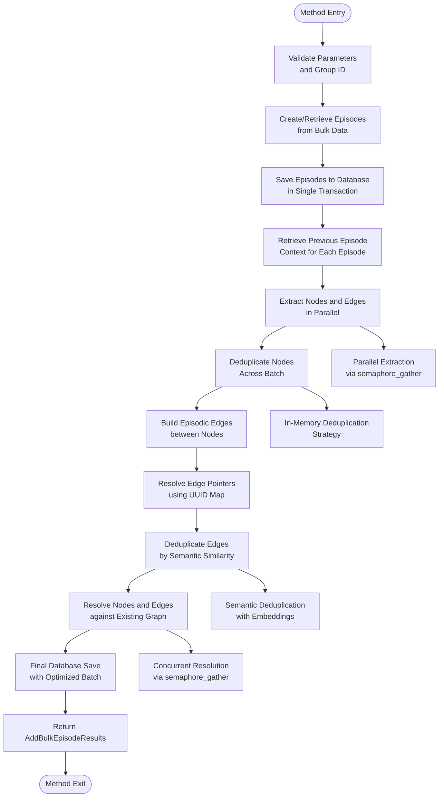
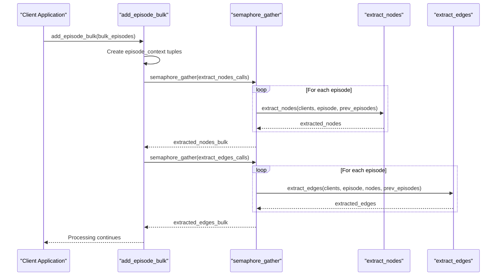
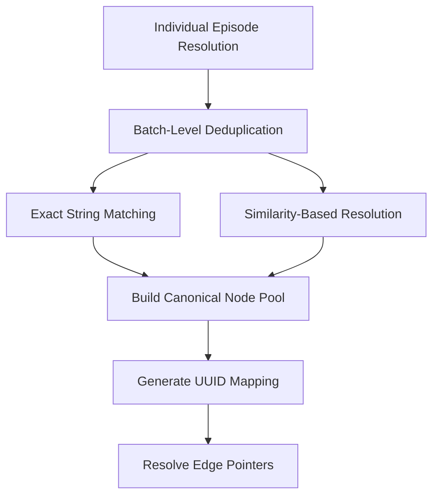
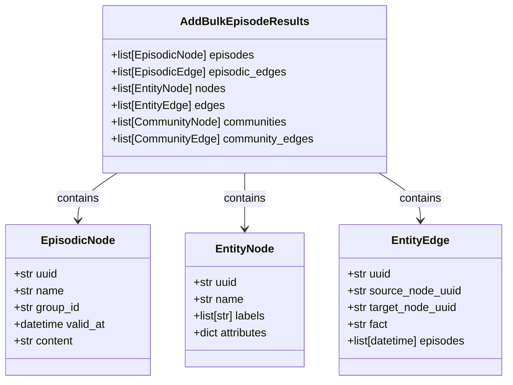

# add_episode_bulk Method API Documentation

<cite>
**Referenced Files in This Document**
- [graphiti.py](file://graphiti_core/graphiti.py)
- [bulk_utils.py](file://graphiti_core/utils/bulk_utils.py)
- [helpers.py](file://graphiti_core/helpers.py)
- [graphiti_types.py](file://graphiti_core/graphiti_types.py)
- [errors.py](file://graphiti_core/errors.py)
- [podcast_runner.py](file://examples/podcast/podcast_runner.py)
- [runner.py](file://examples/ecommerce/runner.py)
- [test_bulk_utils.py](file://tests/utils/maintenance/test_bulk_utils.py)
</cite>

## Table of Contents
1. [Introduction](#introduction)
2. [Method Signature and Parameters](#method-signature-and-parameters)
3. [Internal Workflow Architecture](#internal-workflow-architecture)
4. [Detailed Component Analysis](#detailed-component-analysis)
5. [Return Value and Results Model](#return-value-and-results-model)
6. [Performance Benefits and Optimization](#performance-benefits-and-optimization)
7. [Usage Examples](#usage-examples)
8. [Error Handling Strategies](#error-handling-strategies)
9. [Memory Considerations](#memory-considerations)
10. [Best Practices](#best-practices)

## Introduction

The `add_episode_bulk` method is a sophisticated batch ingestion endpoint designed for efficient processing of multiple episodes in a single operation. This method serves as the primary interface for ingesting large volumes of temporal data while maintaining proper entity resolution and temporal context across the knowledge graph.

Unlike individual episode processing, bulk ingestion optimizes resource utilization through parallel processing, in-memory deduplication, and controlled concurrency management. The method is specifically engineered for scenarios involving historical data migration, time-series processing, and large-scale data onboarding operations.

## Method Signature and Parameters

The method accepts the following parameters:

| Parameter | Type | Description |
|-----------|------|-------------|
| `bulk_episodes` | `list[RawEpisode]` | A list of RawEpisode objects containing the content to be processed and added to the graph |
| `group_id` | `str \| None` | Optional identifier for the graph partition the episodes belong to |
| `entity_types` | `dict[str, type[BaseModel]] \| None` | Dictionary mapping entity type names to Pydantic model classes for structured extraction |
| `excluded_entity_types` | `list[str] \| None` | List of entity types to exclude from extraction |
| `edge_types` | `dict[str, type[BaseModel]] \| None` | Dictionary mapping edge type names to Pydantic model classes for relationship extraction |
| `edge_type_map` | `dict[tuple[str, str], list[str]] \| None` | Mapping defining which edge types connect which entity type combinations |

### Parameter Details

**RawEpisode Objects**: Each RawEpisode contains essential metadata including:
- `name`: Human-readable identifier for the episode
- `uuid`: Optional unique identifier for deduplication
- `content`: The textual content to be processed
- `source_description`: Description of the content source
- `source`: EpisodeType enumeration indicating content origin
- `reference_time`: Timestamp establishing temporal position

**Edge Type Mapping**: The edge_type_map parameter defines relationship extraction rules:
- Keys are tuples representing source-target entity type combinations
- Values are lists of edge type identifiers to extract between those entity types
- Default mapping handles Entity-to-Entity relationships when edge_types are provided

**Group Management**: The group_id parameter enables logical partitioning of episodes, allowing for isolated processing and querying within specific domains or time periods.

**Section sources**
- [graphiti.py](file://graphiti_core/graphiti.py#L814-L823)

## Internal Workflow Architecture

The `add_episode_bulk` method implements a sophisticated multi-stage workflow designed for optimal performance and data integrity:



**Diagram sources**
- [graphiti.py](file://graphiti_core/graphiti.py#L814-L993)
- [bulk_utils.py](file://graphiti_core/utils/bulk_utils.py#L256-L288)

### Workflow Stages

**Stage 1: Episode Preparation**
- Validates input parameters and group identifiers
- Creates or retrieves episode objects from RawEpisode data
- Establishes temporal context through reference timestamps

**Stage 2: Bulk Database Operations**
- Executes all database writes within a single transaction
- Saves episodes, episodic edges, and entity relationships atomically
- Leverages batch operations for optimal database performance

**Stage 3: Parallel Processing Pipeline**
- Utilizes `semaphore_gather` for controlled concurrency
- Processes node and edge extraction in parallel across episodes
- Maintains temporal context while enabling high-throughput processing

**Stage 4: Deduplication Strategy**
- Implements two-tier deduplication: in-memory resolution and semantic comparison
- Uses UUID mapping for pointer resolution across the batch
- Applies similarity thresholds for edge deduplication

**Section sources**
- [graphiti.py](file://graphiti_core/graphiti.py#L814-L993)
- [bulk_utils.py](file://graphiti_core/utils/bulk_utils.py#L256-L288)

## Detailed Component Analysis

### Bulk Extraction Engine

The extraction engine forms the core of the bulk processing pipeline, utilizing parallel processing to maximize throughput:



**Diagram sources**
- [bulk_utils.py](file://graphiti_core/utils/bulk_utils.py#L256-L288)
- [helpers.py](file://graphiti_core/helpers.py#L105-L115)

### In-Memory Deduplication System

The deduplication system implements a sophisticated two-phase approach:

**Phase 1: Individual Episode Resolution**
- Each episode undergoes node resolution against the existing graph
- Maintains temporal context through previous episode references
- Generates UUID mappings for cross-referencing

**Phase 2: Batch-Level Deduplication**
- Compares nodes across all episodes within the batch
- Applies exact string matching and similarity-based resolution
- Builds comprehensive UUID mapping for edge pointer resolution



**Diagram sources**
- [bulk_utils.py](file://graphiti_core/utils/bulk_utils.py#L289-L401)

### Parallel Node Resolution

The node resolution process utilizes controlled concurrency to balance performance and resource utilization:

**Concurrency Control**: The `semaphore_gather` function limits concurrent operations to prevent overwhelming external APIs and maintain system stability.

**Temporal Context Preservation**: Each episode maintains its temporal context through previous episode references, enabling accurate relationship extraction.

**Section sources**
- [graphiti.py](file://graphiti_core/graphiti.py#L467-L574)
- [helpers.py](file://graphiti_core/helpers.py#L105-L115)

### Edge Resolution and Deduplication

The edge resolution system employs semantic similarity for deduplication:

**Semantic Comparison**: Uses embedding vectors to compare edge facts and identify duplicates beyond simple string matching.

**Similarity Thresholds**: Employs configurable similarity scores (default: 0.6) to determine edge equivalence.

**Cross-Episode Deduplication**: Enables deduplication across episodes within the same batch, optimizing storage and query performance.

**Section sources**
- [bulk_utils.py](file://graphiti_core/utils/bulk_utils.py#L404-L497)

## Return Value and Results Model

The method returns an `AddBulkEpisodeResults` model containing comprehensive information about the processed episodes:



**Diagram sources**
- [graphiti.py](file://graphiti_core/graphiti.py#L113-L119)

### Results Breakdown

**Episodes**: Original episode objects with generated UUIDs and metadata
**Episodic Edges**: Temporal relationships connecting nodes within each episode
**Entity Nodes**: Structured entities extracted from the content
**Entity Edges**: Relationships between extracted entities
**Communities**: Community detection results (empty in bulk operations)
**Community Edges**: Community relationships (empty in bulk operations)

The results model provides comprehensive visibility into the processing outcome, enabling downstream applications to understand the transformation and relationships established.

**Section sources**
- [graphiti.py](file://graphiti_core/graphiti.py#L113-L119)

## Performance Benefits and Optimization

### Throughput Improvements

The bulk ingestion method delivers significant performance improvements over individual episode processing:

**Database Efficiency**: Single transaction for all database operations reduces overhead from multiple round-trips
**Parallel Processing**: Controlled concurrency enables simultaneous processing of multiple episodes
**Batch Operations**: Optimized batch queries reduce network latency and improve resource utilization

### Memory Optimization Strategies

**Streaming Processing**: The method processes episodes in batches rather than loading all data into memory simultaneously
**UUID Mapping**: Efficient pointer resolution prevents redundant data storage
**Garbage Collection**: Strategic cleanup of intermediate results minimizes memory footprint

### Concurrency Control

The method employs sophisticated concurrency management through the `semaphore_gather` function:

**Rate Limiting**: Prevents overwhelming external APIs and maintains service level agreements
**Resource Protection**: Controls memory usage and prevents system overload
**Adaptive Threading**: Balances processing speed with system stability

**Section sources**
- [helpers.py](file://graphiti_core/helpers.py#L105-L115)
- [graphiti.py](file://graphiti_core/graphiti.py#L814-L993)

## Usage Examples

### Basic Bulk Processing

```python
# Example from ecommerce data ingestion
import json
from datetime import datetime, timezone
from graphiti_core import Graphiti
from graphiti_core.utils.bulk_utils import RawEpisode

# Prepare bulk episodes from JSON data
async def ingest_products_data(client: Graphiti):
    with open('products.json') as file:
        products = json.load(file)['products']
    
    episodes: list[RawEpisode] = [
        RawEpisode(
            name=product.get('title', f'Product {i}'),
            content=str({k: v for k, v in product.items() if k != 'images'}),
            source_description='E-commerce Products',
            source=EpisodeType.json,
            reference_time=datetime.now(timezone.utc),
        )
        for i, product in enumerate(products)
    ]
    
    # Process all episodes in bulk
    results = await client.add_episode_bulk(episodes)
    return results
```

### Historical Data Migration

```python
# Example from podcast transcript processing
from graphiti_core import Graphiti
from graphiti_core.utils.bulk_utils import RawEpisode
from graphiti_core.nodes import EpisodeType

async def migrate_podcast_history(client: Graphiti, transcripts: list[dict]):
    # Convert historical transcripts to RawEpisode format
    raw_episodes = []
    for i, transcript in enumerate(transcripts):
        episode = RawEpisode(
            name=f'Transcript {i}',
            content=transcript['text'],
            source_description='Historical Podcast Transcripts',
            source=EpisodeType.message,
            reference_time=transcript['timestamp'],
        )
        raw_episodes.append(episode)
    
    # Process with entity and edge type specifications
    results = await client.add_episode_bulk(
        bulk_episodes=raw_episodes,
        group_id='podcast_migrations',
        entity_types={
            'Person': Person,
            'Organization': Organization,
            'Topic': Topic
        },
        edge_types={
            'MENTIONS': MentionEdge,
            'DISCUSSES': DiscussionEdge
        },
        edge_type_map={
            ('Person', 'Entity'): ['MENTIONS'],
            ('Person', 'Person'): ['DISCUSSES']
        }
    )
    
    return results
```

### Time-Series Data Processing

```python
# Example from sensor data processing
from graphiti_core import Graphiti
from graphiti_core.utils.bulk_utils import RawEpisode
from datetime import timedelta

async def process_sensor_data(client: Graphiti, sensor_readings: list[dict]):
    # Create time-series episodes from sensor readings
    raw_episodes = []
    base_time = datetime.now(timezone.utc)
    
    for i, reading in enumerate(sensor_readings):
        episode = RawEpisode(
            name=f'Sensor Reading {i}',
            content=json.dumps(reading),
            source_description='IoT Sensor Data',
            source=EpisodeType.json,
            reference_time=base_time + timedelta(seconds=i),
        )
        raw_episodes.append(episode)
    
    # Process with temporal awareness
    results = await client.add_episode_bulk(
        bulk_episodes=raw_episodes,
        group_id='sensor_data',
        entity_types={'Sensor': Sensor, 'Reading': SensorReading},
        edge_types={'HAS_READING': HasReadingEdge},
        edge_type_map={('Sensor', 'Entity'): ['HAS_READING']}
    )
    
    return results
```

**Section sources**
- [runner.py](file://examples/ecommerce/runner.py#L125-L143)
- [podcast_runner.py](file://examples/podcast/podcast_runner.py#L90-L108)

## Error Handling Strategies

The `add_episode_bulk` method implements comprehensive error handling to ensure robust operation:

### Exception Types and Handling

**GraphitiError Base Class**: All Graphiti-specific exceptions inherit from this base class, providing consistent error handling patterns.

**Parameter Validation**: Input parameters are validated before processing begins, preventing runtime errors.

**Transaction Rollback**: Database operations occur within a single transaction, ensuring atomicity and consistency.

**Graceful Degradation**: Individual episode failures do not compromise the entire batch operation.

### Error Recovery Mechanisms

**Retry Logic**: External API failures trigger automatic retry mechanisms with exponential backoff.

**Partial Success Handling**: The method can process successful episodes while reporting failures for problematic ones.

**Logging and Monitoring**: Comprehensive logging captures errors and performance metrics for troubleshooting.

### Best Practices for Error Handling

**Batch Size Management**: Process data in manageable chunks to minimize the impact of individual failures.

**Resource Monitoring**: Monitor system resources during bulk operations to prevent out-of-memory conditions.

**Progress Tracking**: Implement progress monitoring for long-running bulk operations.

**Section sources**
- [errors.py](file://graphiti_core/errors.py#L18-L84)
- [graphiti.py](file://graphiti_core/graphiti.py#L980-L993)

## Memory Considerations

### Memory Management Strategies

**Streaming Architecture**: The method processes episodes sequentially rather than loading all data into memory simultaneously.

**UUID Mapping Optimization**: Efficient dictionary-based UUID mapping prevents memory bloat from duplicate references.

**Garbage Collection**: Strategic cleanup of intermediate results ensures predictable memory usage patterns.

### Memory Usage Patterns

**Peak Memory**: Occurs during node and edge extraction phases when all intermediate results are held in memory.

**Steady State**: Memory usage stabilizes after deduplication completes and intermediate results are cleaned up.

**Cleanup Timing**: Garbage collection occurs automatically, but large batches may benefit from explicit memory management.

### Scaling Considerations

**Batch Size Limits**: Larger batches improve throughput but increase memory requirements.

**System Resource Monitoring**: Monitor CPU, memory, and disk usage during bulk operations.

**Resource Allocation**: Allocate sufficient system resources based on expected batch sizes and complexity.

## Best Practices

### Performance Optimization

**Batch Size Tuning**: Optimize batch sizes based on available system resources and processing requirements.

**Concurrency Configuration**: Adjust semaphore limits based on external API rate limits and system capacity.

**Resource Planning**: Plan system resources based on expected data volume and processing complexity.

### Data Quality Assurance

**Content Validation**: Validate episode content before bulk processing to prevent downstream errors.

**Entity Type Specification**: Clearly define entity and edge types to ensure accurate extraction.

**Temporal Consistency**: Ensure reference times are properly ordered for temporal processing.

### Operational Excellence

**Monitoring and Logging**: Implement comprehensive monitoring for production deployments.

**Testing Strategies**: Test bulk operations with representative data volumes before production deployment.

**Backup and Recovery**: Maintain backup strategies for bulk processing operations.

### Security Considerations

**Data Sanitization**: Sanitize content to prevent injection attacks and ensure data quality.

**Access Control**: Implement appropriate access controls for bulk processing operations.

**Audit Trails**: Maintain audit trails for bulk operations to support compliance requirements.