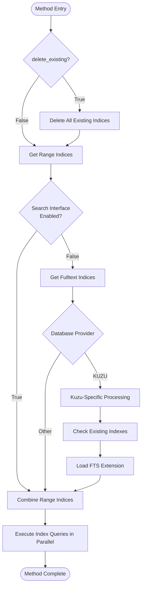

# build_indices_and_constraints Method Documentation

<cite>
**Referenced Files in This Document**
- [graphiti_core/graphiti.py](file://graphiti_core/graphiti.py)
- [graphiti_core/utils/maintenance/graph_data_operations.py](file://graphiti_core/utils/maintenance/graph_data_operations.py)
- [graphiti_core/graph_queries.py](file://graphiti_core/graph_queries.py)
- [graphiti_core/helpers.py](file://graphiti_core/helpers.py)
- [graphiti_core/driver/driver.py](file://graphiti_core/driver/driver.py)
- [graphiti_core/driver/falkordb_driver.py](file://graphiti_core/driver/falkordb_driver.py)
- [graphiti_core/driver/neo4j_driver.py](file://graphiti_core/driver/neo4j_driver.py)
- [tests/test_graphiti_mock.py](file://tests/test_graphiti_mock.py)
- [tests/test_entity_exclusion_int.py](file://tests/test_entity_exclusion_int.py)
</cite>

## Table of Contents
1. [Introduction](#introduction)
2. [Method Overview](#method-overview)
3. [Core Implementation](#core-implementation)
4. [Parameter Details](#parameter-details)
5. [Database Schema Management](#database-schema-management)
6. [Performance Considerations](#performance-considerations)
7. [Usage Examples](#usage-examples)
8. [Operational Guidelines](#operational-guidelines)
9. [Troubleshooting](#troubleshooting)
10. [Best Practices](#best-practices)

## Introduction

The `build_indices_and_constraints` method is a critical component of the Graphiti knowledge graph system that optimizes database performance and ensures data integrity through strategic index and constraint creation. This method serves as the primary mechanism for establishing the database schema that enables efficient query execution and maintains referential integrity across the knowledge graph.

The method operates across multiple graph database backends (Neo4j, FalkorDB, Kuzu, Neptune) and automatically adapts its schema creation strategy based on the specific capabilities and limitations of each backend. It creates both range indices for fast equality and range queries, and full-text indices for powerful text search capabilities.

## Method Overview

The `build_indices_and_constraints` method is exposed through two interfaces within the Graphiti ecosystem:

### Primary Interface
```python
async def build_indices_and_constraints(self, delete_existing: bool = False):
```

### Utility Function
```python
async def build_indices_and_constraints(driver: GraphDriver, delete_existing: bool = False):
```

The method performs the following core operations:
- **Schema Initialization**: Creates essential indices and constraints for optimal query performance
- **Data Integrity**: Establishes referential integrity through constraint enforcement
- **Performance Optimization**: Implements indexing strategies tailored to the knowledge graph's query patterns
- **Cross-Platform Compatibility**: Adapts schema creation to different graph database backends

**Section sources**
- [graphiti_core/graphiti.py](file://graphiti_core/graphiti.py#L320-L353)
- [graphiti_core/utils/maintenance/graph_data_operations.py](file://graphiti_core/utils/maintenance/graph_data_operations.py#L35-L72)

## Core Implementation

The method follows a structured execution flow that varies slightly based on the target database backend:



**Diagram sources**
- [graphiti_core/utils/maintenance/graph_data_operations.py](file://graphiti_core/utils/maintenance/graph_data_operations.py#L35-L72)

### Execution Phases

1. **Preparation Phase**
   - Validates the `delete_existing` parameter
   - Clears existing indices if requested
   - Retrieves appropriate index definitions for the target database provider

2. **Provider-Specific Processing**
   - **Neo4j/Kuzu**: Creates standard range and full-text indices
   - **FalkorDB**: Uses specialized full-text index creation with stopword support
   - **Kuzu**: Handles extension loading and manual index existence checking

3. **Execution Phase**
   - Utilizes parallel execution through `semaphore_gather` for optimal performance
   - Executes index creation queries concurrently with bounded concurrency
   - Handles database-specific syntax variations

**Section sources**
- [graphiti_core/utils/maintenance/graph_data_operations.py](file://graphiti_core/utils/maintenance/graph_data_operations.py#L35-L72)

## Parameter Details

### `delete_existing` Parameter

The `delete_existing` parameter controls whether the method clears existing indices before creating new ones. This parameter has significant implications for schema management:

#### Parameter Behavior
- **Default Value**: `False` (preserves existing indices)
- **Impact**: When `True`, all existing indices are dropped before new ones are created
- **Use Case**: Essential for schema migrations or when the existing index structure is outdated

#### Implications of Setting `delete_existing = True`
- **Schema Migration**: Enables clean slate for new schema versions
- **Performance Impact**: May cause temporary performance degradation during index recreation
- **Data Safety**: No data loss occurs, only index metadata is affected
- **Maintenance Window**: Recommended for scheduled maintenance periods

#### Operational Considerations
- **Large Datasets**: Execution time scales with the number of indexed properties
- **Concurrent Access**: May temporarily block write operations during index recreation
- **Rollback Capability**: No built-in rollback mechanism; consider backup strategies

**Section sources**
- [graphiti_core/utils/maintenance/graph_data_operations.py](file://graphiti_core/utils/maintenance/graph_data_operations.py#L37-L38)

## Database Schema Management

The method creates comprehensive indexing strategies tailored to the knowledge graph's query patterns and the target database's capabilities.

### Range Indices

Range indices optimize equality and range queries commonly used in the knowledge graph:

#### Entity Nodes
- **UUID Index**: `CREATE INDEX entity_uuid FOR (n:Entity) ON (n.uuid)`
- **Group ID Index**: `CREATE INDEX entity_group_id FOR (n:Entity) ON (n.group_id)`
- **Name Index**: `CREATE INDEX name_entity_index FOR (n:Entity) ON (n.name)`
- **Created At Index**: `CREATE INDEX created_at_entity_index FOR (n:Entity) ON (n.created_at)`

#### Episodic Nodes
- **UUID Index**: `CREATE INDEX episode_uuid FOR (n:Episodic) ON (n.uuid)`
- **Group ID Index**: `CREATE INDEX episode_group_id FOR (n:Episodic) ON (n.group_id)`
- **Created At Index**: `CREATE INDEX created_at_episodic_index FOR (n:Episodic) ON (n.created_at)`
- **Valid At Index**: `CREATE INDEX valid_at_episodic_index FOR (n:Episodic) ON (n.valid_at)`

#### Relationship Edges
- **UUID Indices**: Various UUID-based indices for different relationship types
- **Temporal Indices**: Created at, expired at, valid at, and invalid at timestamps
- **Group ID Indices**: Group-based filtering capabilities

### Full-Text Indices

Full-text indices enable sophisticated text search capabilities across knowledge graph content:

#### Content-Based Indices
- **Entity Names and Summaries**: `CREATE FULLTEXT INDEX node_name_and_summary FOR (n:Entity) ON EACH [n.name, n.summary, n.group_id]`
- **Episode Content**: `CREATE FULLTEXT INDEX episode_content FOR (n:Episodic) ON EACH [n.content, n.source, n.source_description, n.group_id]`
- **Community Names**: `CREATE FULLTEXT INDEX community_name FOR (n:Community) ON EACH [n.name, n.group_id]`
- **Edge Facts**: `CREATE FULLTEXT INDEX edge_name_and_fact FOR ()-[e:RELATES_TO]-() ON EACH [e.name, e.fact, e.group_id]`

#### Provider-Specific Variations
- **Neo4j**: Standard full-text index syntax with `IF NOT EXISTS` support
- **FalkorDB**: Specialized full-text index creation with stopword configuration
- **Kuzu**: Requires explicit extension loading and manual index existence checking

**Section sources**
- [graphiti_core/graph_queries.py](file://graphiti_core/graph_queries.py#L28-L69)
- [graphiti_core/graph_queries.py](file://graphiti_core/graph_queries.py#L72-L127)

## Performance Considerations

### Execution Time Analysis

The method's execution time depends on several factors:

#### Scale Factors
- **Existing Data Volume**: Larger datasets require more time for index population
- **Index Complexity**: More indices mean longer execution times
- **Database Backend**: Different backends have varying index creation performance characteristics

#### Performance Optimization Strategies
- **Parallel Execution**: Utilizes `semaphore_gather` with configurable concurrency limits
- **Batch Processing**: Groups related index creation operations for efficiency
- **Provider Optimization**: Tailored approaches for each database backend

### Impact on Database Performance

#### During Execution
- **Resource Utilization**: High CPU and memory usage during index creation
- **Locking Behavior**: May temporarily lock tables or partitions
- **Concurrent Operations**: Write operations may be blocked during index recreation

#### Post-Execution
- **Query Performance**: Significant improvement in query response times
- **Storage Overhead**: Additional disk space required for index storage
- **Maintenance Overhead**: Periodic index maintenance may be required

### Recommended Timing

#### Optimal Scenarios
- **Initial Deployment**: First-time setup of the knowledge graph
- **Schema Updates**: When migrating to new index configurations
- **Maintenance Windows**: Scheduled downtime periods for large datasets

#### Avoid During
- **Peak Business Hours**: High-traffic periods when performance is critical
- **Active Data Ingestion**: Concurrent data loading operations
- **Critical Transactions**: Operations requiring immediate response times

**Section sources**
- [graphiti_core/utils/maintenance/graph_data_operations.py](file://graphiti_core/utils/maintenance/graph_data_operations.py#L73-L75)

## Usage Examples

### Basic Setup

```python
# Initialize Graphiti instance
graphiti = Graphiti(
    uri="bolt://localhost:7687",
    user="neo4j",
    password="password"
)

# Build indices and constraints for initial setup
await graphiti.build_indices_and_constraints()
```

### Schema Migration

```python
# Clear existing indices and rebuild with new schema
await graphiti.build_indices_and_constraints(delete_existing=True)
```

### Conditional Setup

```python
# Check if indices exist before creating
existing_indices = await check_existing_indices(graphiti.driver)
if not existing_indices:
    await graphiti.build_indices_and_constraints()
```

### Testing Environment

```python
# Mock testing setup
from tests.test_graphiti_mock import create_mock_graphiti

async def setup_test_environment():
    graphiti = await create_mock_graphiti()
    await graphiti.build_indices_and_constraints()  # No delete_existing needed for fresh setup
    return graphiti
```

**Section sources**
- [tests/test_graphiti_mock.py](file://tests/test_graphiti_mock.py#L467-L468)
- [tests/test_entity_exclusion_int.py](file://tests/test_entity_exclusion_int.py#L125-L126)

## Operational Guidelines

### Pre-Deployment Checklist

1. **Backup Verification**: Ensure database backups are available
2. **Capacity Planning**: Verify sufficient disk space for index storage
3. **Maintenance Window**: Schedule during low-traffic periods
4. **Monitoring Setup**: Configure performance monitoring during execution

### Monitoring During Execution

- **Progress Tracking**: Monitor execution progress for large datasets
- **Resource Monitoring**: Track CPU, memory, and disk usage
- **Error Detection**: Watch for timeout or resource exhaustion errors

### Post-Deployment Validation

1. **Index Verification**: Confirm all expected indices are created
2. **Performance Testing**: Validate query performance improvements
3. **Integration Testing**: Verify application functionality with new indices

### Maintenance Procedures

- **Regular Review**: Periodically assess index effectiveness
- **Cleanup Operations**: Remove unused or redundant indices
- **Performance Tuning**: Adjust index strategies based on usage patterns

## Troubleshooting

### Common Issues

#### Index Creation Failures
**Symptoms**: Method completes without expected indices
**Causes**: 
- Insufficient database privileges
- Conflicting index definitions
- Resource constraints

**Solutions**:
- Verify database user permissions
- Check for existing conflicting indices
- Increase resource allocation

#### Performance Degradation
**Symptoms**: Slower query performance after index creation
**Causes**:
- Large dataset with insufficient resources
- Suboptimal index selection
- Concurrent write operations

**Solutions**:
- Monitor resource utilization
- Review index strategy alignment with query patterns
- Optimize concurrent operation scheduling

#### Memory Exhaustion
**Symptoms**: Out-of-memory errors during execution
**Causes**:
- Insufficient heap space
- Large dataset processing
- Concurrent operations

**Solutions**:
- Increase JVM heap size (Neo4j)
- Reduce batch sizes
- Implement staggered execution

### Debugging Strategies

1. **Log Analysis**: Examine database logs for index creation events
2. **Performance Profiling**: Use database profiling tools
3. **Query Analysis**: Review slow query patterns
4. **Resource Monitoring**: Track system resource utilization

## Best Practices

### Development Environment
- **Incremental Testing**: Test index changes on small datasets first
- **Version Control**: Track schema changes with version control
- **Automated Testing**: Include index validation in CI/CD pipelines

### Production Environment
- **Staged Rollouts**: Deploy index changes gradually
- **Rollback Planning**: Maintain rollback procedures for failed deployments
- **Performance Baseline**: Establish performance baselines before changes

### Maintenance Best Practices
- **Regular Audits**: Periodically audit index effectiveness
- **Documentation**: Maintain comprehensive index documentation
- **Team Training**: Ensure team members understand index implications

### Security Considerations
- **Access Control**: Restrict index creation permissions
- **Audit Logging**: Log all index-related operations
- **Compliance**: Ensure index strategies meet compliance requirements

**Section sources**
- [graphiti_core/helpers.py](file://graphiti_core/helpers.py#L105-L117)