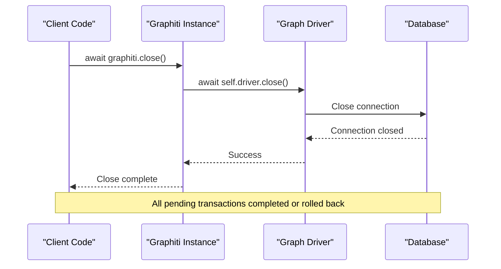
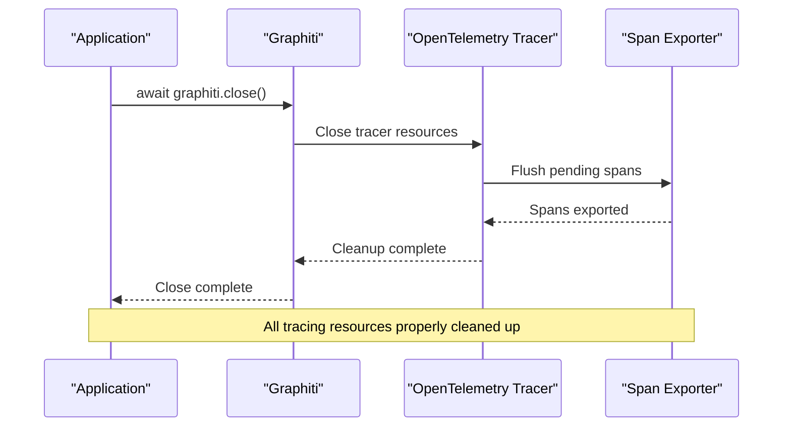

# close Method API Documentation

<cite>
**Referenced Files in This Document**
- [graphiti.py](file://graphiti_core/graphiti.py)
- [driver.py](file://graphiti_core/driver/driver.py)
- [neo4j_driver.py](file://graphiti_core/driver/neo4j_driver.py)
- [falkordb_driver.py](file://graphiti_core/driver/falkordb_driver.py)
- [kuzu_driver.py](file://graphiti_core/driver/kuzu_driver.py)
- [neptune_driver.py](file://graphiti_core/driver/neptune_driver.py)
- [tracer.py](file://graphiti_core/tracer.py)
- [main.py](file://server/graph_service/main.py)
- [otel_stdout_example.py](file://examples/opentelemetry/otel_stdout_example.py)
- [test_falkordb_driver.py](file://tests/driver/test_falkordb_driver.py)
</cite>

## Table of Contents
1. [Introduction](#introduction)
2. [Method Signature and Purpose](#method-signature-and-purpose)
3. [Implementation Details](#implementation-details)
4. [Usage Patterns](#usage-patterns)
5. [Framework Integration](#framework-integration)
6. [Distributed Tracing Cleanup](#distributed-tracing-cleanup)
7. [Best Practices](#best-practices)
8. [Common Pitfalls](#common-pitfalls)
9. [Testing Guidelines](#testing-guidelines)
10. [Troubleshooting](#troubleshooting)

## Introduction

The `close` method is a critical asynchronous operation in the Graphiti framework designed for graceful shutdown and resource cleanup. This method ensures proper termination of database connections, completion or rollback of pending transactions, and cleanup of distributed tracing resources when configured.

The close method serves as the primary mechanism for releasing system resources and maintaining data integrity during application shutdown or cleanup scenarios. It acts as a safety net to prevent resource leaks and ensure that all pending operations are properly concluded before the application terminates.

## Method Signature and Purpose

### Graphiti Instance Close Method

The primary `close` method is implemented in the main Graphiti class as an asynchronous coroutine:

```python
async def close(self) -> None
```

**Purpose**: Safely closes the driver connection to the underlying graph database, ensuring all pending transactions are completed or rolled back and system resources are properly released.

**Key Responsibilities**:
- Calls the underlying driver's close method
- Ensures proper cleanup of database connections
- Handles graceful shutdown scenarios
- Prevents resource leaks

**Section sources**
- [graphiti.py](file://graphiti_core/graphiti.py#L289-L318)

### Driver-Level Close Methods

Each graph database driver implements its own close method with specific cleanup logic:

```python
# Neo4j Driver
async def close(self) -> None

# FalkorDB Driver  
async def close(self) -> None

# Kuzu Driver
async def close(self) -> None

# Neptune Driver
async def close(self) -> None
```

**Section sources**
- [neo4j_driver.py](file://graphiti_core/driver/neo4j_driver.py#L67-L68)
- [falkordb_driver.py](file://graphiti_core/driver/falkordb_driver.py#L184-L191)
- [kuzu_driver.py](file://graphiti_core/driver/kuzu_driver.py#L135-L137)
- [neptune_driver.py](file://graphiti_core/driver/neptune_driver.py#L216-L217)

## Implementation Details

### Graphiti Close Method Implementation

The main Graphiti class delegates to the underlying driver's close method:



**Diagram sources**
- [graphiti.py](file://graphiti_core/graphiti.py#L319)

### Driver-Specific Implementation Patterns

Different drivers implement close methods according to their connection patterns:

#### Neo4j Driver
Uses the native async close method from the Neo4j Python driver:

```python
return await self.client.close()
```

#### FalkorDB Driver
Implements robust connection closure with fallback mechanisms:

```python
if hasattr(self.client, 'aclose'):
    await self.client.aclose()
elif hasattr(self.client.connection, 'aclose'):
    await self.client.connection.aclose()
elif hasattr(self.client.connection, 'close'):
    await self.client.connection.close()
```

#### Kuzu Driver
Relies on garbage collection for connection management:

```python
# Do not explicitly close the connection, instead rely on GC.
pass
```

#### Neptune Driver
Closes the underlying client connection:

```python
return self.client.client.close()
```

**Section sources**
- [neo4j_driver.py](file://graphiti_core/driver/neo4j_driver.py#L67-L68)
- [falkordb_driver.py](file://graphiti_core/driver/falkordb_driver.py#L184-L191)
- [kuzu_driver.py](file://graphiti_core/driver/kuzu_driver.py#L135-L137)
- [neptune_driver.py](file://graphiti_core/driver/neptune_driver.py#L216-L217)

### Session-Level Close Methods

Individual sessions also implement close methods, though their behavior varies by driver:

```python
# FalkorDB Session
async def close(self):
    # No explicit close needed for FalkorDB, but method must exist
    pass

# Kuzu Session  
async def close(self):
    # Do not close the session here, as we're reusing the driver connection.
    pass
```

**Section sources**
- [falkordb_driver.py](file://graphiti_core/driver/falkordb_driver.py#L89-L92)
- [kuzu_driver.py](file://graphiti_core/driver/kuzu_driver.py#L161-L163)

## Usage Patterns

### Basic Try-Finally Pattern

The most common usage pattern involves try-finally blocks for guaranteed cleanup:

```python
# Example implementation pattern
graphiti = Graphiti(uri, user, password)
try:
    # Use graphiti for operations...
    await graphiti.add_episode(...)
    await graphiti.search(...)
finally:
    await graphiti.close()  # Ensure cleanup occurs
```

**Section sources**
- [graphiti.py](file://graphiti_core/graphiti.py#L312-L317)

### Context Manager Pattern

While not currently implemented as an async context manager, the framework supports the concept:

```python
# Future implementation pattern
async with Graphiti(...) as graphiti:
    # Operations automatically cleaned up
    await graphiti.add_episode(...)
    await graphiti.search(...)
# Automatic close on exit
```

### Application Shutdown Hooks

Integration with application lifecycle events:

```python
# FastAPI lifespan example
@asynccontextmanager
async def lifespan(app: FastAPI):
    # Startup
    graphiti = await initialize_graphiti()
    yield
    # Shutdown - automatic cleanup handled by framework
```

**Section sources**
- [main.py](file://server/graph_service/main.py#L11-L17)

### Explicit Cleanup in Long-Running Applications

For applications that create multiple Graphiti instances:

```python
# Pattern for multiple instances
instances = []
try:
    for config in configs:
        instance = Graphiti(**config)
        instances.append(instance)
        # Use instance...
finally:
    # Clean up all instances
    for instance in instances:
        await instance.close()
```

## Framework Integration

### FastAPI Integration

The Graphiti server demonstrates proper integration with FastAPI's lifespan context:

```python
@asynccontextmanager
async def lifespan(_: FastAPI):
    settings = get_settings()
    await initialize_graphiti(settings)
    yield
    # No explicit close needed - handled per-request
```

**Key Benefits**:
- Automatic resource management
- Proper cleanup during graceful shutdown
- Integration with FastAPI's lifecycle events

**Section sources**
- [main.py](file://server/graph_service/main.py#L11-L17)

### MCP Server Integration

The MCP server shows integration patterns for command-line tools:

```python
# Example from MCP server
async def main():
    try:
        # Initialize and use graphiti...
        await graphiti.close()  # Explicit cleanup
    except Exception as e:
        # Handle errors and ensure cleanup
        await graphiti.close()
```

**Section sources**
- [graphiti_mcp_server.py](file://mcp_server/graphiti_mcp_server.py#L1259-L1260)

### OpenTelemetry Integration

When using distributed tracing, the close method ensures proper span cleanup:

```python
# OpenTelemetry example
async def main():
    otel_tracer = setup_otel_stdout_tracing()
    graphiti = Graphiti(graph_driver=driver, tracer=otel_tracer)
    
    try:
        # Use graphiti...
    finally:
        await graphiti.close()  # Tracer cleanup included
```

**Section sources**
- [otel_stdout_example.py](file://examples/opentelemetry/otel_stdout_example.py#L120-L121)

## Distributed Tracing Cleanup

### Tracer Integration

When a tracer is configured, the close method ensures proper cleanup of distributed tracing resources:



**Diagram sources**
- [tracer.py](file://graphiti_core/tracer.py#L148-L156)

### No-Op Tracer Behavior

When no tracer is configured, the close method gracefully handles the absence:

```python
# No-op tracer implementation
class NoOpTracer(Tracer):
    @contextmanager
    def start_span(self, name: str):
        yield NoOpSpan()
```

**Section sources**
- [tracer.py](file://graphiti_core/tracer.py#L74-L81)

### Custom Tracer Cleanup

Applications can implement custom tracer cleanup logic:

```python
# Custom tracer cleanup pattern
class CustomTracer(Tracer):
    def __init__(self):
        self.spans = []
    
    async def close(self):
        # Custom cleanup logic
        for span in self.spans:
            await span.flush()
        self.spans.clear()
```

## Best Practices

### Always Use Async Context Managers

```python
# Recommended: Use async context manager
async with Graphiti(...) as graphiti:
    await graphiti.add_episode(...)
    await graphiti.search(...)
# Automatic cleanup on exit
```

### Implement Proper Error Handling

```python
# Robust error handling with cleanup
graphiti = Graphiti(...)
try:
    await graphiti.add_episode(...)
    await graphiti.search(...)
except Exception as e:
    logger.error(f"Operation failed: {e}")
    # Continue with cleanup
finally:
    await graphiti.close()  # Ensure cleanup
```

### Use Application Lifecycle Events

```python
# Framework-aware cleanup
@asynccontextmanager
async def lifespan(app: FastAPI):
    graphiti = await initialize_graphiti()
    try:
        yield
    finally:
        await graphiti.close()  # Automatic cleanup
```

### Monitor Resource Usage

```python
# Resource monitoring during development
import psutil
import asyncio

async def monitored_close(graphiti: Graphiti):
    process = psutil.Process()
    initial_memory = process.memory_info().rss
    
    await graphiti.close()
    
    # Verify cleanup
    final_memory = process.memory_info().rss
    memory_delta = final_memory - initial_memory
    
    if memory_delta > threshold:
        logger.warning(f"Memory leak detected: {memory_delta} bytes")
```

## Common Pitfalls

### Forgetting to Await the Close Method

```python
# INCORRECT: Forgetting await
await graphiti.close()  # Correct

# INCORRECT: Missing await
graphiti.close()  # Will not work as intended
```

### Closing Multiple Times

```python
# INCORRECT: Multiple close calls
await graphiti.close()
await graphiti.close()  # May cause errors

# CORRECT: Guard against multiple closes
if not graphiti.closed:
    await graphiti.close()
```

### Ignoring Exceptions During Close

```python
# INCORRECT: Ignoring close exceptions
await graphiti.close()  # May silently fail

# CORRECT: Handle close exceptions
try:
    await graphiti.close()
except Exception as e:
    logger.error(f"Failed to close graphiti: {e}")
```

### Not Cleaning Up in Long-Running Processes

```python
# INCORRECT: Creating but not cleaning up
for i in range(100):
    graphiti = Graphiti(...)  # Memory leak!

# CORRECT: Proper cleanup in loops
for i in range(100):
    graphiti = Graphiti(...)
    try:
        # Use graphiti
    finally:
        await graphiti.close()
```

## Testing Guidelines

### Unit Testing Close Methods

```python
@pytest.mark.asyncio
async def test_graphiti_close():
    """Test that Graphiti close method works correctly."""
    graphiti = Graphiti(uri, user, password)
    
    # Verify connection is established
    assert graphiti.driver.is_connected()
    
    # Close and verify cleanup
    await graphiti.close()
    assert not graphiti.driver.is_connected()
```

### Mocking Close Behavior

```python
@pytest.mark.asyncio
async def test_close_calls_driver_close():
    """Test that Graphiti close calls driver close."""
    mock_driver = MagicMock()
    graphiti = Graphiti(graph_driver=mock_driver)
    
    await graphiti.close()
    mock_driver.close.assert_called_once()
```

### Testing Resource Cleanup

```python
@pytest.mark.asyncio
async def test_resource_cleanup():
    """Test that close properly cleans up resources."""
    graphiti = Graphiti(...)
    
    # Perform operations that create resources
    await graphiti.add_episode(...)
    
    # Verify resources exist
    assert graphiti.driver.has_active_connections()
    
    # Close and verify cleanup
    await graphiti.close()
    assert not graphiti.driver.has_active_connections()
```

**Section sources**
- [test_falkordb_driver.py](file://tests/driver/test_falkordb_driver.py#L186-L205)

## Troubleshooting

### Connection Still Active After Close

**Problem**: Database connections remain active after calling close.

**Solution**: 
1. Verify the driver implementation supports async closing
2. Check for unhandled exceptions during close
3. Ensure all pending operations are completed

```python
# Debugging connection state
async def debug_close(graphiti: Graphiti):
    print(f"Before close - Connected: {graphiti.driver.is_connected()}")
    await graphiti.close()
    print(f"After close - Connected: {graphiti.driver.is_connected()}")
```

### Slow Close Operations

**Problem**: Close method takes excessive time to complete.

**Solution**:
1. Check for long-running queries that might be blocking
2. Verify network connectivity to the database
3. Consider timeout configurations

```python
# Timeout-aware close
async def timed_close(graphiti: Graphiti, timeout: float = 30.0):
    try:
        await asyncio.wait_for(graphiti.close(), timeout=timeout)
    except asyncio.TimeoutError:
        logger.warning("Close operation timed out")
        # Force cleanup if needed
```

### Memory Leaks After Close

**Problem**: Memory usage continues to grow after close operations.

**Solution**:
1. Verify all references to the Graphiti instance are cleared
2. Check for circular references in custom implementations
3. Monitor garbage collection behavior

```python
# Memory leak detection
import gc
import weakref

async def detect_memory_leaks():
    refs = []
    for _ in range(100):
        graphiti = Graphiti(...)
        refs.append(weakref.ref(graphiti))
        await graphiti.close()
    
    # Force garbage collection
    gc.collect()
    
    # Check for unreleased references
    live_refs = [r for r in refs if r() is not None]
    if live_refs:
        logger.warning(f"{len(live_refs)} references still alive")
```

### Distributed Tracing Issues

**Problem**: Traces appear incomplete or missing after close.

**Solution**:
1. Ensure proper tracer configuration
2. Verify span flushing during close
3. Check exporter connectivity

```python
# Tracing verification
async def verify_tracing(graphiti: Graphiti):
    # Start a traced operation
    with graphiti.tracer.start_span("test_operation") as span:
        span.add_attributes({"test": "value"})
        await graphiti.add_episode(...)
    
    # Close and verify traces
    await graphiti.close()
    # Check if traces were exported properly
```

**Section sources**
- [tracer.py](file://graphiti_core/tracer.py#L148-L156)