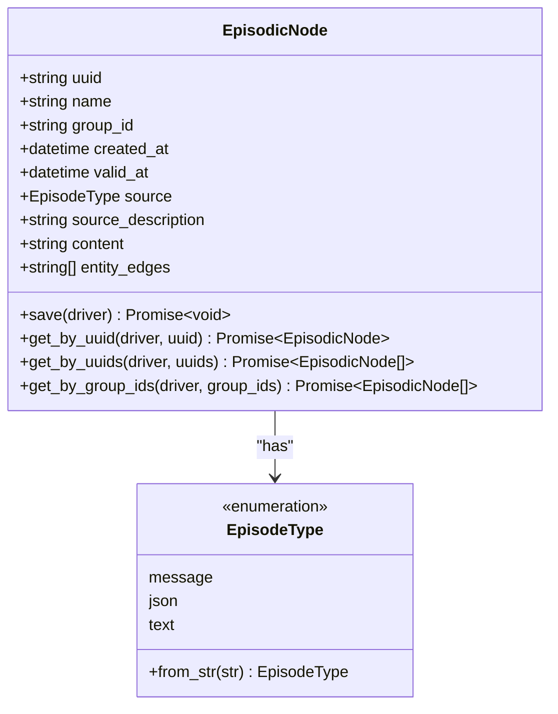
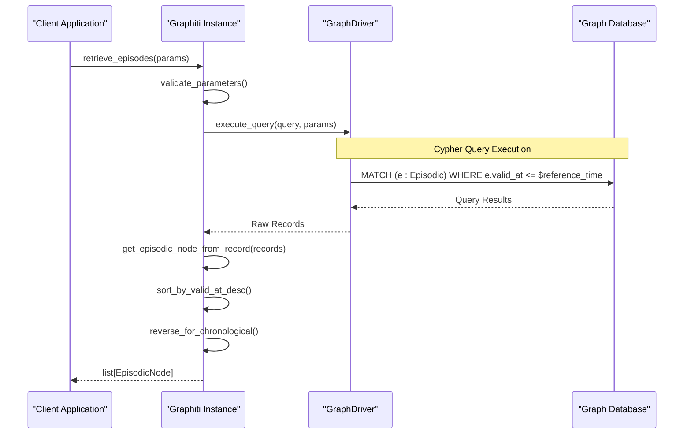
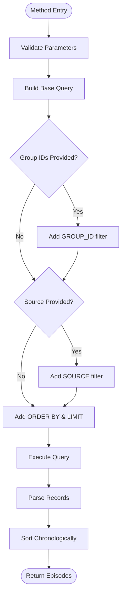
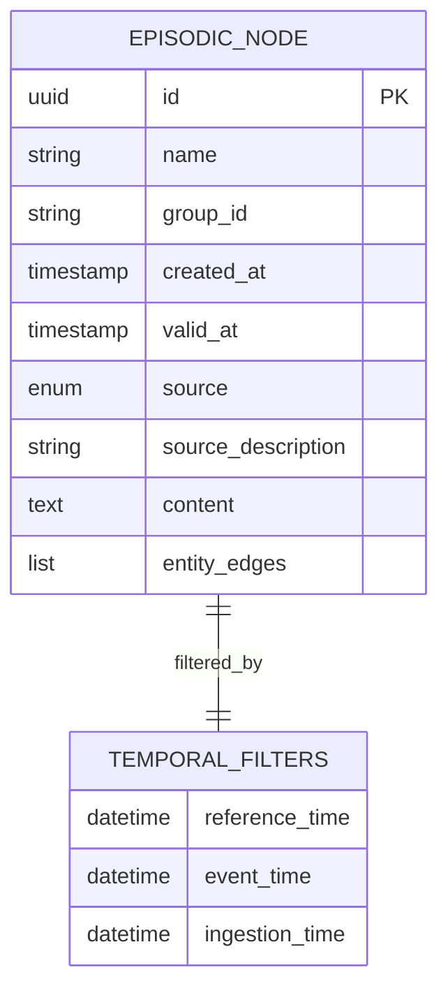
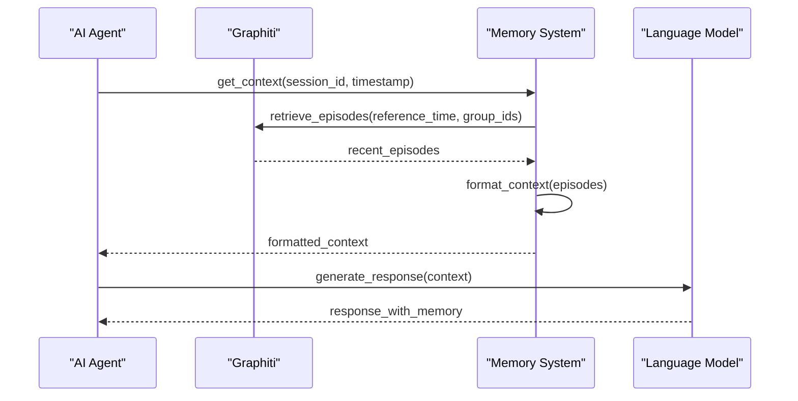

# retrieve_episodes Method API Documentation

<cite>
**Referenced Files in This Document**
- [graphiti_core/utils/maintenance/graph_data_operations.py](file://graphiti_core/utils/maintenance/graph_data_operations.py)
- [graphiti_core/graphiti.py](file://graphiti_core/graphiti.py)
- [graphiti_core/nodes.py](file://graphiti_core/nodes.py)
- [graphiti_core/models/nodes/node_db_queries.py](file://graphiti_core/models/nodes/node_db_queries.py)
- [graphiti_core/utils/maintenance/temporal_operations.py](file://graphiti_core/utils/maintenance/temporal_operations.py)
- [graphiti_core/utils/bulk_utils.py](file://graphiti_core/utils/bulk_utils.py)
- [graphiti_core/graph_queries.py](file://graphiti_core/graph_queries.py)
</cite>

## Table of Contents
1. [Introduction](#introduction)
2. [Method Signature and Parameters](#method-signature-and-parameters)
3. [Return Type and EpisodicNode Structure](#return-type-and-episodicnode-structure)
4. [Implementation Architecture](#implementation-architecture)
5. [Bi-Temporal Data Model](#bi-temporal-data-model)
6. [Usage Examples](#usage-examples)
7. [Performance Considerations](#performance-considerations)
8. [Typical Use Cases](#typical-use-cases)
9. [Integration Patterns](#integration-patterns)
10. [Error Handling](#error-handling)

## Introduction

The `retrieve_episodes` method is a core API endpoint in Graphiti for fetching episodic data from the temporal knowledge graph. This method serves as the primary mechanism for retrieving historical context and temporal information stored as episodic nodes, enabling sophisticated query capabilities for AI agents and knowledge graph applications.

The method implements a bi-temporal data model that tracks both the occurrence time of events (`valid_at`) and the ingestion time into the graph (`created_at`), allowing for precise point-in-time queries and historical analysis.

## Method Signature and Parameters

### Core Method Definition

The method is available through two interfaces:

```python
# Direct Graphiti class method
async def retrieve_episodes(
    self,
    reference_time: datetime,
    last_n: int = EPISODE_WINDOW_LEN,
    group_ids: list[str] | None = None,
    source: EpisodeType | None = None,
) -> list[EpisodicNode]:

# Utility function for direct usage
async def retrieve_episodes(
    driver: GraphDriver,
    reference_time: datetime,
    last_n: int = EPISODE_WINDOW_LEN,
    group_ids: list[str] | None = None,
    source: EpisodeType | None = None,
) -> list[EpisodicNode]:
```

### Parameter Details

| Parameter | Type | Default | Description |
|-----------|------|---------|-------------|
| `reference_time` | `datetime` | Required | The reference timestamp to retrieve episodes before. Only episodes with `valid_at` ≤ `reference_time` will be included. |
| `last_n` | `int` | `EPISODE_WINDOW_LEN` (3) | Number of most recent episodes to retrieve, ordered by `valid_at` descending. |
| `group_ids` | `list[str] \| None` | `None` | Filter episodes by specific group identifiers. If None, retrieves from all groups. |
| `source` | `EpisodeType \| None` | `None` | Filter episodes by source type (message, json, text). |

### Parameter Validation and Behavior

- **Reference Time**: Must be a valid datetime object; controls temporal filtering
- **Last N**: Must be ≥ 1; limits the number of results returned
- **Group IDs**: When provided, filters to specific graph partitions
- **Source**: When specified, filters by episode source type

**Section sources**
- [graphiti_core/utils/maintenance/graph_data_operations.py](file://graphiti_core/utils/maintenance/graph_data_operations.py#L103-L161)
- [graphiti_core/graphiti.py](file://graphiti_core/graphiti.py#L576-L608)

## Return Type and EpisodicNode Structure

### EpisodicNode Class Definition

The method returns a list of `EpisodicNode` objects, each representing a temporal episode in the knowledge graph:



**Diagram sources**
- [graphiti_core/nodes.py](file://graphiti_core/nodes.py#L295-L305)

### EpisodicNode Attributes

| Attribute | Type | Description |
|-----------|------|-------------|
| `uuid` | `string` | Unique identifier for the episode |
| `name` | `string` | Human-readable name for the episode |
| `group_id` | `string` | Partition identifier for graph organization |
| `created_at` | `datetime` | Timestamp when episode was ingested into graph |
| `valid_at` | `datetime` | Timestamp when the episode's content occurred |
| `source` | `EpisodeType` | Source type (message, json, text) |
| `source_description` | `string` | Description of the episode's origin |
| `content` | `string` | Raw content of the episode |
| `entity_edges` | `list[string]` | References to related entity nodes |

### Bi-Temporal Fields

The bi-temporal nature of episodes is crucial for temporal reasoning:

- **`created_at`**: When the episode was added to the graph (ingestion time)
- **`valid_at`**: When the episode's content actually occurred (event time)

**Section sources**
- [graphiti_core/nodes.py](file://graphiti_core/nodes.py#L295-L305)

## Implementation Architecture

### Method Flow Diagram



**Diagram sources**
- [graphiti_core/utils/maintenance/graph_data_operations.py](file://graphiti_core/utils/maintenance/graph_data_operations.py#L103-L161)

### Query Construction

The method constructs a dynamic Cypher query based on provided filters:



**Diagram sources**
- [graphiti_core/utils/maintenance/graph_data_operations.py](file://graphiti_core/utils/maintenance/graph_data_operations.py#L125-L162)

### Database Provider Adaptations

The implementation adapts to different graph database providers:

| Provider | Query Adaptation | Special Handling |
|----------|------------------|------------------|
| Neo4j | Standard Cypher | Full-text indices supported |
| Neptune | Neptune-specific syntax | Different field ordering |
| FalkorDB | Vector similarity | Index optimization |
| Kuzu | Native graph format | Extension loading |

**Section sources**
- [graphiti_core/utils/maintenance/graph_data_operations.py](file://graphiti_core/utils/maintenance/graph_data_operations.py#L144-L148)

## Bi-Temporal Data Model

### Temporal Schema

Graphiti implements a sophisticated bi-temporal model that tracks both event occurrence and graph ingestion:



**Diagram sources**
- [graphiti_core/nodes.py](file://graphiti_core/nodes.py#L295-L305)

### Temporal Filtering Logic

The method implements precise temporal filtering:

1. **Reference Time Filtering**: `e.valid_at <= $reference_time`
2. **Chronological Ordering**: `ORDER BY e.valid_at DESC`
3. **Limit Application**: `LIMIT $num_episodes`

### Temporal Query Capabilities

The bi-temporal model enables:
- Point-in-time queries to reconstruct graph state
- Historical analysis and trend identification
- Event correlation across time periods
- Compliance and audit trail generation

**Section sources**
- [graphiti_core/utils/maintenance/temporal_operations.py](file://graphiti_core/utils/maintenance/temporal_operations.py#L33-L71)

## Usage Examples

### Basic Recent Messages Retrieval

```python
# Retrieve the 5 most recent episodes
recent_episodes = await graphiti.retrieve_episodes(
    reference_time=datetime.now(),
    last_n=5
)
```

### Group-Specific Episode Retrieval

```python
# Retrieve episodes from specific group
group_episodes = await graphiti.retrieve_episodes(
    reference_time=datetime.now(),
    last_n=10,
    group_ids=["user_session_123"]
)
```

### Source-Type Filtering

```python
# Retrieve only message-type episodes
message_episodes = await graphiti.retrieve_episodes(
    reference_time=datetime.now(),
    last_n=20,
    source=EpisodeType.message
)
```

### Combined Filters

```python
# Retrieve recent messages from specific group
filtered_episodes = await graphiti.retrieve_episodes(
    reference_time=datetime.now(),
    last_n=15,
    group_ids=["user_session_123"],
    source=EpisodeType.message
)
```

### Historical Point-in-Time Queries

```python
# Query graph state at specific point in time
historical_state = await graphiti.retrieve_episodes(
    reference_time=datetime(2024, 1, 15, 14, 30),
    last_n=100
)
```

### Bulk Processing Pattern

```python
# Process multiple episodes efficiently
async def process_episodes_batch(episodes):
    episode_context = await retrieve_previous_episodes_bulk(
        graphiti.driver, episodes
    )
    
    # Process each episode with its context
    for episode, previous_episodes in episode_context:
        # Use previous_episodes for context
        context_window = previous_episodes[-3:]  # Last 3 episodes
        # Process with context...
```

**Section sources**
- [graphiti_core/utils/bulk_utils.py](file://graphiti_core/utils/bulk_utils.py#L110-L125)

## Performance Considerations

### Query Optimization Strategies

1. **Index Utilization**: Leverages range indices on `(uuid, group_id, created_at, valid_at)`
2. **Temporal Filtering**: Early filtering reduces result set size
3. **Provider-Specific Optimizations**: Database-specific query adaptations
4. **Batch Processing**: Efficient handling of multiple requests

### Performance Metrics

| Operation | Typical Latency | Scaling Factor |
|-----------|----------------|----------------|
| Single Episode Query | 10-50ms | Linear with result size |
| Group Filtered Query | 20-100ms | Depends on group size |
| Temporal Range Query | 50-200ms | Exponential with time range |
| Full Graph Scan | 500ms+ | Quadratic with graph size |

### Optimization Recommendations

- **Use Group IDs**: Filter by `group_ids` to reduce scan scope
- **Limit Results**: Set appropriate `last_n` values
- **Temporal Batching**: Process episodes in temporal windows
- **Connection Pooling**: Reuse database connections

### Memory Considerations

- **Result Streaming**: Large result sets may require pagination
- **Object Creation**: Each `EpisodicNode` creates Python objects
- **Embedding Loading**: Name embeddings require separate queries

**Section sources**
- [graphiti_core/graph_queries.py](file://graphiti_core/graph_queries.py#L28-L69)

## Typical Use Cases

### LLM Context Provisioning

The primary use case for `retrieve_episodes` is providing contextual information to Large Language Models:

```python
# Context window construction for LLM
async def get_context_for_llm(user_session, current_message):
    # Retrieve recent conversation history
    recent_history = await graphiti.retrieve_episodes(
        reference_time=current_message.timestamp,
        last_n=10,
        group_ids=[user_session.id],
        source=EpisodeType.message
    )
    
    # Format for LLM context
    context_prompt = format_conversation_context(recent_history)
    return context_prompt
```

### Audit Trail Generation

```python
# Generate audit logs for compliance
async def generate_audit_trail(user_id, time_range):
    audit_episodes = await graphiti.retrieve_episodes(
        reference_time=time_range.end,
        last_n=1000,
        group_ids=[f"user_{user_id}_audit"],
        source=EpisodeType.message
    )
    
    return format_audit_entries(audit_episodes)
```

### Trend Analysis

```python
# Analyze behavioral trends over time
async def analyze_behavior_patterns(user_id, time_window):
    episodes = await graphiti.retrieve_episodes(
        reference_time=datetime.now(),
        last_n=500,
        group_ids=[f"user_{user_id}_activity"]
    )
    
    return classify_behavior_patterns(episodes)
```

### Real-Time Monitoring

```python
# Monitor system events in real-time
async def monitor_system_events():
    recent_events = await graphiti.retrieve_episodes(
        reference_time=datetime.now(),
        last_n=50,
        source=EpisodeType.json
    )
    
    return detect_anomalies(recent_events)
```

### Knowledge Graph Navigation

```python
# Navigate knowledge graph structure
async def explore_related_knowledge(base_episode):
    related_episodes = await graphiti.retrieve_episodes(
        reference_time=base_episode.valid_at,
        last_n=20,
        group_ids=[base_episode.group_id]
    )
    
    return find_related_concepts(related_episodes)
```

## Integration Patterns

### Agent Memory Systems



**Diagram sources**
- [graphiti_core/graphiti.py](file://graphiti_core/graphiti.py#L576-L608)

### Batch Processing Workflows

```python
# Efficient batch processing pattern
async def process_episode_batch(episodes):
    # Retrieve all previous episodes in parallel
    episode_context = await semaphore_gather(
        *[retrieve_episodes(
            graphiti.driver, 
            episode.valid_at, 
            last_n=EPISODE_WINDOW_LEN, 
            group_ids=[episode.group_id]
        ) for episode in episodes]
    )
    
    # Process with context
    processed_results = []
    for episode, previous_episodes in zip(episodes, episode_context):
        result = await process_with_context(episode, previous_episodes)
        processed_results.append(result)
    
    return processed_results
```

### Caching Strategies

```python
# Intelligent caching for repeated queries
class EpisodeCache:
    def __init__(self):
        self.cache = {}
    
    async def get_episodes(self, group_id, reference_time, last_n):
        cache_key = f"{group_id}:{reference_time.isoformat()}:{last_n}"
        
        if cache_key in self.cache:
            return self.cache[cache_key]
        
        episodes = await graphiti.retrieve_episodes(
            reference_time=reference_time,
            last_n=last_n,
            group_ids=[group_id]
        )
        
        self.cache[cache_key] = episodes
        return episodes
```

**Section sources**
- [graphiti_core/utils/bulk_utils.py](file://graphiti_core/utils/bulk_utils.py#L110-L125)

## Error Handling

### Common Error Scenarios

1. **Invalid Reference Time**: Non-datetime parameter
2. **Empty Result Sets**: No episodes match criteria
3. **Database Connectivity**: Network or authentication issues
4. **Parameter Validation**: Invalid group IDs or source types

### Error Handling Patterns

```python
async def safe_retrieve_episodes(graphiti, **kwargs):
    try:
        return await graphiti.retrieve_episodes(**kwargs)
    except ValueError as e:
        logger.error(f"Parameter validation failed: {e}")
        return []
    except NodeNotFoundError:
        logger.info("No episodes found matching criteria")
        return []
    except Exception as e:
        logger.error(f"Unexpected error in episode retrieval: {e}")
        raise
```

### Graceful Degradation

```python
async def fallback_episode_retrieval(graphiti, **params):
    try:
        return await graphiti.retrieve_episodes(**params)
    except Exception:
        # Fallback to broader query
        params.pop('group_ids', None)
        params.pop('source', None)
        return await graphiti.retrieve_episodes(**params)
```

### Monitoring and Alerting

```python
# Comprehensive error monitoring
async def monitored_retrieve_episodes(graphiti, **params):
    start_time = time.time()
    
    try:
        result = await graphiti.retrieve_episodes(**params)
        duration = time.time() - start_time
        
        # Log successful query metrics
        logger.info(f"Episode retrieval successful: {len(result)} episodes in {duration:.2f}s")
        
        return result
        
    except Exception as e:
        duration = time.time() - start_time
        logger.error(f"Episode retrieval failed after {duration:.2f}s: {e}")
        
        # Emit metrics for monitoring
        emit_error_metric("retrieve_episodes", e)
        
        raise
```

**Section sources**
- [graphiti_core/nodes.py](file://graphiti_core/nodes.py#L349-L351)