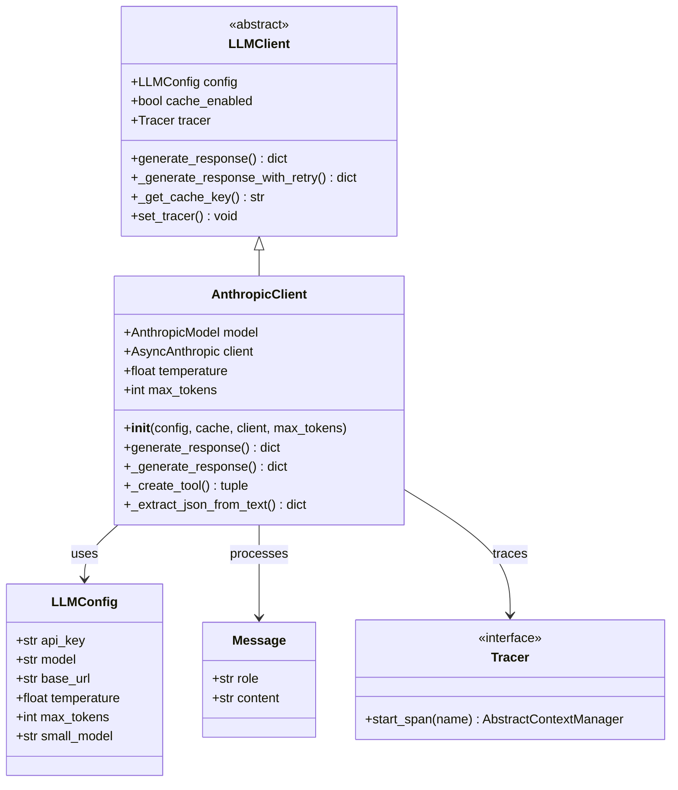
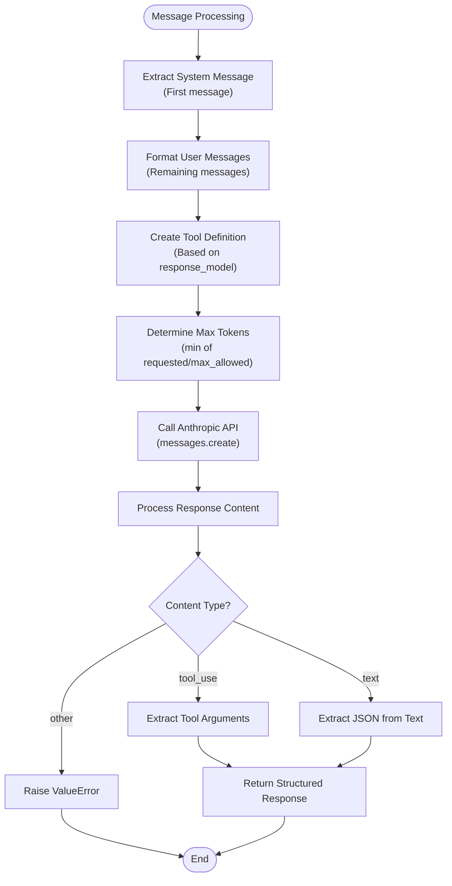
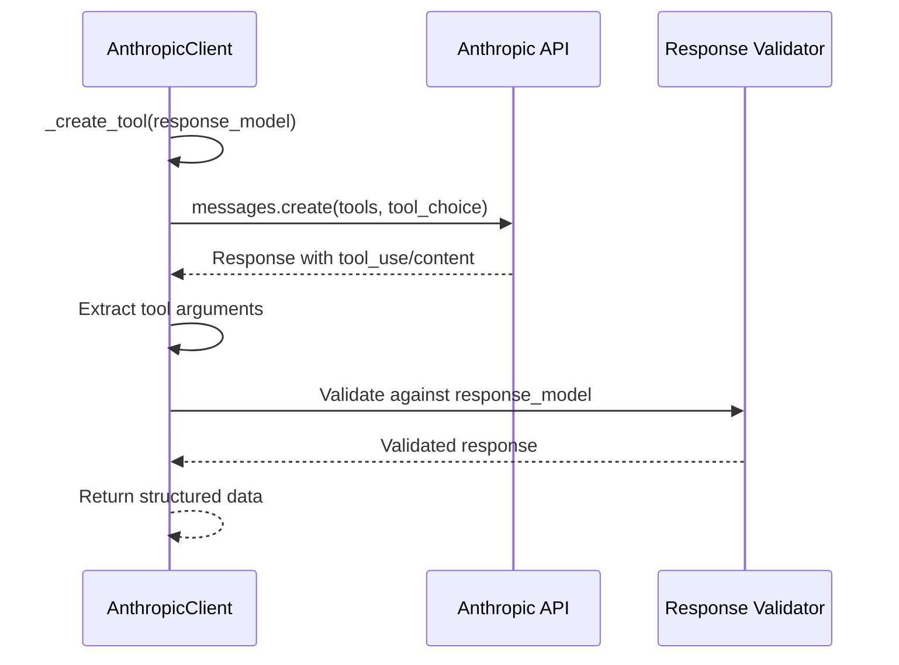
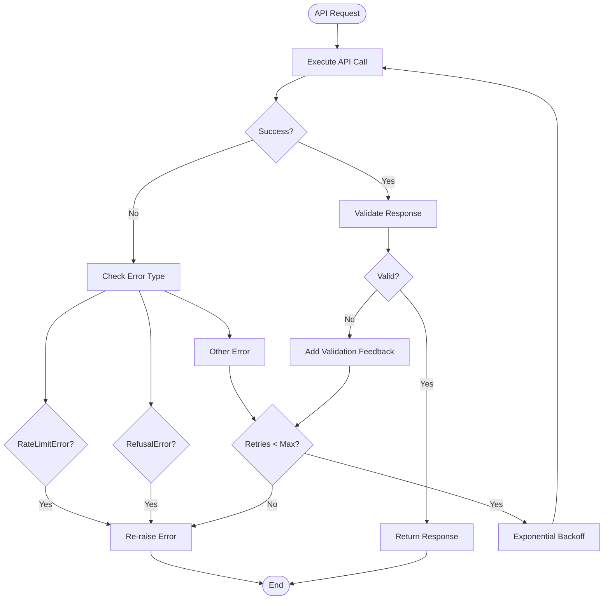

# Anthropic Client

<cite>
**Referenced Files in This Document**
- [anthropic_client.py](file://graphiti_core/llm_client/anthropic_client.py)
- [client.py](file://graphiti_core/llm_client/client.py)
- [config.py](file://graphiti_core/llm_client/config.py)
- [errors.py](file://graphiti_core/llm_client/errors.py)
- [tracer.py](file://graphiti_core/tracer.py)
- [models.py](file://graphiti_core/prompts/models.py)
- [test_anthropic_client.py](file://tests/llm_client/test_anthropic_client.py)
- [test_anthropic_client_int.py](file://tests/llm_client/test_anthropic_client_int.py)
</cite>

## Table of Contents
1. [Introduction](#introduction)
2. [Architecture Overview](#architecture-overview)
3. [Initialization and Configuration](#initialization-and-configuration)
4. [Core Implementation Details](#core-implementation-details)
5. [Message Processing and Formatting](#message-processing-and-formatting)
6. [Structured Output Generation](#structured-output-generation)
7. [Error Handling and Retry Mechanism](#error-handling-and-retry-mechanism)
8. [Caching and Performance](#caching-and-performance)
9. [Tracing and Monitoring](#tracing-and-monitoring)
10. [Usage Examples](#usage-examples)
11. [Best Practices](#best-practices)
12. [Troubleshooting](#troubleshooting)

## Introduction

The AnthropicClient is a specialized implementation of the LLMClient interface designed to interact with Anthropic's Claude language models. It provides a robust abstraction layer for generating responses using Claude models with support for both regular text completions and structured outputs using JSON mode. The client implements comprehensive error handling, retry mechanisms, caching, and observability features.

Key features include:
- Support for multiple Claude model variants
- Automatic structured output generation using tool-based APIs
- Intelligent JSON extraction from text responses
- Built-in retry logic with exponential backoff
- Comprehensive error mapping and handling
- Caching capabilities for improved performance
- OpenTelemetry integration for monitoring and tracing

## Architecture Overview

The AnthropicClient follows a layered architecture that separates concerns between configuration, message processing, API communication, and response handling.



**Diagram sources**
- [anthropic_client.py](file://graphiti_core/llm_client/anthropic_client.py#L68-L359)
- [client.py](file://graphiti_core/llm_client/client.py#L66-L243)
- [config.py](file://graphiti_core/llm_client/config.py#L28-L69)
- [models.py](file://graphiti_core/prompts/models.py#L23-L25)

## Initialization and Configuration

### Constructor Parameters

The AnthropicClient accepts several parameters for configuration and customization:

| Parameter | Type | Default | Description |
|-----------|------|---------|-------------|
| `config` | `LLMConfig \| None` | `None` | Configuration object containing API credentials and model settings |
| `cache` | `bool` | `False` | Whether to enable response caching |
| `client` | `AsyncAnthropic \| None` | `None` | Custom Anthropic client instance for advanced usage |
| `max_tokens` | `int` | `DEFAULT_MAX_TOKENS` | Maximum tokens for generated responses |

### Environment Variable Configuration

The client automatically sources the API key from the `ANTHROPIC_API_KEY` environment variable when no explicit configuration is provided. This enables seamless integration with CI/CD environments and development setups.

### Default Model Selection

When no model is specified in the configuration, the client defaults to `'claude-3-7-sonnet-latest'`, which provides optimal balance between cost and performance for most use cases.

**Section sources**
- [anthropic_client.py](file://graphiti_core/llm_client/anthropic_client.py#L89-L114)
- [config.py](file://graphiti_core/llm_client/config.py#L19-L20)

## Core Implementation Details

### Model Support

The client supports a comprehensive range of Claude models, each optimized for different use cases:

| Model Family | Latest Version | Use Case | Token Limit |
|--------------|----------------|----------|-------------|
| Claude 3.7 Sonnet | `claude-3-7-sonnet-latest` | General-purpose tasks, balanced performance | 200K+ |
| Claude 3.5 Haiku | `claude-3-5-haiku-latest` | Fast, lightweight tasks | 200K+ |
| Claude 3.5 Sonnet | `claude-3-5-sonnet-latest` | Complex reasoning, creative tasks | 200K+ |
| Claude 3 Opus | `claude-3-opus-latest` | Highest capability, complex reasoning | 200K+ |
| Claude 3 Sonnet | `claude-3-sonnet-20240229` | Production workloads | 200K+ |
| Claude 3 Haiku | `claude-3-haiku-20240307` | Fast, efficient processing | 200K+ |
| Claude 2.1 | `claude-2.1` | Legacy compatibility | 100K+ |
| Claude 2.0 | `claude-2.0` | Legacy compatibility | 100K+ |

### Temperature and Token Configuration

The client inherits temperature and maximum token settings from the LLMConfig, allowing fine-tuned control over response creativity and length. Default temperature is set to 1, providing balanced creativity while maintaining coherence.

**Section sources**
- [anthropic_client.py](file://graphiti_core/llm_client/anthropic_client.py#L49-L63)
- [config.py](file://graphiti_core/llm_client/config.py#L42-L44)

## Message Processing and Formatting

### System Message Extraction

The `_generate_response` method implements a sophisticated message processing pipeline that extracts system messages from the conversation history and formats them according to Anthropic's API requirements.



**Diagram sources**
- [anthropic_client.py](file://graphiti_core/llm_client/anthropic_client.py#L180-L248)

### Message Structure Requirements

Anthropic's API expects messages in a specific format with distinct roles:

- **System messages**: Must be provided as a separate `system` parameter
- **User messages**: Role must be either 'user' or 'assistant'
- **Message ordering**: Must follow chronological order

The client automatically handles this transformation, extracting the first message as the system context and formatting the remaining messages appropriately.

**Section sources**
- [anthropic_client.py](file://graphiti_core/llm_client/anthropic_client.py#L203-L205)

## Structured Output Generation

### Tool-Based Approach

The client employs a sophisticated tool-based approach for structured output generation, leveraging Anthropic's tool use capabilities for reliable structured responses.



**Diagram sources**
- [anthropic_client.py](file://graphiti_core/llm_client/anthropic_client.py#L142-L178)
- [anthropic_client.py](file://graphiti_core/llm_client/anthropic_client.py#L180-L248)

### Generic JSON Mode

When no specific response model is provided, the client creates a generic JSON output tool that allows the model to return any valid JSON structure. This provides flexibility for dynamic response formats while maintaining structured output guarantees.

### Validation and Error Recovery

The client implements robust validation logic that attempts to recover from parsing errors by retrying with corrective feedback. This ensures high reliability for structured output generation.

**Section sources**
- [anthropic_client.py](file://graphiti_core/llm_client/anthropic_client.py#L142-L178)
- [anthropic_client.py](file://graphiti_core/llm_client/anthropic_client.py#L215-L248)

## Error Handling and Retry Mechanism

### Error Classification

The client implements comprehensive error handling with specific error types for different failure scenarios:

| Error Type | Cause | Retry Behavior |
|------------|-------|----------------|
| `RateLimitError` | API rate limiting exceeded | Not retried (permanent failure) |
| `RefusalError` | Content policy violation | Not retried (permanent failure) |
| `ValidationError` | Response structure invalid | Retried with corrective feedback |
| `APIError` | Anthropic API errors | Conditionally retried |
| `JSONDecodeError` | Malformed JSON responses | Retried with corrective feedback |

### Retry Logic Implementation

The retry mechanism implements exponential backoff with jitter to handle transient failures gracefully:



**Diagram sources**
- [anthropic_client.py](file://graphiti_core/llm_client/anthropic_client.py#L301-L358)

### Specialized Error Handling

The client includes specialized handling for content policy violations, converting Anthropic's refusal responses into `RefusalError` exceptions to prevent unnecessary retries and provide clearer error messaging.

**Section sources**
- [anthropic_client.py](file://graphiti_core/llm_client/anthropic_client.py#L250-L258)
- [errors.py](file://graphiti_core/llm_client/errors.py#L18-L40)

## Caching and Performance

### Cache Implementation

The client integrates with the parent LLMClient's caching system, providing automatic response caching based on message content and model configuration.

### Cache Key Generation

Cache keys are generated using a combination of:
- Model identifier
- Serialized message content (sorted for consistency)
- Model configuration parameters

This ensures cache hits for identical requests while preventing collisions between different configurations.

### Performance Optimization

The caching mechanism significantly reduces API calls for repeated requests, improving both latency and cost efficiency. The client automatically handles cache misses and updates the cache with new responses.

**Section sources**
- [client.py](file://graphiti_core/llm_client/client.py#L143-L147)
- [client.py](file://graphiti_core/llm_client/client.py#L188-L211)

## Tracing and Monitoring

### OpenTelemetry Integration

The client provides comprehensive tracing support through OpenTelemetry integration, enabling detailed monitoring of LLM operations.

### Trace Attributes

Each LLM operation generates traces with the following attributes:

| Attribute | Value | Description |
|-----------|-------|-------------|
| `llm.provider` | `'anthropic'` | Provider identification |
| `model.size` | `ModelSize` enum | Model size category |
| `max_tokens` | `int` | Maximum tokens requested |
| `cache.enabled` | `bool` | Cache status |
| `prompt.name` | `str \| None` | Optional prompt identifier |

### Span Operations

The client wraps all LLM operations in tracing spans, providing:
- Operation timing measurement
- Error tracking and status reporting
- Exception recording for debugging
- Performance metrics collection

**Section sources**
- [anthropic_client.py](file://graphiti_core/llm_client/anthropic_client.py#L291-L299)
- [tracer.py](file://graphiti_core/tracer.py#L159-L194)

## Usage Examples

### Basic Text Completion

```python
from graphiti_core.llm_client.anthropic_client import AnthropicClient
from graphiti_core.prompts.models import Message

# Initialize client with default configuration
client = AnthropicClient()

# Define conversation messages
messages = [
    Message(role='system', content='You are a helpful assistant.'),
    Message(role='user', content='Explain quantum computing in simple terms.')
]

# Generate response
response = await client.generate_response(messages)
print(response)
```

### Structured Output with Pydantic Model

```python
from pydantic import BaseModel, Field
from graphiti_core.llm_client.anthropic_client import AnthropicClient
from graphiti_core.prompts.models import Message

class AnswerModel(BaseModel):
    summary: str = Field(description="Concise summary of the response")
    confidence: float = Field(description="Confidence level (0.0-1.0)")
    key_points: list[str] = Field(description="Important points")

# Initialize client
client = AnthropicClient()

# Generate structured response
response = await client.generate_response(
    messages=[
        Message(role='system', content='Provide a structured response.'),
        Message(role='user', content='What are the benefits of renewable energy?')
    ],
    response_model=AnswerModel
)

print(response.summary)
print(response.confidence)
print(response.key_points)
```

### Custom Configuration

```python
from graphiti_core.llm_client.anthropic_client import AnthropicClient
from graphiti_core.llm_client.config import LLMConfig, ModelSize

# Configure with custom settings
config = LLMConfig(
    api_key='your-api-key',
    model='claude-3-5-sonnet-latest',
    temperature=0.7,
    max_tokens=2000
)

client = AnthropicClient(
    config=config,
    cache=True,
    max_tokens=1500
)

response = await client.generate_response(
    messages=[...],
    model_size=ModelSize.large
)
```

### Error Handling Example

```python
from graphiti_core.llm_client.anthropic_client import AnthropicClient
from graphiti_core.llm_client.errors import RateLimitError, RefusalError

client = AnthropicClient()

try:
    response = await client.generate_response(messages)
except RateLimitError:
    print("Rate limit exceeded. Try again later.")
except RefusalError:
    print("Content policy violation. Cannot process request.")
except Exception as e:
    print(f"Unexpected error: {e}")
```

## Best Practices

### Model Selection Guidelines

Choose the appropriate Claude model based on your use case requirements:

- **Claude 3.7 Sonnet**: Best general-purpose model for most applications
- **Claude 3.5 Haiku**: Optimal for fast, cost-effective processing
- **Claude 3.5 Sonnet**: Balanced performance for complex reasoning tasks
- **Claude 3 Opus**: Highest capability for demanding computational tasks

### Token Management

- Set appropriate `max_tokens` based on your response requirements
- Monitor token usage for cost optimization
- Use smaller models for simple tasks to reduce costs

### Error Handling Strategies

- Implement proper exception handling for production deployments
- Use structured error handling to differentiate between temporary and permanent failures
- Consider implementing circuit breaker patterns for critical systems

### Caching Considerations

- Enable caching for repetitive requests to improve performance
- Be mindful of cache invalidation for dynamic content
- Monitor cache hit rates to optimize performance

## Troubleshooting

### Common Issues and Solutions

| Issue | Symptoms | Solution |
|-------|----------|----------|
| API Key Errors | Authentication failures | Verify `ANTHROPIC_API_KEY` environment variable |
| Rate Limiting | `RateLimitError` exceptions | Implement exponential backoff or upgrade API tier |
| Content Policy Violations | `RefusalError` exceptions | Review content for policy compliance |
| JSON Parsing Failures | Validation errors | Use structured output with Pydantic models |
| Slow Response Times | High latency | Enable caching and optimize token limits |

### Debugging Techniques

1. **Enable Logging**: Increase log level to debug for detailed operation information
2. **Monitor Traces**: Use OpenTelemetry integration to track performance bottlenecks
3. **Cache Analysis**: Monitor cache hit rates to identify optimization opportunities
4. **Error Patterns**: Track error types to identify recurring issues

### Performance Optimization

- **Token Optimization**: Reduce `max_tokens` for shorter responses
- **Model Selection**: Choose appropriate model based on complexity requirements
- **Caching Strategy**: Enable caching for repetitive requests
- **Batch Processing**: Group related requests when possible

**Section sources**
- [test_anthropic_client.py](file://tests/llm_client/test_anthropic_client.py#L102-L101)
- [anthropic_client.py](file://graphiti_core/llm_client/anthropic_client.py#L301-L358)