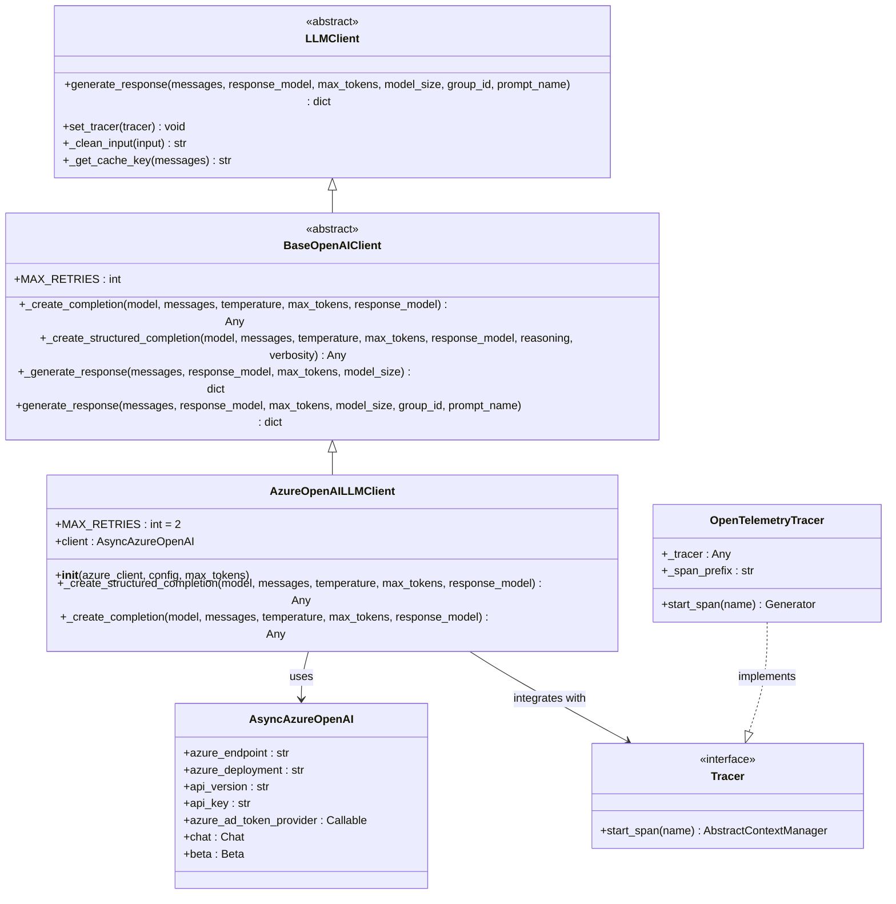
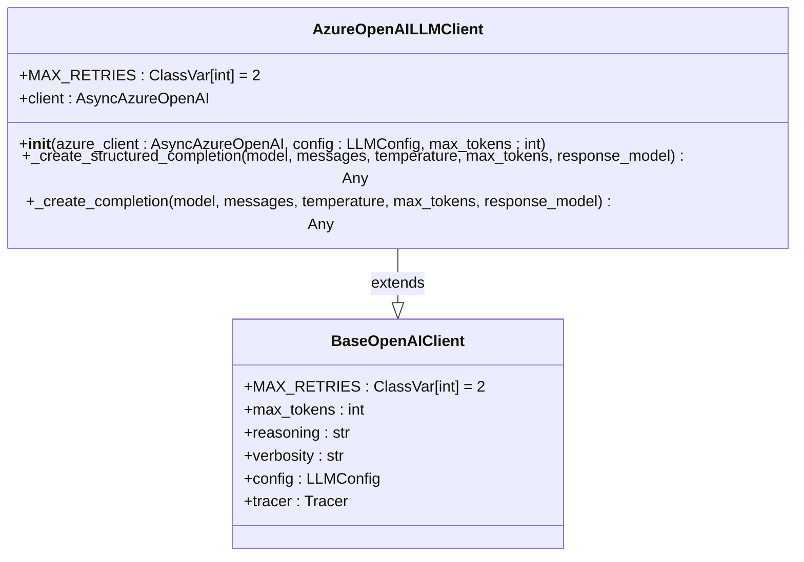
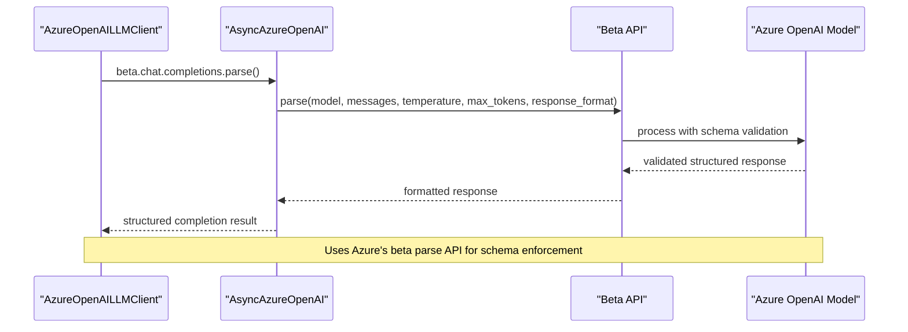
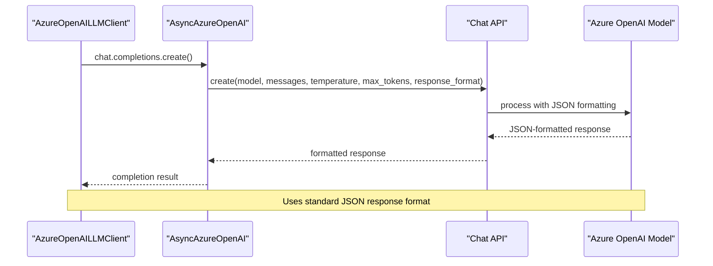
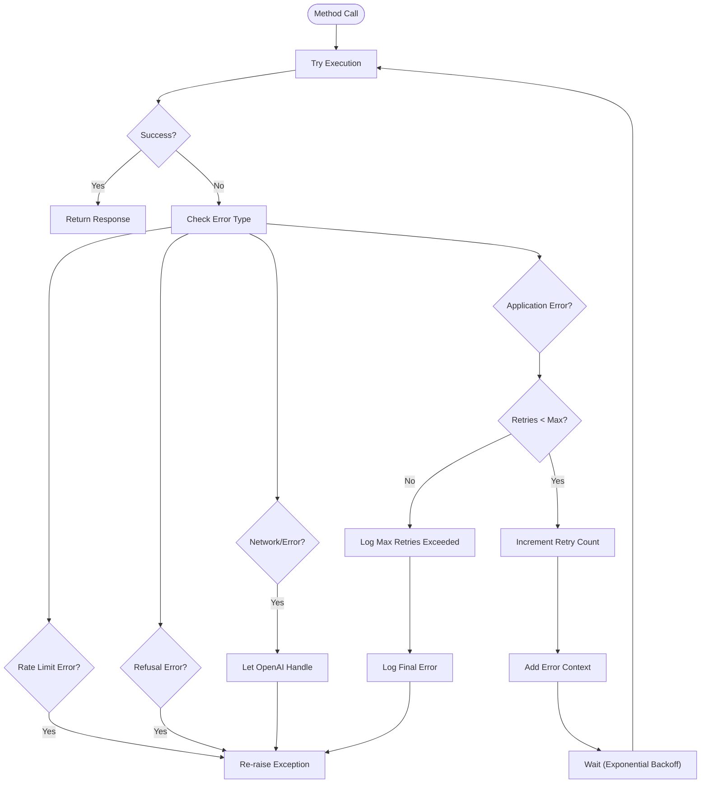
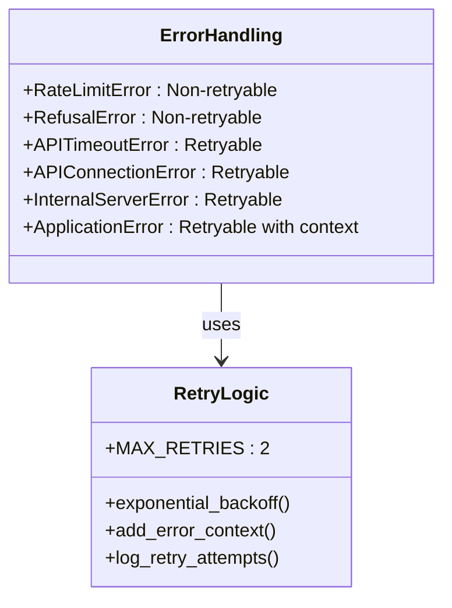
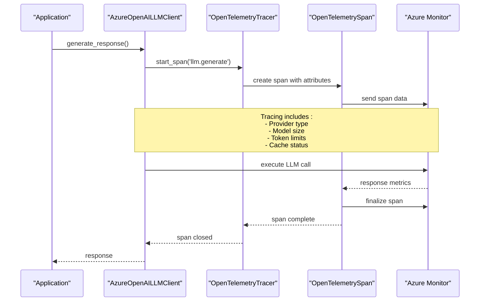

# Azure OpenAI Client

<cite>
**Referenced Files in This Document**
- [azure_openai_client.py](file://graphiti_core/llm_client/azure_openai_client.py)
- [openai_base_client.py](file://graphiti_core/llm_client/openai_base_client.py)
- [client.py](file://graphiti_core/llm_client/client.py)
- [config.py](file://graphiti_core/llm_client/config.py)
- [tracer.py](file://graphiti_core/tracer.py)
- [errors.py](file://graphiti_core/llm_client/errors.py)
- [graphiti_mcp_server.py](file://mcp_server/graphiti_mcp_server.py)
- [azure_openai.py](file://graphiti_core/embedder/azure_openai.py)
</cite>

## Table of Contents
1. [Introduction](#introduction)
2. [Architecture Overview](#architecture-overview)
3. [Core Implementation](#core-implementation)
4. [Initialization and Configuration](#initialization-and-configuration)
5. [Completion Methods](#completion-methods)
6. [Authentication and Security](#authentication-and-security)
7. [Error Handling and Retry Logic](#error-handling-and-retry-logic)
8. [Azure Monitor Integration](#azure-monitor-integration)
9. [Enterprise Deployment Considerations](#enterprise-deployment-considerations)
10. [Usage Examples](#usage-examples)
11. [Best Practices](#best-practices)

## Introduction

The Azure OpenAI Client (`AzureOpenAILLMClient`) is a specialized implementation that extends the `BaseOpenAIClient` to provide seamless integration with Azure OpenAI services. This client enables enterprise applications to leverage Azure's managed OpenAI infrastructure with robust authentication mechanisms, comprehensive error handling, and enterprise-grade monitoring capabilities.

The client implements the `LLMClient` interface while adding Azure-specific features including support for both API key and Azure Active Directory (AAD) authentication, deployment-specific routing, and integration with Azure Monitor for observability.

## Architecture Overview

The Azure OpenAI Client follows a layered architecture that separates concerns between interface definition, base functionality, and Azure-specific implementation:



**Diagram sources**
- [azure_openai_client.py](file://graphiti_core/llm_client/azure_openai_client.py#L30-L78)
- [openai_base_client.py](file://graphiti_core/llm_client/openai_base_client.py#L40-L250)
- [client.py](file://graphiti_core/llm_client/client.py#L66-L243)
- [tracer.py](file://graphiti_core/tracer.py#L52-L194)

**Section sources**
- [azure_openai_client.py](file://graphiti_core/llm_client/azure_openai_client.py#L30-L78)
- [openai_base_client.py](file://graphiti_core/llm_client/openai_base_client.py#L40-L250)

## Core Implementation

The `AzureOpenAILLMClient` serves as a bridge between the Graphiti framework and Azure OpenAI services, implementing the core functionality required for LLM operations while maintaining compatibility with the broader ecosystem.

### Class Structure and Constants

The client defines several key constants and maintains a clean separation between interface requirements and implementation details:



**Diagram sources**
- [azure_openai_client.py](file://graphiti_core/llm_client/azure_openai_client.py#L34-L44)
- [openai_base_client.py](file://graphiti_core/llm_client/openai_base_client.py#L48-L69)

### Inheritance and Interface Compliance

The client inherits from `BaseOpenAIClient` which provides shared functionality for OpenAI-compatible APIs, while implementing the abstract methods required by the `LLMClient` interface. This design ensures consistent behavior across different OpenAI providers while allowing for Azure-specific optimizations.

**Section sources**
- [azure_openai_client.py](file://graphiti_core/llm_client/azure_openai_client.py#L30-L78)
- [openai_base_client.py](file://graphiti_core/llm_client/openai_base_client.py#L40-L250)

## Initialization and Configuration

### Constructor Parameters

The `AzureOpenAILLMClient` constructor accepts three primary parameters that define the client's behavior and connectivity:

| Parameter | Type | Description | Required |
|-----------|------|-------------|----------|
| `azure_client` | `AsyncAzureOpenAI` | Pre-configured Azure OpenAI client instance | Yes |
| `config` | `LLMConfig \| None` | Configuration object for LLM settings | No |
| `max_tokens` | `int` | Maximum tokens for responses (defaults to `DEFAULT_MAX_TOKENS`) | No |

### Azure OpenAI Client Configuration

The `AsyncAzureOpenAI` client requires specific parameters for Azure deployment connectivity:

| Parameter | Type | Description | Environment Variable |
|-----------|------|-------------|---------------------|
| `azure_endpoint` | `str` | Azure OpenAI service endpoint URL | `AZURE_OPENAI_ENDPOINT` |
| `azure_deployment` | `str` | Specific deployment name for the model | `AZURE_OPENAI_DEPLOYMENT_NAME` |
| `api_version` | `str` | API version to use (typically `2024-02-15-preview`) | `AZURE_OPENAI_API_VERSION` |
| `api_key` | `str \| None` | Authentication key for API access | `AZURE_OPENAI_API_KEY` |
| `azure_ad_token_provider` | `Callable \| None` | Token provider for AAD authentication | N/A |

### Configuration Examples

#### Basic API Key Authentication
```python
from openai import AsyncAzureOpenAI
from graphiti_core.llm_client import AzureOpenAILLMClient, LLMConfig

# Create Azure OpenAI client
azure_client = AsyncAzureOpenAI(
    azure_endpoint="https://your-resource.openai.azure.com/",
    azure_deployment="your-deployment-name",
    api_version="2024-02-15-preview",
    api_key="your-api-key-here"
)

# Initialize Graphiti client
config = LLMConfig(
    model="gpt-4",
    temperature=0.7,
    max_tokens=2048
)

client = AzureOpenAILLMClient(
    azure_client=azure_client,
    config=config,
    max_tokens=2048
)
```

#### Azure Active Directory Authentication
```python
from azure.identity import DefaultAzureCredential
from openai import AsyncAzureOpenAI
from graphiti_core.llm_client import AzureOpenAILLMClient, LLMConfig

# Create token provider using managed identity
credential = DefaultAzureCredential()
token_provider = credential.get_token("https://cognitiveservices.azure.com/.default")

# Configure Azure OpenAI client with AAD
azure_client = AsyncAzureOpenAI(
    azure_endpoint="https://your-resource.openai.azure.com/",
    azure_deployment="your-deployment-name",
    api_version="2024-02-15-preview",
    azure_ad_token_provider=token_provider
)

client = AzureOpenAILLMClient(azure_client=azure_client, config=config)
```

**Section sources**
- [azure_openai_client.py](file://graphiti_core/llm_client/azure_openai_client.py#L36-L44)
- [graphiti_mcp_server.py](file://mcp_server/graphiti_mcp_server.py#L300-L334)

## Completion Methods

The Azure OpenAI Client implements two distinct completion methods, each optimized for different use cases and response formats.

### Structured Completion Method

The `_create_structured_completion` method leverages Azure OpenAI's beta parse API for schema-enforced responses:



**Diagram sources**
- [azure_openai_client.py](file://graphiti_core/llm_client/azure_openai_client.py#L45-L60)

#### Method Signature and Parameters

| Parameter | Type | Description |
|-----------|------|-------------|
| `model` | `str` | Target deployment name |
| `messages` | `list[ChatCompletionMessageParam]` | Conversation history |
| `temperature` | `float \| None` | Sampling temperature |
| `max_tokens` | `int` | Maximum response tokens |
| `response_model` | `type[BaseModel]` | Pydantic model for schema validation |

#### Usage Scenarios

- **Structured Data Extraction**: Extracting entities, relationships, and attributes with guaranteed schema compliance
- **JSON Response Validation**: Ensuring API responses conform to expected data structures
- **Formalized Output Formats**: Producing machine-readable responses for downstream processing

### Regular Completion Method

The `_create_completion` method provides standard JSON-formatted responses:



**Diagram sources**
- [azure_openai_client.py](file://graphiti_core/llm_client/azure_openai_client.py#L62-L77)

#### Method Features

- **Flexible Response Format**: Returns standard JSON objects without strict schema enforcement
- **Standard Compatibility**: Works with all Azure OpenAI deployments that support the standard API
- **Fallback Option**: Available when beta features are not enabled or supported

**Section sources**
- [azure_openai_client.py](file://graphiti_core/llm_client/azure_openai_client.py#L45-L77)

## Authentication and Security

### Supported Authentication Methods

The Azure OpenAI Client supports multiple authentication mechanisms to accommodate different enterprise security requirements:

#### 1. API Key Authentication
The most straightforward authentication method using Azure OpenAI API keys:

```python
# Environment-based configuration
import os
from openai import AsyncAzureOpenAI

azure_client = AsyncAzureOpenAI(
    azure_endpoint=os.getenv('AZURE_OPENAI_ENDPOINT'),
    azure_deployment=os.getenv('AZURE_OPENAI_DEPLOYMENT_NAME'),
    api_version=os.getenv('AZURE_OPENAI_API_VERSION'),
    api_key=os.getenv('AZURE_OPENAI_API_KEY')
)
```

#### 2. Azure Active Directory Authentication
For enterprise environments requiring managed identity or service principal authentication:

```python
from azure.identity import DefaultAzureCredential
from openai import AsyncAzureOpenAI

# Using managed identity (recommended for Azure-hosted applications)
credential = DefaultAzureCredential()
token_provider = credential.get_token("https://cognitiveservices.azure.com/.default")

azure_client = AsyncAzureOpenAI(
    azure_endpoint="https://your-resource.openai.azure.com/",
    azure_deployment="your-deployment-name",
    api_version="2024-02-15-preview",
    azure_ad_token_provider=token_provider
)
```

#### 3. Service Principal Authentication
For applications requiring explicit service principal credentials:

```python
from azure.identity import ClientSecretCredential
from openai import AsyncAzureOpenAI

credential = ClientSecretCredential(
    tenant_id="your-tenant-id",
    client_id="your-client-id",
    client_secret="your-client-secret"
)

token_provider = credential.get_token("https://cognitiveservices.azure.com/.default")
```

### Security Best Practices

| Practice | Implementation | Benefit |
|----------|----------------|---------|
| **Environment Variables** | Store credentials in environment variables | Prevents credential exposure in code |
| **Managed Identity** | Use Azure managed identity for Azure-hosted apps | Eliminates credential storage requirements |
| **RBAC Permissions** | Configure role-based access control | Limits credential scope to necessary operations |
| **Key Rotation** | Regularly rotate API keys | Reduces impact of credential compromise |
| **Network Isolation** | Use private endpoints | Restricts network access to trusted networks |

**Section sources**
- [graphiti_mcp_server.py](file://mcp_server/graphiti_mcp_server.py#L300-L334)

## Error Handling and Retry Logic

### Retry Strategy

The Azure OpenAI Client implements a sophisticated retry mechanism that handles various failure scenarios while respecting Azure OpenAI's rate limits and service constraints.



**Diagram sources**
- [openai_base_client.py](file://graphiti_core/llm_client/openai_base_client.py#L198-L249)

### Error Types and Handling

#### Azure-Specific Error Conditions

| Error Condition | Cause | Handling Strategy |
|-----------------|-------|-------------------|
| **Deployment Not Ready** | Model deployment in provisioning state | Automatic retry with exponential backoff |
| **Quota Exceeded** | Subscription or deployment quota limitations | Immediate failure with RateLimitError |
| **Resource Not Found** | Incorrect deployment name or endpoint | Fail fast with configuration validation |
| **Authentication Failure** | Invalid API key or AAD token | Immediate failure with credential validation |
| **Internal Server Error** | Azure service temporary unavailability | Automatic retry with OpenAI's built-in retry logic |

#### Error Classification

The client distinguishes between different error categories to apply appropriate handling strategies:



**Diagram sources**
- [openai_base_client.py](file://graphiti_core/llm_client/openai_base_client.py#L208-L249)
- [errors.py](file://graphiti_core/llm_client/errors.py#L18-L40)

### Retry Configuration

The client implements a conservative retry strategy with the following characteristics:

- **Maximum Retries**: 2 attempts total (1 retry)
- **Backoff Strategy**: Exponential with jitter
- **Error Context**: Automatic error message injection for subsequent attempts
- **Failure Modes**: Immediate termination for unrecoverable errors

**Section sources**
- [openai_base_client.py](file://graphiti_core/llm_client/openai_base_client.py#L198-L249)
- [errors.py](file://graphiti_core/llm_client/errors.py#L18-L40)

## Azure Monitor Integration

### Tracing Architecture

The Azure OpenAI Client seamlessly integrates with Azure Monitor through the OpenTelemetry tracing system, providing comprehensive observability for production deployments.



**Diagram sources**
- [client.py](file://graphiti_core/llm_client/client.py#L175-L207)
- [tracer.py](file://graphiti_core/tracer.py#L148-L156)

### Tracing Attributes

The client automatically captures comprehensive attributes for each LLM operation:

| Attribute | Value | Purpose |
|-----------|-------|---------|
| `llm.provider` | `"azure"` | Identifies Azure OpenAI provider |
| `model.size` | `"small"`, `"medium"` | Indicates model size selection |
| `max_tokens` | `int` | Configured token limit |
| `cache.enabled` | `true/false` | Caching status |
| `prompt.name` | `str \| None` | Named prompt identifier |
| `cache.hit` | `true/false` | Cache effectiveness indicator |

### Monitoring Capabilities

#### Performance Metrics
- **Response Times**: End-to-end latency measurements
- **Token Usage**: Input and output token counting
- **Success Rates**: Operation success/failure ratios
- **Error Patterns**: Classification and trend analysis

#### Operational Insights
- **Cache Efficiency**: Hit rate and performance impact
- **Model Utilization**: Usage patterns by model size
- **Error Distribution**: Frequency and categorization of failures
- **Resource Consumption**: Token and cost tracking

**Section sources**
- [client.py](file://graphiti_core/llm_client/client.py#L175-L207)
- [tracer.py](file://graphiti_core/tracer.py#L148-L194)

## Enterprise Deployment Considerations

### Scalability and Performance

#### Horizontal Scaling Strategies
- **Multiple Deployments**: Distribute load across multiple Azure OpenAI deployments
- **Regional Replication**: Deploy across Azure regions for geographic distribution
- **Model Tiering**: Use smaller models for routine tasks, larger models for complex operations

#### Performance Optimization
- **Connection Pooling**: Reuse AsyncAzureOpenAI instances across requests
- **Batch Processing**: Group multiple requests for improved throughput
- **Caching Strategy**: Implement intelligent caching for repeated queries

### Security and Compliance

#### Data Protection
- **Encryption**: Ensure TLS encryption for all communications
- **Access Control**: Implement principle of least privilege
- **Audit Logging**: Comprehensive logging for compliance requirements

#### Regulatory Compliance
- **GDPR**: Data processing and retention policies
- **HIPAA**: Healthcare data handling requirements
- **SOX**: Financial data protection standards

### Cost Management

#### Optimization Strategies
- **Model Selection**: Choose appropriate model sizes for specific tasks
- **Token Efficiency**: Optimize prompts for fewer tokens
- **Rate Limiting**: Implement client-side rate limiting
- **Monitoring**: Track and optimize token usage patterns

#### Cost Tracking
```python
# Example cost tracking implementation
class AzureOpenAILLMClientWithCostTracking(AzureOpenAILLMClient):
    def __init__(self, *args, **kwargs):
        super().__init__(*args, **kwargs)
        self.total_tokens = 0
        self.total_cost = 0.0
        
    async def generate_response(self, *args, **kwargs):
        response = await super().generate_response(*args, **kwargs)
        
        # Calculate costs based on Azure pricing
        input_tokens = estimate_input_tokens(response)
        output_tokens = estimate_output_tokens(response)
        
        self.total_tokens += input_tokens + output_tokens
        self.total_cost += calculate_cost(input_tokens, output_tokens)
        
        return response
```

### High Availability

#### Fault Tolerance
- **Circuit Breaker**: Implement circuit breaker pattern for degraded services
- **Fallback Mechanisms**: Provide alternative responses when primary service fails
- **Health Checks**: Regular health monitoring of Azure OpenAI endpoints

#### Disaster Recovery
- **Multi-region Deployment**: Deploy across multiple Azure regions
- **Backup Services**: Maintain fallback LLM providers
- **Graceful Degradation**: Reduce functionality rather than complete failure

**Section sources**
- [azure_openai_client.py](file://graphiti_core/llm_client/azure_openai_client.py#L34-L35)
- [openai_base_client.py](file://graphiti_core/llm_client/openai_base_client.py#L48-L49)

## Usage Examples

### Basic Text Generation

```python
import asyncio
from openai import AsyncAzureOpenAI
from graphiti_core.llm_client import AzureOpenAILLMClient, LLMConfig
from graphiti_core.prompts.models import Message

async def basic_text_generation():
    # Configure Azure OpenAI client
    azure_client = AsyncAzureOpenAI(
        azure_endpoint="https://your-resource.openai.azure.com/",
        azure_deployment="your-deployment-name",
        api_version="2024-02-15-preview",
        api_key="your-api-key"
    )
    
    # Create Graphiti client
    config = LLMConfig(
        model="gpt-4",
        temperature=0.7,
        max_tokens=1000
    )
    
    client = AzureOpenAILLMClient(
        azure_client=azure_client,
        config=config
    )
    
    # Generate response
    messages = [
        Message(role="system", content="You are a helpful assistant."),
        Message(role="user", content="Explain quantum computing in simple terms.")
    ]
    
    response = await client.generate_response(messages)
    print(response)
```

### Structured Data Extraction

```python
from pydantic import BaseModel
from typing import List

class Entity(BaseModel):
    name: str
    type: str
    confidence: float

class Relationship(BaseModel):
    subject: str
    predicate: str
    object: str
    confidence: float

async def structured_extraction():
    # Define response models
    class ExtractionResult(BaseModel):
        entities: List[Entity]
        relationships: List[Relationship]
        summary: str
    
    # Configure client with structured output
    client = AzureOpenAILLMClient(azure_client=azure_client, config=config)
    
    messages = [
        Message(role="system", content="Extract entities and relationships from the text."),
        Message(role="user", content="Elon Musk founded SpaceX in 2002. He also started Tesla.")
    ]
    
    # Generate structured response
    response = await client.generate_response(
        messages=messages,
        response_model=ExtractionResult
    )
    
    print(f"Entities: {len(response['entities'])}")
    print(f"Relationships: {len(response['relationships'])}")
    print(f"Summary: {response['summary']}")
```

### Enterprise Configuration

```python
import os
from azure.identity import DefaultAzureCredential
from openai import AsyncAzureOpenAI
from graphiti_core.llm_client import AzureOpenAILLMClient, LLMConfig
from graphiti_core.telemetry import create_tracer

async def enterprise_setup():
    # Configure Azure OpenAI with managed identity
    credential = DefaultAzureCredential()
    token_provider = credential.get_token("https://cognitiveservices.azure.com/.default")
    
    azure_client = AsyncAzureOpenAI(
        azure_endpoint=os.getenv('AZURE_OPENAI_ENDPOINT'),
        azure_deployment=os.getenv('AZURE_OPENAI_DEPLOYMENT_NAME'),
        api_version=os.getenv('AZURE_OPENAI_API_VERSION'),
        azure_ad_token_provider=token_provider
    )
    
    # Configure enterprise settings
    config = LLMConfig(
        model="gpt-4",
        temperature=0.3,  # Lower temperature for consistency
        max_tokens=4096,
        small_model="gpt-3.5-turbo"  # Different model for simple tasks
    )
    
    # Enable tracing for monitoring
    tracer = create_tracer(otel_tracer=get_opentelemetry_tracer())
    
    client = AzureOpenAILLMClient(
        azure_client=azure_client,
        config=config,
        max_tokens=4096
    )
    
    client.set_tracer(tracer)
    
    return client
```

**Section sources**
- [graphiti_mcp_server.py](file://mcp_server/graphiti_mcp_server.py#L300-L334)

## Best Practices

### Configuration Management

#### Environment-Based Configuration
```python
import os
from dataclasses import dataclass

@dataclass
class AzureOpenAIConfig:
    endpoint: str = os.getenv('AZURE_OPENAI_ENDPOINT')
    deployment: str = os.getenv('AZURE_OPENAI_DEPLOYMENT_NAME')
    api_version: str = os.getenv('AZURE_OPENAI_API_VERSION', '2024-02-15-preview')
    api_key: str | None = os.getenv('AZURE_OPENAI_API_KEY')
    use_managed_identity: bool = os.getenv('AZURE_OPENAI_USE_MANAGED_IDENTITY', 'false').lower() == 'true'
    
    def create_azure_client(self) -> AsyncAzureOpenAI:
        if self.use_managed_identity:
            from azure.identity import DefaultAzureCredential
            credential = DefaultAzureCredential()
            token_provider = credential.get_token("https://cognitiveservices.azure.com/.default")
            
            return AsyncAzureOpenAI(
                azure_endpoint=self.endpoint,
                azure_deployment=self.deployment,
                api_version=self.api_version,
                azure_ad_token_provider=token_provider
            )
        else:
            return AsyncAzureOpenAI(
                azure_endpoint=self.endpoint,
                azure_deployment=self.deployment,
                api_version=self.api_version,
                api_key=self.api_key
            )
```

#### Connection Pooling
```python
# Recommended: Reuse client instances
class AzureOpenAIManager:
    def __init__(self):
        self._client = None
        self._config = None
    
    async def get_client(self) -> AzureOpenAILLMClient:
        if self._client is None:
            config = AzureOpenAIConfig()
            azure_client = config.create_azure_client()
            
            self._config = LLMConfig(
                model="gpt-4",
                temperature=0.7,
                max_tokens=2048
            )
            
            self._client = AzureOpenAILLMClient(
                azure_client=azure_client,
                config=self._config
            )
        
        return self._client
```

### Performance Optimization

#### Prompt Engineering
- **Clear Instructions**: Provide specific, unambiguous instructions
- **Context Length**: Balance context window utilization with token efficiency
- **Temperature Tuning**: Use lower temperatures for factual responses, higher for creative tasks

#### Caching Strategy
```python
# Intelligent caching implementation
class CachingAzureOpenAILLMClient(AzureOpenAILLMClient):
    def __init__(self, *args, cache_ttl: int = 3600, **kwargs):
        super().__init__(*args, **kwargs)
        self.cache_ttl = cache_ttl
        self._cache = {}
    
    async def generate_response(self, messages, *args, **kwargs):
        # Create cache key from messages and parameters
        cache_key = self._create_cache_key(messages, kwargs)
        
        if cache_key in self._cache:
            cached_result, expiry = self._cache[cache_key]
            if expiry > time.time():
                return cached_result
        
        # Generate fresh response
        response = await super().generate_response(messages, *args, **kwargs)
        
        # Cache the result
        self._cache[cache_key] = (response, time.time() + self.cache_ttl)
        
        return response
```

### Monitoring and Observability

#### Health Monitoring
```python
import logging
from functools import wraps

def monitor_llm_calls(func):
    @wraps(func)
    async def wrapper(self, *args, **kwargs):
        logger = logging.getLogger(__name__)
        
        try:
            with self.tracer.start_span('llm.call') as span:
                span.add_attributes({
                    'operation': func.__name__,
                    'model': self.config.model,
                    'temperature': self.config.temperature
                })
                
                result = await func(self, *args, **kwargs)
                
                span.add_attributes({'status': 'success'})
                return result
                
        except Exception as e:
            logger.error(f"LLM call failed: {e}")
            raise
    
    return wrapper

# Apply to client methods
AzureOpenAILLMClient.generate_response = monitor_llm_calls(AzureOpenAILLMClient.generate_response)
```

### Security Considerations

#### Credential Management
- **Environment Variables**: Never hardcode credentials
- **Secret Management**: Use Azure Key Vault or similar services
- **Rotation Policies**: Implement regular credential rotation
- **Scope Limiting**: Use least-privilege access patterns

#### Input Sanitization
```python
def sanitize_input(content: str) -> str:
    """Sanitize input to prevent injection attacks."""
    # Remove potentially harmful patterns
    content = re.sub(r'<script.*?>.*?</script>', '', content, flags=re.IGNORECASE)
    content = re.sub(r'on\w+\s*=', '', content, flags=re.IGNORECASE)
    
    # Truncate excessively long inputs
    max_length = 10000
    if len(content) > max_length:
        content = content[:max_length] + '...'
    
    return content
```

### Error Handling Patterns

#### Graceful Degradation
```python
class ResilientAzureOpenAILLMClient(AzureOpenAILLMClient):
    async def generate_response(self, messages, *args, **kwargs):
        try:
            return await super().generate_response(messages, *args, **kwargs)
        except RateLimitError:
            # Fallback to smaller model or cached response
            if hasattr(self, '_fallback_model'):
                return await self._generate_with_fallback(messages)
            raise
        except Exception as e:
            # Log error and provide meaningful feedback
            logger.warning(f"Primary LLM call failed: {e}")
            return {"error": "Unable to process request", "fallback_available": True}
```

These best practices ensure reliable, secure, and performant Azure OpenAI integration in enterprise environments while maintaining flexibility for various use cases and deployment scenarios.