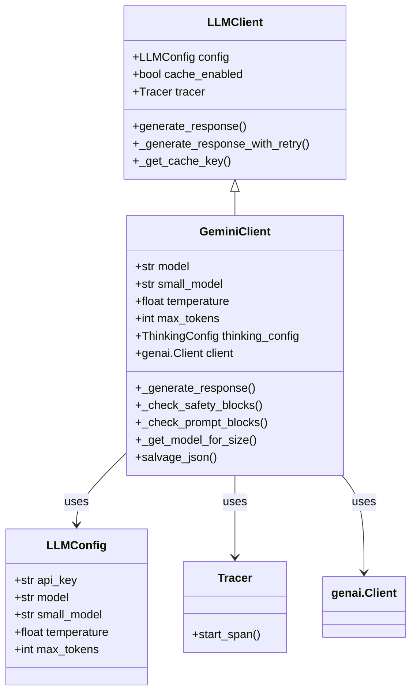
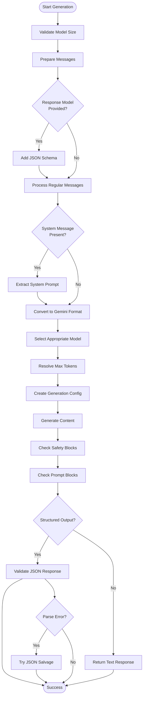
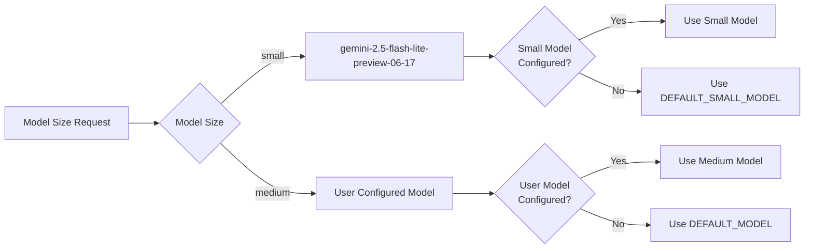
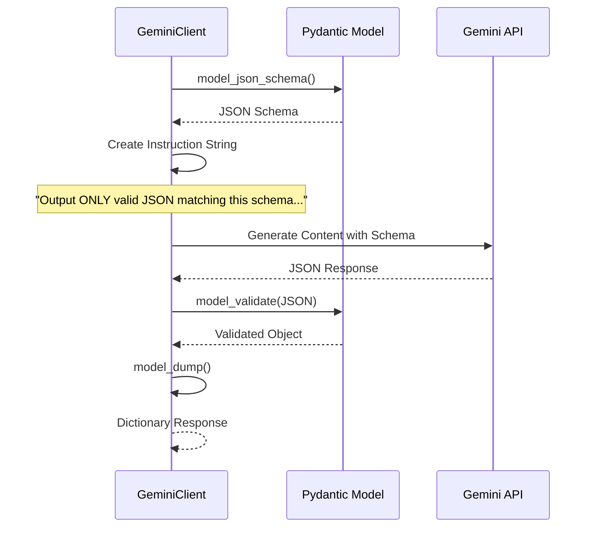
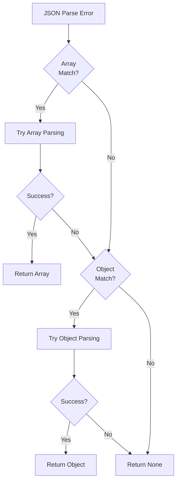
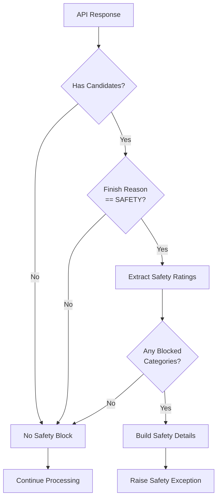
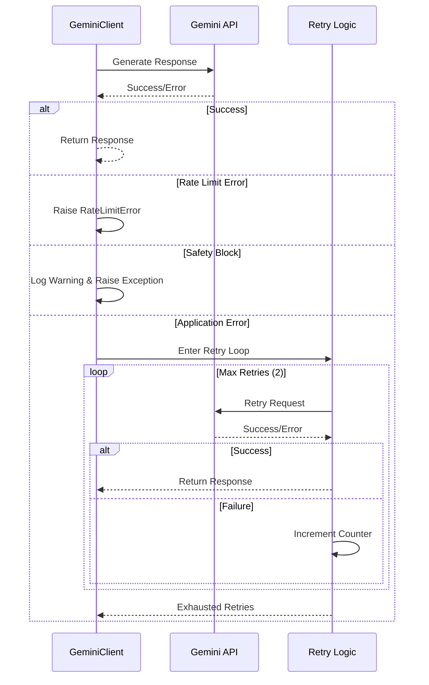
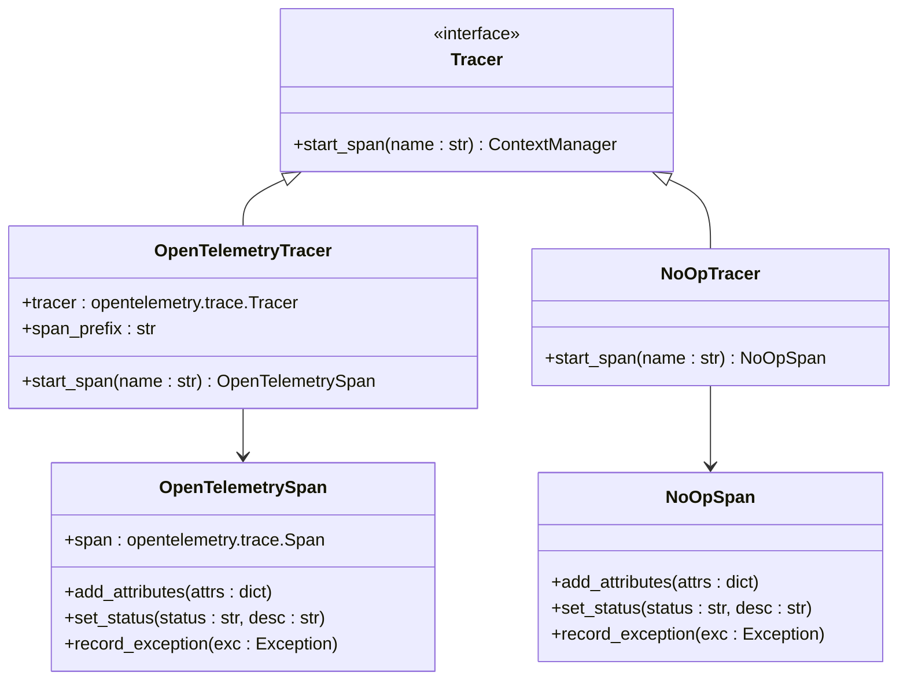
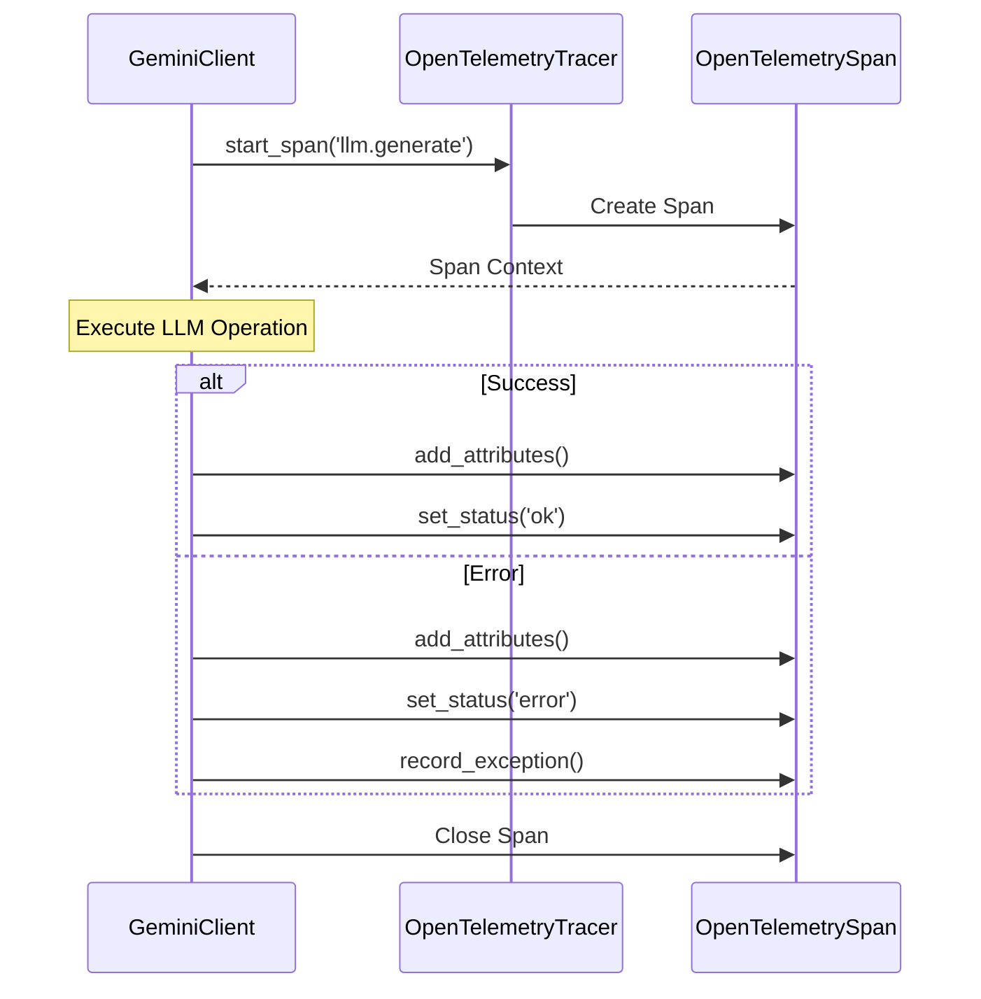

# Google Gemini Client

<cite>
**Referenced Files in This Document**
- [gemini_client.py](file://graphiti_core/llm_client/gemini_client.py)
- [client.py](file://graphiti_core/llm_client/client.py)
- [config.py](file://graphiti_core/llm_client/config.py)
- [errors.py](file://graphiti_core/llm_client/errors.py)
- [tracer.py](file://graphiti_core/tracer.py)
- [test_gemini_client.py](file://tests/llm_client/test_gemini_client.py)
- [README.md](file://README.md)
</cite>

## Table of Contents
1. [Introduction](#introduction)
2. [Architecture Overview](#architecture-overview)
3. [Initialization and Configuration](#initialization-and-configuration)
4. [Core Implementation Details](#core-implementation-details)
5. [Model Selection and Management](#model-selection-and-management)
6. [Structured Output and Function Calling](#structured-output-and-function-calling)
7. [Error Handling and Retry Logic](#error-handling-and-retry-logic)
8. [Caching and Performance](#caching-and-performance)
9. [Tracing and Monitoring](#tracing-and-monitoring)
10. [Configuration Examples](#configuration-examples)
11. [Best Practices](#best-practices)

## Introduction

The GeminiClient is a specialized LLM client implementation for Google's Gemini language models within the Graphiti framework. It extends the base LLMClient class and provides comprehensive support for Gemini's unique features including structured outputs, safety filtering, and multiple model variants.

The client integrates seamlessly with Graphiti's knowledge graph infrastructure, enabling AI agents to leverage Gemini's powerful language capabilities for entity extraction, relationship discovery, and contextual understanding while maintaining high performance and reliability standards.

## Architecture Overview

The GeminiClient follows a layered architecture that separates concerns between configuration management, response generation, error handling, and monitoring:



**Diagram sources**
- [gemini_client.py](file://graphiti_core/llm_client/gemini_client.py#L70-L448)
- [client.py](file://graphiti_core/llm_client/client.py#L66-L243)
- [config.py](file://graphiti_core/llm_client/config.py#L28-L69)

**Section sources**
- [gemini_client.py](file://graphiti_core/llm_client/gemini_client.py#L70-L125)
- [client.py](file://graphiti_core/llm_client/client.py#L66-L87)

## Initialization and Configuration

### Constructor Parameters

The GeminiClient accepts several configuration parameters during initialization:

| Parameter | Type | Description | Default |
|-----------|------|-------------|---------|
| `config` | `LLMConfig \| None` | Configuration object containing API key, model, temperature, and max tokens | `None` (uses defaults) |
| `cache` | `bool` | Whether to enable response caching | `False` |
| `max_tokens` | `int \| None` | Maximum output tokens for responses | `None` (uses model defaults) |
| `thinking_config` | `types.ThinkingConfig \| None` | Optional thinking configuration for supported models | `None` |
| `client` | `genai.Client \| None` | Optional pre-configured genai client instance | `None` |

### Environment Variable Sourcing

While the code doesn't directly source environment variables, the typical setup involves:

```python
import os
from graphiti_core.llm_client.gemini_client import GeminiClient, LLMConfig

# API key from environment variable
api_key = os.environ.get('GOOGLE_API_KEY')

config = LLMConfig(
    api_key=api_key,
    model='gemini-2.5-flash',
    temperature=0.7,
    max_tokens=8192
)

client = GeminiClient(config=config, cache=True)
```

### Default Values and Constants

The client defines several important constants:

- **Default Model**: `'gemini-2.5-flash'` (most capable and cost-effective)
- **Small Model**: `'gemini-2.5-flash-lite-preview-06-17'` (optimized for simple tasks)
- **Default Temperature**: `0` (deterministic responses)
- **Default Max Tokens**: `8192` (fallback for unspecified models)
- **Maximum Retries**: `2` attempts for failed requests

**Section sources**
- [gemini_client.py](file://graphiti_core/llm_client/gemini_client.py#L47-L68)
- [config.py](file://graphiti_core/llm_client/config.py#L19-L20)

## Core Implementation Details

### _generate_response Method

The `_generate_response` method is the core implementation that handles the actual communication with Gemini's API:



**Diagram sources**
- [gemini_client.py](file://graphiti_core/llm_client/gemini_client.py#L234-L338)

### Message Conversion Process

The client converts Graphiti's Message objects to Gemini's Content format:

1. **Input Cleaning**: Removes invalid Unicode and control characters
2. **System Message Handling**: Extracts system instructions from the first message
3. **Role Mapping**: Converts role names to Gemini-compatible formats
4. **Content Formatting**: Wraps text content in Part objects

**Section sources**
- [gemini_client.py](file://graphiti_core/llm_client/gemini_client.py#L258-L282)

## Model Selection and Management

### Model Size Configuration

The GeminiClient supports two model sizes through the `ModelSize` enumeration:



**Diagram sources**
- [gemini_client.py](file://graphiti_core/llm_client/gemini_client.py#L162-L167)

### Model Token Limits

Different Gemini models have varying maximum output token limits:

| Model | Max Tokens | Use Case |
|-------|------------|----------|
| `gemini-2.5-pro` | 65,536 | Complex reasoning, long contexts |
| `gemini-2.5-flash` | 65,536 | Balanced performance and capability |
| `gemini-2.5-flash-lite` | 64,000 | Cost-effective, fast responses |
| `gemini-2.0-flash` | 8,192 | Standard tasks, moderate complexity |
| `gemini-1.5-pro` | 8,192 | Reliable performance |
| `gemini-1.5-flash` | 8,192 | Fast, cost-efficient responses |

### Token Resolution Precedence

The client resolves maximum tokens using a hierarchical precedence system:

1. **Explicit Parameter**: Highest priority (passed to `generate_response()`)
2. **Instance Setting**: Second priority (set during client initialization)
3. **Model Mapping**: Third priority (based on model type)
4. **Default Value**: Final fallback (8,192 tokens)

**Section sources**
- [gemini_client.py](file://graphiti_core/llm_client/gemini_client.py#L169-L199)

## Structured Output and Function Calling

### JSON Schema Generation

When a Pydantic model is provided, the client automatically generates the appropriate JSON schema:



**Diagram sources**
- [gemini_client.py](file://graphiti_core/llm_client/gemini_client.py#L262-L269)

### Function Calling Patterns

The client supports structured outputs through Gemini's function calling capabilities:

1. **Schema Definition**: Automatic generation from Pydantic models
2. **Format Specification**: Requests strictly formatted JSON responses
3. **Validation**: Built-in validation against the schema
4. **Error Recovery**: Attempts to salvage malformed JSON responses

### JSON Salvage Mechanism

When structured output parsing fails, the client attempts to salvage usable data:



**Diagram sources**
- [gemini_client.py](file://graphiti_core/llm_client/gemini_client.py#L201-L232)

**Section sources**
- [gemini_client.py](file://graphiti_core/llm_client/gemini_client.py#L259-L335)

## Error Handling and Retry Logic

### Safety Filter Detection

The client implements comprehensive safety filter detection:



**Diagram sources**
- [gemini_client.py](file://graphiti_core/llm_client/gemini_client.py#L126-L150)

### Rate Limit Error Classification

The client identifies various types of rate limit errors:

| Error Pattern | Classification | Behavior |
|---------------|----------------|----------|
| `"rate limit"` | RateLimitError | Fail immediately, no retry |
| `"quota"` | RateLimitError | Fail immediately, no retry |
| `"resource_exhausted"` | RateLimitError | Fail immediately, no retry |
| `"429"` | RateLimitError | Fail immediately, no retry |

### Retry Logic Implementation

The client implements sophisticated retry logic with intelligent error handling:



**Diagram sources**
- [gemini_client.py](file://graphiti_core/llm_client/gemini_client.py#L354-L447)

### Error Categories and Handling

The client distinguishes between different error types:

1. **Rate Limit Errors**: Fail fast, no retry
2. **Safety Blocks**: Log warning, fail immediately  
3. **Application Errors**: Retry with exponential backoff
4. **Parsing Errors**: Attempt JSON salvage

**Section sources**
- [gemini_client.py](file://graphiti_core/llm_client/gemini_client.py#L126-L161)
- [gemini_client.py](file://graphiti_core/llm_client/gemini_client.py#L340-L351)
- [gemini_client.py](file://graphiti_core/llm_client/gemini_client.py#L396-L447)

## Caching and Performance

### Cache Key Generation

The client implements intelligent caching with MD5-based keys:

```python
def _get_cache_key(self, messages: list[Message]) -> str:
    message_str = json.dumps([m.model_dump() for m in messages], sort_keys=True)
    key_str = f'{self.model}:{message_str}'
    return hashlib.md5(key_str.encode()).hexdigest()
```

### Cache Behavior

- **Enabled by Default**: Can be disabled via constructor parameter
- **Directory Storage**: Uses `./llm_cache` directory
- **Content-Based Keys**: Keys derived from messages and model
- **Automatic Invalidation**: New keys for different model configurations

### Performance Optimizations

1. **Connection Reuse**: Single genai.Client instance per client
2. **Async Operations**: Fully asynchronous API calls
3. **Intelligent Defaults**: Optimized for common use cases
4. **Token Management**: Hierarchical token resolution

**Section sources**
- [client.py](file://graphiti_core/llm_client/client.py#L143-L147)
- [client.py](file://graphiti_core/llm_client/client.py#L188-L211)

## Tracing and Monitoring

### OpenTelemetry Integration

The client integrates with OpenTelemetry for comprehensive monitoring:



**Diagram sources**
- [tracer.py](file://graphiti_core/tracer.py#L32-L194)

### Trace Attributes

The client captures comprehensive trace information:

| Attribute | Value | Purpose |
|-----------|-------|---------|
| `llm.provider` | `'gemini'` | Provider identification |
| `model.size` | `'small'` or `'medium'` | Model size selection |
| `max_tokens` | `int` | Token limit configuration |
| `prompt.name` | `str` | Optional prompt identifier |
| `cache.hit` | `bool` | Cache effectiveness |

### Span Lifecycle

Each LLM operation creates a dedicated span with automatic timing and error recording:



**Diagram sources**
- [gemini_client.py](file://graphiti_core/llm_client/gemini_client.py#L382-L447)
- [tracer.py](file://graphiti_core/tracer.py#L148-L156)

**Section sources**
- [tracer.py](file://graphiti_core/tracer.py#L32-L194)
- [gemini_client.py](file://graphiti_core/llm_client/gemini_client.py#L382-L447)

## Configuration Examples

### Basic Configuration

```python
from graphiti_core.llm_client.gemini_client import GeminiClient, LLMConfig

# Basic setup with minimal configuration
config = LLMConfig(
    api_key="your-google-api-key",
    model="gemini-2.5-flash"
)

client = GeminiClient(config=config, cache=True)
```

### Advanced Configuration with Custom Settings

```python
from graphiti_core.llm_client.gemini_client import GeminiClient, LLMConfig
from google.genai import types

# Advanced setup with custom parameters
config = LLMConfig(
    api_key="your-google-api-key",
    model="gemini-2.5-pro",
    temperature=0.3,
    max_tokens=16384
)

# Optional thinking configuration for gemini-2.5+
thinking_config = types.ThinkingConfig(
    enable_thinking=True,
    thinking_step_interval=5
)

client = GeminiClient(
    config=config,
    cache=True,
    max_tokens=8192,
    thinking_config=thinking_config
)
```

### Model Variant Examples

```python
# Different model configurations for various use cases

# High-capability model for complex reasoning
complex_config = LLMConfig(
    api_key="your-api-key",
    model="gemini-2.5-pro",
    temperature=0.1
)

# Cost-effective model for simple tasks
simple_config = LLMConfig(
    api_key="your-api-key",
    model="gemini-2.5-flash-lite",
    temperature=0.7
)

# Fast model for real-time applications
fast_config = LLMConfig(
    api_key="your-api-key",
    model="gemini-2.0-flash",
    temperature=0.0
)
```

### Structured Output Configuration

```python
from pydantic import BaseModel
from graphiti_core.llm_client.gemini_client import GeminiClient, LLMConfig

class EntityExtraction(BaseModel):
    entities: list[str]
    relationships: list[tuple[str, str, str]]
    confidence: float

# Configure client for structured outputs
config = LLMConfig(
    api_key="your-api-key",
    model="gemini-2.5-flash"
)

client = GeminiClient(config=config)

# Use with structured output
messages = [
    Message(role="user", content="Extract entities from: 'John works at Google'")
]

result = await client.generate_response(
    messages=messages,
    response_model=EntityExtraction
)
```

**Section sources**
- [test_gemini_client.py](file://tests/llm_client/test_gemini_client.py#L50-L100)
- [README.md](file://README.md#L448-L481)

## Best Practices

### Model Selection Guidelines

1. **Use `gemini-2.5-flash`** for general-purpose tasks requiring good balance of capability and cost
2. **Use `gemini-2.5-pro`** for complex reasoning and long-context tasks
3. **Use `gemini-2.5-flash-lite`** for simple, cost-sensitive operations
4. **Use `gemini-2.0-flash`** for standard tasks when lower latency is preferred

### Performance Optimization

1. **Enable Caching**: Use caching for repeated queries
2. **Optimize Token Limits**: Set appropriate max_tokens for your use case
3. **Use Appropriate Models**: Match model capabilities to task complexity
4. **Monitor Traces**: Use OpenTelemetry for performance monitoring

### Error Handling Strategies

1. **Implement Retry Logic**: Let the client handle retries for transient errors
2. **Handle Safety Blocks**: Design workflows that avoid triggering safety filters
3. **Monitor Rate Limits**: Implement backoff strategies for rate-limited requests
4. **Validate Structured Outputs**: Handle parsing failures gracefully

### Security Considerations

1. **Secure API Keys**: Never hardcode API keys in production code
2. **Environment Variables**: Use environment variables for sensitive configuration
3. **Input Validation**: Clean input data before sending to LLM
4. **Output Sanitization**: Validate and sanitize structured outputs

### Production Deployment

1. **Configure Monitoring**: Set up comprehensive tracing and logging
2. **Implement Health Checks**: Monitor client availability and performance
3. **Plan for Scaling**: Consider concurrent request limits and rate limiting
4. **Backup Strategies**: Have fallback mechanisms for LLM failures