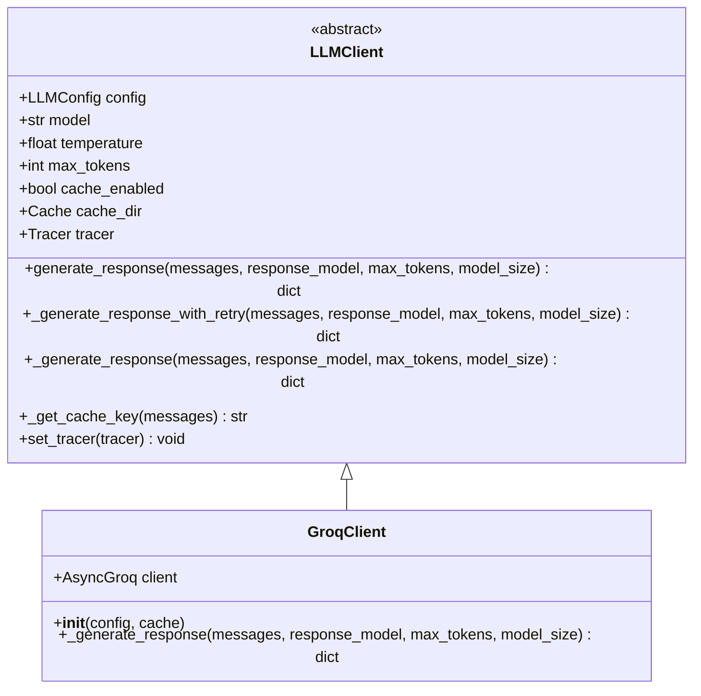
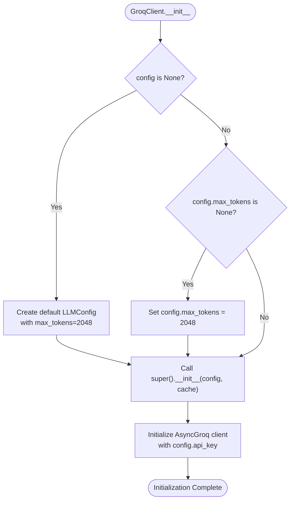
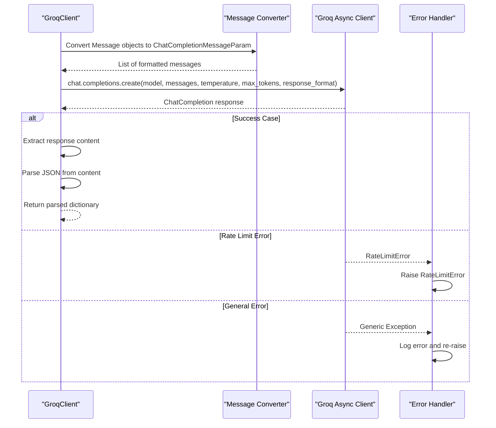
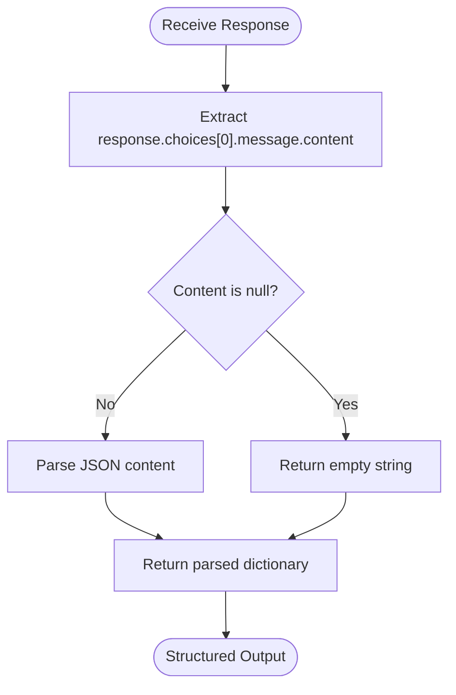
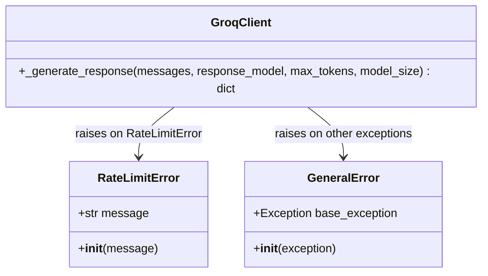
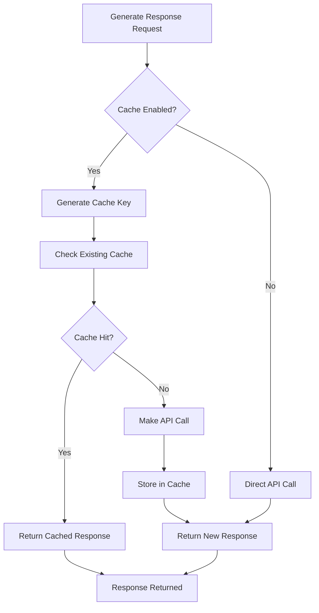
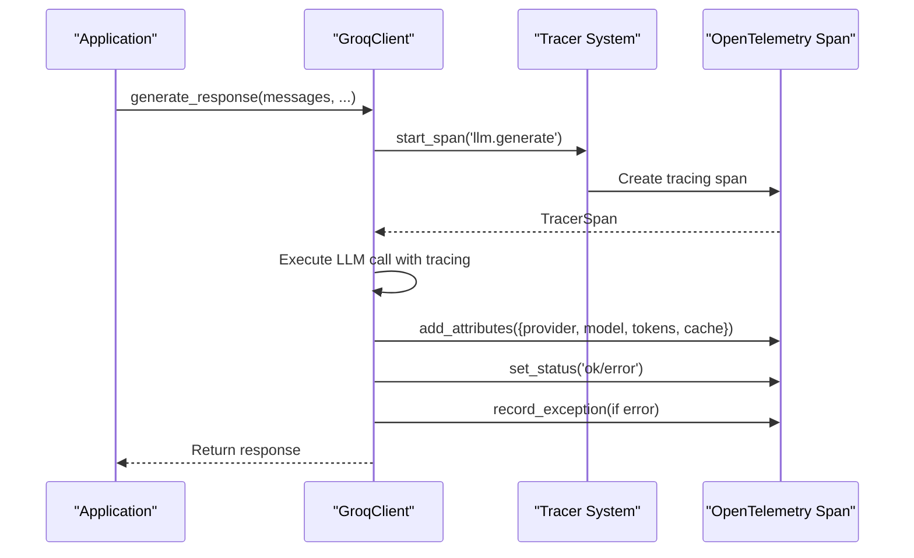

# Groq Client

<cite>
**Referenced Files in This Document**
- [groq_client.py](file://graphiti_core/llm_client/groq_client.py)
- [client.py](file://graphiti_core/llm_client/client.py)
- [config.py](file://graphiti_core/llm_client/config.py)
- [errors.py](file://graphiti_core/llm_client/errors.py)
- [models.py](file://graphiti_core/prompts/models.py)
- [tracer.py](file://graphiti_core/tracer.py)
- [pyproject.toml](file://pyproject.toml)
- [README.md](file://README.md)
</cite>

## Table of Contents
1. [Introduction](#introduction)
2. [Installation and Setup](#installation-and-setup)
3. [Initialization Parameters](#initialization-parameters)
4. [Core Architecture](#core-architecture)
5. [Response Generation Implementation](#response-generation-implementation)
6. [Structured Output Handling](#structured-output-handling)
7. [Error Handling and Retry Logic](#error-handling-and-retry-logic)
8. [Caching Behavior](#caching-behavior)
9. [Tracing and Performance Monitoring](#tracing-and-performance-monitoring)
10. [High-Throughput Configuration](#high-throughput-configuration)
11. [Environment Variables](#environment-variables)
12. [Usage Examples](#usage-examples)
13. [Best Practices](#best-practices)

## Introduction

The GroqClient is a specialized language model client implementation within the Graphiti framework that provides high-performance inference capabilities using Groq's optimized LLM infrastructure. Built on top of the OpenAI-compatible API format, it offers seamless integration with Graphiti's knowledge graph construction and querying workflows while leveraging Groq's fast inference engine.

GroqClient serves as a drop-in replacement for other LLM providers in the Graphiti ecosystem, maintaining compatibility with the same interface while delivering superior performance characteristics for specific use cases. The client is designed to handle both regular text completion and structured output generation, making it particularly valuable for knowledge graph extraction and entity recognition tasks.

## Installation and Setup

### Package Installation

The GroqClient requires the `groq` package to be installed alongside Graphiti. You can install it using one of the following methods:

```bash
# Install with pip
pip install graphiti-core[groq]

# Or with uv package manager
uv add graphiti-core[groq]
```

### API Key Configuration

To use the GroqClient, you need to configure your Groq API key. This can be done through environment variables or directly in the configuration:

```python
import os
from graphiti_core.llm_client import LLMConfig, GroqClient

# Method 1: Environment variable
os.environ['GROQ_API_KEY'] = 'your-groq-api-key'

# Method 2: Direct configuration
config = LLMConfig(
    api_key='your-groq-api-key',
    model='llama-3.1-70b-versatile'  # Default model
)
```

**Section sources**
- [groq_client.py](file://graphiti_core/llm_client/groq_client.py#L27-L34)
- [pyproject.toml](file://pyproject.toml#L30)

## Initialization Parameters

### Constructor Signature

The GroqClient accepts two primary initialization parameters:

```python
def __init__(self, config: LLMConfig | None = None, cache: bool = False):
```

### Configuration Parameters

#### LLMConfig Parameters

The `config` parameter accepts an `LLMConfig` object with the following key attributes:

| Parameter | Type | Default | Description |
|-----------|------|---------|-------------|
| `api_key` | `str \| None` | `None` | Groq API authentication key |
| `model` | `str \| None` | `'llama-3.1-70b-versatile'` | Primary model for completions |
| `small_model` | `str \| None` | `None` | Alternative model for simpler tasks |
| `temperature` | `float` | `0` | Sampling temperature (0.0-2.0) |
| `max_tokens` | `int` | `2048` | Maximum tokens per response |
| `base_url` | `str \| None` | `None` | Custom API endpoint (OpenAI compatible) |

#### Cache Parameter

The `cache` parameter enables response caching for improved performance:

- **Type**: `bool`
- **Default**: `False`
- **Behavior**: When `True`, responses are cached using diskcache to avoid redundant API calls

### Default Values and Environment Sourcing

The GroqClient establishes sensible defaults while supporting environment variable configuration:

- **Default Model**: `llama-3.1-70b-versatile` (high-capacity model optimized for knowledge graph tasks)
- **Default Max Tokens**: `2048` (balanced for most extraction tasks)
- **Default Temperature**: `0` (deterministic output for structured data)

**Section sources**
- [groq_client.py](file://graphiti_core/llm_client/groq_client.py#L48-L56)
- [config.py](file://graphiti_core/llm_client/config.py#L28-L69)

## Core Architecture

### Class Hierarchy

The GroqClient inherits from the `LLMClient` abstract base class, establishing a consistent interface across all LLM providers:



**Diagram sources**
- [groq_client.py](file://graphiti_core/llm_client/groq_client.py#L48-L86)
- [client.py](file://graphiti_core/llm_client/client.py#L66-L243)

### Client Initialization Flow

The initialization process follows a specific sequence:



**Diagram sources**
- [groq_client.py](file://graphiti_core/llm_client/groq_client.py#L48-L56)

**Section sources**
- [groq_client.py](file://graphiti_core/llm_client/groq_client.py#L48-L56)
- [client.py](file://graphiti_core/llm_client/client.py#L66-L87)

## Response Generation Implementation

### Core Method: `_generate_response`

The `_generate_response` method implements the primary logic for generating LLM responses using Groq's async client:



**Diagram sources**
- [groq_client.py](file://graphiti_core/llm_client/groq_client.py#L58-L85)

### Message Formatting

The client converts Graphiti's internal `Message` objects into Groq's expected format:

| Graphiti Role | Groq Role | Content Field |
|---------------|-----------|---------------|
| `Message(role='user', content='...')` | `{'role': 'user', 'content': '...'}` | User messages |
| `Message(role='system', content='...')` | `{'role': 'system', 'content': '...'}` | System instructions |

### Request Parameters

The method constructs requests with the following parameters:

- **Model Selection**: Uses `self.model` or falls back to `DEFAULT_MODEL`
- **Temperature**: Inherits from `self.temperature` (default: 0 for deterministic output)
- **Max Tokens**: Uses `max_tokens` parameter or falls back to `self.max_tokens`
- **Response Format**: Enforces `{'type': 'json_object'}` for structured output compatibility

**Section sources**
- [groq_client.py](file://graphiti_core/llm_client/groq_client.py#L58-L85)

## Structured Output Handling

### JSON Mode Implementation

The GroqClient automatically enables structured output through Groq's JSON mode, which ensures consistent parsing of LLM responses:

```python
response_format={'type': 'json_object'}
```

This parameter guarantees that:
- The LLM generates responses in valid JSON format
- Content outside JSON blocks is filtered out
- Parsing errors are minimized through provider enforcement

### Response Processing

The client implements robust response processing:



**Diagram sources**
- [groq_client.py](file://graphiti_core/llm_client/groq_client.py#L78-L80)

### Compatibility with OpenAI Format

The GroqClient maintains full compatibility with OpenAI's API format, enabling seamless migration between providers. This compatibility extends to:
- Same request/response structure
- Identical parameter names and types
- Consistent error handling patterns
- Uniform structured output mechanisms

**Section sources**
- [groq_client.py](file://graphiti_core/llm_client/groq_client.py#L76-L80)

## Error Handling and Retry Logic

### Error Classification

The GroqClient implements comprehensive error handling for various failure scenarios:



**Diagram sources**
- [errors.py](file://graphiti_core/llm_client/errors.py#L18-L40)
- [groq_client.py](file://graphiti_core/llm_client/groq_client.py#L81-L85)

### Specific Error Types

#### Rate Limit Handling

The client specifically catches and transforms Groq's `RateLimitError` into Graphiti's standardized `RateLimitError`:

```python
except groq.RateLimitError as e:
    raise RateLimitError from e
```

This ensures consistent error handling across all LLM providers in the Graphiti ecosystem.

#### General Exception Handling

For other exceptions, the client logs the error and re-raises:

```python
except Exception as e:
    logger.error(f'Error in generating LLM response: {e}')
    raise
```

### Retry Mechanism

The parent `LLMClient` class implements automatic retry logic through the `tenacity` library:

```python
@retry(
    stop=stop_after_attempt(4),
    wait=wait_random_exponential(multiplier=10, min=5, max=120),
    retry=retry_if_exception(is_server_or_retry_error),
    after=lambda retry_state: logger.warning(...)
)
```

This retry mechanism handles:
- HTTP status errors (5xx responses)
- Rate limit errors
- JSON parsing failures
- Network connectivity issues

**Section sources**
- [groq_client.py](file://graphiti_core/llm_client/groq_client.py#L81-L85)
- [client.py](file://graphiti_core/llm_client/client.py#L110-L120)

## Caching Behavior

### Cache Architecture

The GroqClient inherits comprehensive caching capabilities from the `LLMClient` base class:



**Diagram sources**
- [client.py](file://graphiti_core/llm_client/client.py#L143-L212)

### Cache Key Generation

The cache key is generated using a combination of:
- Model identifier
- Serialized message content (sorted for consistency)
- Ensures identical inputs produce identical keys

### Performance Characteristics

#### Cache Benefits
- **Reduced API Calls**: Eliminates redundant requests for identical inputs
- **Lower Latency**: Immediate response for cached queries
- **Cost Savings**: Reduces API consumption for repeated operations
- **Rate Limit Protection**: Minimizes risk of hitting rate limits

#### Cache Considerations
- **Memory Usage**: Disk-based caching prevents excessive memory consumption
- **Cache Invalidation**: Automatic invalidation when configuration changes
- **Persistence**: Responses persist across application restarts

**Section sources**
- [client.py](file://graphiti_core/llm_client/client.py#L143-L212)

## Tracing and Performance Monitoring

### Tracing Integration

The GroqClient seamlessly integrates with Graphiti's tracing system, providing comprehensive observability:



**Diagram sources**
- [client.py](file://graphiti_core/llm_client/client.py#L175-L186)
- [tracer.py](file://graphiti_core/tracer.py#L147-L156)

### Trace Attributes

The client automatically adds the following attributes to traces:

| Attribute | Value | Description |
|-----------|-------|-------------|
| `llm.provider` | `'groq'` | Indicates Groq provider |
| `model.size` | `ModelSize.medium` | Model size designation |
| `max_tokens` | `int` | Maximum tokens configured |
| `cache.enabled` | `bool` | Cache status |
| `prompt.name` | `str \| None` | Optional prompt identifier |

### Performance Monitoring

#### Metrics Collection
- **Request Duration**: Time spent in LLM calls
- **Cache Hit Rate**: Percentage of requests served from cache
- **Error Rates**: Frequency of different error types
- **Token Usage**: Total tokens consumed per request

#### Observability Features
- **Distributed Tracing**: Full request flow visibility
- **Error Tracking**: Comprehensive exception logging
- **Performance Profiling**: Detailed timing information
- **Resource Utilization**: Cache and API usage metrics

**Section sources**
- [client.py](file://graphiti_core/llm_client/client.py#L175-L186)
- [client.py](file://graphiti_core/llm_client/client.py#L215-L228)

## High-Throughput Configuration

### Performance Optimization Strategies

For high-throughput scenarios, the GroqClient offers several optimization approaches:

#### Model Selection
- **Large Models**: Use `llama-3.1-70b-versatile` for complex extraction tasks
- **Small Models**: Leverage `llama-3.1-8b-instant` for simple queries
- **Hybrid Approach**: Combine models based on task complexity

#### Configuration Tuning

```python
# High-throughput configuration example
config = LLMConfig(
    api_key=os.getenv('GROQ_API_KEY'),
    model='llama-3.1-70b-versatile',  # High-capacity model
    temperature=0.1,  # Slight randomness for variety
    max_tokens=4096,  # Higher token limit for complex tasks
    small_model='llama-3.1-8b-instant'  # Fast fallback
)

client = GroqClient(config=config, cache=True)
```

#### Concurrency Management

While the GroqClient itself is asynchronous, high-throughput scenarios benefit from:

- **Connection Pooling**: Reuse connections across requests
- **Batch Processing**: Group related requests when possible
- **Rate Limit Awareness**: Monitor and adapt to provider limits

### Model Size Considerations

#### Performance Characteristics by Model Size

| Model | Speed | Quality | Use Case |
|-------|-------|---------|----------|
| `llama-3.1-8b-instant` | Very Fast | Good | Simple queries, validation |
| `llama-3.1-70b-versatile` | Fast | Excellent | Complex extraction, reasoning |
| `llama-3.1-405b` | Medium | Superior | Highest quality requirements |

#### Memory and Performance Trade-offs

- **Larger Models**: Better quality but higher latency and cost
- **Smaller Models**: Faster response times with acceptable quality
- **Hybrid Strategy**: Balance quality and performance based on task requirements

**Section sources**
- [groq_client.py](file://graphiti_core/llm_client/groq_client.py#L44-L45)
- [config.py](file://graphiti_core/llm_client/config.py#L23-L26)

## Environment Variables

### Required Environment Variables

#### API Authentication
- **`GROQ_API_KEY`**: Your Groq API authentication key
- **Format**: String containing your API token
- **Source**: Groq dashboard or account settings

### Optional Environment Variables

#### Performance Tuning
- **`SEMAPHORE_LIMIT`**: Controls concurrent request limits (default: 10)
- **Purpose**: Prevents rate limit errors in high-concurrency scenarios

#### Debugging and Monitoring
- **`GRAPHITI_TELEMETRY_ENABLED`**: Controls telemetry collection (default: true)
- **Options**: `true`, `false`, or unset

### Configuration Priority

Environment variables follow this priority order:
1. **Explicit Configuration**: Direct parameter values override environment variables
2. **Environment Variables**: Fall back to environment variable values
3. **Defaults**: Use hard-coded default values when neither is provided

**Section sources**
- [README.md](file://README.md#L266-L270)
- [README.md](file://README.md#L214-L219)

## Usage Examples

### Basic Configuration

```python
import os
from graphiti_core.llm_client import LLMConfig, GroqClient

# Configure with environment variable
os.environ['GROQ_API_KEY'] = 'your-api-key-here'

# Basic client setup
config = LLMConfig(
    model='llama-3.1-70b-versatile',
    temperature=0.1,
    max_tokens=2048
)

client = GroqClient(config=config, cache=True)
```

### High-Throughput Scenario

```python
import asyncio
from graphiti_core.llm_client import LLMConfig, GroqClient

async def high_throughput_processing():
    # Optimized configuration for throughput
    config = LLMConfig(
        api_key=os.getenv('GROQ_API_KEY'),
        model='llama-3.1-70b-versatile',
        max_tokens=4096,  # Higher limit for complex tasks
        temperature=0.0   # Deterministic for consistency
    )
    
    client = GroqClient(config=config, cache=True)
    
    # Example messages for knowledge graph extraction
    messages = [
        Message(role='system', content='Extract entities and relationships from text.'),
        Message(role='user', content='John works at Google in Seattle.')
    ]
    
    # Generate response with structured output
    result = await client.generate_response(
        messages=messages,
        max_tokens=2048,
        model_size='medium'
    )
    
    return result
```

### Error Handling Example

```python
import asyncio
from graphiti_core.llm_client import LLMConfig, GroqClient
from graphiti_core.llm_client.errors import RateLimitError

async def robust_llm_call():
    client = GroqClient(cache=False)
    
    try:
        messages = [
            Message(role='user', content='Extract information from this text.')
        ]
        
        result = await client.generate_response(messages)
        return result
        
    except RateLimitError:
        print("Rate limit exceeded, implement backoff strategy")
        # Implement exponential backoff
        await asyncio.sleep(60)
        return await robust_llm_call()
        
    except Exception as e:
        print(f"Unexpected error: {e}")
        raise
```

### Structured Output Example

```python
from pydantic import BaseModel
from typing import List
from graphiti_core.llm_client import LLMConfig, GroqClient

class Entity(BaseModel):
    name: str
    type: str

class Relationship(BaseModel):
    subject: str
    predicate: str
    object: str

async def extract_structured_data():
    client = GroqClient()
    
    messages = [
        Message(role='system', content='Extract entities and relationships in JSON format.'),
        Message(role='user', content='Elon Musk founded SpaceX in 2002.')
    ]
    
    # Specify response model for structured output
    result = await client.generate_response(
        messages=messages,
        response_model=Entity  # Or Relationship, or List[Entity]
    )
    
    return result
```

**Section sources**
- [groq_client.py](file://graphiti_core/llm_client/groq_client.py#L48-L56)
- [client.py](file://graphiti_core/llm_client/client.py#L149-L214)

## Best Practices

### Configuration Guidelines

#### Model Selection
- **Use Large Models**: Prefer `llama-3.1-70b-versatile` for knowledge graph tasks
- **Consider Small Models**: Use `llama-3.1-8b-instant` for validation or simple queries
- **Test Quality**: Verify output quality matches your requirements

#### Token Management
- **Set Reasonable Limits**: Use `max_tokens=2048` for most extraction tasks
- **Monitor Usage**: Track token consumption for cost optimization
- **Handle Truncation**: Implement logic for handling long responses

### Performance Optimization

#### Caching Strategy
- **Enable Caching**: Use `cache=True` for repeated operations
- **Cache Keys**: Understand how cache keys are generated
- **Cache Invalidation**: Clear cache when configuration changes

#### Concurrent Operations
- **Connection Reuse**: Maintain client instances across requests
- **Batch Processing**: Group related operations when possible
- **Rate Limit Monitoring**: Implement graceful degradation

### Error Handling

#### Robust Implementation
- **Retry Logic**: Leverage built-in retry mechanisms
- **Graceful Degradation**: Provide fallback options for failures
- **Monitoring**: Track error rates and patterns

#### Security Considerations
- **API Key Management**: Never hardcode API keys
- **Environment Variables**: Use secure storage for sensitive data
- **Access Control**: Limit API key permissions appropriately

### Monitoring and Observability

#### Tracing Configuration
- **Enable Tracing**: Use OpenTelemetry for production monitoring
- **Attribute Collection**: Monitor relevant performance metrics
- **Error Tracking**: Implement comprehensive error logging

#### Performance Metrics
- **Latency Monitoring**: Track response times
- **Throughput Measurement**: Monitor requests per second
- **Quality Assessment**: Evaluate output accuracy regularly

**Section sources**
- [client.py](file://graphiti_core/llm_client/client.py#L110-L120)
- [groq_client.py](file://graphiti_core/llm_client/groq_client.py#L44-L45)