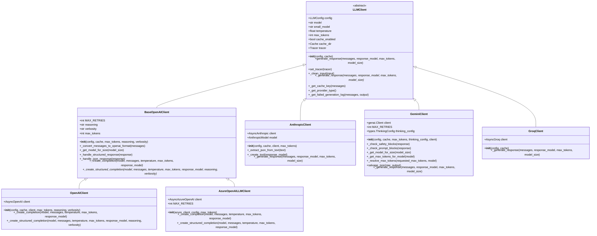

# LLM Client Abstraction System

<cite>
**Referenced Files in This Document**
- [graphiti_core/llm_client/__init__.py](file://graphiti_core/llm_client/__init__.py)
- [graphiti_core/llm_client/client.py](file://graphiti_core/llm_client/client.py)
- [graphiti_core/llm_client/config.py](file://graphiti_core/llm_client/config.py)
- [graphiti_core/llm_client/errors.py](file://graphiti_core/llm_client/errors.py)
- [graphiti_core/llm_client/openai_client.py](file://graphiti_core/llm_client/openai_client.py)
- [graphiti_core/llm_client/anthropic_client.py](file://graphiti_core/llm_client/anthropic_client.py)
- [graphiti_core/llm_client/gemini_client.py](file://graphiti_core/llm_client/gemini_client.py)
- [graphiti_core/llm_client/groq_client.py](file://graphiti_core/llm_client/groq_client.py)
- [graphiti_core/llm_client/azure_openai_client.py](file://graphiti_core/llm_client/azure_openai_client.py)
- [graphiti_core/llm_client/openai_base_client.py](file://graphiti_core/llm_client/openai_base_client.py)
- [graphiti_core/graphiti.py](file://graphiti_core/graphiti.py)
- [tests/llm_client/test_client.py](file://tests/llm_client/test_client.py)
- [tests/llm_client/test_errors.py](file://tests/llm_client/test_errors.py)
</cite>

## Table of Contents
1. [Introduction](#introduction)
2. [System Architecture](#system-architecture)
3. [Core Components](#core-components)
4. [LLMClient Abstract Base Class](#llmclient-abstract-base-class)
5. [Configuration System](#configuration-system)
6. [Provider-Specific Implementations](#provider-specific-implementations)
7. [Caching System](#caching-system)
8. [Error Handling](#error-handling)
9. [Integration with Graphiti](#integration-with-graphiti)
10. [Usage Examples](#usage-examples)
11. [Best Practices](#best-practices)

## Introduction

The LLM Client Abstraction System provides a unified interface for interacting with multiple Large Language Model providers within the Graphiti framework. This system enables seamless switching between different LLM providers while maintaining consistent behavior and robust error handling.

The abstraction layer supports major providers including OpenAI, Anthropic, Google Gemini, Groq, and Azure OpenAI, each with their own specialized implementations while sharing common functionality through the base LLMClient class.

## System Architecture

The LLM client system follows a hierarchical architecture with clear separation of concerns:



**Diagram sources**
- [graphiti_core/llm_client/client.py](file://graphiti_core/llm_client/client.py#L66-L243)
- [graphiti_core/llm_client/openai_base_client.py](file://graphiti_core/llm_client/openai_base_client.py#L40-L250)
- [graphiti_core/llm_client/openai_client.py](file://graphiti_core/llm_client/openai_client.py#L27-L106)
- [graphiti_core/llm_client/anthropic_client.py](file://graphiti_core/llm_client/anthropic_client.py#L68-L359)
- [graphiti_core/llm_client/gemini_client.py](file://graphiti_core/llm_client/gemini_client.py#L70-L448)
- [graphiti_core/llm_client/groq_client.py](file://graphiti_core/llm_client/groq_client.py#L48-L86)
- [graphiti_core/llm_client/azure_openai_client.py](file://graphiti_core/llm_client/azure_openai_client.py#L30-L78)

## Core Components

The LLM client system consists of several key components that work together to provide a unified interface:

### LLMClient Abstract Base Class
The foundation of the system, providing common functionality and enforcing the contract for all provider implementations.

### Configuration Management
Centralized configuration through LLMConfig class with provider-specific parameters and defaults.

### Provider Implementations
Specialized clients for each supported LLM provider with provider-specific optimizations and features.

### Caching Layer
Disk-based caching using diskcache for improved performance and reduced API costs.

### Error Handling
Comprehensive error handling with specific exception types for different failure scenarios.

**Section sources**
- [graphiti_core/llm_client/client.py](file://graphiti_core/llm_client/client.py#L66-L243)
- [graphiti_core/llm_client/config.py](file://graphiti_core/llm_client/config.py#L28-L69)

## LLMClient Abstract Base Class

The LLMClient class serves as the abstract base class for all LLM provider implementations. It defines the core interface and provides common functionality.

### Constructor and Initialization

The constructor accepts an LLMConfig object and a cache flag:

```python
def __init__(self, config: LLMConfig | None, cache: bool = False):
```

Key initialization parameters:
- **config**: LLMConfig object containing provider-specific settings
- **cache**: Boolean flag to enable/disable response caching

### Core Methods

#### generate_response Method
The primary method for generating LLM responses:

```python
async def generate_response(
    self,
    messages: list[Message],
    response_model: type[BaseModel] | None = None,
    max_tokens: int | None = None,
    model_size: ModelSize = ModelSize.medium,
    group_id: str | None = None,
    prompt_name: str | None = None,
) -> dict[str, typing.Any]:
```

Parameters:
- **messages**: List of Message objects representing the conversation history
- **response_model**: Optional Pydantic model for structured output
- **max_tokens**: Maximum tokens for the response (overrides config)
- **model_size**: Size of model to use (small/medium)
- **group_id**: Optional partition identifier for multilingual instructions
- **prompt_name**: Optional name for tracing and debugging

#### Internal Retry Mechanism
The system includes sophisticated retry logic using tenacity decorators:

```python
@retry(
    stop=stop_after_attempt(4),
    wait=wait_random_exponential(multiplier=10, min=5, max=120),
    retry=retry_if_exception(is_server_or_retry_error),
    after=lambda retry_state: logger.warning(...) if retry_state.attempt_number > 1 else None,
    reraise=True,
)
```

The retry mechanism handles:
- Server errors (HTTP 5xx)
- Rate limit errors
- JSON decode errors
- Custom retry conditions

#### Cache Key Generation
Automatic cache key generation based on messages and model:

```python
def _get_cache_key(self, messages: list[Message]) -> str:
    message_str = json.dumps([m.model_dump() for m in messages], sort_keys=True)
    key_str = f'{self.model}:{message_str}'
    return hashlib.md5(key_str.encode()).hexdigest()
```

**Section sources**
- [graphiti_core/llm_client/client.py](file://graphiti_core/llm_client/client.py#L66-L243)

## Configuration System

The configuration system provides centralized management of LLM parameters through the LLMConfig class.

### LLMConfig Class

The LLMConfig class encapsulates all necessary parameters for LLM API interactions:

```python
class LLMConfig:
    def __init__(
        self,
        api_key: str | None = None,
        model: str | None = None,
        base_url: str | None = None,
        temperature: float = DEFAULT_TEMPERATURE,
        max_tokens: int = DEFAULT_MAX_TOKENS,
        small_model: str | None = None,
    ):
```

Key configuration parameters:
- **api_key**: Authentication key for the LLM service
- **model**: Primary model to use for generation
- **base_url**: Base URL of the LLM API service
- **temperature**: Sampling temperature for response diversity
- **max_tokens**: Maximum tokens for responses
- **small_model**: Alternative model for simpler prompts

### ModelSize Enum

The ModelSize enum provides standardized model size selection:

```python
class ModelSize(Enum):
    small = 'small'
    medium = 'medium'
```

This enum is used consistently across all provider implementations to select appropriate models based on computational requirements.

### Default Values

The system provides sensible defaults:
- **DEFAULT_MAX_TOKENS**: 8192
- **DEFAULT_TEMPERATURE**: 1.0
- **DEFAULT_MODEL**: Provider-specific defaults

**Section sources**
- [graphiti_core/llm_client/config.py](file://graphiti_core/llm_client/config.py#L28-L69)

## Provider-Specific Implementations

Each LLM provider has a specialized implementation with provider-specific optimizations and features.

### OpenAIClient

The OpenAIClient extends BaseOpenAIClient and provides OpenAI-specific functionality:

#### Configuration Parameters
- **reasoning**: Reasoning effort level (default: 'minimal')
- **verbosity**: Output verbosity level (default: 'low')
- **max_tokens**: Maximum tokens for responses

#### Implementation Features
- Structured completion support using OpenAI's beta parse API
- JSON format responses
- Automatic model selection based on model_size

### AnthropicClient

The AnthropicClient provides specialized support for Claude models:

#### Supported Models
- Claude 3.7 Sonnet variants
- Claude 3.5 Haiku variants  
- Claude 3.5 Sonnet variants
- Claude 3 Opus and Sonnet models
- Legacy Claude 2.x models

#### Unique Features
- Tool-based structured output using Anthropic's tool use API
- Advanced JSON extraction from text responses
- Built-in retry logic with validation
- Safety filter handling

#### Authentication
Automatically reads API key from `ANTHROPIC_API_KEY` environment variable if not provided.

### GeminiClient

The GeminiClient supports Google's Gemini models with advanced safety and thinking capabilities:

#### Supported Models
- Gemini 2.5 Pro and Flash series
- Gemini 2.0 Flash series
- Gemini 1.5 Pro and Flash series

#### Advanced Features
- Thinking configuration support for advanced reasoning
- Comprehensive safety filter checking
- Automatic JSON salvage from truncated responses
- Model-specific token limits

#### Configuration Options
- **thinking_config**: Optional thinking configuration for supported models
- **max_tokens**: Per-request token limit override

### GroqClient

The GroqClient provides high-speed inference with local optimization:

#### Default Configuration
- **DEFAULT_MODEL**: 'llama-3.1-70b-versatile'
- **DEFAULT_MAX_TOKENS**: 2048

#### Features
- Fast inference through Groq's cloud infrastructure
- JSON format responses
- Rate limit error handling

### AzureOpenAILLMClient

The AzureOpenAILLMClient provides Azure OpenAI service integration:

#### Key Differences
- Uses AsyncAzureOpenAI client instead of AsyncOpenAI
- Implements Azure-specific completion creation methods
- Inherits caching restrictions from BaseOpenAIClient

**Section sources**
- [graphiti_core/llm_client/openai_client.py](file://graphiti_core/llm_client/openai_client.py#L27-L106)
- [graphiti_core/llm_client/anthropic_client.py](file://graphiti_core/llm_client/anthropic_client.py#L68-L359)
- [graphiti_core/llm_client/gemini_client.py](file://graphiti_core/llm_client/gemini_client.py#L70-L448)
- [graphiti_core/llm_client/groq_client.py](file://graphiti_core/llm_client/groq_client.py#L48-L86)
- [graphiti_core/llm_client/azure_openai_client.py](file://graphiti_core/llm_client/azure_openai_client.py#L30-L78)

## Caching System

The LLM client system includes a sophisticated caching mechanism using diskcache for improved performance and cost efficiency.

### Cache Architecture


**Diagram sources**
- [graphiti_core/llm_client/client.py](file://graphiti_core/llm_client/client.py#L187-L212)

### Cache Configuration

The cache system is configured through the LLMClient constructor:

```python
def __init__(self, config: LLMConfig | None, cache: bool = False):
    self.cache_enabled = cache
    self.cache_dir = None
    
    if self.cache_enabled:
        self.cache_dir = Cache(DEFAULT_CACHE_DIR)
```

### Cache Key Generation

Cache keys are generated using a deterministic approach:

```python
def _get_cache_key(self, messages: list[Message]) -> str:
    message_str = json.dumps([m.model_dump() for m in messages], sort_keys=True)
    key_str = f'{self.model}:{message_str}'
    return hashlib.md5(key_str.encode()).hexdigest()
```

### Cache Benefits

The caching system provides several advantages:
- **Reduced API Costs**: Reuse responses for identical inputs
- **Improved Performance**: Eliminate network latency for repeated requests
- **Consistency**: Ensure deterministic behavior for identical inputs
- **Offline Capability**: Serve cached responses when API is unavailable

### Cache Management

The system uses diskcache with default settings:
- **DEFAULT_CACHE_DIR**: './llm_cache'
- **Automatic cleanup**: Diskcache handles eviction policies
- **Thread-safe**: Concurrent access protection

**Section sources**
- [graphiti_core/llm_client/client.py](file://graphiti_core/llm_client/client.py#L143-L212)

## Error Handling

The LLM client system implements comprehensive error handling with specific exception types for different failure scenarios.

### Error Types

#### RateLimitError
Raised when API rate limits are exceeded:

```python
class RateLimitError(Exception):
    """Exception raised when the rate limit is exceeded."""
    def __init__(self, message='Rate limit exceeded. Please try again later.'):
        self.message = message
        super().__init__(self.message)
```

#### RefusalError
Raised when the LLM refuses to generate a response:

```python
class RefusalError(Exception):
    """Exception raised when the LLM refuses to generate a response."""
    def __init__(self, message: str):
        self.message = message
        super().__init__(self.message)
```

#### EmptyResponseError
Raised when the LLM returns an empty response:

```python
class EmptyResponseError(Exception):
    """Exception raised when the LLM returns an empty response."""
    def __init__(self, message: str):
        self.message = message
        super().__init__(self.message)
```

### Error Detection and Handling

The system includes automatic error detection for server and retryable errors:

```python
def is_server_or_retry_error(exception):
    if isinstance(exception, RateLimitError | json.decoder.JSONDecodeError):
        return True
    
    return (
        isinstance(exception, httpx.HTTPStatusError) and 500 <= exception.response.status_code < 600
    )
```

### Provider-Specific Error Handling

Each provider implements specialized error handling:

#### AnthropicClient Error Handling
- Rate limit errors with automatic retry
- Content policy violations (RefusalError)
- Validation errors with retry logic

#### GeminiClient Error Handling
- Safety filter blocking (automatic fail)
- Prompt blocking (automatic fail)
- Rate limit detection with specific error codes

#### OpenAI-Based Clients Error Handling
- Built-in retry mechanisms from OpenAI SDK
- Timeout and connection errors
- Length and rate limit errors

### Retry Logic

The system implements sophisticated retry logic with exponential backoff:

```python
@retry(
    stop=stop_after_attempt(4),
    wait=wait_random_exponential(multiplier=10, min=5, max=120),
    retry=retry_if_exception(is_server_or_retry_error),
    after=lambda retry_state: logger.warning(...) if retry_state.attempt_number > 1 else None,
    reraise=True,
)
```

**Section sources**
- [graphiti_core/llm_client/errors.py](file://graphiti_core/llm_client/errors.py#L18-L40)
- [graphiti_core/llm_client/client.py](file://graphiti_core/llm_client/client.py#L57-L65)

## Integration with Graphiti

The LLM client system integrates seamlessly with the Graphiti framework, providing natural language processing capabilities for graph operations.

### Graphiti Initialization

Graphiti can be initialized with custom LLM clients:

```python
class Graphiti:
    def __init__(
        self,
        uri: str | None = None,
        user: str | None = None,
        password: str | None = None,
        llm_client: LLMClient | None = None,
        embedder: EmbedderClient | None = None,
        cross_encoder: CrossEncoderClient | None = None,
        store_raw_episode_content: bool = True,
        graph_driver: GraphDriver | None = None,
        max_coroutines: int | None = None,
        tracer: Tracer | None = None,
        trace_span_prefix: str = 'graphiti',
    ):
```

### Default LLM Client

If no LLM client is provided, Graphiti automatically creates an OpenAIClient:

```python
if not llm_client:
    llm_client = OpenAIClient(config=LLMConfig())
```

### Client Injection Pattern

The system supports custom LLM client injection:

```python
# Custom configuration
custom_config = LLMConfig(
    api_key="your-api-key",
    model="claude-3-5-sonnet-latest",
    temperature=0.7
)

# Custom client
anthropic_client = AnthropicClient(config=custom_config, cache=True)

# Inject into Graphiti
graphiti = Graphiti(llm_client=anthropic_client)
```

### Tracing Integration

LLM clients integrate with Graphiti's tracing system:

```python
with self.tracer.start_span('llm.generate') as span:
    attributes = {
        'llm.provider': self._get_provider_type(),
        'model.size': model_size.value,
        'max_tokens': max_tokens,
        'cache.enabled': self.cache_enabled,
    }
    span.add_attributes(attributes)
```

**Section sources**
- [graphiti_core/graphiti.py](file://graphiti_core/graphiti.py#L128-L200)

## Usage Examples

### Basic Usage with Default Configuration

```python
from graphiti_core import Graphiti
from graphiti_core.prompts.models import Message

# Initialize with default OpenAI client
graphiti = Graphiti()

# Generate response
messages = [
    Message(role='system', content='You are a helpful assistant.'),
    Message(role='user', content='Extract entities from this text.')
]

response = await graphiti.llm_client.generate_response(
    messages=messages,
    model_size=ModelSize.medium
)
```

### Using Anthropic Client

```python
from graphiti_core.llm_client import AnthropicClient, LLMConfig, ModelSize
from graphiti_core.prompts.models import Message

# Configure Anthropic client
config = LLMConfig(
    api_key="your-anthropic-api-key",
    model="claude-3-5-sonnet-latest"
)

client = AnthropicClient(config=config, cache=True)

# Generate response
messages = [
    Message(role='system', content='Extract entities and relationships.'),
    Message(role='user', content='John works at Acme Corp.')
]

response = await client.generate_response(
    messages=messages,
    model_size=ModelSize.small
)
```

### Using Gemini Client with Thinking

```python
from graphiti_core.llm_client import GeminiClient, LLMConfig
from graphiti_core.prompts.models import Message
from google.genai import types

# Configure Gemini client with thinking
thinking_config = types.ThinkingConfig(
    max_thinking_time=10.0
)

config = LLMConfig(
    api_key="your-gemini-api-key",
    model="gemini-2.5-pro"
)

client = GeminiClient(
    config=config,
    thinking_config=thinking_config,
    cache=False
)

# Generate response
messages = [
    Message(role='system', content='Analyze the following text carefully.'),
    Message(role='user', content='Complex reasoning required...')
]

response = await client.generate_response(
    messages=messages,
    max_tokens=4096
)
```

### Structured Output with Pydantic Models

```python
from pydantic import BaseModel
from graphiti_core.llm_client import OpenAIClient, LLMConfig
from graphiti_core.prompts.models import Message

class Entity(BaseModel):
    name: str
    type: str
    description: str

class Relationship(BaseModel):
    source: str
    target: str
    relation_type: str

# Configure OpenAI client
config = LLMConfig(model="gpt-4-turbo")

client = OpenAIClient(config=config)

# Define structured prompt
messages = [
    Message(role='system', content='Extract entities and relationships in JSON format.'),
    Message(role='user', content='Alice works at Google as a software engineer.')
]

# Generate structured response
response = await client.generate_response(
    messages=messages,
    response_model=Entity
)
```

### Custom LLM Client Configuration

```python
from graphiti_core.llm_client import LLMClient, LLMConfig, ModelSize
from graphiti_core.tracer import create_tracer

class CustomLLMClient(LLMClient):
    """Custom LLM client implementation"""
    
    async def _generate_response(self, messages, response_model=None, max_tokens=None, model_size=ModelSize.medium):
        # Custom implementation logic
        return {'content': 'custom response'}
    
    async def generate_response(self, messages, response_model=None, max_tokens=None, model_size=ModelSize.medium, group_id=None, prompt_name=None):
        # Enhanced custom logic
        print(f"Generating response for prompt: {prompt_name}")
        return await super().generate_response(messages, response_model, max_tokens, model_size, group_id, prompt_name)

# Initialize with custom client
custom_client = CustomLLMClient(LLMConfig(), cache=True)
custom_client.set_tracer(create_tracer())

# Use in Graphiti
graphiti = Graphiti(llm_client=custom_client)
```

## Best Practices

### Configuration Management

1. **Environment Variables**: Store API keys in environment variables rather than hardcoding
2. **Default Values**: Use sensible defaults in LLMConfig for development environments
3. **Provider Selection**: Choose appropriate models based on use case complexity

### Error Handling

1. **Retry Logic**: Leverage built-in retry mechanisms for transient failures
2. **Specific Exceptions**: Handle different exception types appropriately
3. **Graceful Degradation**: Implement fallback strategies for critical operations

### Performance Optimization

1. **Caching**: Enable caching for repetitive operations
2. **Model Sizing**: Use smaller models for simple tasks
3. **Token Management**: Monitor and optimize token usage

### Security Considerations

1. **API Key Protection**: Never expose API keys in logs or error messages
2. **Input Sanitization**: Use the built-in input cleaning functionality
3. **Rate Limiting**: Respect provider rate limits and implement backoff

### Monitoring and Debugging

1. **Tracing**: Use the integrated tracing system for debugging
2. **Logging**: Enable appropriate logging levels for production
3. **Metrics**: Monitor response times and error rates