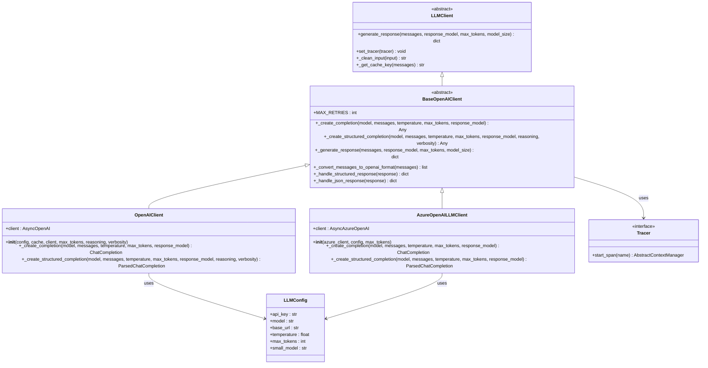
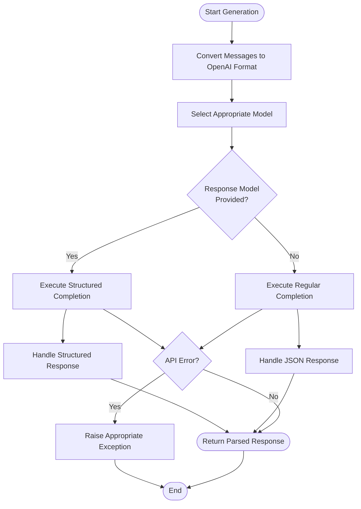
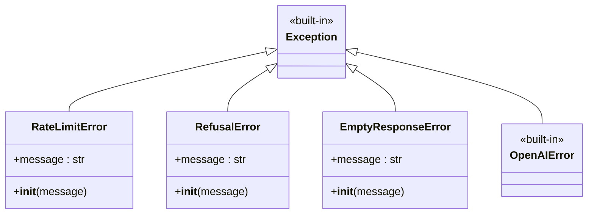
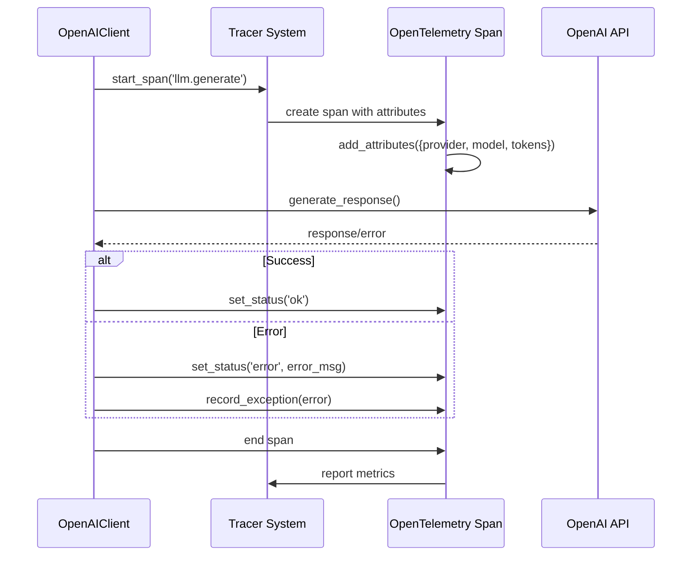
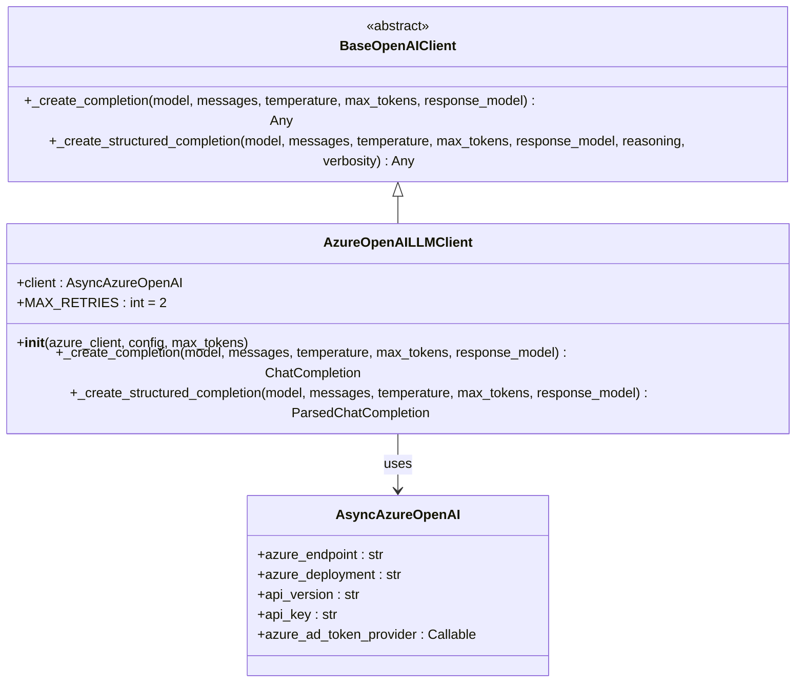

# OpenAI Client Implementation Documentation

<cite>
**Referenced Files in This Document**
- [openai_client.py](file://graphiti_core/llm_client/openai_client.py)
- [openai_base_client.py](file://graphiti_core/llm_client/openai_base_client.py)
- [azure_openai_client.py](file://graphiti_core/llm_client/azure_openai_client.py)
- [client.py](file://graphiti_core/llm_client/client.py)
- [config.py](file://graphiti_core/llm_client/config.py)
- [errors.py](file://graphiti_core/llm_client/errors.py)
- [tracer.py](file://graphiti_core/tracer.py)
- [graphiti_mcp_server.py](file://mcp_server/graphiti_mcp_server.py)
</cite>

## Table of Contents
1. [Introduction](#introduction)
2. [Architecture Overview](#architecture-overview)
3. [Core Components](#core-components)
4. [Initialization and Configuration](#initialization-and-configuration)
5. [Response Generation Methods](#response-generation-methods)
6. [Structured vs Regular Completions](#structured-vs-regular-completions)
7. [Error Handling and Retry Logic](#error-handling-and-retry-logic)
8. [Integration with Caching and Tracing](#integration-with-caching-and-tracing)
9. [Azure OpenAI Support](#azure-openai-support)
10. [Usage Examples](#usage-examples)
11. [Best Practices](#best-practices)

## Introduction

The OpenAIClient is a sophisticated language model client implementation that extends the BaseOpenAIClient and implements the LLMClient interface for interacting with OpenAI's language models. It provides robust support for both regular and structured completions, comprehensive error handling, retry mechanisms, and seamless integration with caching and tracing systems.

The client architecture follows a layered design pattern, separating concerns between the base OpenAI functionality and specific implementations for different OpenAI variants (standard OpenAI and Azure OpenAI). This design enables flexible deployment scenarios while maintaining consistent interfaces and behavior.

## Architecture Overview

The OpenAIClient architecture consists of several interconnected layers that work together to provide a comprehensive LLM interaction framework:



**Diagram sources**
- [client.py](file://graphiti_core/llm_client/client.py#L66-L243)
- [openai_base_client.py](file://graphiti_core/llm_client/openai_base_client.py#L40-L250)
- [openai_client.py](file://graphiti_core/llm_client/openai_client.py#L27-L106)
- [azure_openai_client.py](file://graphiti_core/llm_client/azure_openai_client.py#L30-L78)

## Core Components

### OpenAIClient Class

The OpenAIClient serves as the primary interface for interacting with OpenAI's language models. It extends BaseOpenAIClient and provides OpenAI-specific implementations for completion creation.

Key characteristics:
- **Async Support**: Built on OpenAI's AsyncOpenAI client for non-blocking operations
- **Flexible Initialization**: Supports both configuration-driven and client-instance-based initialization
- **Model Management**: Handles both standard and small models for different use cases
- **Temperature Control**: Provides fine-grained control over response randomness

### BaseOpenAIClient Foundation

BaseOpenAIClient establishes the foundational architecture shared by all OpenAI-based clients:

- **Abstract Methods**: Defines contract for completion creation methods
- **Message Conversion**: Transforms internal message format to OpenAI-compatible format
- **Response Handling**: Standardized processing for both structured and JSON responses
- **Model Size Management**: Intelligent selection between standard and small models

### Configuration Management

The LLMConfig class centralizes all configuration parameters:

- **API Authentication**: Secure handling of API keys with environment variable fallbacks
- **Endpoint Customization**: Flexible base URL configuration for different deployment scenarios
- **Model Selection**: Support for both standard and specialized models
- **Behavior Tuning**: Temperature and token limits for controlling response quality

**Section sources**
- [openai_client.py](file://graphiti_core/llm_client/openai_client.py#L27-L106)
- [openai_base_client.py](file://graphiti_core/llm_client/openai_base_client.py#L40-L250)
- [config.py](file://graphiti_core/llm_client/config.py#L28-L69)

## Initialization and Configuration

### Constructor Parameters

The OpenAIClient constructor accepts several key parameters for customization:

| Parameter | Type | Default | Description |
|-----------|------|---------|-------------|
| `config` | `LLMConfig \| None` | `None` | Configuration object containing API key, model, base URL, temperature, and max tokens |
| `cache` | `bool` | `False` | Whether to enable response caching (currently not supported for OpenAI clients) |
| `client` | `Any \| None` | `None` | Optional AsyncOpenAI client instance for custom configurations |
| `max_tokens` | `int` | `DEFAULT_MAX_TOKENS` | Maximum tokens for generated responses |
| `reasoning` | `str` | `DEFAULT_REASONING` | Reasoning effort level for structured completions |
| `verbosity` | `str` | `DEFAULT_VERBOSITY` | Verbosity level for structured completions |

### Environment Variable Configuration

The system supports comprehensive environment variable configuration for seamless deployment:

| Environment Variable | Purpose | Default Value |
|---------------------|---------|---------------|
| `OPENAI_API_KEY` | Authentication key for OpenAI API | Required |
| `MODEL_NAME` | Primary model identifier | `"gpt-5-mini"` |
| `SMALL_MODEL_NAME` | Secondary model for simpler tasks | `"gpt-5-nano"` |
| `LLM_TEMPERATURE` | Response randomness control | `1.0` |
| `AZURE_OPENAI_ENDPOINT` | Azure OpenAI endpoint URL | `None` |
| `AZURE_OPENAI_DEPLOYMENT_NAME` | Azure deployment identifier | `None` |
| `AZURE_OPENAI_API_VERSION` | Azure API version | `None` |
| `AZURE_OPENAI_USE_MANAGED_IDENTITY` | Use Azure managed identity | `False` |

### Default Values and Fallbacks

The configuration system implements intelligent defaults with graceful fallbacks:

- **API Key**: Falls back to environment variable `OPENAI_API_KEY`
- **Model**: Defaults to `"gpt-5-mini"` with `"gpt-5-nano"` for small models
- **Base URL**: Uses OpenAI's standard endpoint unless overridden
- **Temperature**: Balanced at `1.0` for creative yet coherent responses
- **Token Limits**: Configurable up to `8192` tokens with safety checks

**Section sources**
- [openai_client.py](file://graphiti_core/llm_client/openai_client.py#L38-L64)
- [config.py](file://graphiti_core/llm_client/config.py#L37-L69)
- [graphiti_mcp_server.py](file://mcp_server/graphiti_mcp_server.py#L205-L253)

## Response Generation Methods

### Core Generation Workflow

The `_generate_response` method orchestrates the complete response generation process:



**Diagram sources**
- [openai_base_client.py](file://graphiti_core/llm_client/openai_base_client.py#L132-L171)

### Method Signatures and Parameters

#### Regular Completion (`_create_completion`)
Used for standard JSON-formatted responses:

```python
async def _create_completion(
    self,
    model: str,
    messages: list[ChatCompletionMessageParam],
    temperature: float | None,
    max_tokens: int,
    response_model: type[BaseModel] | None = None,
) -> ChatCompletion
```

#### Structured Completion (`_create_structured_completion`)
Used for Pydantic model-based responses with enhanced parsing:

```python
async def _create_structured_completion(
    self,
    model: str,
    messages: list[ChatCompletionMessageParam],
    temperature: float | None,
    max_tokens: int,
    response_model: type[BaseModel],
    reasoning: str | None = None,
    verbosity: str | None = None,
) -> ParsedChatCompletion
```

### Response Format Handling

The system provides specialized response handling for different completion types:

#### JSON Response Processing
- Extracts content from `choices[0].message.content`
- Parses JSON string into Python dictionary
- Handles empty responses gracefully

#### Structured Response Processing  
- Validates parsed output from OpenAI's beta parse API
- Handles refusal responses with dedicated error handling
- Provides fallback mechanisms for malformed responses

**Section sources**
- [openai_client.py](file://graphiti_core/llm_client/openai_client.py#L88-L106)
- [openai_base_client.py](file://graphiti_core/llm_client/openai_base_client.py#L116-L131)

## Structured vs Regular Completions

### Completion Types Comparison

| Aspect | Regular Completion | Structured Completion |
|--------|-------------------|----------------------|
| **API Endpoint** | `/chat/completions` | `/responses/parse` (OpenAI) or `/beta/chat/completions/parse` (Azure) |
| **Response Format** | JSON string in content field | Direct Pydantic model instance |
| **Parsing Method** | Manual JSON parsing | Automatic OpenAI parsing |
| **Error Handling** | JSON decode errors | Built-in validation and error reporting |
| **Use Cases** | General text generation | Typed data extraction and structured output |
| **Performance** | Slightly faster | Enhanced reliability with built-in validation |

### When to Use Each Type

#### Regular Completions
- **General Conversational AI**: Natural language responses and creative content
- **Simple Text Generation**: Summaries, translations, and basic transformations
- **Cost Optimization**: Lower latency and potentially lower costs
- **Flexibility**: Unrestricted output format freedom

#### Structured Completions
- **Data Extraction**: Entity recognition, relationship extraction, and structured data capture
- **API Responses**: Consistent, typed responses for downstream processing
- **Validation Requirements**: Need for guaranteed output format correctness
- **Complex Workflows**: Systems requiring structured intermediate results

### Implementation Differences

#### OpenAI Implementation
- **Regular**: Uses `response_format={'type': 'json_object'}`
- **Structured**: Uses `client.responses.parse()` with Pydantic model specification

#### Azure OpenAI Implementation  
- **Regular**: Same as OpenAI standard
- **Structured**: Uses `client.beta.chat.completions.parse()` with direct model reference

**Section sources**
- [openai_client.py](file://graphiti_core/llm_client/openai_client.py#L65-L106)
- [azure_openai_client.py](file://graphiti_core/llm_client/azure_openai_client.py#L45-L78)

## Error Handling and Retry Logic

### Error Classification System

The OpenAIClient implements a comprehensive error handling system with specific exception types:



**Diagram sources**
- [errors.py](file://graphiti_core/llm_client/errors.py#L18-L40)

### Retry Mechanism

The system implements intelligent retry logic with exponential backoff:

#### Retry Configuration
- **Maximum Retries**: 2 attempts total (1 retry)
- **Retry Conditions**: Application-level errors, timeout errors, connection failures
- **Non-Retry Conditions**: Rate limit errors, refusal errors, authentication errors
- **Backoff Strategy**: Exponential with jitter for optimal distribution

#### Error Categories and Handling

| Error Type | Retry Behavior | Status Code | Resolution |
|------------|---------------|-------------|------------|
| `RateLimitError` | Not retried | 429 | Wait for rate limit reset |
| `RefusalError` | Not retried | 403 | Review content policy |
| `APITimeoutError` | Retried | 408 | Network connectivity issue |
| `APIConnectionError` | Retried | N/A | Service availability |
| `InternalServerError` | Retried | 500+ | Service-side problems |
| `LengthFinishReasonError` | Not retried | N/A | Token limit exceeded |

### Error Recovery Strategies

#### Automatic Recovery
- **Network Issues**: Transparent retry with exponential backoff
- **Temporary Failures**: Automatic retry with progressive delay
- **Content Policy**: Immediate failure with detailed error message

#### User-Friendly Error Messages
- **Context Preservation**: Maintains conversation history during retries
- **Error Attribution**: Clear identification of error causes
- **Recovery Guidance**: Suggestions for resolving common issues

**Section sources**
- [openai_base_client.py](file://graphiti_core/llm_client/openai_base_client.py#L164-L249)
- [errors.py](file://graphiti_core/llm_client/errors.py#L18-L40)

## Integration with Caching and Tracing

### Caching System Integration

While OpenAI-based clients currently don't support caching, the architecture is designed for future enhancement:

#### Current Limitations
- **Cache Flag Ignored**: Setting `cache=True` raises `NotImplementedError`
- **Future Enhancement**: Planned support for response caching
- **Consistency**: Maintains interface compatibility with other clients

#### Tracing Framework Integration

The OpenAIClient provides comprehensive tracing support through the OpenTelemetry integration:



**Diagram sources**
- [client.py](file://graphiti_core/llm_client/client.py#L175-L206)
- [tracer.py](file://graphiti_core/tracer.py#L148-L156)

### Tracing Attributes

The tracing system captures comprehensive metrics:

| Attribute | Type | Description |
|-----------|------|-------------|
| `llm.provider` | String | Provider identifier ("openai") |
| `model.size` | String | Model size category (small/medium) |
| `max_tokens` | Integer | Maximum tokens requested |
| `cache.enabled` | Boolean | Caching status |
| `prompt.name` | String | Optional prompt identifier |
| `cache.hit` | Boolean | Cache hit status (when applicable) |

### Telemetry Features

#### Performance Monitoring
- **Request Duration**: Measures end-to-end request timing
- **Success Rates**: Tracks successful vs failed requests
- **Error Patterns**: Identifies common failure modes

#### Observability Metrics
- **Provider Usage**: Tracks which providers are most active
- **Model Performance**: Monitors response quality by model
- **Latency Distribution**: Analyzes request timing patterns

**Section sources**
- [client.py](file://graphiti_core/llm_client/client.py#L175-L206)
- [tracer.py](file://graphiti_core/tracer.py#L148-L194)

## Azure OpenAI Support

### Azure OpenAI Client Architecture

The Azure OpenAI implementation extends the BaseOpenAIClient with Azure-specific functionality:



**Diagram sources**
- [azure_openai_client.py](file://graphiti_core/llm_client/azure_openai_client.py#L30-L78)

### Azure-Specific Configuration

#### Authentication Methods
- **API Key Authentication**: Traditional API key-based authentication
- **Managed Identity**: Azure AD integration for secure credentialless access
- **Token Provider**: Custom authentication token providers

#### Deployment Configuration
- **Endpoint URL**: Azure OpenAI service endpoint
- **Deployment Name**: Specific model deployment identifier
- **API Version**: OpenAI API compatibility version

### Azure vs Standard OpenAI Differences

| Feature | Standard OpenAI | Azure OpenAI |
|---------|----------------|--------------|
| **Authentication** | API key only | API key or managed identity |
| **Endpoint** | `api.openai.com` | Custom Azure endpoint |
| **Deployment** | Direct model access | Named deployment |
| **API Path** | `/v1/chat/completions` | `/openai/deployments/{deployment}/chat/completions` |
| **Structured Parsing** | `/responses/parse` | `/beta/chat/completions/parse` |
| **Rate Limits** | Global limits | Tenant-specific limits |

### Configuration Examples

#### API Key Authentication
```python
from openai import AsyncAzureOpenAI
from graphiti_core.llm_client import AzureOpenAILLMClient, LLMConfig

azure_client = AsyncAzureOpenAI(
    azure_endpoint="https://your-resource.openai.azure.com/",
    azure_deployment="your-deployment-name",
    api_version="2024-02-15-preview",
    api_key="your-api-key"
)

config = LLMConfig(
    api_key="your-api-key",
    model="gpt-4",
    small_model="gpt-3.5-turbo"
)

client = AzureOpenAILLMClient(azure_client=azure_client, config=config)
```

#### Managed Identity Authentication
```python
from azure.identity import DefaultAzureCredential
from openai import AsyncAzureOpenAI
from graphiti_core.llm_client import AzureOpenAILLMClient, LLMConfig

credential = DefaultAzureCredential()
token_provider = lambda: credential.get_token("https://cognitiveservices.azure.com/.default").token

azure_client = AsyncAzureOpenAI(
    azure_endpoint="https://your-resource.openai.azure.com/",
    azure_deployment="your-deployment-name",
    api_version="2024-02-15-preview",
    azure_ad_token_provider=token_provider
)

client = AzureOpenAILLMClient(azure_client=azure_client, config=config)
```

**Section sources**
- [azure_openai_client.py](file://graphiti_core/llm_client/azure_openai_client.py#L30-L78)
- [graphiti_mcp_server.py](file://mcp_server/graphiti_mcp_server.py#L298-L334)

## Usage Examples

### Basic OpenAI Client Usage

#### Simple Text Generation
```python
from graphiti_core.llm_client import OpenAIClient, LLMConfig
from graphiti_core.prompts.models import Message

# Initialize client with configuration
config = LLMConfig(
    api_key="your-api-key",
    model="gpt-4",
    temperature=0.7,
    max_tokens=1000
)

client = OpenAIClient(config=config)

# Generate response
messages = [
    Message(role="system", content="You are a helpful assistant."),
    Message(role="user", content="Explain quantum computing in simple terms.")
]

response = await client.generate_response(messages)
print(response["content"])
```

#### Structured Data Extraction
```python
from pydantic import BaseModel
from graphiti_core.llm_client import OpenAIClient, LLMConfig

class PersonInfo(BaseModel):
    name: str
    age: int
    occupation: str

messages = [
    Message(role="system", content="Extract person information from the text."),
    Message(role="user", content="John Doe is 35 years old and works as a software engineer.")
]

response = await client.generate_response(messages, response_model=PersonInfo)
print(response)  # Returns PersonInfo instance
```

### Advanced Configuration Scenarios

#### Custom Model Sizes
```python
# Different models for different complexity levels
client = OpenAIClient(config=config)

# Use small model for simple tasks
simple_messages = [Message(role="user", content="What's the weather today?")]
response = await client.generate_response(
    simple_messages, 
    model_size=ModelSize.small
)

# Use standard model for complex reasoning
complex_messages = [Message(role="user", content="Analyze this business strategy.")]
response = await client.generate_response(
    complex_messages, 
    model_size=ModelSize.medium
)
```

#### Azure OpenAI Integration
```python
from openai import AsyncAzureOpenAI
from graphiti_core.llm_client import AzureOpenAILLMClient, LLMConfig

# Azure configuration
azure_client = AsyncAzureOpenAI(
    azure_endpoint="https://your-resource.openai.azure.com/",
    azure_deployment="gpt-4-deployment",
    api_version="2024-02-15-preview",
    api_key="your-azure-key"
)

azure_config = LLMConfig(
    model="gpt-4",
    small_model="gpt-3.5-turbo"
)

azure_client = AzureOpenAILLMClient(
    azure_client=azure_client,
    config=azure_config
)

# Use Azure client seamlessly
response = await azure_client.generate_response(messages)
```

### Error Handling Examples

#### Graceful Error Recovery
```python
from graphiti_core.llm_client.errors import RateLimitError, RefusalError

try:
    response = await client.generate_response(messages)
except RateLimitError:
    print("Rate limit exceeded. Try again later.")
except RefusalError as e:
    print(f"Request refused: {e}")
except Exception as e:
    print(f"Unexpected error: {e}")
```

#### Retry with Custom Logic
```python
import asyncio
from graphiti_core.llm_client.errors import RateLimitError

async def generate_with_retry(client, messages, max_retries=3):
    for attempt in range(max_retries):
        try:
            return await client.generate_response(messages)
        except RateLimitError:
            if attempt == max_retries - 1:
                raise
            wait_time = 2 ** attempt  # Exponential backoff
            await asyncio.sleep(wait_time)
```

**Section sources**
- [openai_client.py](file://graphiti_core/llm_client/openai_client.py#L38-L64)
- [graphiti_mcp_server.py](file://mcp_server/graphiti_mcp_server.py#L291-L346)

## Best Practices

### Configuration Management

#### Environment-Based Configuration
- **Use Environment Variables**: Store sensitive credentials in environment variables
- **Default Fallbacks**: Provide sensible defaults for development and testing
- **Validation**: Validate configuration parameters early in the application lifecycle

#### Model Selection Guidelines
- **Small Models**: Use for simple, repetitive tasks to reduce cost and improve speed
- **Standard Models**: Reserve for complex reasoning and creative tasks
- **Testing**: Maintain separate configurations for development and production

### Performance Optimization

#### Request Optimization
- **Batch Processing**: Group related requests when possible
- **Streaming**: Use streaming responses for long-running operations
- **Caching**: Implement application-level caching for repeated queries

#### Resource Management
- **Connection Pooling**: Reuse client instances across requests
- **Memory Management**: Properly dispose of client resources
- **Timeout Configuration**: Set appropriate timeouts for different use cases

### Security Considerations

#### API Key Management
- **Secure Storage**: Never hardcode API keys in source code
- **Rotation**: Regularly rotate API keys and update configurations
- **Access Control**: Limit API key permissions to minimum required scope

#### Content Security
- **Input Validation**: Sanitize user inputs before sending to LLM
- **Output Filtering**: Validate and sanitize LLM responses
- **Audit Logging**: Log API interactions for security monitoring

### Monitoring and Observability

#### Tracing Implementation
- **Span Naming**: Use descriptive span names for better observability
- **Attribute Collection**: Capture relevant contextual information
- **Error Tracking**: Implement comprehensive error tracking and alerting

#### Performance Monitoring
- **Latency Tracking**: Monitor response times across different models
- **Error Rates**: Track and alert on error patterns
- **Resource Utilization**: Monitor API usage and costs

### Testing Strategies

#### Unit Testing
- **Mock Clients**: Use mock implementations for isolated testing
- **Response Validation**: Test response parsing and validation logic
- **Error Scenarios**: Test error handling and retry mechanisms

#### Integration Testing
- **Real API Calls**: Test with real API endpoints for end-to-end validation
- **Environment Setup**: Maintain separate test environments
- **Load Testing**: Test performance under various load conditions