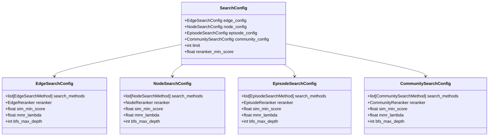
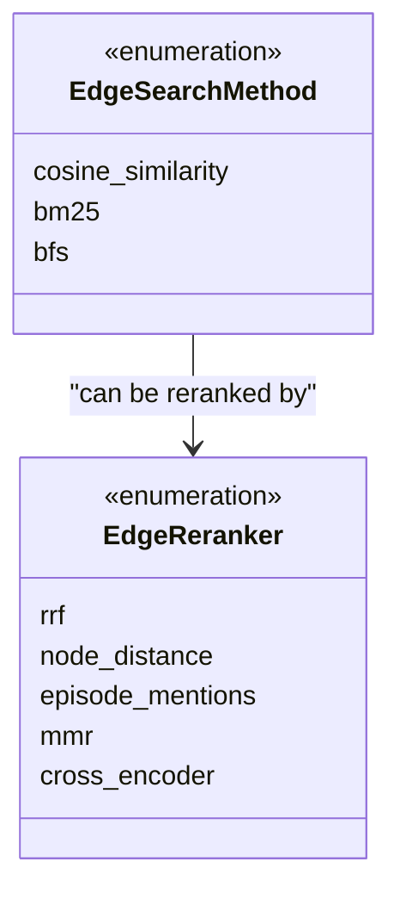
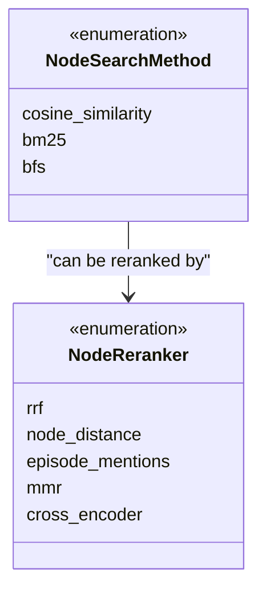
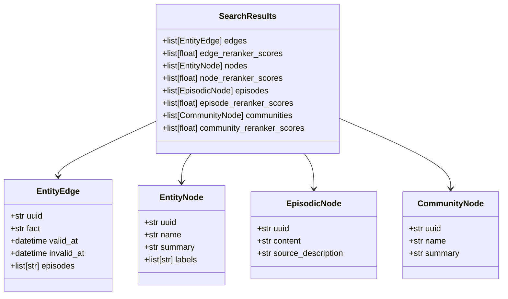
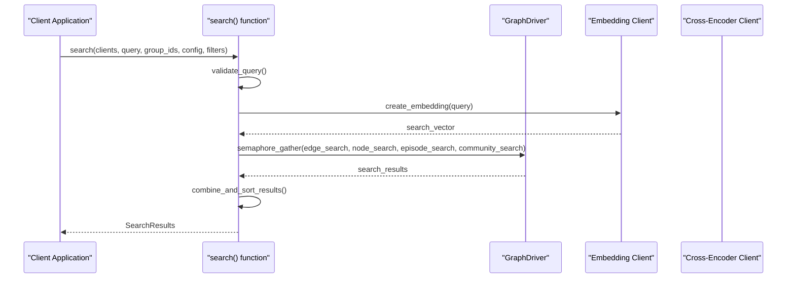
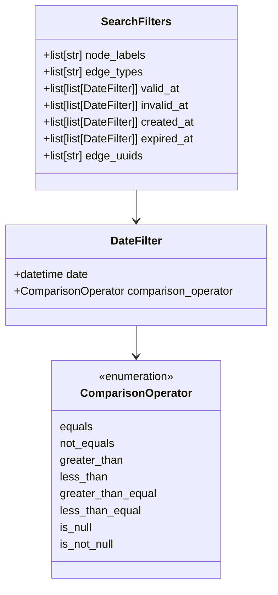
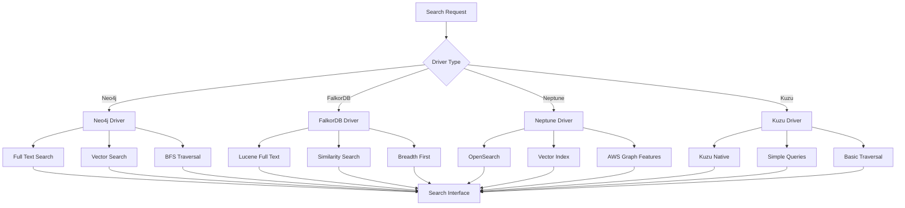

# Search Configuration API Documentation

<cite>
**Referenced Files in This Document**
- [search_config.py](file://graphiti_core/search/search_config.py)
- [search_config_recipes.py](file://graphiti_core/search/search_config_recipes.py)
- [search.py](file://graphiti_core/search/search.py)
- [search_filters.py](file://graphiti_core/search/search_filters.py)
- [search_utils.py](file://graphiti_core/search/search_utils.py)
- [search_helpers.py](file://graphiti_core/search/search_helpers.py)
- [search_interface.py](file://graphiti_core/driver/search_interface/search_interface.py)
- [quickstart_falkordb.py](file://examples/quickstart/quickstart_falkordb.py)
- [quickstart_neo4j.py](file://examples/quickstart/quickstart_neo4j.py)
- [quickstart_neptune.py](file://examples/quickstart/quickstart_neptune.py)
- [search_utils_test.py](file://tests/utils/search/search_utils_test.py)
</cite>

## Table of Contents
1. [Introduction](#introduction)
2. [SearchConfig Class](#searchconfig-class)
3. [Search Types and Methods](#search-types-and-methods)
4. [Search Results Data Structure](#search-results-data-structure)
5. [Search Function Parameters](#search-function-parameters)
6. [Predefined Search Recipes](#predefined-search-recipes)
7. [Custom Search Configuration](#custom-search-configuration)
8. [Search Filters](#search-filters)
9. [Integration with Driver Capabilities](#integration-with-driver-capabilities)
10. [Examples and Usage Patterns](#examples-and-usage-patterns)
11. [Best Practices](#best-practices)

## Introduction

The Graphiti search configuration system provides a comprehensive framework for performing sophisticated searches across knowledge graphs. It supports multiple search types including keyword-based, vector-based, hybrid approaches, and advanced reranking techniques. The system is designed to be flexible, allowing both predefined configurations and custom search setups tailored to specific use cases.

The search system operates across four main node types: Entities, Edges, Episodes, and Communities, each with specialized search methods and reranking strategies. This unified approach enables powerful semantic searches while maintaining performance through intelligent filtering and ranking mechanisms.

## SearchConfig Class

The `SearchConfig` class serves as the central configuration object for all search operations in Graphiti. It orchestrates search across different node types and manages the overall search behavior.



**Diagram sources**
- [search_config.py](file://graphiti_core/search/search_config.py#L112-L130)

### Core Parameters

| Parameter | Type | Description | Default Value |
|-----------|------|-------------|---------------|
| `edge_config` | `EdgeSearchConfig \| None` | Configuration for edge (relationship) searches | `None` |
| `node_config` | `NodeSearchConfig \| None` | Configuration for entity node searches | `None` |
| `episode_config` | `EpisodeSearchConfig \| None` | Configuration for episodic node searches | `None` |
| `community_config` | `CommunitySearchConfig \| None` | Configuration for community node searches | `None` |
| `limit` | `int` | Maximum number of results to return across all types | `10` |
| `reranker_min_score` | `float` | Minimum score threshold for reranked results | `0` |

**Section sources**
- [search_config.py](file://graphiti_core/search/search_config.py#L112-L130)

## Search Types and Methods

The search system supports multiple search methodologies, each optimized for different types of queries and use cases.

### Edge Search Methods



**Diagram sources**
- [search_config.py](file://graphiti_core/search/search_config.py#L32-L77)

#### Available Edge Search Methods

| Method | Description | Use Case | Vector Required |
|--------|-------------|----------|-----------------|
| `cosine_similarity` | Semantic similarity search using embeddings | Finding semantically related facts | Yes |
| `bm25` | Keyword-based search using BM25 algorithm | Finding facts containing specific keywords | No |
| `bfs` | Breadth-first search from source/target nodes | Exploring connected facts in graph | No |

#### Available Edge Rerankers

| Reranker | Description | Scoring Method | Additional Requirements |
|----------|-------------|----------------|-------------------------|
| `rrf` | Reciprocal Rank Fusion | Combines multiple ranked lists | None |
| `node_distance` | Graph distance to center node | Measures shortest path distance | Center node UUID |
| `episode_mentions` | Frequency of episode mentions | Counts episode references | None |
| `mmr` | Maximal Marginal Relevance | Balances relevance and diversity | Query vector |
| `cross_encoder` | Cross-encoder re-ranking | Advanced semantic scoring | Cross-encoder client |

### Node Search Methods



**Diagram sources**
- [search_config.py](file://graphiti_core/search/search_config.py#L38-L67)

#### Available Node Search Methods

| Method | Description | Use Case | Vector Required |
|--------|-------------|----------|-----------------|
| `cosine_similarity` | Semantic similarity search using embeddings | Finding semantically related entities | Yes |
| `bm25` | Keyword-based search using BM25 algorithm | Finding entities containing specific keywords | No |
| `bfs` | Breadth-first search from origin nodes | Exploring connected entities in graph | No |

#### Available Node Rerankers

| Reranker | Description | Scoring Method | Additional Requirements |
|----------|-------------|----------------|-------------------------|
| `rrf` | Reciprocal Rank Fusion | Combines multiple ranked lists | None |
| `node_distance` | Graph distance to center node | Measures shortest path distance | Center node UUID |
| `episode_mentions` | Frequency of episode mentions | Counts episode references | None |
| `mmr` | Maximal Marginal Relevance | Balances relevance and diversity | Query vector |
| `cross_encoder` | Cross-encoder re-ranking | Advanced semantic scoring | Cross-encoder client |

### Episode and Community Search

Both episode and community search support similar method sets but with different reranking capabilities:

| Type | Search Methods | Available Rerankers |
|------|----------------|---------------------|
| Episode | `bm25` | `rrf`, `cross_encoder` |
| Community | `cosine_similarity`, `bm25` | `rrf`, `mmr`, `cross_encoder` |

**Section sources**
- [search_config.py](file://graphiti_core/search/search_config.py#L32-L77)

## Search Results Data Structure

The `SearchResults` class encapsulates the results from a search operation, organizing findings across all node types with appropriate scoring information.



**Diagram sources**
- [search_config.py](file://graphiti_core/search/search_config.py#L121-L130)

### Result Components

Each search type produces specific result components:

| Node Type | Results List | Scores List | Description |
|-----------|--------------|-------------|-------------|
| Edges | `edges` | `edge_reranker_scores` | Relationship facts between entities |
| Nodes | `nodes` | `node_reranker_scores` | Entity nodes with names and summaries |
| Episodes | `episodes` | `episode_reranker_scores` | Temporal episode content |
| Communities | `communities` | `community_reranker_scores` | Clustered entity groups |

**Section sources**
- [search_config.py](file://graphiti_core/search/search_config.py#L121-L130)

## Search Function Parameters

The main search function accepts several parameters that control the search behavior and results.



**Diagram sources**
- [search.py](file://graphiti_core/search/search.py#L68-L182)

### Function Signature Parameters

| Parameter | Type | Description | Required |
|-----------|------|-------------|----------|
| `clients` | `GraphitiClients` | Client connections for driver, embedder, and cross-encoder | Yes |
| `query` | `str` | Search query string | Yes |
| `group_ids` | `list[str] \| None` | Filter results by group identifiers | No |
| `config` | `SearchConfig` | Search configuration object | Yes |
| `search_filter` | `SearchFilters` | Advanced filtering criteria | Yes |
| `center_node_uuid` | `str \| None` | Center node for graph-aware reranking | No |
| `bfs_origin_node_uuids` | `list[str] \| None` | Origin nodes for breadth-first search | No |
| `query_vector` | `list[float] \| None` | Pre-computed query embedding | No |

**Section sources**
- [search.py](file://graphiti_core/search/search.py#L68-L82)

## Predefined Search Recipes

Graphiti provides several predefined search configurations optimized for common use cases. These recipes demonstrate best practices and can be customized for specific needs.

### Hybrid Search Recipes

#### Combined Hybrid Search with RRF
```python
COMBINED_HYBRID_SEARCH_RRF = SearchConfig(
    edge_config=EdgeSearchConfig(
        search_methods=[EdgeSearchMethod.bm25, EdgeSearchMethod.cosine_similarity],
        reranker=EdgeReranker.rrf,
    ),
    node_config=NodeSearchConfig(
        search_methods=[NodeSearchMethod.bm25, NodeSearchMethod.cosine_similarity],
        reranker=NodeReranker.rrf,
    ),
    episode_config=EpisodeSearchConfig(
        search_methods=[EpisodeSearchMethod.bm25],
        reranker=EpisodeReranker.rrf,
    ),
    community_config=CommunitySearchConfig(
        search_methods=[CommunitySearchMethod.bm25, CommunitySearchMethod.cosine_similarity],
        reranker=CommunityReranker.rrf,
    ),
)
```

#### Combined Hybrid Search with MMR
```python
COMBINED_HYBRID_SEARCH_MMR = SearchConfig(
    edge_config=EdgeSearchConfig(
        search_methods=[EdgeSearchMethod.bm25, EdgeSearchMethod.cosine_similarity],
        reranker=EdgeReranker.mmr,
        mmr_lambda=1,
    ),
    # Similar configuration for other node types...
)
```

#### Combined Hybrid Search with Cross-Encoder
```python
COMBINED_HYBRID_SEARCH_CROSS_ENCODER = SearchConfig(
    edge_config=EdgeSearchConfig(
        search_methods=[EdgeSearchMethod.bm25, EdgeSearchMethod.cosine_similarity, EdgeSearchMethod.bfs],
        reranker=EdgeReranker.cross_encoder,
    ),
    # Similar configuration for other node types...
)
```

### Edge-Specific Recipes

#### Edge Hybrid Search with RRF
```python
EDGE_HYBRID_SEARCH_RRF = SearchConfig(
    edge_config=EdgeSearchConfig(
        search_methods=[EdgeSearchMethod.bm25, EdgeSearchMethod.cosine_similarity],
        reranker=EdgeReranker.rrf,
    )
)
```

#### Edge Hybrid Search with Cross-Encoder
```python
EDGE_HYBRID_SEARCH_CROSS_ENCODER = SearchConfig(
    edge_config=EdgeSearchConfig(
        search_methods=[EdgeSearchMethod.bm25, EdgeSearchMethod.cosine_similarity, EdgeSearchMethod.bfs],
        reranker=EdgeReranker.cross_encoder,
    ),
    limit=10,
)
```

### Node-Specific Recipes

#### Node Hybrid Search with RRF
```python
NODE_HYBRID_SEARCH_RRF = SearchConfig(
    node_config=NodeSearchConfig(
        search_methods=[NodeSearchMethod.bm25, NodeSearchMethod.cosine_similarity],
        reranker=NodeReranker.rrf,
    )
)
```

#### Node Hybrid Search with Cross-Encoder
```python
NODE_HYBRID_SEARCH_CROSS_ENCODER = SearchConfig(
    node_config=NodeSearchConfig(
        search_methods=[NodeSearchMethod.bm25, NodeSearchMethod.cosine_similarity, NodeSearchMethod.bfs],
        reranker=NodeReranker.cross_encoder,
    ),
    limit=10,
)
```

### Community-Specific Recipes

#### Community Hybrid Search with RRF
```python
COMMUNITY_HYBRID_SEARCH_RRF = SearchConfig(
    community_config=CommunitySearchConfig(
        search_methods=[CommunitySearchMethod.bm25, CommunitySearchMethod.cosine_similarity],
        reranker=CommunityReranker.rrf,
    )
)
```

#### Community Hybrid Search with Cross-Encoder
```python
COMMUNITY_HYBRID_SEARCH_CROSS_ENCODER = SearchConfig(
    community_config=CommunitySearchConfig(
        search_methods=[CommunitySearchMethod.bm25, CommunitySearchMethod.cosine_similarity],
        reranker=CommunityReranker.cross_encoder,
    ),
    limit=3,
)
```

**Section sources**
- [search_config_recipes.py](file://graphiti_core/search/search_config_recipes.py#L33-L224)

## Custom Search Configuration

Creating custom search configurations allows fine-tuning search behavior for specific requirements. Here's how to build custom configurations:

### Basic Custom Configuration

```python
from graphiti_core.search.search_config import (
    SearchConfig, NodeSearchConfig, NodeSearchMethod, NodeReranker
)

# Create a custom node search configuration
custom_config = SearchConfig(
    node_config=NodeSearchConfig(
        search_methods=[NodeSearchMethod.bm25],
        reranker=NodeReranker.rrf,
        sim_min_score=0.7,  # Higher threshold for better quality
        limit=5,           # Fewer results for focused search
    ),
    limit=10,              # Total result limit
    reranker_min_score=0.5 # Minimum score for inclusion
)
```

### Multi-Method Hybrid Configuration

```python
from graphiti_core.search.search_config import (
    EdgeSearchConfig, EdgeSearchMethod, EdgeReranker
)

# Combine multiple search methods for comprehensive coverage
hybrid_edge_config = EdgeSearchConfig(
    search_methods=[
        EdgeSearchMethod.bm25,           # Keyword search
        EdgeSearchMethod.cosine_similarity, # Semantic search
        EdgeSearchMethod.bfs             # Graph exploration
    ],
    reranker=EdgeReranker.cross_encoder, # Best quality reranking
    mmr_lambda=0.7,                     # Balance relevance/diversity
    sim_min_score=0.6                   # Moderate similarity threshold
)
```

### Graph-Aware Configuration

```python
# Configuration optimized for graph-aware search
graph_aware_config = SearchConfig(
    edge_config=EdgeSearchConfig(
        search_methods=[EdgeSearchMethod.cosine_similarity],
        reranker=EdgeReranker.node_distance,
        bfs_max_depth=2,  # Shallow graph exploration
    ),
    reranker_min_score=0.3,  # Lower threshold for broader results
    limit=15                 # More results for graph exploration
)
```

### Performance-Optimized Configuration

```python
# Configuration optimized for speed and efficiency
fast_config = SearchConfig(
    edge_config=EdgeSearchConfig(
        search_methods=[EdgeSearchMethod.bm25],  # Fastest method
        reranker=EdgeReranker.rrf,               # Efficient reranking
    ),
    node_config=NodeSearchConfig(
        search_methods=[NodeSearchMethod.bm25],
        reranker=EdgeReranker.rrf,
    ),
    limit=5,  # Minimal results for faster processing
)
```

## Search Filters

Search filters enable precise filtering of search results based on various criteria, improving result relevance and reducing noise.



**Diagram sources**
- [search_filters.py](file://examples/quickstart/quickstart_neo4j.py#L44-L56)

### Filter Types and Usage

#### Node Label Filtering
```python
from graphiti_core.search.search_filters import SearchFilters

filters = SearchFilters(
    node_labels=['Person', 'Organization']  # Only Person and Organization nodes
)
```

#### Edge Type Filtering
```python
filters = SearchFilters(
    edge_types=['WORKS_FOR', 'MANAGES']  # Only specific edge types
)
```

#### Temporal Filtering
```python
from datetime import datetime
from graphiti_core.search.search_filters import DateFilter, ComparisonOperator

# Filter by creation date range
filters = SearchFilters(
    created_at=[
        [
            DateFilter(
                date=datetime(2023, 1, 1),
                comparison_operator=ComparisonOperator.greater_than_equal
            ),
            DateFilter(
                date=datetime(2023, 12, 31),
                comparison_operator=ComparisonOperator.less_than_equal
            )
        ]
    ]
)
```

#### Validity Period Filtering
```python
# Find edges valid during a specific period
filters = SearchFilters(
    valid_at=[
        [
            DateFilter(
                date=datetime(2023, 6, 1),
                comparison_operator=ComparisonOperator.greater_than_equal
            )
        ]
    ],
    invalid_at=[
        [
            DateFilter(
                date=datetime(2023, 6, 30),
                comparison_operator=ComparisonOperator.less_than_equal
            )
        ]
    ]
)
```

#### Edge UUID Filtering
```python
# Restrict search to specific edges
filters = SearchFilters(
    edge_uuids=['edge-uuid-1', 'edge-uuid-2']
)
```

**Section sources**
- [search_filters.py](file://graphiti_core/search/search_filters.py#L44-L56)

## Integration with Driver Capabilities

The search system integrates seamlessly with different graph database drivers, each providing specific search capabilities and optimizations.



**Diagram sources**
- [search_interface.py](file://graphiti_core/driver/search_interface/search_interface.py#L22-L89)

### Driver-Specific Capabilities

#### Neo4j Driver
- Full-text search with Lucene queries
- Vector similarity search with native indexing
- Advanced Cypher-based BFS traversal
- Comprehensive filtering support

#### FalkorDB Driver  
- Lucene-based full-text search
- Native vector similarity operations
- Optimized BFS with depth limits
- Flexible query construction

#### Amazon Neptune Driver
- OpenSearch integration for full-text
- Vector index support for similarity
- AWS-native graph traversal
- Managed service optimizations

#### Kuzu Driver
- Simplified query interface
- Basic vector operations
- Straightforward BFS traversal
- Lightweight implementation

### Custom Search Interface Implementation

For specialized search requirements, you can implement custom search interfaces:

```python
from graphiti_core.driver.search_interface.search_interface import SearchInterface

class CustomSearchInterface(SearchInterface):
    async def edge_fulltext_search(self, driver, query, search_filter, group_ids=None, limit=100):
        # Custom full-text search implementation
        pass
    
    async def edge_similarity_search(self, driver, search_vector, source_node_uuid, 
                                   target_node_uuid, search_filter, group_ids=None, 
                                   limit=100, min_score=0.7):
        # Custom similarity search implementation
        pass
    
    # Implement other required methods...
```

**Section sources**
- [search_interface.py](file://graphiti_core/driver/search_interface/search_interface.py#L22-L89)

## Examples and Usage Patterns

### Basic Search Operations

#### Simple Keyword Search
```python
# Basic keyword search across all node types
results = await graphiti.search("Who was the California Attorney General?")
```

#### Semantic Search with Embeddings
```python
# Semantic search using vector similarity
semantic_config = SearchConfig(
    edge_config=EdgeSearchConfig(
        search_methods=[EdgeSearchMethod.cosine_similarity],
        reranker=EdgeReranker.rrf
    ),
    node_config=NodeSearchConfig(
        search_methods=[NodeSearchMethod.cosine_similarity],
        reranker=NodeReranker.rrf
    )
)

results = await graphiti.search(
    "California political figures",
    config=semantic_config
)
```

### Advanced Search Patterns

#### Graph-Aware Search with Center Node
```python
# First search to get relevant results
initial_results = await graphiti.search("California Governor")

if initial_results.edges:
    # Use top result's source node as center for reranking
    center_node_uuid = initial_results.edges[0].source_node_uuid
    
    reranked_results = await graphiti.search(
        "California Governor",
        center_node_uuid=center_node_uuid
    )
```

#### Node Search Using Predefined Recipes
```python
from graphiti_core.search.search_config_recipes import NODE_HYBRID_SEARCH_RRF

# Use predefined recipe and customize
node_config = NODE_HYBRID_SEARCH_RRF.model_copy(deep=True)
node_config.limit = 5  # Adjust result count

results = await graphiti._search(
    query="California Governor",
    config=node_config
)
```

#### Filtered Search with Advanced Criteria
```python
from graphiti_core.search.search_filters import SearchFilters, DateFilter, ComparisonOperator

# Create advanced filters
advanced_filters = SearchFilters(
    node_labels=['Person'],
    created_at=[
        [
            DateFilter(
                date=datetime(2020, 1, 1),
                comparison_operator=ComparisonOperator.greater_than_equal
            )
        ]
    ]
)

results = await graphiti.search(
    "recent political figures",
    search_filter=advanced_filters
)
```

#### Multi-Method Hybrid Search
```python
from graphiti_core.search.search_config import (
    EdgeSearchConfig, EdgeSearchMethod, EdgeReranker
)

# Configure hybrid search with multiple methods
hybrid_config = SearchConfig(
    edge_config=EdgeSearchConfig(
        search_methods=[
            EdgeSearchMethod.bm25,           # Keyword search
            EdgeSearchMethod.cosine_similarity, # Semantic search
            EdgeSearchMethod.bfs             # Graph exploration
        ],
        reranker=EdgeReranker.cross_encoder, # Best quality reranking
        mmr_lambda=0.7                      # Balance relevance/diversity
    )
)

results = await graphiti.search(
    "political events in California",
    config=hybrid_config
)
```

### Processing Search Results

#### Extracting Facts and Context
```python
def process_search_results(results):
    """Process and format search results for LLM consumption"""
    context_string = ""
    
    # Process edges (facts)
    for edge in results.edges:
        context_string += f"Fact: {edge.fact}\n"
        context_string += f"Valid: {edge.valid_at} - {edge.invalid_at or 'Present'}\n\n"
    
    # Process nodes (entities)
    for node in results.nodes:
        context_string += f"Entity: {node.name}\n"
        context_string += f"Summary: {node.summary}\n\n"
    
    return context_string
```

#### Custom Result Formatting
```python
def format_search_results(results):
    """Format search results with structured output"""
    formatted_results = {
        "facts": [],
        "entities": [],
        "episodes": [],
        "communities": []
    }
    
    # Format edges with scores
    for edge, score in zip(results.edges, results.edge_reranker_scores):
        formatted_results["facts"].append({
            "fact": edge.fact,
            "score": score,
            "valid_from": edge.valid_at,
            "valid_until": edge.invalid_at,
            "episodes": edge.episodes
        })
    
    # Format nodes with scores
    for node, score in zip(results.nodes, results.node_reranker_scores):
        formatted_results["entities"].append({
            "name": node.name,
            "score": score,
            "summary": node.summary,
            "labels": node.labels
        })
    
    return formatted_results
```

**Section sources**
- [quickstart_falkordb.py](file://examples/quickstart/quickstart_falkordb.py#L141-L227)
- [quickstart_neo4j.py](file://examples/quickstart/quickstart_neo4j.py#L191-L221)
- [quickstart_neptune.py](file://examples/quickstart/quickstart_neptune.py#L141-L227)

## Best Practices

### Configuration Best Practices

1. **Start with Predefined Recipes**: Use built-in recipes as starting points and customize as needed
2. **Balance Quality and Performance**: Choose rerankers based on your quality-performance requirements
3. **Set Appropriate Limits**: Balance result quality with response time by adjusting limits
4. **Use Filters Effectively**: Apply filters early to reduce search scope and improve performance

### Search Strategy Guidelines

1. **Hybrid Approaches Work Best**: Combine multiple search methods for comprehensive coverage
2. **Consider Reranking Needs**: Use appropriate rerankers based on your use case requirements
3. **Leverage Graph Structure**: Use center nodes and BFS for graph-aware searches
4. **Optimize for Use Cases**: Tailor configurations to specific query patterns and domains

### Performance Optimization

1. **Limit Result Sets**: Use appropriate limits to balance quality and performance
2. **Apply Early Filtering**: Use filters to reduce search scope before expensive operations
3. **Choose Efficient Methods**: Prefer faster methods (BM25) for broad searches, vectors for semantic precision
4. **Cache Expensive Operations**: Reuse query vectors and embeddings when possible

### Error Handling and Validation

1. **Validate Query Length**: Ensure queries meet driver-specific length requirements
2. **Handle Empty Results Gracefully**: Implement fallback strategies for empty result sets
3. **Monitor Performance**: Track search latency and adjust configurations accordingly
4. **Validate Configurations**: Ensure search methods and rerankers are compatible

### Integration Patterns

1. **Layered Search**: Combine basic and advanced searches for comprehensive results
2. **Progressive Refinement**: Start with broad searches and progressively narrow down
3. **Context-Aware Filtering**: Use previous search results to inform subsequent searches
4. **Batch Processing**: Process multiple queries efficiently using batch operations

**Section sources**
- [search_utils_test.py](file://tests/utils/search/search_utils_test.py#L157-L163)