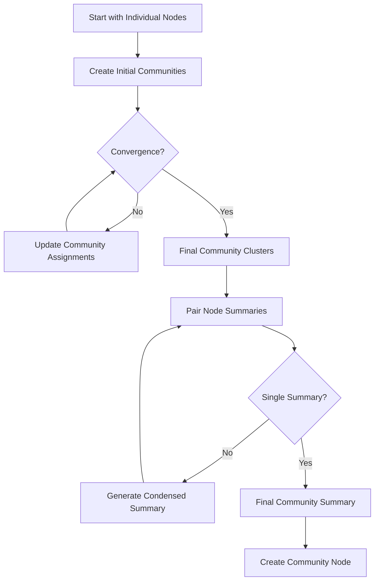
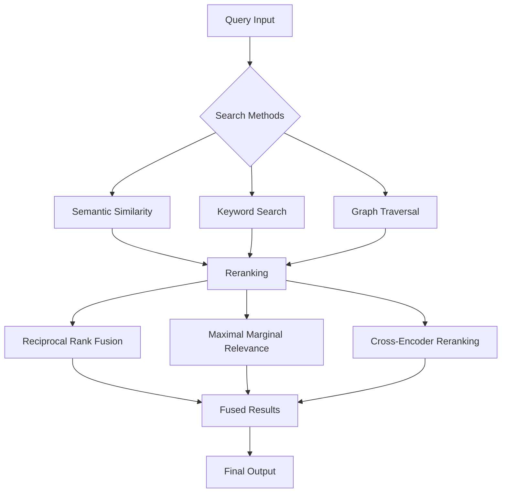
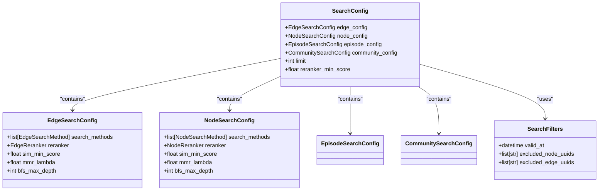

# Advanced Features

<cite>
**Referenced Files in This Document**   
- [graphiti.py](file://graphiti_core/graphiti.py)
- [search_config.py](file://graphiti_core/search/search_config.py)
- [search_config_recipes.py](file://graphiti_core/search/search_config_recipes.py)
- [search.py](file://graphiti_core/search/search.py)
- [community_operations.py](file://graphiti_core/utils/maintenance/community_operations.py)
- [temporal_operations.py](file://graphiti_core/utils/maintenance/temporal_operations.py)
- [graph_data_operations.py](file://graphiti_core/utils/maintenance/graph_data_operations.py)
- [entity_types_utils.py](file://graphiti_core/utils/ontology_utils/entity_types_utils.py)
- [nodes.py](file://graphiti_core/nodes.py)
- [edges.py](file://graphiti_core/edges.py)
- [graph_queries.py](file://graphiti_core/graph_queries.py)
- [podcast_runner.py](file://examples/podcast/podcast_runner.py)
- [parser.py](file://examples/wizard_of_oz/parser.py)
- [runner.py](file://examples/wizard_of_oz/runner.py)
- [transcript_parser.py](file://examples/podcast/transcript_parser.py)
</cite>

## Table of Contents
1. [Custom Entity Definitions](#custom-entity-definitions)
2. [Community Detection and Summarization](#community-detection-and-summarization)
3. [Temporal Query Capabilities](#temporal-query-capabilities)
4. [Performance Optimization Strategies](#performance-optimization-strategies)
5. [Maintenance Operations](#maintenance-operations)
6. [Advanced Search Configurations](#advanced-search-configurations)
7. [Sophisticated Use Cases](#sophisticated-use-cases)

## Custom Entity Definitions

Graphiti enables developers to extend the knowledge graph schema through custom entity definitions using Pydantic models. This feature allows for flexible ontology creation tailored to specific use cases beyond the default entity types. By defining custom Pydantic models, users can specify structured attributes for entities that capture domain-specific information.

The framework validates custom entity types to ensure they don't conflict with existing node fields, preventing schema collisions. When ingesting episodes, Graphiti uses these custom models to extract structured information from unstructured text, creating richly attributed nodes in the knowledge graph. This capability is particularly valuable for applications requiring specialized data models, such as customer relationship management, healthcare records, or financial systems.

Custom entity definitions are passed to the `add_episode` method through the `entity_types` parameter, which accepts a dictionary mapping entity type names to their corresponding Pydantic model classes. This approach enables the framework to use structured output capabilities of LLMs to extract information according to the specified schema, ensuring consistent and predictable data representation in the graph.

**Section sources**
- [graphiti.py](file://graphiti_core/graphiti.py#L611-L800)
- [entity_types_utils.py](file://graphiti_core/utils/ontology_utils/entity_types_utils.py#L1-L38)
- [nodes.py](file://graphiti_core/nodes.py#L1-L200)

## Community Detection and Summarization

Graphiti implements sophisticated community detection algorithms to identify clusters of related entities within the knowledge graph. The framework uses a label propagation algorithm that analyzes the network structure to detect communities based on the density of relationships between entities. This approach starts with each node in its own community and iteratively updates community assignments based on the plurality of neighboring nodes' communities, with ties broken by selecting the largest community.

Once communities are detected, Graphiti applies a hierarchical summarization technique to create meaningful representations of each community. The summarization process works by recursively pairing node summaries and using an LLM to generate condensed summaries until a single comprehensive summary is produced for the entire community. This creates a multi-level understanding of community content, from individual entity details to overarching themes.

The community detection and summarization process is designed to be efficient and scalable, with configurable concurrency limits to balance performance and resource utilization. Communities are represented as first-class nodes in the graph with their own embeddings, enabling them to participate in similarity searches and other graph operations alongside individual entities.

**Diagram sources **
- [community_operations.py](file://graphiti_core/utils/maintenance/community_operations.py#L24-L132)
- [community_operations.py](file://graphiti_core/utils/maintenance/community_operations.py#L167-L207)

**Section sources**
- [community_operations.py](file://graphiti_core/utils/maintenance/community_operations.py#L1-L332)

## Temporal Query Capabilities

Graphiti's bi-temporal data model provides powerful historical analysis capabilities by tracking both the occurrence time of events (valid_at) and the ingestion time of information (created_at). This dual-timestamp approach enables precise point-in-time queries that can reconstruct the state of knowledge at any historical moment, making it ideal for applications requiring audit trails, change tracking, or temporal reasoning.

The framework supports temporal queries through the `retrieve_episodes` method, which accepts a reference time parameter to filter episodes that were valid at that specific moment. This allows users to query the graph as it existed at any point in the past, accounting for both the timing of events and when information about those events became available to the system.

Graphiti also handles temporal contradictions by automatically invalidating outdated relationships when new contradictory information is ingested. The system uses LLMs to detect contradictions between new and existing edges, then updates the `invalid_at` timestamp of superseded relationships. This ensures the knowledge graph maintains temporal consistency while preserving the history of how understanding has evolved over time.

**Section sources**
- [temporal_operations.py](file://graphiti_core/utils/maintenance/temporal_operations.py#L1-L108)
- [graph_data_operations.py](file://graphiti_core/utils/maintenance/graph_data_operations.py#L103-L163)
- [graphiti.py](file://graphiti_core/graphiti.py#L577-L610)

## Performance Optimization Strategies

Graphiti implements multiple performance optimization strategies to ensure efficient operation at scale. The framework automatically creates database indices and constraints during initialization to optimize query performance. These include range indices on frequently queried properties like timestamps and UUIDs, as well as full-text search indices on content fields for keyword-based retrieval.

The system employs a hybrid retrieval approach that combines semantic similarity search, keyword search (BM25), and graph traversal to achieve low-latency queries without relying on LLM summarization. Results from different search methods are combined using advanced reranking techniques such as Reciprocal Rank Fusion (RRF), Maximal Marginal Relevance (MMR), and cross-encoder reranking to produce high-quality results.

Query planning is optimized through parallel execution of independent operations and intelligent batching. The framework uses semaphore-controlled concurrency to manage LLM API calls, preventing rate limit errors while maximizing throughput. Additionally, Graphiti supports bulk operations for efficient processing of large datasets, reducing the overhead of individual database transactions.

**Diagram sources **
- [search.py](file://graphiti_core/search/search.py#L68-L200)
- [graph_queries.py](file://graphiti_core/graph_queries.py#L28-L70)

**Section sources**
- [graph_data_operations.py](file://graphiti_core/utils/maintenance/graph_data_operations.py#L36-L75)
- [search.py](file://graphiti_core/search/search.py#L1-L519)
- [graph_queries.py](file://graphiti_core/graph_queries.py#L1-L163)

## Maintenance Operations

Graphiti provides comprehensive maintenance operations for managing the health and integrity of the knowledge graph. The framework includes utilities for graph cleanup, deduplication, and data migration to ensure data quality and consistency over time.

Graph cleanup operations allow for the removal of data by group ID or complete database clearing, facilitating data partitioning and isolation for different applications or users. The deduplication system identifies and merges duplicate entities based on their semantic similarity, preserving relationships and metadata while eliminating redundancy in the graph.

The framework also supports data migration operations, enabling the transfer of graph data between different database backends or versions. Maintenance tasks are designed to be non-disruptive, with operations that can be performed on live systems without affecting ongoing queries or ingestion processes.

**Section sources**
- [graph_data_operations.py](file://graphiti_core/utils/maintenance/graph_data_operations.py#L76-L102)
- [community_operations.py](file://graphiti_core/utils/maintenance/community_operations.py#L237-L244)

## Advanced Search Configurations

Graphiti offers flexible search configurations through predefined search recipes that encapsulate common query patterns. These recipes define combinations of search methods and reranking strategies optimized for specific use cases, allowing developers to quickly implement sophisticated search functionality without configuring each parameter individually.

The framework supports multiple search methods including cosine similarity for semantic search, BM25 for keyword search, and breadth-first search for graph traversal. Reranking strategies include Reciprocal Rank Fusion (RRF) for combining results from multiple sources, Maximal Marginal Relevance (MMR) for diversity in results, node distance for proximity-based ranking, and cross-encoder reranking for high-precision relevance scoring.

Custom search recipes can be developed by combining different search methods and reranking strategies to address specific application requirements. The modular design allows for easy experimentation with different configurations to optimize for precision, recall, or latency depending on the use case.

**Diagram sources **
- [search_config.py](file://graphiti_core/search/search_config.py#L1-L130)
- [search_config_recipes.py](file://graphiti_core/search/search_config_recipes.py#L1-L224)

**Section sources**
- [search_config.py](file://graphiti_core/search/search_config.py#L1-L130)
- [search_config_recipes.py](file://graphiti_core/search/search_config_recipes.py#L1-L224)
- [search.py](file://graphiti_core/search/search.py#L1-L519)

## Sophisticated Use Cases

Graphiti demonstrates its advanced capabilities through sophisticated use cases such as the Wizard of Oz analysis and podcast transcript processing. In the Wizard of Oz scenario, the framework ingests literary text chapter by chapter, extracting characters, locations, and relationships while preserving the temporal sequence of events. This enables queries about the story's progression and character development over time.

The podcast analysis example showcases Graphiti's ability to process conversational data with speaker attribution and temporal context. By ingesting podcast transcripts with speaker roles and timestamps, the system creates a rich knowledge graph that captures not only what was said but also who said it and when. This enables complex queries about speaker relationships, topic evolution over time, and contextual analysis of statements.

Both use cases illustrate how Graphiti's advanced features work together to transform unstructured text into a queryable, temporally-aware knowledge graph. The combination of custom entity definitions, community detection, temporal reasoning, and optimized search enables sophisticated analysis that would be difficult or impossible with traditional retrieval approaches.

**Section sources**
- [podcast_runner.py](file://examples/podcast/podcast_runner.py#L1-L130)
- [runner.py](file://examples/wizard_of_oz/runner.py#L1-L94)
- [parser.py](file://examples/wizard_of_oz/parser.py#L1-L37)
- [transcript_parser.py](file://examples/podcast/transcript_parser.py#L1-L125)