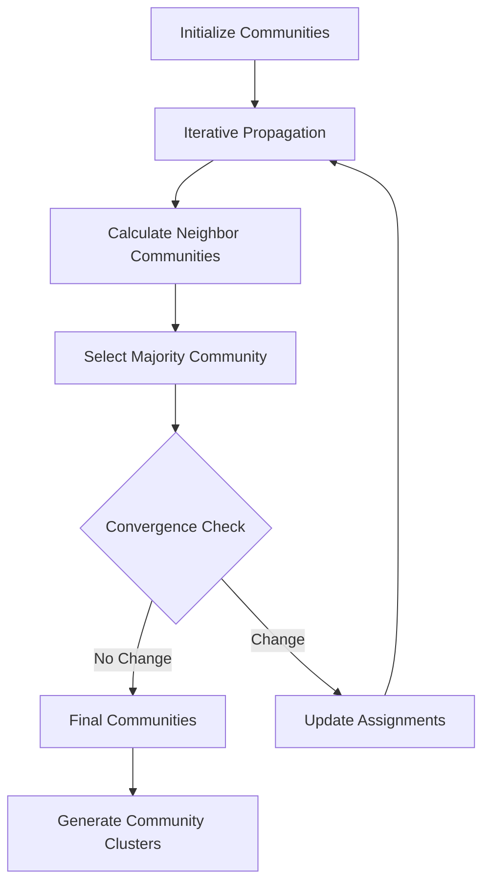
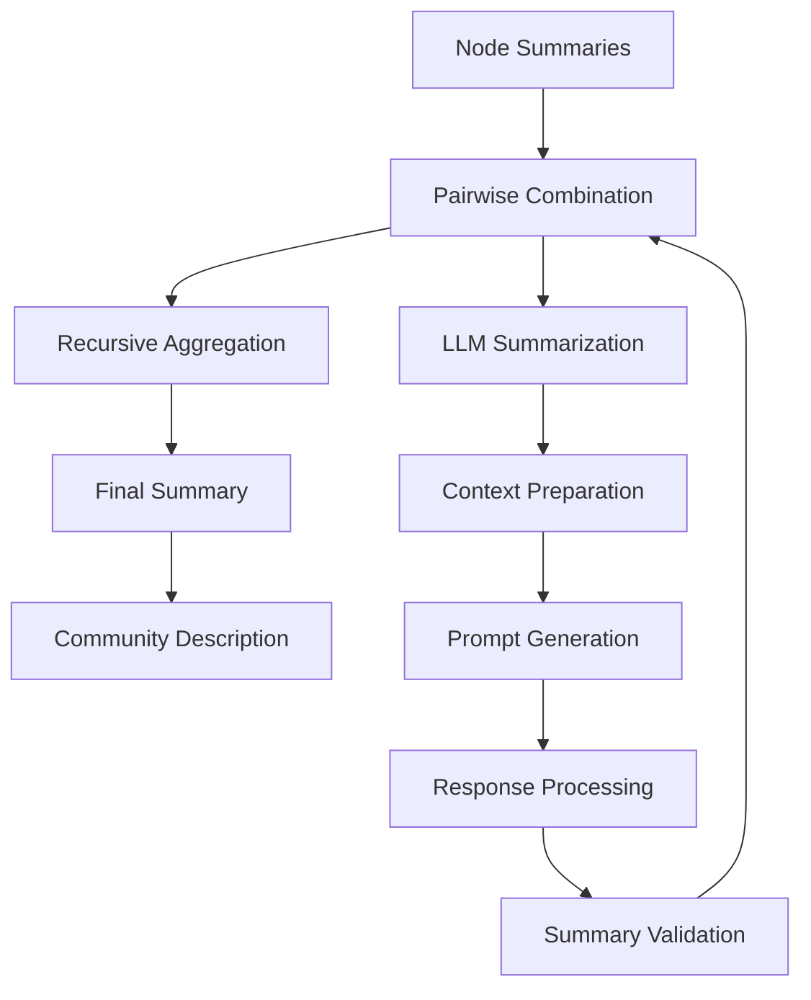
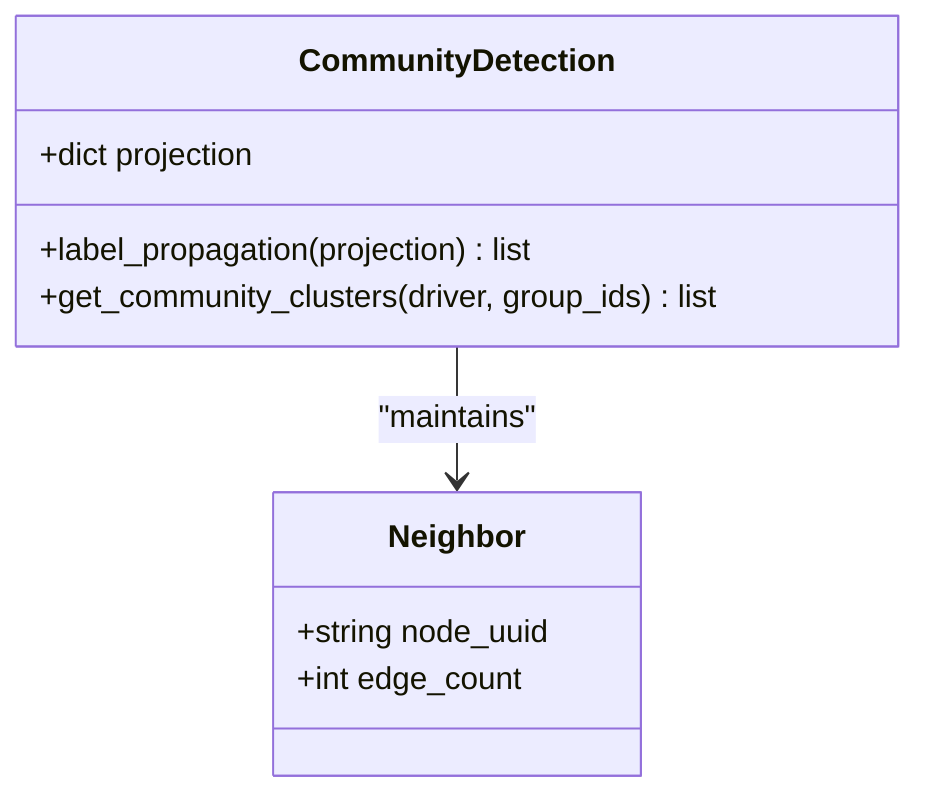
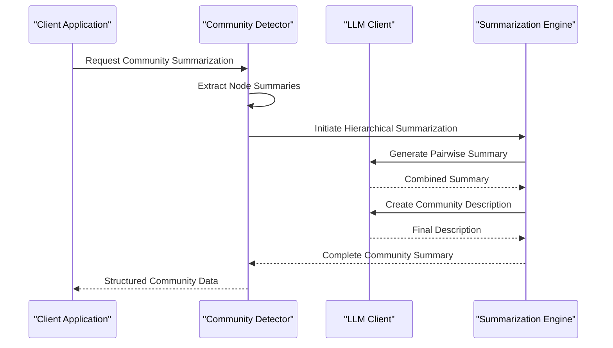
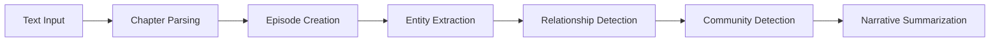
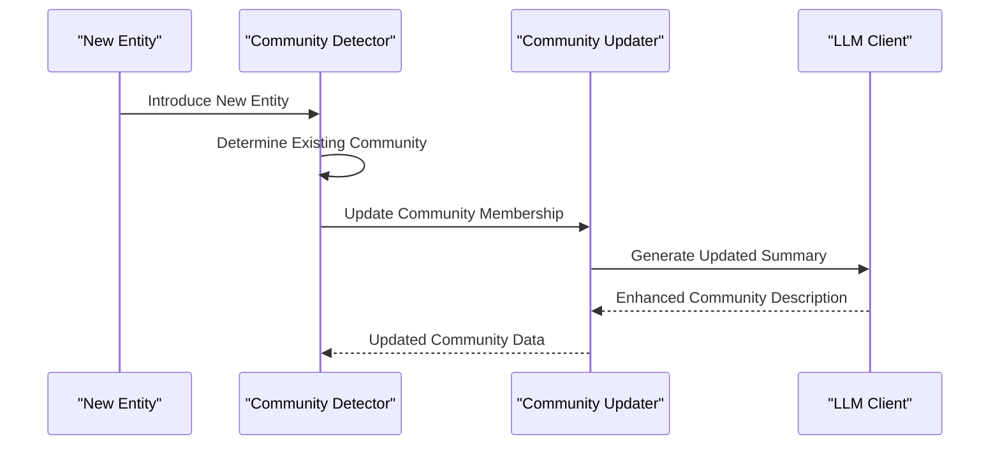

# Community Detection and Summarization

<cite>
**Referenced Files in This Document**
- [community_operations.py](file://graphiti_core/utils/maintenance/community_operations.py)
- [summarize_nodes.py](file://graphiti_core/prompts/summarize_nodes.py)
- [edge_operations.py](file://graphiti_core/utils/maintenance/edge_operations.py)
- [nodes.py](file://graphiti_core/nodes.py)
- [graphiti.py](file://graphiti_core/graphiti.py)
- [runner.py](file://examples/wizard_of_oz/runner.py)
- [parser.py](file://examples/wizard_of_oz/parser.py)
- [woo.txt](file://examples/wizard_of_oz/woo.txt)
- [helpers.py](file://graphiti_core/helpers.py)
- [graphiti_types.py](file://graphiti_core/graphiti_types.py)
</cite>

## Table of Contents
1. [Introduction](#introduction)
2. [Algorithmic Approach](#algorithmic-approach)
3. [Community Detection Implementation](#community-detection-implementation)
4. [Summarization System](#summarization-system)
5. [Configuration Options](#configuration-options)
6. [Wizard of Oz Scenario Example](#wizard-of-oz-scenario-example)
7. [Performance Considerations](#performance-considerations)
8. [Troubleshooting Guide](#troubleshooting-guide)
9. [Best Practices](#best-practices)
10. [Advanced Features](#advanced-features)

## Introduction

Graphiti's community detection and summarization features provide powerful capabilities for identifying densely connected subgraphs within knowledge graphs and generating high-level descriptions of these communities. The system employs sophisticated algorithms to detect communities based on node connectivity patterns and leverages Large Language Models (LLMs) to create meaningful summaries that capture the essence of each community.

The community detection process begins with the Label Propagation Algorithm (LPA), which iteratively assigns nodes to communities based on the majority of their neighbors' community memberships. This approach efficiently identifies tightly-knit groups within large graphs. The summarization system then uses hierarchical aggregation of individual node summaries to create comprehensive descriptions of each detected community.

## Algorithmic Approach

### Label Propagation Algorithm

The core community detection algorithm in Graphiti is based on the Label Propagation Algorithm (LPA), a highly efficient method for detecting communities in large networks. The implementation follows these key steps:



**Diagram sources**
- [community_operations.py](file://graphiti_core/utils/maintenance/community_operations.py#L86-L131)

The LPA implementation includes several optimization features:

1. **Weighted Edge Counting**: Each neighbor contributes based on their edge weight, allowing for more nuanced community assignments
2. **Tie-Breaking Strategy**: When multiple communities have equal support, the algorithm selects the largest community
3. **Convergence Detection**: The algorithm terminates when no node changes its community assignment
4. **Edge Weight Consideration**: The algorithm considers the strength of connections between nodes when determining community membership

**Section sources**
- [community_operations.py](file://graphiti_core/utils/maintenance/community_operations.py#L86-L131)

### Hierarchical Summarization

The summarization system employs a divide-and-conquer approach to efficiently combine multiple node summaries:



**Diagram sources**
- [community_operations.py](file://graphiti_core/utils/maintenance/community_operations.py#L167-L206)
- [summarize_nodes.py](file://graphiti_core/prompts/summarize_nodes.py#L49-L131)

## Community Detection Implementation

### Core Detection Process

The community detection process operates in several stages, each optimized for scalability and accuracy:

#### Step 1: Graph Projection Construction

The system constructs a projection of the graph where each node maintains a list of its neighbors along with edge weights:



**Diagram sources**
- [community_operations.py](file://graphiti_core/utils/maintenance/community_operations.py#L24-L27)

#### Step 2: Label Propagation Execution

The label propagation algorithm iteratively updates community assignments based on local neighborhood information:

1. **Initialization**: Each node starts with its own community identifier
2. **Iteration**: Nodes examine their neighbors and adopt the community with the strongest support
3. **Convergence**: The process continues until no more changes occur
4. **Aggregation**: Nodes with the same final community assignment form clusters

#### Step 3: Cluster Formation

After convergence, the system aggregates nodes into distinct community clusters, preparing them for summarization:

**Section sources**
- [community_operations.py](file://graphiti_core/utils/maintenance/community_operations.py#L29-L83)

### Database-Specific Optimizations

The implementation includes database-specific optimizations for different graph database providers:

- **Neo4j**: Uses standard Cypher queries for community detection
- **Kuzu**: Handles the unique edge representation where relationships are actual nodes
- **Neptune**: Implements specialized query patterns for AWS Neptune
- **FalkorDB**: Provides optimized query execution for high-performance scenarios

**Section sources**
- [community_operations.py](file://graphiti_core/utils/maintenance/community_operations.py#L47-L67)

## Summarization System

### LLM-Based Summarization Pipeline

The summarization system leverages Large Language Models to create coherent, high-quality descriptions of detected communities. The process involves multiple stages of refinement:



**Diagram sources**
- [community_operations.py](file://graphiti_core/utils/maintenance/community_operations.py#L134-L206)
- [summarize_nodes.py](file://graphiti_core/prompts/summarize_nodes.py#L49-L131)

### Prompt Engineering

The system uses carefully crafted prompts to guide the LLM in creating effective summaries:

#### Pairwise Summarization Prompt

The pairwise summarization prompt instructs the LLM to synthesize information from two node summaries into a single, cohesive summary:

```python
# Key characteristics of the pairwise summarization prompt
- Concise synthesis of two summaries
- Character limit enforcement (< 250 characters)
- Focus on essential information
- Maintains factual accuracy
```

#### Community Description Prompt

The community description prompt creates a one-sentence description that captures the essence of the combined community summary:

```python
# Key characteristics of the description prompt
- Single sentence creation
- Summary essence capture
- Character limit compliance
- Clear, descriptive language
```

**Section sources**
- [summarize_nodes.py](file://graphiti_core/prompts/summarize_nodes.py#L49-L131)

### Hierarchical Aggregation Strategy

The summarization system employs a binary tree approach to efficiently combine multiple node summaries:

1. **Pairwise Combination**: Adjacent summaries are combined in pairs
2. **Recursive Aggregation**: The process repeats until a single summary remains
3. **Odd Node Handling**: Special handling for odd-numbered groups ensures completeness
4. **Quality Control**: Each intermediate summary undergoes validation and refinement

**Section sources**
- [community_operations.py](file://graphiti_core/utils/maintenance/community_operations.py#L167-L196)

## Configuration Options

### Concurrency Control

Graphiti provides extensive configuration options for controlling the community detection and summarization processes:

#### Maximum Community Build Concurrency

The system limits concurrent community building operations to prevent resource exhaustion:

```python
MAX_COMMUNITY_BUILD_CONCURRENCY = 10
```

This setting can be adjusted based on available system resources and LLM provider limitations.

#### Semaphore-Based Throttling

The system uses semaphores to control concurrent operations across different components:

```python
# Global semaphore limit for general operations
SEMAPHORE_LIMIT = int(os.getenv('SEMAPHORE_LIMIT', 20))

# Community-specific concurrency control
semaphore = asyncio.Semaphore(MAX_COMMUNITY_BUILD_CONCURRENCY)
```

**Section sources**
- [community_operations.py](file://graphiti_core/utils/maintenance/community_operations.py#L19-L20)
- [helpers.py](file://graphiti_core/helpers.py#L36)

### Threshold Configuration

Several thresholds can be configured to fine-tune community detection behavior:

#### Edge Weight Thresholds

The system considers edge weights when determining community membership, allowing for:

- **Strong Connections**: Edges with higher weights have greater influence
- **Weak Connections**: Lower-weight edges contribute less to community assignment
- **Threshold Tuning**: Adjust sensitivity to weak versus strong connections

#### Convergence Criteria

The label propagation algorithm includes configurable convergence criteria:

- **Change Detection**: Minimum percentage of nodes that must change communities
- **Iteration Limits**: Maximum number of propagation iterations
- **Stability Thresholds**: Minimum stability required for termination

### Memory Management

The system implements several memory management strategies:

1. **Batch Processing**: Large graphs are processed in manageable batches
2. **Streaming Operations**: Results are streamed rather than accumulated in memory
3. **Garbage Collection**: Automatic cleanup of temporary data structures
4. **Resource Monitoring**: Built-in monitoring to prevent memory exhaustion

**Section sources**
- [helpers.py](file://graphiti_core/helpers.py#L105-L117)

## Wizard of Oz Scenario Example

### Character Community Detection

The Wizard of Oz example demonstrates community detection in action, revealing the narrative structure of the story through character interactions:

#### Data Processing Pipeline

The example processes the classic novel through a structured pipeline:



**Diagram sources**
- [runner.py](file://examples/wizard_of_oz/runner.py#L64-L93)
- [parser.py](file://examples/wizard_of_oz/parser.py#L5-L36)

#### Character Communities Identified

Through community detection, the system reveals several key character groups:

1. **Main Protagonist Group**: Dorothy, Toto, and supporting farm characters
2. **Emerald City Group**: Scarecrow, Tin Man, Cowardly Lion, and Glinda
3. **Witch Opposition**: Good Witch of the North, Wicked Witch of the West, and flying monkeys
4. **Traveling Companions**: Characters who join Dorothy on her journey

#### Narrative Summaries

The summarization system generates insightful descriptions of each community:

- **Farm Family Community**: "Dorothy's loving family and farm life in Kansas"
- **Emerald City Alliance**: "The heroic quest to defeat the Wicked Witch and save the Land of Oz"
- **Witch Faction**: "The evil forces opposing Dorothy's journey and the Emerald City"

**Section sources**
- [runner.py](file://examples/wizard_of_oz/runner.py#L64-L93)
- [parser.py](file://examples/wizard_of_oz/parser.py#L5-L36)
- [woo.txt](file://examples/wizard_of_oz/woo.txt#L1-L200)

### Processing Workflow

The Wizard of Oz example demonstrates the complete workflow from text ingestion to community analysis:

1. **Text Parsing**: The novel is parsed into chapters and episodes
2. **Entity Recognition**: Characters and locations are identified
3. **Relationship Extraction**: Interactions between characters are detected
4. **Community Detection**: Groups of interconnected characters are identified
5. **Narrative Analysis**: High-level summaries capture the essence of each community

**Section sources**
- [runner.py](file://examples/wizard_of_oz/runner.py#L64-L93)

## Performance Considerations

### Scalability Factors

Community detection and summarization performance depends on several factors:

#### Graph Size Impact

- **Linear Scaling**: Community detection scales linearly with the number of nodes
- **Quadratic Complexity**: Relationship processing scales quadratically with node density
- **Memory Requirements**: Memory usage increases with graph complexity

#### LLM Processing Costs

The summarization system incurs significant LLM processing costs:

- **Token Consumption**: Each summarization operation consumes substantial tokens
- **Rate Limiting**: LLM providers impose rate limits that affect throughput
- **Cost Optimization**: Batch processing reduces per-operation costs

### Memory Management Strategies

The system implements several strategies to manage memory usage effectively:

#### Streaming Processing

Instead of loading entire graphs into memory, the system processes data in streams:

```python
# Example of streaming community detection
community_clusters = await get_community_clusters(driver, group_ids)
for cluster in community_clusters:
    community_node, community_edges = await build_community(llm_client, cluster)
```

#### Concurrent Operation Limits

The system enforces strict limits on concurrent operations:

```python
# Semaphore-based concurrency control
semaphore = asyncio.Semaphore(MAX_COMMUNITY_BUILD_CONCURRENCY)
```

#### Resource Cleanup

Automatic cleanup prevents memory leaks:

- **Temporary Data**: Intermediate results are cleaned up after use
- **Connection Pooling**: Database connections are managed efficiently
- **Garbage Collection**: Unreferenced objects are automatically collected

**Section sources**
- [community_operations.py](file://graphiti_core/utils/maintenance/community_operations.py#L216-L226)
- [helpers.py](file://graphiti_core/helpers.py#L105-L117)

### Optimization Techniques

Several optimization techniques improve performance:

1. **Parallel Processing**: Multiple communities are processed concurrently
2. **Batch Operations**: Related operations are grouped for efficiency
3. **Caching**: Frequently accessed data is cached to reduce computation
4. **Lazy Evaluation**: Computations are deferred until absolutely necessary

## Troubleshooting Guide

### Common Issues and Solutions

#### Over-Partitioning Problems

**Symptoms**: Too many small communities with minimal overlap
**Causes**: 
- Insufficient edge weight thresholds
- High sensitivity to weak connections
- Inappropriate convergence criteria

**Solutions**:
- Increase edge weight thresholds
- Adjust convergence stability requirements
- Review graph density and connectivity patterns

#### Under-Summarization Issues

**Symptoms**: Few communities with overly broad summaries
**Causes**:
- Insufficient community granularity
- LLM prompt limitations
- Data quality issues

**Solutions**:
- Fine-tune community detection parameters
- Enhance prompt engineering
- Improve data preprocessing quality

#### Performance Degradation

**Symptoms**: Slow processing times, high memory usage
**Causes**:
- Insufficient concurrency limits
- Memory leaks in long-running processes
- Inefficient query patterns

**Solutions**:
- Increase SEMAPHORE_LIMIT environment variable
- Monitor memory usage patterns
- Optimize database queries

### Debugging Strategies

#### Logging and Monitoring

Enable detailed logging to track community detection progress:

```python
import logging
logging.getLogger('graphiti_core.utils.maintenance.community_operations').setLevel(logging.DEBUG)
```

#### Performance Profiling

Monitor key metrics to identify bottlenecks:

- **Processing Time**: Track time spent in each community detection phase
- **Memory Usage**: Monitor peak memory consumption
- **LLM Token Usage**: Track token consumption for summarization
- **Database Queries**: Monitor query execution times

#### Data Quality Validation

Ensure data quality affects community detection:

- **Edge Density**: Verify appropriate edge density for meaningful communities
- **Node Connectivity**: Check that nodes have sufficient connections
- **Graph Structure**: Validate graph topology for expected patterns

**Section sources**
- [community_operations.py](file://graphiti_core/utils/maintenance/community_operations.py#L20-L21)

## Best Practices

### Parameter Tuning Guidelines

#### Community Detection Parameters

1. **Edge Weight Thresholds**: Start with moderate thresholds and adjust based on graph characteristics
2. **Convergence Criteria**: Use conservative settings for initial testing, then optimize for production
3. **Group ID Filtering**: Use group IDs to process large graphs in manageable chunks

#### Summarization Optimization

1. **Prompt Engineering**: Test different prompt variations to find optimal phrasing
2. **LLM Selection**: Choose appropriate LLM models based on quality vs. cost requirements
3. **Batch Size**: Balance batch size between performance and quality

### Data Preparation Best Practices

#### Preprocessing Recommendations

1. **Entity Normalization**: Standardize entity names and types
2. **Relationship Validation**: Verify the accuracy of extracted relationships
3. **Graph Cleaning**: Remove noise and irrelevant connections

#### Quality Assurance

1. **Validation Checks**: Implement validation for community coherence
2. **Cross-Verification**: Compare results across different parameter settings
3. **Human Oversight**: Include human review for critical applications

### Production Deployment

#### Monitoring and Maintenance

1. **Performance Metrics**: Track key performance indicators continuously
2. **Error Handling**: Implement robust error handling and recovery mechanisms
3. **Capacity Planning**: Plan for growth and changing workload patterns

#### Security Considerations

1. **Access Control**: Implement appropriate access controls for community data
2. **Data Privacy**: Ensure sensitive information is protected
3. **Audit Trails**: Maintain audit trails for community operations

## Advanced Features

### Dynamic Community Updates

The system supports dynamic updates to existing communities:



**Diagram sources**
- [community_operations.py](file://graphiti_core/utils/maintenance/community_operations.py#L304-L331)

### Multi-Level Community Detection

The system can detect communities at multiple levels of granularity:

1. **Hierarchical Communities**: Detect nested community structures
2. **Multi-Scale Analysis**: Analyze communities at different abstraction levels
3. **Cross-Community Relationships**: Identify relationships between different communities

### Integration Capabilities

The community detection system integrates seamlessly with other Graphiti features:

- **Search Integration**: Communities enhance search relevance
- **Recommendation Systems**: Community membership informs recommendations
- **Analytics Dashboards**: Community data visualized in analytics tools

**Section sources**
- [community_operations.py](file://graphiti_core/utils/maintenance/community_operations.py#L304-L331)