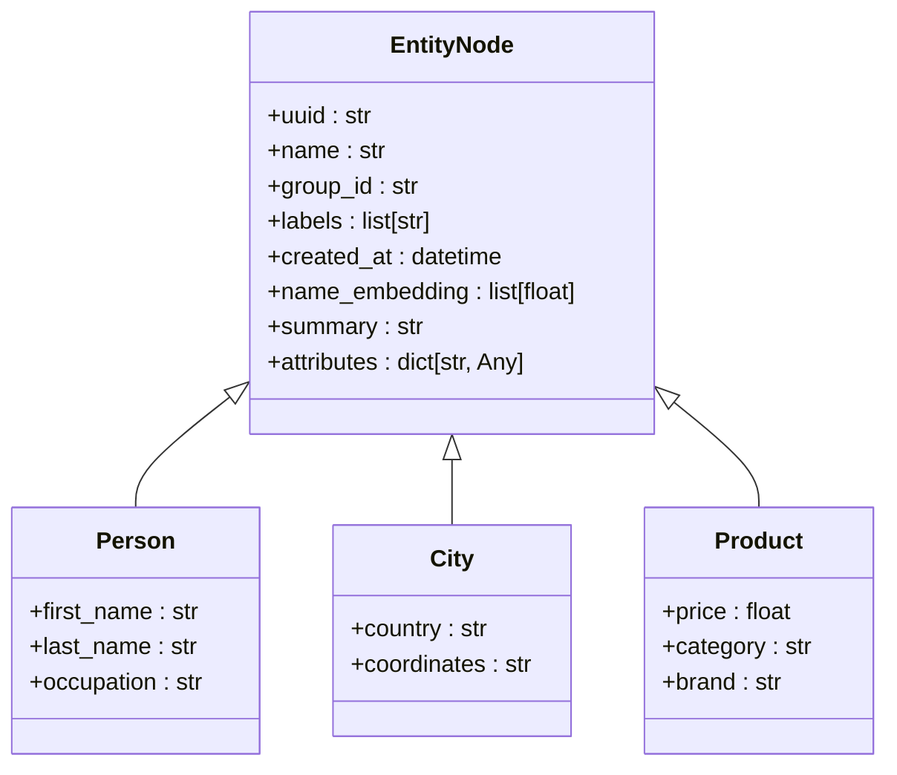
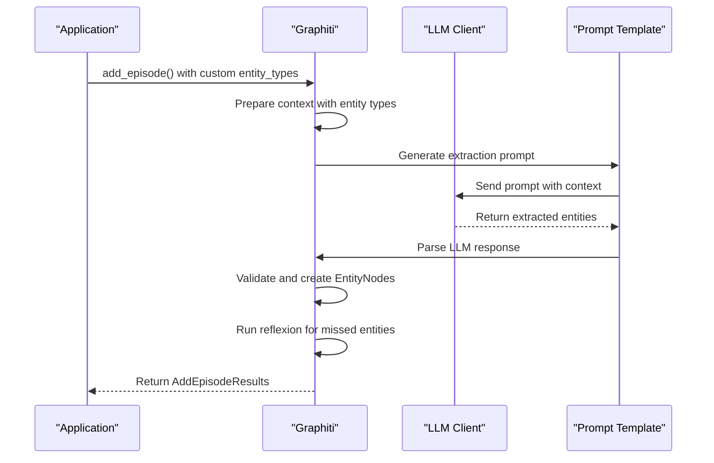
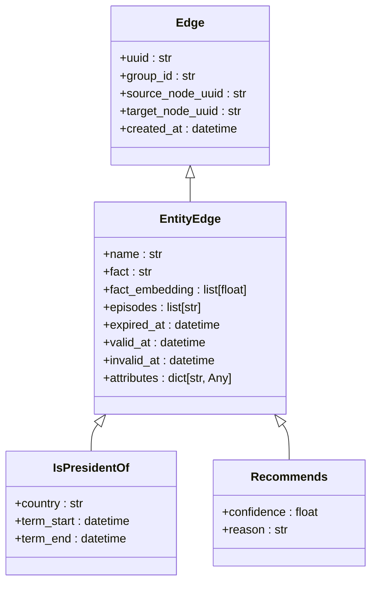
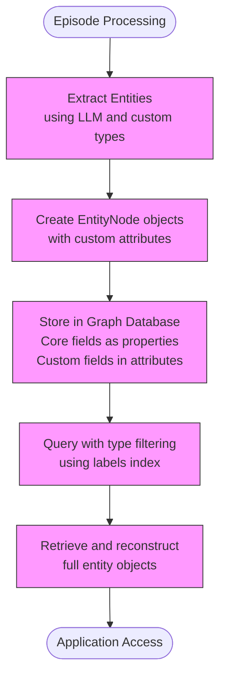

# Custom Entity Definitions

<cite>
**Referenced Files in This Document**   
- [graphiti.py](file://graphiti_core/graphiti.py)
- [nodes.py](file://graphiti_core/nodes.py)
- [edges.py](file://graphiti_core/edges.py)
- [extract_nodes.py](file://graphiti_core/prompts/extract_nodes.py)
- [extract_edges.py](file://graphiti_core/prompts/extract_edges.py)
- [entity_types_utils.py](file://graphiti_core/utils/ontology_utils/entity_types_utils.py)
- [podcast_runner.py](file://examples/podcast/podcast_runner.py)
- [runner.py](file://examples/ecommerce/runner.py)
</cite>

## Table of Contents
1. [Introduction](#introduction)
2. [Defining Custom Entity Types](#defining-custom-entity-types)
3. [Integration with Extraction Pipeline](#integration-with-extraction-pipeline)
4. [Custom Edge Definitions](#custom-edge-definitions)
5. [Storage and Querying](#storage-and-querying)
6. [Practical Examples](#practical-examples)
7. [Schema Evolution and Compatibility](#schema-evolution-and-compatibility)
8. [Testing and Debugging](#testing-and-debugging)
9. [Performance Considerations](#performance-considerations)
10. [Conclusion](#conclusion)

## Introduction

Graphiti enables users to extend the knowledge graph schema through custom entity definitions using Pydantic models. This approach allows domain-specific node and edge types to be defined, enhancing the graph's ability to capture nuanced relationships and attributes from various data sources. The system integrates these custom entities seamlessly into the extraction and resolution pipelines, enabling sophisticated knowledge graph construction from unstructured text, JSON, and conversational data.

The custom entity framework provides a flexible way to define domain-specific ontologies while maintaining compatibility with the core graph structure. By leveraging Pydantic's validation capabilities and type hints, Graphiti ensures data integrity while allowing for rich, structured information to be captured and queried.

**Section sources**
- [graphiti.py](file://graphiti_core/graphiti.py#L128-L200)
- [nodes.py](file://graphiti_core/nodes.py#L87-L159)

## Defining Custom Entity Types

Custom entity types in Graphiti are defined using Pydantic models that inherit from `BaseModel`. These models represent domain-specific node types that extend the basic `EntityNode` structure. Each custom entity type can include specific attributes relevant to the domain, such as product details for e-commerce items or character attributes for literary analysis.

The process begins by creating a Pydantic model that defines the structure of the custom entity. For example, a `Person` entity might include fields for first name, last name, and occupation, while a `City` entity could include country and geographic coordinates. These models are then passed to the Graphiti system through the `entity_types` parameter in methods like `add_episode()`.

A critical validation mechanism prevents naming conflicts between custom entity attributes and the core `EntityNode` fields. The `validate_entity_types()` function in `entity_types_utils.py` ensures that custom entity models do not use field names that already exist in the base `EntityNode` class, such as 'uuid', 'name', 'group_id', or 'created_at'. This prevents schema conflicts and maintains data integrity across the knowledge graph.

**Diagram sources **
- [nodes.py](file://graphiti_core/nodes.py#L435-L589)
- [podcast_runner.py](file://examples/podcast/podcast_runner.py#L60-L73)

**Section sources**
- [entity_types_utils.py](file://graphiti_core/utils/ontology_utils/entity_types_utils.py#L23-L37)
- [nodes.py](file://graphiti_core/nodes.py#L435-L589)

## Integration with Extraction Pipeline

Custom entities are integrated into the extraction pipeline through the `add_episode()` method in the `Graphiti` class, which accepts `entity_types` and `edge_types` parameters. When processing an episode, the system uses these custom types to guide the extraction process, ensuring that domain-specific entities and relationships are properly identified and classified.

The extraction process begins with the `extract_nodes()` function in `node_operations.py`, which prepares a context dictionary containing the episode content, previous episodes, and the defined entity types. This context is formatted into a prompt that instructs the LLM to extract entities and classify them according to the provided types. The entity types are presented with their descriptions and assigned IDs, allowing the LLM to reference them during extraction.

The prompt templating system in `extract_nodes.py` generates different prompts based on the episode type (message, JSON, or text). For message-type episodes, the prompt specifically instructs the LLM to extract the speaker as the first entity and identify other significant entities mentioned in the conversation. The system uses reflexion to improve extraction accuracy, running multiple iterations to identify and extract any missed entities by providing feedback to the LLM.

**Diagram sources **
- [graphiti.py](file://graphiti_core/graphiti.py#L770-L850)
- [node_operations.py](file://graphiti_core/utils/maintenance/node_operations.py#L88-L200)
- [extract_nodes.py](file://graphiti_core/prompts/extract_nodes.py#L86-L132)

**Section sources**
- [node_operations.py](file://graphiti_core/utils/maintenance/node_operations.py#L88-L200)
- [extract_nodes.py](file://graphiti_core/prompts/extract_nodes.py#L86-L132)

## Custom Edge Definitions

Custom edge types in Graphiti are defined similarly to node types, using Pydantic models that represent specific relationships between entities. These models are passed to the system through the `edge_types` parameter and are used to guide the extraction of relationships from the input data.

The `EntityEdge` class serves as the base for all relationships, containing core fields such as `name` (the relationship type in SCREAMING_SNAKE_CASE), `fact` (a natural language description of the relationship), and temporal fields (`valid_at`, `invalid_at`) that capture when relationships begin and end. Custom edge models can extend this base with additional attributes specific to the relationship type.

The edge extraction process is handled by the `extract_edges()` function, which uses the `extract_edges.py` prompt template. This template provides the LLM with a list of entity types and edge types, instructing it to extract factual relationships between entities. The prompt includes specific rules for entity ID validation, requiring that source and target entity IDs match those provided in the context to prevent the creation of edges to non-existent entities.

Edge types include a `fact_type_signature` that specifies the source and target entity types, ensuring that relationships are created only between compatible entities. For example, an `IS_PRESIDENT_OF` relationship might be defined with a signature of `(Person, Entity)`, indicating that it connects a Person to another Entity. This type system prevents semantically invalid relationships from being created in the knowledge graph.

**Diagram sources **
- [edges.py](file://graphiti_core/edges.py#L221-L241)
- [extract_edges.py](file://graphiti_core/prompts/extract_edges.py#L25-L45)

**Section sources**
- [edges.py](file://graphiti_core/edges.py#L221-L241)
- [extract_edges.py](file://graphiti_core/prompts/extract_edges.py#L25-L45)

## Storage and Querying

Custom entities are stored in the graph database with a hybrid approach that combines native graph properties with JSON-serialized attributes. The core fields of `EntityNode` (uuid, name, group_id, etc.) are stored as native node properties, while custom attributes defined in the Pydantic models are stored in the `attributes` dictionary field. This approach maintains query performance for core operations while providing flexibility for domain-specific data.

The storage mechanism varies slightly depending on the graph database provider. In Neo4j and FalkorDB, custom attributes are merged into the node properties, while in Kuzu, they are stored as a JSON string in the `attributes` field. This provider-specific handling is abstracted by the `get_entity_node_save_query()` function in `node_db_queries.py`, which generates the appropriate Cypher query based on the database type.

Querying custom entities is facilitated through the search functionality, which supports filtering by entity type, attributes, and relationships. The system automatically indexes the `labels` property, which includes both the base 'Entity' label and the custom entity type name, enabling efficient type-based queries. When retrieving nodes, the system reconstructs the full entity object by combining the native properties with the deserialized attributes from the `attributes` field.

The `get_entity_node_from_record()` helper function handles the extraction of entity data from database records, properly handling the differences between database providers. For Kuzu, it parses the JSON string in the `attributes` field, while for other providers, it extracts attributes from the node properties and removes the core fields to avoid duplication.

**Diagram sources **
- [nodes.py](file://graphiti_core/nodes.py#L477-L508)
- [node_db_queries.py](file://graphiti_core/models/nodes/node_db_queries.py#L129-L180)
- [nodes.py](file://graphiti_core/nodes.py#L754-L783)

**Section sources**
- [nodes.py](file://graphiti_core/nodes.py#L477-L508)
- [node_db_queries.py](file://graphiti_core/models/nodes/node_db_queries.py#L129-L180)

## Practical Examples

### E-commerce Product Entities

The e-commerce example demonstrates how custom entities can be used to model product information from JSON data. In the `runner.py` file from the ecommerce example, product data is ingested from a JSON file containing product information. Each product is processed as a separate episode with `EpisodeType.json`, allowing the system to extract product entities with attributes like price, category, and brand.

The example shows how structured JSON data can be transformed into a knowledge graph, with each product becoming a node and relationships between products (such as being in the same category) potentially being extracted as edges. This approach enables sophisticated product recommendations and market analysis based on the relationships discovered in the data.

**Section sources**
- [runner.py](file://examples/ecommerce/runner.py#L95-L121)

### Podcast Segment Analysis

The podcast example illustrates how custom entities can be used to analyze conversational content. In `podcast_runner.py`, a transcript is parsed into individual messages, each representing a speaker's contribution. Custom entity types like `Person` and `City` are defined to capture specific information from the conversation.

The example demonstrates the use of custom edge types like `IsPresidentOf` to capture relationships mentioned in the dialogue. By processing the transcript message by message and maintaining context through previous episodes, the system can resolve pronoun references and build a coherent knowledge graph of the discussion.

**Section sources**
- [podcast_runner.py](file://examples/podcast/podcast_runner.py#L60-L108)

### Character Interaction Tracking

The Wizard of Oz example shows how custom entities can track character interactions in narrative text. Although the specific custom types aren't defined in the provided code, the structure suggests that characters could be modeled as `Person` entities with attributes like role and traits, while their interactions could be captured as custom edge types like `MEETS`, `HELPS`, or `CONFRONTS`.

This approach enables literary analysis by transforming narrative text into a structured graph of characters and their relationships, allowing for queries about character networks, relationship evolution, and plot structure.

**Section sources**
- [runner.py](file://examples/wizard_of_oz/runner.py#L59-L93)

## Schema Evolution and Compatibility

Graphiti handles schema evolution through its flexible attribute system and validation mechanisms. When evolving custom entity schemas, users can add new fields to their Pydantic models without breaking existing data, as the system treats missing attributes as None values. However, removing fields requires careful consideration, as existing nodes will retain the deprecated attributes in their `attributes` dictionary until explicitly updated or cleaned.

The system maintains backward compatibility through several mechanisms. The `validate_entity_types()` function ensures that new schema definitions do not conflict with existing node structures. The use of the `attributes` dictionary for custom fields means that older nodes with deprecated fields can coexist with newer nodes, allowing for gradual schema migration.

When changing entity type names, the system's labeling approach provides flexibility. Since each node has both the base 'Entity' label and the specific type label, queries can be adapted to handle both old and new type names during transition periods. The `edge_type_map` parameter allows for mapping relationships between entity types, facilitating the evolution of relationship structures without requiring immediate updates to all data.

Performance implications of complex entity models are primarily related to serialization and storage overhead. Large numbers of custom attributes or deeply nested structures can increase the size of the `attributes` field, potentially impacting query performance. The system mitigates this by using efficient JSON serialization and database indexing, but users should consider normalizing highly complex entities into multiple related nodes when appropriate.

**Section sources**
- [entity_types_utils.py](file://graphiti_core/utils/ontology_utils/entity_types_utils.py#L23-L37)
- [graphiti.py](file://graphiti_core/graphiti.py#L770-L850)

## Testing and Debugging

Testing custom entity implementations involves verifying both the schema definition and the extraction process. The system provides several mechanisms for debugging serialization issues and ensuring correct entity extraction. Unit tests in the codebase demonstrate how to validate that custom entities are properly created, stored, and retrieved.

When debugging serialization issues, developers should first verify that custom entity models do not use field names that conflict with the base `EntityNode` fields. The `EntityTypeValidationError` exception will be raised if such conflicts are detected during entity type validation. Additionally, checking the structure of the `attributes` field in the database can help identify serialization problems.

For testing the extraction pipeline, the reflexion mechanism provides insight into the LLM's performance. By examining the reflexion prompts and responses, developers can understand why certain entities were missed and refine their entity type descriptions accordingly. The system's logging at the DEBUG level also provides detailed information about the extraction process, including the prompts sent to the LLM and the entities extracted at each step.

**Section sources**
- [test_entity_exclusion_int.py](file://tests/test_entity_exclusion_int.py#L39-L329)
- [node_operations.py](file://graphiti_core/utils/maintenance/node_operations.py#L63-L85)

## Performance Considerations

The performance of custom entity processing in Graphiti is influenced by several factors, including the complexity of the entity models, the volume of data being processed, and the configuration of the underlying graph database. The system is designed to handle large-scale knowledge graph construction through asynchronous processing and bulk operations.

Complex entity models with many attributes can increase the computational overhead of serialization and deserialization, as well as the storage requirements in the database. The system mitigates this by using efficient JSON serialization and provider-specific optimizations, but users should consider the trade-offs between rich data modeling and performance.

The extraction pipeline's performance is primarily determined by the LLM calls, with each episode requiring multiple prompts for entity extraction, reflexion, and edge extraction. The system uses asynchronous processing to handle multiple episodes concurrently, but the overall throughput is limited by the LLM's response time and rate limits.

For large-scale ingestion, the `add_episode_bulk()` method provides improved performance by batching database operations. This approach reduces the overhead of individual database transactions and network round-trips, making it suitable for processing large datasets. However, bulk operations require careful memory management, as all episodes and their extracted entities must be held in memory before being written to the database.

**Section sources**
- [graphiti.py](file://graphiti_core/graphiti.py#L1000-L1200)
- [bulk_utils.py](file://graphiti_core/utils/bulk_utils.py#L100-L200)

## Conclusion

Graphiti's custom entity framework provides a powerful and flexible way to extend the knowledge graph schema for domain-specific applications. By leveraging Pydantic models, the system enables rich data modeling while maintaining data integrity through comprehensive validation. The integration with the extraction pipeline allows for sophisticated knowledge discovery from unstructured data sources, transforming text, JSON, and conversations into structured knowledge graphs.

The examples demonstrate the versatility of the framework across different domains, from e-commerce product catalogs to podcast analysis and narrative text processing. The system's design considerations for schema evolution, backward compatibility, and performance ensure that custom entity implementations can scale and adapt to changing requirements.

For optimal results, users should carefully design their entity and edge types to capture the essential domain concepts while avoiding overly complex models that could impact performance. The testing and debugging guidance provides a foundation for ensuring reliable custom entity implementations, enabling the creation of robust and maintainable knowledge graph applications.