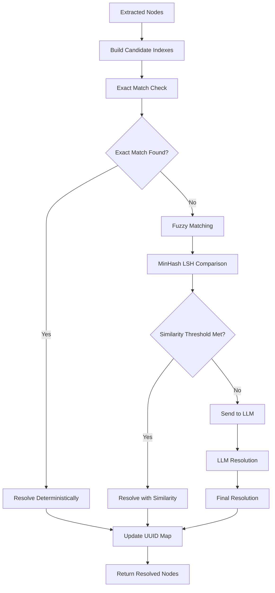
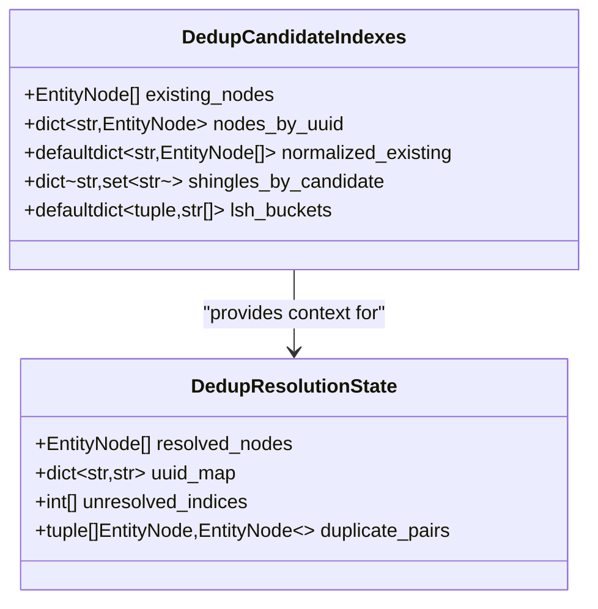
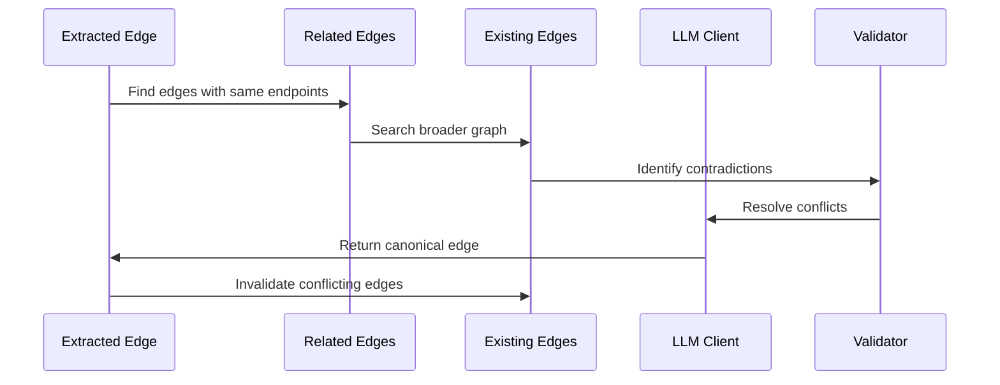
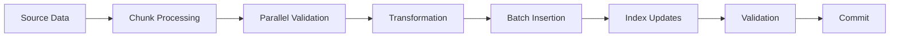
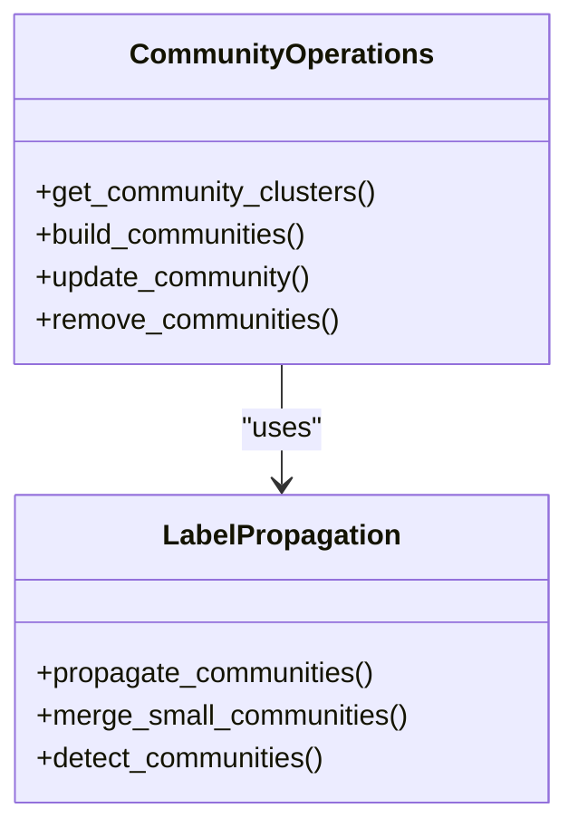

# Maintenance Operations

<cite>
**Referenced Files in This Document**
- [dedup_helpers.py](file://graphiti_core/utils/maintenance/dedup_helpers.py)
- [node_operations.py](file://graphiti_core/utils/maintenance/node_operations.py)
- [edge_operations.py](file://graphiti_core/utils/maintenance/edge_operations.py)
- [graph_data_operations.py](file://graphiti_core/utils/maintenance/graph_data_operations.py)
- [community_operations.py](file://graphiti_core/utils/maintenance/community_operations.py)
- [temporal_operations.py](file://graphiti_core/utils/maintenance/temporal_operations.py)
- [bulk_utils.py](file://graphiti_core/utils/bulk_utils.py)
- [test_node_operations.py](file://tests/utils/maintenance/test_node_operations.py)
- [test_edge_operations.py](file://tests/utils/maintenance/test_edge_operations.py)
</cite>

## Table of Contents
1. [Introduction](#introduction)
2. [Deduplication Processes](#deduplication-processes)
3. [Graph Cleanup Procedures](#graph-cleanup-procedures)
4. [Data Migration Tools](#data-migration-tools)
5. [Data Quality Maintenance](#data-quality-maintenance)
6. [Automated Maintenance Scheduling](#automated-maintenance-scheduling)
7. [Monitoring and Task Outcomes](#monitoring-and-task-outcomes)
8. [Troubleshooting Guide](#troubleshooting-guide)
9. [Best Practices](#best-practices)
10. [Conclusion](#conclusion)

## Introduction

Graphiti's maintenance operations framework provides comprehensive tools for managing graph data integrity, performance optimization, and long-term sustainability. The system implements sophisticated deduplication algorithms, automated cleanup procedures, and intelligent data quality controls designed specifically for AI agent applications operating in dynamic environments.

The maintenance operations are built around several core principles:
- **Deterministic Resolution**: Fuzzy matching combined with LLM-powered verification ensures consistent duplicate detection
- **Temporal Awareness**: Temporal operations handle time-based relationships and edge validity
- **Scalable Processing**: Bulk operations enable efficient processing of large datasets
- **Recovery Mechanisms**: Built-in safeguards prevent data loss during maintenance operations

## Deduplication Processes

### Node Deduplication Architecture

Graphiti implements a two-tier deduplication system combining deterministic fuzzy matching with LLM-powered resolution.



**Diagram sources**
- [dedup_helpers.py](file://graphiti_core/utils/maintenance/dedup_helpers.py#L170-L263)
- [node_operations.py](file://graphiti_core/utils/maintenance/node_operations.py#L395-L451)

### Fuzzy Matching Implementation

The fuzzy matching system uses advanced techniques including MinHash locality-sensitive hashing and Jaccard similarity calculations.

#### Entropy-Based Filtering

Low-entropy names (short or repetitive strings) are automatically deferred to LLM resolution:

```python
def _has_high_entropy(normalized_name: str) -> bool:
    """Filter out very short or low-entropy names that are unreliable for fuzzy matching."""
    token_count = len(normalized_name.split())
    if len(normalized_name) < _MIN_NAME_LENGTH and token_count < _MIN_TOKEN_COUNT:
        return False
    return _name_entropy(normalized_name) >= _NAME_ENTROPY_THRESHOLD
```

#### MinHash LSH Algorithm

The system employs MinHash with locality-sensitive hashing for scalable approximate nearest neighbor search:



**Diagram sources**
- [dedup_helpers.py](file://graphiti_core/utils/maintenance/dedup_helpers.py#L149-L169)

### Edge Deduplication Strategies

Edge deduplication follows similar principles but accounts for directional relationships and temporal validity:



**Diagram sources**
- [edge_operations.py](file://graphiti_core/utils/maintenance/edge_operations.py#L444-L648)

**Section sources**
- [dedup_helpers.py](file://graphiti_core/utils/maintenance/dedup_helpers.py#L1-L263)
- [node_operations.py](file://graphiti_core/utils/maintenance/node_operations.py#L395-L451)
- [edge_operations.py](file://graphiti_core/utils/maintenance/edge_operations.py#L241-L404)

## Graph Cleanup Procedures

### Stale Data Removal

The system provides comprehensive cleanup mechanisms for removing obsolete or irrelevant graph data.

#### Temporal Cleanup

Temporal operations manage edge expiration and validity periods:

```python
async def resolve_edge_contradictions(
    resolved_edge: EntityEdge, invalidation_candidates: list[EntityEdge]
) -> list[EntityEdge]:
    """Determine which contradictory edges need to be expired based on temporal validity."""
    invalidated_edges: list[EntityEdge] = []
    for edge in invalidation_candidates:
        # Check temporal overlap conditions
        if (
            edge_invalid_at_utc is not None
            and resolved_edge_valid_at_utc is not None
            and edge_invalid_at_utc <= resolved_edge_valid_at_utc
        ) or (
            edge_valid_at_utc is not None
            and resolved_edge_invalid_at_utc is not None
            and resolved_edge_invalid_at_utc <= edge_valid_at_utc
        ):
            continue
        # Mark edge as expired
        edge.invalid_at = resolved_edge.valid_at
        edge.expired_at = utc_now()
        invalidated_edges.append(edge)
    return invalidated_edges
```

#### Bulk Deletion Operations

The bulk deletion system provides safe removal of large data subsets:

```python
async def clear_data(driver: GraphDriver, group_ids: list[str] | None = None):
    """Safely remove graph data with optional group filtering."""
    async with driver.session() as session:
        async def delete_all(tx):
            await tx.run('MATCH (n) DETACH DELETE n')
        
        async def delete_group_ids(tx):
            labels = ['Entity', 'Episodic', 'Community']
            if driver.provider == GraphProvider.KUZU:
                labels.append('RelatesToNode_')
            
            for label in labels:
                await tx.run(
                    f"""
                    MATCH (n:{label})
                    WHERE n.group_id IN $group_ids
                    DETACH DELETE n
                    """,
                    group_ids=group_ids,
                )
        
        if group_ids is None:
            await session.execute_write(delete_all)
        else:
            await session.execute_write(delete_group_ids)
```

**Section sources**
- [temporal_operations.py](file://graphiti_core/utils/maintenance/temporal_operations.py#L407-L442)
- [graph_data_operations.py](file://graphiti_core/utils/maintenance/graph_data_operations.py#L76-L101)

## Data Migration Tools

### Schema Evolution Management

Graphiti provides tools for safely evolving graph schemas while maintaining backward compatibility.

#### Versioning Strategies

The system supports gradual schema migrations through:
- **Feature Flags**: Enable/disable new schema features per group
- **Backward Compatibility**: Maintain support for older data formats
- **Incremental Migration**: Process data in batches to minimize downtime

#### Migration Patterns

Common migration patterns include:

1. **Attribute Addition**: Adding new node/edge attributes with default values
2. **Relationship Transformation**: Converting between relationship types
3. **Index Creation**: Adding new indexes for improved query performance
4. **Data Normalization**: Standardizing data formats across the graph

### Bulk Processing Infrastructure

The bulk processing system enables efficient data migration across large datasets:



**Diagram sources**
- [bulk_utils.py](file://graphiti_core/utils/bulk_utils.py#L128-L254)

**Section sources**
- [bulk_utils.py](file://graphiti_core/utils/bulk_utils.py#L1-L551)
- [graph_data_operations.py](file://graphiti_core/utils/maintenance/graph_data_operations.py#L36-L74)

## Data Quality Maintenance

### Long-Running AI Agent Applications

Maintaining data quality in AI agent applications requires specialized approaches:

#### Dynamic Content Processing

AI agents generate continuous streams of data requiring real-time quality checks:

```python
async def extract_attributes_from_nodes(
    clients: GraphitiClients,
    nodes: list[EntityNode],
    episode: EpisodicNode | None = None,
    previous_episodes: list[EpisodicNode] | None = None,
    entity_types: dict[str, type[BaseModel]] | None = None,
    should_summarize_node: NodeSummaryFilter | None = None,
) -> list[EntityNode]:
    """Extract and validate node attributes with configurable summarization."""
    updated_nodes = await semaphore_gather([
        extract_attributes_from_node(
            llm_client,
            node,
            episode,
            previous_episodes,
            entity_types.get(next((item for item in node.labels if item != 'Entity'), '')),
            should_summarize_node,
        )
        for node in nodes
    ])
    
    await create_entity_node_embeddings(embedder, updated_nodes)
    return updated_nodes
```

#### Quality Assurance Filters

The system provides configurable quality filters:

```python
async def extract_attributes_from_node(
    llm_client: LLMClient,
    node: EntityNode,
    episode: EpisodicNode | None = None,
    previous_episodes: list[EpisodicNode] | None = None,
    entity_type: type[BaseModel] | None = None,
    should_summarize_node: NodeSummaryFilter | None = None,
) -> EntityNode:
    """Extract attributes with quality validation."""
    # Extract attributes if entity type is defined
    llm_response = await _extract_entity_attributes(
        llm_client, node, episode, previous_episodes, entity_type
    )
    
    # Extract summary if needed
    await _extract_entity_summary(
        llm_client, node, episode, previous_episodes, should_summarize_node
    )
    
    node.attributes.update(llm_response)
    return node
```

### Community Detection and Maintenance

The community operations system maintains graph structure integrity:



**Diagram sources**
- [community_operations.py](file://graphiti_core/utils/maintenance/community_operations.py#L29-L132)

**Section sources**
- [node_operations.py](file://graphiti_core/utils/maintenance/node_operations.py#L453-L588)
- [community_operations.py](file://graphiti_core/utils/maintenance/community_operations.py#L1-L332)

## Automated Maintenance Scheduling

### Scheduled Operations Framework

While the core library doesn't implement scheduling directly, it provides the building blocks for automated maintenance:

#### Maintenance Task Types

1. **Deduplication Tasks**: Periodic cleanup of duplicate entities and relationships
2. **Index Maintenance**: Regular rebuilding of search indexes
3. **Data Archival**: Moving old data to archive storage
4. **Performance Monitoring**: Tracking query performance metrics

#### Integration Patterns

Applications can integrate with external schedulers:

```python
# Example integration pattern
async def scheduled_maintenance():
    """Example of scheduled maintenance workflow."""
    # Step 1: Deduplicate nodes
    await perform_node_deduplication()
    
    # Step 2: Clean up stale edges
    await cleanup_stale_edges()
    
    # Step 3: Update community structures
    await rebuild_communities()
    
    # Step 4: Optimize indexes
    await optimize_indexes()
```

### Performance Optimization

The system includes several optimization mechanisms:

#### Parallel Processing

Bulk operations utilize semaphore-based concurrency control:

```python
async def semaphore_gather(tasks, max_coroutines=None):
    """Execute tasks with controlled concurrency."""
    semaphore = asyncio.Semaphore(max_coroutines or MAX_CONCURRENT_OPERATIONS)
    
    async def limited_task(task):
        async with semaphore:
            return await task
    
    return await asyncio.gather(*[limited_task(task) for task in tasks])
```

#### Memory Management

Large-scale operations implement streaming patterns to manage memory usage:

```python
async def process_large_dataset(driver: GraphDriver, batch_size: int = 1000):
    """Process large datasets with memory-efficient batching."""
    offset = 0
    while True:
        batch = await driver.execute_query(
            "MATCH (n) RETURN n SKIP $offset LIMIT $batch_size",
            offset=offset,
            batch_size=batch_size
        )
        
        if not batch:
            break
        
        await process_batch(batch)
        offset += batch_size
```

**Section sources**
- [bulk_utils.py](file://graphiti_core/utils/bulk_utils.py#L110-L126)

## Monitoring and Task Outcomes

### Metrics Collection

The system provides comprehensive metrics for monitoring maintenance operations:

#### Performance Metrics

Key performance indicators include:
- **Processing Time**: Time taken for deduplication and cleanup operations
- **Throughput**: Number of nodes/edges processed per minute
- **Success Rate**: Percentage of successful operations vs. total attempts
- **Resource Utilization**: CPU and memory usage during operations

#### Health Checks

Built-in health check mechanisms monitor system integrity:

```python
async def health_check(driver: GraphDriver) -> dict:
    """Perform comprehensive health check."""
    results = {}
    
    # Check connectivity
    results['connectivity'] = await driver.ping()
    
    # Check index health
    results['index_health'] = await check_index_health(driver)
    
    # Check data integrity
    results['data_integrity'] = await validate_data_integrity(driver)
    
    return results
```

### Logging and Auditing

Comprehensive logging captures all maintenance operations:

```python
logger = logging.getLogger(__name__)

# Example log entry
logger.debug(
    'Resolved nodes: %s',
    [(node.name, node.uuid) for node in state.resolved_nodes if node is not None]
)
```

**Section sources**
- [node_operations.py](file://graphiti_core/utils/maintenance/node_operations.py#L437-L441)
- [edge_operations.py](file://graphiti_core/utils/maintenance/edge_operations.py#L532-L540)

## Troubleshooting Guide

### Common Issues and Solutions

#### Incomplete Deletions

**Problem**: Some nodes or edges remain after deletion operations.

**Symptoms**:
- Orphaned nodes still present in the graph
- References to deleted entities persist
- Memory usage continues to grow

**Diagnosis**:
```python
# Check for orphaned nodes
records, _, _ = await driver.execute_query("""
    MATCH (n:Entity)
    WHERE NOT (n)--()
    RETURN COUNT(n) as orphan_count
""")
```

**Solutions**:
1. **Verify Transaction Completion**: Ensure all transactions are properly committed
2. **Check Dependencies**: Review relationships that might prevent deletion
3. **Manual Cleanup**: Use targeted queries for specific cleanup scenarios

#### Unintended Merges

**Problem**: Different entities are incorrectly merged during deduplication.

**Symptoms**:
- Loss of distinct entity information
- Incorrect relationship associations
- Data inconsistency reports

**Diagnosis**:
```python
# Check for suspicious merge patterns
records, _, _ = await driver.execute_query("""
    MATCH (n:Entity)
    WITH n, COUNT(*) as dup_count
    WHERE dup_count > 1
    RETURN n.name, dup_count
    ORDER BY dup_count DESC
""")
```

**Solutions**:
1. **Review Threshold Settings**: Adjust similarity thresholds for more conservative matching
2. **Manual Override**: Use LLM resolution to correct incorrect merges
3. **Restore from Backup**: Recover from recent backup if necessary

#### Performance Degradation

**Problem**: Maintenance operations cause significant performance impact.

**Symptoms**:
- Slow query response times
- High CPU utilization
- Memory exhaustion

**Diagnosis**:
```python
# Monitor operation performance
start_time = time.time()
await perform_maintenance_operation()
end_time = time.time()
duration = end_time - start_time

logger.info(f"Maintenance operation took {duration:.2f} seconds")
```

**Solutions**:
1. **Batch Size Optimization**: Reduce batch sizes for large operations
2. **Concurrent Limiting**: Adjust concurrent operation limits
3. **Resource Allocation**: Increase system resources during maintenance windows

### Recovery Procedures

#### Data Recovery

When maintenance operations fail, implement these recovery steps:

1. **Backup Verification**: Confirm backup integrity before restoration
2. **Selective Restoration**: Restore only affected data subsets
3. **Validation Testing**: Verify restored data integrity
4. **Rollback Planning**: Prepare rollback procedures for failed operations

#### System Recovery

For system-level failures:

1. **Service Restart**: Restart affected services with proper initialization
2. **Index Rebuild**: Rebuild corrupted indexes if necessary
3. **Connection Testing**: Verify database connectivity and authentication
4. **Health Monitoring**: Monitor system health post-recovery

**Section sources**
- [test_node_operations.py](file://tests/utils/maintenance/test_node_operations.py#L350-L387)
- [test_edge_operations.py](file://tests/utils/maintenance/test_edge_operations.py#L320-L374)

## Best Practices

### Operational Excellence

#### Maintenance Window Planning

Schedule maintenance operations during low-traffic periods:
- **Weekly Deduplication**: Run deduplication on weekends
- **Monthly Cleanup**: Perform comprehensive cleanup monthly
- **Quarterly Optimization**: Full system optimization quarterly

#### Resource Management

Optimize resource usage during maintenance:
- **Memory Limits**: Set appropriate memory limits for bulk operations
- **CPU Throttling**: Implement CPU throttling for production systems
- **Storage Planning**: Ensure adequate storage for temporary files

#### Monitoring and Alerting

Implement comprehensive monitoring:
- **Operation Metrics**: Track success rates and performance metrics
- **Error Rates**: Monitor error rates and failure patterns
- **Resource Usage**: Track system resource consumption
- **Alert Configuration**: Set up alerts for maintenance failures

### Development Guidelines

#### Testing Maintenance Operations

Thoroughly test maintenance operations:
- **Unit Tests**: Test individual components in isolation
- **Integration Tests**: Test end-to-end workflows
- **Performance Tests**: Validate performance under load
- **Recovery Tests**: Test recovery procedures

#### Code Quality Standards

Maintain high code quality:
- **Error Handling**: Implement robust error handling
- **Logging**: Add comprehensive logging for debugging
- **Documentation**: Document complex maintenance logic
- **Testing**: Write comprehensive test coverage

## Conclusion

Graphiti's maintenance operations framework provides a comprehensive solution for managing graph data integrity and performance in AI agent applications. The system's combination of deterministic algorithms, LLM-powered resolution, and automated cleanup procedures ensures reliable operation in dynamic environments.

Key benefits include:
- **Consistent Data Quality**: Reliable deduplication prevents data inconsistencies
- **Performance Optimization**: Efficient bulk operations handle large datasets
- **Operational Safety**: Built-in safeguards prevent data loss
- **Scalability**: Parallel processing handles enterprise-scale deployments

The framework's modular design allows organizations to customize maintenance procedures while benefiting from proven algorithms and best practices. Regular maintenance operations, combined with proper monitoring and recovery procedures, ensure long-term system reliability and optimal performance.

For organizations deploying Graphiti in production environments, implementing these maintenance procedures as part of their operational strategy will significantly improve system reliability and data quality over time.