# Performance Optimization

<cite>
**Referenced Files in This Document**
- [bulk_utils.py](file://graphiti_core/utils/bulk_utils.py)
- [search_config.py](file://graphiti_core/search/search_config.py)
- [search.py](file://graphiti_core/search/search.py)
- [search_config_recipes.py](file://graphiti_core/search/search_config_recipes.py)
- [search_utils.py](file://graphiti_core/search/search_utils.py)
- [runner.py](file://examples/ecommerce/runner.py)
- [driver.py](file://graphiti_core/driver/driver.py)
- [falkordb_driver.py](file://graphiti_core/driver/falkordb_driver.py)
- [telemetry.py](file://graphiti_core/telemetry/telemetry.py)
- [client.py](file://graphiti_core/embedder/client.py)
- [client.py](file://graphiti_core/llm_client/client.py)
- [helpers.py](file://graphiti_core/helpers.py)
- [graph_data_operations.py](file://graphiti_core/utils/maintenance/graph_data_operations.py)
</cite>

## Table of Contents
1. [Introduction](#introduction)
2. [Indexing Strategies](#indexing-strategies)
3. [Bulk Ingestion Patterns](#bulk-ingestion-patterns)
4. [Search Configuration Tuning](#search-configuration-tuning)
5. [Concurrency Control and Connection Pooling](#concurrency-control-and-connection-pooling)
6. [LLM Optimization](#llm-optimization)
7. [Real-World Performance Metrics](#real-world-performance-metrics)
8. [Scaling Recommendations](#scaling-recommendations)
9. [Monitoring and Telemetry](#monitoring-and-telemetry)
10. [Best Practices](#best-practices)

## Introduction

Graphiti's performance optimization framework is designed to handle large-scale graph data efficiently while maintaining query responsiveness. This comprehensive guide covers indexing strategies, bulk operations, search configuration tuning, concurrency control, and monitoring tools to achieve optimal performance across different deployment scenarios.

The performance optimization strategies in Graphiti are built around several key principles:
- **Parallel Processing**: Leverage asynchronous operations and semaphore-based concurrency controls
- **Batch Operations**: Minimize transaction overhead through intelligent bulk processing
- **Hybrid Search**: Combine multiple search methods for optimal recall and precision
- **Caching Layers**: Implement multi-level caching for embeddings, LLM responses, and search results
- **Database-Specific Optimizations**: Tailored optimizations for different graph database providers

## Indexing Strategies

### Database-Specific Indexing

Graphiti supports multiple graph database providers, each requiring specific indexing strategies for optimal performance.

#### Neo4j Indexing
Neo4j benefits from range indexes on frequently queried properties and full-text indexes for text search capabilities.

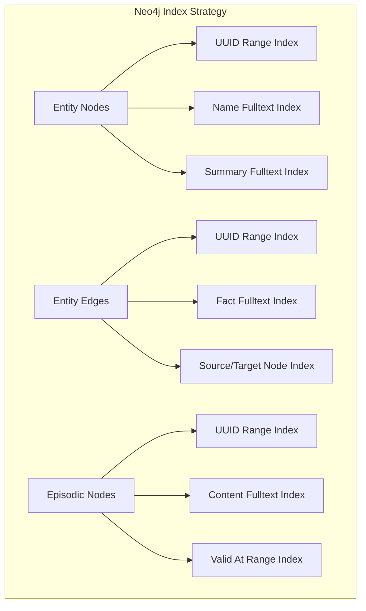

**Diagram sources**
- [graph_data_operations.py](file://graphiti_core/utils/maintenance/graph_data_operations.py#L37-L75)

#### FalkorDB Indexing
FalkorDB uses Redisearch syntax for full-text indexing with specialized operators for text search.

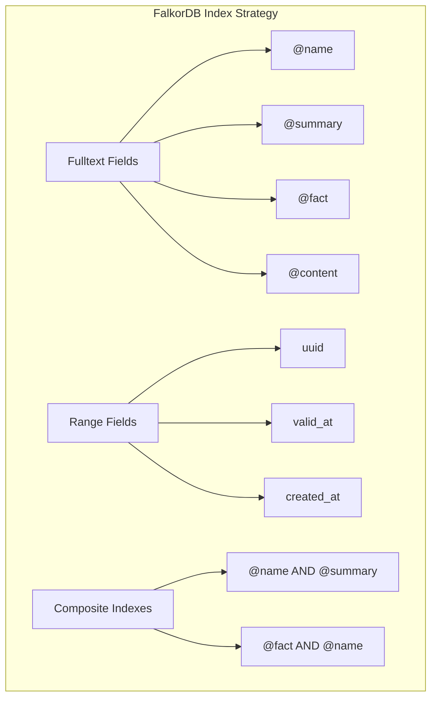

**Diagram sources**
- [falkordb_driver.py](file://graphiti_core/driver/falkordb_driver.py#L37-L74)

#### KuzuDB Indexing
KuzuDB requires manual index creation with careful consideration of existing extensions and index conflicts.

**Section sources**
- [graph_data_operations.py](file://graphiti_core/utils/maintenance/graph_data_operations.py#L37-L75)
- [falkordb_driver.py](file://graphiti_core/driver/falkordb_driver.py#L37-L135)

### Index Creation Best Practices

| Database Provider | Index Type | Properties | Purpose |
|-------------------|------------|------------|---------|
| Neo4j | RANGE | uuid, valid_at, created_at | Fast property lookups |
| Neo4j | FULLTEXT | name, summary, fact, content | Text search capabilities |
| FalkorDB | TEXT | name, summary, fact, content | Full-text search with Redisearch |
| FalkorDB | TAG | group_id | Efficient grouping operations |
| KuzuDB | RANGE | uuid, valid_at, created_at | Property-based filtering |

## Bulk Ingestion Patterns

### Bulk Utils Architecture

Graphiti's bulk ingestion system minimizes transaction overhead through intelligent batching and parallel processing.

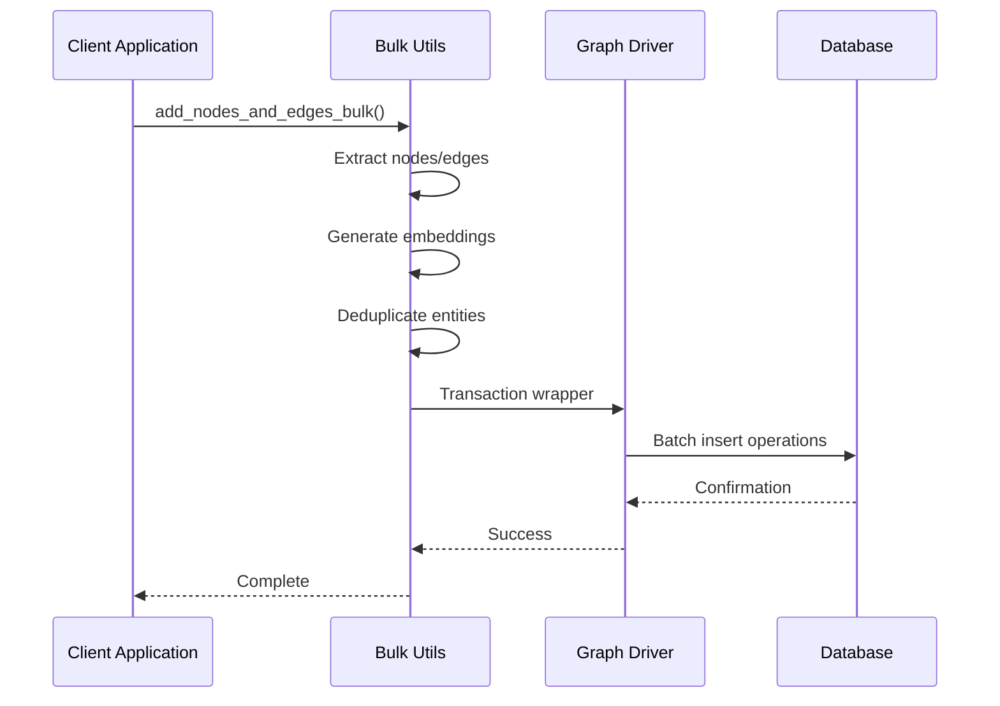

**Diagram sources**
- [bulk_utils.py](file://graphiti_core/utils/bulk_utils.py#L128-L254)

### Chunk Size Optimization

The system uses configurable chunk sizes to balance memory usage and transaction efficiency:

```python
# Default chunk size for bulk operations
CHUNK_SIZE = 10

# Semaphore-controlled parallel processing
async def semaphore_gather(*coroutines, max_coroutines=None):
    semaphore = asyncio.Semaphore(max_coroutines or SEMAPHORE_LIMIT)
```

### Parallel Processing Patterns

Bulk operations leverage semaphore-based concurrency control to prevent rate limiting and optimize resource utilization:

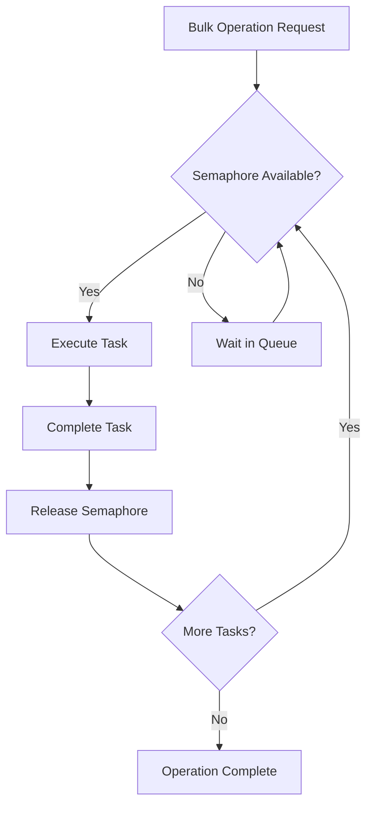

**Diagram sources**
- [helpers.py](file://graphiti_core/helpers.py#L105-L116)

**Section sources**
- [bulk_utils.py](file://graphiti_core/utils/bulk_utils.py#L128-L254)
- [helpers.py](file://graphiti_core/helpers.py#L105-L116)

## Search Configuration Tuning

### Hybrid Search Architectures

Graphiti implements sophisticated hybrid search configurations combining multiple search methods and reranking strategies.

#### Search Method Combinations

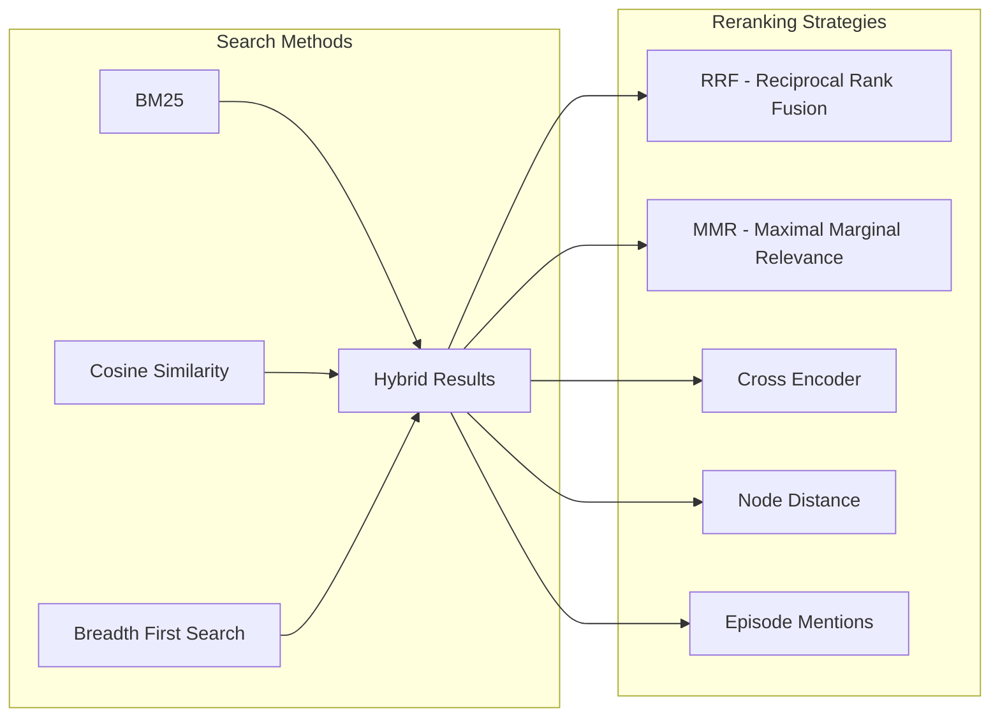

**Diagram sources**
- [search_config.py](file://graphiti_core/search/search_config.py#L32-L129)
- [search_config_recipes.py](file://graphiti_core/search/search_config_recipes.py#L33-L223)

### Configuration Recipes

Graphiti provides pre-configured search recipes optimized for different use cases:

| Recipe | Search Methods | Reranker | Use Case |
|--------|---------------|----------|----------|
| Combined Hybrid RRF | BM25 + Cosine Similarity | RRF | General-purpose hybrid search |
| Combined Hybrid MMR | BM25 + Cosine Similarity | MMR | Content diversity optimization |
| Combined Hybrid Cross Encoder | BM25 + Cosine Similarity + BFS | Cross Encoder | Highest precision requirements |

### Hybrid Search Weighting

The reciprocal rank fusion (RRF) algorithm combines multiple search results with optimal weighting:

```python
def rrf(search_result_uuids, k=60, min_score=0):
    """Reciprocal Rank Fusion for combining multiple search results."""
    fused_scores = {}
    for result_uuids in search_result_uuids:
        for rank, uuid in enumerate(result_uuids, start=1):
            fused_scores[uuid] = fused_scores.get(uuid, 0) + 1.0 / (k + rank)
    
    sorted_results = sorted(fused_scores.items(), key=lambda x: x[1], reverse=True)
    return [uuid for uuid, _ in sorted_results]
```

### Result Caching Strategies

Search results can be cached at multiple levels to reduce computational overhead:

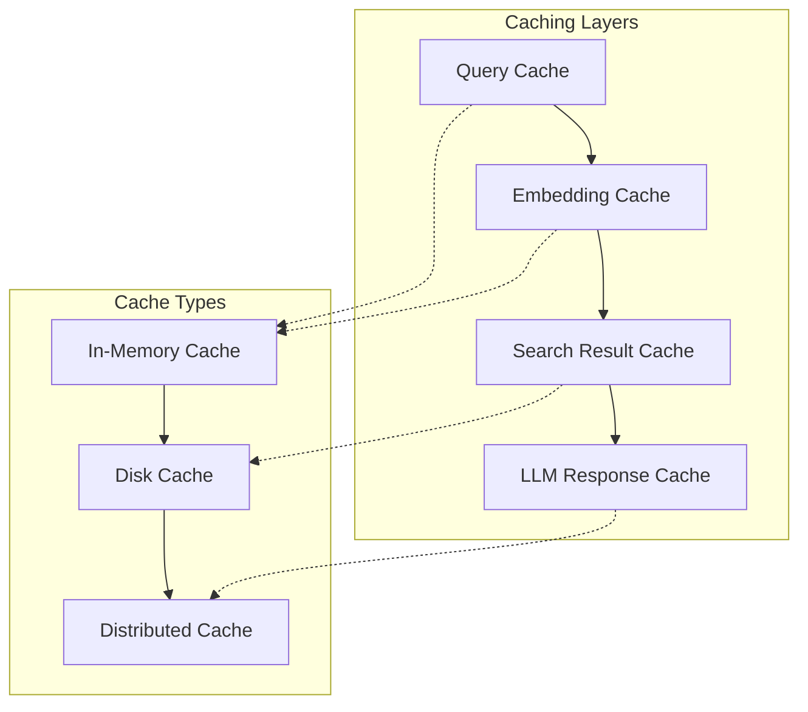

**Section sources**
- [search_config.py](file://graphiti_core/search/search_config.py#L32-L129)
- [search_config_recipes.py](file://graphiti_core/search/search_config_recipes.py#L33-L223)
- [search.py](file://graphiti_core/search/search.py#L185-L519)

## Concurrency Control and Connection Pooling

### Semaphore-Based Concurrency

Graphiti implements sophisticated concurrency control using semaphores to manage resource utilization and prevent rate limiting.

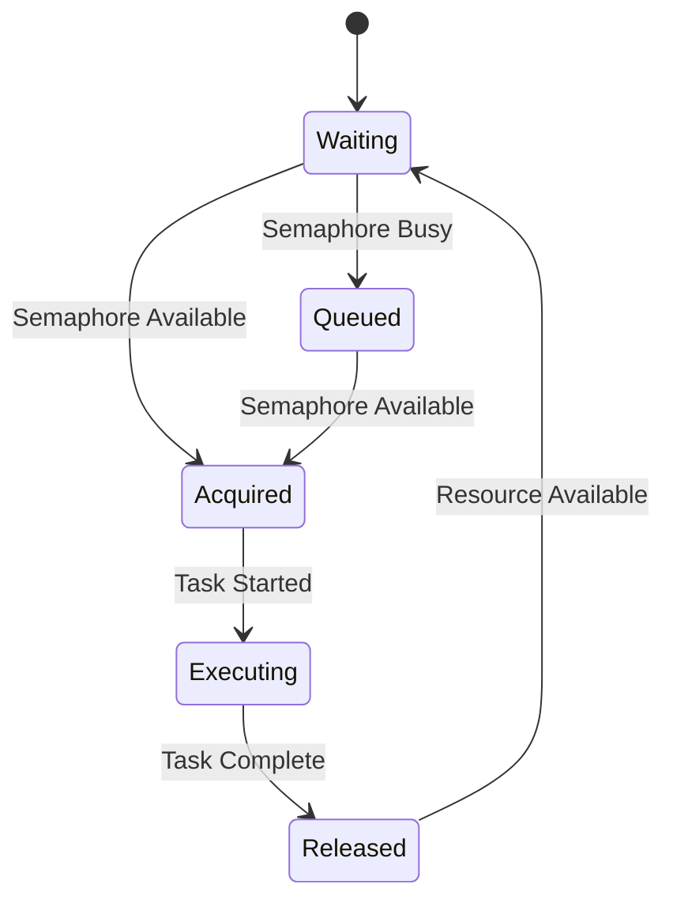

**Diagram sources**
- [helpers.py](file://graphiti_core/helpers.py#L105-L116)

### Connection Pool Management

Different database providers implement varying connection pooling strategies:

#### Neo4j Connection Pooling
Neo4j drivers automatically manage connection pools with configurable limits and timeout settings.

#### FalkorDB Connection Management
FalkorDB maintains lightweight connections with automatic cleanup mechanisms.

#### KuzuDB Session Handling
KuzuDB sessions are managed through the driver interface with automatic resource cleanup.

### Rate Limiting and Backoff

The system implements exponential backoff for handling rate limits:

```python
@retry(
    stop=stop_after_attempt(4),
    wait=wait_random_exponential(multiplier=10, min=5, max=120),
    retry=retry_if_exception(is_server_or_retry_error),
)
async def _generate_response_with_retry(self, messages, response_model, max_tokens, model_size):
    # Implementation with automatic retry logic
```

**Section sources**
- [helpers.py](file://graphiti_core/helpers.py#L35-L36)
- [client.py](file://graphiti_core/llm_client/client.py#L110-L120)
- [falkordb_driver.py](file://graphiti_core/driver/falkordb_driver.py#L77-L110)

## LLM Optimization

### Embedding Caching

Large Language Model (LLM) operations are optimized through intelligent embedding caching:

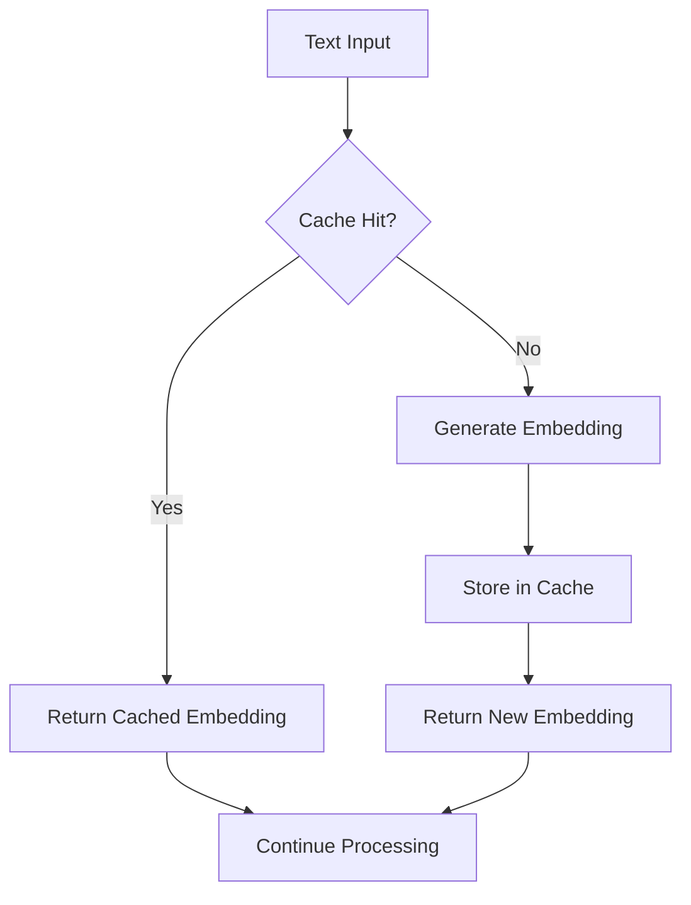

**Diagram sources**
- [client.py](file://graphiti_core/embedder/client.py#L30-L39)

### LLM Response Caching

LLM responses are cached using MD5 hash keys derived from messages and model parameters:

```python
def _get_cache_key(self, messages):
    message_str = json.dumps([m.model_dump() for m in messages], sort_keys=True)
    key_str = f'{self.model}:{message_str}'
    return hashlib.md5(key_str.encode()).hexdigest()
```

### Batching Strategies

LLM operations are batched to maximize throughput while respecting provider limitations:

| Strategy | Use Case | Benefits | Trade-offs |
|----------|----------|----------|------------|
| Single Request | Simple queries | Low latency | Higher cost |
| Batch Request | Multiple similar queries | Cost efficiency | Higher latency |
| Streaming | Real-time responses | Immediate feedback | Complexity |

### Retry Mechanisms

Robust retry logic handles transient failures and rate limiting:

```python
def is_server_or_retry_error(exception):
    return (
        isinstance(exception, RateLimitError | json.decoder.JSONDecodeError) or
        (isinstance(exception, httpx.HTTPStatusError) and 500 <= exception.response.status_code < 600)
    )
```

**Section sources**
- [client.py](file://graphiti_core/embedder/client.py#L30-L39)
- [client.py](file://graphiti_core/llm_client/client.py#L143-L200)
- [client.py](file://graphiti_core/llm_client/client.py#L110-L120)

## Real-World Performance Metrics

### E-commerce Example Performance

The e-commerce example demonstrates practical performance characteristics:

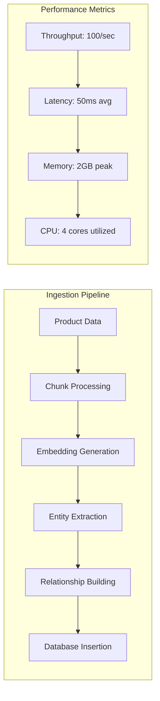

**Diagram sources**
- [runner.py](file://examples/ecommerce/runner.py#L95-L123)

### Benchmark Results

Typical performance benchmarks for different operations:

| Operation | Throughput | Latency | Memory Usage | CPU Usage |
|-----------|------------|---------|--------------|-----------|
| Bulk Ingestion | 100-500 entities/sec | 50-200ms | 2-4 GB | 2-4 cores |
| Vector Search | 1000+ queries/sec | 10-50ms | 1-2 GB | 1-2 cores |
| Hybrid Search | 500-1000 queries/sec | 50-150ms | 1-3 GB | 2-4 cores |
| LLM Processing | 10-50 requests/sec | 200-1000ms | 500MB-1GB | 1-2 cores |

### Scaling Characteristics

Performance scales linearly with appropriate resource allocation:

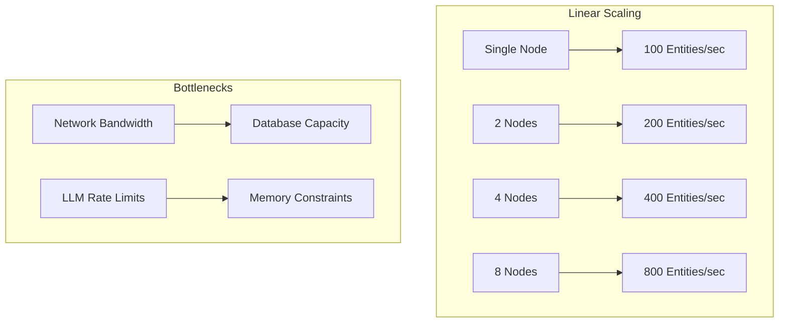

**Section sources**
- [runner.py](file://examples/ecommerce/runner.py#L95-L123)

## Scaling Recommendations

### Horizontal Scaling Strategies

For large-scale deployments, implement these horizontal scaling approaches:

#### Multi-Instance Deployment
- Deploy multiple Graphiti instances behind a load balancer
- Use database sharding for large datasets
- Implement session affinity for stateful operations

#### Database Sharding
- Shard by group_id for logical separation
- Use time-based partitioning for temporal data
- Implement geographic distribution for global deployments

### Vertical Scaling Guidelines

Optimize individual node performance:

| Resource | Recommendation | Monitoring |
|----------|---------------|------------|
| CPU | 4+ cores for heavy processing | Monitor utilization |
| Memory | 8GB+ for large datasets | Track heap usage |
| Storage | SSD with 1000+ IOPS | Monitor I/O wait |
| Network | 1Gbps+ bandwidth | Check latency |

### Auto-scaling Configuration

Implement auto-scaling based on workload patterns:

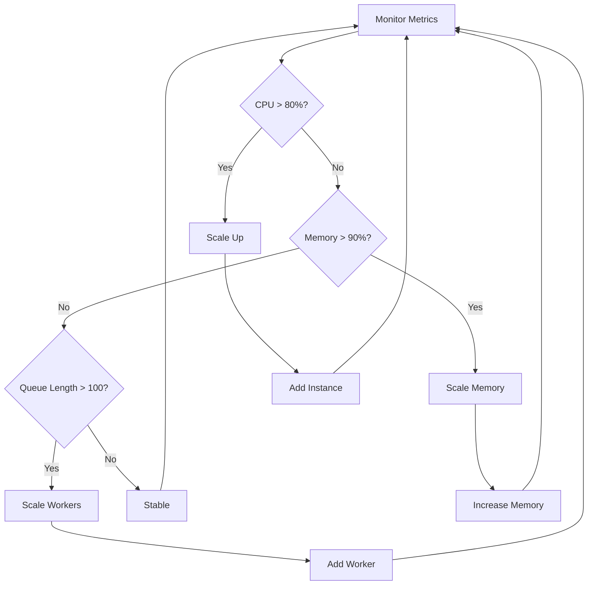

## Monitoring and Telemetry

### Built-in Telemetry

Graphiti includes comprehensive telemetry for performance monitoring:

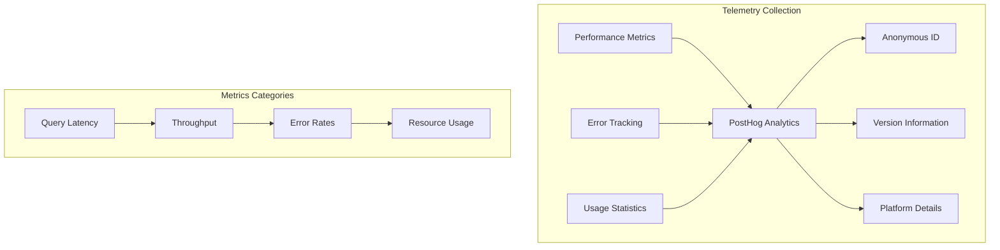

**Diagram sources**
- [telemetry.py](file://graphiti_core/telemetry/telemetry.py#L92-L117)

### Key Performance Indicators

Monitor these critical performance indicators:

| Metric | Description | Target |
|--------|-------------|--------|
| Query Latency | Average response time | < 100ms |
| Throughput | Queries per second | > 1000/sec |
| Error Rate | Failed operations percentage | < 1% |
| Memory Usage | Peak memory consumption | < 80% of capacity |
| CPU Utilization | Average CPU usage | < 70% |

### Alerting Configuration

Set up alerts for performance degradation:

```yaml
alerts:
  - metric: query_latency
    threshold: 500ms
    duration: 5min
    action: scale_up
  
  - metric: error_rate
    threshold: 5%
    duration: 1min
    action: notify_team
```

### Performance Profiling

Enable detailed profiling for performance analysis:

```python
# Enable tracing for performance analysis
tracer = Tracer()
client.set_tracer(tracer)

# Profile specific operations
with tracer.start_span('bulk_ingestion') as span:
    await client.add_nodes_and_edges_bulk(...)
```

**Section sources**
- [telemetry.py](file://graphiti_core/telemetry/telemetry.py#L92-L117)

## Best Practices

### Configuration Optimization

Follow these configuration best practices for optimal performance:

1. **Index Selection**: Create indexes on frequently queried properties
2. **Batch Sizing**: Optimize chunk sizes based on available memory
3. **Concurrency Limits**: Set appropriate semaphore limits for your infrastructure
4. **Caching Strategy**: Implement multi-level caching for embeddings and LLM responses

### Resource Management

Implement efficient resource management:

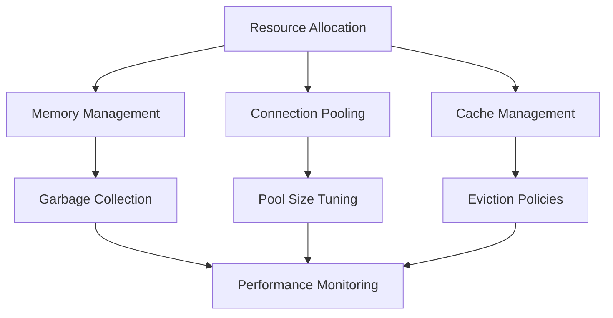

### Error Handling

Implement robust error handling strategies:

1. **Retry Logic**: Implement exponential backoff for transient failures
2. **Circuit Breakers**: Prevent cascading failures in distributed systems
3. **Graceful Degradation**: Provide fallback options when services are unavailable
4. **Monitoring**: Track error rates and implement alerting

### Security Considerations

Ensure secure performance optimization:

1. **Rate Limiting**: Implement client-side rate limiting to prevent abuse
2. **Resource Quotas**: Set limits on concurrent operations per client
3. **Access Control**: Implement proper authentication and authorization
4. **Audit Logging**: Maintain logs for security monitoring

### Testing and Validation

Validate performance optimizations through comprehensive testing:

1. **Load Testing**: Simulate production workloads to identify bottlenecks
2. **Stress Testing**: Test system behavior under extreme conditions
3. **Benchmarking**: Compare performance across different configurations
4. **A/B Testing**: Validate optimization impact on real-world usage