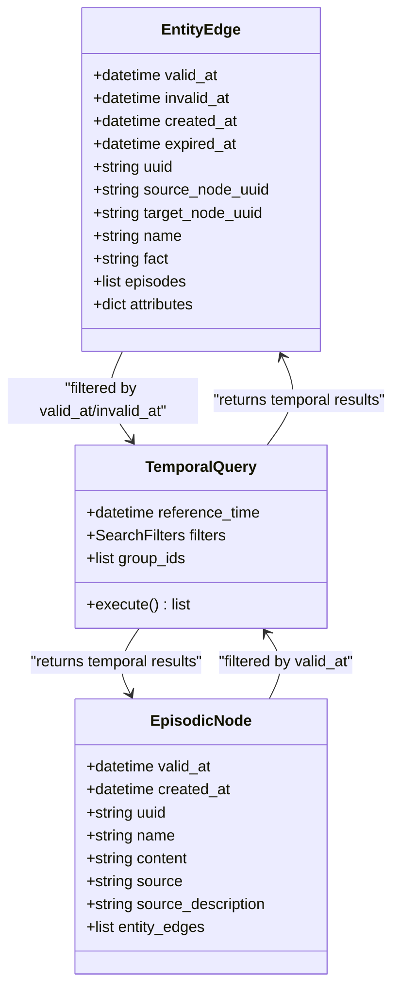
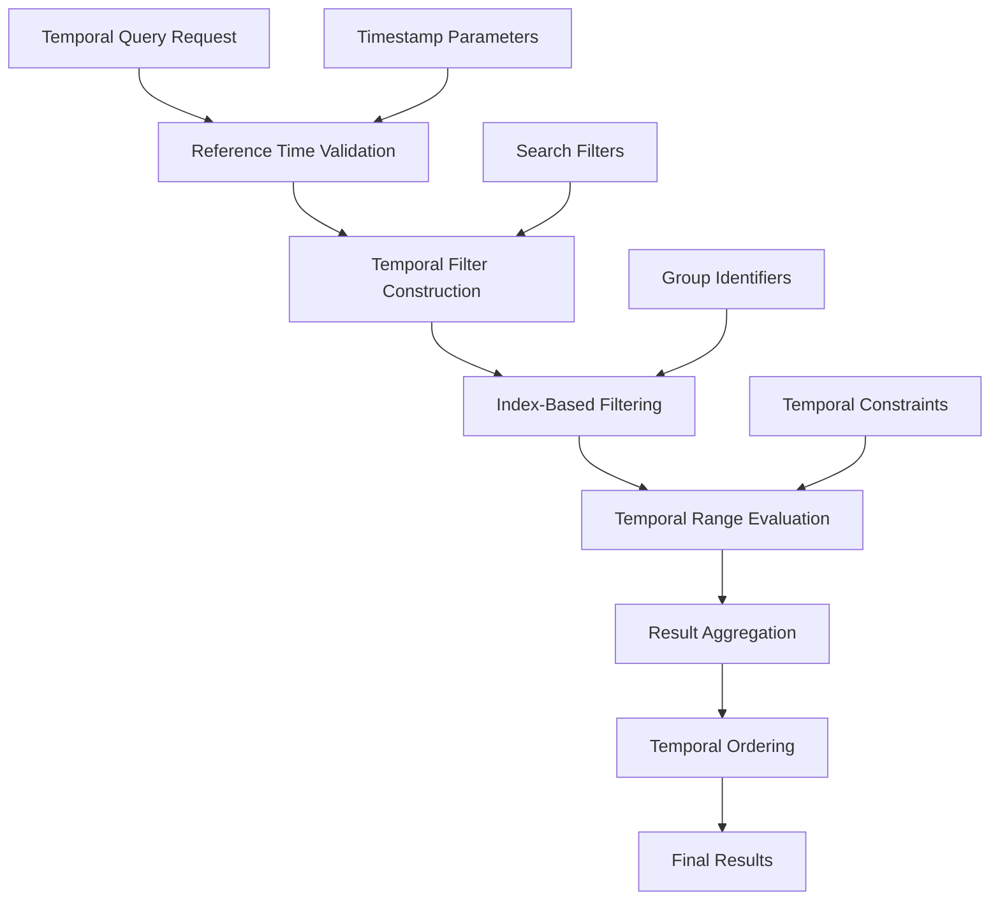
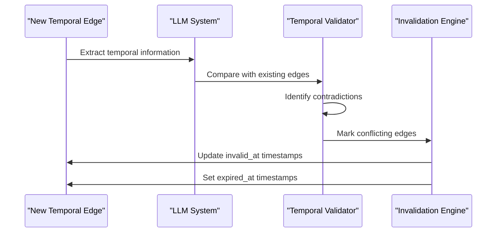
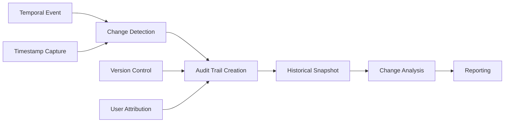
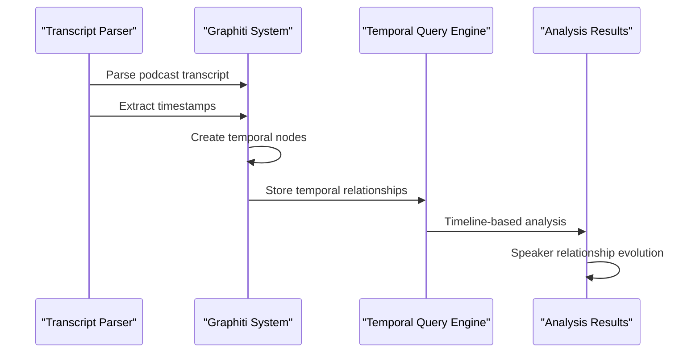
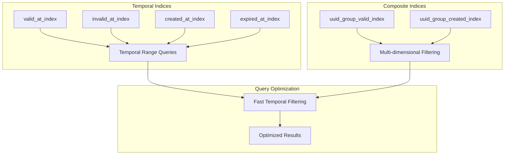
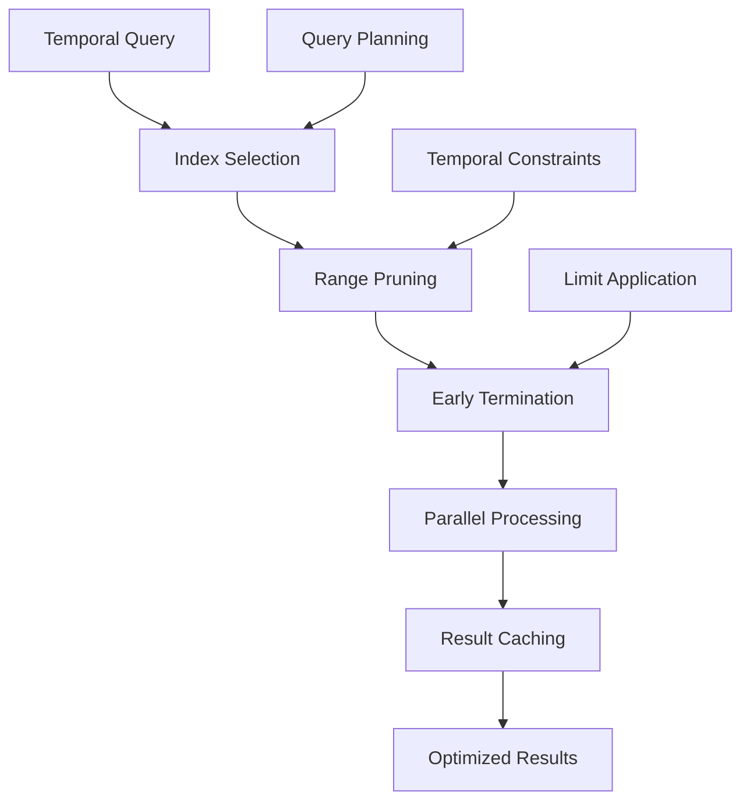

# Temporal Query Capabilities

<cite>
**Referenced Files in This Document**
- [temporal_operations.py](file://graphiti_core/utils/maintenance/temporal_operations.py)
- [podcast_runner.py](file://examples/podcast/podcast_runner.py)
- [transcript_parser.py](file://examples/podcast/transcript_parser.py)
- [graph_queries.py](file://graphiti_core/graph_queries.py)
- [edge_db_queries.py](file://graphiti_core/models/edges/edge_db_queries.py)
- [node_db_queries.py](file://graphiti_core/models/nodes/node_db_queries.py)
- [datetime_utils.py](file://graphiti_core/utils/datetime_utils.py)
- [search.py](file://graphiti_core/search/search.py)
- [search_filters.py](file://graphiti_core/search/search_filters.py)
- [search_config.py](file://graphiti_core/search/search_config.py)
- [search_utils.py](file://graphiti_core/search/search_utils.py)
- [graph_data_operations.py](file://graphiti_core/utils/maintenance/graph_data_operations.py)
- [edge_operations.py](file://graphiti_core/utils/maintenance/edge_operations.py)
- [test_temporal_operations_int.py](file://tests/utils/maintenance/test_temporal_operations_int.py)
</cite>

## Table of Contents
1. [Introduction](#introduction)
2. [Bi-Temporal Data Model](#bi-temporal-data-model)
3. [Temporal Query Architecture](#temporal-query-architecture)
4. [API Patterns for Historical Analysis](#api-patterns-for-historical-analysis)
5. [Temporal Edge Invalidation](#temporal-edge-invalidation)
6. [Auditing Changes Over Time](#auditing-changes-over-time)
7. [Podcast Analysis Use Case](#podcast-analysis-use-case)
8. [Indexing Strategies](#indexing-strategies)
9. [Performance Optimization](#performance-optimization)
10. [Common Pitfalls and Solutions](#common-pitfalls-and-solutions)
11. [Best Practices](#best-practices)
12. [Conclusion](#conclusion)

## Introduction

Graphiti's temporal query capabilities enable sophisticated historical analysis and timeline-based knowledge retrieval through a bi-temporal data model. This system allows users to query knowledge at specific points in time using both transaction time (when data was created) and valid time (when data was true) dimensions, providing unprecedented flexibility for temporal reasoning and historical analysis.

The temporal framework supports complex scenarios such as:
- Retrieving the state of nodes and relationships at arbitrary timestamps
- Auditing historical changes and relationship validity periods
- Performing timeline-based reasoning across evolving knowledge graphs
- Supporting temporal edge invalidation and conflict resolution
- Enabling efficient temporal indexing and query optimization

## Bi-Temporal Data Model

Graphiti implements a comprehensive bi-temporal data model that tracks two distinct time dimensions for all graph elements:

### Transaction Time (Creation and Expiration)
Transaction time captures when data was created and when it became obsolete in the system. This dimension tracks the lifecycle of graph elements within the database.

### Valid Time (Temporal Validity)
Valid time represents when the information described by the graph element was actually true or existed in reality. This dimension captures the temporal validity period of relationships and facts.



**Diagram sources**
- [temporal_operations.py](file://graphiti_core/utils/maintenance/temporal_operations.py#L33-L108)
- [search_filters.py](file://graphiti_core/search/search_filters.py#L44-L54)

**Section sources**
- [temporal_operations.py](file://graphiti_core/utils/maintenance/temporal_operations.py#L33-L108)
- [search_filters.py](file://graphiti_core/search/search_filters.py#L44-L54)

## Temporal Query Architecture

The temporal query system is built around several key components that work together to provide comprehensive temporal functionality:

### Query Execution Pipeline



**Diagram sources**
- [search.py](file://graphiti_core/search/search.py#L68-L183)
- [search_filters.py](file://graphiti_core/search/search_filters.py#L100-L251)

### Core Temporal Components

The temporal query system consists of several interconnected components:

1. **Temporal Filter Engine**: Processes temporal constraints and constructs appropriate query filters
2. **Time Zone Management**: Handles timezone conversions and ensures temporal consistency
3. **Index Utilization**: Leverages specialized temporal indices for optimal performance
4. **Result Reranking**: Applies temporal-aware reranking algorithms to prioritize relevant results

**Section sources**
- [search.py](file://graphiti_core/search/search.py#L68-L183)
- [search_filters.py](file://graphiti_core/search/search_filters.py#L100-L251)

## API Patterns for Historical Analysis

Graphiti provides several API patterns specifically designed for temporal analysis and historical retrieval:

### Basic Temporal Retrieval

The fundamental pattern for retrieving temporal data involves specifying a reference time and applying temporal filters:

```python
# Example: Retrieve episodes valid at a specific timestamp
reference_time = datetime(2024, 7, 30, 12, 0, 0, tzinfo=timezone.utc)
episodes = await client.retrieve_episodes(reference_time, last_n=5)

# Example: Search with temporal constraints
search_filters = SearchFilters(
    valid_at=[
        [DateFilter(date=reference_time, comparison_operator=ComparisonOperator.less_than_equal)]
    ],
    invalid_at=[
        [DateFilter(date=reference_time, comparison_operator=ComparisonOperator.greater_than)]
    ]
)
results = await client.search("customer relationships", search_filter=search_filters)
```

### Advanced Temporal Queries

For complex temporal analysis, Graphiti supports sophisticated query patterns:

```python
# Multi-temporal constraint query
temporal_filters = SearchFilters(
    valid_at=[
        [DateFilter(date=start_date, comparison_operator=ComparisonOperator.greater_than_equal)],
        [DateFilter(date=end_date, comparison_operator=ComparisonOperator.less_than_equal)]
    ],
    created_at=[
        [DateFilter(date=creation_start, comparison_operator=ComparisonOperator.greater_than_equal)]
    ]
)
```

### Temporal BFS Traversal

Graphiti supports breadth-first search with temporal constraints, enabling temporal reasoning across graph paths:

```python
# Temporal BFS with depth limitation
edges = await edge_bfs_search(
    driver,
    [starting_node_uuid],
    max_depth=3,
    search_filter=temporal_filters,
    group_ids=["temporal_group"]
)
```

**Section sources**
- [search.py](file://graphiti_core/search/search.py#L185-L519)
- [search_filters.py](file://graphiti_core/search/search_filters.py#L100-L251)

## Temporal Edge Invalidation

Graphiti implements sophisticated temporal edge invalidation mechanisms to handle conflicting temporal information and maintain graph consistency:

### Invalidation Detection Process



**Diagram sources**
- [temporal_operations.py](file://graphiti_core/utils/maintenance/temporal_operations.py#L74-L108)
- [edge_operations.py](file://graphiti_core/utils/maintenance/edge_operations.py#L413-L446)

### Invalidation Rules

The temporal invalidation system follows specific rules to resolve temporal conflicts:

1. **Temporal Precedence**: New edges with earlier valid times invalidate existing edges
2. **Overlap Resolution**: Partial overlaps trigger partial invalidation
3. **Conflict Detection**: LLM-powered analysis identifies contradictory temporal claims
4. **Graceful Degradation**: Existing edges remain valid until proven otherwise

**Section sources**
- [temporal_operations.py](file://graphiti_core/utils/maintenance/temporal_operations.py#L74-L108)
- [edge_operations.py](file://graphiti_core/utils/maintenance/edge_operations.py#L413-L446)

## Auditing Changes Over Time

Graphiti provides comprehensive auditing capabilities for tracking temporal changes and maintaining historical accountability:

### Change Tracking Mechanisms



### Audit Query Patterns

The system supports various audit query patterns for temporal analysis:

```python
# Query historical state at specific points in time
historical_state = await client.search(
    "past relationships",
    search_filter=SearchFilters(
        valid_at=[[DateFilter(date=past_timestamp, comparison_operator=ComparisonOperator.less_than_equal)]],
        invalid_at=[[DateFilter(date=past_timestamp, comparison_operator=ComparisonOperator.greater_than)]]
    )
)

# Track edge lifecycle
edge_history = await client.search(
    "relationship evolution",
    search_filter=SearchFilters(
        created_at=[[DateFilter(date=start_date, comparison_operator=ComparisonOperator.greater_than_equal)]],
        expired_at=[[DateFilter(date=end_date, comparison_operator=ComparisonOperator.less_than_equal)]]
    )
)
```

**Section sources**
- [search_filters.py](file://graphiti_core/search/search_filters.py#L100-L251)
- [search.py](file://graphiti_core/search/search.py#L68-L183)

## Podcast Analysis Use Case

The podcast analysis example demonstrates practical temporal query applications in real-world scenarios:

### Timeline-Based Speaker Relationship Analysis



**Diagram sources**
- [podcast_runner.py](file://examples/podcast/podcast_runner.py#L78-L129)
- [transcript_parser.py](file://examples/podcast/transcript_parser.py#L38-L125)

### Temporal Speaker Network Analysis

The podcast example shows how to analyze speaker relationships over time:

```python
# Process podcast messages with temporal context
messages = parse_podcast_messages()
for i, message in enumerate(messages[3:14]):
    # Retrieve relevant temporal context
    episodes = await client.retrieve_episodes(
        message.actual_timestamp, 3, group_ids=[group_id]
    )
    
    # Create temporal episode with precise timing
    await client.add_episode(
        name=f'Message {i}',
        episode_body=f'{message.speaker_name}: {message.content}',
        reference_time=message.actual_timestamp,
        source_description='Podcast Transcript',
        group_id=group_id,
        previous_episode_uuids=[episode.uuid for episode in episodes]
    )
```

### Timeline-Based Relationship Extraction

The system automatically extracts temporal relationships from conversational data:

```python
# Temporal relationship extraction from conversations
relationships = await client.search(
    "speaker interactions",
    search_filter=SearchFilters(
        valid_at=[[DateFilter(date=conversation_start, comparison_operator=ComparisonOperator.greater_than_equal)]],
        invalid_at=[[DateFilter(date=conversation_end, comparison_operator=ComparisonOperator.less_than)]]
    )
)
```

**Section sources**
- [podcast_runner.py](file://examples/podcast/podcast_runner.py#L78-L129)
- [transcript_parser.py](file://examples/podcast/transcript_parser.py#L38-L125)

## Indexing Strategies

Efficient temporal querying requires careful indexing strategies that leverage Graphiti's temporal capabilities:

### Temporal Index Architecture



**Diagram sources**
- [graph_queries.py](file://graphiti_core/graph_queries.py#L28-L69)

### Recommended Index Configurations

Graphiti provides optimized index configurations for different temporal query patterns:

| Index Type | Columns | Purpose | Performance Impact |
|------------|---------|---------|-------------------|
| `valid_at_index` | `valid_at` | Temporal range queries | High |
| `invalid_at_index` | `invalid_at` | Relationship expiration | Medium |
| `created_at_index` | `created_at` | Creation time filtering | Medium |
| `expired_at_index` | `expired_at` | Obsolescence tracking | Low |
| `uuid_group_valid_index` | `uuid, group_id, valid_at` | Multi-dimensional queries | Very High |

### Index Creation Commands

```python
# Create temporal indices for optimal performance
indices = get_range_indices(GraphProvider.NEO4J)
for index_query in indices:
    await driver.execute_query(index_query)

# Full-text indices for temporal content search
fulltext_indices = get_fulltext_indices(GraphProvider.NEO4J)
for index_query in fulltext_indices:
    await driver.execute_query(index_query)
```

**Section sources**
- [graph_queries.py](file://graphiti_core/graph_queries.py#L28-L69)

## Performance Optimization

Temporal queries can be computationally expensive, requiring specific optimization strategies:

### Query Optimization Techniques



### Performance Best Practices

1. **Temporal Range Narrowing**: Apply the most restrictive temporal filters first
2. **Index Utilization**: Ensure temporal indices are properly maintained
3. **Query Limiting**: Use appropriate limits to prevent excessive result sets
4. **Batch Processing**: Group temporal queries for better throughput

### Optimization Strategies

```python
# Optimized temporal query with early termination
search_config = SearchConfig(
    edge_config=EdgeSearchConfig(
        search_methods=[EdgeSearchMethod.cosine_similarity],
        reranker=EdgeReranker.rrf,
        sim_min_score=0.7  # Higher threshold reduces computation
    ),
    limit=10  # Reasonable limit for temporal queries
)

# Temporal query with range optimization
temporal_filters = SearchFilters(
    valid_at=[[DateFilter(date=recent_time, comparison_operator=ComparisonOperator.greater_than)]],
    created_at=[[DateFilter(date=recent_time, comparison_operator=ComparisonOperator.greater_than)]]
)
```

**Section sources**
- [search_config.py](file://graphiti_core/search/search_config.py#L80-L109)
- [search.py](file://graphiti_core/search/search.py#L68-L183)

## Common Pitfalls and Solutions

Understanding common temporal query pitfalls helps avoid performance issues and incorrect results:

### Time Zone Handling Issues

**Problem**: Inconsistent timezone handling leading to incorrect temporal comparisons

**Solution**: Always use UTC for temporal storage and conversion

```python
# Correct timezone handling
from graphiti_core.utils.datetime_utils import ensure_utc

# Convert all timestamps to UTC
reference_time = ensure_utc(datetime.now())
valid_at = ensure_utc(parsed_datetime)
```

### Timestamp Precision Problems

**Problem**: Insufficient timestamp precision causing temporal ambiguities

**Solution**: Use microsecond precision for all temporal operations

```python
# Ensure high precision timestamps
from datetime import datetime, timezone

# Create timestamps with microsecond precision
high_precision_time = datetime.now(timezone.utc).replace(microsecond=0)
```

### Temporal Boundary Conditions

**Problem**: Incorrect handling of temporal boundary conditions

**Solution**: Use appropriate comparison operators for temporal boundaries

```python
# Proper boundary handling
temporal_filters = SearchFilters(
    valid_at=[
        [DateFilter(date=boundary_time, comparison_operator=ComparisonOperator.less_than_equal)],  # Include boundary
        [DateFilter(date=boundary_time, comparison_operator=ComparisonOperator.greater_than)]      # Exclude boundary
    ]
)
```

### Memory Management in Large Temporal Queries

**Problem**: Memory exhaustion during large temporal result processing

**Solution**: Implement pagination and streaming for large temporal datasets

```python
# Paginated temporal query processing
async def process_large_temporal_dataset(start_time, end_time, batch_size=100):
    current_time = start_time
    while current_time < end_time:
        batch_filters = SearchFilters(
            valid_at=[[DateFilter(date=current_time, comparison_operator=ComparisonOperator.greater_than)]],
            created_at=[[DateFilter(date=current_time, comparison_operator=ComparisonOperator.less_than)]]
        )
        
        results = await client.search(query, search_filter=batch_filters, limit=batch_size)
        yield results
        
        current_time = max(current_time, max(r.created_at for r in results))
```

**Section sources**
- [datetime_utils.py](file://graphiti_core/utils/datetime_utils.py#L25-L56)
- [search_filters.py](file://graphiti_core/search/search_filters.py#L27-L42)

## Best Practices

Following established best practices ensures optimal temporal query performance and reliability:

### Temporal Data Modeling

1. **Consistent Timestamp Format**: Always use ISO 8601 format for temporal data
2. **Explicit Time Zones**: Specify time zones for all temporal data
3. **Granular Timestamps**: Use microsecond precision for temporal granularity
4. **Temporal Validation**: Validate temporal constraints before data insertion

### Query Design Patterns

1. **Early Filtering**: Apply temporal filters as early as possible in query execution
2. **Index Awareness**: Design queries to leverage temporal indices effectively
3. **Resource Management**: Implement proper resource cleanup for long-running queries
4. **Error Handling**: Include robust error handling for temporal query failures

### Monitoring and Maintenance

1. **Index Health**: Regularly monitor temporal index performance
2. **Query Profiling**: Profile temporal queries to identify bottlenecks
3. **Data Archiving**: Implement temporal data archiving strategies
4. **Backup Strategies**: Include temporal data in backup and recovery procedures

### Security Considerations

1. **Temporal Access Control**: Implement appropriate access controls for temporal data
2. **Audit Logging**: Maintain comprehensive audit logs for temporal changes
3. **Data Retention**: Establish appropriate data retention policies for temporal information
4. **Privacy Protection**: Ensure temporal data privacy compliance

## Conclusion

Graphiti's temporal query capabilities provide a powerful foundation for historical analysis and temporal reasoning in knowledge graphs. The bi-temporal data model, combined with sophisticated indexing strategies and optimization techniques, enables efficient querying of complex temporal relationships.

Key benefits of Graphiti's temporal system include:

- **Comprehensive Temporal Coverage**: Support for both transaction and valid time dimensions
- **Flexible Query Patterns**: Multiple API patterns for different temporal analysis needs
- **Performance Optimization**: Specialized indexing and query optimization techniques
- **Real-World Applications**: Proven use cases like podcast analysis demonstrate practical value
- **Scalable Architecture**: Designed to handle large-scale temporal datasets efficiently

The temporal query system continues to evolve with new features and optimizations, making it an essential tool for applications requiring historical analysis, temporal reasoning, and change tracking capabilities.