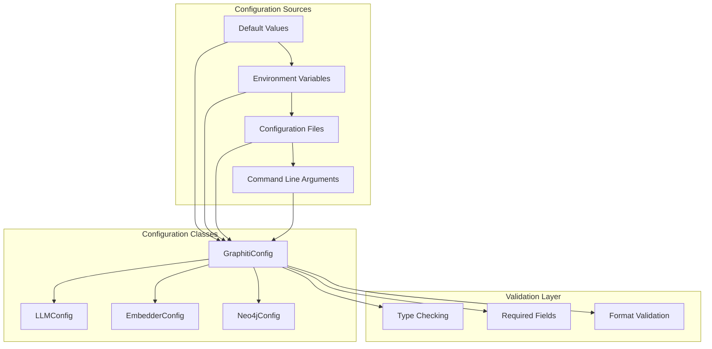
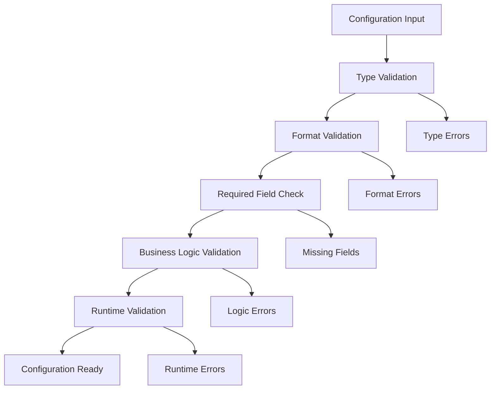

# Configuration and Environment Variables

<cite>
**Referenced Files in This Document**
- [graphiti_core/llm_client/config.py](file://graphiti_core/llm_client/config.py)
- [server/graph_service/config.py](file://server/graph_service/config.py)
- [graphiti_core/telemetry/telemetry.py](file://graphiti_core/telemetry/telemetry.py)
- [mcp_server/graphiti_mcp_server.py](file://mcp_server/graphiti_mcp_server.py)
- [mcp_server/docker-compose.yml](file://mcp_server/docker-compose.yml)
- [mcp_server/README.md](file://mcp_server/README.md)
- [pyproject.toml](file://pyproject.toml)
- [mcp_server/pyproject.toml](file://mcp_server/pyproject.toml)
</cite>

## Table of Contents
1. [Introduction](#introduction)
2. [Configuration Architecture](#configuration-architecture)
3. [Environment Variables](#environment-variables)
4. [Configuration Files](#configuration-files)
5. [LLM Provider Configuration](#llm-provider-configuration)
6. [Database Configuration](#database-configuration)
7. [Telemetry Configuration](#telemetry-configuration)
8. [Concurrency and Resource Limits](#concurrency-and-resource-limits)
9. [Security Best Practices](#security-best-practices)
10. [Configuration Validation](#configuration-validation)
11. [Deployment Scenarios](#deployment-scenarios)
12. [Troubleshooting](#troubleshooting)

## Introduction

Graphiti provides a comprehensive configuration system that supports multiple deployment scenarios through environment variables, configuration files, and programmatic configuration options. The framework is designed to be flexible and secure, supporting various LLM providers, database backends, and operational modes.

The configuration system follows a hierarchical precedence model where environment variables override default values, and command-line arguments override environment variables. This design enables seamless deployment across different environments while maintaining security best practices.

## Configuration Architecture

Graphiti's configuration system is built around several key components that work together to provide flexible and secure deployment options.



**Diagram sources**
- [mcp_server/graphiti_mcp_server.py](file://mcp_server/graphiti_mcp_server.py#L178-L503)
- [server/graph_service/config.py](file://server/graph_service/config.py#L9-L26)

**Section sources**
- [mcp_server/graphiti_mcp_server.py](file://mcp_server/graphiti_mcp_server.py#L178-L503)
- [server/graph_service/config.py](file://server/graph_service/config.py#L9-L26)

## Environment Variables

Graphiti supports extensive environment variable configuration for all major components. The environment variable system follows standard conventions and provides sensible defaults.

### Core Environment Variables

| Variable | Description | Default | Required |
|----------|-------------|---------|----------|
| `OPENAI_API_KEY` | OpenAI API authentication key | None | Yes* |
| `MODEL_NAME` | Primary LLM model identifier | `gpt-4.1-mini` | No |
| `SMALL_MODEL_NAME` | Secondary LLM model for simple tasks | `gpt-4.1-nano` | No |
| `LLM_TEMPERATURE` | LLM response randomness (0.0-2.0) | `0.0` | No |
| `NEO4J_URI` | Neo4j database connection URI | `bolt://localhost:7687` | No |
| `NEO4J_USER` | Neo4j username | `neo4j` | No |
| `NEO4J_PASSWORD` | Neo4j password | `demodemo` | No |
| `SEMAPHORE_LIMIT` | Concurrent operation limit | `10` | No |

*Required for LLM operations, but can be bypassed for embedding-only configurations

### Azure OpenAI Configuration

| Variable | Description | Default | Required |
|----------|-------------|---------|----------|
| `AZURE_OPENAI_ENDPOINT` | Azure OpenAI service endpoint | None | Conditional |
| `AZURE_OPENAI_DEPLOYMENT_NAME` | Primary deployment identifier | None | Conditional |
| `AZURE_OPENAI_API_VERSION` | API version specification | None | No |
| `AZURE_OPENAI_EMBEDDING_API_KEY` | Separate embedding API key | Same as `OPENAI_API_KEY` | No |
| `AZURE_OPENAI_EMBEDDING_ENDPOINT` | Separate embedding endpoint | Same as `AZURE_OPENAI_ENDPOINT` | No |
| `AZURE_OPENAI_EMBEDDING_DEPLOYMENT_NAME` | Separate embedding deployment | Same as `AZURE_OPENAI_DEPLOYMENT_NAME` | Conditional |
| `AZURE_OPENAI_EMBEDDING_API_VERSION` | Separate embedding API version | Same as `AZURE_OPENAI_API_VERSION` | No |
| `AZURE_OPENAI_USE_MANAGED_IDENTITY` | Use Azure managed identities | `false` | No |

### Advanced Configuration Variables

| Variable | Description | Default | Range |
|----------|-------------|---------|-------|
| `OPENAI_BASE_URL` | Custom OpenAI-compatible endpoint | None | URL format |
| `EMBEDDING_MODEL_NAME` | Embedding model identifier | `text-embedding-3-small` | Model name |
| `GROUP_ID` | Namespace for graph isolation | `default` | String |
| `USE_CUSTOM_ENTITIES` | Enable custom entity extraction | `false` | Boolean |
| `DESTROY_GRAPH` | Clear graph data on startup | `false` | Boolean |

**Section sources**
- [mcp_server/graphiti_mcp_server.py](file://mcp_server/graphiti_mcp_server.py#L197-L250)
- [mcp_server/graphiti_mcp_server.py](file://mcp_server/graphiti_mcp_server.py#L370-L400)
- [mcp_server/README.md](file://mcp_server/README.md#L83-L104)

## Configuration Files

Graphiti supports configuration through multiple file formats and locations, providing flexibility for different deployment scenarios.

### .env File Configuration

The primary configuration method uses a `.env` file located in the project root directory. This file follows standard dotenv format:

```bash
# Required for LLM operations
OPENAI_API_KEY=your_openai_api_key_here
MODEL_NAME=gpt-4.1-mini
SMALL_MODEL_NAME=gpt-4.1-nano

# Optional: Custom OpenAI-compatible endpoints
OPENAI_BASE_URL=https://api.openai.com/v1

# Database configuration
NEO4J_URI=bolt://localhost:7687
NEO4J_USER=neo4j
NEO4J_PASSWORD=your_password

# Advanced settings
LLM_TEMPERATURE=0.0
SEMAPHORE_LIMIT=10
GROUP_ID=default
USE_CUSTOM_ENTITIES=false
```

### Docker Compose Configuration

For containerized deployments, Graphiti provides comprehensive Docker Compose support with environment variable management:

```yaml
services:
  neo4j:
    image: neo4j:5.26.0
    environment:
      - NEO4J_AUTH=${NEO4J_USER:-neo4j}/${NEO4J_PASSWORD:-demodemo}
      - NEO4J_server_memory_heap_initial__size=512m
      - NEO4J_server_memory_heap_max__size=1G
      - NEO4J_server_memory_pagecache_size=512m

  graphiti-mcp:
    image: zepai/knowledge-graph-mcp:latest
    env_file:
      - path: .env
        required: false
    environment:
      - NEO4J_URI=${NEO4J_URI:-bolt://neo4j:7687}
      - NEO4J_USER=${NEO4J_USER:-neo4j}
      - NEO4J_PASSWORD=${NEO4J_PASSWORD:-demodemo}
      - OPENAI_API_KEY=${OPENAI_API_KEY}
      - MODEL_NAME=${MODEL_NAME}
      - SEMAPHORE_LIMIT=${SEMAPHORE_LIMIT:-10}
```

**Section sources**
- [mcp_server/docker-compose.yml](file://mcp_server/docker-compose.yml#L27-L40)
- [mcp_server/README.md](file://mcp_server/README.md#L144-L167)

## LLM Provider Configuration

Graphiti supports multiple LLM providers through a unified configuration interface. The system automatically detects provider type based on configuration parameters.

### OpenAI Configuration

Standard OpenAI configuration for primary and secondary models:

```python
# Configuration example
llm_config = GraphitiLLMConfig(
    api_key=os.environ.get('OPENAI_API_KEY'),
    model=os.environ.get('MODEL_NAME', 'gpt-4.1-mini'),
    small_model=os.environ.get('SMALL_MODEL_NAME', 'gpt-4.1-nano'),
    temperature=float(os.environ.get('LLM_TEMPERATURE', '0.0'))
)
```

### Azure OpenAI Configuration

Azure OpenAI requires additional deployment-specific configuration:

```python
# Azure OpenAI configuration
azure_llm_config = GraphitiLLMConfig(
    azure_openai_endpoint=os.environ.get('AZURE_OPENAI_ENDPOINT'),
    azure_openai_deployment_name=os.environ.get('AZURE_OPENAI_DEPLOYMENT_NAME'),
    azure_openai_api_version=os.environ.get('AZURE_OPENAI_API_VERSION'),
    api_key=os.environ.get('OPENAI_API_KEY'),  # Or use managed identity
    model=os.environ.get('MODEL_NAME', 'gpt-4.1-mini')
)
```

### Authentication Methods

Graphiti supports multiple authentication methods for LLM providers:

1. **API Key Authentication**: Standard API key-based authentication
2. **Managed Identity**: Azure managed identity for secure authentication
3. **Custom Endpoints**: Support for OpenAI-compatible endpoints

**Section sources**
- [mcp_server/graphiti_mcp_server.py](file://mcp_server/graphiti_mcp_server.py#L205-L250)
- [mcp_server/graphiti_mcp_server.py](file://mcp_server/graphiti_mcp_server.py#L241-L290)

## Database Configuration

Graphiti supports multiple graph database backends through a unified configuration interface. The database configuration is handled through the Neo4jConfig class.

### Neo4j Configuration

Standard Neo4j configuration with connection pooling and SSL support:

```python
# Neo4j configuration
neo4j_config = Neo4jConfig(
    uri=os.environ.get('NEO4J_URI', 'bolt://localhost:7687'),
    user=os.environ.get('NEO4J_USER', 'neo4j'),
    password=os.environ.get('NEO4J_PASSWORD', 'demodemo')
)
```

### Supported Database Backends

| Backend | Configuration | Notes |
|---------|---------------|-------|
| Neo4j | Bolt protocol | Primary supported backend |
| FalkorDB | Redis protocol | Lightweight alternative |
| Kuzu | Native storage | Embedded option |
| Amazon Neptune | HTTP/HTTPS | Cloud-native option |

### Connection Parameters

The database configuration supports various connection parameters:

- **URI Format**: `bolt://hostname:port` or `neo4j://hostname:port`
- **Authentication**: Username/password or custom authentication
- **SSL/TLS**: Secure connection support
- **Connection Pooling**: Automatic connection management

**Section sources**
- [mcp_server/graphiti_mcp_server.py](file://mcp_server/graphiti_mcp_server.py#L452-L466)
- [server/graph_service/config.py](file://server/graph_service/config.py#L14-L16)

## Telemetry Configuration

Graphiti includes optional telemetry collection for product improvement and usage analytics. The telemetry system is designed to be privacy-conscious and easily disabled.

### Telemetry Control

Telemetry is controlled through the `GRAPHITI_TELEMETRY_ENABLED` environment variable:

```python
# Telemetry configuration
TELEMETRY_ENV_VAR = 'GRAPHITI_TELEMETRY_ENABLED'

# Check if telemetry is enabled
def is_telemetry_enabled() -> bool:
    env_value = os.environ.get(TELEMETRY_ENV_VAR, 'true').lower()
    return env_value in ('true', '1', 'yes', 'on')
```

### Telemetry Features

The telemetry system collects anonymous usage statistics including:

- **Installation metrics**: Version information and architecture
- **Usage patterns**: Feature adoption and frequency
- **Performance data**: Query latencies and operation counts
- **Error reporting**: Non-sensitive error patterns

### Privacy Controls

- **Opt-out capability**: Easy disable through environment variable
- **Anonymous data**: No personally identifiable information collected
- **Minimal footprint**: Disabled by default in testing environments
- **PostHog integration**: Uses publicly available PostHog keys

**Section sources**
- [graphiti_core/telemetry/telemetry.py](file://graphiti_core/telemetry/telemetry.py#L29-L37)
- [graphiti_core/telemetry/telemetry.py](file://graphiti_core/telemetry/telemetry.py#L76-L118)

## Concurrency and Resource Limits

Graphiti implements sophisticated concurrency controls to optimize performance while preventing rate limit errors from LLM providers.

### Semaphore Configuration

The `SEMAPHORE_LIMIT` environment variable controls concurrent operation limits:

```python
# Default semaphore limit
SEMAPHORE_LIMIT = int(os.getenv('SEMAPHORE_LIMIT', 10))

# Usage in processing pipeline
semaphore = asyncio.Semaphore(SEMAPHORE_LIMIT)
```

### Concurrency Guidelines

| Scenario | Recommended Limit | Reason |
|----------|------------------|--------|
| Production | 5-10 | Prevent rate limits, balanced throughput |
| Development | 1-3 | Debugging, lower resource usage |
| High-throughput | 20-50 | Maximize performance, monitor rates |
| Rate-limited | 1-5 | Avoid 429 errors, conservative approach |

### Rate Limit Management

The concurrency system helps manage LLM provider rate limits:

- **Automatic throttling**: Prevents exceeding provider limits
- **Backpressure handling**: Slows processing when limits approached
- **Resource optimization**: Balances performance and stability

### Monitoring Concurrency Issues

Common indicators of concurrency problems:

- **429 Rate Limit Errors**: Reduce `SEMAPHORE_LIMIT`
- **Timeout Errors**: Check resource availability
- **Memory Issues**: Monitor system resources

**Section sources**
- [mcp_server/graphiti_mcp_server.py](file://mcp_server/graphiti_mcp_server.py#L45-L48)
- [mcp_server/README.md](file://mcp_server/README.md#L131-L136)

## Security Best Practices

Graphiti implements several security measures for managing sensitive configuration data.

### Credential Management

1. **Environment Variables**: Store secrets in environment variables
2. **Dotenv Files**: Use `.env` files with proper `.gitignore` configuration
3. **Secret Rotation**: Regular rotation of API keys and credentials
4. **Access Control**: Restrict file permissions on configuration files

### Configuration Security

```bash
# Secure .env file permissions
chmod 600 .env
chmod 700 .env.example

# Add to .gitignore
echo ".env" >> .gitignore
```

### Provider-Specific Security

#### OpenAI Security
- **API Key Protection**: Never commit API keys to version control
- **Key Scoping**: Use least-privilege API keys
- **Monitoring**: Monitor API usage for anomalies

#### Azure OpenAI Security
- **Managed Identity**: Prefer managed identity over API keys
- **Network Security**: Use private endpoints and VNet integration
- **Key Vault Integration**: Store secrets in Azure Key Vault

#### Database Security
- **Connection Encryption**: Use TLS for database connections
- **Network Isolation**: Deploy databases in private networks
- **Access Logging**: Monitor database access patterns

### Validation and Sanitization

Graphiti includes built-in validation for configuration parameters:

- **Type checking**: Ensures correct data types
- **Range validation**: Validates numeric parameters
- **Format verification**: Checks URL and string formats
- **Required field checking**: Ensures mandatory parameters

**Section sources**
- [mcp_server/graphiti_mcp_server.py](file://mcp_server/graphiti_mcp_server.py#L205-L250)
- [mcp_server/graphiti_mcp_server.py](file://mcp_server/graphiti_mcp_server.py#L370-L400)

## Configuration Validation

Graphiti implements comprehensive validation mechanisms to ensure configuration correctness and prevent runtime errors.

### Validation Layers



### Validation Mechanisms

#### Pydantic-Based Validation
The server configuration uses Pydantic for robust validation:

```python
class Settings(BaseSettings):
    openai_api_key: str
    openai_base_url: str | None = Field(None)
    model_name: str | None = Field(None)
    embedding_model_name: str | None = Field(None)
    neo4j_uri: str
    neo4j_user: str
    neo4j_password: str
    
    model_config = SettingsConfigDict(env_file='.env', extra='ignore')
```

#### Custom Validation Functions
Additional validation for complex configurations:

```python
def validate_excluded_entity_types(
    excluded_entity_types: list[str] | None, 
    entity_types: dict[str, type[BaseModel]] | None = None
) -> bool:
    """Validate excluded entity types against available types"""
    # Implementation details in source code
```

### Error Handling

Configuration errors are handled gracefully with informative messages:

- **Missing Required Fields**: Clear indication of missing parameters
- **Invalid Formats**: Specific error messages for format violations
- **Type Mismatches**: Detailed type conversion errors
- **Business Logic Violations**: Explanation of logical constraint violations

### Validation Testing

Graphiti includes comprehensive validation tests:

- **Unit tests**: Individual component validation
- **Integration tests**: End-to-end configuration testing
- **Edge case testing**: Boundary condition validation

**Section sources**
- [server/graph_service/config.py](file://server/graph_service/config.py#L9-L26)
- [graphiti_core/helpers.py](file://graphiti_core/helpers.py#L145-L176)

## Deployment Scenarios

Graphiti supports various deployment scenarios with specific configuration recommendations.

### Development Environment

```bash
# Development .env file
OPENAI_API_KEY=sk-dev-test-key
MODEL_NAME=gpt-4.1-mini
SMALL_MODEL_NAME=gpt-4.1-nano
NEO4J_URI=bolt://localhost:7687
NEO4J_USER=neo4j
NEO4J_PASSWORD=demodemo
LLM_TEMPERATURE=0.1
SEMAPHORE_LIMIT=3
GROUP_ID=development
```

### Production Environment

```bash
# Production .env file
OPENAI_API_KEY=${OPENAI_API_KEY}
MODEL_NAME=gpt-4-turbo
SMALL_MODEL_NAME=gpt-4.1-mini
NEO4J_URI=${NEO4J_URI}
NEO4J_USER=${NEO4J_USER}
NEO4J_PASSWORD=${NEO4J_PASSWORD}
LLM_TEMPERATURE=0.0
SEMAPHORE_LIMIT=10
GROUP_ID=production
USE_CUSTOM_ENTITIES=true
TELEMETRY_ENV_VAR=false
```

### Containerized Deployment

```yaml
# docker-compose.production.yml
version: '3.8'
services:
  graphiti:
    image: graphiti:production
    env_file:
      - .env.production
    environment:
      - PYTHONPATH=/app
    volumes:
      - ./config:/app/config
    restart: unless-stopped
```

### Multi-Provider Configuration

```bash
# Multi-provider setup
OPENAI_API_KEY=${OPENAI_API_KEY}
ANTHROPIC_API_KEY=${ANTHROPIC_API_KEY}
GOOGLE_API_KEY=${GOOGLE_API_KEY}

# Primary provider
MODEL_NAME=gpt-4-turbo
SMALL_MODEL_NAME=gpt-4.1-mini

# Fallback providers
ALTERNATIVE_MODEL=claude-3-sonnet
GOOGLE_MODEL=gemini-pro
```

### High-Availability Configuration

```bash
# HA configuration
NEO4J_URI=bolt://neo4j-cluster:7687
NEO4J_USER=${NEO4J_USER}
NEO4J_PASSWORD=${NEO4J_PASSWORD}
SEMAPHORE_LIMIT=20
LLM_TEMPERATURE=0.0
GROUP_ID=${HOSTNAME}
USE_CUSTOM_ENTITIES=true
```

**Section sources**
- [mcp_server/docker-compose.yml](file://mcp_server/docker-compose.yml#L27-L40)
- [mcp_server/README.md](file://mcp_server/README.md#L144-L176)

## Troubleshooting

Common configuration issues and their solutions.

### Authentication Problems

**Issue**: `OPENAI_API_KEY` not recognized
**Solution**: 
- Verify API key format (should start with `sk-`)
- Check environment variable loading
- Ensure no trailing whitespace

**Issue**: Azure OpenAI authentication failure
**Solution**:
- Verify `AZURE_OPENAI_DEPLOYMENT_NAME` is set
- Check managed identity permissions if using managed identity
- Validate endpoint URL format

### Database Connection Issues

**Issue**: Neo4j connection refused
**Solution**:
- Verify Neo4j service is running
- Check URI format and port
- Validate credentials
- Review firewall settings

**Issue**: Connection timeouts
**Solution**:
- Increase connection timeout values
- Check network connectivity
- Verify database resource availability

### LLM Provider Issues

**Issue**: Rate limit errors (429)
**Solution**:
- Reduce `SEMAPHORE_LIMIT`
- Implement exponential backoff
- Consider upgrading LLM provider tier

**Issue**: Model not found errors
**Solution**:
- Verify model name spelling
- Check model availability in region
- Use fallback model configuration

### Configuration Validation Errors

**Issue**: Missing required fields
**Solution**:
- Review required environment variables
- Check `.env` file syntax
- Verify variable names match expectations

**Issue**: Type conversion errors
**Solution**:
- Check data types of environment variables
- Convert numeric values to appropriate formats
- Validate boolean values (true/false, yes/no, 1/0)

### Performance Issues

**Issue**: Slow query performance
**Solution**:
- Increase `SEMAPHORE_LIMIT` cautiously
- Optimize database indexing
- Review query patterns
- Monitor system resources

**Issue**: Memory consumption
**Solution**:
- Reduce `SEMAPHORE_LIMIT`
- Implement connection pooling
- Monitor garbage collection
- Review data retention policies

### Debugging Configuration

Enable debug logging for configuration issues:

```bash
export DEBUG=true
export LOG_LEVEL=DEBUG
```

Use configuration validation scripts to test settings before deployment.

**Section sources**
- [mcp_server/graphiti_mcp_server.py](file://mcp_server/graphiti_mcp_server.py#L223-L232)
- [mcp_server/graphiti_mcp_server.py](file://mcp_server/graphiti_mcp_server.py#L243-L245)