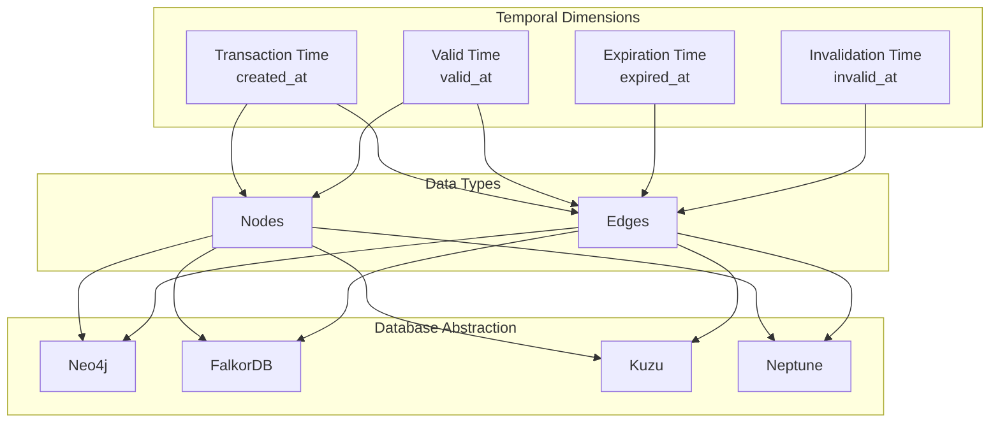
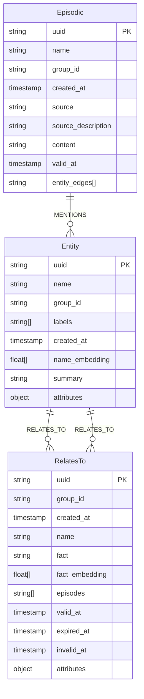
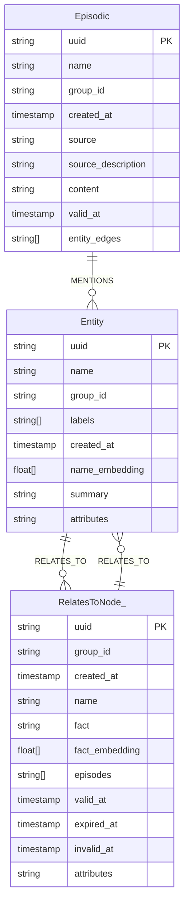
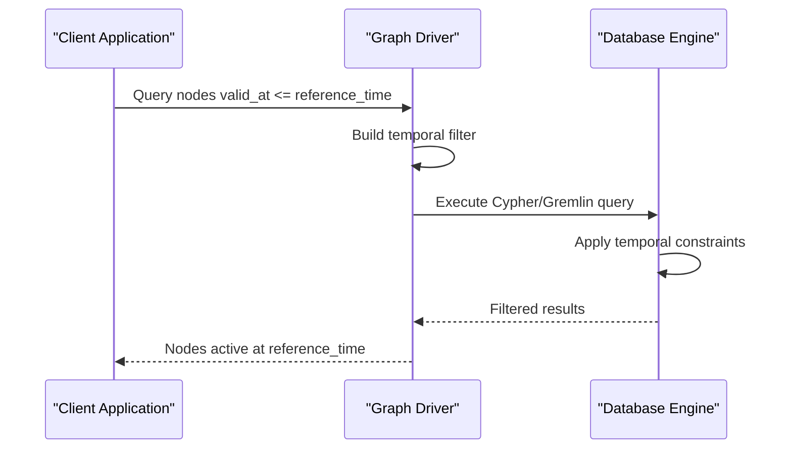
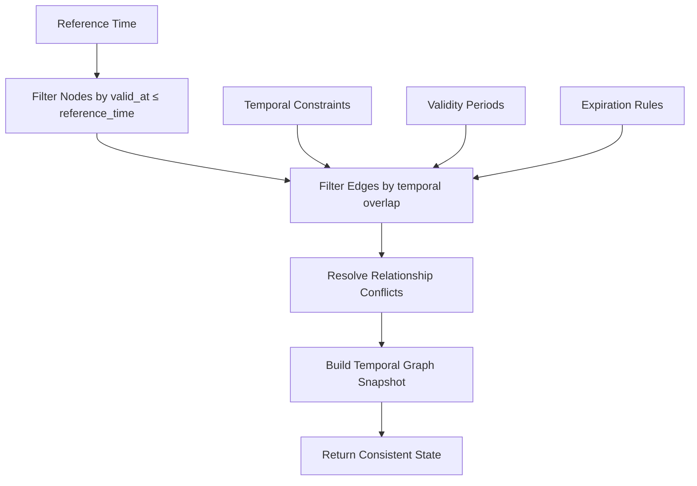
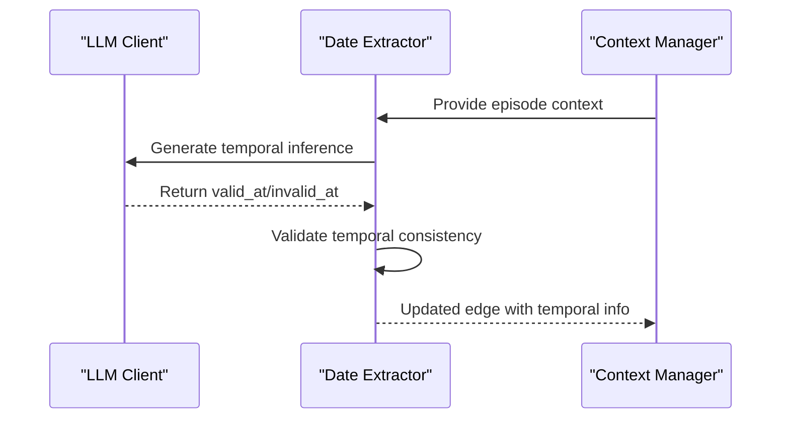

# Bi-temporal Data Modeling

<cite>
**Referenced Files in This Document**
- [node_db_queries.py](file://graphiti_core/models/nodes/node_db_queries.py)
- [edge_db_queries.py](file://graphiti_core/models/edges/edge_db_queries.py)
- [temporal_operations.py](file://graphiti_core/utils/maintenance/temporal_operations.py)
- [nodes.py](file://graphiti_core/nodes.py)
- [edges.py](file://graphiti_core/edges.py)
- [neo4j_driver.py](file://graphiti_core/driver/neo4j_driver.py)
- [falkordb_driver.py](file://graphiti_core/driver/falkordb_driver.py)
- [kuzu_driver.py](file://graphiti_core/driver/kuzu_driver.py)
- [neptune_driver.py](file://graphiti_core/driver/neptune_driver.py)
- [quickstart_neo4j.py](file://examples/quickstart/quickstart_neo4j.py)
- [test_temporal_operations_int.py](file://tests/utils/maintenance/test_temporal_operations_int.py)
</cite>

## Table of Contents
1. [Introduction](#introduction)
2. [Temporal Data Architecture Overview](#temporal-data-architecture-overview)
3. [Temporal Fields and Their Significance](#temporal-fields-and-their-significance)
4. [Database Schema Across Graph Databases](#database-schema-across-graph-databases)
5. [Temporal Query Implementation](#temporal-query-implementation)
6. [Point-in-Time Graph Reconstruction](#point-in-time-graph-reconstruction)
7. [Temporal Data Ingestion and Processing](#temporal-data-ingestion-and-processing)
8. [Performance Considerations](#performance-considerations)
9. [Common Issues and Solutions](#common-issues-and-solutions)
10. [Practical Examples](#practical-examples)
11. [Conclusion](#conclusion)

## Introduction

Graphiti implements a sophisticated bi-temporal data architecture that tracks both when data was recorded in the system (transaction time) and when facts were true in the real world (valid time). This dual-temporal approach enables powerful historical reasoning capabilities, allowing applications to reconstruct graph states at any point in time and maintain accurate representations of evolving knowledge.

The bi-temporal model addresses fundamental challenges in knowledge graphs:
- **Temporal Consistency**: Maintaining accurate representations of facts as they change over time
- **Historical Reasoning**: Enabling queries that understand the evolution of relationships
- **Audit Trails**: Providing complete provenance for all data changes
- **Time Travel Queries**: Supporting queries that explore the graph's state at arbitrary points in time

## Temporal Data Architecture Overview

The bi-temporal architecture in Graphiti is built around four core temporal fields that track different aspects of data lifecycle:



**Diagram sources**
- [nodes.py](file://graphiti_core/nodes.py#L88-L96)
- [edges.py](file://graphiti_core/edges.py#L221-L241)

**Section sources**
- [nodes.py](file://graphiti_core/nodes.py#L88-L96)
- [edges.py](file://graphiti_core/edges.py#L221-L241)

## Temporal Fields and Their Significance

### Transaction Time Fields

**created_at**: Automatically generated timestamp indicating when data was recorded in the system. This field serves as the foundation for all temporal tracking and ensures chronological ordering of data modifications.

### Validity Period Fields

**valid_at**: The timestamp when the fact represented by the node or edge became true in the real world. For episodic nodes, this corresponds to the creation timestamp of the original document. For entity edges, it marks when the relationship became valid.

**expired_at**: The timestamp when the fact was superseded by newer information. This field is particularly important for edges, marking when a relationship changed or became obsolete.

**invalid_at**: The timestamp when the fact ceased to be true in the real world. This field enables the representation of temporary relationships and factual changes over time.

### Field Interactions and Constraints

The temporal fields work together to define precise validity periods:

- **Open-ended periods**: When `expired_at` or `invalid_at` is null, the fact is considered current and valid
- **Closed periods**: When both `valid_at` and `expired_at`/`invalid_at` are present, the fact has a defined lifespan
- **Temporal precedence**: `valid_at` ≤ `expired_at` ≤ `invalid_at` (when both are defined)

**Section sources**
- [nodes.py](file://graphiti_core/nodes.py#L299-L305)
- [edges.py](file://graphiti_core/edges.py#L229-L237)

## Database Schema Across Graph Databases

Graphiti supports four major graph databases, each with specific temporal schema implementations:

### Neo4j Schema

Neo4j uses native property storage with automatic timestamp conversion:



**Diagram sources**
- [node_db_queries.py](file://graphiti_core/models/nodes/node_db_queries.py#L22-L58)
- [edge_db_queries.py](file://graphiti_core/models/edges/edge_db_queries.py#L63-L121)

### FalkorDB Schema

FalkorDB employs a simplified schema with vector embeddings stored as arrays:

| Property | Type | Purpose |
|----------|------|---------|
| uuid | STRING | Primary key identifier |
| name | STRING | Human-readable name |
| group_id | STRING | Partitioning key |
| created_at | TIMESTAMP | Transaction timestamp |
| valid_at | TIMESTAMP | Fact validity start |
| name_embedding | FLOAT[] | Vector embedding |

### Kuzu Schema

Kuzu requires explicit schema definition with specialized edge representation:



**Diagram sources**
- [kuzu_driver.py](file://graphiti_core/driver/kuzu_driver.py#L26-L90)

### Neptune Schema

Neptune combines Gremlin graph queries with OpenSearch full-text search:

| Component | Technology | Purpose |
|-----------|------------|---------|
| Graph Storage | Gremlin | Temporal graph structure |
| Full-text Search | OpenSearch | Content and metadata search |
| Vector Search | OpenSearch | Semantic similarity |

**Section sources**
- [kuzu_driver.py](file://graphiti_core/driver/kuzu_driver.py#L26-L90)
- [neptune_driver.py](file://graphiti_core/driver/neptune_driver.py#L32-L106)

## Temporal Query Implementation

Graphiti implements sophisticated temporal query capabilities across all supported databases:

### Node Temporal Queries

Node queries utilize the `valid_at` field to filter nodes active at specific times:



**Diagram sources**
- [node_db_queries.py](file://graphiti_core/models/nodes/node_db_queries.py#L334-L342)

### Edge Temporal Queries

Edge queries combine multiple temporal conditions for precise relationship filtering:

| Query Type | Conditions | Purpose |
|------------|------------|---------|
| Current Edges | `expired_at IS NULL AND invalid_at IS NULL` | Active relationships |
| Historical Edges | `valid_at <= reference_time AND (expired_at > reference_time OR invalid_at > reference_time)` | Relationships at point in time |
| Closed Edges | `expired_at IS NOT NULL OR invalid_at IS NOT NULL` | Superseded relationships |

### Database-Specific Implementations

Each database handles temporal queries differently:

**Neo4j**: Native Cypher queries with temporal predicates
**FalkorDB**: Redisearch syntax with temporal field indexing
**Kuzu**: SQL-like queries with explicit schema constraints
**Neptune**: Gremlin queries with temporal property filtering

**Section sources**
- [node_db_queries.py](file://graphiti_core/models/nodes/node_db_queries.py#L334-L408)
- [edge_db_queries.py](file://graphiti_core/models/edges/edge_db_queries.py#L320-L367)

## Point-in-Time Graph Reconstruction

Graphiti's temporal architecture enables sophisticated point-in-time graph reconstruction, allowing applications to understand the graph's state at any moment in history.

### Reconstruction Process



**Diagram sources**
- [temporal_operations.py](file://graphiti_core/utils/maintenance/temporal_operations.py#L33-L71)

### Historical Reasoning Capabilities

The temporal model supports several advanced reasoning patterns:

**Relationship Evolution**: Track how relationships change over time
**Factual Accuracy**: Understand when facts were true versus when they were recorded
**Provenance Tracking**: Trace the origin and evolution of all graph data
**Conflict Resolution**: Handle contradictory information from different time periods

**Section sources**
- [temporal_operations.py](file://graphiti_core/utils/maintenance/temporal_operations.py#L33-L71)

## Temporal Data Ingestion and Processing

Graphiti automates temporal data ingestion through its extraction pipeline, which automatically infers temporal information from unstructured content.

### Edge Date Extraction

The system uses LLM-based reasoning to extract temporal information:



**Diagram sources**
- [temporal_operations.py](file://graphiti_core/utils/maintenance/temporal_operations.py#L33-L71)

### Temporal Validation

The system validates temporal consistency during ingestion:

- **Chronological ordering**: Ensures temporal fields follow logical sequences
- **Overlap detection**: Identifies conflicting temporal periods
- **Gap analysis**: Detects missing temporal coverage
- **Contradiction resolution**: Uses LLM to resolve conflicting temporal claims

**Section sources**
- [temporal_operations.py](file://graphiti_core/utils/maintenance/temporal_operations.py#L33-L108)

## Performance Considerations

### Temporal Indexing Strategies

Effective temporal indexing is crucial for query performance:

**Composite Indexes**: Combine temporal fields with frequently queried properties
**Range Queries**: Optimize for temporal range scans commonly used in point-in-time queries
**Partitioning**: Use temporal partitioning for large datasets
**Caching**: Implement temporal result caching for frequently accessed time slices

### Query Optimization

Temporal queries benefit from specific optimization techniques:

- **Early Filtering**: Apply temporal constraints early in query execution
- **Index Utilization**: Leverage temporal indexes for efficient range queries
- **Batch Processing**: Process temporal data in batches for large-scale operations
- **Memory Management**: Optimize memory usage for temporal result sets

### Database-Specific Optimizations

Different databases offer unique optimization opportunities:

**Neo4j**: Cypher query hints and index statistics
**FalkorDB**: Redisearch index optimization
**Kuzu**: Schema-aware query planning
**Neptune**: Gremlin query optimization

## Common Issues and Solutions

### Temporal Gaps

**Problem**: Missing temporal coverage creates gaps in historical accuracy
**Solution**: Implement gap detection algorithms and automatic filling strategies

### Overlapping Validity Periods

**Problem**: Conflicting temporal periods cause ambiguity
**Solution**: Use LLM-based conflict resolution and temporal precedence rules

### Temporal Drift

**Problem**: Temporal fields become inconsistent over time
**Solution**: Implement automated temporal validation and correction mechanisms

### Performance Degradation

**Problem**: Large temporal datasets slow down queries
**Solution**: Implement temporal partitioning and query optimization strategies

**Section sources**
- [test_temporal_operations_int.py](file://tests/utils/maintenance/test_temporal_operations_int.py#L94-L200)

## Practical Examples

### Basic Temporal Query

```python
# Query nodes active at a specific point in time
reference_time = datetime.now(timezone.utc)
active_nodes = await graphiti.retrieve_episodes(
    reference_time=reference_time,
    last_n=100
)
```

### Historical Relationship Analysis

```python
# Find relationships that existed between two dates
historical_edges = await graphiti.search(
    query="relationships between Alice and Bob",
    filters={
        "valid_at": [{"comparison_operator": "greater_than_equal", "date": start_date}],
        "expired_at": [{"comparison_operator": "less_than_equal", "date": end_date}]
    }
)
```

### Temporal Data Cleanup

```python
# Remove outdated temporal data
await graphiti.cleanup_temporal_data(
    cutoff_date=cutoff_date,
    preserve_current_state=True
)
```

**Section sources**
- [quickstart_neo4j.py](file://examples/quickstart/quickstart_neo4j.py#L141-L185)

## Conclusion

Graphiti's bi-temporal data architecture provides a robust foundation for temporal knowledge graphs, enabling sophisticated historical reasoning while maintaining excellent performance across diverse database platforms. The careful separation of transaction time and valid time, combined with automated temporal processing, makes it possible to build applications that truly understand the evolution of knowledge over time.

Key benefits of this architecture include:

- **Accurate Historical Representation**: Precise tracking of when facts were true versus when they were recorded
- **Flexible Query Capabilities**: Support for complex temporal queries and point-in-time reconstructions  
- **Cross-Platform Compatibility**: Consistent temporal semantics across different graph databases
- **Automated Temporal Processing**: Intelligent extraction and validation of temporal information
- **Scalable Performance**: Optimized for large-scale temporal data operations

The bi-temporal model positions Graphiti as a leading platform for applications requiring sophisticated temporal reasoning, from legal document analysis to historical knowledge management systems.