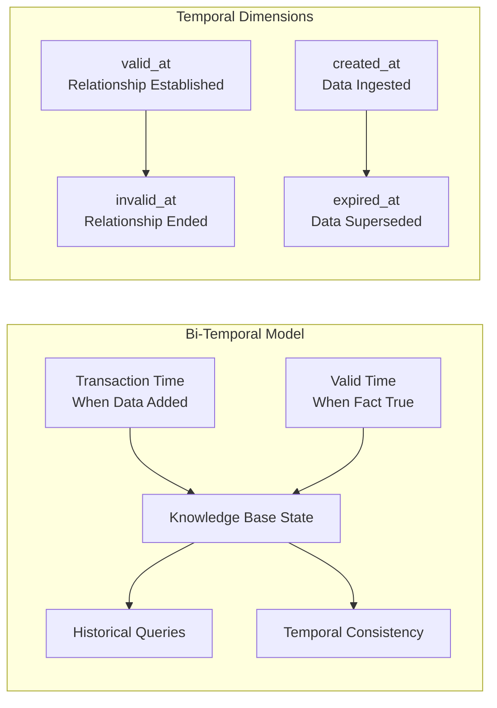
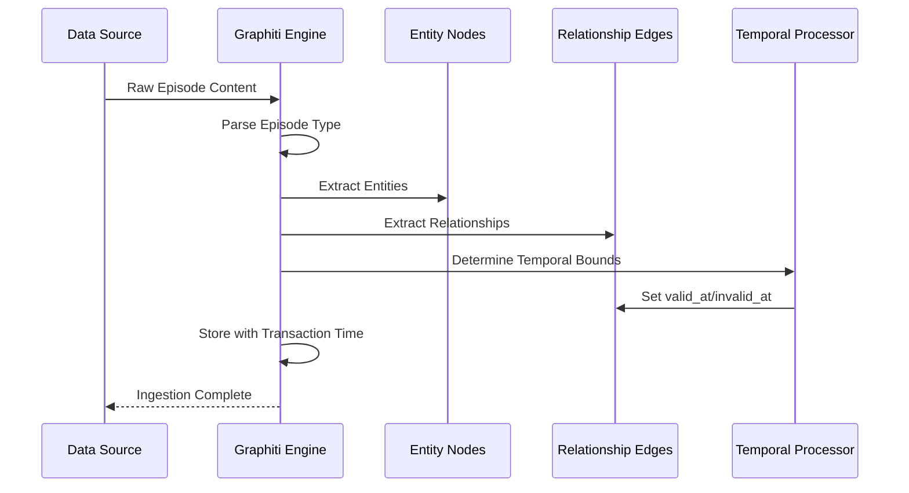
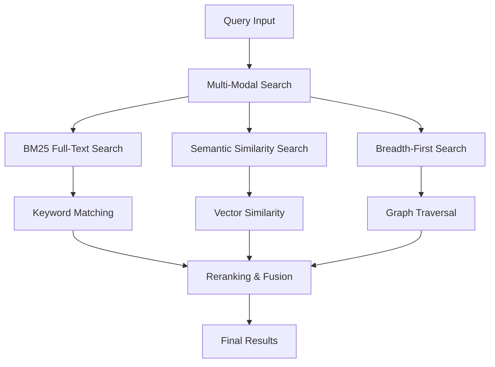
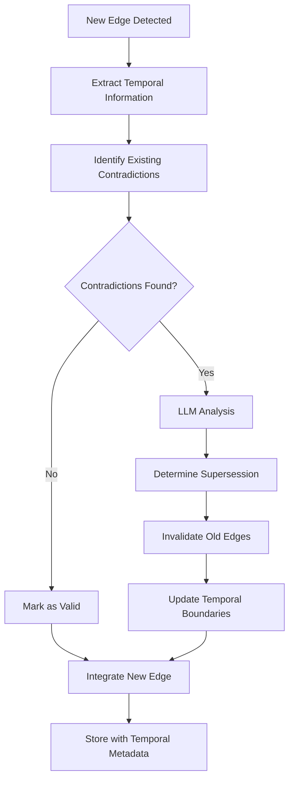
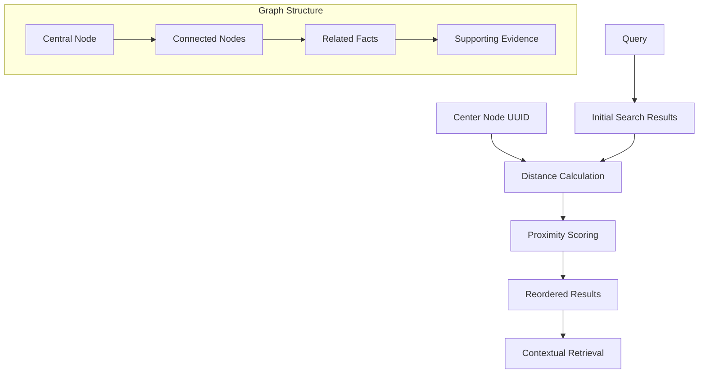
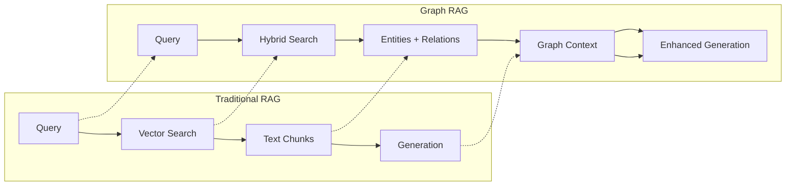
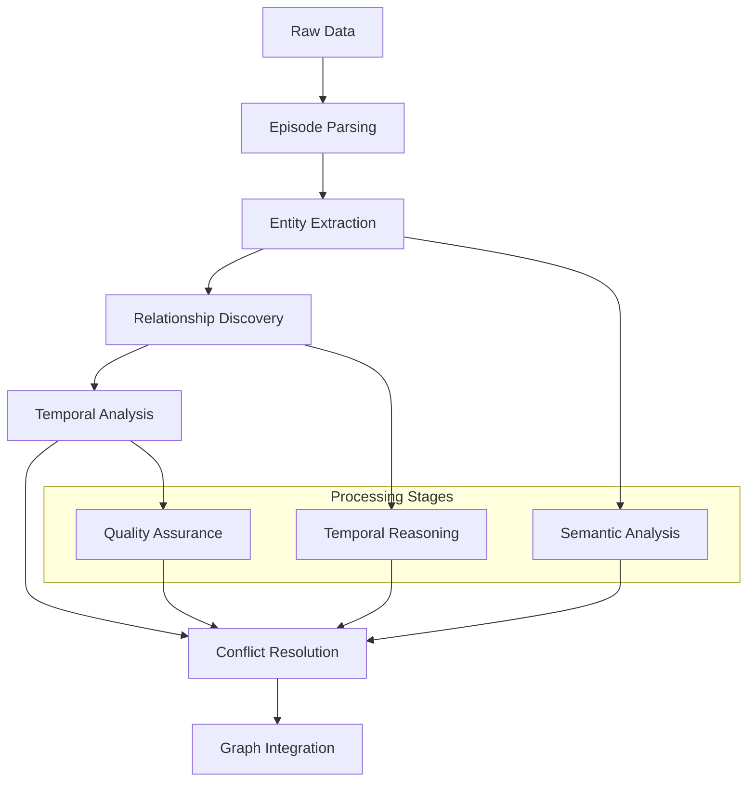
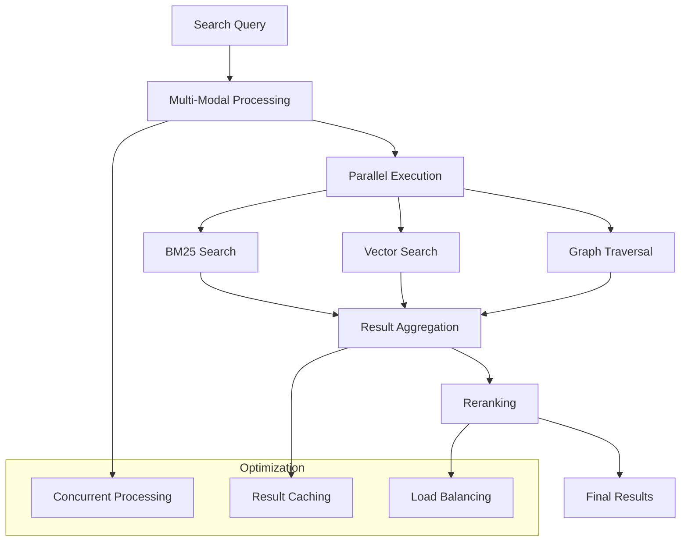

# Core Concepts

<cite>
**Referenced Files in This Document**
- [graphiti.py](file://graphiti_core/graphiti.py)
- [graphiti_types.py](file://graphiti_core/graphiti_types.py)
- [nodes.py](file://graphiti_core/nodes.py)
- [edges.py](file://graphiti_core/edges.py)
- [search.py](file://graphiti_core/search/search.py)
- [search_config.py](file://graphiti_core/search/search_config.py)
- [search_config_recipes.py](file://graphiti_core/search/search_config_recipes.py)
- [temporal_operations.py](file://graphiti_core/utils/maintenance/temporal_operations.py)
- [driver.py](file://graphiti_core/driver/driver.py)
- [quickstart_neo4j.py](file://examples/quickstart/quickstart_neo4j.py)
- [runner.py](file://examples/ecommerce/runner.py)
</cite>

## Table of Contents
1. [Introduction](#introduction)
2. [Bi-Temporal Data Model](#bi-temporal-data-model)
3. [Episode-Based Knowledge Ingestion](#episode-based-knowledge-ingestion)
4. [Hybrid Search Strategies](#hybrid-search-strategies)
5. [Temporal Edge Invalidation](#temporal-edge-invalidation)
6. [Center Node Search](#center-node-search)
7. [Graph RAG Advantages](#graph-rag-advantages)
8. [Data Flow Architecture](#data-flow-architecture)
9. [Implementation Examples](#implementation-examples)
10. [Conclusion](#conclusion)

## Introduction

Graphiti is a sophisticated knowledge graph framework that revolutionizes how organizations build and utilize semantic knowledge bases. Unlike traditional approaches, Graphiti employs a bi-temporal data model that captures both historical truth and transactional state, enabling unprecedented accuracy in temporal querying and knowledge management.

The framework operates on the principle of incremental knowledge ingestion through discrete "episodes" - units of information that represent moments in time when knowledge becomes available. This approach, combined with hybrid search strategies and temporal consistency mechanisms, creates a powerful platform for knowledge-intensive applications.

## Bi-Temporal Data Model

### Transaction Time vs. Valid Time

Graphiti's bi-temporal data model distinguishes between two critical temporal dimensions:

**Transaction Time**: Represents when data was added to the graph, capturing the history of knowledge acquisition and updates. This dimension tracks the evolution of the knowledge base itself, enabling audit trails and understanding when information was ingested or modified.

**Valid Time**: Represents when the information described by the data was actually true or applicable. This temporal dimension captures the actual timeline of events, relationships, and facts, allowing for accurate historical querying and temporal consistency.



**Diagram sources**
- [edges.py](file://graphiti_core/edges.py#L221-L238)
- [temporal_operations.py](file://graphiti_core/utils/maintenance/temporal_operations.py#L33-L71)

### Temporal Edge Properties

Entity edges in Graphiti maintain four key temporal properties:

| Property | Description | Purpose |
|----------|-------------|---------|
| `valid_at` | When the relationship became true | Establishes temporal boundaries for relationship validity |
| `invalid_at` | When the relationship ceased to be true | Defines end of relationship validity period |
| `created_at` | When edge was added to graph | Tracks knowledge acquisition timeline |
| `expired_at` | When edge was superseded or invalidated | Manages temporal precedence and updates |

**Section sources**
- [edges.py](file://graphiti_core/edges.py#L221-L238)
- [temporal_operations.py](file://graphiti_core/utils/maintenance/temporal_operations.py#L33-L71)

## Episode-Based Knowledge Ingestion

### What Are Episodes?

Episodes serve as the fundamental units of knowledge ingestion in Graphiti. Each episode represents a discrete moment when information becomes available, whether from conversations, documents, events, or other data sources.



**Diagram sources**
- [graphiti.py](file://graphiti_core/graphiti.py#L611-L800)
- [nodes.py](file://graphiti_core/nodes.py#L295-L306)

### Episode Types and Processing

Graphiti supports multiple episode types for flexible knowledge ingestion:

| Episode Type | Description | Use Case |
|--------------|-------------|----------|
| `message` | Structured messages with actor-content format | Conversations, chat logs |
| `json` | Structured JSON objects | API responses, structured data |
| `text` | Plain text content | Documents, articles, free-form text |

### Incremental Graph Updates

The episode-based approach enables incremental graph updates through sophisticated deduplication and resolution mechanisms:

1. **Entity Extraction**: Identifies and extracts named entities from episode content
2. **Relationship Discovery**: Discovers relationships between extracted entities  
3. **Temporal Resolution**: Determines valid time periods for discovered facts
4. **Conflict Resolution**: Handles contradictory information through LLM-based reasoning
5. **Graph Integration**: Seamlessly integrates new knowledge with existing graph structure

**Section sources**
- [graphiti.py](file://graphiti_core/graphiti.py#L611-L800)
- [nodes.py](file://graphiti_core/nodes.py#L295-L306)

## Hybrid Search Strategies

### Multi-Modal Search Architecture

Graphiti implements sophisticated hybrid search strategies that combine multiple search modalities for optimal retrieval performance:



**Diagram sources**
- [search.py](file://graphiti_core/search/search.py#L68-L182)
- [search_config.py](file://graphiti_core/search/search_config.py#L32-L51)

### Search Method Combinations

Graphiti offers configurable combinations of search methods:

| Search Method | Description | Best For |
|---------------|-------------|----------|
| `bm25` | Keyword-based full-text search | Exact term matching, keyword queries |
| `cosine_similarity` | Vector similarity search | Semantic matching, concept retrieval |
| `bfs` | Graph traversal search | Exploring connected knowledge, context |

### Reranking Strategies

Multiple reranking strategies enhance search result quality:

| Reranker | Description | Use Case |
|----------|-------------|----------|
| `rrf` | Reciprocal Rank Fusion | Balanced results from multiple sources |
| `mmr` | Maximal Marginal Relevance | Diverse, representative results |
| `cross_encoder` | Neural reranking | High-quality, context-aware ranking |
| `node_distance` | Graph proximity | Contextually relevant results |
| `episode_mentions` | Frequency-based ranking | Popular, frequently referenced content |

**Section sources**
- [search.py](file://graphiti_core/search/search.py#L68-L182)
- [search_config.py](file://graphiti_core/search/search_config.py#L53-L77)
- [search_config_recipes.py](file://graphiti_core/search/search_config_recipes.py#L33-L107)

## Temporal Edge Invalidation

### Mechanism Overview

Temporal edge invalidation ensures data accuracy over time by systematically identifying and marking outdated or superseded relationships. This process maintains temporal consistency while preserving historical knowledge.



**Diagram sources**
- [temporal_operations.py](file://graphiti_core/utils/maintenance/temporal_operations.py#L74-L107)

### Invalidation Process

The temporal invalidation process follows these steps:

1. **Contradiction Detection**: Identifies potential conflicts between new and existing edges
2. **Temporal Analysis**: Uses LLM reasoning to determine temporal precedence
3. **Supersession Determination**: Decides which edges become invalid
4. **Boundary Adjustment**: Updates temporal boundaries of remaining valid edges
5. **Historical Preservation**: Maintains complete historical record

### Benefits of Temporal Invalidation

- **Data Accuracy**: Ensures current knowledge reflects latest information
- **Historical Integrity**: Preserves complete temporal history
- **Conflict Resolution**: Automatically resolves contradictory information
- **Audit Trail**: Provides transparent reasoning for knowledge changes

**Section sources**
- [temporal_operations.py](file://graphiti_core/utils/maintenance/temporal_operations.py#L74-L107)

## Center Node Search

### Concept and Application

Center node search enhances retrieval relevance by leveraging graph topology to rerank search results based on their proximity to a specified central node. This approach provides contextually relevant results that align with the user's current focus.



**Diagram sources**
- [search.py](file://graphiti_core/search/search.py#L308-L309)

### Implementation Details

Center node search works by:

1. **Distance Calculation**: Computing shortest path distances from center node to search results
2. **Score Adjustment**: Modifying result scores based on calculated distances
3. **Result Reordering**: Sorting results by proximity to improve contextual relevance
4. **Preservation of Quality**: Maintaining original search quality while enhancing relevance

### Use Cases

- **Focused Exploration**: Helping users explore topics related to specific entities
- **Context-Aware Recommendations**: Providing results relevant to current context
- **Knowledge Navigation**: Guiding users through interconnected knowledge domains
- **Personalized Search**: Tailoring results to user's current interests

**Section sources**
- [search.py](file://graphiti_core/search/search.py#L308-L309)

## Graph RAG Advantages

### Enhanced Retrieval Capabilities

Graph RAG (Retrieval-Augmented Generation) in Graphiti offers significant advantages over traditional text-based RAG systems:



**Diagram sources**
- [search.py](file://graphiti_core/search/search.py#L68-L182)
- [quickstart_neo4j.py](file://examples/quickstart/quickstart_neo4j.py#L141-L154)

### Key Advantages

| Advantage | Description | Benefit |
|-----------|-------------|---------|
| **Temporal Accuracy** | Bi-temporal model preserves historical truth | Accurate historical reasoning |
| **Context Richness** | Graph structure provides semantic context | Better understanding of relationships |
| **Query Flexibility** | Multiple search modalities | Comprehensive result coverage |
| **Knowledge Integrity** | Automatic conflict resolution | Reliable, consistent knowledge |
| **Scalable Architecture** | Modular design supports growth | Efficient handling of large datasets |

### Practical Examples

**Example 1: Historical Question Answering**
- Traditional: May return outdated information
- Graph RAG: Returns accurate historical context with temporal boundaries

**Example 2: Relationship Discovery**
- Traditional: Limited to surface-level connections
- Graph RAG: Reveals complex relationship networks and temporal evolution

**Example 3: Conflict Resolution**
- Traditional: Cannot handle contradictory information
- Graph RAG: Resolves conflicts using temporal precedence and LLM reasoning

**Section sources**
- [quickstart_neo4j.py](file://examples/quickstart/quickstart_neo4j.py#L141-L154)
- [runner.py](file://examples/ecommerce/runner.py#L75-L83)

## Data Flow Architecture

### Ingestion Pipeline

The Graphiti ingestion pipeline demonstrates sophisticated data processing capabilities:



**Diagram sources**
- [graphiti.py](file://graphiti_core/graphiti.py#L611-L800)

### Retrieval Pipeline

Search and retrieval operations leverage the hybrid architecture:



**Diagram sources**
- [search.py](file://graphiti_core/search/search.py#L68-L182)

### Database Abstraction

Graphiti's driver architecture supports multiple graph databases:

| Driver | Database | Strengths |
|--------|----------|-----------|
| Neo4j | Neo4j | Mature ecosystem, ACID compliance |
| FalkorDB | FalkorDB | High performance, vector support |
| Kuzu | Kuzu | Memory-efficient, fast analytics |
| Neptune | Amazon Neptune | Managed cloud service |

**Section sources**
- [driver.py](file://graphiti_core/driver/driver.py#L42-L46)
- [graphiti.py](file://graphiti_core/graphiti.py#L128-L232)

## Implementation Examples

### Basic Knowledge Ingestion

The following example demonstrates fundamental knowledge ingestion patterns:

```python
# Episode-based ingestion with temporal awareness
await graphiti.add_episode(
    name="Customer Interaction",
    episode_body="John purchased Men's Couriers - Natural Black",
    source=EpisodeType.message,
    source_description="Sales Conversation",
    reference_time=datetime.now(timezone.utc),
    valid_at=datetime(2024, 7, 30, 0, 5),
    invalid_at=datetime(2024, 8, 31, 11, 38)
)
```

### Hybrid Search Configuration

Advanced search configurations demonstrate the framework's flexibility:

```python
# Multi-modal search with temporal filtering
results = await graphiti.search(
    query="California Governor",
    config=NODE_HYBRID_SEARCH_RRF.model_copy(deep=True),
    search_filter=SearchFilters(
        valid_at=[DateFilter(date=datetime(2024, 1, 1))]
    )
)
```

### Temporal Querying

Bi-temporal queries enable sophisticated historical analysis:

```python
# Historical fact discovery
historical_facts = await graphiti.search(
    query="California Attorney General",
    config=EDGE_HYBRID_SEARCH_NODE_DISTANCE,
    center_node_uuid=attorney_general_node.uuid,
    search_filter=SearchFilters(
        valid_at=[DateFilter(date=datetime(2024, 1, 1))],
        invalid_at=[DateFilter(comparison_operator=ComparisonOperator.is_null)]
    )
)
```

**Section sources**
- [quickstart_neo4j.py](file://examples/quickstart/quickstart_neo4j.py#L82-L130)
- [runner.py](file://examples/ecommerce/runner.py#L75-L83)

## Conclusion

Graphiti represents a paradigm shift in knowledge graph construction and utilization. Its bi-temporal data model, episode-based ingestion, hybrid search strategies, and temporal invalidation mechanisms create a robust foundation for knowledge-intensive applications.

The framework's key innovations include:

- **Temporal Precision**: Bi-temporal modeling enables accurate historical reasoning
- **Incremental Learning**: Episode-based ingestion supports continuous knowledge evolution  
- **Multi-Modal Search**: Hybrid strategies deliver comprehensive retrieval capabilities
- **Automatic Quality Control**: Temporal invalidation maintains data accuracy
- **Context-Aware Retrieval**: Center node search enhances relevance and usability

These capabilities position Graphiti as a powerful platform for applications requiring sophisticated knowledge management, historical analysis, and intelligent information retrieval. The framework's modular architecture and database abstraction ensure scalability and adaptability to diverse organizational needs.