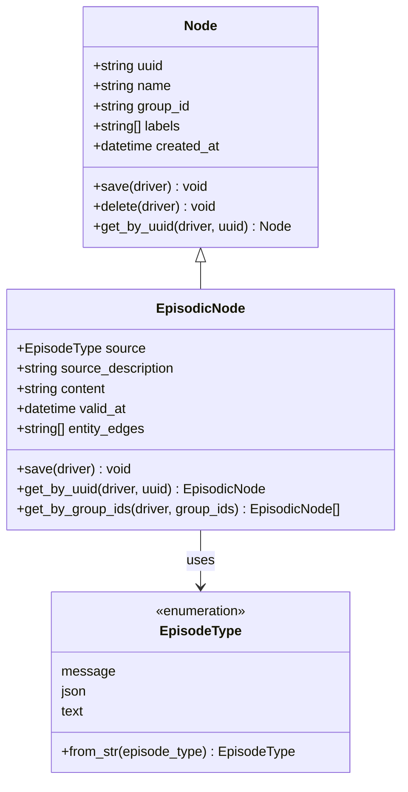
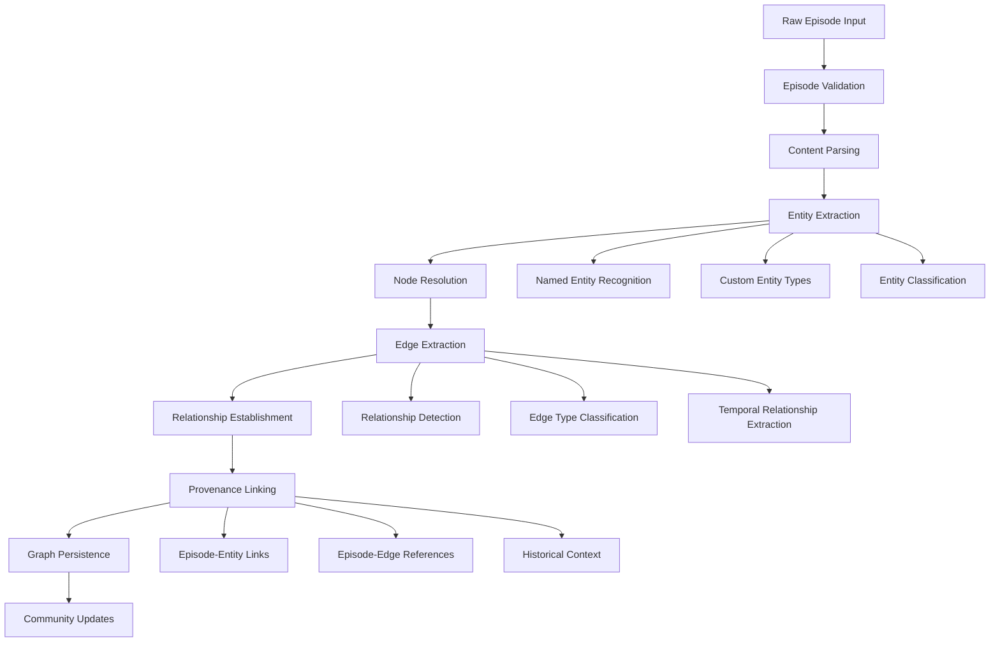
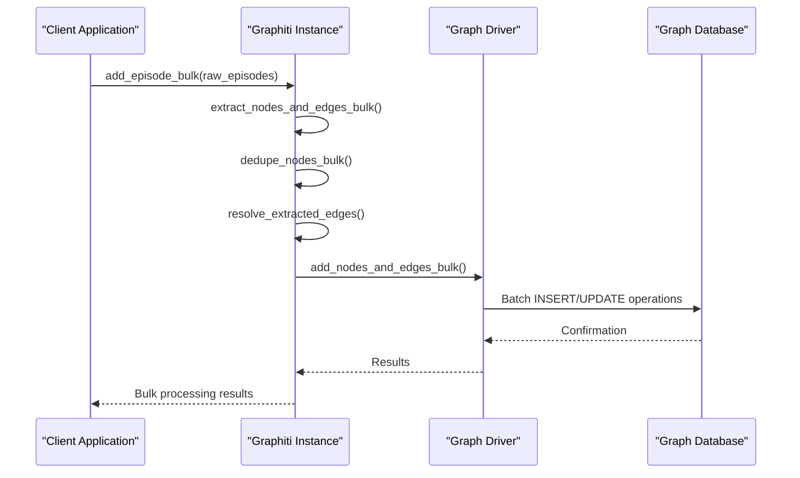
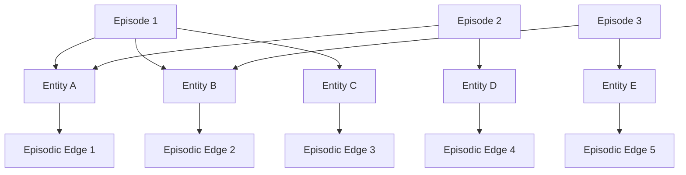

# Episode-Based Ingestion

<cite>
**Referenced Files in This Document**
- [node_db_queries.py](file://graphiti_core/models/nodes/node_db_queries.py)
- [edge_db_queries.py](file://graphiti_core/models/edges/edge_db_queries.py)
- [graphiti.py](file://graphiti_core/graphiti.py)
- [nodes.py](file://graphiti_core/nodes.py)
- [edges.py](file://graphiti_core/edges.py)
- [bulk_utils.py](file://graphiti_core/utils/bulk_utils.py)
- [node_operations.py](file://graphiti_core/utils/maintenance/node_operations.py)
- [edge_operations.py](file://graphiti_core/utils/maintenance/edge_operations.py)
- [graphiti_types.py](file://graphiti_core/graphiti_types.py)
- [podcast_runner.py](file://examples/podcast/podcast_runner.py)
- [manybirds_products.json](file://examples/data/manybirds_products.json)
</cite>

## Table of Contents
1. [Introduction](#introduction)
2. [Episode Model Architecture](#episode-model-architecture)
3. [Ingestion Workflow](#ingestion-workflow)
4. [Data Model Specifications](#data-model-specifications)
5. [Storage and Query Operations](#storage-and-query-operations)
6. [Provenance Tracking](#provenance-tracking)
7. [Best Practices](#best-practices)
8. [Common Issues and Solutions](#common-issues-and-solutions)
9. [Examples and Use Cases](#examples-and-use-cases)
10. [Conclusion](#conclusion)

## Introduction

Graphiti's episode-based ingestion model represents a sophisticated approach to building and maintaining knowledge graphs through discrete, atomic units of information called **Episodic nodes**. This model enables incremental graph updates while preserving historical context and providing robust provenance tracking capabilities.

Episodes serve as the fundamental building blocks of knowledge in Graphiti, representing discrete events, data updates, or informational snapshots that can be ingested into the graph database. Each episode encapsulates a specific moment in time, containing structured or unstructured content that can be processed to extract entities, relationships, and contextual information.

The episode-based approach offers several key advantages:
- **Incremental Updates**: New information can be added without reprocessing existing data
- **Temporal Awareness**: Each episode maintains precise temporal metadata
- **Provenance Tracking**: Clear lineage of how information was derived
- **Context Preservation**: Historical episodes provide context for current knowledge
- **Scalability**: Efficient processing of large volumes of data through batching

## Episode Model Architecture

### Episodic Node Structure

Episodic nodes are the core data structure representing individual episodes in the knowledge graph. They inherit from the base Node class and extend it with temporal and content-specific attributes.



**Diagram sources**
- [nodes.py](file://graphiti_core/nodes.py#L295-L353)
- [nodes.py](file://graphiti_core/nodes.py#L51-L85)

### Episode Types and Content Formats

Graphiti supports three primary episode types, each designed for different content formats and processing requirements:

| Episode Type | Description | Use Case | Content Format |
|--------------|-------------|----------|----------------|
| `message` | Structured conversational content | Chat logs, dialogues | Actor: Content format |
| `json` | Structured data objects | API responses, configuration | JSON objects |
| `text` | Unstructured textual content | Documents, articles | Plain text |

**Section sources**
- [nodes.py](file://graphiti_core/nodes.py#L51-L85)

## Ingestion Workflow

### Episode Creation and Processing Pipeline

The episode ingestion process follows a comprehensive workflow that transforms raw content into structured knowledge graph entries:



**Diagram sources**
- [graphiti.py](file://graphiti_core/graphiti.py#L681-L896)
- [node_operations.py](file://graphiti_core/utils/maintenance/node_operations.py#L88-L208)
- [edge_operations.py](file://graphiti_core/utils/maintenance/edge_operations.py#L89-L389)

### Step-by-Step Processing

#### 1. Episode Retrieval and Context Building
The system begins by retrieving relevant previous episodes to provide context for the current ingestion:

```python
# Episode retrieval for context
previous_episodes = await self.retrieve_episodes(
    reference_time,
    last_n=RELEVANT_SCHEMA_LIMIT,
    group_ids=[group_id],
    source=source
)
```

#### 2. Entity Extraction
Entities are identified and extracted from the episode content using LLM-powered extraction:

```python
# Entity extraction process
extracted_entities = await extract_nodes(
    self.clients,
    episode,
    previous_episodes,
    entity_types,
    excluded_entity_types
)
```

#### 3. Node Resolution and Deduplication
Extracted entities are resolved against existing graph nodes to prevent duplication:

```python
# Node resolution with similarity matching
resolved_nodes, uuid_map, duplicates = await resolve_extracted_nodes(
    self.clients,
    extracted_nodes,
    episode,
    previous_episodes,
    entity_types
)
```

#### 4. Edge Extraction and Relationship Discovery
Relationships between entities are identified and structured:

```python
# Edge extraction with temporal awareness
extracted_edges = await extract_edges(
    self.clients,
    episode,
    extracted_nodes,
    previous_episodes,
    edge_type_map,
    group_id,
    edge_types
)
```

#### 5. Graph Persistence
Processed episodes, nodes, and edges are persisted to the graph database:

```python
# Bulk graph persistence
await add_nodes_and_edges_bulk(
    self.driver,
    [episode],
    episodic_edges,
    nodes,
    entity_edges,
    self.embedder
)
```

**Section sources**
- [graphiti.py](file://graphiti_core/graphiti.py#L681-L896)
- [node_operations.py](file://graphiti_core/utils/maintenance/node_operations.py#L88-L208)
- [edge_operations.py](file://graphiti_core/utils/maintenance/edge_operations.py#L89-L389)

## Data Model Specifications

### Episode Metadata Fields

Episodic nodes contain comprehensive metadata that enables temporal reasoning and provenance tracking:

| Field | Type | Description | Purpose |
|-------|------|-------------|---------|
| `uuid` | string | Unique identifier | Node identification and linking |
| `name` | string | Human-readable name | Display and organization |
| `group_id` | string | Partition identifier | Multi-tenant isolation |
| `source` | EpisodeType | Content source type | Processing strategy selection |
| `source_description` | string | Source attribution | Provenance tracking |
| `content` | string | Raw episode content | Information storage |
| `created_at` | datetime | Creation timestamp | Temporal ordering |
| `valid_at` | datetime | Validity timestamp | Temporal validity |
| `entity_edges` | list[string] | Related entity links | Provenance and navigation |

### Storage Schema Variations

Different graph database providers implement episode storage with provider-specific optimizations:

#### Neo4j Implementation
```cypher
MERGE (n:Episodic {uuid: $uuid})
SET n = {uuid: $uuid, name: $name, group_id: $group_id, 
         source_description: $source_description, source: $source, 
         content: $content, entity_edges: $entity_edges, 
         created_at: $created_at, valid_at: $valid_at}
RETURN n.uuid AS uuid
```

#### Neptune Implementation
```cypher
MERGE (n:Episodic {uuid: $uuid})
SET n = {uuid: $uuid, name: $name, group_id: $group_id, 
         source_description: $source_description, source: $source, 
         content: $content, entity_edges: join([...], '|'), 
         created_at: $created_at, valid_at: $valid_at}
RETURN n.uuid AS uuid
```

**Section sources**
- [node_db_queries.py](file://graphiti_core/models/nodes/node_db_queries.py#L22-L101)
- [nodes.py](file://graphiti_core/nodes.py#L295-L353)

## Storage and Query Operations

### Bulk Processing Capabilities

Graphiti provides efficient bulk processing operations for handling large volumes of episodes:



**Diagram sources**
- [bulk_utils.py](file://graphiti_core/utils/bulk_utils.py#L256-L402)
- [graphiti.py](file://graphiti_core/graphiti.py#L862-L950)

### Query Patterns and Indexing

Episodes support various query patterns optimized for different access scenarios:

#### Temporal Queries
```python
# Retrieve episodes by time range
episodes = await client.retrieve_episodes(
    reference_time,
    last_n=100,
    group_ids=["group_1"],
    source=EpisodeType.message
)
```

#### Content-Based Queries
```python
# Search episodes containing specific terms
results = await search(
    clients,
    query="specific_topic",
    group_ids=["group_1"],
    config=HYBRID_SEARCH_CONFIG
)
```

**Section sources**
- [bulk_utils.py](file://graphiti_core/utils/bulk_utils.py#L110-L126)
- [graphiti.py](file://graphiti_core/graphiti.py#L577-L610)

## Provenance Tracking

### Episode-Entity Linking

Episodes maintain explicit links to the entities they mention, enabling comprehensive provenance tracking:



**Diagram sources**
- [edge_db_queries.py](file://graphiti_core/models/edges/edge_db_queries.py#L19-L30)
- [edge_operations.py](file://graphiti_core/utils/maintenance/edge_operations.py#L51-L70)

### Edge Reference Management

Episodes maintain references to edges they contribute to, enabling:
- **Attribution**: Identifying which episodes contributed to specific relationships
- **Invalidation**: Managing relationship lifecycle and obsolescence
- **Audit Trail**: Tracking the evolution of knowledge over time

```python
# Episode-to-edge relationship
class EpisodicEdge(Edge):
    async def save(self, driver: GraphDriver):
        result = await driver.execute_query(
            EPISODIC_EDGE_SAVE,
            episode_uuid=self.source_node_uuid,  # Episode UUID
            entity_uuid=self.target_node_uuid,   # Entity UUID
            uuid=self.uuid,
            group_id=self.group_id,
            created_at=self.created_at
        )
```

**Section sources**
- [edges.py](file://graphiti_core/edges.py#L131-L145)
- [edge_db_queries.py](file://graphiti_core/models/edges/edge_db_queries.py#L19-L30)

## Best Practices

### Episode Design Guidelines

#### Optimal Episode Granularity
- **Small Episodes**: Focus on single, well-defined events or facts
- **Medium Episodes**: Group related but distinct pieces of information
- **Large Episodes**: Consolidate comprehensive datasets or reports

#### Content Organization
```python
# Recommended episode structure
raw_episode = RawEpisode(
    name="Customer Support Interaction",
    content="Agent: How can I help you today?<br/>Customer: I need assistance with my order...",
    reference_time=datetime.now(),
    source=EpisodeType.message,
    source_description="Customer Support Chat"
)
```

#### Metadata Enrichment Strategies
- **Descriptive Names**: Use meaningful episode names for easy identification
- **Accurate Timestamps**: Ensure reference_time reflects actual event timing
- **Source Attribution**: Provide detailed source descriptions for provenance
- **Structured Content**: Format content consistently for reliable processing

### Performance Optimization

#### Batching Strategies
```python
# Efficient bulk processing
await client.add_episode_bulk(
    raw_episodes,  # List of RawEpisode objects
    group_id=group_id,
    entity_types=entity_types,
    edge_types=edge_types,
    edge_type_map=edge_type_map
)
```

#### Memory Management
- Process episodes in manageable batches
- Monitor memory usage during large ingestions
- Implement proper resource cleanup

**Section sources**
- [podcast_runner.py](file://examples/podcast/podcast_runner.py#L90-L108)
- [bulk_utils.py](file://graphiti_core/utils/bulk_utils.py#L101-L108)

## Common Issues and Solutions

### Duplicate Episode Ingestion

#### Problem
Multiple ingestions of the same episode content leading to data redundancy.

#### Solution
Implement deduplication strategies:
```python
# UUID-based deduplication
episode = await EpisodicNode.get_by_uuid(driver, uuid)
if episode:
    # Episode already exists
    return episode
```

### Episode Deduplication Strategies

#### Content-Based Matching
```python
# Similarity-based deduplication
normalized_content = _normalize_string_exact(content)
existing_episodes = await search_episodes(
    driver,
    normalized_content,
    threshold=0.8
)
```

#### Temporal Conflict Resolution
```python
# Handle overlapping episode times
if episode.valid_at < existing.valid_at:
    # Mark existing as outdated
    existing.invalid_at = episode.valid_at
    await existing.save(driver)
```

### Performance Bottlenecks

#### Large Volume Processing
- Implement streaming processing for massive datasets
- Use appropriate batch sizes based on available memory
- Leverage parallel processing where possible

#### Memory Optimization
- Process episodes in smaller chunks
- Clear intermediate results regularly
- Monitor and tune garbage collection

**Section sources**
- [node_operations.py](file://graphiti_core/utils/maintenance/node_operations.py#L395-L450)
- [edge_operations.py](file://graphiti_core/utils/maintenance/edge_operations.py#L444-L560)

## Examples and Use Cases

### Podcast Transcription Processing

The podcast example demonstrates real-world episode ingestion:

```python
# Episode processing from podcast transcripts
messages = parse_podcast_messages()
raw_episodes = []
for i, message in enumerate(messages[3:14]):
    raw_episodes.append(
        RawEpisode(
            name=f'Message {i}',
            content=f'{message.speaker_name} ({message.role}): {message.content}',
            reference_time=message.actual_timestamp,
            source=EpisodeType.message,
            source_description='Podcast Transcript'
        )
    )
```

### Product Catalog Ingestion

Processing structured product data from JSON sources:

```python
# JSON episode processing
with open('products.json', 'r') as f:
    products_data = json.load(f)
    
for product in products_data['products']:
    episode = RawEpisode(
        name=product['title'],
        content=json.dumps(product),
        reference_time=datetime.now(),
        source=EpisodeType.json,
        source_description='E-commerce Product Catalog'
    )
```

### Real-Time Event Processing

Handling streaming data with temporal awareness:

```python
# Streaming episode ingestion
async def process_streaming_events(event_stream):
    async for event in event_stream:
        episode = RawEpisode(
            name=f"Event: {event['type']}",
            content=event['payload'],
            reference_time=event['timestamp'],
            source=EpisodeType.json,
            source_description="Real-time Event Stream"
        )
        await client.add_episode(episode)
```

**Section sources**
- [podcast_runner.py](file://examples/podcast/podcast_runner.py#L87-L108)
- [manybirds_products.json](file://examples/data/manybirds_products.json#L1-50)

## Conclusion

Graphiti's episode-based ingestion model provides a robust foundation for building and maintaining knowledge graphs through discrete, atomic units of information. The model's strength lies in its ability to handle incremental updates while preserving temporal context and providing comprehensive provenance tracking.

Key benefits of the episode-based approach include:

- **Incremental Processing**: New information can be added without reprocessing existing data
- **Temporal Reasoning**: Precise temporal metadata enables sophisticated time-based queries
- **Provenance Tracking**: Clear lineage of information derivation and evolution
- **Scalability**: Efficient processing of large volumes through batching and parallelization
- **Flexibility**: Support for multiple content formats and processing strategies

The comprehensive workflow from episode creation through graph persistence ensures that knowledge graphs remain accurate, up-to-date, and maintainable. By following the established best practices and addressing common challenges, organizations can effectively leverage this powerful ingestion model to build sophisticated knowledge systems.

Future enhancements may include advanced temporal reasoning capabilities, improved deduplication algorithms, and enhanced batch processing optimizations to further improve the scalability and performance of the episode-based ingestion system.