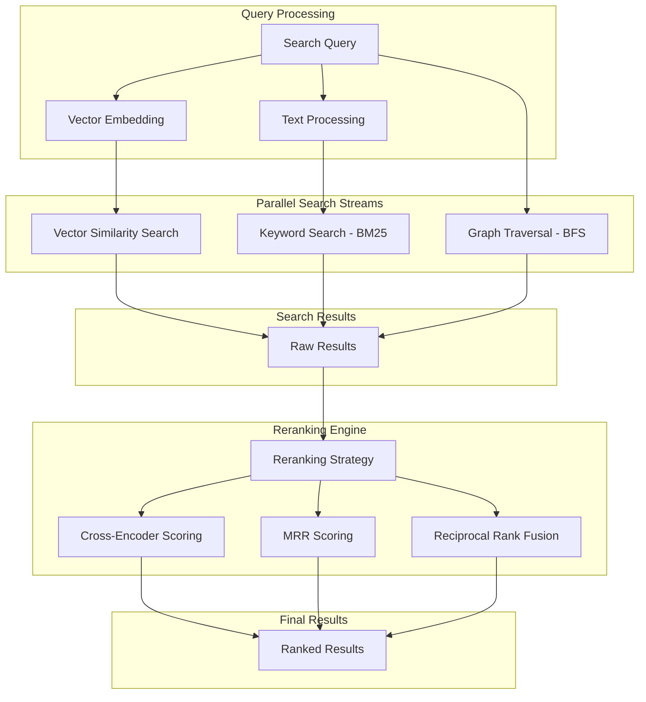
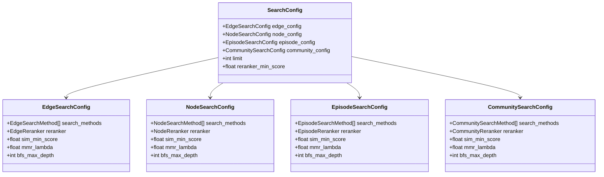
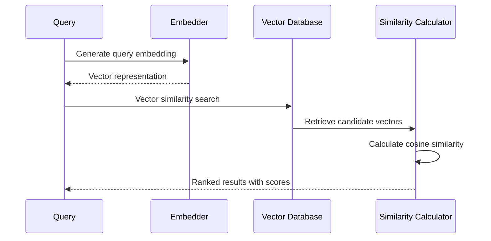
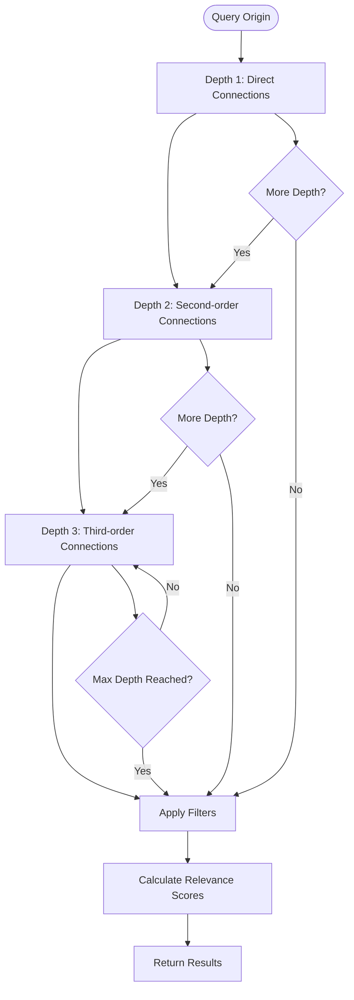
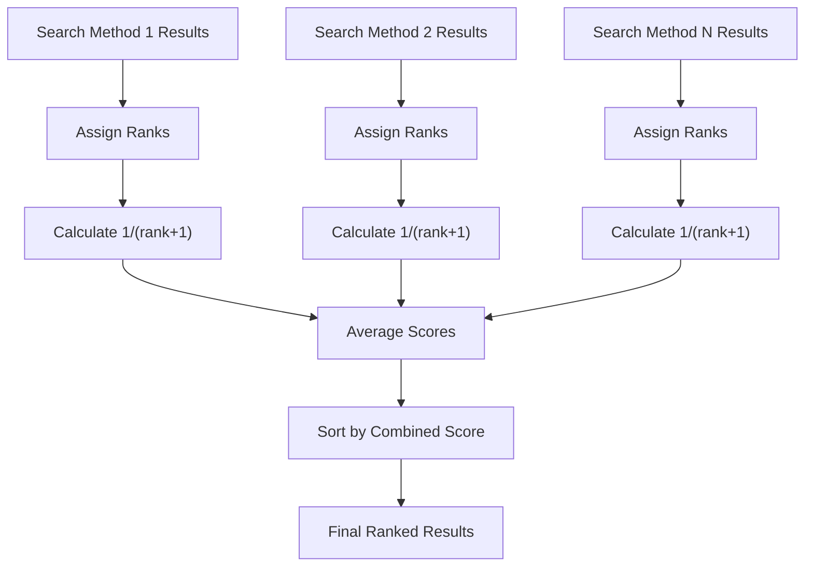
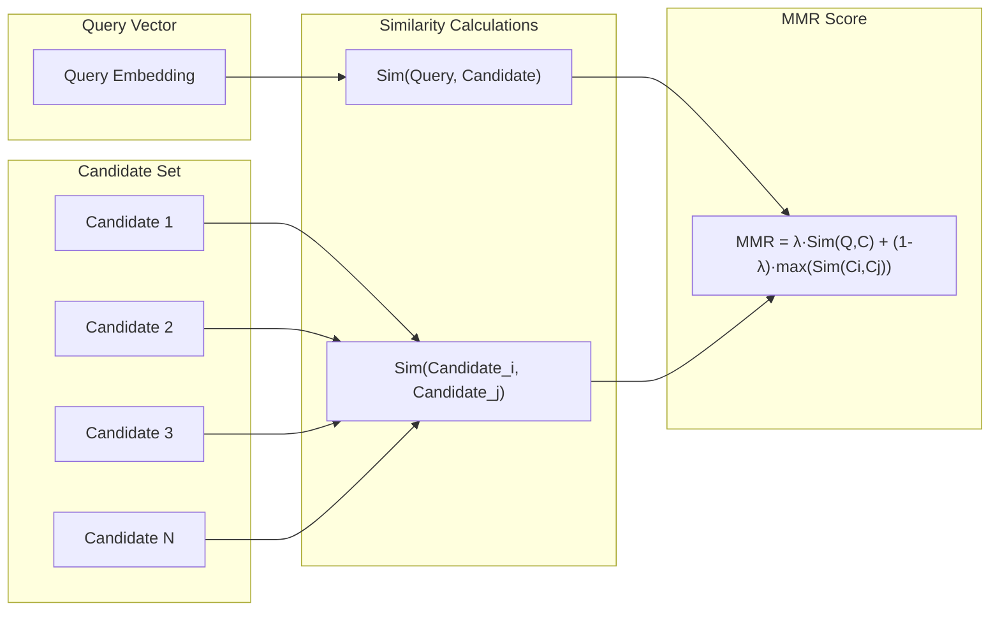
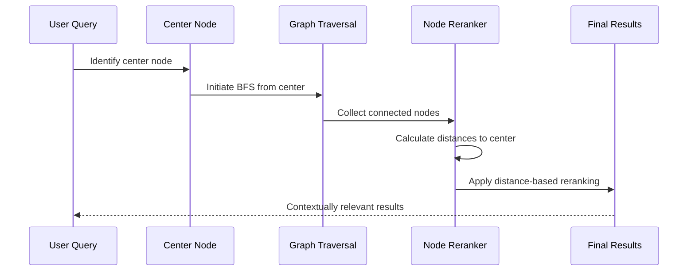
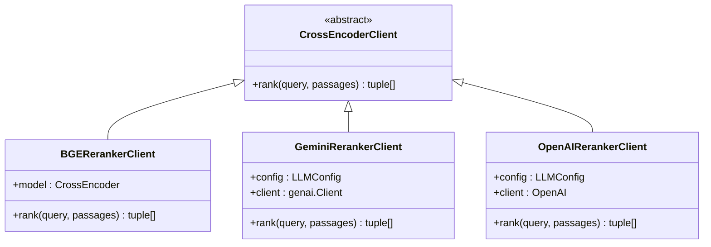
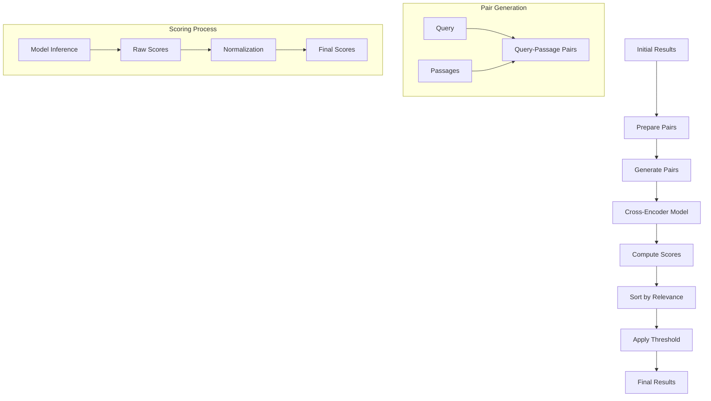

# Hybrid Search Strategies

<cite>
**Referenced Files in This Document**
- [search_config.py](file://graphiti_core/search/search_config.py)
- [search_config_recipes.py](file://graphiti_core/search/search_config_recipes.py)
- [search.py](file://graphiti_core/search/search.py)
- [search_utils.py](file://graphiti_core/search/search_utils.py)
- [search_helpers.py](file://graphiti_core/search/search_helpers.py)
- [search_filters.py](file://graphiti_core/search/search_filters.py)
- [client.py](file://graphiti_core/cross_encoder/client.py)
- [bge_reranker_client.py](file://graphiti_core/cross_encoder/bge_reranker_client.py)
- [gemini_reranker_client.py](file://graphiti_core/cross_encoder/gemini_reranker_client.py)
- [retrieve.py](file://server/graph_service/routers/retrieve.py)
- [runner.py](file://examples/ecommerce/runner.py)
</cite>

## Table of Contents
1. [Introduction](#introduction)
2. [Search Architecture Overview](#search-architecture-overview)
3. [SearchConfig Class and Configuration](#searchconfig-class-and-configuration)
4. [Search Methods and Strategies](#search-methods-and-strategies)
5. [Reranking Strategies](#reranking-strategies)
6. [Search Recipes and Pre-configured Patterns](#search-recipes-and-pre-configured-patterns)
7. [Center Node Search Pattern](#center-node-search-pattern)
8. [Cross-Encoder Reranking](#cross-encoder-reranking)
9. [Implementation Examples](#implementation-examples)
10. [Performance Considerations](#performance-considerations)
11. [Troubleshooting Guide](#troubleshooting-guide)
12. [Conclusion](#conclusion)

## Introduction

Graphiti's hybrid search implementation represents a sophisticated approach to knowledge retrieval that combines multiple search paradigms to achieve optimal recall and precision. The system integrates semantic search through vector similarity, keyword search via BM25, and graph traversal through breadth-first search (BFS), all orchestrated through intelligent reranking mechanisms.

This hybrid approach addresses the limitations of individual search methods by leveraging their complementary strengths. Semantic search captures contextual relationships through dense vector representations, BM25 excels at keyword matching and full-text retrieval, while BFS navigation enables exploration of connected knowledge graphs. The combination produces comprehensive search results that balance relevance, diversity, and contextual awareness.

## Search Architecture Overview

Graphiti's search architecture operates through a modular design that separates concerns between search methods, reranking strategies, and result aggregation. The system processes queries through multiple parallel search streams, each employing different retrieval strategies, before applying sophisticated reranking to produce the final result set.



**Diagram sources**
- [search.py](file://graphiti_core/search/search.py#L68-L183)
- [search_config.py](file://graphiti_core/search/search_config.py#L112-L130)

The architecture supports concurrent execution of multiple search methods, enabling rapid result synthesis without compromising on search quality. Each search stream operates independently, allowing for fault tolerance and parallel processing capabilities.

**Section sources**
- [search.py](file://graphiti_core/search/search.py#L68-L183)
- [search_config.py](file://graphiti_core/search/search_config.py#L112-L130)

## SearchConfig Class and Configuration

The SearchConfig class serves as the central configuration hub for defining search strategies across different graph node types. It provides granular control over search methods, reranking algorithms, and retrieval parameters for edges, nodes, episodes, and communities.



**Diagram sources**
- [search_config.py](file://graphiti_core/search/search_config.py#L80-L111)

### Configuration Parameters

The SearchConfig class exposes several critical parameters that control search behavior:

- **search_methods**: Defines which search approaches to employ (BM25, cosine similarity, BFS)
- **reranker**: Selects the reranking strategy (RRF, MMR, cross-encoder, etc.)
- **sim_min_score**: Sets minimum similarity thresholds for vector searches
- **mmr_lambda**: Controls the balance between relevance and diversity in MMR
- **bfs_max_depth**: Limits graph traversal depth for BFS searches
- **limit**: Specifies the maximum number of results per search type
- **reranker_min_score**: Filters results below a minimum relevance threshold

### Search Method Enums

Each search configuration supports specific search methods tailored to the node type:

| Node Type | Available Methods | Description |
|-----------|------------------|-------------|
| Edge | BM25, Cosine Similarity, BFS | Edges support full-text, vector, and graph traversal search |
| Node | BM25, Cosine Similarity, BFS | Nodes support similar methods with graph connectivity |
| Episode | BM25 | Episodes use only BM25 for content search |
| Community | BM25, Cosine Similarity | Communities support vector and full-text search |

**Section sources**
- [search_config.py](file://graphiti_core/search/search_config.py#L32-L111)

## Search Methods and Strategies

Graphiti implements three primary search methods, each optimized for different aspects of knowledge retrieval. These methods operate independently but contribute to a unified search result through collaborative reranking.

### Semantic Search (Vector Similarity)

Semantic search leverages dense vector embeddings to capture contextual relationships between query and stored content. This method excels at understanding semantic similarity beyond literal keyword matching.



**Diagram sources**
- [search_utils.py](file://graphiti_core/search/search_utils.py#L285-L431)

The semantic search process involves:
1. **Embedding Generation**: Converting text queries into dense vector representations
2. **Similarity Calculation**: Computing cosine similarity between query and stored vectors
3. **Threshold Filtering**: Applying minimum similarity scores to filter irrelevant results
4. **Ranking**: Sorting results by similarity scores in descending order

### Keyword Search (BM25)

BM25 search provides robust full-text retrieval capabilities, excelling at keyword matching and relevance scoring based on term frequency and inverse document frequency.

The BM25 implementation supports:
- **Lucene Query Syntax**: Advanced query operators and filtering
- **Group-based Scoring**: Weighting results by group membership
- **Field-specific Searches**: Targeted searches across different text fields
- **Query Sanitization**: Automatic cleaning and normalization of search queries

### Graph Traversal (BFS)

Breadth-first search enables exploration of connected knowledge graphs, revealing relationships and contextual information beyond direct matches.



**Diagram sources**
- [search_utils.py](file://graphiti_core/search/search_utils.py#L333-L554)

**Section sources**
- [search_utils.py](file://graphiti_core/search/search_utils.py#L170-L554)

## Reranking Strategies

Reranking represents the critical fusion phase where multiple search streams are consolidated into coherent, high-quality results. Graphiti implements several sophisticated reranking strategies, each optimized for different use cases and quality requirements.

### Reciprocal Rank Fusion (RRF)

RRF provides a simple yet effective approach to combining multiple search rankings by averaging reciprocal ranks across different search methods.



**Diagram sources**
- [search_utils.py](file://graphiti_core/search/search_utils.py#L1732-L1748)

The RRF formula: `Score = Σ(1/(rank + constant))` where constant defaults to 1, providing fair weighting across different ranking positions.

### Maximal Marginal Relevance (MMR)

MMR balances relevance to the query with diversity among results, preventing retrieval of semantically similar but redundant content.



**Diagram sources**
- [search_utils.py](file://graphiti_core/search/search_utils.py#L1838-L1876)

### Cross-Encoder Reranking

Cross-encoder reranking employs transformer-based models to provide highly accurate relevance scoring by considering the interaction between queries and candidate passages.

**Section sources**
- [search_utils.py](file://graphiti_core/search/search_utils.py#L1732-L1876)

## Search Recipes and Pre-configured Patterns

Graphiti provides pre-configured search recipes that encapsulate common search patterns and strategies. These recipes serve as templates for typical use cases, reducing configuration complexity while maintaining flexibility.

### Combined Hybrid Search Recipes

The system offers several comprehensive hybrid search configurations:

| Recipe | Search Methods | Reranker | Use Case |
|--------|---------------|----------|----------|
| COMBINED_HYBRID_SEARCH_RRF | BM25 + Cosine Similarity | RRF | General-purpose hybrid search |
| COMBINED_HYBRID_SEARCH_MMR | BM25 + Cosine Similarity | MMR | Diverse result sets |
| COMBINED_HYBRID_SEARCH_CROSS_ENCODER | BM25 + Cosine Similarity + BFS | Cross-Encoder | Highest precision requirements |

### Specialized Search Recipes

Individual node type search recipes provide focused configurations:

- **EDGE_HYBRID_SEARCH_***: Edge-specific hybrid configurations
- **NODE_HYBRID_SEARCH_***: Node-specific hybrid configurations  
- **COMMUNITY_HYBRID_SEARCH_***: Community-focused search patterns

### Recipe Implementation

Each recipe demonstrates specific combinations of search methods and reranking strategies:

```python
# Example: Combined hybrid search with RRF
COMBINED_HYBRID_SEARCH_RRF = SearchConfig(
    edge_config=EdgeSearchConfig(
        search_methods=[EdgeSearchMethod.bm25, EdgeSearchMethod.cosine_similarity],
        reranker=EdgeReranker.rrf,
    ),
    node_config=NodeSearchConfig(
        search_methods=[NodeSearchMethod.bm25, NodeSearchMethod.cosine_similarity],
        reranker=NodeReranker.rrf,
    ),
    episode_config=EpisodeSearchConfig(
        search_methods=[EpisodeSearchMethod.bm25],
        reranker=EpisodeReranker.rrf,
    ),
    community_config=CommunitySearchConfig(
        search_methods=[CommunitySearchMethod.bm25, CommunitySearchMethod.cosine_similarity],
        reranker=CommunityReranker.rrf,
    ),
)
```

**Section sources**
- [search_config_recipes.py](file://graphiti_core/search/search_config_recipes.py#L33-L224)

## Center Node Search Pattern

The center node search pattern represents a specialized retrieval strategy that focuses search efforts around a specific entity or concept. This approach enhances contextual relevance by prioritizing results connected to the center node.

### Implementation Architecture



**Diagram sources**
- [search.py](file://graphiti_core/search/search.py#L308-L415)

### Distance-Based Reranking

The center node pattern employs specialized reranking that considers the shortest path distance to the center node:

1. **Distance Calculation**: Computes shortest paths from each candidate to the center node
2. **Score Transformation**: Converts distances to relevance scores using reciprocal distance
3. **Contextual Filtering**: Prioritizes nodes closer to the center while maintaining diversity
4. **Score Normalization**: Ensures consistent scoring across different distance scales

### Use Cases

The center node pattern excels in:
- **Knowledge Graph Navigation**: Exploring topics around specific entities
- **Recommendation Systems**: Finding related items based on a seed item
- **Contextual Question Answering**: Focusing on information relevant to a specific concept
- **Exploratory Search**: Discovering related content in knowledge domains

**Section sources**
- [search.py](file://graphiti_core/search/search.py#L308-L415)

## Cross-Encoder Reranking

Cross-encoder reranking represents the highest precision approach to result ranking, utilizing transformer-based models to compute interaction-based relevance scores between queries and candidate passages.

### Supported Cross-Encoders

Graphiti supports multiple cross-encoder implementations:



**Diagram sources**
- [client.py](file://graphiti_core/cross_encoder/client.py#L20-L41)
- [bge_reranker_client.py](file://graphiti_core/cross_encoder/bge_reranker_client.py#L34-L55)
- [gemini_reranker_client.py](file://graphiti_core/cross_encoder/gemini_reranker_client.py#L43-L162)

### BGE Cross-Encoder Implementation

The BGE (Beijing Academy of Artificial Intelligence) cross-encoder provides local model inference with the `BAAI/bge-reranker-v2-m3` model:

- **Model**: BAAI/bge-reranker-v2-m3 transformer architecture
- **Processing**: Batch processing of query-passage pairs
- **Scoring**: Returns normalized relevance scores in [0,1] range
- **Performance**: Local inference with CPU/GPU acceleration

### Gemini Cross-Encoder Implementation

The Gemini implementation leverages Google's generative AI capabilities for direct relevance scoring:

- **Approach**: Individual passage scoring using LLM reasoning
- **Scoring Scale**: 0-100 scale with normalization to [0,1]
- **Quality**: Human-like relevance assessment through reasoning
- **Rate Limiting**: Built-in rate limit error handling

### Cross-Encoder Workflow



**Diagram sources**
- [bge_reranker_client.py](file://graphiti_core/cross_encoder/bge_reranker_client.py#L38-L55)
- [gemini_reranker_client.py](file://graphiti_core/cross_encoder/gemini_reranker_client.py#L73-L162)

**Section sources**
- [client.py](file://graphiti_core/cross_encoder/client.py#L20-L41)
- [bge_reranker_client.py](file://graphiti_core/cross_encoder/bge_reranker_client.py#L34-L55)
- [gemini_reranker_client.py](file://graphiti_core/cross_encoder/gemini_reranker_client.py#L43-L162)

## Implementation Examples

### Python API Usage

The Python API provides flexible search configuration through the SearchConfig class:

```python
# Basic hybrid search configuration
basic_config = SearchConfig(
    edge_config=EdgeSearchConfig(
        search_methods=[EdgeSearchMethod.bm25, EdgeSearchMethod.cosine_similarity],
        reranker=EdgeReranker.rrf,
    ),
    node_config=NodeSearchConfig(
        search_methods=[NodeSearchMethod.bm25, NodeSearchMethod.cosine_similarity],
        reranker=NodeReranker.mmr,
        mmr_lambda=0.7,
    ),
    limit=10,
)

# Center node focused search
center_node_config = SearchConfig(
    node_config=NodeSearchConfig(
        search_methods=[NodeSearchMethod.bm25, NodeSearchMethod.cosine_similarity, NodeSearchMethod.bfs],
        reranker=NodeReranker.node_distance,
    ),
    limit=15,
)
```

### REST API Integration

The REST API provides HTTP endpoints for search operations:

```python
# REST endpoint for search
@app.post("/search")
async def search_endpoint(query: SearchQuery, graphiti: ZepGraphitiDep):
    relevant_edges = await graphiti.search(
        group_ids=query.group_ids,
        query=query.query,
        num_results=query.max_facts,
    )
    facts = [get_fact_result_from_edge(edge) for edge in relevant_edges]
    return SearchResults(facts=facts)
```

### Search with Filters

Advanced search configurations support filtering by various criteria:

```python
# Search with temporal filters
search_filters = SearchFilters(
    valid_at=[
        [
            DateFilter(date=datetime(2024, 1, 1), comparison_operator=ComparisonOperator.greater_than),
            DateFilter(date=datetime(2024, 12, 31), comparison_operator=ComparisonOperator.less_than),
        ]
    ],
    node_labels=["Product"],
)

# Execute search with filters
results = await graphiti.search(
    query="summer clothing",
    search_filter=search_filters,
    config=custom_config,
)
```

**Section sources**
- [retrieve.py](file://server/graph_service/routers/retrieve.py#L17-L27)
- [runner.py](file://examples/ecommerce/runner.py#L86-L124)

## Performance Considerations

### Index Selection and Optimization

Effective search performance depends on appropriate index selection and query optimization strategies:

| Search Method | Index Requirements | Optimization Tips |
|---------------|-------------------|-------------------|
| BM25 Full-text | Text indexes on content fields | Use field-specific indexing, optimize query syntax |
| Vector Similarity | Vector indexes on embedding fields | Choose appropriate distance metrics, optimize embedding dimensions |
| Graph Traversal | Relationship indexes | Optimize traversal depth, use connection filtering |

### Query Optimization Strategies

1. **Parallel Execution**: Leverage concurrent search streams to reduce total latency
2. **Early Termination**: Apply result limits early in the search pipeline
3. **Index Utilization**: Ensure proper indexing for all searchable fields
4. **Batch Processing**: Group similar operations for improved throughput

### Memory and Computational Trade-offs

Different search configurations offer varying performance characteristics:

- **RRF**: Low computational overhead, good for diverse result sets
- **MMR**: Moderate overhead, excellent for balanced relevance-diversity
- **Cross-Encoder**: High precision, significant computational cost
- **BFS**: Variable cost depending on graph density and depth

### Scalability Considerations

- **Result Limiting**: Apply appropriate limits to prevent memory exhaustion
- **Pagination**: Implement result pagination for large datasets
- **Caching**: Cache frequently accessed search results
- **Load Balancing**: Distribute search queries across multiple instances

## Troubleshooting Guide

### Common Search Issues

#### Low Result Relevance

**Symptoms**: Search results lack contextual relevance or contain irrelevant content.

**Diagnosis Steps**:
1. Check embedding quality and dimensionality
2. Verify search method configuration
3. Review reranking strategy effectiveness
4. Examine query preprocessing and sanitization

**Solutions**:
- Increase `sim_min_score` for vector searches
- Adjust `mmr_lambda` for MMR reranking
- Switch to cross-encoder reranking for higher precision
- Implement query expansion techniques

#### Slow Query Performance

**Symptoms**: Search queries take excessive time to complete.

**Diagnosis Steps**:
1. Profile individual search methods
2. Check index utilization
3. Monitor memory usage during search
4. Analyze graph traversal depth

**Solutions**:
- Reduce `bfs_max_depth` for graph searches
- Implement result limiting earlier in pipeline
- Optimize vector index configuration
- Use RRF instead of cross-encoder for faster results

#### Insufficient Recall

**Symptoms**: Relevant content missing from search results.

**Diagnosis Steps**:
1. Analyze search method coverage
2. Check minimum score thresholds
3. Review query preprocessing
4. Examine result merging logic

**Solutions**:
- Enable multiple search methods simultaneously
- Lower `sim_min_score` thresholds
- Implement query expansion or synonym matching
- Adjust reranking parameters

### Debugging Tools and Techniques

1. **Logging Configuration**: Enable debug logging for search operations
2. **Performance Monitoring**: Track search latency and resource usage
3. **Result Analysis**: Examine raw search results before reranking
4. **Configuration Testing**: Test individual search components separately

### Error Handling

Common error scenarios and their resolutions:

- **Embedding Generation Failures**: Verify embedder configuration and model availability
- **Cross-Encoder Timeout**: Implement retry logic with exponential backoff
- **Graph Traversal Errors**: Check graph connectivity and index integrity
- **Memory Exhaustion**: Implement result streaming and batch processing

## Conclusion

Graphiti's hybrid search implementation represents a comprehensive solution for modern knowledge retrieval systems. By combining semantic search, keyword search, and graph traversal with sophisticated reranking strategies, the system achieves superior recall and precision compared to traditional single-method approaches.

The modular architecture enables flexible configuration through the SearchConfig class, while pre-built recipes simplify common use cases. The center node pattern provides specialized contextual retrieval, and cross-encoder reranking delivers state-of-the-art precision when required.

Key strengths of the system include:
- **Flexibility**: Multiple search methods and reranking strategies
- **Scalability**: Concurrent execution and result limiting
- **Precision**: Cross-encoder reranking for highest accuracy
- **Usability**: Pre-configured recipes and intuitive APIs

The implementation demonstrates best practices in search system design, balancing performance, accuracy, and usability while maintaining extensibility for future enhancements. Organizations adopting this approach can expect significant improvements in knowledge retrieval quality and user satisfaction.

Future enhancements may include additional search methods, advanced reranking algorithms, and specialized retrieval patterns for domain-specific applications. The solid foundation provided by the current implementation ensures smooth evolution and adaptation to emerging requirements.