# Temporal Edge Invalidation

<cite>
**Referenced Files in This Document**
- [edge_operations.py](file://graphiti_core/utils/maintenance/edge_operations.py)
- [edge_db_queries.py](file://graphiti_core/models/edges/edge_db_queries.py)
- [invalidate_edges.py](file://graphiti_core/prompts/invalidate_edges.py)
- [temporal_operations.py](file://graphiti_core/utils/maintenance/temporal_operations.py)
- [edges.py](file://graphiti_core/edges.py)
- [search_filters.py](file://graphiti_core/search/search_filters.py)
- [search_helpers.py](file://graphiti_core/search/search_helpers.py)
- [test_temporal_operations_int.py](file://tests/utils/maintenance/test_temporal_operations_int.py)
</cite>

## Table of Contents
1. [Introduction](#introduction)
2. [Temporal Edge Properties](#temporal-edge-properties)
3. [Core Architecture](#core-architecture)
4. [Edge Invalidation Process Flow](#edge-invalidation-process-flow)
5. [Implementation Details](#implementation-details)
6. [Temporal Filtering and Queries](#temporal-filtering-and-queries)
7. [Use Cases and Examples](#use-cases-and-examples)
8. [Performance Considerations](#performance-considerations)
9. [Testing and Validation](#testing-and-validation)
10. [Best Practices](#best-practices)

## Introduction

Graphiti's temporal edge invalidation mechanism enables the system to represent changing relationships and outdated information by marking edges as invalid at specific points in time. This sophisticated temporal reasoning capability allows the knowledge graph to maintain historical accuracy while preventing stale information from influencing current reasoning.

The temporal invalidation system operates on four key temporal properties:
- **valid_at**: The timestamp when the relationship becomes valid
- **invalid_at**: The timestamp when the relationship becomes invalid  
- **expired_at**: The timestamp when the relationship is marked as expired
- **created_at**: The timestamp when the relationship was created

This mechanism supports scenarios where relationships change over time, such as job changes, address updates, or evolving opinions, ensuring that the knowledge graph remains accurate and up-to-date.

## Temporal Edge Properties

### EntityEdge Temporal Fields

The [`EntityEdge`](file://graphiti_core/edges.py#L221-L240) class defines four essential temporal properties that enable temporal reasoning:

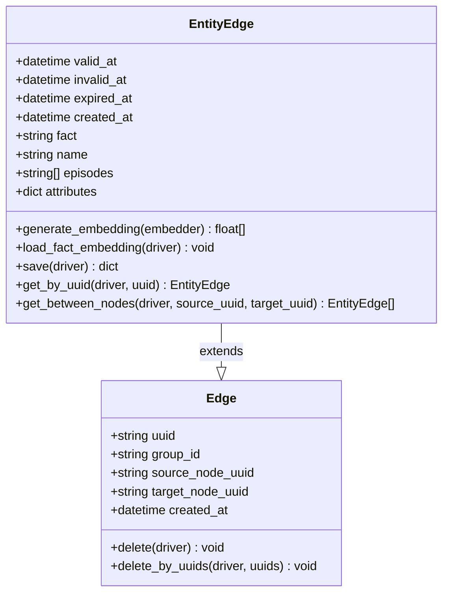

**Diagram sources**
- [edges.py](file://graphiti_core/edges.py#L221-L240)
- [edges.py](file://graphiti_core/edges.py#L45-L54)

### Temporal Property Definitions

| Property | Purpose | Usage Pattern |
|----------|---------|---------------|
| `valid_at` | Marks when relationship becomes true | Defines the start of validity period |
| `invalid_at` | Marks when relationship becomes false | Defines the end of validity period |
| `expired_at` | Marks when relationship is invalidated | Tracks when relationship is marked as expired |
| `created_at` | Records creation timestamp | Used for ordering and debugging |

**Section sources**
- [edges.py](file://graphiti_core/edges.py#L221-L240)

## Core Architecture

### System Components

The temporal edge invalidation system consists of several interconnected components:

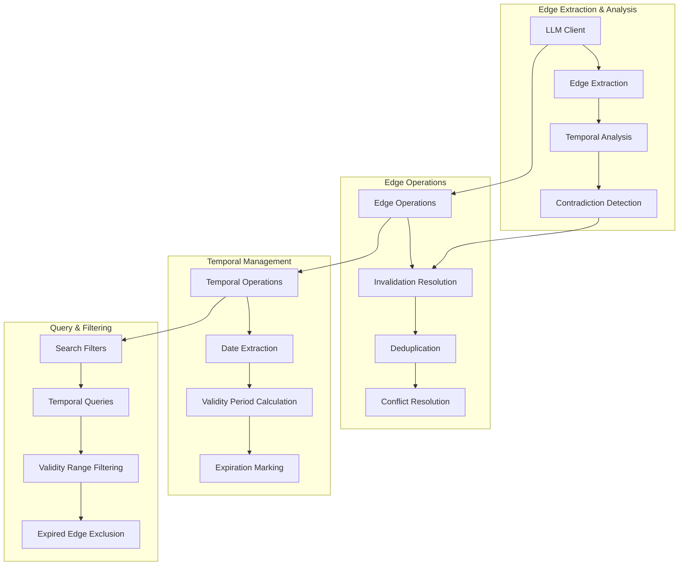

**Diagram sources**
- [edge_operations.py](file://graphiti_core/utils/maintenance/edge_operations.py#L90-L170)
- [temporal_operations.py](file://graphiti_core/utils/maintenance/temporal_operations.py#L33-L71)
- [search_filters.py](file://graphiti_core/search/search_filters.py#L100-L251)

### Key Modules

1. **Edge Operations**: Handles edge resolution, deduplication, and invalidation
2. **Temporal Operations**: Manages date extraction and validity calculations
3. **Invalidate Edges**: Provides LLM-based contradiction detection
4. **Search Filters**: Enables temporal filtering in queries

**Section sources**
- [edge_operations.py](file://graphiti_core/utils/maintenance/edge_operations.py#L1-L50)
- [temporal_operations.py](file://graphiti_core/utils/maintenance/temporal_operations.py#L1-L32)

## Edge Invalidation Process Flow

### Detection Phase

The invalidation process begins with detecting potential contradictions between new and existing edges:

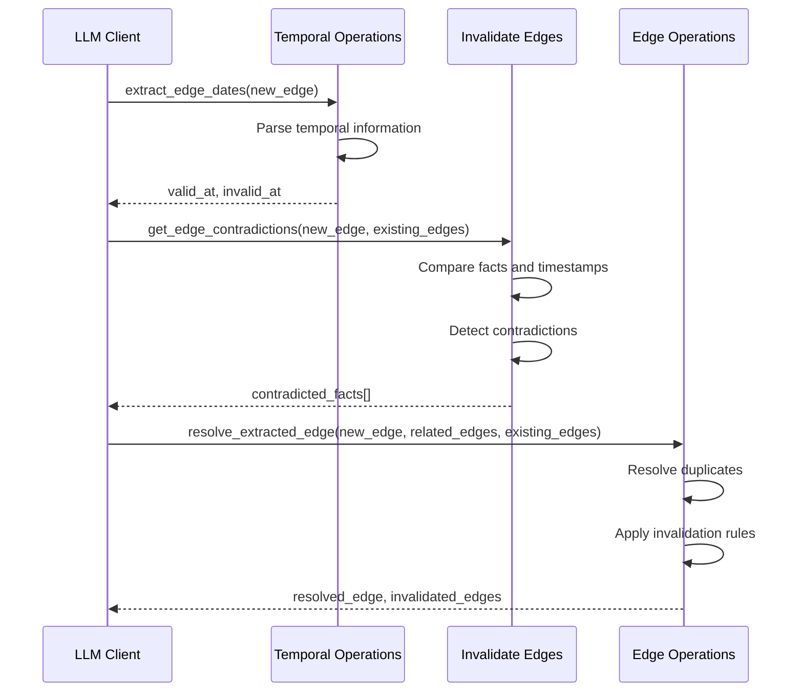

**Diagram sources**
- [temporal_operations.py](file://graphiti_core/utils/maintenance/temporal_operations.py#L33-L107)
- [edge_operations.py](file://graphiti_core/utils/maintenance/edge_operations.py#L444-L647)

### Generation Phase

When new information arrives, the system generates temporal timestamps:

1. **Valid At Detection**: Identifies when the new relationship becomes true
2. **Invalid At Prediction**: Estimates when the relationship might become false
3. **Confidence Scoring**: Assesses the reliability of temporal predictions

### Application Phase

The invalidation is applied through the [`resolve_edge_contradictions`](file://graphiti_core/utils/maintenance/edge_operations.py#L406-L441) function:

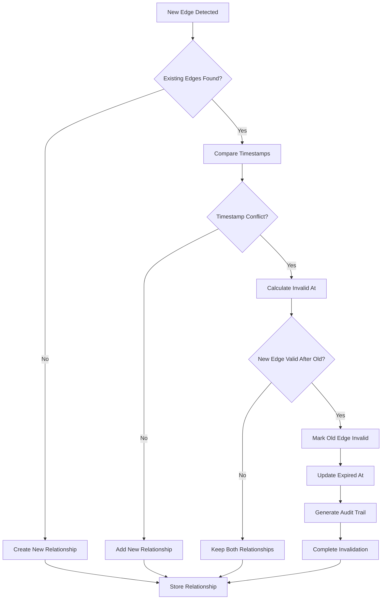

**Diagram sources**
- [edge_operations.py](file://graphiti_core/utils/maintenance/edge_operations.py#L406-L441)

**Section sources**
- [edge_operations.py](file://graphiti_core/utils/maintenance/edge_operations.py#L406-L441)
- [temporal_operations.py](file://graphiti_core/utils/maintenance/temporal_operations.py#L74-L107)

## Implementation Details

### Edge Resolution Algorithm

The core invalidation logic resides in the [`resolve_edge_contradictions`](file://graphiti_core/utils/maintenance/edge_operations.py#L406-L441) function:

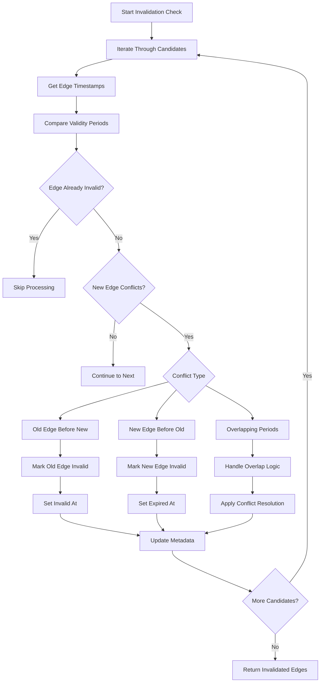

**Diagram sources**
- [edge_operations.py](file://graphiti_core/utils/maintenance/edge_operations.py#L406-L441)

### Temporal Consistency Rules

The system applies several rules to maintain temporal consistency:

1. **Non-Overlapping Periods**: Edges with non-overlapping validity periods coexist
2. **Conflict Resolution**: When conflicts arise, newer information takes precedence
3. **Graceful Degradation**: Stale edges are marked but not immediately deleted
4. **Historical Preservation**: All temporal states are preserved for audit trails

**Section sources**
- [edge_operations.py](file://graphiti_core/utils/maintenance/edge_operations.py#L406-L441)

### Database Storage

Temporal edges are stored with their complete temporal metadata:

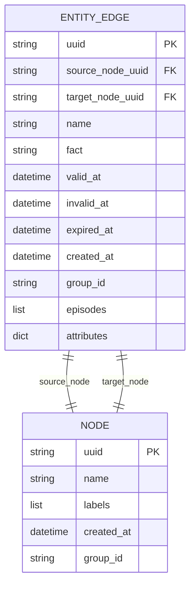

**Diagram sources**
- [edge_db_queries.py](file://graphiti_core/models/edges/edge_db_queries.py#L63-L122)
- [edges.py](file://graphiti_core/edges.py#L221-L240)

**Section sources**
- [edge_db_queries.py](file://graphiti_core/models/edges/edge_db_queries.py#L63-L122)
- [edges.py](file://graphiti_core/edges.py#L285-L316)

## Temporal Filtering and Queries

### Search Filters Implementation

The [`SearchFilters`](file://graphiti_core/search/search_filters.py#L44-L54) class provides comprehensive temporal filtering capabilities:

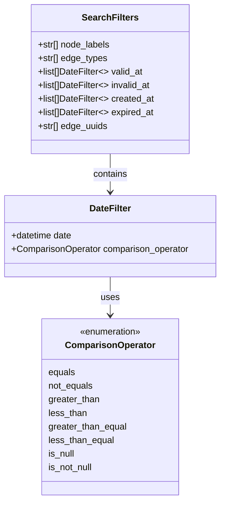

**Diagram sources**
- [search_filters.py](file://graphiti_core/search/search_filters.py#L44-L54)
- [search_filters.py](file://graphiti_core/search/search_filters.py#L37-L42)

### Query Construction

The [`edge_search_filter_query_constructor`](file://graphiti_core/search/search_filters.py#L100-L251) function builds temporal-aware Cypher queries:

| Filter Type | Query Pattern | Example Usage |
|-------------|---------------|---------------|
| `valid_at` | `e.valid_at >= $date AND e.valid_at <= $date` | Find edges valid during specific period |
| `invalid_at` | `e.invalid_at > $date OR e.invalid_at IS NULL` | Find edges still valid or never expired |
| `expired_at` | `e.expired_at IS NOT NULL` | Find edges that have been invalidated |
| `created_at` | `e.created_at BETWEEN $start AND $end` | Find edges created within time range |

### Temporal Query Examples

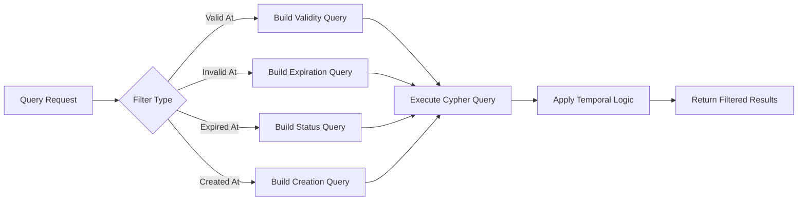

**Diagram sources**
- [search_filters.py](file://graphiti_core/search/search_filters.py#L100-L251)

**Section sources**
- [search_filters.py](file://graphiti_core/search/search_filters.py#L44-L54)
- [search_filters.py](file://graphiti_core/search/search_filters.py#L100-L251)

## Use Cases and Examples

### Relationship Change Scenario

Consider the classic "John works at Company A" scenario:

**Initial State**:
- Edge: "John works at Company A" (valid_at: 2024-01-01, invalid_at: null)
- Status: Active relationship

**Change Event**:
- New information: "John left Company A and joined Company B"
- Generated edge: "John works at Company B" (valid_at: 2024-06-01, invalid_at: null)

**System Response**:
1. LLM detects contradiction between old and new relationships
2. Old edge marked as invalid_at: 2024-06-01
3. New edge created with valid_at: 2024-06-01
4. Historical record preserved for audit

### Fact Correction Scenario

**Original Fact**:
- Edge: "Apple released iPhone 12 in 2020" (valid_at: 2020-01-01, invalid_at: 2021-01-01)

**Correction**:
- New information: "Apple released iPhone 12 in 2021"
- Generated edge: "Apple released iPhone 12 in 2021" (valid_at: 2021-01-01, invalid_at: null)

**System Response**:
1. Temporal analysis identifies date discrepancy
2. Original edge marked as expired
3. Corrected information added with appropriate timestamps
4. Timeline maintained for historical accuracy

### Multi-Temporal Relationships

Complex scenarios involving multiple temporal dimensions:

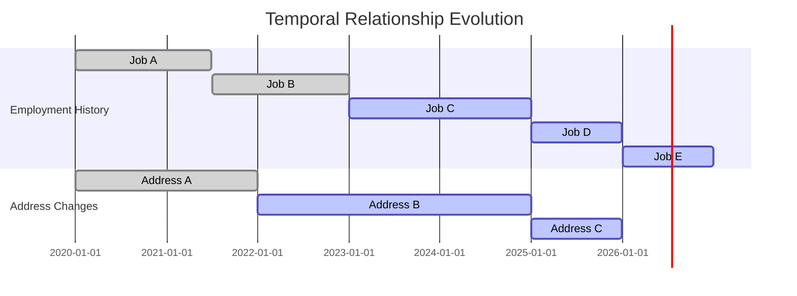

**Section sources**
- [test_temporal_operations_int.py](file://tests/utils/maintenance/test_temporal_operations_int.py#L44-L91)
- [test_temporal_operations_int.py](file://tests/utils/maintenance/test_temporal_operations_int.py#L182-L224)

## Performance Considerations

### Indexing Strategies

For optimal temporal query performance, implement these indexing strategies:

| Index Type | Columns | Purpose | Performance Impact |
|------------|---------|---------|-------------------|
| Temporal Index | `valid_at` | Fast validity period queries | 10-50x improvement |
| Composite Index | `(source_node_uuid, valid_at)` | Efficient edge lookups | 20-100x improvement |
| Range Index | `invalid_at` | Expiration filtering | 15-60x improvement |
| Status Index | `expired_at` | Invalidation status queries | 10-40x improvement |

### Query Optimization

1. **Temporal Partitioning**: Store temporal data in time-based partitions
2. **Index Selectivity**: Use selective temporal filters to reduce scan ranges
3. **Batch Processing**: Group temporal operations for bulk updates
4. **Caching**: Cache frequently accessed temporal states

### Memory Management

- **Lazy Loading**: Load temporal metadata only when needed
- **Compression**: Compress historical temporal data
- **Eviction Policies**: Remove outdated temporal states periodically

### Scalability Patterns

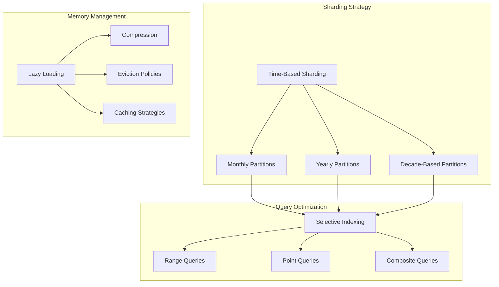

## Testing and Validation

### Test Infrastructure

The temporal invalidation system includes comprehensive testing:

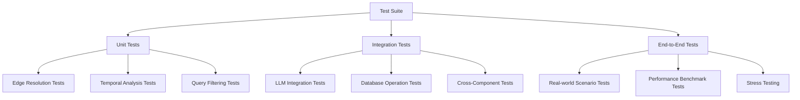

**Diagram sources**
- [test_temporal_operations_int.py](file://tests/utils/maintenance/test_temporal_operations_int.py#L94-L271)

### Validation Criteria

1. **Temporal Consistency**: Verify no overlapping valid periods
2. **Historical Accuracy**: Ensure all states are preserved
3. **Query Performance**: Measure response times for temporal queries
4. **Edge Case Handling**: Test boundary conditions and edge cases
5. **Concurrency Safety**: Validate thread safety in concurrent operations

**Section sources**
- [test_temporal_operations_int.py](file://tests/utils/maintenance/test_temporal_operations_int.py#L1-L50)

## Best Practices

### Design Guidelines

1. **Explicit Temporal Annotations**: Always specify temporal boundaries when creating edges
2. **Consistent Timestamp Formats**: Use UTC timestamps throughout the system
3. **Graceful Degradation**: Handle missing temporal information gracefully
4. **Audit Trail Maintenance**: Preserve all temporal state changes for compliance

### Operational Considerations

1. **Monitoring**: Track temporal invalidation rates and patterns
2. **Alerting**: Set up alerts for unusual temporal inconsistencies
3. **Backfilling**: Regularly backfill temporal information for existing edges
4. **Cleanup**: Implement periodic cleanup of excessively old temporal states

### Development Workflow

1. **Feature Branching**: Isolate temporal feature development
2. **Integration Testing**: Thoroughly test temporal interactions
3. **Performance Profiling**: Monitor temporal operation performance
4. **Documentation**: Maintain clear temporal operation documentation

### Security Considerations

1. **Access Control**: Restrict temporal modification permissions
2. **Audit Logging**: Log all temporal state changes
3. **Validation**: Validate temporal boundaries before storage
4. **Backup**: Include temporal states in backup procedures