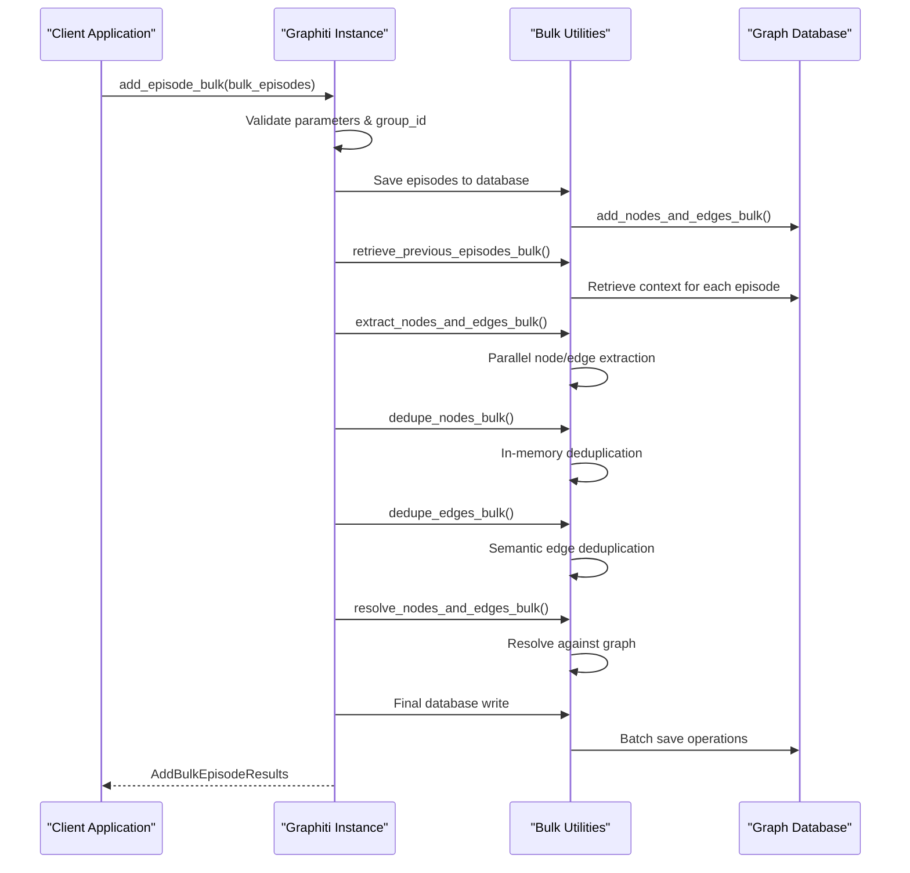
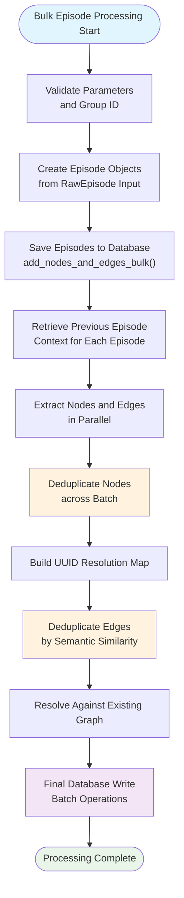
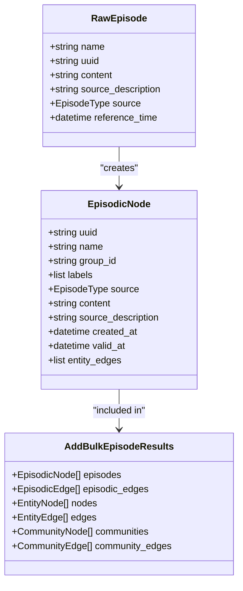
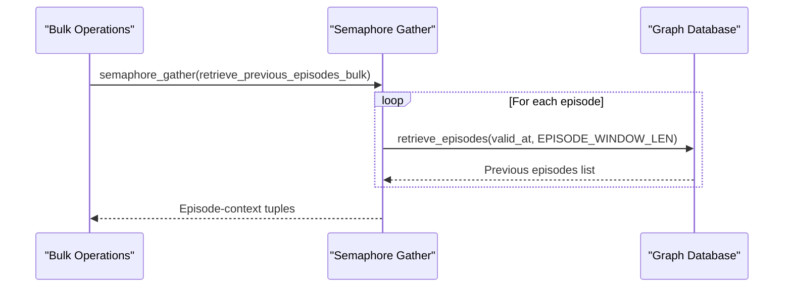
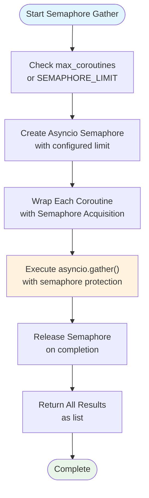
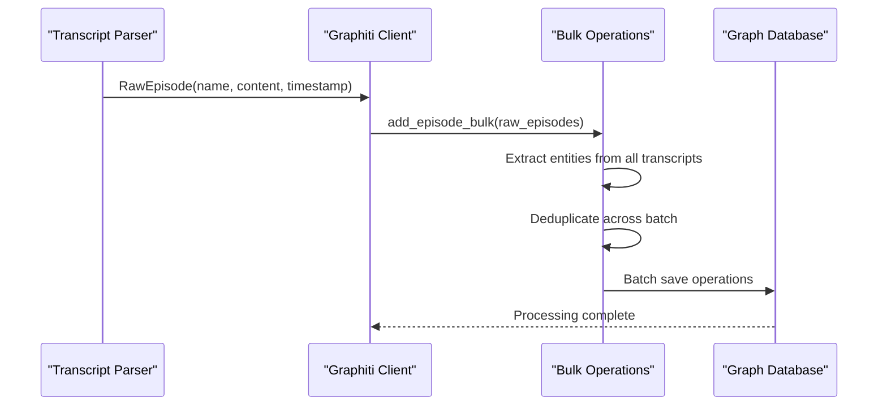

# Bulk Ingestion Operations

<cite>
**Referenced Files in This Document**
- [graphiti.py](file://graphiti_core/graphiti.py)
- [bulk_utils.py](file://graphiti_core/utils/bulk_utils.py)
- [helpers.py](file://graphiti_core/helpers.py)
- [podcast_runner.py](file://examples/podcast/podcast_runner.py)
- [ecommerce/runner.py](file://examples/ecommerce/runner.py)
- [quickstart_neo4j.py](file://examples/quickstart/quickstart_neo4j.py)
- [node_db_queries.py](file://graphiti_core/models/nodes/node_db_queries.py)
</cite>

## Table of Contents
1. [Introduction](#introduction)
2. [Understanding Bulk Ingestion](#understanding-bulk-ingestion)
3. [The add_episode_bulk Method](#the-add_episode_bulk-method)
4. [Optimized Workflow Architecture](#optimized-workflow-architecture)
5. [Internal Processing Steps](#internal-processing-steps)
6. [Concurrency Control with Semaphore Gather](#concurrency-control-with-semaphore-gather)
7. [Configuration and Performance Tuning](#configuration-and-performance-tuning)
8. [Use Cases and Best Practices](#use-cases-and-best-practices)
9. [Limitations and Trade-offs](#limitations-and-trade-offs)
10. [Practical Examples](#practical-examples)
11. [Troubleshooting and Monitoring](#troubleshooting-and-monitoring)

## Introduction

Bulk ingestion operations in Graphiti represent a highly optimized approach to processing multiple episodes simultaneously, designed for scenarios requiring high-throughput data loading. The `add_episode_bulk` method enables efficient batch processing of episodes, significantly reducing overhead compared to individual episode ingestion while maintaining data integrity through sophisticated deduplication and resolution mechanisms.

Unlike individual episode ingestion (`add_episode`), bulk operations prioritize performance and throughput by implementing specialized workflows that minimize redundant computations and database operations. This makes bulk ingestion ideal for initial data migrations, historical data backfills, and large-scale data loading scenarios.

## Understanding Bulk Ingestion

### Fundamental Differences from Individual Ingestion

Bulk ingestion differs fundamentally from individual episode processing in several key aspects:

**Performance Optimization**: Bulk operations eliminate repeated context retrieval and reduce database round-trips by processing multiple episodes in coordinated batches.

**Memory-Based Deduplication**: Instead of resolving duplicates against the live graph for each episode individually, bulk ingestion performs intelligent deduplication across the entire batch in memory.

**Batch Database Operations**: All database writes occur in a single transaction, minimizing overhead and ensuring atomicity across all operations.

**Reduced Validation Overhead**: Certain validation steps are optimized or skipped to maximize throughput while maintaining data quality.

### When to Choose Bulk Ingestion

Choose bulk ingestion when:
- Processing large datasets (hundreds to thousands of episodes)
- Performing initial data migrations
- Backfilling historical data
- Loading data from external systems
- When temporal accuracy requirements are relaxed

Choose individual ingestion when:
- Real-time processing is required
- Temporal accuracy is critical
- Edge invalidation is necessary
- Date extraction is required

## The add_episode_bulk Method

The `add_episode_bulk` method serves as the primary interface for bulk ingestion operations, accepting a list of `RawEpisode` objects and orchestrating the entire processing pipeline.

**Diagram sources**
- [graphiti.py](file://graphiti_core/graphiti.py#L815-L993)
- [bulk_utils.py](file://graphiti_core/utils/bulk_utils.py#L128-L254)

**Section sources**
- [graphiti.py](file://graphiti_core/graphiti.py#L815-L993)

## Optimized Workflow Architecture

### High-Level Processing Pipeline

The bulk ingestion workflow follows a sophisticated multi-stage architecture designed for maximum efficiency:

**Diagram sources**
- [graphiti.py](file://graphiti_core/graphiti.py#L863-L993)
- [bulk_utils.py](file://graphiti_core/utils/bulk_utils.py#L256-L497)

### Key Architectural Principles

**Parallel Processing**: All computationally intensive operations leverage parallel execution through the semaphore_gather mechanism, enabling efficient utilization of available system resources.

**Memory Optimization**: Intelligent caching and in-memory processing minimize disk I/O and network latency, particularly beneficial for large datasets.

**Transaction Management**: All database operations occur within a single transaction, ensuring atomicity and consistency while minimizing transaction overhead.

**Resource Containment**: Built-in concurrency controls prevent system overload and ensure predictable performance characteristics.

## Internal Processing Steps

### Step 1: Episode Creation and Validation

The bulk ingestion process begins with comprehensive validation and episode object creation:

**Diagram sources**
- [bulk_utils.py](file://graphiti_core/utils/bulk_utils.py#L101-L108)
- [graphiti.py](file://graphiti_core/graphiti.py#L114-L121)

### Step 2: Batch Database Operations

The `add_nodes_and_edges_bulk` function orchestrates efficient database operations across multiple episode types:

**Episode Node Processing**: Handles episodic nodes with specialized MERGE operations that preserve existing data while updating relevant fields.

**Entity Node Processing**: Manages entity nodes with embedding generation and attribute normalization across different database providers.

**Edge Processing**: Coordinates both episodic and entity edge creation with proper pointer resolution and embedding generation.

**Section sources**
- [bulk_utils.py](file://graphiti_core/utils/bulk_utils.py#L128-L254)
- [node_db_queries.py](file://graphiti_core/models/nodes/node_db_queries.py#L32-L89)

### Step 3: Context Retrieval and Preparation

The system retrieves contextual information for each episode to enable intelligent processing:

**Diagram sources**
- [bulk_utils.py](file://graphiti_core/utils/bulk_utils.py#L110-L125)

**Section sources**
- [bulk_utils.py](file://graphiti_core/utils/bulk_utils.py#L110-L125)

### Step 4: Node and Edge Extraction

The extraction phase employs parallel processing to maximize throughput:

**Node Extraction**: Identifies entities and relationships from episode content using LLM-powered extraction with context-aware processing.

**Edge Extraction**: Creates relationships between identified entities with intelligent type inference and validation.

**Parallel Execution**: Both node and edge extraction occur concurrently across all episodes in the batch.

**Section sources**
- [bulk_utils.py](file://graphiti_core/utils/bulk_utils.py#L256-L286)

### Step 5: Deduplication Strategies

Bulk ingestion implements sophisticated deduplication strategies that operate across the entire batch:

**Two-Pass Node Deduplication**: First pass resolves against the live graph, second pass catches intra-batch duplicates using similarity heuristics.

**Semantic Edge Deduplication**: Uses embedding similarity and fact comparison to identify and merge equivalent relationships.

**UUID Resolution Mapping**: Maintains comprehensive mapping between original and canonical UUIDs for consistent pointer resolution.

**Section sources**
- [bulk_utils.py](file://graphiti_core/utils/bulk_utils.py#L289-L497)

### Step 6: Graph Resolution and Final Processing

The final stage resolves extracted entities and relationships against the existing graph:

**Pointer Resolution**: Updates edge pointers to reference canonical entities using the deduplication mapping.

**Attribute Extraction**: Enriches resolved nodes with additional attributes and metadata.

**Edge Validation**: Ensures edge validity and resolves conflicts using LLM-powered reasoning.

**Section sources**
- [graphiti.py](file://graphiti_core/graphiti.py#L467-L574)

## Concurrency Control with Semaphore Gather

### Understanding Semaphore Mechanism

The semaphore_gather function provides controlled concurrency for bulk operations, preventing system overload while maximizing throughput:

**Diagram sources**
- [helpers.py](file://graphiti_core/helpers.py#L105-L116)

### Configuration and Tuning

The semaphore mechanism operates with configurable limits that balance performance and resource consumption:

**Default Limits**: By default, `SEMAPHORE_LIMIT` is set to 20 concurrent operations, providing optimal throughput for most scenarios.

**Environment Override**: The `SEMAPHORE_LIMIT` environment variable allows runtime adjustment based on system capabilities and LLM provider constraints.

**Dynamic Adjustment**: The `max_coroutines` parameter in individual operations can override the global limit for specific use cases.

**Rate Limiting Protection**: Lower limits (typically 10) help prevent 429 rate limit errors from LLM providers during high-volume operations.

**Section sources**
- [helpers.py](file://graphiti_core/helpers.py#L35-L36)
- [helpers.py](file://graphiti_core/helpers.py#L105-L116)

## Configuration and Performance Tuning

### Environment Variables

Key configuration options that affect bulk ingestion performance:

| Variable | Default Value | Description | Impact |
|----------|---------------|-------------|---------|
| `SEMAPHORE_LIMIT` | 20 | Maximum concurrent operations | Controls memory usage and prevents rate limiting |
| `USE_PARALLEL_RUNTIME` | false | Enable parallel processing mode | Affects CPU utilization patterns |
| `MAX_REFLEXION_ITERATIONS` | 0 | LLM refinement iterations | Balances accuracy vs. performance |

### Performance Optimization Strategies

**Batch Size Optimization**: While Graphiti doesn't enforce explicit batch size limits, practical considerations suggest processing 100-1000 episodes per bulk operation for optimal performance.

**Memory Management**: Monitor memory usage during large bulk operations and consider chunking very large datasets into smaller batches.

**Database Connection Pooling**: Ensure adequate database connection pooling to handle concurrent bulk operations efficiently.

**Provider-Specific Optimizations**: Different graph database providers may benefit from specific tuning approaches based on their performance characteristics.

## Use Cases and Best Practices

### Ideal Use Cases

**Initial Data Migration**: Bulk ingestion excels at migrating existing knowledge bases or historical data into Graphiti, providing significant speed improvements over individual processing.

**Historical Data Backfilling**: When adding historical context to existing graphs, bulk operations enable rapid data loading while maintaining consistency.

**System Onboarding**: During system deployment, bulk ingestion facilitates quick population of initial knowledge bases with minimal operational overhead.

**Batch Data Import**: When integrating with external systems that provide data in batch formats, bulk ingestion offers the most efficient import mechanism.

### Implementation Best Practices

**Data Preparation**: Ensure raw episode data is properly formatted and validated before bulk ingestion to minimize processing failures.

**Progress Monitoring**: Implement progress tracking for large bulk operations to monitor completion rates and identify potential bottlenecks.

**Error Handling**: Design robust error handling that can gracefully handle partial failures and enable resumption of interrupted operations.

**Resource Planning**: Monitor system resources during bulk operations and adjust concurrency limits based on observed performance characteristics.

**Section sources**
- [podcast_runner.py](file://examples/podcast/podcast_runner.py#L101-L108)
- [ecommerce/runner.py](file://examples/ecommerce/runner.py#L112-L121)

## Limitations and Trade-offs

### Reduced Temporal Accuracy

**Skip Edge Invalidation**: Bulk operations intentionally skip edge invalidation, which may lead to temporary inconsistencies in rapidly changing relationships.

**Date Extraction Limitations**: Date extraction operations are not performed during bulk ingestion, potentially affecting temporal reasoning capabilities.

**Context Window Constraints**: The system uses a fixed episode window for context retrieval, which may not capture long-term relationships in some scenarios.

### Data Quality Considerations

**Intra-Batch Deduplication**: While effective, batch-level deduplication may miss opportunities to resolve against the broader graph context.

**Semantic Similarity Thresholds**: Edge deduplication relies on configurable similarity thresholds that may need tuning for specific domains.

**LLM Provider Dependencies**: Performance and accuracy depend heavily on the underlying LLM provider's capabilities and response times.

### Operational Constraints

**Memory Requirements**: Large bulk operations consume significant memory for in-memory processing and deduplication.

**Transaction Size Limits**: Very large batches may exceed database transaction size limits, requiring chunking strategies.

**Concurrent Operation Limits**: Semaphore limits protect against system overload but may constrain throughput in high-capacity environments.

## Practical Examples

### Podcast Data Processing Example

The podcast example demonstrates bulk ingestion for processing large transcript datasets:

**Diagram sources**
- [podcast_runner.py](file://examples/podcast/podcast_runner.py#L90-L108)

### E-commerce Product Data Example

The e-commerce example shows bulk ingestion for structured product data:

**Data Structure**: Products are loaded as JSON-formatted episodes with rich metadata and relationships.

**Entity Types**: Custom entity types define product categories, brands, and specifications.

**Edge Types**: Relationship types capture supplier connections, product associations, and categorizations.

**Section sources**
- [ecommerce/runner.py](file://examples/ecommerce/runner.py#L102-L121)

### Quickstart Integration Example

The quickstart example demonstrates basic bulk ingestion patterns:

**Episode Collection**: Multiple episodes are prepared and processed in a single bulk operation.

**Sequential Processing**: Individual episodes are processed sequentially to demonstrate the workflow.

**Result Validation**: Processing results are validated to ensure successful ingestion.

**Section sources**
- [quickstart_neo4j.py](file://examples/quickstart/quickstart_neo4j.py#L82-L129)

## Troubleshooting and Monitoring

### Common Issues and Solutions

**Memory Exhaustion**: Large bulk operations may exhaust available memory. Solution: Reduce batch size or increase system memory allocation.

**Rate Limiting Errors**: LLM provider rate limits can interrupt bulk operations. Solution: Adjust `SEMAPHORE_LIMIT` to reduce concurrent requests.

**Timeout Errors**: Long-running bulk operations may timeout. Solution: Increase database connection timeouts or implement chunking.

**Duplicate Processing**: Inconsistent results may indicate duplicate episode processing. Solution: Implement proper deduplication logic before bulk ingestion.

### Monitoring and Observability

**Performance Metrics**: Track processing duration, throughput rates, and resource utilization during bulk operations.

**Error Tracking**: Monitor error rates and patterns to identify systemic issues or data quality problems.

**Resource Monitoring**: Observe memory usage, CPU utilization, and database connection metrics during bulk processing.

**Progress Indicators**: Implement progress tracking for long-running bulk operations to enable monitoring and intervention when needed.

### Debugging Strategies

**Logging Configuration**: Enable detailed logging to trace the bulk ingestion workflow and identify bottlenecks.

**Sample Processing**: Test with small subsets of data to validate processing logic before scaling to full datasets.

**Incremental Processing**: Process data in smaller chunks to isolate issues and enable faster iteration cycles.

**Resource Profiling**: Use profiling tools to identify memory leaks, CPU bottlenecks, or database performance issues.