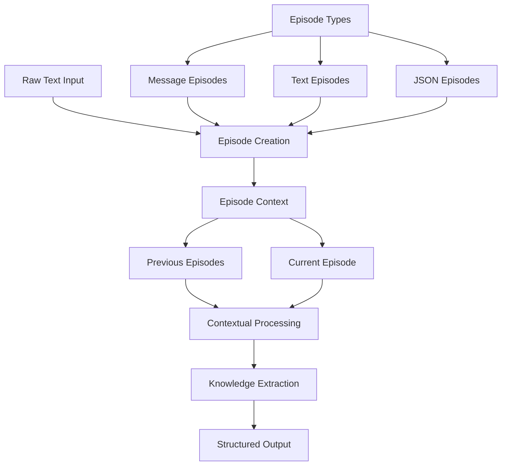
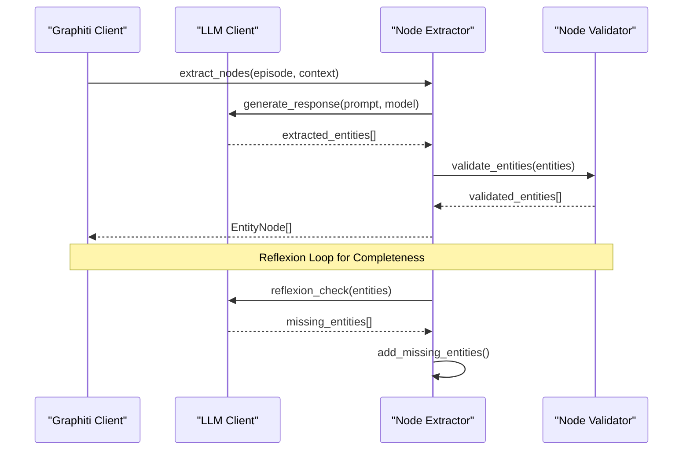
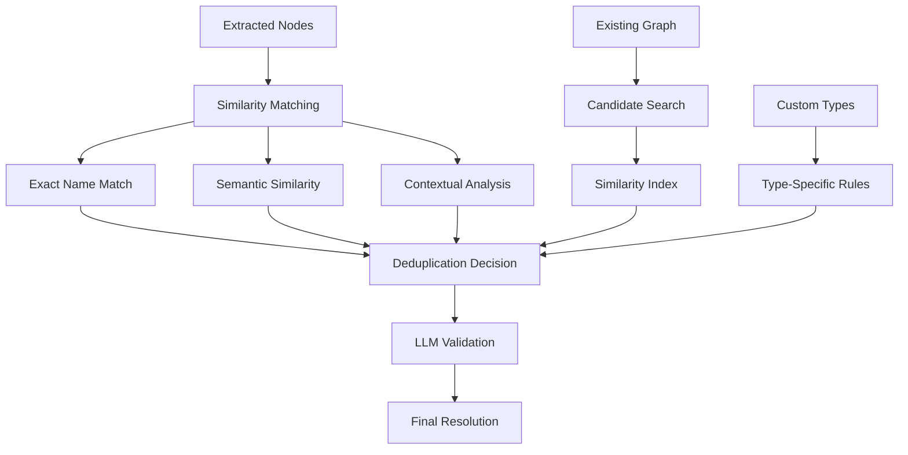
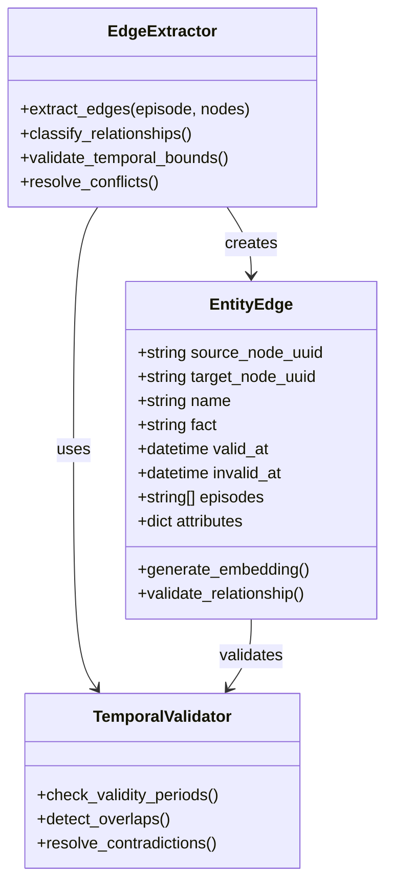
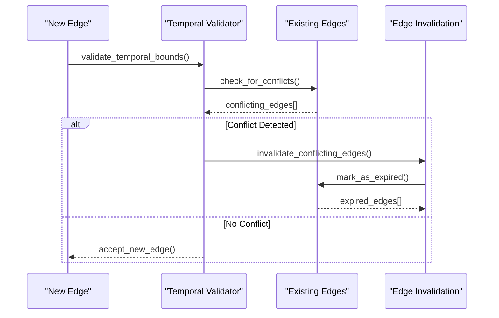
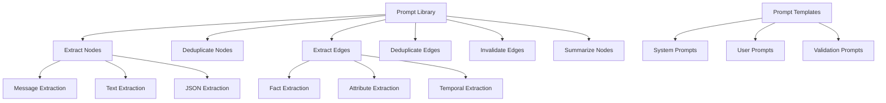
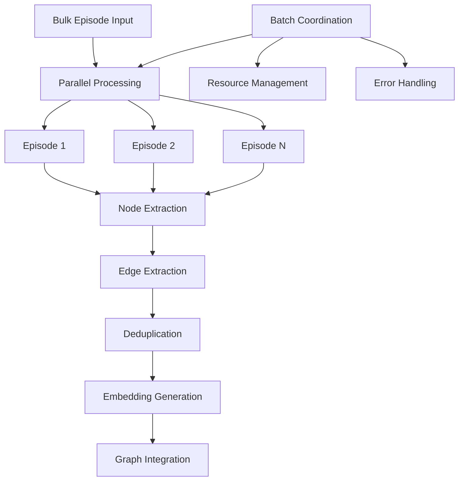
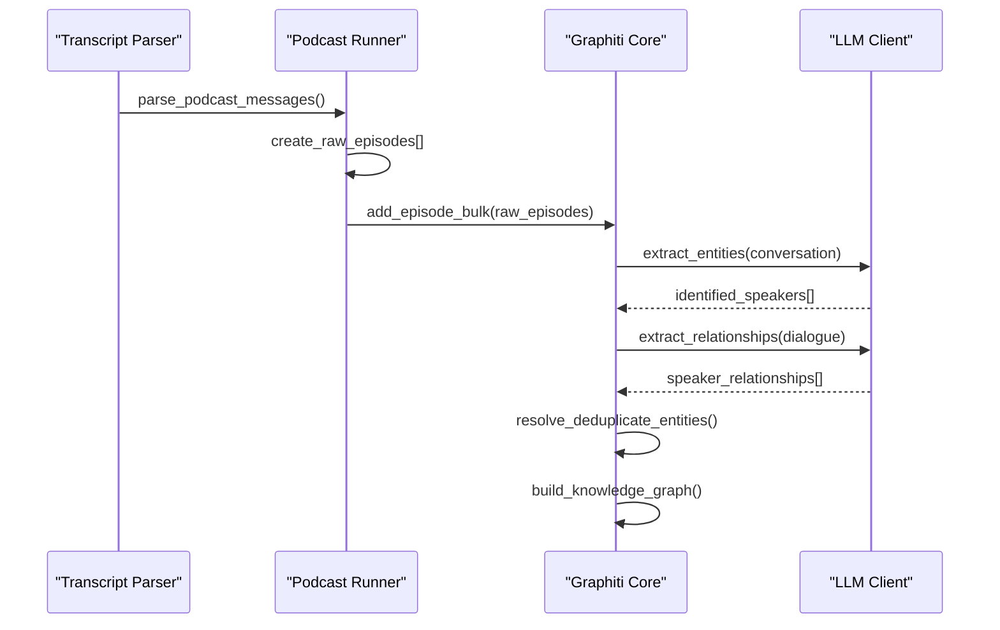

# Data Ingestion Pipeline

<cite>
**Referenced Files in This Document**
- [graphiti.py](file://graphiti_core/graphiti.py)
- [node_operations.py](file://graphiti_core/utils/maintenance/node_operations.py)
- [edge_operations.py](file://graphiti_core/utils/maintenance/edge_operations.py)
- [bulk_utils.py](file://graphiti_core/utils/bulk_utils.py)
- [lib.py](file://graphiti_core/prompts/lib.py)
- [extract_nodes.py](file://graphiti_core/prompts/extract_nodes.py)
- [extract_edges.py](file://graphiti_core/prompts/extract_edges.py)
- [podcast_runner.py](file://examples/podcast/podcast_runner.py)
- [transcript_parser.py](file://examples/podcast/transcript_parser.py)
- [runner.py](file://examples/ecommerce/runner.py)
- [podcast_transcript.txt](file://examples/podcast/podcast_transcript.txt)
- [manybirds_products.json](file://examples/data/manybirds_products.json)
</cite>

## Table of Contents
1. [Introduction](#introduction)
2. [Episode-Based Ingestion Model](#episode-based-ingestion-model)
3. [Node Extraction Process](#node-extraction-process)
4. [Node Resolution and Deduplication](#node-resolution-and-deduplication)
5. [Edge Extraction and Relationship Identification](#edge-extraction-and-relationship-identification)
6. [Temporal Edge Invalidation](#temporal-edge-invalidation)
7. [Prompt System and LLM Guidance](#prompt-system-and-llm-guidance)
8. [Bulk Ingestion Operations](#bulk-ingestion-operations)
9. [Performance Considerations](#performance-considerations)
10. [Real-World Examples](#real-world-examples)
11. [Conclusion](#conclusion)

## Introduction

Graphiti's data ingestion pipeline represents a sophisticated approach to transforming raw text into structured knowledge graphs. The system employs an episode-based model where discrete units of information are processed through multiple stages of extraction, validation, and integration. This approach enables the creation of rich, interconnected knowledge graphs that maintain temporal consistency and semantic coherence.

The ingestion pipeline operates on the principle that knowledge emerges from the relationships between entities rather than isolated facts. By processing content as discrete episodes, Graphiti can maintain temporal context while building comprehensive representations of domains, conversations, and datasets.

## Episode-Based Ingestion Model

### Core Concepts

The episode-based ingestion model treats each piece of content as an "episode" that captures a moment of knowledge. Episodes serve as atomic units of information that can be processed independently while maintaining contextual relationships with previous episodes.

**Diagram sources**
- [graphiti.py](file://graphiti_core/graphiti.py#L611-L800)
- [bulk_utils.py](file://graphiti_core/utils/bulk_utils.py#L101-L108)

### Episode Types and Processing

Graphiti supports three primary episode types, each optimized for different content formats:

| Episode Type | Purpose | Content Format | Use Case |
|--------------|---------|----------------|----------|
| `message` | Conversational content | Structured dialogues | Podcast transcripts, chat logs |
| `text` | Free-form text | Unstructured narratives | Articles, documents |
| `json` | Structured data | JSON objects | Product catalogs, APIs |

**Section sources**
- [extract_nodes.py](file://graphiti_core/prompts/extract_nodes.py#L86-L132)
- [extract_edges.py](file://graphiti_core/prompts/extract_edges.py#L67-L136)

### Episode Lifecycle Management

Each episode undergoes a comprehensive lifecycle that ensures data quality and temporal consistency:

1. **Creation**: Episodes are instantiated with metadata including timestamps, sources, and group identifiers
2. **Context Assembly**: Previous episodes are retrieved to provide historical context
3. **Processing**: Content is analyzed for entities and relationships
4. **Validation**: Extracted information is validated against existing knowledge
5. **Integration**: Results are merged into the knowledge graph

**Section sources**
- [graphiti.py](file://graphiti_core/graphiti.py#L694-L720)

## Node Extraction Process

### LLM-Driven Entity Recognition

The node extraction process leverages Large Language Models to identify and classify entities within episode content. This process occurs in multiple phases, each employing specialized prompts and validation mechanisms.

**Diagram sources**
- [node_operations.py](file://graphiti_core/utils/maintenance/node_operations.py#L88-L208)
- [extract_nodes.py](file://graphiti_core/prompts/extract_nodes.py#L86-L200)

### Entity Classification and Typing

Entities are classified using a hierarchical type system that supports custom entity types defined through Pydantic models. The classification process considers both explicit type definitions and implicit semantic relationships.

**Section sources**
- [node_operations.py](file://graphiti_core/utils/maintenance/node_operations.py#L102-L121)
- [extract_nodes.py](file://graphiti_core/prompts/extract_nodes.py#L28-L38)

### Schema Validation with Pydantic Models

The system employs Pydantic models for schema validation, ensuring that extracted entities conform to predefined structures and constraints. This validation occurs at multiple levels:

1. **Type Definition Validation**: Ensures entity types match declared schemas
2. **Attribute Validation**: Verifies that extracted attributes conform to model specifications
3. **Relationship Validation**: Confirms that entity relationships maintain logical consistency

**Section sources**
- [node_operations.py](file://graphiti_core/utils/maintenance/node_operations.py#L539-L541)

## Node Resolution and Deduplication

### Multi-Level Deduplication Strategy

Graphiti implements a sophisticated deduplication strategy that operates at multiple levels to ensure graph consistency while preserving semantic distinctions.

**Diagram sources**
- [node_operations.py](file://graphiti_core/utils/maintenance/node_operations.py#L395-L450)
- [bulk_utils.py](file://graphiti_core/utils/bulk_utils.py#L289-L401)

### Deduplication Mechanisms

The deduplication process employs multiple mechanisms working in concert:

1. **Exact String Matching**: Identifies nodes with identical names
2. **Semantic Similarity**: Uses embeddings to detect conceptually equivalent entities
3. **Contextual Analysis**: Considers entity roles and relationships
4. **LLM Validation**: Employs machine learning models for ambiguous cases

**Section sources**
- [node_operations.py](file://graphiti_core/utils/maintenance/node_operations.py#L246-L394)

### UUID Mapping and Resolution

The system maintains comprehensive UUID mappings to track entity resolutions across processing stages. This mapping ensures that references remain consistent even when entities are merged or split during the deduplication process.

**Section sources**
- [bulk_utils.py](file://graphiti_core/utils/bulk_utils.py#L69-L98)

## Edge Extraction and Relationship Identification

### Relationship Detection and Classification

Edge extraction identifies relationships between entities using a combination of linguistic analysis and structural validation. The system distinguishes between various relationship types and maintains temporal awareness of relationship validity.

**Diagram sources**
- [edge_operations.py](file://graphiti_core/utils/maintenance/edge_operations.py#L89-L238)
- [extract_edges.py](file://graphiti_core/prompts/extract_edges.py#L25-L45)

### Fact Extraction and Validation

The edge extraction process employs specialized prompts to identify factual relationships within episode content. These prompts guide the LLM to extract structured facts that can be mapped to knowledge graph edges.

**Section sources**
- [extract_edges.py](file://graphiti_core/prompts/extract_edges.py#L67-L136)

### Relationship Type Mapping

Graphiti supports flexible relationship type mapping that allows custom edge types to be associated with specific entity type combinations. This mapping ensures that relationships remain semantically appropriate for their constituent entities.

**Section sources**
- [edge_operations.py](file://graphiti_core/utils/maintenance/edge_operations.py#L103-L120)

## Temporal Edge Invalidation

### Dynamic Relationship Management

Graphiti's temporal edge invalidation system manages changing relationships over time, ensuring that the knowledge graph reflects the most current understanding of entity interactions.

**Diagram sources**
- [edge_operations.py](file://graphiti_core/utils/maintenance/edge_operations.py#L406-L442)

### Temporal Boundaries and Validity

The system tracks temporal boundaries for all relationships, allowing for precise modeling of how relationships evolve over time. This includes:

1. **Valid At Timestamps**: When a relationship begins to hold
2. **Invalid At Timestamps**: When a relationship ceases to hold  
3. **Expiration Tracking**: Historical records of relationship changes

**Section sources**
- [edge_operations.py](file://graphiti_core/utils/maintenance/edge_operations.py#L205-L220)

### Conflict Resolution Strategies

When temporal conflicts arise, Graphiti employs sophisticated conflict resolution strategies:

- **Chronological Precedence**: Earlier relationships take precedence
- **Explicit Over Implicit**: Explicit statements override inferred relationships
- **Contextual Resolution**: Historical context influences resolution decisions

**Section sources**
- [edge_operations.py](file://graphiti_core/utils/maintenance/edge_operations.py#L641-L646)

## Prompt System and LLM Guidance

### Comprehensive Prompt Library

Graphiti maintains a comprehensive prompt library that guides LLMs through the complex tasks of entity extraction, relationship identification, and knowledge validation.

**Diagram sources**
- [lib.py](file://graphiti_core/prompts/lib.py#L47-L56)
- [extract_nodes.py](file://graphiti_core/prompts/extract_nodes.py#L66-L73)

### Template Specialization

Each prompt template is specialized for specific content types and processing stages:

| Template Category | Purpose | Content Focus |
|-------------------|---------|---------------|
| `extract_message` | Conversation analysis | Speaker identification, dialogue relationships |
| `extract_text` | Document processing | Concept extraction, narrative relationships |
| `extract_json` | Structured data | Property relationships, object hierarchies |
| `reflexion` | Completeness checking | Missing entity detection |
| `extract_attributes` | Detail enrichment | Property extraction, validation |

**Section sources**
- [extract_nodes.py](file://graphiti_core/prompts/extract_nodes.py#L86-L200)
- [extract_edges.py](file://graphiti_core/prompts/extract_edges.py#L67-L136)

### Context-Aware Prompt Generation

Prompts are dynamically generated based on the current processing context, incorporating:

- **Entity Type Definitions**: Custom schemas for entity classification
- **Previous Episode Context**: Historical information for disambiguation
- **Processing Stage**: Appropriate guidance for current task
- **Content Type**: Optimized instructions for specific media types

**Section sources**
- [node_operations.py](file://graphiti_core/utils/maintenance/node_operations.py#L123-L130)

## Bulk Ingestion Operations

### Batch Processing Architecture

Graphiti's bulk ingestion system processes multiple episodes simultaneously while maintaining data consistency and optimizing performance through parallel processing.

**Diagram sources**
- [bulk_utils.py](file://graphiti_core/utils/bulk_utils.py#L256-L286)
- [graphiti.py](file://graphiti_core/graphiti.py#L815-L991)

### Memory-Efficient Processing

The bulk ingestion system employs several strategies to manage memory efficiently:

1. **Chunked Processing**: Large batches are divided into manageable chunks
2. **Streaming Operations**: Data flows through processing stages without full buffering
3. **Incremental Deduplication**: Deduplication occurs incrementally across batches
4. **Resource Pooling**: Shared resources minimize overhead

**Section sources**
- [bulk_utils.py](file://graphiti_core/utils/bulk_utils.py#L66-L67)

### UUID Compression and Mapping

Bulk operations employ sophisticated UUID compression techniques to reduce memory usage and improve processing efficiency. The system maintains directed UUID maps that preserve entity relationships while minimizing storage requirements.

**Section sources**
- [bulk_utils.py](file://graphiti_core/utils/bulk_utils.py#L69-L98)

### Transaction Management

Bulk operations utilize transaction management to ensure atomicity and consistency:

- **Single Transaction Scope**: All operations occur within a single transaction
- **Rollback Capability**: Failed operations trigger automatic rollback
- **Consistency Guarantees**: Atomic commit ensures data integrity

**Section sources**
- [bulk_utils.py](file://graphiti_core/utils/bulk_utils.py#L128-L254)

## Performance Considerations

### Optimization Strategies

Graphiti implements several performance optimization strategies to handle large-scale ingestion efficiently:

#### Parallel Processing
- **Semaphore-Gather Pattern**: Limits concurrent operations to prevent resource exhaustion
- **Asynchronous Operations**: Non-blocking I/O for LLM calls and database operations
- **Pipeline Processing**: Overlapping extraction, validation, and persistence operations

#### Caching and Memoization
- **Embedding Caches**: Reuse computed embeddings to avoid recomputation
- **LLM Response Caching**: Store validated responses to reduce API calls
- **Index Caches**: Maintain frequently accessed indices in memory

#### Resource Management
- **Connection Pooling**: Efficient database connection management
- **Memory Monitoring**: Dynamic adjustment of batch sizes based on available memory
- **Rate Limiting**: Respect API limits for external services

**Section sources**
- [graphiti.py](file://graphiti_core/graphiti.py#L495-L506)
- [node_operations.py](file://graphiti_core/utils/maintenance/node_operations.py#L217-L242)

### Scalability Patterns

The ingestion pipeline supports horizontal scaling through several patterns:

1. **Queue-Based Processing**: Asynchronous processing through message queues
2. **Microservice Architecture**: Distributed processing across multiple services
3. **Batch Size Optimization**: Dynamic adjustment based on system capacity
4. **Load Balancing**: Distribution of processing load across multiple workers

### Performance Monitoring

Graphiti includes comprehensive performance monitoring capabilities:

- **Tracing Integration**: OpenTelemetry support for distributed tracing
- **Metrics Collection**: Real-time performance metrics and alerts
- **Profiling Tools**: Built-in profiling for identifying bottlenecks
- **Resource Tracking**: Monitoring of CPU, memory, and I/O usage

**Section sources**
- [graphiti.py](file://graphiti_core/graphiti.py#L692-L797)

## Real-World Examples

### Podcast Transcription Scenario

The podcast example demonstrates processing conversational content with speaker identification and relationship extraction.

**Diagram sources**
- [podcast_runner.py](file://examples/podcast/podcast_runner.py#L78-L129)
- [transcript_parser.py](file://examples/podcast/transcript_parser.py#L38-L124)

#### Key Features of Podcast Processing

1. **Speaker Disambiguation**: Automatic identification and resolution of speaker references
2. **Temporal Context**: Preservation of conversation timelines and speaker turn sequences
3. **Role Classification**: Distinction between hosts, guests, and narrators
4. **Relationship Mapping**: Identification of interview dynamics and conversational patterns

**Section sources**
- [podcast_runner.py](file://examples/podcast/podcast_runner.py#L60-L77)
- [transcript_parser.py](file://examples/podcast/transcript_parser.py#L8-L124)

### E-Commerce Product Catalog

The e-commerce example showcases structured data ingestion from JSON product catalogs with attribute extraction and categorization.

#### Product Data Processing

The system processes product information through multiple stages:

1. **Schema Recognition**: Automatic detection of product structure
2. **Attribute Extraction**: Identification of product properties (price, color, size)
3. **Category Assignment**: Classification into product categories
4. **Relationship Building**: Identification of product relationships (substitutes, accessories)

**Section sources**
- [runner.py](file://examples/ecommerce/runner.py#L95-L123)

### Conversation Processing

The conversation processing example demonstrates handling of multi-turn dialogues with context preservation and relationship tracking.

#### Dialogue Analysis Features

- **Turn Detection**: Identification of individual conversation turns
- **Reference Resolution**: Linking pronouns to specific entities
- **Context Window Management**: Maintaining relevant conversation history
- **Sentiment Analysis**: Optional sentiment extraction for relationship context

**Section sources**
- [runner.py](file://examples/ecommerce/runner.py#L75-L86)

## Conclusion

Graphiti's data ingestion pipeline represents a sophisticated approach to knowledge graph construction that balances automation with precision. Through its episode-based model, comprehensive prompt system, and robust deduplication mechanisms, the system transforms diverse text sources into coherent, temporal-aware knowledge graphs.

The pipeline's strength lies in its ability to handle complex, evolving relationships while maintaining data quality and performance at scale. The combination of LLM-driven extraction, sophisticated deduplication, and temporal management creates a foundation for rich knowledge discovery and analysis.

Key advantages of the Graphiti ingestion pipeline include:

- **Scalability**: Support for both single-episode and bulk processing
- **Flexibility**: Adaptation to various content types and domains
- **Quality**: Robust validation and deduplication mechanisms
- **Performance**: Optimized processing with resource management
- **Maintainability**: Modular architecture with clear separation of concerns

The system continues to evolve with advances in LLM capabilities and knowledge graph technologies, providing a solid foundation for building intelligent, context-aware applications across diverse domains.