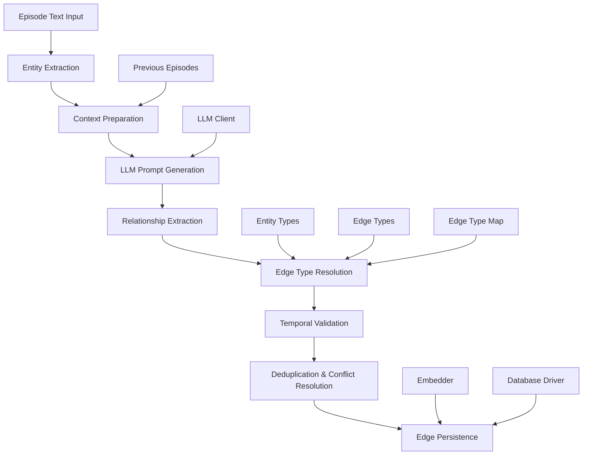
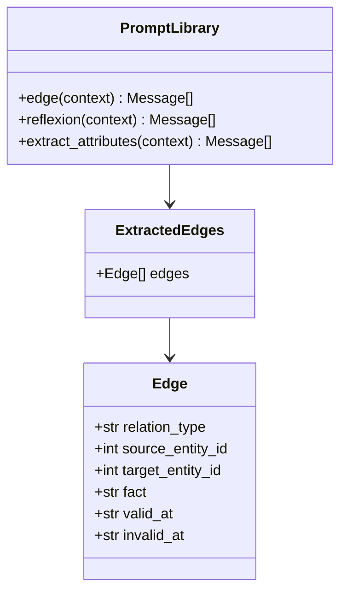
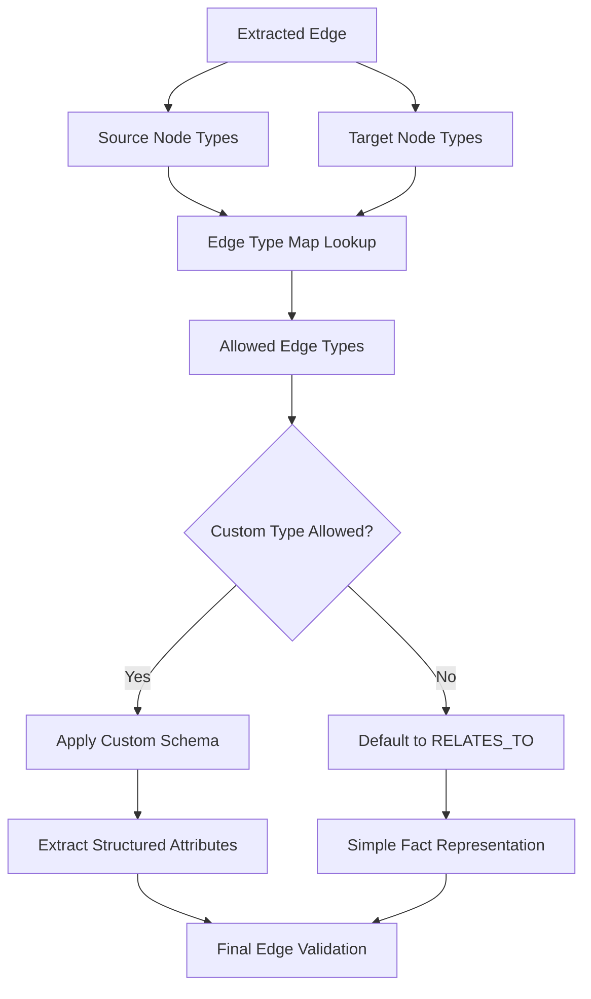
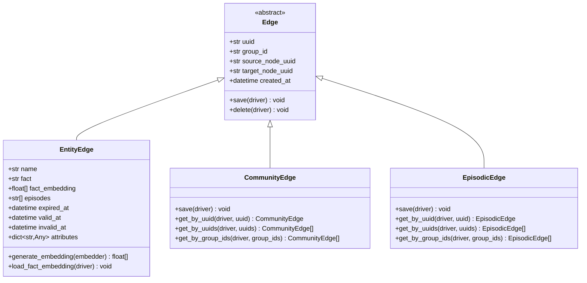
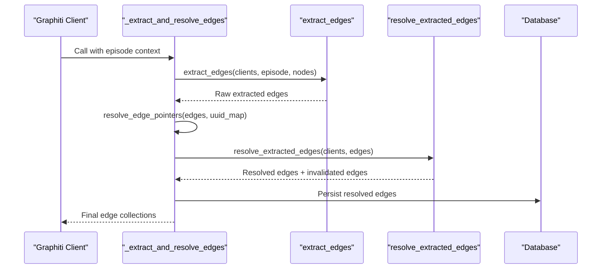
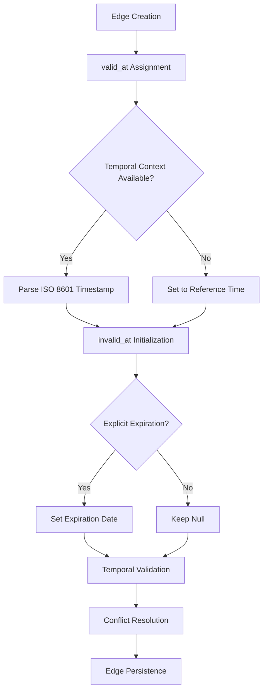
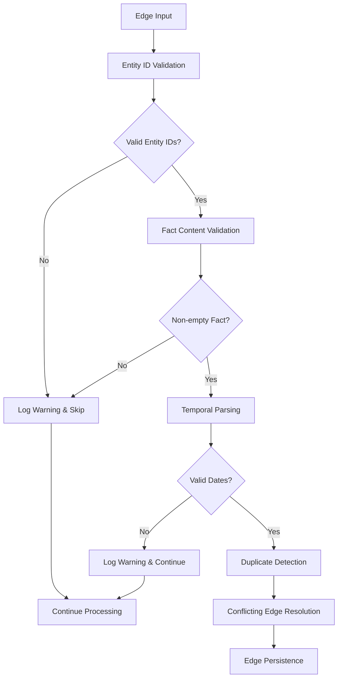
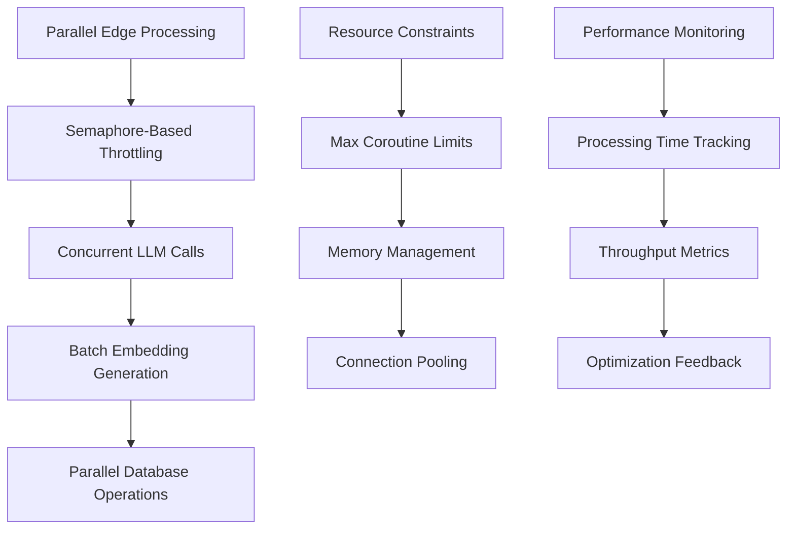

# Edge Extraction

<cite>
**Referenced Files in This Document**
- [extract_edges.py](file://graphiti_core/prompts/extract_edges.py)
- [edge_operations.py](file://graphiti_core/utils/maintenance/edge_operations.py)
- [edges.py](file://graphiti_core/edges.py)
- [edge_db_queries.py](file://graphiti_core/models/edges/edge_db_queries.py)
- [graphiti.py](file://graphiti_core/graphiti.py)
- [graphiti_types.py](file://graphiti_core/graphiti_types.py)
- [temporal_operations.py](file://graphiti_core/utils/maintenance/temporal_operations.py)
- [podcast_runner.py](file://examples/podcast/podcast_runner.py)
- [runner.py](file://examples/ecommerce/runner.py)
- [transcript_parser.py](file://examples/podcast/transcript_parser.py)
</cite>

## Table of Contents
1. [Introduction](#introduction)
2. [Edge Extraction Architecture](#edge-extraction-architecture)
3. [Prompt Templates and LLM Integration](#prompt-templates-and-llm-integration)
4. [Edge Type Resolution and Configuration](#edge-type-resolution-and-configuration)
5. [EntityEdge and CommunityEdge Models](#entityedge-and-communityedge-models)
6. [_extract_and_resolve_edges Internal Method](#_extract_and_resolve_edges-internal-method)
7. [Temporal Validity and Bi-temporal Fields](#temporal-validity-and-bi-temporal-fields)
8. [Edge Case Handling and Validation](#edge-case-handling-and-validation)
9. [Performance Implications and Parallel Processing](#performance-implications-and-parallel-processing)
10. [Database Storage Mechanisms](#database-storage-mechanisms)
11. [Practical Examples](#practical-examples)
12. [Troubleshooting Guide](#troubleshooting-guide)

## Introduction

Edge extraction in Graphiti is the core process that identifies and formalizes relationships between entities from textual content. This sophisticated system leverages Large Language Models (LLMs) to analyze episode text and extract semantic facts, transforming unstructured narrative data into structured knowledge graph relationships. The process involves multiple stages of prompt engineering, temporal reasoning, edge type resolution, and bi-temporal validation to ensure accurate and meaningful relationship extraction.

The edge extraction pipeline transforms natural language descriptions of entity interactions into formalized edges with rich metadata, including temporal validity periods, semantic attributes, and contextual embeddings. This enables the creation of dynamic, time-aware knowledge graphs that can track evolving relationships and resolve temporal contradictions.

## Edge Extraction Architecture

The edge extraction process follows a multi-stage architecture that ensures robust relationship identification and temporal consistency:

**Diagram sources**
- [edge_operations.py](file://graphiti_core/utils/maintenance/edge_operations.py#L89-L238)
- [graphiti.py](file://graphiti_core/graphiti.py#L378-L411)

The architecture emphasizes parallel processing capabilities and maintains context awareness through previous episode analysis. Each stage integrates with specialized components for temporal reasoning, type validation, and conflict resolution.

**Section sources**
- [edge_operations.py](file://graphiti_core/utils/maintenance/edge_operations.py#L89-L238)
- [graphiti.py](file://graphiti_core/graphiti.py#L378-L411)

## Prompt Templates and LLM Integration

Graphiti employs sophisticated prompt templates to guide LLM-based relationship extraction. The primary template structure includes comprehensive context preparation and extraction rules:

**Diagram sources**
- [extract_edges.py](file://graphiti_core/prompts/extract_edges.py#L25-L44)
- [extract_edges.py](file://graphiti_core/prompts/extract_edges.py#L67-L196)

The prompt system incorporates multiple specialized templates:

### Core Edge Extraction Template
The main extraction template provides comprehensive context including entity types, temporal references, and extraction guidelines. It emphasizes entity ID validation, temporal reasoning, and fact paraphrasing requirements.

### Reflexion Template
This template enables iterative refinement by identifying missing facts from previous extraction attempts, ensuring comprehensive coverage of relationship information.

### Attribute Extraction Template
Specialized for extracting structured attributes from edge facts, this template supports custom edge types with predefined schemas.

**Section sources**
- [extract_edges.py](file://graphiti_core/prompts/extract_edges.py#L67-L196)

## Edge Type Resolution and Configuration

Edge type resolution forms a critical component of the extraction process, enabling semantic categorization and validation of extracted relationships:

**Diagram sources**
- [edge_operations.py](file://graphiti_core/utils/maintenance/edge_operations.py#L316-L362)

### Edge Type Map Configuration
The edge type map defines permissible relationships between entity type combinations, enabling semantic validation and custom schema application. This mapping prevents illogical relationships while supporting domain-specific edge types.

### Custom Edge Types
Support for custom edge types allows domain-specific semantic modeling, with automatic attribute extraction and validation based on predefined schemas.

**Section sources**
- [edge_operations.py](file://graphiti_core/utils/maintenance/edge_operations.py#L316-L362)

## EntityEdge and CommunityEdge Models

Graphiti implements distinct edge models optimized for different relationship types and use cases:

**Diagram sources**
- [edges.py](file://graphiti_core/edges.py#L45-L632)

### EntityEdge Properties
EntityEdge extends the base Edge model with rich semantic and temporal metadata, including fact embeddings for similarity search and bi-temporal validity tracking.

### CommunityEdge Properties
CommunityEdge facilitates hierarchical organization and community detection by linking entities to community clusters.

### EpisodicEdge Properties
EpisodicEdge tracks the relationship between episodes and their constituent entities, enabling temporal navigation and episode-specific analysis.

**Section sources**
- [edges.py](file://graphiti_core/edges.py#L221-L632)

## _extract_and_resolve_edges Internal Method

The `_extract_and_resolve_edges` method orchestrates the complete edge extraction and resolution process within the Graphiti class:

**Diagram sources**
- [graphiti.py](file://graphiti_core/graphiti.py#L378-L411)
- [edge_operations.py](file://graphiti_core/utils/maintenance/edge_operations.py#L241-L403)

### Method Responsibilities
The method coordinates multiple extraction and resolution phases, managing parallel processing, UUID mapping, and database persistence. It serves as the central orchestration point for edge lifecycle management.

### Parallel Processing Coordination
Integration with semaphore-based parallel processing ensures efficient handling of multiple edge extraction requests while maintaining resource constraints.

**Section sources**
- [graphiti.py](file://graphiti_core/graphiti.py#L378-L411)

## Temporal Validity and Bi-temporal Fields

Graphiti implements sophisticated temporal reasoning capabilities through bi-temporal edge fields:

**Diagram sources**
- [temporal_operations.py](file://graphiti_core/utils/maintenance/temporal_operations.py#L33-L71)
- [edge_operations.py](file://graphiti_core/utils/maintenance/edge_operations.py#L175-L231)

### Temporal Field Management
Bi-temporal fields (`valid_at` and `invalid_at`) enable precise tracking of relationship validity periods, supporting temporal queries and historical analysis.

### Conflict Resolution
Temporal conflict resolution automatically expires conflicting edges based on precedence rules, ensuring logical consistency in evolving knowledge graphs.

**Section sources**
- [temporal_operations.py](file://graphiti_core/utils/maintenance/temporal_operations.py#L33-L107)
- [edge_operations.py](file://graphiti_core/utils/maintenance/edge_operations.py#L406-L446)

## Edge Case Handling and Validation

The edge extraction system implements comprehensive validation and error handling mechanisms:

**Diagram sources**
- [edge_operations.py](file://graphiti_core/utils/maintenance/edge_operations.py#L175-L231)

### Validation Rules
Comprehensive validation ensures data quality through entity ID verification, fact content checking, and temporal format validation.

### Error Recovery
Robust error handling enables graceful degradation when individual edge extractions fail, maintaining overall system reliability.

**Section sources**
- [edge_operations.py](file://graphiti_core/utils/maintenance/edge_operations.py#L175-L231)

## Performance Implications and Parallel Processing

Graphiti optimizes edge extraction performance through strategic parallelization and resource management:

**Diagram sources**
- [graphiti.py](file://graphiti_core/graphiti.py#L139-L140)
- [edge_operations.py](file://graphiti_core/utils/maintenance/edge_operations.py#L265-L307)

### Parallel Processing Benefits
Parallel edge processing significantly improves throughput for large-scale knowledge graph construction, with configurable concurrency limits preventing resource exhaustion.

### Resource Management
Intelligent resource management balances performance with system stability through semaphore-based throttling and connection pooling.

**Section sources**
- [graphiti.py](file://graphiti_core/graphiti.py#L139-L140)
- [edge_operations.py](file://graphiti_core/utils/maintenance/edge_operations.py#L265-L307)

## Database Storage Mechanisms

Graphiti supports multiple graph database providers with optimized storage queries:

| Database Provider | Edge Type | Storage Query | Key Features |
|-------------------|-----------|---------------|--------------|
| Neo4j | EntityEdge | `MERGE (source)-[rel:RELATES_TO]->(target)` | Vector properties, ACID transactions |
| Neptune | EntityEdge | `MERGE (source)-[rel:RELATES_TO]->(target)` | RDF-compatible, scalable |
| FalkorDB | EntityEdge | `vecf32(embedding)` | Vector indexing, high performance |
| Kùzu | EntityEdge | Separate edge node structure | Memory-efficient, streaming |

**Diagram sources**
- [edge_db_queries.py](file://graphiti_core/models/edges/edge_db_queries.py#L63-L280)

### Provider-Specific Optimizations
Each database provider receives tailored query optimization, leveraging native vector indexing, graph traversal capabilities, and storage efficiency features.

### Bulk Operations
Efficient bulk insertion and update operations minimize database round-trips while maintaining data consistency.

**Section sources**
- [edge_db_queries.py](file://graphiti_core/models/edges/edge_db_queries.py#L63-L280)

## Practical Examples

### Podcast Transcript Analysis
The podcast example demonstrates relationship extraction from conversational transcripts, identifying political relationships, personal connections, and organizational affiliations.

### E-commerce Scenario
The e-commerce example showcases product recommendation relationships, customer preferences, and purchase history tracking, demonstrating practical business application.

**Section sources**
- [podcast_runner.py](file://examples/podcast/podcast_runner.py#L78-L129)
- [runner.py](file://examples/ecommerce/runner.py#L75-L84)

## Troubleshooting Guide

### Common Issues and Solutions

| Issue | Symptoms | Solution |
|-------|----------|----------|
| Invalid Entity IDs | Warnings in logs, skipped edges | Verify entity extraction completeness |
| Temporal Parsing Errors | Date format warnings | Check ISO 8601 compliance in LLM responses |
| Memory Issues | Out of memory errors | Reduce batch sizes, increase semaphore limits |
| LLM Rate Limiting | API quota exceeded | Implement exponential backoff, reduce concurrency |

### Performance Optimization
Monitor processing times and adjust semaphore limits based on available resources and database capacity.

### Debugging Edge Extraction
Enable detailed logging to trace extraction pipeline stages and identify bottlenecks or failures in the process.